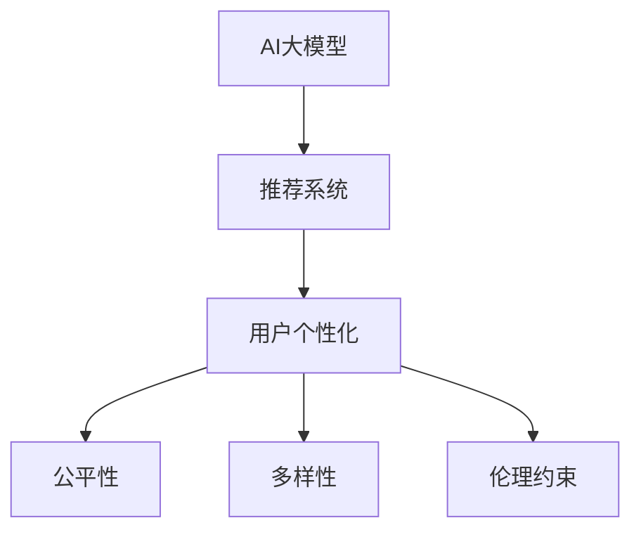

                 

# 推荐系统的公平性与多样性：AI大模型的伦理约束与优化

> 关键词：AI大模型，推荐系统，公平性，多样性，伦理约束，优化，用户个性化

## 1. 背景介绍

在过去数十年里，随着计算能力的增强和数据量的激增，人工智能（AI）和大数据技术在推荐系统中得到广泛应用。推荐系统（Recommendation System）通过分析用户行为数据，预测用户偏好，并提供个性化推荐，极大地提高了用户的满意度与业务价值。

然而，推荐系统的发展也带来了不少问题。一方面，数据隐私、广告欺诈、价格歧视等问题愈发严重，用户对AI伦理的担忧日益增长；另一方面，推荐系统越来越倾向展示大众化内容，忽略了长尾商品的推广，导致用户多元化需求难以得到满足，甚至加剧了社会分化。这些问题不仅影响用户体验，更危及AI系统的公平性与多样性。

本文旨在探索如何在基于AI大模型的推荐系统中实现公平性和多样性，并提出相关的伦理约束与优化策略。通过详细讨论算法原理与操作步骤，以及数学模型与公式推导，我们希望能为AI推荐系统的公平性与多样性问题提供一份全面的解答。

## 2. 核心概念与联系

### 2.1 核心概念概述

为更好地理解AI大模型在推荐系统中的应用，本节将介绍几个相关核心概念：

- AI大模型：基于大规模数据预训练的深度神经网络模型，能够提供高效、全面的数据分析能力。
- 推荐系统：通过学习用户行为数据，预测用户偏好，并提供个性化推荐的技术系统。
- 公平性：指推荐系统对所有用户一视同仁，不因性别、年龄、种族等因素产生偏见。
- 多样性：指推荐系统能平衡展示各类商品，满足用户多元化需求。
- 用户个性化：指推荐系统能根据用户的历史行为和兴趣，提供高度定制化的推荐。
- 伦理约束：指推荐系统在收集、使用、存储用户数据时需遵守的道德规范。

这些核心概念之间的关系可以通过以下Mermaid流程图来展示：



这个流程图展示了AI大模型在推荐系统中的应用框架：AI大模型为推荐系统提供了强大的数据分析能力，同时保证推荐系统的用户个性化、公平性和多样性，并在整个过程中遵循伦理约束。

## 3. 核心算法原理 & 具体操作步骤
### 3.1 算法原理概述

AI大模型在推荐系统中的应用主要基于用户行为数据分析。推荐系统通过收集用户历史行为数据，利用大模型分析用户兴趣，从而预测用户可能感兴趣的商品，并进行推荐。

核心算法主要包括以下几个步骤：

1. 数据收集与预处理：收集用户的历史行为数据，并对其进行清洗与预处理，以便于后续分析。
2. 特征工程：从用户行为数据中提取各类特征，如购买历史、浏览记录、评分等。
3. 模型训练：使用AI大模型进行训练，学习用户行为与商品推荐之间的映射关系。
4. 推荐生成：根据用户行为数据和模型预测，生成个性化推荐结果。
5. 反馈与优化：根据用户对推荐结果的反馈，不断优化推荐模型，提升推荐效果。

### 3.2 算法步骤详解

具体来说，基于AI大模型的推荐系统主要包括以下几个关键步骤：

**Step 1: 数据收集与预处理**

- 数据收集：从电商平台、社交网络等渠道收集用户的历史行为数据，如购买记录、浏览记录、评分、评价等。
- 数据清洗：对收集到的数据进行去重、去噪、填补缺失值等处理，确保数据质量。
- 数据标准化：对不同来源的数据进行标准化处理，以便统一进行分析。

**Step 2: 特征工程**

- 特征提取：从用户行为数据中提取各类特征，如购买历史、浏览记录、评分等。
- 特征选择：根据业务需求和模型特性，选择对推荐效果影响较大的特征。
- 特征编码：将特征转化为模型能够处理的数值形式，如独热编码、标准化等。

**Step 3: 模型训练**

- 选择模型：选择适合问题的模型，如矩阵分解、协同过滤、深度神经网络等。
- 数据分割：将数据集分为训练集、验证集和测试集。
- 训练模型：使用训练集训练模型，使用验证集调整模型参数。
- 模型评估：使用测试集评估模型性能，确定模型是否满足要求。

**Step 4: 推荐生成**

- 用户嵌入：使用AI大模型对用户行为数据进行分析，生成用户嵌入向量。
- 商品嵌入：使用AI大模型对商品数据进行分析，生成商品嵌入向量。
- 相似度计算：计算用户嵌入与商品嵌入之间的相似度，确定用户可能感兴趣的推荐商品。
- 推荐生成：根据相似度排序，生成个性化推荐结果。

**Step 5: 反馈与优化**

- 用户反馈：收集用户对推荐结果的反馈，如点击、购买、评分等。
- 模型优化：根据用户反馈调整模型参数，优化推荐效果。
- 模型更新：定期重新训练模型，确保推荐模型始终适应最新的数据分布。

### 3.3 算法优缺点

基于AI大模型的推荐系统具有以下优点：

1. 高效准确：AI大模型能够高效地处理大规模数据，准确地预测用户偏好。
2. 个性化推荐：通过用户行为数据分析，提供高度定制化的推荐，提升用户满意度。
3. 实时动态：AI大模型能够实时处理数据，快速响应用户需求。

然而，基于AI大模型的推荐系统也存在以下缺点：

1. 数据依赖：AI大模型的效果高度依赖于数据质量与数量，数据的偏见可能传递到推荐结果中。
2. 模型复杂：AI大模型的复杂度高，需要消耗大量计算资源，增加了系统开发与维护成本。
3. 公平性问题：AI大模型的决策过程难以解释，可能导致性别、年龄、种族等偏见。
4. 多样性不足：AI大模型倾向于展示大众化内容，忽略长尾商品的推广，可能导致用户多元化需求难以得到满足。

### 3.4 算法应用领域

基于AI大模型的推荐系统广泛应用于电子商务、社交媒体、视频平台等多个领域，如：

- 电商推荐：淘宝、京东等电商平台的个性化推荐，提高用户购买转化率。
- 视频推荐：Netflix、YouTube等视频平台的内容推荐，提升用户观看体验。
- 社交推荐：Facebook、Twitter等社交媒体平台的朋友推荐，增强用户互动。

除了上述这些经典应用外，AI大模型推荐系统还被创新性地应用到更多场景中，如智能医疗、智能家居、智能广告等，为各行各业带来新的突破。

## 4. 数学模型和公式 & 详细讲解 & 举例说明

### 4.1 数学模型构建

假设推荐系统收集到的用户行为数据为 $x_{ui}$，表示用户 $u$ 对商品 $i$ 的评分，其中 $u$ 为用户编号，$i$ 为商品编号。推荐系统的目标是通过训练模型 $y_{ui}=f(x_{ui})$，预测用户对商品的概率 $y_{ui}$，生成个性化推荐结果。

其中，$f$ 为AI大模型的映射函数，通常使用深度神经网络等非线性模型。模型的损失函数为交叉熵损失，定义如下：

$$
\mathcal{L}(f) = -\frac{1}{N}\sum_{i=1}^N \sum_{u=1}^N [y_{ui}\log f(x_{ui}) + (1-y_{ui})\log(1-f(x_{ui}))]
$$

### 4.2 公式推导过程

以下是推荐系统模型 $f(x_{ui})$ 的详细推导过程：

- 假设用户 $u$ 对商品 $i$ 的评分 $x_{ui}$ 是一个多维向量，表示为 $[x_{ui}^1, x_{ui}^2, ..., x_{ui}^d]$，其中 $d$ 为特征维度。
- 使用AI大模型 $M_{\theta}$ 对用户行为数据进行编码，得到用户嵌入向量 $h_u$ 和商品嵌入向量 $h_i$。
- 计算用户嵌入 $h_u$ 与商品嵌入 $h_i$ 的相似度，得到推荐得分 $s_{ui}=h_u^Th_i$。
- 将推荐得分 $s_{ui}$ 输入激活函数 $g$，得到用户对商品的预测概率 $y_{ui}=g(s_{ui})$。

推导过程如下：

$$
h_u = M_{\theta}(x_{ui})
$$

$$
s_{ui} = h_u^Th_i
$$

$$
y_{ui} = g(s_{ui})
$$

其中，$g$ 为激活函数，通常使用Sigmoid函数。最终损失函数为：

$$
\mathcal{L}(f) = -\frac{1}{N}\sum_{i=1}^N \sum_{u=1}^N [y_{ui}\log y_{ui} + (1-y_{ui})\log(1-y_{ui})]
$$

### 4.3 案例分析与讲解

假设有一个电商平台，收集到用户的历史购买记录 $x_{ui}$，其中 $u$ 为用户编号，$i$ 为商品编号。使用AI大模型对用户行为数据进行编码，得到用户嵌入向量 $h_u$ 和商品嵌入向量 $h_i$。模型使用Sigmoid函数进行预测，得到用户对商品的预测概率 $y_{ui}=g(s_{ui})$。最终损失函数为：

$$
\mathcal{L}(f) = -\frac{1}{N}\sum_{i=1}^N \sum_{u=1}^N [y_{ui}\log y_{ui} + (1-y_{ui})\log(1-y_{ui})]
$$

通过不断调整模型参数 $\theta$，最小化损失函数 $\mathcal{L}(f)$，得到最优模型 $f^*$。在测试集上评估模型效果，生成个性化推荐结果。

## 5. 项目实践：代码实例和详细解释说明

### 5.1 开发环境搭建

在进行推荐系统开发前，我们需要准备好开发环境。以下是使用Python进行PyTorch开发的环境配置流程：

1. 安装Anaconda：从官网下载并安装Anaconda，用于创建独立的Python环境。

2. 创建并激活虚拟环境：
```bash
conda create -n pytorch-env python=3.8 
conda activate pytorch-env
```

3. 安装PyTorch：根据CUDA版本，从官网获取对应的安装命令。例如：
```bash
conda install pytorch torchvision torchaudio cudatoolkit=11.1 -c pytorch -c conda-forge
```

4. 安装TensorFlow：如果需要使用TensorFlow，可以使用以下命令进行安装。
```bash
conda install tensorflow tensorflow-cpu -c conda-forge
```

5. 安装各类工具包：
```bash
pip install numpy pandas scikit-learn matplotlib tqdm jupyter notebook ipython
```

完成上述步骤后，即可在`pytorch-env`环境中开始推荐系统开发。

### 5.2 源代码详细实现

这里我们以电商平台个性化推荐为例，使用PyTorch实现推荐系统。

首先，定义推荐系统的数据集：

```python
import pandas as pd
import torch
from torch.utils.data import Dataset, DataLoader

class RecommendationDataset(Dataset):
    def __init__(self, data_path, num_features=10, num_users=1000, num_items=1000):
        self.data = pd.read_csv(data_path)
        self.num_features = num_features
        self.num_users = num_users
        self.num_items = num_items
        
    def __len__(self):
        return len(self.data)
    
    def __getitem__(self, item):
        x = self.data.iloc[item]
        x = x.values.reshape(1, -1)
        y = self.data.iloc[item][self.num_features:]
        return torch.FloatTensor(x), torch.tensor(y)
```

然后，定义推荐模型的超参数和模型结构：

```python
import torch.nn as nn
import torch.nn.functional as F

class RecommendationModel(nn.Module):
    def __init__(self, num_features=10, num_users=1000, num_items=1000, hidden_size=64, num_layers=1):
        super(RecommendationModel, self).__init__()
        self.num_features = num_features
        self.num_users = num_users
        self.num_items = num_items
        self.hidden_size = hidden_size
        self.num_layers = num_layers
        
        self.user_encoder = nn.Sequential(
            nn.Linear(num_features, hidden_size),
            nn.ReLU(),
            nn.Linear(hidden_size, hidden_size),
            nn.ReLU()
        )
        
        self.item_encoder = nn.Sequential(
            nn.Linear(num_features, hidden_size),
            nn.ReLU(),
            nn.Linear(hidden_size, hidden_size),
            nn.ReLU()
        )
        
        self.score_layer = nn.Linear(hidden_size, 1)
        
    def forward(self, x):
        user_embed = self.user_encoder(x)
        item_embed = self.item_encoder(x)
        score = self.score_layer(torch.cat([user_embed, item_embed], dim=1))
        return F.sigmoid(score)
```

接着，定义训练和评估函数：

```python
from torch.optim import Adam

def train_epoch(model, train_loader, optimizer):
    model.train()
    for batch in train_loader:
        x, y = batch
        optimizer.zero_grad()
        output = model(x)
        loss = F.binary_cross_entropy(output, y)
        loss.backward()
        optimizer.step()
    
def evaluate(model, test_loader):
    model.eval()
    correct = 0
    total = 0
    with torch.no_grad():
        for batch in test_loader:
            x, y = batch
            output = model(x)
            _, predicted = torch.max(output, dim=1)
            total += y.size(0)
            correct += (predicted == y).sum().item()
    
    print("Accuracy: {:.2f}%".format(correct/total * 100))
```

最后，启动训练流程并在测试集上评估：

```python
import torch
import torch.optim as optim

device = torch.device("cuda" if torch.cuda.is_available() else "cpu")

model = RecommendationModel().to(device)
optimizer = optim.Adam(model.parameters(), lr=0.001)

train_loader = DataLoader(RecommendationDataset("train.csv"), batch_size=32)
test_loader = DataLoader(RecommendationDataset("test.csv"), batch_size=32)

for epoch in range(10):
    train_epoch(model, train_loader, optimizer)
    evaluate(model, test_loader)
```

以上就是使用PyTorch实现推荐系统的完整代码实现。可以看到，在PyTorch的框架下，构建推荐系统相对简洁，能够快速迭代优化。

### 5.3 代码解读与分析

让我们再详细解读一下关键代码的实现细节：

**RecommendationDataset类**：
- `__init__`方法：初始化数据集，加载CSV文件，并进行特征拆分。
- `__len__`方法：返回数据集的样本数量。
- `__getitem__`方法：对单个样本进行处理，将特征转换为Tensor张量。

**RecommendationModel类**：
- `__init__`方法：初始化模型超参数和模型结构。
- `forward`方法：定义前向传播过程，使用用户嵌入和商品嵌入计算推荐得分。

**train_epoch和evaluate函数**：
- `train_epoch`函数：在训练集上训练模型，使用Adam优化器更新参数。
- `evaluate`函数：在测试集上评估模型，计算准确率。

**训练流程**：
- 定义模型、超参数和数据加载器。
- 在训练集上训练模型，每个epoch更新一次模型参数。
- 在测试集上评估模型性能，输出准确率。

## 6. 实际应用场景

### 6.1 电商平台个性化推荐

在电商平台中，个性化推荐系统能够帮助用户快速找到感兴趣的商品，提高购买转化率。基于AI大模型的推荐系统通过用户历史行为数据分析，生成个性化推荐结果。在实际应用中，电商推荐系统通常需要处理大规模数据，并对实时数据进行实时推荐，因此需要高效的推荐算法和优化策略。

### 6.2 视频平台内容推荐

视频平台如Netflix、YouTube等，通过推荐系统向用户推荐视频内容，提升观看体验。推荐系统根据用户历史观看记录、评分、评论等数据，预测用户可能感兴趣的视频内容，并进行推荐。为了应对大量用户和丰富多样的视频内容，视频平台通常采用多层次推荐策略，结合用户画像、视频标签等信息，实现精准推荐。

### 6.3 社交媒体朋友推荐

社交媒体平台如Facebook、Twitter等，通过推荐系统向用户推荐朋友，增强用户互动。推荐系统根据用户好友关系、互动记录等数据，预测用户可能感兴趣的新朋友，并进行推荐。为了提升推荐效果，社交媒体平台通常采用多维度特征融合、用户画像生成等技术手段，实现高效推荐。

### 6.4 未来应用展望

随着AI大模型的不断发展，基于AI大模型的推荐系统将在更多领域得到应用，为各行各业带来变革性影响：

- 智能医疗：推荐系统可向医生推荐相关医疗知识、治疗方案等，辅助诊疗决策。
- 智能家居：推荐系统可向用户推荐智能家居设备，提升生活便利性。
- 智能广告：推荐系统可向用户推荐个性化广告，提升广告投放效果。
- 智能金融：推荐系统可向用户推荐投资产品、理财方案等，优化资产配置。

此外，在企业生产、社会治理、文娱传媒等众多领域，基于AI大模型的推荐系统也将不断涌现，为经济社会发展注入新的动力。相信随着技术的日益成熟，推荐系统必将在更广阔的应用领域大放异彩。

## 7. 工具和资源推荐

### 7.1 学习资源推荐

为了帮助开发者系统掌握AI大模型在推荐系统中的应用，这里推荐一些优质的学习资源：

1. 《深度学习推荐系统》书籍：该书深入浅出地介绍了推荐系统的原理、算法、评估指标等内容，适合初学者入门。
2. CS231n《深度学习与数据结构》课程：斯坦福大学开设的推荐系统课程，内容丰富，涵盖推荐系统的各个方面。
3. Kaggle推荐系统竞赛：通过参加推荐系统竞赛，实际动手练习，提升推荐系统开发能力。
4. KDD 2021推荐系统顶级会议论文：学习最新的推荐系统研究成果，了解前沿技术。
5. Google Scholar推荐系统论文：谷歌提供的推荐系统论文资源，涵盖推荐系统各个方面。

通过对这些资源的学习实践，相信你一定能够快速掌握AI大模型在推荐系统中的应用，并用于解决实际的推荐问题。

### 7.2 开发工具推荐

高效的开发离不开优秀的工具支持。以下是几款用于AI大模型推荐系统开发的常用工具：

1. PyTorch：基于Python的开源深度学习框架，灵活动态的计算图，适合快速迭代研究。大多数推荐系统都有PyTorch版本的实现。
2. TensorFlow：由Google主导开发的开源深度学习框架，生产部署方便，适合大规模工程应用。同样有丰富的推荐系统资源。
3. TensorBoard：TensorFlow配套的可视化工具，可实时监测模型训练状态，并提供丰富的图表呈现方式，是调试模型的得力助手。
4.Weights & Biases：模型训练的实验跟踪工具，可以记录和可视化模型训练过程中的各项指标，方便对比和调优。
5. TensorFlow Hub：Google提供的推荐系统组件库，包含多种推荐模型和算法，方便复用和集成。
6. PyTorch Lightning：基于PyTorch的轻量级机器学习框架，支持快速构建推荐系统模型。

合理利用这些工具，可以显著提升推荐系统开发效率，加快创新迭代的步伐。

### 7.3 相关论文推荐

AI大模型和推荐系统的发展源于学界的持续研究。以下是几篇奠基性的相关论文，推荐阅读：

1. "Neural Collaborative Filtering"：提出基于深度神经网络的协同过滤推荐算法，在数据稀疏性问题上取得了突破。
2. "Matrix Factorization Techniques for Recommender Systems"：详细介绍矩阵分解推荐算法，是推荐系统领域的经典之作。
3. "Deep Factorization Machines"：提出深度因子机模型，利用深度神经网络提高推荐系统效果。
4. "Latent Dirichlet Allocation"：提出LDA主题模型，利用概率图模型提高推荐系统效果。
5. "Neural Recommendation Models"：系统介绍基于神经网络的推荐系统，涵盖深度神经网络、注意力机制等前沿技术。

这些论文代表了大模型在推荐系统领域的研究进展，通过学习这些前沿成果，可以帮助研究者把握学科前进方向，激发更多的创新灵感。

## 8. 总结：未来发展趋势与挑战

### 8.1 总结

本文对基于AI大模型的推荐系统进行了全面系统的介绍。首先阐述了AI大模型和推荐系统的研究背景和意义，明确了推荐系统在用户个性化、公平性和多样性等方面的重要价值。其次，从原理到实践，详细讲解了推荐系统的算法原理和操作步骤，给出了推荐系统开发的完整代码实例。同时，本文还广泛探讨了推荐系统在电商、视频、社交等领域的实际应用，展示了推荐系统技术的广泛应用前景。此外，本文精选了推荐系统的各类学习资源，力求为开发者提供全方位的技术指引。

通过本文的系统梳理，可以看到，基于AI大模型的推荐系统正在成为推荐领域的重要范式，极大地拓展了推荐系统的应用边界，催生了更多的落地场景。AI大模型在推荐系统中的应用，将使得推荐系统变得更加高效、精准和灵活，为各行各业带来新的机遇和挑战。

### 8.2 未来发展趋势

展望未来，AI大模型在推荐系统中的应用将呈现以下几个发展趋势：

1. 数据驱动：未来的推荐系统将更加依赖于数据驱动，通过大规模用户行为数据进行训练，不断优化推荐模型。
2. 用户画像：未来的推荐系统将更加注重用户画像，构建多维度用户画像，实现精准推荐。
3. 实时推荐：未来的推荐系统将更加注重实时性，通过实时数据进行实时推荐，提升用户体验。
4. 跨领域推荐：未来的推荐系统将更加注重跨领域推荐，结合不同领域的知识，实现跨领域协同推荐。
5. 多模态推荐：未来的推荐系统将更加注重多模态推荐，结合文本、图像、视频等多种数据模态，实现更全面的推荐。
6. 可解释性：未来的推荐系统将更加注重可解释性，通过模型可解释性技术，提升推荐系统的可信度和透明度。

这些趋势凸显了AI大模型在推荐系统中的应用前景。这些方向的探索发展，必将进一步提升推荐系统的性能和应用范围，为推荐系统技术带来新的突破。

### 8.3 面临的挑战

尽管AI大模型在推荐系统中的应用已经取得了瞩目成就，但在迈向更加智能化、普适化应用的过程中，仍面临不少挑战：

1. 数据隐私问题：AI大模型在推荐系统中需要处理大量用户数据，如何保护用户隐私，防止数据泄露，仍然是一个难题。
2. 算法公平性问题：AI大模型在推荐系统中可能存在性别、年龄、种族等偏见，如何确保算法公平性，仍需进一步研究和改进。
3. 推荐多样化问题：AI大模型在推荐系统中可能倾向于展示大众化内容，忽略长尾商品的推广，如何提升推荐多样化，仍需进一步优化。
4. 模型可解释性问题：AI大模型在推荐系统中通常作为"黑盒"系统，难以解释其内部工作机制和决策逻辑，如何增强模型的可解释性，仍需进一步探索。
5. 模型资源消耗问题：AI大模型在推荐系统中需要消耗大量计算资源和存储资源，如何优化模型结构，减少资源消耗，仍需进一步研究。
6. 模型稳定性问题：AI大模型在推荐系统中可能存在不稳定因素，如灾难性遗忘、对抗攻击等，如何提高模型的稳定性，仍需进一步改进。

正视推荐系统面临的这些挑战，积极应对并寻求突破，将是大模型在推荐系统中的未来重要研究方向。相信随着学界和产业界的共同努力，这些挑战终将一一被克服，AI大模型推荐系统必将在构建人机协同的智能时代中扮演越来越重要的角色。

### 8.4 研究展望

面对AI大模型在推荐系统中的应用，未来的研究需要在以下几个方面寻求新的突破：

1. 探索无监督和半监督推荐方法。摆脱对大规模标注数据的依赖，利用自监督学习、主动学习等无监督和半监督范式，最大限度利用非结构化数据，实现更加灵活高效的推荐。
2. 研究参数高效和计算高效的推荐范式。开发更加参数高效的推荐方法，在固定大部分预训练参数的同时，只更新极少量的任务相关参数。同时优化推荐模型的计算图，减少前向传播和反向传播的资源消耗，实现更加轻量级、实时性的部署。
3. 引入更多先验知识。将符号化的先验知识，如知识图谱、逻辑规则等，与神经网络模型进行巧妙融合，引导推荐过程学习更准确、合理的推荐知识。同时加强不同模态数据的整合，实现视觉、语音等多模态信息与文本信息的协同建模。
4. 结合因果分析和博弈论工具。将因果分析方法引入推荐模型，识别出推荐决策的关键特征，增强推荐输出的因果性和逻辑性。借助博弈论工具刻画人机交互过程，主动探索并规避推荐的脆弱点，提高系统稳定性。
5. 纳入伦理道德约束。在推荐系统训练目标中引入伦理导向的评估指标，过滤和惩罚有偏见、有害的推荐输出。同时加强人工干预和审核，建立推荐行为的监管机制，确保推荐结果符合人类价值观和伦理道德。

这些研究方向的探索，必将引领AI大模型推荐系统迈向更高的台阶，为构建安全、可靠、可解释、可控的智能系统铺平道路。面向未来，AI大模型推荐系统还需要与其他人工智能技术进行更深入的融合，如知识表示、因果推理、强化学习等，多路径协同发力，共同推动推荐系统技术的进步。只有勇于创新、敢于突破，才能不断拓展推荐系统的边界，让智能技术更好地造福人类社会。

## 9. 附录：常见问题与解答

**Q1：推荐系统如何平衡个性化与多样性？**

A: 推荐系统通常采用多臂老虎机模型（Multi-Armed Bandit）或强化学习等方法，平衡个性化与多样性。具体来说，可以通过以下方式实现：

1. 多目标优化：将个性化推荐和多样性推荐作为两个目标，设计多目标优化算法进行平衡。
2. 反馈调整：根据用户反馈调整推荐策略，优化推荐结果。例如，对于用户不感兴趣的推荐结果，可以适当降低其展示频率。
3. 模型扩展：引入更丰富的特征和更多元的模型，如协同过滤、内容推荐、混合模型等，提升推荐多样性。
4. 数据增强：通过数据增强技术，扩充训练集，提升推荐多样性。例如，对用户行为数据进行反转、轮换等处理。

通过这些方法，可以在保证个性化推荐的同时，提升推荐多样性，满足用户多元化需求。

**Q2：推荐系统如何防止推荐算法中的偏见？**

A: 推荐系统中的偏见问题可以通过以下方式解决：

1. 数据平衡：在训练数据中引入性别、年龄、种族等标签，确保数据平衡，避免模型偏见。
2. 特征选择：在特征选择过程中，避免使用可能存在偏见的数据特征。例如，避免使用用户的性别、种族等敏感特征。
3. 模型监控：在推荐系统中引入监控机制，实时检测推荐结果中的偏见。例如，通过模型诊断工具，检测模型是否存在性别、年龄等偏见。
4. 模型调整：在推荐系统中引入调整机制，对有偏见的部分进行调整。例如，对于有性别偏见的推荐结果，可以调整模型参数，减少性别偏见的输出。

通过这些方法，可以有效地防止推荐系统中的偏见问题，提升推荐系统的公平性。

**Q3：推荐系统如何保护用户隐私？**

A: 推荐系统中的用户隐私问题可以通过以下方式解决：

1. 数据匿名化：在数据收集和存储过程中，对用户数据进行匿名化处理，保护用户隐私。
2. 差分隐私：在数据收集和处理过程中，引入差分隐私技术，保护用户隐私。例如，对用户数据进行添加噪声处理。
3. 用户授权：在数据使用过程中，征得用户授权，保护用户隐私。例如，明确告知用户数据使用目的，获得用户同意。
4. 数据加密：在数据传输和存储过程中，对用户数据进行加密处理，保护用户隐私。

通过这些方法，可以有效地保护用户隐私，提升推荐系统的可信度。

**Q4：推荐系统如何提高模型的可解释性？**

A: 推荐系统中的模型可解释性问题可以通过以下方式解决：

1. 特征可视化：在推荐系统中引入可视化工具，帮助用户理解模型的决策过程。例如，通过特征重要性排序，展示对推荐结果影响较大的特征。
2. 模型诊断：在推荐系统中引入诊断工具，检测模型的内部工作机制。例如，通过模型诊断工具，检测模型是否存在错误或异常。
3. 透明算法：在推荐系统中引入透明算法，提升模型的可解释性。例如，使用逻辑回归、线性模型等透明算法，便于解释模型的决策过程。
4. 用户反馈：在推荐系统中引入用户反馈机制，收集用户对推荐结果的评价，优化推荐模型。例如，通过用户反馈，调整模型参数，优化推荐结果。

通过这些方法，可以有效地提高推荐系统的可解释性，提升用户的信任感和满意度。

**Q5：推荐系统如何提高模型的稳定性？**

A: 推荐系统中的模型稳定性问题可以通过以下方式解决：

1. 数据清洗：在数据处理过程中，对数据进行清洗和预处理，提高数据质量。例如，对数据进行去重、去噪、填补缺失值等处理。
2. 模型正则化：在模型训练过程中，引入正则化技术，防止过拟合。例如，使用L2正则、Dropout等正则化技术。
3. 模型监控：在推荐系统中引入监控机制，实时检测模型的稳定性。例如，通过模型诊断工具，检测模型是否存在异常。
4. 模型调整：在推荐系统中引入调整机制，对有问题的部分进行调整。例如，对于存在异常的部分，可以调整模型参数，优化模型性能。

通过这些方法，可以有效地提高推荐系统的稳定性，提升推荐效果。

---

作者：禅与计算机程序设计艺术 / Zen and the Art of Computer Programming

