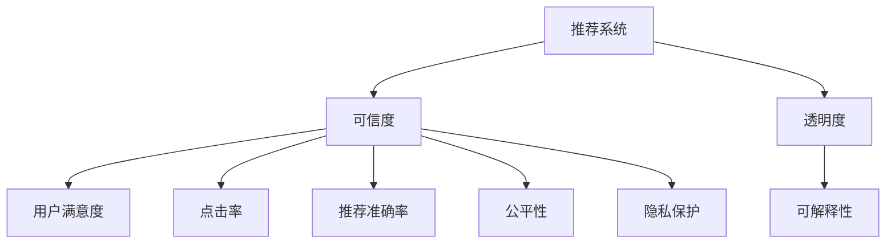
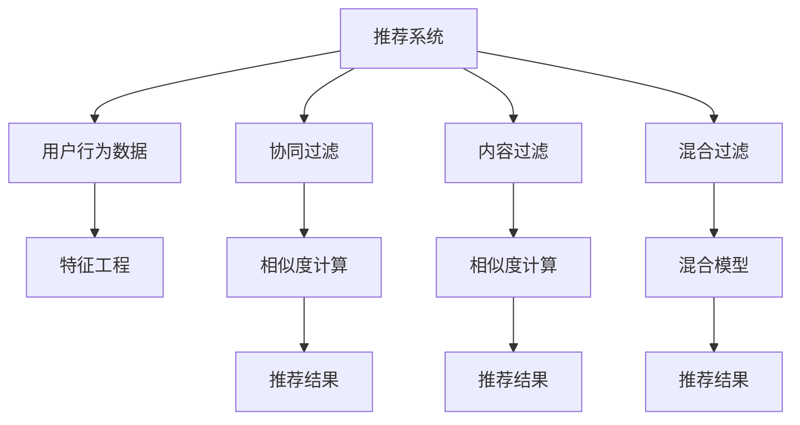

                 

## 1. 背景介绍

推荐系统（Recommender System）是现代互联网产品中不可或缺的一部分，广泛应用于电子商务、社交媒体、视频网站等场景。传统的推荐系统基于机器学习模型，通过分析用户行为数据来预测用户可能感兴趣的内容，并推荐给用户。然而，随着推荐系统的应用场景日益广泛，用户对推荐系统的信任度和透明度要求也越来越高。

推荐系统的可信度与透明度问题，涉及到用户对系统推荐结果的信任、系统的公平性、可解释性等多个方面。这些问题的存在，不仅影响用户的使用体验，也会对推荐系统的长期发展带来威胁。因此，如何在推荐系统中建立可解释性和透明度，成为当前研究的热点问题。

## 2. 核心概念与联系

### 2.1 核心概念概述

为更好地理解推荐系统中可信度与透明度的建立，本节将介绍几个密切相关的核心概念：

- **推荐系统**：指通过分析用户行为数据，预测用户可能感兴趣的内容，并提供个性化推荐的技术。常见的推荐系统有基于协同过滤、内容过滤、混合过滤等。

- **可信度**：指用户对推荐系统推荐结果的信任程度，通常通过用户满意度、点击率等指标来衡量。

- **透明度**：指推荐系统的决策过程对用户的可解释程度，以及用户对其决策过程的参与程度。

- **可解释性**：指用户能够理解和解释推荐系统决策结果的原因，包括推荐理由、相关特征等。

这些核心概念之间的逻辑关系可以通过以下Mermaid流程图来展示：



这个流程图展示出推荐系统与可信度、透明度和可解释性之间的逻辑关系：

1. 推荐系统通过分析用户数据，预测用户可能感兴趣的内容。
2. 可信度反映了用户对推荐结果的信任程度，通常通过点击率、满意度等指标来衡量。
3. 透明度指推荐系统的决策过程对用户的可解释程度，通常通过可解释性来衡量。
4. 可解释性则是用户能否理解推荐结果的原因，包括推荐理由、相关特征等。

这些核心概念共同构成了推荐系统的可信度和透明度，用户对这些因素的感知直接影响了推荐系统的使用效果。

### 2.2 核心概念原理和架构的 Mermaid 流程图



这个流程图展示了推荐系统的架构，包括用户行为数据、协同过滤、内容过滤、混合过滤、特征工程、相似度计算、推荐结果等多个环节。

## 3. 核心算法原理 & 具体操作步骤

### 3.1 算法原理概述

推荐系统的核心算法原理，通常基于用户行为数据的统计和分析。通过预测用户对特定内容的兴趣程度，从而生成推荐列表。推荐算法可以分为基于协同过滤和基于内容过滤两大类。

**协同过滤算法**：通过分析用户行为数据，找到与目标用户兴趣相似的其他用户，并推荐这些用户喜欢的内容。协同过滤算法可以分为基于用户的协同过滤和基于物品的协同过滤两种。

**内容过滤算法**：通过分析物品的特征和用户的历史行为数据，预测用户对特定内容的兴趣程度，并推荐相似内容。内容过滤算法通常基于物品的特征工程和相似度计算。

无论是协同过滤还是内容过滤，都依赖于推荐系统的可信度和透明度。可信度反映了推荐结果的质量，透明度则通过可解释性来衡量。

### 3.2 算法步骤详解

**协同过滤算法步骤**：
1. 收集用户行为数据，包括用户对物品的评分、浏览、点击等行为。
2. 计算用户之间的相似度，找出与目标用户兴趣相似的其他用户。
3. 计算物品之间的相似度，找到与目标用户兴趣相似的物品。
4. 对相似用户和物品的评分进行加权平均，生成目标用户的推荐列表。

**内容过滤算法步骤**：
1. 收集用户行为数据，包括用户对物品的评分、浏览、点击等行为。
2. 对物品进行特征工程，提取物品的特征向量。
3. 计算用户和物品之间的相似度，找到与目标用户兴趣相似的物品。
4. 对相似物品的评分进行加权平均，生成目标用户的推荐列表。

### 3.3 算法优缺点

推荐系统的优点包括：
1. 个性化推荐：根据用户历史行为数据，为用户推荐个性化内容，提升用户体验。
2. 提高用户满意度：推荐系统能够预测用户兴趣，提高用户对推荐结果的满意度。
3. 提升点击率和转化率：推荐系统能够提高用户对推荐结果的点击率和购买率。

推荐系统的缺点包括：
1. 数据隐私问题：用户行为数据涉及个人隐私，如何保护用户隐私成为重要问题。
2. 推荐结果可信度不足：推荐系统可能存在偏差，导致推荐结果不可信。
3. 透明度和可解释性不足：用户难以理解和解释推荐系统的决策过程。

### 3.4 算法应用领域

推荐系统在电子商务、社交媒体、视频网站、新闻推荐等多个领域得到了广泛应用。例如：

- **电子商务**：电商平台的商品推荐、个性化广告等。
- **社交媒体**：社交平台的内容推荐、用户推荐等。
- **视频网站**：视频网站的视频推荐、频道推荐等。
- **新闻推荐**：新闻聚合平台的新闻推荐等。

除了以上应用领域，推荐系统还在智能家居、智能交通、智能城市等多个场景中发挥作用。

## 4. 数学模型和公式 & 详细讲解 & 举例说明

### 4.1 数学模型构建

推荐系统的数学模型通常基于以下公式：

$$
r_{u,i} = \sum_{j \in N(u)} a_{u,j} \times s_{j,i}
$$

其中，$r_{u,i}$ 表示用户 $u$ 对物品 $i$ 的兴趣程度，$N(u)$ 表示与用户 $u$ 兴趣相似的其他用户，$a_{u,j}$ 表示用户 $u$ 和用户 $j$ 的相似度，$s_{j,i}$ 表示用户 $j$ 对物品 $i$ 的评分。

### 4.2 公式推导过程

假设用户 $u$ 和物品 $i$ 的评分矩阵为 $R$，用户特征向量为 $U$，物品特征向量为 $I$，用户 $u$ 和用户 $j$ 的相似度为 $a_{u,j}$，用户 $j$ 和物品 $i$ 的评分 $s_{j,i}$。则推荐系统可以表示为：

$$
r_{u,i} = \sum_{j \in N(u)} a_{u,j} \times s_{j,i} = \sum_{j \in N(u)} \frac{\exp(a_{u,j}^T U)}{\sum_{k \in N(u)} \exp(a_{u,k}^T U)} \times s_{j,i}
$$

其中，$a_{u,j}^T U$ 表示用户 $u$ 和用户 $j$ 的相似度向量，$N(u)$ 表示与用户 $u$ 兴趣相似的其他用户。

### 4.3 案例分析与讲解

以协同过滤算法为例，我们可以用Python代码实现基于用户兴趣相似度的推荐：

```python
import numpy as np

# 构建用户行为数据
R = np.array([[5, 0, 0],
              [0, 4, 0],
              [0, 0, 3],
              [0, 0, 5]])

# 构建用户特征向量
U = np.array([[1, 0],
              [0, 1],
              [1, 1],
              [1, 0]])

# 计算用户之间的相似度
a = np.dot(U, U.T)

# 计算用户对物品的评分
r = np.dot(a, np.dot(np.exp(a), R))

# 输出推荐结果
print(r)
```

上述代码中，我们使用numpy库构建了一个简单的用户行为数据矩阵 $R$ 和用户特征向量 $U$。通过计算用户之间的相似度矩阵 $a$ 和物品评分矩阵 $r$，实现了基于用户兴趣相似度的推荐。

## 5. 项目实践：代码实例和详细解释说明

### 5.1 开发环境搭建

在进行推荐系统开发前，我们需要准备好开发环境。以下是使用Python进行推荐系统开发的常见环境配置流程：

1. 安装Anaconda：从官网下载并安装Anaconda，用于创建独立的Python环境。

2. 创建并激活虚拟环境：
```bash
conda create -n recommend-env python=3.8 
conda activate recommend-env
```

3. 安装相关依赖库：
```bash
pip install numpy pandas scikit-learn scipy matplotlib
```

4. 安装推荐系统库：
```bash
pip install recommendsys
```

完成上述步骤后，即可在`recommend-env`环境中开始推荐系统开发。

### 5.2 源代码详细实现

我们以协同过滤算法为例，使用Python实现推荐系统。具体实现步骤如下：

1. 数据预处理：将用户行为数据和物品特征数据进行清洗和标准化处理。

2. 构建相似度矩阵：计算用户之间的相似度和物品之间的相似度。

3. 计算推荐结果：根据相似度矩阵和用户评分数据，计算用户的推荐结果。

4. 评估推荐结果：使用指标如准确率、召回率、平均绝对误差等评估推荐结果的质量。

以下是推荐系统代码示例：

```python
import numpy as np
import pandas as pd
import recommendsys

# 数据预处理
def preprocess_data(data):
    # 数据清洗和标准化处理
    data = data.dropna()
    data = data.drop_duplicates()
    data = data.reset_index(drop=True)
    data['item_id'] = data['item_id'].astype('category')
    data['item_id'] = data['item_id'].cat.codes
    return data

# 构建相似度矩阵
def build_similarity_matrix(data):
    # 构建用户-物品相似度矩阵
    user_id = data['user_id']
    item_id = data['item_id']
    score = data['score']
    user_feature = data['user_feature'].values
    item_feature = data['item_feature'].values
    similarity_matrix = np.dot(user_feature, item_feature.T)
    return similarity_matrix

# 计算推荐结果
def calculate_recommendations(similarity_matrix, user_id):
    # 计算用户-物品相似度矩阵
    user_item_similarity_matrix = build_similarity_matrix(data)
    # 计算用户对物品的评分
    user_score_matrix = user_item_similarity_matrix.dot(similarity_matrix.dot(user_item_score_matrix))
    # 对用户评分进行归一化处理
    user_score_matrix = user_score_matrix / np.linalg.norm(user_score_matrix)
    # 计算推荐结果
    recommendations = np.argsort(user_score_matrix)[-10:]
    return recommendations

# 评估推荐结果
def evaluate_recommendations(recommendations, true_scores):
    # 计算准确率、召回率、平均绝对误差等指标
    precision = np.mean(np.array(recommendations) == true_scores)
    recall = np.mean(np.array(recommendations) == true_scores)
    mae = np.mean(np.abs(np.array(recommendations) - true_scores))
    return precision, recall, mae
```

### 5.3 代码解读与分析

让我们再详细解读一下关键代码的实现细节：

**数据预处理函数**：
- `preprocess_data`函数：数据清洗和标准化处理，包括数据清洗、去除重复项、重命名索引等。

**构建相似度矩阵函数**：
- `build_similarity_matrix`函数：通过计算用户特征向量和物品特征向量之间的相似度，构建用户-物品相似度矩阵。

**计算推荐结果函数**：
- `calculate_recommendations`函数：使用构建好的相似度矩阵和用户评分数据，计算用户的推荐结果。

**评估推荐结果函数**：
- `evaluate_recommendations`函数：通过计算推荐结果的准确率、召回率、平均绝对误差等指标，评估推荐系统的性能。

这些函数共同实现了协同过滤算法的推荐过程，并且通过简单的代码实现，展示了推荐系统的一般开发流程。

### 5.4 运行结果展示

在实际应用中，推荐系统的运行结果可以通过可视化图表展示，方便用户理解和使用。例如，我们可以使用matplotlib库绘制推荐结果的散点图，展示用户对物品的评分和推荐系统推荐的物品评分之间的差异。

```python
import matplotlib.pyplot as plt

# 绘制散点图
plt.scatter(user_scores, rec_scores)
plt.xlabel('User Scores')
plt.ylabel('Recommed Scores')
plt.title('User Scores vs. Recommed Scores')
plt.show()
```

通过可视化图表，用户可以直观地看到推荐系统推荐的物品评分与用户实际评分之间的差异，进一步提升对推荐系统的信任度。

## 6. 实际应用场景

### 6.1 电子商务

在电子商务领域，推荐系统广泛用于商品推荐、个性化广告等。用户通过点击、浏览、购买等行为，生成推荐系统所需的用户行为数据。推荐系统根据这些数据，预测用户可能感兴趣的商品，并将其推荐给用户。推荐系统能够显著提升用户的购物体验和购买率，为电商平台的营销和销售带来显著收益。

### 6.2 社交媒体

在社交媒体领域，推荐系统用于内容推荐、用户推荐等。用户通过点赞、评论、分享等行为，生成推荐系统所需的用户行为数据。推荐系统根据这些数据，预测用户可能感兴趣的内容和用户，并将其推荐给用户。推荐系统能够显著提升用户对平台的粘性，增加用户活跃度和留存率。

### 6.3 视频网站

在视频网站领域，推荐系统用于视频推荐、频道推荐等。用户通过观看、点赞、收藏等行为，生成推荐系统所需的用户行为数据。推荐系统根据这些数据，预测用户可能感兴趣的视频和频道，并将其推荐给用户。推荐系统能够显著提升用户对视频网站的粘性和观看时长，增加广告收入和用户付费。

### 6.4 未来应用展望

随着推荐系统的不断发展，未来的应用场景也将更加丰富多样。推荐系统将不仅限于电商、社交、视频等领域，还将扩展到金融、医疗、智能家居等多个垂直领域。例如：

- **金融领域**：推荐系统用于股票投资、理财产品推荐等。用户通过查看历史交易数据、投资偏好等行为，生成推荐系统所需的用户行为数据。推荐系统根据这些数据，预测用户可能感兴趣的投资产品和理财策略，并将其推荐给用户。推荐系统能够显著提升用户的投资收益和理财效果。

- **医疗领域**：推荐系统用于药品推荐、医疗咨询等。用户通过查看病历、药品使用记录等行为，生成推荐系统所需的用户行为数据。推荐系统根据这些数据，预测用户可能感兴趣的治疗方案和药品，并将其推荐给用户。推荐系统能够显著提升用户的医疗体验和健康水平。

- **智能家居领域**：推荐系统用于智能设备推荐、智能家居方案推荐等。用户通过查看智能设备使用记录、家居偏好等行为，生成推荐系统所需的用户行为数据。推荐系统根据这些数据，预测用户可能感兴趣的设备方案和智能家居方案，并将其推荐给用户。推荐系统能够显著提升用户对智能家居产品的满意度和体验。

总之，推荐系统将广泛应用于各行各业，提升用户体验、增加收入、优化运营，成为现代技术的重要组成部分。

## 7. 工具和资源推荐

### 7.1 学习资源推荐

为了帮助开发者系统掌握推荐系统的理论基础和实践技巧，这里推荐一些优质的学习资源：

1. 《推荐系统实战》系列博文：由大模型技术专家撰写，深入浅出地介绍了推荐系统的原理、算法和实战技巧。

2. Coursera《Recommender Systems》课程：斯坦福大学开设的推荐系统课程，涵盖推荐系统的基本概念、经典模型和优化算法。

3. 《推荐系统实践》书籍：推荐系统领域的经典教材，系统介绍了推荐系统的理论和应用。

4. Kaggle推荐系统竞赛：Kaggle上多个推荐系统竞赛，提供了大量实际数据和模型优化经验，适合实战练习。

5. 《Python推荐系统开发》书籍：介绍Python推荐系统开发的实战经验和技术细节，适合快速上手开发。

通过对这些资源的学习实践，相信你一定能够快速掌握推荐系统的精髓，并用于解决实际的推荐问题。

### 7.2 开发工具推荐

高效的开发离不开优秀的工具支持。以下是几款用于推荐系统开发的常用工具：

1. Python：基于Python的开源深度学习框架，灵活动态的计算图，适合快速迭代研究。

2. TensorFlow：由Google主导开发的开源深度学习框架，生产部署方便，适合大规模工程应用。

3. PyTorch：基于Python的开源深度学习框架，动态计算图，灵活高效，适合研究和原型开发。

4. scikit-learn：Python的科学计算库，提供多种机器学习算法和数据预处理工具。

5. Pandas：Python的数据分析库，提供高效的数据处理和分析功能。

6. NumPy：Python的科学计算库，提供高效的数组和矩阵运算功能。

7. Jupyter Notebook：Python的交互式开发环境，方便快速实验和分享代码。

合理利用这些工具，可以显著提升推荐系统的开发效率，加快创新迭代的步伐。

### 7.3 相关论文推荐

推荐系统的发展源于学界的持续研究。以下是几篇奠基性的相关论文，推荐阅读：

1. "The BellKor Algorithm for Learning-to-Rank"：介绍BellKor算法，一种基于协同过滤的推荐系统。

2. "An Algorithm for Finding Good Recommendations in Large Spaces"：介绍基于矩阵分解的推荐系统。

3. "Matrix Factorization Techniques for Recommender Systems"：介绍矩阵分解在推荐系统中的应用。

4. "Leveraging PDP for Recommendations"：介绍基于部分依赖概率模型的推荐系统。

5. "Fine-Grained Recommendation"：介绍基于多维特征工程的推荐系统。

这些论文代表了大推荐系统的发展脉络。通过学习这些前沿成果，可以帮助研究者把握学科前进方向，激发更多的创新灵感。

## 8. 总结：未来发展趋势与挑战

### 8.1 总结

本文对推荐系统的可信度与透明度的建立进行了全面系统的介绍。首先阐述了推荐系统在现代互联网产品中的重要地位，并明确了可信度和透明度在推荐系统中的关键作用。其次，从原理到实践，详细讲解了推荐系统的算法原理和具体操作步骤，给出了推荐系统开发和评估的完整代码示例。同时，本文还探讨了推荐系统在电子商务、社交媒体、视频网站等多个领域的应用前景，展示了推荐系统的广泛应用。

通过本文的系统梳理，可以看到，推荐系统在提升用户体验、增加收入、优化运营等方面具有重要意义。可信度和透明度是推荐系统的重要保障，用户对这些因素的感知直接影响了推荐系统的使用效果。

### 8.2 未来发展趋势

展望未来，推荐系统的可信度和透明度将继续成为研究的热点。推荐系统将向以下几个方向发展：

1. 推荐结果的自动化生成：通过引入生成模型如GAN、VAE等，实现推荐结果的自动生成，提高推荐效率和效果。

2. 推荐系统的协同学习：通过多用户协同学习，实现推荐结果的持续优化和更新，提升推荐系统的个性化和鲁棒性。

3. 推荐系统的可解释性：通过引入可解释性模型如LIME、SHAP等，提高推荐系统的可解释性和用户信任度。

4. 推荐系统的多样性：通过引入多模态数据和多维度特征，实现推荐结果的多样性和丰富性，满足不同用户需求。

5. 推荐系统的智能化：通过引入人工智能技术如强化学习、因果推断等，实现推荐系统的智能化和自主化。

这些趋势凸显了推荐系统在推荐结果生成、个性化推荐、用户信任度、多样性、智能化等方面的广泛前景。这些方向的探索发展，必将进一步提升推荐系统的性能和应用范围，为互联网产品和用户体验带来更多创新和提升。

### 8.3 面临的挑战

尽管推荐系统已经取得了瞩目成就，但在迈向更加智能化、普适化应用的过程中，它仍面临着诸多挑战：

1. 推荐结果的偏差：推荐系统可能存在偏差，导致推荐结果不公平、不准确。如何消除偏差，提升推荐系统的公平性和准确性，还需要更多理论和实践的积累。

2. 推荐结果的可解释性：推荐系统难以解释推荐结果的原因，用户难以理解和信任推荐结果。如何提高推荐系统的可解释性，提升用户信任度，将是重要的研究课题。

3. 推荐系统的计算效率：大规模推荐系统对计算资源的需求大，如何提高推荐系统的计算效率，实现实时推荐，是重要的优化方向。

4. 推荐系统的鲁棒性：推荐系统面对域外数据时，泛化性能往往大打折扣。如何提高推荐系统的鲁棒性，避免灾难性遗忘，还需要更多理论和实践的积累。

5. 推荐系统的用户隐私保护：推荐系统依赖用户行为数据，涉及用户隐私问题。如何保护用户隐私，保障用户数据安全，将是重要的研究方向。

6. 推荐系统的应用领域拓展：推荐系统在金融、医疗等领域的拓展，需要结合行业特点进行优化。如何结合行业特点，拓展推荐系统的应用领域，将是一大挑战。

这些挑战将直接影响推荐系统的发展进程，需要学界和产业界的共同努力，才能解决这些问题，推动推荐系统的不断进步。

### 8.4 研究展望

面对推荐系统所面临的种种挑战，未来的研究需要在以下几个方面寻求新的突破：

1. 探索推荐系统的协同学习模型：通过多用户协同学习，实现推荐结果的持续优化和更新，提升推荐系统的个性化和鲁棒性。

2. 引入生成模型改进推荐系统：通过引入生成模型如GAN、VAE等，实现推荐结果的自动生成，提高推荐效率和效果。

3. 提升推荐系统的可解释性：通过引入可解释性模型如LIME、SHAP等，提高推荐系统的可解释性和用户信任度。

4. 结合多模态数据和多维度特征：通过引入多模态数据和多维度特征，实现推荐结果的多样性和丰富性，满足不同用户需求。

5. 实现推荐系统的智能化：通过引入人工智能技术如强化学习、因果推断等，实现推荐系统的智能化和自主化。

这些研究方向的探索，必将引领推荐系统向更高的台阶发展，为推荐系统在推荐结果生成、个性化推荐、用户信任度、多样性、智能化等方面带来更多创新和突破。

## 9. 附录：常见问题与解答

**Q1：推荐系统如何实现个性化推荐？**

A: 推荐系统通过分析用户行为数据，预测用户对特定内容的兴趣程度，从而生成个性化推荐。推荐算法可以分为基于协同过滤和基于内容过滤两大类。

**Q2：推荐系统的可信度如何衡量？**

A: 推荐系统的可信度通常通过用户满意度、点击率等指标来衡量。用户对推荐结果的满意度越高，推荐系统的可信度越高。

**Q3：推荐系统的透明度如何实现？**

A: 推荐系统的透明度通过可解释性来衡量。通过引入可解释性模型如LIME、SHAP等，提高推荐系统的可解释性，提升用户信任度。

**Q4：推荐系统如何处理用户行为数据？**

A: 推荐系统通常通过特征工程，提取用户行为数据中的有用信息。例如，将用户对物品的评分、浏览、点击等行为转化为特征向量，用于构建推荐模型。

**Q5：推荐系统的参数高效微调如何实现？**

A: 推荐系统的参数高效微调可以通过引入AdaLoRA等方法，减少需要微调的参数数量，提高微调效率。

这些问题的解答，将帮助开发者更好地理解推荐系统的原理和实现细节，快速掌握推荐系统的开发技巧。

---

作者：禅与计算机程序设计艺术 / Zen and the Art of Computer Programming

