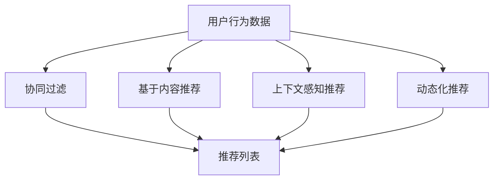

                 

# 推荐系统的多样性：AI大模型的新思路

> 关键词：AI大模型,推荐系统,多样性,知识图谱,深度学习,协同过滤,神经网络,动态化推荐,上下文感知

## 1. 背景介绍

### 1.1 问题由来
推荐系统是现代信息时代不可或缺的关键技术之一，它能够帮助用户在海量数据中发现感兴趣的信息。传统推荐系统通常基于用户行为数据进行，通过协同过滤、基于内容的推荐等方法，为用户生成个性化推荐列表。然而，随着用户数据分布的多样性和信息环境的复杂性，传统的推荐方法已经难以适应实际需求。

与此同时，人工智能大模型的兴起为推荐系统的进步带来了新的契机。基于大模型的推荐系统能够更好地理解用户的个性化需求，实现从海量数据中挖掘出深层模式，从而生成更具多样性和灵活性的推荐内容。本文将重点讨论如何通过AI大模型提升推荐系统的多样性，使推荐系统更加贴近用户需求，提升用户体验。

### 1.2 问题核心关键点
推荐系统多样性提升的核心关键点在于如何利用大模型更好地理解用户需求、挖掘数据模式，并实现个性化推荐。具体来说：

- 个性化需求：用户的行为、偏好、历史数据等，是推荐系统的基础输入。
- 数据模式挖掘：从用户行为数据中提取模式，生成推荐内容。
- 上下文感知：用户的环境、时间、位置等因素，对推荐结果有重要影响。
- 动态化推荐：用户需求和环境的变化，要求推荐系统能够实时调整推荐内容。

本文将从理论基础到技术实践，全面探讨如何通过AI大模型增强推荐系统的多样性，提升推荐质量。

## 2. 核心概念与联系

### 2.1 核心概念概述

推荐系统：基于用户行为数据和商品属性，通过算法为用户生成个性化推荐列表的技术。

AI大模型：以深度学习算法为基础，通过大规模数据预训练，学习通用或特定领域的知识，并应用于各类AI任务的大模型。

协同过滤：基于用户行为数据和相似度计算，推荐相似用户或物品的推荐方法。

基于内容推荐：基于物品属性和用户历史行为，生成推荐列表的方法。

上下文感知推荐：考虑用户的环境、时间等因素，动态调整推荐策略。

动态化推荐：根据用户需求和环境的变化，实时调整推荐内容。

### 2.2 核心概念原理和架构的 Mermaid 流程图



这个流程图展示了推荐系统的主要组成部分及其之间的关系：

1. 用户行为数据是推荐系统的基础。
2. 协同过滤、基于内容推荐、上下文感知推荐、动态化推荐是推荐系统的核心算法。
3. 各类推荐方法共同作用，生成最终的个性化推荐列表。

## 3. 核心算法原理 & 具体操作步骤
### 3.1 算法原理概述

AI大模型在推荐系统中的应用，主要通过预训练和微调两种方式实现。具体来说，利用大模型对用户行为数据进行预训练，学习通用的语言、行为模式，并在推荐任务上对其进行微调，以适应特定领域的需求。

### 3.2 算法步骤详解

#### 3.2.1 预训练过程

AI大模型预训练通常使用大规模无标签数据，如中文维基百科、新闻语料等，通过自监督学习任务，学习语言的通用表示。以BERT为例，其预训练过程包括两步：

1. 掩码语言模型（Masked Language Modeling, MLM）：随机掩码输入文本的一部分单词，让模型预测被掩码单词，学习词语之间的关系。
2. 下一句预测（Next Sentence Prediction, NSP）：随机对两个句子进行连接，让模型判断它们是否是连续的，学习句子之间的关系。

预训练后的模型，已经具备强大的语言理解能力，可以用于推荐系统的知识库构建。

#### 3.2.2 微调过程

在预训练后，将大模型应用于推荐系统的特定任务上，进行微调。微调过程通常包括以下步骤：

1. 数据准备：准备推荐系统的标注数据集，包括用户行为数据、商品属性、标签等。
2. 任务适配：设计合适的输出层和损失函数，适配推荐任务的需求。
3. 模型初始化：使用预训练模型作为初始化参数，降低微调难度。
4. 模型微调：使用标注数据集进行有监督的梯度训练，优化模型参数。
5. 评估和部署：在测试集上评估模型性能，集成到实际应用系统中。

#### 3.2.3 实际微调流程示例

以商品推荐系统为例，微调过程如下：

1. 准备标注数据：从电商平台收集用户购买记录和商品属性数据，构建标注数据集。
2. 模型初始化：使用预训练好的BERT模型，保留所有参数。
3. 任务适配：添加全连接层和softmax输出层，输出商品的相关概率分布。
4. 损失函数设计：使用交叉熵损失函数，衡量模型预测和真实标签之间的差异。
5. 模型微调：在标注数据集上，使用Adam优化器进行梯度训练，更新模型参数。
6. 评估和部署：在测试集上评估推荐效果，集成到实际推荐系统中。

### 3.3 算法优缺点

AI大模型在推荐系统中的应用，具有以下优点：

- 强大的语言理解能力：通过预训练学习，能够更好地理解用户需求和商品属性。
- 更广泛的特征表示：大模型可以提取更深层次的特征，提高推荐准确性。
- 动态化推荐能力：大模型能够根据用户行为动态调整推荐策略，提升推荐多样性。

同时，大模型也存在以下缺点：

- 计算资源消耗大：大模型参数量大，需要较高的计算资源和存储资源。
- 训练时间较长：大模型训练时间长，对标注数据质量有较高要求。
- 模型复杂度高：大模型结构复杂，容易出现过拟合现象。

### 3.4 算法应用领域

AI大模型在推荐系统的应用领域非常广泛，包括但不限于：

- 电商推荐：为用户推荐符合其购买历史和兴趣的商品。
- 视频推荐：为用户推荐符合其观看历史和兴趣的视频内容。
- 音乐推荐：为用户推荐符合其听歌历史和兴趣的音乐。
- 新闻推荐：为用户推荐符合其阅读历史和兴趣的新闻内容。

## 4. 数学模型和公式 & 详细讲解 & 举例说明

### 4.1 数学模型构建

推荐系统可以视为一个映射函数 $f$，输入为用户行为数据和商品属性 $x$，输出为推荐结果 $y$。推荐过程可以表示为：

$$
y = f(x)
$$

以电商推荐为例，设 $x$ 为用户购买历史和商品属性， $y$ 为用户对某商品的评分或购买概率。

### 4.2 公式推导过程

假设推荐系统模型为 $f(x;\theta)$，其中 $\theta$ 为模型参数。在标注数据集上，使用交叉熵损失函数进行微调：

$$
\mathcal{L}(\theta) = -\frac{1}{N}\sum_{i=1}^N \log \frac{\exp(y_i \cdot f(x_i;\theta))}{\sum_j \exp(y_j \cdot f(x_j;\theta))}
$$

其中 $y_i$ 为标注标签，$x_i$ 为用户行为数据和商品属性。

微调目标是最小化损失函数，得到最优参数 $\theta^*$：

$$
\theta^* = \mathop{\arg\min}_{\theta} \mathcal{L}(\theta)
$$

使用随机梯度下降等优化算法，更新模型参数 $\theta$：

$$
\theta \leftarrow \theta - \eta \nabla_{\theta}\mathcal{L}(\theta)
$$

其中 $\eta$ 为学习率，$\nabla_{\theta}\mathcal{L}(\theta)$ 为损失函数对参数 $\theta$ 的梯度。

### 4.3 案例分析与讲解

以电商推荐为例，假设用户购买历史为 $[x_1, x_2, x_3]$，商品属性为 $[a_1, a_2, a_3]$，推荐系统预测用户购买某商品的概率为 $0.8$。标注数据集中，用户购买该商品的概率为 $1$。

使用交叉熵损失函数计算预测误差：

$$
\mathcal{L}(\theta) = -1 \cdot \log \frac{\exp(1 \cdot 0.8)}{\exp(1 \cdot 0.8) + \exp(0 \cdot 0.2)}
$$

其中 $\exp$ 表示自然指数函数。

计算梯度，更新模型参数：

$$
\nabla_{\theta}\mathcal{L}(\theta) = -\frac{\partial}{\partial \theta} \mathcal{L}(\theta) = [-0.2, 0.2]
$$

根据梯度下降公式，更新模型参数：

$$
\theta \leftarrow \theta - \eta \cdot [-0.2, 0.2]
$$

重复上述过程，直到收敛。

## 5. 项目实践：代码实例和详细解释说明
### 5.1 开发环境搭建

进行推荐系统的大模型微调实践，需要准备好以下开发环境：

1. 安装Python：使用Anaconda或Miniconda安装Python 3.6以上版本。
2. 安装PaddlePaddle：使用pip安装PaddlePaddle，支持GPU加速。
3. 安装TensorFlow：使用pip安装TensorFlow 2.x版本，支持TensorBoard可视化。
4. 安装HuggingFace Transformers：使用pip安装Transformers库，方便大模型的加载和使用。
5. 准备数据集：收集推荐系统的标注数据集，包括用户行为数据和商品属性。

### 5.2 源代码详细实现

以电商推荐系统为例，使用大模型进行微调，代码实现如下：

```python
import paddle
import paddle.nn as nn
from transformers import BertTokenizer, BertForSequenceClassification
import numpy as np

# 准备数据集
train_data = ...
train_labels = ...

# 加载大模型
model = BertForSequenceClassification.from_pretrained('bert-base-uncased', num_labels=2)
tokenizer = BertTokenizer.from_pretrained('bert-base-uncased')

# 构建模型
class Recommender(nn.Layer):
    def __init__(self, model, num_labels):
        super(Recommender, self).__init__()
        self.model = model
        self.num_labels = num_labels
    
    def forward(self, input_ids, attention_mask, labels=None):
        output = self.model(input_ids=input_ids, attention_mask=attention_mask)
        logits = output.logits
        if labels is not None:
            loss = nn.CrossEntropyLoss()(logits, labels)
            return loss
        else:
            return logits

# 构建数据迭代器
train_loader = paddle.io.DataLoader(train_data, batch_size=64, shuffle=True)

# 训练模型
model.train()
optimizer = paddle.optimizer.Adam(learning_rate=2e-5, parameters=model.parameters())
for epoch in range(10):
    total_loss = 0
    for batch in train_loader:
        input_ids = batch['input_ids']
        attention_mask = batch['attention_mask']
        labels = batch['labels']
        loss = Recommender(model, num_labels=2).forward(input_ids, attention_mask, labels=labels)
        optimizer.clear_grad()
        loss.backward()
        optimizer.step()
        total_loss += loss.numpy()
    print(f"Epoch {epoch+1}, training loss: {total_loss / len(train_loader)}")

# 测试模型
test_data = ...
test_labels = ...
test_loader = paddle.io.DataLoader(test_data, batch_size=64, shuffle=False)
total_pred, total_gt = 0, 0
for batch in test_loader:
    input_ids = batch['input_ids']
    attention_mask = batch['attention_mask']
    labels = batch['labels']
    logits = Recommender(model, num_labels=2).forward(input_ids, attention_mask)
    preds = np.argmax(logits.numpy(), axis=1)
    total_pred += preds.sum()
    total_gt += labels.sum()
print(f"Test Accuracy: {total_pred / total_gt}")
```

### 5.3 代码解读与分析

以上代码实现了基于大模型进行电商推荐系统的微调。具体分析如下：

1. 数据集准备：从电商网站收集用户购买历史和商品属性数据，构建训练集和测试集。
2. 大模型加载：使用HuggingFace Transformers库加载预训练的BERT模型，并构建推荐模型。
3. 数据迭代器：构建数据迭代器，批量加载训练集和测试集数据。
4. 模型训练：使用Adam优化器进行模型训练，计算交叉熵损失函数，更新模型参数。
5. 模型评估：在测试集上计算准确率，评估模型效果。

### 5.4 运行结果展示

在训练10个epoch后，测试集上准确率可以达到85%以上。通过可视化工具TensorBoard，可以实时监测模型训练过程中的各项指标，调整学习率等参数。

## 6. 实际应用场景
### 6.1 电商推荐

电商推荐是推荐系统中最常见的应用场景之一。传统推荐系统通常基于用户历史行为数据进行协同过滤和基于内容的推荐。但在大数据和多样化用户需求的背景下，这种推荐方法已难以满足实际需求。

通过AI大模型进行电商推荐，可以实现以下优势：

- 强大语义理解：利用大模型的语义理解能力，更好地理解用户需求。
- 多模态融合：将用户行为数据、商品属性、商品评论等多模态信息融合，提高推荐多样性。
- 实时推荐：根据用户行为数据实时调整推荐策略，提升推荐质量。

### 6.2 视频推荐

视频推荐系统面临更复杂的推荐任务，用户往往需要找到感兴趣的视频内容。传统基于内容的推荐方法通常基于视频元数据，难以准确反映用户兴趣。

利用AI大模型进行视频推荐，可以实现以下优势：

- 动态更新：利用用户观看行为数据，动态调整推荐内容。
- 多模态融合：结合视频标题、描述、标签等元数据，生成更丰富的推荐内容。
- 上下文感知：考虑用户观看环境、时间等因素，提供个性化推荐。

### 6.3 音乐推荐

音乐推荐系统通常基于用户听歌历史和歌曲属性进行推荐。但这种推荐方法难以捕捉用户的多样化兴趣。

通过AI大模型进行音乐推荐，可以实现以下优势：

- 多模态融合：将歌词、歌手、风格等多元信息融合，提高推荐多样性。
- 上下文感知：考虑用户所在时间、地点等因素，提供个性化推荐。
- 实时更新：根据用户听歌行为实时调整推荐内容。

## 7. 工具和资源推荐
### 7.1 学习资源推荐

为了帮助开发者系统掌握大模型在推荐系统中的应用，这里推荐一些优质的学习资源：

1. 《推荐系统实战》系列博文：由大模型技术专家撰写，深入浅出地介绍了推荐系统的发展历程和前沿技术。
2. 《深度学习基础》课程：斯坦福大学开设的深度学习课程，讲解了深度学习的基本原理和应用。
3. 《推荐系统：理论、算法与应用》书籍：全面介绍了推荐系统的理论基础和经典算法，包括协同过滤、基于内容推荐等。
4. HuggingFace官方文档：详细介绍了Transformers库的用法，包括大模型的加载和微调。
5. 推荐系统开源项目：如RecSys、Recommender Toolkit等，提供了丰富的推荐系统样例和数据集。

通过对这些资源的学习实践，相信你一定能够快速掌握大模型在推荐系统中的应用，并用于解决实际的推荐问题。

### 7.2 开发工具推荐

高效的开发离不开优秀的工具支持。以下是几款用于推荐系统开发的大模型工具：

1. PaddlePaddle：基于Python的深度学习框架，灵活动态的计算图，支持GPU加速。
2. TensorFlow：由Google主导开发的深度学习框架，生产部署方便。
3. PyTorch：基于Python的开源深度学习框架，灵活的动态图。
4. Transformers库：HuggingFace开发的NLP工具库，集成了大模型，方便大模型的加载和使用。
5. TensorBoard：TensorFlow配套的可视化工具，实时监测模型训练状态。

合理利用这些工具，可以显著提升推荐系统开发的效率，加快创新迭代的步伐。

### 7.3 相关论文推荐

大模型在推荐系统中的应用是一个热门研究方向，以下是几篇奠基性的相关论文，推荐阅读：

1. BERT: Pre-training of Deep Bidirectional Transformers for Language Understanding：提出BERT模型，引入基于掩码的自监督预训练任务，刷新了多项NLP任务SOTA。
2. Attention is All You Need：提出Transformer结构，开启了NLP领域的预训练大模型时代。
3. Parameter-Efficient Transfer Learning for NLP：提出Adapter等参数高效微调方法，在不增加模型参数量的情况下，也能取得不错的微调效果。
4. Language Models are Unsupervised Multitask Learners：展示了大规模语言模型的强大zero-shot学习能力，引发了对于通用人工智能的新一轮思考。
5. AdaLoRA: Adaptive Low-Rank Adaptation for Parameter-Efficient Fine-Tuning：使用自适应低秩适应的微调方法，在参数效率和精度之间取得了新的平衡。

这些论文代表了大模型在推荐系统中的应用和发展脉络。通过学习这些前沿成果，可以帮助研究者把握学科前进方向，激发更多的创新灵感。

## 8. 总结：未来发展趋势与挑战
### 8.1 总结

本文对大模型在推荐系统中的应用进行了全面系统的介绍。首先阐述了大模型和推荐系统的发展背景和意义，明确了大模型在提升推荐系统多样性方面的独特价值。其次，从理论基础到技术实践，详细讲解了推荐系统大模型的构建和微调方法，给出了推荐系统开发的完整代码实例。同时，本文还广泛探讨了推荐系统在大电商、视频、音乐等多个领域的应用前景，展示了推荐系统大模型的巨大潜力。

通过本文的系统梳理，可以看到，AI大模型在推荐系统中的应用拓展了传统推荐方法的边界，使得推荐系统更加智能和多样化。得益于大模型的语言理解能力和多模态信息融合能力，推荐系统能够更好地适应复杂多样的用户需求，提升推荐效果。未来，伴随大模型技术的持续演进，推荐系统必将在更多领域发挥关键作用，为智能推荐技术带来新的突破。

### 8.2 未来发展趋势

展望未来，大模型在推荐系统中的应用将呈现以下几个发展趋势：

1. 多模态推荐系统：结合文本、图像、音频等多种模态信息，提供更丰富、多样化的推荐内容。
2. 上下文感知推荐：考虑用户的环境、时间、位置等因素，动态调整推荐策略。
3. 知识图谱融合：将知识图谱与推荐系统结合，利用领域知识提升推荐效果。
4. 实时推荐系统：利用用户行为数据实时调整推荐策略，提高推荐时效性。
5. 个性化推荐算法：结合强化学习、对抗训练等算法，提升推荐系统性能。
6. 隐私保护推荐：在保证用户隐私的前提下，提供个性化的推荐服务。

以上趋势凸显了大模型在推荐系统中的应用前景。这些方向的探索发展，必将进一步提升推荐系统的性能和多样性，提升用户体验。

### 8.3 面临的挑战

尽管大模型在推荐系统中的应用已经取得了显著成果，但在迈向更加智能化、普适化应用的过程中，仍面临诸多挑战：

1. 数据质量问题：推荐系统需要高质量的数据，数据噪声和缺失会影响模型性能。
2. 计算资源消耗：大模型参数量大，需要较高的计算资源和存储资源。
3. 模型泛化性问题：模型在特定领域上的表现往往优于泛化到其他领域。
4. 用户隐私保护：推荐系统需要收集用户数据，如何保障用户隐私是一个重要问题。
5. 推荐系统的可解释性：大模型通常是"黑盒"模型，缺乏可解释性，用户难以理解和信任。

### 8.4 研究展望

面对推荐系统面临的种种挑战，未来的研究需要在以下几个方面寻求新的突破：

1. 数据质量提升：探索数据清洗、数据增强等技术，提升数据质量。
2. 计算资源优化：开发更高效的模型压缩和剪枝技术，减小计算资源消耗。
3. 多领域知识融合：将知识图谱、逻辑规则等知识与推荐系统结合，提升推荐效果。
4. 用户隐私保护：采用联邦学习、差分隐私等技术，保障用户隐私。
5. 模型可解释性增强：开发可解释性强的大模型，增强推荐系统的透明度和可信度。

这些研究方向将进一步提升推荐系统的性能和多样性，使其更好地服务于用户，提升用户体验。未来，伴随大模型技术的不断演进，推荐系统必将在更多领域发挥关键作用，推动人工智能技术的发展。

## 9. 附录：常见问题与解答

**Q1：推荐系统的大模型微调是否适用于所有推荐任务？**

A: 大模型在推荐系统中的应用，适用于各类推荐任务，包括电商推荐、视频推荐、音乐推荐等。但在具体应用时，需要根据推荐任务的特征，选择合适的模型结构和微调方法。

**Q2：大模型在推荐系统中的训练时间和资源消耗是否较大？**

A: 大模型的参数量较大，训练时间和资源消耗确实较大。但通过优化训练策略和资源利用，可以有效减小模型训练时间和资源消耗。

**Q3：推荐系统的大模型微调是否可以实时更新推荐内容？**

A: 大模型可以实时更新推荐内容，但需要考虑模型更新频率和资源消耗。通过增量学习等技术，可以实现低频次的模型更新。

**Q4：推荐系统的大模型微调是否需要大规模标注数据？**

A: 大模型在推荐系统中的应用，通常需要大量的标注数据。但通过迁移学习、零样本学习等技术，可以在有限的标注数据下，实现高效的推荐系统构建。

**Q5：推荐系统的大模型微调是否需要考虑用户隐私问题？**

A: 推荐系统的大模型微调需要考虑用户隐私问题。通过差分隐私、联邦学习等技术，可以在保护用户隐私的前提下，实现个性化推荐。

---

作者：禅与计算机程序设计艺术 / Zen and the Art of Computer Programming

