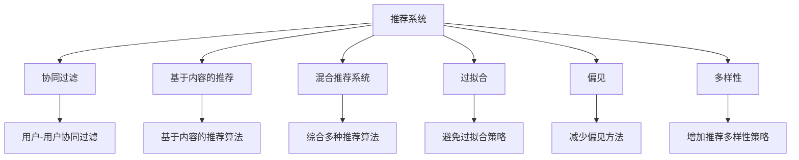

                 

# 推荐系统的局限性：过拟合、偏见与多样性推荐挑战

## 1. 背景介绍

### 1.1 问题由来
推荐系统（Recommendation Systems）旨在根据用户的历史行为和偏好，为其推荐感兴趣的物品，以提高用户体验和运营效益。随着互联网和智能设备的普及，推荐系统已成为电商、新闻、视频、社交等平台的重要组成部分。然而，在实际应用中，推荐系统面临诸多挑战，其中尤为突出的是过拟合（Overfitting）、偏见（Bias）和多样性（Diversity）等推荐偏差问题。这些问题不仅影响了推荐的准确性和公正性，还可能加剧用户的“信息茧房”效应，导致推荐系统无法真正为用户带来价值。

### 1.2 问题核心关键点
本文聚焦于推荐系统的三大核心挑战：过拟合、偏见与多样性。其中，过拟合指的是模型在训练集上表现良好，但在测试集上表现不佳的现象，通常由于训练数据过少或模型复杂度过高所致。偏见是指推荐系统在面对不同用户群体时，存在不平等或不公正的推荐倾向，可能与用户的真实需求和偏好不符。多样性则涉及推荐结果的丰富性，防止过度个性化导致的推荐单调性问题，从而确保用户能接触到更多元的推荐内容。

通过深入分析这三大挑战，本文旨在为推荐系统的优化提供有价值的见解和改进策略，推动推荐技术的持续发展和应用。

## 2. 核心概念与联系

### 2.1 核心概念概述

为更好地理解推荐系统面临的挑战，本节将介绍几个密切相关的核心概念：

- **推荐系统（Recommendation System）**：利用用户的历史行为和偏好，预测并推荐相关物品的系统。推荐系统广泛应用于电商、新闻、视频、社交等平台，旨在提升用户体验和运营效益。

- **过拟合（Overfitting）**：指模型在训练集上表现优异，但在测试集上表现不佳的现象，通常由于训练数据过少或模型复杂度过高所致。

- **偏见（Bias）**：指推荐系统在面对不同用户群体时，存在不平等或不公正的推荐倾向，可能与用户的真实需求和偏好不符。

- **多样性（Diversity）**：涉及推荐结果的丰富性，防止过度个性化导致的推荐单调性问题，从而确保用户能接触到更多元的推荐内容。

- **协同过滤（Collaborative Filtering）**：一种基于用户历史行为和物品关联度的推荐算法，主要包括用户-用户协同过滤和物品-物品协同过滤。

- **基于内容的推荐（Content-based Recommendation）**：利用物品的属性特征和用户的历史兴趣，进行相似性匹配的推荐算法。

- **混合推荐系统（Hybrid Recommendation System）**：结合多种推荐算法，综合用户历史行为、物品属性、社会网络等多维信息，提升推荐准确性和多样化。

这些核心概念之间的逻辑关系可以通过以下Mermaid流程图来展示：



这个流程图展示了一系列推荐算法及其面临的挑战，以及应对这些挑战的策略：

1. 推荐系统通过协同过滤、基于内容、混合等多种算法，进行物品推荐。
2. 在算法应用过程中，容易受到过拟合、偏见、多样性等问题的困扰。
3. 针对这些问题，有相应的策略和算法来解决。

这些概念共同构成了推荐系统的核心框架，帮助开发者更全面地理解和应对推荐算法中的挑战。

## 3. 核心算法原理 & 具体操作步骤
### 3.1 算法原理概述

推荐系统的核心思想是通过用户的历史行为和兴趣偏好，预测并推荐用户可能感兴趣的新物品。其核心算法原理主要包括以下几种：

- **协同过滤算法**：利用用户-物品的评分矩阵，通过用户或物品之间的相似性度量，进行推荐。常见的协同过滤算法包括基于用户的协同过滤和基于物品的协同过滤。
- **基于内容的推荐算法**：基于物品的属性特征和用户的历史兴趣，进行相似性匹配的推荐。
- **混合推荐算法**：综合多种推荐算法，如协同过滤、基于内容等，综合用户历史行为、物品属性、社会网络等多维信息，提升推荐准确性和多样化。

### 3.2 算法步骤详解

推荐系统的一般流程可以归纳为以下步骤：

**Step 1: 数据准备**
- 收集用户的历史行为数据，如浏览、点击、评分等。
- 收集物品的属性特征，如标签、类别、价格等。
- 构建用户-物品评分矩阵。

**Step 2: 模型训练**
- 选择适合的推荐算法，如协同过滤、基于内容等，进行模型训练。
- 使用交叉验证、网格搜索等技术进行超参数调优。

**Step 3: 模型评估**
- 使用测试集评估模型性能，如准确率、召回率、F1-score等。
- 分析模型在各类用户群体上的表现，检查偏见问题。

**Step 4: 推荐生成**
- 对新用户或物品进行预测，生成推荐结果。
- 综合多样性约束，生成多样化的推荐列表。

**Step 5: 持续改进**
- 收集用户反馈，更新用户兴趣模型。
- 定期重新训练模型，提高推荐效果。

### 3.3 算法优缺点

推荐系统具有以下优点：
1. 个性化推荐：通过分析用户的历史行为，生成个性化推荐，提升用户体验。
2. 高效率：推荐算法通常处理速度快，实时响应用户需求。
3. 无监督学习：推荐算法通常基于用户行为数据，无需标注数据。

同时，推荐系统也存在一定的局限性：
1. 数据稀疏性：用户-物品评分矩阵通常存在大量缺失值，导致算法鲁棒性差。
2. 过拟合风险：推荐模型容易过拟合训练数据，泛化性能差。
3. 偏见问题：推荐模型可能存在性别、年龄、地域等方面的偏见。
4. 多样性不足：过度个性化的推荐可能导致用户接触到的内容单一。

### 3.4 算法应用领域

推荐系统广泛应用于电商、新闻、视频、社交等多个领域：

- **电商领域**：通过推荐系统，电商平台可以为用户推荐感兴趣的商品，提升转化率和用户满意度。
- **新闻领域**：新闻平台利用推荐系统为用户推荐相关的新闻资讯，增加用户粘性。
- **视频领域**：视频网站通过推荐系统为用户推荐感兴趣的视频内容，增加观看时长。
- **社交领域**：社交网络利用推荐系统为用户推荐朋友、动态、群组等，增加用户活跃度。

推荐系统在众多领域的应用，极大提升了用户体验和运营效益，成为各大平台的核心竞争力之一。

## 4. 数学模型和公式 & 详细讲解 & 举例说明
### 4.1 数学模型构建

推荐系统的核心数学模型包括用户兴趣模型、物品特征模型、协同过滤矩阵等。以协同过滤为例，我们可以构建以下数学模型：

- **用户兴趣模型**：
  $$
  \theta_u = \sum_{i=1}^n w_i \times x_{iu}
  $$
  其中，$\theta_u$为第$u$个用户的历史兴趣表示，$w_i$为兴趣权重，$x_{iu}$为第$i$个物品的特征向量。

- **物品特征模型**：
  $$
  \theta_i = \sum_{j=1}^m w_j \times x_{ij}
  $$
  其中，$\theta_i$为第$i$个物品的特征表示，$w_j$为特征权重，$x_{ij}$为第$j$个用户对第$i$个物品的评分。

- **协同过滤矩阵**：
  $$
  \mathcal{S} = [s_{ui}]
  $$
  其中，$s_{ui}$为第$u$个用户对第$i$个物品的评分，通常为二元评分或连续评分。

### 4.2 公式推导过程

在协同过滤算法中，用户$u$对物品$i$的预测评分$y_{ui}$可以表示为：
$$
y_{ui} = \mathbf{w}_u \cdot \mathbf{S}_i
$$
其中，$\mathbf{w}_u$为第$u$个用户的权重向量，$\mathbf{S}_i$为第$i$个物品的评分向量。

具体推导过程如下：
1. 用户兴趣表示：$\theta_u = \sum_{i=1}^n w_i \times x_{iu}$
2. 物品特征表示：$\theta_i = \sum_{j=1}^m w_j \times x_{ij}$
3. 用户-物品评分预测：$y_{ui} = \mathbf{w}_u \cdot \mathbf{S}_i$

通过上述推导，我们得到了协同过滤算法的核心数学模型和预测公式，为推荐系统提供了理论基础。

### 4.3 案例分析与讲解

以Amazon商品推荐系统为例，分析其在实际应用中面临的挑战及解决策略：

- **挑战**：Amazon的商品推荐系统需要处理海量用户数据和物品数据，且用户评分数据稀疏。
- **解决策略**：
  1. **数据预处理**：采用矩阵分解、邻域平滑等方法处理数据稀疏性。
  2. **算法优化**：使用基于矩阵分解的算法（如ALS）进行协同过滤，提高预测精度。
  3. **模型评估**：使用AUC、RMSE等指标评估推荐效果，检查模型偏见问题。
  4. **多样性约束**：引入多样性约束，生成多样化的推荐列表。

通过这些优化策略，Amazon的推荐系统在电商领域取得了显著效果，提升了用户满意度并增加了销售额。

## 5. 项目实践：代码实例和详细解释说明
### 5.1 开发环境搭建

在进行推荐系统实践前，我们需要准备好开发环境。以下是使用Python进行推荐系统开发的环境配置流程：

1. 安装Anaconda：从官网下载并安装Anaconda，用于创建独立的Python环境。
2. 创建并激活虚拟环境：
```bash
conda create -n recsys python=3.8 
conda activate recsys
```

3. 安装相关依赖包：
```bash
conda install numpy pandas scipy scikit-learn matplotlib tqdm
```

4. 安装推荐系统库：
```bash
pip install Surprise PySurprise
```

完成上述步骤后，即可在`recsys`环境中开始推荐系统实践。

### 5.2 源代码详细实现

这里我们以协同过滤算法为例，给出使用PySurprise库进行推荐系统的PyTorch代码实现。

首先，定义推荐系统的数据处理函数：

```python
import pandas as pd
from surprise import Dataset, Reader

# 加载数据集
reader = Reader(rating_scale=(1, 5))
data = Dataset.load_from_df(train_df, reader)
```

然后，定义推荐算法模型和训练函数：

```python
from surprise import SVD, accuracy
from surprise.prediction_algorithms.svd import SVD

# 定义协同过滤算法
algo = SVD()

# 训练模型
trainset = data.build_full_trainset()
algo.fit(trainset)

# 评估模型
testset = data.build_full_testset()
preds = algo.test(testset)
```

最后，评估模型性能并生成推荐结果：

```python
from surprise.model_selection import cross_validate

# 评估模型性能
cv_results = cross_validate(algo, trainset, measures=['rmse', 'mae'], cv=5, verbose=False)

# 生成推荐结果
user_id = 123
user_index = trainset.user_index[user_id]
for i, item in enumerate(trainset[u'item']):
    item_id = trainset.item_index[item]
    rating = algo.predict(u=user_index, i=item_id).est
    print(f"推荐第{i}个物品给用户{user_id}，预测评分{rating:.2f}")
```

以上就是使用PySurprise库进行协同过滤推荐系统的完整代码实现。可以看到，推荐系统虽然涉及复杂的数学模型，但借助开源推荐库，代码实现变得更加简洁高效。

### 5.3 代码解读与分析

让我们再详细解读一下关键代码的实现细节：

**数据处理函数**：
- `Reader`：用于解析和加载数据集。
- `Dataset.load_from_df`：从DataFrame加载数据集。

**推荐算法模型和训练函数**：
- `SVD`：协同过滤算法模型。
- `fit`：训练模型。
- `test`：测试模型性能。

**模型评估和推荐生成**：
- `cross_validate`：交叉验证评估模型性能。
- `predict`：生成推荐结果。

可以看到，推荐系统虽然涉及复杂的数学模型，但借助开源推荐库，代码实现变得更加简洁高效。开发者可以将更多精力放在数据处理、模型改进等高层逻辑上，而不必过多关注底层的实现细节。

当然，工业级的系统实现还需考虑更多因素，如推荐结果的展示、推荐引擎的部署、用户反馈的收集与反馈等。但核心的推荐算法基本与此类似。

## 6. 实际应用场景
### 6.1 电商推荐系统

推荐系统在电商领域的应用尤为广泛。通过推荐系统，电商平台可以为用户推荐感兴趣的商品，提升用户满意度和销售额。具体而言，电商平台可以收集用户的浏览、点击、评分等行为数据，构建用户-物品评分矩阵。在此基础上，采用协同过滤算法，生成个性化的推荐列表，并向用户展示。

例如，Amazon通过推荐系统为用户推荐商品，显著提升了用户的购物体验和转化率。此外，Amazon还引入多样性约束，防止过度个性化的推荐导致用户接触到的内容单一。

### 6.2 新闻推荐系统

新闻平台利用推荐系统为用户推荐相关的新闻资讯，增加用户粘性。例如，今日头条通过推荐系统向用户推荐新闻，根据用户的兴趣和行为数据，生成个性化的新闻推荐列表，提升用户阅读时长。

### 6.3 视频推荐系统

视频网站通过推荐系统为用户推荐感兴趣的视频内容，增加观看时长。例如，YouTube通过推荐系统为用户推荐视频，根据用户的观看历史和行为数据，生成个性化的推荐列表，提升用户观看时长和互动率。

### 6.4 未来应用展望

随着推荐系统的不断发展，其在更多领域的应用前景将更加广阔。未来推荐系统有望在智慧医疗、智慧教育、智慧城市等领域发挥重要作用，推动相关行业数字化转型。

在智慧医疗领域，推荐系统可应用于医学知识推荐、药物推荐等场景，帮助医生快速获取相关知识，提高诊疗效率。在智慧教育领域，推荐系统可应用于学习资源推荐、课程推荐等场景，帮助学生快速找到适合自己的学习资源，提高学习效率。在智慧城市治理中，推荐系统可应用于城市事件监测、交通推荐等场景，提高城市管理的自动化和智能化水平，构建更安全、高效的未来城市。

此外，在企业生产、社会治理、文娱传媒等众多领域，推荐系统也将不断涌现，为经济社会发展注入新的动力。

## 7. 工具和资源推荐
### 7.1 学习资源推荐

为了帮助开发者系统掌握推荐系统的理论基础和实践技巧，这里推荐一些优质的学习资源：

1. 《推荐系统实践》书籍：由Recommender Systems专家撰写，深入浅出地介绍了推荐系统的工作原理、算法实现和实际应用。

2. 《推荐系统基础》课程：由CMU教授开设的Coursera课程，涵盖推荐系统的基础知识、常用算法和案例分析。

3. 《Applied Recommender Systems》书籍：Amazon的Recommender Systems团队编写的书籍，详细介绍了推荐系统在电商领域的实际应用。

4. Surprise官方文档：Surprise库的官方文档，提供了丰富的推荐算法实现和评估方法，是学习和实践推荐系统的必备资料。

5. Kaggle推荐系统竞赛：Kaggle平台提供了大量的推荐系统竞赛，通过实践竞赛，可以更好地理解推荐系统的应用场景和挑战。

通过对这些资源的学习实践，相信你一定能够快速掌握推荐系统的精髓，并用于解决实际的推荐问题。

### 7.2 开发工具推荐

高效的开发离不开优秀的工具支持。以下是几款用于推荐系统开发的常用工具：

1. PySurprise：一个基于Python的推荐系统库，提供了丰富的协同过滤、基于内容等推荐算法实现。
2. TensorFlow RecSys：一个基于TensorFlow的推荐系统库，支持深度学习和强化学习等多种推荐算法。
3. LightFM：一个基于Python的推荐系统库，支持矩阵分解、基于内容的推荐等多种算法。
4. LibRec：一个基于C++的推荐系统库，提供了高效的推荐算法实现。
5. Scikit-learn：一个广泛使用的机器学习库，提供了多种推荐算法实现和评估方法。

合理利用这些工具，可以显著提升推荐系统的开发效率，加快创新迭代的步伐。

### 7.3 相关论文推荐

推荐系统的研究起源于学界的持续探索。以下是几篇奠基性的相关论文，推荐阅读：

1. "Collaborative Filtering for Implicit Feedback Datasets"：提出了基于隐式反馈的协同过滤算法，是推荐系统领域的经典工作。
2. "Trustworthy Online Recommendation Algorithms"：讨论了推荐系统的偏见和多样性问题，提出了多种算法缓解这些问题。
3. "The Bell-Kor Algorithm for Adaptive Collaborative Filtering"：介绍了适应性协同过滤算法，提高推荐系统的准确性和效率。
4. "Hedonic Collaborative Filtering"：提出了一种新的协同过滤算法，引入用户和物品的满意度概念，提升推荐质量。
5. "Hybrid recommender systems"：综述了多种混合推荐系统算法，探讨了如何将不同推荐算法进行有机结合，提高推荐效果。

这些论文代表推荐系统的研究进展，通过学习这些前沿成果，可以帮助研究者把握学科发展方向，激发更多的创新灵感。

## 8. 总结：未来发展趋势与挑战
### 8.1 研究成果总结

本文对推荐系统面临的过拟合、偏见与多样性挑战进行了全面系统的介绍。首先阐述了推荐系统在实际应用中的重要性和面临的挑战，明确了过拟合、偏见与多样性对推荐系统性能的影响。其次，从原理到实践，详细讲解了推荐系统的核心算法原理和操作步骤，给出了推荐系统开发的完整代码实例。同时，本文还广泛探讨了推荐系统在电商、新闻、视频等多个领域的应用前景，展示了推荐系统的广泛应用价值。

通过本文的系统梳理，可以看到，推荐系统在电商、新闻、视频等领域已经取得了显著效果，极大地提升了用户体验和运营效益。未来推荐系统将继续向更广泛的领域拓展，带来新的应用场景和挑战。

### 8.2 未来发展趋势

展望未来，推荐系统的发展将呈现以下几个趋势：

1. **深度学习与强化学习的融合**：深度学习在推荐系统中广泛应用，通过卷积神经网络、循环神经网络等模型，提升推荐效果。强化学习引入奖励机制，动态优化推荐策略，提升推荐系统的主动性和自适应性。
2. **多模态数据的融合**：推荐系统将从单一模态向多模态数据融合发展，结合文本、图像、语音等多种信息，提升推荐系统的准确性和多样性。
3. **个性化推荐与用户行为的动态调整**：推荐系统将更多地考虑用户行为的动态变化，引入时间、场景等因素，进行实时推荐，提升个性化程度。
4. **推荐系统的伦理与安全**：推荐系统在应用中可能带来伦理和安全问题，如偏见、隐私保护等，未来需要引入更多的伦理和法律约束，确保推荐系统的公正性和安全性。
5. **推荐系统的自动化与可解释性**：推荐系统将向自动化和可解释性方向发展，通过机器学习和人工干预相结合的方式，提升推荐效果和用户信任度。

以上趋势凸显了推荐系统技术的广阔前景。这些方向的探索发展，将进一步提升推荐系统的性能和应用范围，为推荐系统带来新的突破。

### 8.3 面临的挑战

尽管推荐系统已经取得了显著成效，但在迈向更加智能化、普适化应用的过程中，它仍面临诸多挑战：

1. **数据稀疏性**：用户-物品评分矩阵通常存在大量缺失值，导致算法鲁棒性差。如何在稀疏数据下提升推荐效果，仍然是一个重要问题。
2. **过拟合风险**：推荐模型容易过拟合训练数据，泛化性能差。如何降低过拟合风险，提高模型泛化能力，仍然是一个重要问题。
3. **偏见问题**：推荐模型可能存在性别、年龄、地域等方面的偏见。如何缓解偏见问题，提升推荐公正性，仍然是一个重要问题。
4. **多样性不足**：过度个性化的推荐可能导致用户接触到的内容单一。如何提高推荐多样性，避免信息茧房效应，仍然是一个重要问题。
5. **实时性要求**：推荐系统需要实时响应用户需求，如何在保证推荐效果的同时，提高系统实时性，仍然是一个重要问题。

### 8.4 研究展望

面对推荐系统面临的挑战，未来的研究需要在以下几个方面寻求新的突破：

1. **深度学习与强化学习的融合**：结合深度学习与强化学习，动态优化推荐策略，提升推荐系统的主动性和自适应性。
2. **多模态数据的融合**：结合文本、图像、语音等多种信息，提升推荐系统的准确性和多样性。
3. **个性化推荐与用户行为的动态调整**：考虑用户行为的动态变化，引入时间、场景等因素，进行实时推荐，提升个性化程度。
4. **推荐系统的自动化与可解释性**：通过机器学习和人工干预相结合的方式，提升推荐效果和用户信任度。

这些研究方向的探索，将进一步推动推荐系统的优化和应用，为推荐系统的智能化和普适化发展奠定基础。

## 9. 附录：常见问题与解答

**Q1：推荐系统是否适用于所有应用场景？**

A: 推荐系统适用于大多数应用场景，特别是在用户量较大、数据丰富的领域，如电商、新闻、视频等。但对于一些特定领域，如医疗、金融等，推荐系统可能需要结合领域知识进行改进。

**Q2：推荐系统如何平衡个性化与多样性？**

A: 推荐系统可以通过多样性约束、协同过滤等方法，平衡个性化与多样性。例如，在协同过滤中，可以引入多样性惩罚项，防止推荐结果过于集中。

**Q3：推荐系统如何应对数据稀疏性问题？**

A: 推荐系统可以采用矩阵分解、邻域平滑等方法，处理数据稀疏性。例如，在ALS算法中，通过分解矩阵来处理数据稀疏性。

**Q4：推荐系统如何避免过拟合？**

A: 推荐系统可以通过正则化、交叉验证等方法，避免过拟合。例如，在ALS算法中，通过引入L2正则项，降低模型复杂度，避免过拟合。

**Q5：推荐系统如何缓解偏见问题？**

A: 推荐系统可以通过引入公平性约束、反偏见算法等方法，缓解偏见问题。例如，在反偏见算法中，通过调整模型参数，使不同用户群体的评分分布更加均衡。

---

作者：禅与计算机程序设计艺术 / Zen and the Art of Computer Programming

