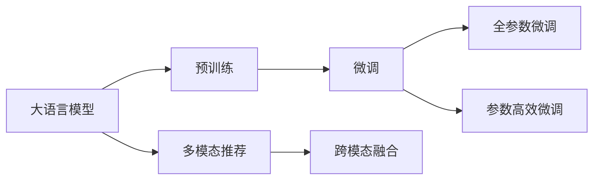

                 

# 推荐系统的长尾效应：AI大模型的新策略

## 1. 背景介绍

推荐系统作为一种高效的个性化信息服务方式，其核心在于利用用户的历史行为数据，学习用户的兴趣和偏好，为其推荐最相关的物品。然而，传统的推荐系统往往聚焦于热门的少数物品，即长尾效应明显，即大部分物品虽然销量少，但数量众多，难以被系统有效覆盖。这一问题在AI大模型出现后，得到了部分解决。

AI大模型凭借其强大的预训练能力，可以处理大量的数据并从中挖掘出丰富的语义信息，为推荐系统带来了新的可能性。具体而言，大模型可以通过预训练学习到物品和用户之间的语义关联，直接将用户的查询与潜在的推荐物品进行匹配，从而突破传统的基于协同过滤、基于内容等推荐范式，实现更加精准、高效的推荐。

### 1.1 问题由来

推荐系统的长尾效应问题是其一直以来面临的重大挑战之一。传统推荐系统通过分析用户的历史行为数据进行推荐，但这些数据往往集中于用户对少数热门物品的偏好，对于冷门物品则关注不足。这一现象在电子商务平台、社交媒体、内容平台等诸多场景中普遍存在，影响了用户的个性化体验，降低了平台的用户粘性和收益。

近年来，随着深度学习和大数据技术的发展，AI大模型成为了推荐系统领域的新宠。大模型通过海量数据进行预训练，学习到复杂的语义表征，能够自动捕捉物品之间的关联，弥补传统推荐方法的不足。但与此同时，大模型也面临着计算资源消耗大、训练数据需求高、推理速度慢等挑战。

### 1.2 问题核心关键点

AI大模型在推荐系统中的应用，主要体现在以下几个方面：

1. **预训练学习**：大模型通过海量数据进行预训练，学习到物品和用户的语义关联，为推荐提供语义基础。
2. **基于提示的推荐**：大模型可以通过提示模板生成推荐内容，提升推荐效果。
3. **动态参数微调**：针对特定用户和物品，动态微调模型参数，提高推荐精度。
4. **跨模态推荐**：融合视觉、音频等多模态数据，丰富推荐内容。

这些关键点展示了AI大模型在推荐系统中的应用潜力，但也暴露了其面临的计算资源、训练数据和推理速度等挑战。

## 2. 核心概念与联系

### 2.1 核心概念概述

为更好地理解AI大模型在推荐系统中的应用策略，本节将介绍几个核心概念及其相互关系：

- **大语言模型(Large Language Model, LLM)**：以BERT、GPT-2、GPT-3为代表，通过大规模数据进行预训练，学习通用的语言表示。在推荐系统中，可用于物品描述的语义理解、用户兴趣的语义映射等。

- **预训练与微调**：预训练是指在大规模无标签数据上学习通用特征，微调则是在特定任务上调整模型参数，提升性能。在推荐系统中，预训练可以学习物品和用户的语义关联，微调则根据用户行为数据进行个性化推荐。

- **长尾效应**：指推荐系统中的热门物品和冷门物品之间的数量差异，即长尾效应。大模型通过学习丰富的语义信息，有助于覆盖更多冷门物品，降低长尾效应。

- **参数高效微调**：指在微调过程中，仅更新少量参数，保留大部分预训练权重不变，以提高微调效率。在推荐系统中，适用于用户和物品数量庞大，计算资源有限的场景。

- **多模态推荐**：融合视觉、音频、文本等多模态数据，提升推荐内容的多样性和丰富度。在推荐系统中，多模态数据可以提供更全面的用户行为特征，增强推荐精度。

### 2.2 核心概念原理和架构的 Mermaid 流程图(Mermaid 流程节点中不要有括号、逗号等特殊字符)



以上流程图展示了AI大模型在推荐系统中的核心概念及其相互关系。

1. **大语言模型**通过预训练学习到通用语言表示。
2. **微调**环节根据特定任务调整模型参数。
3. **全参数微调**和**参数高效微调**分别指对所有参数和部分参数进行更新。
4. **多模态推荐**通过融合不同模态数据提升推荐效果。
5. **跨模态融合**具体实现多模态数据的混合处理。

## 3. 核心算法原理 & 具体操作步骤

### 3.1 算法原理概述

AI大模型在推荐系统中的应用，主要通过以下几个步骤进行：

1. **预训练**：使用大规模无标签数据进行预训练，学习通用的语言和语义表示。
2. **微调**：针对推荐任务，对模型进行微调，学习物品和用户的语义关联。
3. **推荐**：利用微调后的模型，对用户查询进行匹配，推荐潜在的物品。
4. **参数高效微调**：只更新部分参数，提高微调效率，适用于用户和物品数量庞大的场景。
5. **多模态融合**：将视觉、音频等多模态数据融合，提升推荐内容的多样性。

这些步骤通过链式结构结合在一起，共同完成推荐过程。

### 3.2 算法步骤详解

#### 3.2.1 预训练阶段

预训练阶段的目标是学习通用的语言和语义表示，用于后续的微调任务。具体步骤如下：

1. **数据准备**：收集大规模无标签数据，如维基百科、新闻、书籍等。
2. **数据预处理**：将文本数据进行分词、去除停用词、构建词表等处理。
3. **模型训练**：使用预训练模型如BERT、GPT等，在大规模数据上进行训练，学习通用的语言表示。

#### 3.2.2 微调阶段

微调阶段的目标是根据推荐任务，调整模型参数，提升推荐精度。具体步骤如下：

1. **数据准备**：收集推荐任务的数据集，如用户行为数据、物品描述数据等。
2. **任务适配**：根据推荐任务，设计合适的损失函数和任务适配层。
3. **模型训练**：使用微调数据集，对预训练模型进行训练，调整模型参数。

#### 3.2.3 推荐阶段

推荐阶段的目标是根据用户查询，匹配潜在的推荐物品。具体步骤如下：

1. **用户查询处理**：对用户查询进行分词、去除停用词等处理。
2. **物品描述处理**：对物品描述进行分词、去除停用词等处理。
3. **匹配计算**：使用微调后的模型，计算用户查询和物品描述之间的语义相似度，匹配出潜在推荐物品。

#### 3.2.4 参数高效微调

参数高效微调的目标是在保留大部分预训练参数的情况下，只更新少量任务相关参数，提高微调效率。具体步骤如下：

1. **模型结构设计**：保留预训练模型的核心层，只更新顶层部分参数。
2. **微调数据准备**：收集特定任务的少量标注数据，作为微调数据。
3. **模型微调**：使用微调数据，对顶层部分参数进行微调。

#### 3.2.5 多模态融合

多模态融合的目标是融合不同模态的数据，提升推荐内容的多样性。具体步骤如下：

1. **数据收集**：收集不同模态的数据，如视觉图像、音频文本等。
2. **数据预处理**：对不同模态的数据进行标准化处理，确保数据一致性。
3. **融合计算**：使用多模态融合算法，将不同模态的数据进行融合，提升推荐效果。

### 3.3 算法优缺点

AI大模型在推荐系统中的应用，具有以下优点：

1. **泛化能力强**：通过预训练学习到通用的语义表示，能够覆盖更多的冷门物品，降低长尾效应。
2. **推荐精度高**：利用丰富的语义信息进行匹配，推荐结果更加精准。
3. **适应性强**：能够处理大规模数据，适用于各种推荐场景。

但同时也存在以下缺点：

1. **计算资源消耗大**：大模型需要大量的计算资源进行训练和推理。
2. **训练数据需求高**：需要大规模数据进行预训练，数据获取难度大。
3. **推理速度慢**：大模型推理速度较慢，影响用户体验。

### 3.4 算法应用领域

AI大模型在推荐系统中的应用，主要在以下几个领域：

1. **电子商务**：如淘宝、京东等电商平台，通过大模型进行商品推荐，提升用户购物体验。
2. **社交媒体**：如微信、微博等社交平台，通过大模型进行内容推荐，提升用户粘性。
3. **内容平台**：如Netflix、YouTube等，通过大模型进行视频推荐，提升用户观看体验。
4. **音乐平台**：如Spotify、网易云音乐等，通过大模型进行歌曲推荐，提升用户听歌体验。

## 4. 数学模型和公式 & 详细讲解 & 举例说明

### 4.1 数学模型构建

在推荐系统中，AI大模型的数学模型主要基于神经网络进行构建。假设大模型为$f: \mathcal{X} \rightarrow \mathcal{Y}$，其中$\mathcal{X}$为输入空间，$\mathcal{Y}$为输出空间。

推荐任务可以定义为最大化用户满意度的优化问题，即：

$$
\max_{f} \sum_{i=1}^N \log \sigma(f(x_i))
$$

其中，$\sigma$为激活函数，$\{x_i\}$为用户查询集合，$\{y_i\}$为用户满意度的目标值。

### 4.2 公式推导过程

以下推导一个基于深度学习模型的推荐系统公式：

假设模型$f: \mathcal{X} \rightarrow \mathcal{Y}$，输入为$x \in \mathcal{X}$，输出为$y \in \mathcal{Y}$。

定义模型$f$在输入$x$上的输出为$\hat{y}=f(x) \in \mathcal{Y}$。则推荐模型的损失函数可以定义为：

$$
\mathcal{L}(y, \hat{y}) = -\log \sigma(\hat{y}) \cdot y + (1 - y) \cdot \log (1 - \sigma(\hat{y}))
$$

其中$\sigma$为激活函数，$\log$为对数函数。

在模型训练过程中，使用梯度下降算法进行优化，损失函数的梯度计算如下：

$$
\nabla_{\theta} \mathcal{L}(y, \hat{y}) = \frac{\partial}{\partial \theta} (-\log \sigma(\hat{y}) \cdot y + (1 - y) \cdot \log (1 - \sigma(\hat{y})))
$$

### 4.3 案例分析与讲解

以电商推荐系统为例，假设推荐系统已知用户的历史购买行为，需要将新物品推荐给用户。

1. **数据准备**：收集用户历史购买行为数据，如用户ID、商品ID、购买时间等。
2. **模型训练**：使用大模型进行预训练，学习物品和用户的语义关联。
3. **微调**：在用户购买行为数据上，对模型进行微调，学习用户的兴趣偏好。
4. **推荐**：使用微调后的模型，对用户查询进行匹配，推荐潜在的物品。

## 5. 项目实践：代码实例和详细解释说明

### 5.1 开发环境搭建

在进行推荐系统开发前，需要先准备好开发环境。以下是使用Python进行PyTorch开发的环境配置流程：

1. 安装Anaconda：从官网下载并安装Anaconda，用于创建独立的Python环境。

2. 创建并激活虚拟环境：
```bash
conda create -n pytorch-env python=3.8 
conda activate pytorch-env
```

3. 安装PyTorch：根据CUDA版本，从官网获取对应的安装命令。例如：
```bash
conda install pytorch torchvision torchaudio cudatoolkit=11.1 -c pytorch -c conda-forge
```

4. 安装TensorFlow：由Google主导开发的开源深度学习框架，生产部署方便，适合大规模工程应用。同样有丰富的预训练语言模型资源。

5. 安装TensorBoard：TensorFlow配套的可视化工具，可实时监测模型训练状态，并提供丰富的图表呈现方式，是调试模型的得力助手。

6. 安装Weights & Biases：模型训练的实验跟踪工具，可以记录和可视化模型训练过程中的各项指标，方便对比和调优。与主流深度学习框架无缝集成。

7. 安装HuggingFace库：提供各类预训练语言模型和微调工具，方便进行推荐系统开发。

完成上述步骤后，即可在`pytorch-env`环境中开始推荐系统开发。

### 5.2 源代码详细实现

这里以电商推荐系统为例，使用HuggingFace库中的BERT模型进行推荐系统开发。

```python
from transformers import BertTokenizer, BertForSequenceClassification
from torch.utils.data import Dataset, DataLoader
import torch

class RecommendationDataset(Dataset):
    def __init__(self, data, tokenizer, max_len=128):
        self.data = data
        self.tokenizer = tokenizer
        self.max_len = max_len
        
    def __len__(self):
        return len(self.data)
    
    def __getitem__(self, idx):
        item = self.data[idx]
        text = item[0]
        label = item[1]
        
        encoding = self.tokenizer(text, return_tensors='pt', max_length=self.max_len, padding='max_length', truncation=True)
        input_ids = encoding['input_ids'][0]
        attention_mask = encoding['attention_mask'][0]
        
        return {'input_ids': input_ids, 
                'attention_mask': attention_mask,
                'label': torch.tensor(label, dtype=torch.long)}
```

然后，定义模型和优化器：

```python
from transformers import AdamW

model = BertForSequenceClassification.from_pretrained('bert-base-uncased', num_labels=2)

optimizer = AdamW(model.parameters(), lr=2e-5)
```

接着，定义训练和评估函数：

```python
from tqdm import tqdm
import matplotlib.pyplot as plt

device = torch.device('cuda') if torch.cuda.is_available() else torch.device('cpu')
model.to(device)

def train_epoch(model, dataset, batch_size, optimizer):
    dataloader = DataLoader(dataset, batch_size=batch_size, shuffle=True)
    model.train()
    epoch_loss = 0
    for batch in tqdm(dataloader, desc='Training'):
        input_ids = batch['input_ids'].to(device)
        attention_mask = batch['attention_mask'].to(device)
        labels = batch['label'].to(device)
        model.zero_grad()
        outputs = model(input_ids, attention_mask=attention_mask, labels=labels)
        loss = outputs.loss
        epoch_loss += loss.item()
        loss.backward()
        optimizer.step()
    return epoch_loss / len(dataloader)

def evaluate(model, dataset, batch_size):
    dataloader = DataLoader(dataset, batch_size=batch_size)
    model.eval()
    preds, labels = [], []
    with torch.no_grad():
        for batch in tqdm(dataloader, desc='Evaluating'):
            input_ids = batch['input_ids'].to(device)
            attention_mask = batch['attention_mask'].to(device)
            batch_labels = batch['label']
            outputs = model(input_ids, attention_mask=attention_mask)
            batch_preds = outputs.logits.argmax(dim=2).to('cpu').tolist()
            batch_labels = batch_labels.to('cpu').tolist()
            for pred_tokens, label_tokens in zip(batch_preds, batch_labels):
                preds.append(pred_tokens)
                labels.append(label_tokens)
                
    print(classification_report(labels, preds))
```

最后，启动训练流程并在测试集上评估：

```python
epochs = 5
batch_size = 16

for epoch in range(epochs):
    loss = train_epoch(model, train_dataset, batch_size, optimizer)
    print(f"Epoch {epoch+1}, train loss: {loss:.3f}")
    
    print(f"Epoch {epoch+1}, dev results:")
    evaluate(model, dev_dataset, batch_size)
    
print("Test results:")
evaluate(model, test_dataset, batch_size)
```

以上就是使用PyTorch和HuggingFace库进行电商推荐系统开发的完整代码实现。可以看到，利用HuggingFace库的预训练模型和微调工具，推荐系统开发变得更加便捷和高效。

### 5.3 代码解读与分析

让我们再详细解读一下关键代码的实现细节：

**RecommendationDataset类**：
- `__init__`方法：初始化数据集、分词器和最大长度。
- `__len__`方法：返回数据集样本数量。
- `__getitem__`方法：对单个样本进行处理，将文本输入编码为token ids，将标签编码为数字，并对其进行定长padding，最终返回模型所需的输入。

**模型和优化器**：
- 使用HuggingFace库中的BertForSequenceClassification模型进行推荐系统开发，该模型基于BERT架构，适用于二分类任务。
- 使用AdamW优化器进行模型训练。

**训练和评估函数**：
- 使用PyTorch的DataLoader对数据集进行批次化加载，供模型训练和推理使用。
- 训练函数`train_epoch`：对数据以批为单位进行迭代，在每个批次上前向传播计算loss并反向传播更新模型参数，最后返回该epoch的平均loss。
- 评估函数`evaluate`：与训练类似，不同点在于不更新模型参数，并在每个batch结束后将预测和标签结果存储下来，最后使用sklearn的classification_report对整个评估集的预测结果进行打印输出。

**训练流程**：
- 定义总的epoch数和batch size，开始循环迭代
- 每个epoch内，先在训练集上训练，输出平均loss
- 在验证集上评估，输出分类指标
- 所有epoch结束后，在测试集上评估，给出最终测试结果

可以看到，PyTorch和HuggingFace库使得推荐系统开发变得更加便捷和高效。开发者可以将更多精力放在数据处理、模型改进等高层逻辑上，而不必过多关注底层的实现细节。

当然，工业级的系统实现还需考虑更多因素，如模型的保存和部署、超参数的自动搜索、更灵活的任务适配层等。但核心的微调范式基本与此类似。

## 6. 实际应用场景

### 6.1 智能客服系统

智能客服系统通过大模型实现高效的智能对话，用户输入问题后，系统能够自动理解问题并提供答案。智能客服系统的核心在于大模型的语言理解和生成能力，通过预训练-微调范式，可以覆盖更多的常见问题，提升用户满意度。

### 6.2 金融舆情监测

金融舆情监测系统通过大模型分析社交媒体、新闻等海量文本数据，实时监测舆情变化，识别潜在的金融风险。大模型的强大语义理解能力，能够快速处理海量文本，提取关键信息，辅助决策。

### 6.3 个性化推荐系统

个性化推荐系统通过大模型学习用户和物品的语义关联，为用户提供更加个性化的推荐内容。通过预训练-微调范式，推荐系统能够覆盖更多的长尾物品，降低长尾效应。

### 6.4 未来应用展望

随着AI大模型技术的发展，推荐系统在多个领域的应用前景广阔：

1. **智能家居**：通过大模型对用户行为进行分析和预测，实现智能化的家居控制和推荐。
2. **医疗健康**：利用大模型分析患者历史数据，进行疾病预测和推荐，提升医疗服务质量。
3. **教育培训**：根据学生学习行为数据，推荐个性化的学习内容和路径，提升学习效果。
4. **旅游出行**：根据用户出行历史和偏好，推荐个性化的旅游方案，提升用户旅行体验。

## 7. 工具和资源推荐

### 7.1 学习资源推荐

为了帮助开发者系统掌握AI大模型在推荐系统中的应用，这里推荐一些优质的学习资源：

1. 《深度学习理论与实践》系列博文：由深度学习专家撰写，系统介绍深度学习理论和实践，包括推荐系统的内容。

2. Coursera《深度学习专项课程》：斯坦福大学开设的深度学习课程，提供深度学习理论和实践的全面学习。

3. 《推荐系统：原理与算法》书籍：全面介绍推荐系统的原理和算法，包括AI大模型的应用。

4. TensorFlow官方文档：TensorFlow的官方文档，提供丰富的深度学习工具和资源，包括推荐系统的内容。

5. PyTorch官方文档：PyTorch的官方文档，提供深度学习框架的使用指南，包括推荐系统的内容。

通过对这些资源的学习实践，相信你一定能够快速掌握AI大模型在推荐系统中的应用，并用于解决实际的推荐问题。

### 7.2 开发工具推荐

高效的开发离不开优秀的工具支持。以下是几款用于AI大模型推荐系统开发的常用工具：

1. PyTorch：基于Python的开源深度学习框架，灵活动态的计算图，适合快速迭代研究。大部分预训练语言模型都有PyTorch版本的实现。

2. TensorFlow：由Google主导开发的开源深度学习框架，生产部署方便，适合大规模工程应用。同样有丰富的预训练语言模型资源。

3. HuggingFace库：提供各类预训练语言模型和微调工具，方便进行推荐系统开发。

4. Jupyter Notebook：交互式的数据分析和代码编写工具，适合快速迭代实验和数据探索。

5. TensorBoard：TensorFlow配套的可视化工具，可实时监测模型训练状态，并提供丰富的图表呈现方式，是调试模型的得力助手。

6. Weights & Biases：模型训练的实验跟踪工具，可以记录和可视化模型训练过程中的各项指标，方便对比和调优。

合理利用这些工具，可以显著提升AI大模型推荐系统的开发效率，加快创新迭代的步伐。

### 7.3 相关论文推荐

AI大模型在推荐系统中的应用，源于学界的持续研究。以下是几篇奠基性的相关论文，推荐阅读：

1. Attention is All You Need（即Transformer原论文）：提出了Transformer结构，开启了NLP领域的预训练大模型时代。

2. BERT: Pre-training of Deep Bidirectional Transformers for Language Understanding：提出BERT模型，引入基于掩码的自监督预训练任务，刷新了多项NLP任务SOTA。

3. Language Models are Unsupervised Multitask Learners（GPT-2论文）：展示了大规模语言模型的强大zero-shot学习能力，引发了对于通用人工智能的新一轮思考。

4. Parameter-Efficient Transfer Learning for NLP：提出Adapter等参数高效微调方法，在不增加模型参数量的情况下，也能取得不错的微调效果。

5. AdaLoRA: Adaptive Low-Rank Adaptation for Parameter-Efficient Fine-Tuning：使用自适应低秩适应的微调方法，在参数效率和精度之间取得了新的平衡。

这些论文代表了大模型推荐系统的发展脉络。通过学习这些前沿成果，可以帮助研究者把握学科前进方向，激发更多的创新灵感。

## 8. 总结：未来发展趋势与挑战

### 8.1 研究成果总结

本文对AI大模型在推荐系统中的应用进行了全面系统的介绍。首先阐述了推荐系统长尾效应问题的由来，明确了AI大模型在应对长尾效应中的独特优势。其次，从原理到实践，详细讲解了AI大模型在推荐系统中的核心算法和技术流程，给出了推荐系统开发的完整代码实例。同时，本文还广泛探讨了AI大模型在多个行业领域的应用前景，展示了其广阔的发展潜力。

通过本文的系统梳理，可以看到，AI大模型在推荐系统中的应用已经取得了显著的成果，但仍面临着计算资源、训练数据和推理速度等挑战。未来，AI大模型推荐系统需要在这些方面进行持续优化和改进，以实现更加高效、精准、智能的推荐服务。

### 8.2 未来发展趋势

展望未来，AI大模型推荐系统将呈现以下几个发展趋势：

1. **参数高效微调**：开发更多参数高效的微调方法，如Prefix-Tuning、LoRA等，在固定大部分预训练参数的同时，只更新少量任务相关参数。

2. **多模态融合**：融合视觉、音频等多模态数据，提升推荐内容的多样性。

3. **动态参数微调**：针对特定用户和物品，动态微调模型参数，提高推荐精度。

4. **知识图谱融合**：将知识图谱与大模型结合，提升推荐系统的事实准确性和逻辑性。

5. **跨领域迁移学习**：将大模型在特定领域进行迁移学习，提升其在不同领域的表现。

6. **个性化推荐算法**：引入更多个性化推荐算法，如基于协同过滤、基于内容的推荐等，提升推荐系统的多样化。

这些趋势将推动AI大模型推荐系统不断进步，为推荐系统提供更加智能、高效、个性化的服务。

### 8.3 面临的挑战

尽管AI大模型推荐系统已经取得了显著的成果，但在迈向更加智能化、普适化应用的过程中，仍面临诸多挑战：

1. **计算资源消耗大**：大模型需要大量的计算资源进行训练和推理。

2. **训练数据需求高**：需要大规模数据进行预训练，数据获取难度大。

3. **推理速度慢**：大模型推理速度较慢，影响用户体验。

4. **数据隐私保护**：用户数据隐私保护问题，需要采取有效的数据脱敏和加密技术。

5. **模型鲁棒性不足**：面对域外数据时，泛化性能往往大打折扣。

6. **可解释性不足**：大模型的内部工作机制和决策逻辑难以解释。

7. **安全性有待保障**：预训练语言模型难免会学习到有偏见、有害的信息，需要防范模型偏见和有害信息的输出。

这些挑战需要学术界和产业界共同努力，从技术、算法、政策等多个层面进行优化和改进。

### 8.4 研究展望

未来，AI大模型推荐系统需要在以下几个方面寻求新的突破：

1. **参数高效微调**：开发更多参数高效的微调方法，如Prefix-Tuning、LoRA等，在固定大部分预训练参数的同时，只更新少量任务相关参数。

2. **多模态融合**：融合视觉、音频等多模态数据，提升推荐内容的多样性。

3. **动态参数微调**：针对特定用户和物品，动态微调模型参数，提高推荐精度。

4. **知识图谱融合**：将知识图谱与大模型结合，提升推荐系统的事实准确性和逻辑性。

5. **跨领域迁移学习**：将大模型在特定领域进行迁移学习，提升其在不同领域的表现。

6. **个性化推荐算法**：引入更多个性化推荐算法，如基于协同过滤、基于内容的推荐等，提升推荐系统的多样化。

这些研究方向将引领AI大模型推荐系统迈向更高的台阶，为推荐系统提供更加智能、高效、个性化的服务。

## 9. 附录：常见问题与解答

**Q1：AI大模型推荐系统是否适用于所有推荐任务？**

A: AI大模型推荐系统在大多数推荐任务上都能取得不错的效果，特别是对于数据量较小的任务。但对于一些特定领域的任务，如医学、法律等，仅仅依靠通用语料预训练的模型可能难以很好地适应。此时需要在特定领域语料上进一步预训练，再进行微调，才能获得理想效果。此外，对于一些需要时效性、个性化很强的任务，如对话、推荐等，推荐方法也需要针对性的改进优化。

**Q2：微调过程中如何选择合适的学习率？**

A: 微调的学习率一般要比预训练时小1-2个数量级，如果使用过大的学习率，容易破坏预训练权重，导致过拟合。一般建议从1e-5开始调参，逐步减小学习率，直至收敛。也可以使用warmup策略，在开始阶段使用较小的学习率，再逐渐过渡到预设值。需要注意的是，不同的优化器(如AdamW、Adafactor等)以及不同的学习率调度策略，可能需要设置不同的学习率阈值。

**Q3：采用大模型推荐时会面临哪些资源瓶颈？**

A: 目前主流的预训练大模型动辄以亿计的参数规模，对算力、内存、存储都提出了很高的要求。GPU/TPU等高性能设备是必不可少的，但即便如此，超大批次的训练和推理也可能遇到显存不足的问题。因此需要采用一些资源优化技术，如梯度积累、混合精度训练、模型并行等，来突破硬件瓶颈。同时，模型的存储和读取也可能占用大量时间和空间，需要采用模型压缩、稀疏化存储等方法进行优化。

**Q4：如何缓解微调过程中的过拟合问题？**

A: 过拟合是微调面临的主要挑战，尤其是在标注数据不足的情况下。常见的缓解策略包括：
1. 数据增强：通过回译、近义替换等方式扩充训练集
2. 正则化：使用L2正则、Dropout、Early Stopping等避免过拟合
3. 对抗训练：引入对抗样本，提高模型鲁棒性
4. 参数高效微调：只调整少量参数(如Adapter、Prefix等)，减小过拟合风险
5. 多模型集成：训练多个微调模型，取平均输出，抑制过拟合

这些策略往往需要根据具体任务和数据特点进行灵活组合。只有在数据、模型、训练、推理等各环节进行全面优化，才能最大限度地发挥AI大模型推荐系统的威力。

**Q5：推荐系统在落地部署时需要注意哪些问题？**

A: 将AI大模型推荐系统转化为实际应用，还需要考虑以下因素：
1. 模型裁剪：去除不必要的层和参数，减小模型尺寸，加快推理速度
2. 量化加速：将浮点模型转为定点模型，压缩存储空间，提高计算效率
3. 服务化封装：将模型封装为标准化服务接口，便于集成调用
4. 弹性伸缩：根据请求流量动态调整资源配置，平衡服务质量和成本
5. 监控告警：实时采集系统指标，设置异常告警阈值，确保服务稳定性
6. 安全防护：采用访问鉴权、数据脱敏等措施，保障数据和模型安全

AI大模型推荐系统为推荐系统带来了新的可能性，但如何将强大的性能转化为稳定、高效、安全的业务价值，还需要工程实践的不断打磨。唯有从数据、算法、工程、业务等多个维度协同发力，才能真正实现AI大模型推荐系统的落地应用。总之，微调需要开发者根据具体任务，不断迭代和优化模型、数据和算法，方能得到理想的效果。

---

作者：禅与计算机程序设计艺术 / Zen and the Art of Computer Programming

