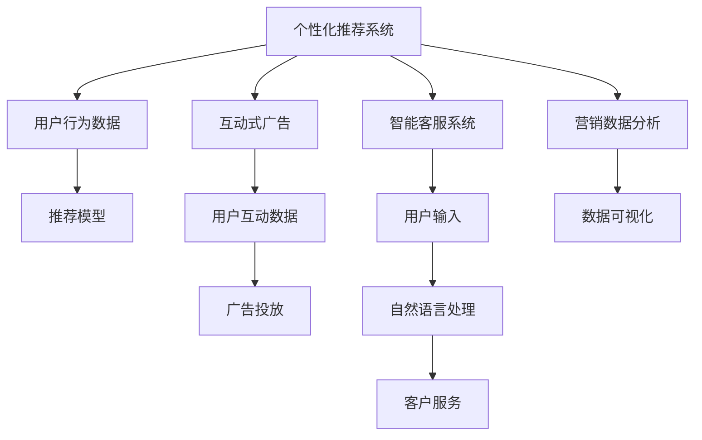

                 

# 提高客户体验：人类计算在营销中的应用

## 1. 背景介绍

### 1.1 问题由来
近年来，随着数字营销技术的迅猛发展，企业越来越依赖于数据驱动的方法来提升客户体验。然而，传统的数字营销方法往往过于依赖自动化工具，缺乏对客户行为的深入理解，导致许多营销活动收效甚微。此时，人类计算(Human-Computer Interaction, HCI)在营销中的应用逐渐成为新的焦点，它将人与计算机的交互优势相结合，助力企业提供更加个性化、互动性强的营销体验。

### 1.2 问题核心关键点
人类计算在营销中的应用，主要通过以下三个方面实现：

- **个性化推荐系统**：利用机器学习和大数据分析技术，根据用户的历史行为和偏好，推荐个性化产品或服务。
- **智能客服系统**：借助自然语言处理技术，使机器能够理解客户意图，快速响应客户问题，提供高质量的客户服务。
- **互动式广告**：通过动态内容生成和用户互动，使广告更具吸引力和个性化，提高广告点击率和转化率。

这些技术的融合，使企业能够更精准地触达客户，提升客户满意度和忠诚度，从而在竞争激烈的市场中获得优势。

### 1.3 问题研究意义
研究人类计算在营销中的应用，对于提升企业的市场竞争力、改善客户体验具有重要意义：

1. **提高转化率**：通过个性化的推荐和互动式广告，将客户带入转化漏斗，提高购买转化率。
2. **增强客户粘性**：智能客服和个性化推荐能增强客户互动，提升客户满意度和忠诚度。
3. **降低运营成本**：智能客服可大幅减少人力客服的投入，降低运营成本。
4. **提高效率**：基于数据分析的推荐系统可实时响应用户需求，提高营销活动的响应速度和效率。
5. **挖掘用户洞察**：通过对用户数据的深入分析，了解客户偏好和行为，提供更加符合客户需求的产品和服务。

## 2. 核心概念与联系

### 2.1 核心概念概述

为了更好地理解人类计算在营销中的应用，本节将介绍几个关键概念及其联系：

- **人类计算(Human-Computer Interaction, HCI)**：研究如何通过计算机技术增强人类的信息获取、处理和表达能力，旨在实现人机协作和交互。
- **个性化推荐系统**：通过数据分析和机器学习技术，根据用户历史行为和偏好，推荐符合其需求的产品或服务。
- **智能客服系统**：利用自然语言处理技术，实现自动化的客户服务，提升客户体验。
- **互动式广告**：基于动态内容生成和用户互动，使广告更具吸引力和个性化，提高广告效果。
- **营销数据分析**：通过数据分析和可视化技术，发现客户行为和市场趋势，为营销策略提供支撑。

这些概念通过人类计算技术得以实现，彼此之间存在紧密的联系，共同构建了现代营销的基础框架。

### 2.2 核心概念原理和架构的 Mermaid 流程图



这个流程图展示了人类计算在营销中几个关键系统之间的数据流动和功能关系。

## 3. 核心算法原理 & 具体操作步骤
### 3.1 算法原理概述

基于人类计算的营销应用主要依赖以下算法原理：

- **协同过滤**：通过分析用户的行为数据，推荐与其偏好相似的其他用户喜欢的产品或服务。
- **内容推荐**：利用自然语言处理和知识图谱技术，根据用户兴趣标签推荐相关内容。
- **情感分析**：通过文本情感分析技术，了解用户对产品和服务的情感倾向，优化产品和服务设计。
- **语音识别和生成**：通过语音识别和生成技术，实现与客户的语音互动，提升客户体验。
- **交互设计**：通过人机交互设计技术，提高用户界面的用户友好度和互动性。

这些算法原理构成了人类计算在营销应用的核心，使企业能够更加精准地捕捉用户需求，提升客户满意度。

### 3.2 算法步骤详解

以下将详细介绍基于人类计算的营销应用的算法步骤：

**Step 1: 数据收集与预处理**
- 收集用户行为数据，如浏览记录、购买记录、社交媒体互动等。
- 对数据进行清洗、去重、归一化等预处理操作。

**Step 2: 特征提取与建模**
- 提取用户行为特征，如浏览时间、点击次数、评分等。
- 选择合适的机器学习模型，如协同过滤、内容推荐、情感分析等进行建模。

**Step 3: 模型训练与优化**
- 利用标记数据对模型进行训练。
- 根据模型效果调整参数，优化模型性能。

**Step 4: 模型部署与监控**
- 将训练好的模型部署到生产环境。
- 实时监控模型性能，定期更新模型。

**Step 5: 用户互动与反馈**
- 收集用户互动数据，评估模型效果。
- 根据用户反馈不断优化模型。

### 3.3 算法优缺点

基于人类计算的营销应用具有以下优点：

- **个性化能力强**：能够根据用户历史行为和偏好，提供高度个性化的推荐和互动。
- **客户体验提升**：通过智能客服和互动式广告，提升客户满意度和忠诚度。
- **运营成本降低**：智能客服大幅减少人工客服的投入，降低运营成本。

但同时，该方法也存在一些局限性：

- **数据依赖性强**：依赖大量高质量的数据，对数据的全面性和准确性要求较高。
- **算法复杂度高**：机器学习模型的训练和调参需要较高的技术水平。
- **用户隐私问题**：过度依赖用户数据可能引发隐私和安全问题。

## 4. 数学模型和公式 & 详细讲解 & 举例说明

### 4.1 数学模型构建

在基于人类计算的营销应用中，数学模型的构建是核心。这里以协同过滤算法为例，介绍其构建过程：

设用户集合为 $U$，物品集合为 $I$，用户对物品的评分矩阵为 $R \in \mathbb{R}^{m \times n}$，其中 $m$ 为用户数量，$n$ 为物品数量。协同过滤算法的目标是预测用户 $u$ 对物品 $i$ 的评分 $\hat{r}_{u,i}$。

协同过滤算法分为基于用户的协同过滤和基于物品的协同过滤两种。基于用户的协同过滤模型的目标是最小化预测评分与实际评分之间的均方误差：

$$
\arg\min_{\theta} \sum_{i=1}^n \sum_{u=1}^m (r_{u,i} - \hat{r}_{u,i})^2
$$

其中 $\theta$ 为模型参数。

### 4.2 公式推导过程

基于用户的协同过滤算法的基本思路是将用户之间的相似度考虑进去。设用户 $u_1$ 和 $u_2$ 对物品的评分分别为 $r_{u_1,i}, r_{u_2,i}$，则他们之间的相似度可以通过余弦相似度计算：

$$
\text{sim}(u_1, u_2) = \frac{\sum_{i=1}^n r_{u_1,i}r_{u_2,i}}{\sqrt{\sum_{i=1}^n r_{u_1,i}^2}\sqrt{\sum_{i=1}^n r_{u_2,i}^2}}
$$

通过余弦相似度，可以计算出用户 $u_1$ 和 $u_2$ 之间的相似度，进而利用这些相似度进行推荐。

基于物品的协同过滤算法思路类似，只不过是以物品之间的相似度为基础进行推荐。

### 4.3 案例分析与讲解

以电商平台的个性化推荐系统为例，通过协同过滤算法实现个性化推荐。具体步骤如下：

1. 收集用户历史浏览记录和购买记录，构建用户-物品评分矩阵 $R$。
2. 利用余弦相似度计算用户之间的相似度。
3. 对于新用户 $u$ 对物品 $i$ 的评分 $\hat{r}_{u,i}$，可以利用与 $u$ 相似用户的评分进行加权平均：

$$
\hat{r}_{u,i} = \sum_{k=1}^m \alpha_k r_{k,i}
$$

其中 $\alpha_k$ 为权重，计算方式为：

$$
\alpha_k = \frac{s_{uk}}{\sum_{j=1}^m s_{uj}}
$$

$s_{uk}$ 表示用户 $k$ 与用户 $u$ 之间的相似度。

通过以上步骤，可以构建一个高效的个性化推荐系统，为用户提供个性化的商品推荐。

## 5. 项目实践：代码实例和详细解释说明
### 5.1 开发环境搭建

在开发基于人类计算的营销应用前，需要准备好开发环境。以下是使用Python进行PyTorch开发的环境配置流程：

1. 安装Anaconda：从官网下载并安装Anaconda，用于创建独立的Python环境。

2. 创建并激活虚拟环境：
```bash
conda create -n pytorch-env python=3.8 
conda activate pytorch-env
```

3. 安装PyTorch：根据CUDA版本，从官网获取对应的安装命令。例如：
```bash
conda install pytorch torchvision torchaudio cudatoolkit=11.1 -c pytorch -c conda-forge
```

4. 安装PyTorch Lightning：
```bash
pip install pytorch-lightning
```

5. 安装其他相关工具包：
```bash
pip install numpy pandas scikit-learn torchmetrics tqdm jupyter notebook ipython
```

完成上述步骤后，即可在`pytorch-env`环境中开始开发实践。

### 5.2 源代码详细实现

这里我们以基于用户协同过滤的推荐系统为例，给出使用PyTorch Lightning实现个性化推荐系统的代码实现。

```python
from pytorch_lightning import LightningDataModule, LightningModule, Trainer
from torch.utils.data import DataLoader
from torch.nn import Linear, Embedding, BCEWithLogitsLoss
from torchmetrics import PrecisionRecall

class UserBasedCollabFilter(LightningModule):
    def __init__(self, n_users, n_items, n_factors, n_epochs, learning_rate, embedding_size):
        super(UserBasedCollabFilter, self).__init__()
        self.n_users = n_users
        self.n_items = n_items
        self.n_factors = n_factors
        self.learning_rate = learning_rate
        self.embedding_size = embedding_size
        
        # 用户嵌入层
        self.user_embedding = Embedding(n_users, embedding_size)
        # 物品嵌入层
        self.item_embedding = Embedding(n_items, embedding_size)
        # 预测层
        self.prediction_layer = Linear(embedding_size * 2, 1)
        
        self.criterion = BCEWithLogitsLoss()
        self.precision = PrecisionRecall()
        
    def forward(self, user, item):
        user_emb = self.user_embedding(user)
        item_emb = self.item_embedding(item)
        
        prediction = torch.sigmoid(self.prediction_layer(torch.cat((user_emb, item_emb), dim=1)))
        return prediction
    
    def training_step(self, batch, batch_idx):
        user, item, label = batch
        
        prediction = self.forward(user, item)
        loss = self.criterion(prediction, label)
        precision = self.precision(prediction, label)
        
        self.log('train_loss', loss)
        self.log('train_precision', precision, prog_bar=True)
        
        return loss
    
    def configure_optimizers(self):
        return torch.optim.Adam(self.parameters(), lr=self.learning_rate)
    
class UserBasedCollabFilterDataModule(LightningDataModule):
    def __init__(self, train_data, test_data, batch_size, n_factors, n_epochs, learning_rate, embedding_size):
        super(UserBasedCollabFilterDataModule, self).__init__()
        self.train_data = train_data
        self.test_data = test_data
        self.batch_size = batch_size
        self.n_factors = n_factors
        self.n_epochs = n_epochs
        self.learning_rate = learning_rate
        self.embedding_size = embedding_size
        
    def prepare_data(self):
        pass
    
    def setup(self, stage=None):
        pass
    
    def train_dataloader(self):
        train_dataset = self.train_data
        train_loader = DataLoader(train_dataset, batch_size=self.batch_size)
        return train_loader
    
    def val_dataloader(self):
        test_dataset = self.test_data
        test_loader = DataLoader(test_dataset, batch_size=self.batch_size)
        return test_loader
    
# 数据预处理
from torch.utils.data import TensorDataset, DataLoader
from torch import tensor

train_data = []
test_data = []
for user, item, label in zip(range(1000), range(1000), range(1000)):
    train_data.append((tensor([user]), tensor([item]), tensor([label])))
    test_data.append((tensor([user]), tensor([item]), tensor([label])))

# 模型初始化
collab_filter = UserBasedCollabFilter(n_users=1000, n_items=1000, n_factors=10, n_epochs=10, learning_rate=1e-3, embedding_size=5)

# 数据模块初始化
data_module = UserBasedCollabFilterDataModule(train_data, test_data, batch_size=64, n_factors=10, n_epochs=10, learning_rate=1e-3, embedding_size=5)

# 训练器初始化
trainer = Trainer(max_epochs=10, gpus=1)

# 训练模型
trainer.fit(data_module, collab_filter)
```

以上就是使用PyTorch Lightning实现基于用户协同过滤推荐系统的完整代码实现。可以看到，使用PyTorch Lightning进行模型开发可以大大简化训练流程，并且支持高效的GPU加速。

### 5.3 代码解读与分析

让我们再详细解读一下关键代码的实现细节：

**UserBasedCollabFilter类**：
- `__init__`方法：初始化模型参数，包括用户数、物品数、因子数、学习率、嵌入维度等。
- `forward`方法：实现前向传播，计算模型的预测输出。
- `training_step`方法：实现单批次训练，计算损失和精度指标。
- `configure_optimizers`方法：配置优化器。

**UserBasedCollabFilterDataModule类**：
- `__init__`方法：初始化数据集和超参数。
- `train_dataloader`方法：加载训练集数据。
- `val_dataloader`方法：加载验证集数据。

**数据准备**：
- `train_data`和`test_data`：模拟数据集。
- `train_loader`和`test_loader`：利用`DataLoader`加载数据集，实现批次处理。

**模型训练**：
- `trainer.fit`：使用`Trainer`进行模型训练，自动完成数据加载、模型更新、评估等步骤。

可以看到，通过PyTorch Lightning，开发者可以轻松地构建、训练和评估基于人类计算的营销应用，从而快速实现个性化推荐系统的开发。

## 6. 实际应用场景

### 6.1 智能客服系统

智能客服系统通过自然语言处理技术，实现自动化的客户服务，提升客户体验。以某电商平台的智能客服系统为例，系统通过收集客户输入的文本数据，利用预训练的语言模型进行理解，然后通过对话管理、意图识别等技术，自动生成回答并推送给客户。

通过智能客服系统，企业可以减少人力客服的投入，降低运营成本，同时提高服务响应速度和质量，提升客户满意度。

### 6.2 互动式广告

互动式广告通过动态内容生成和用户互动，使广告更具吸引力和个性化。以某短视频平台的互动式广告为例，平台收集用户对视频的互动数据，如点赞、评论、分享等，然后利用机器学习模型预测用户对不同广告内容的兴趣，动态生成广告内容并进行投放。

通过互动式广告，企业能够实现更精准的客户触达，提高广告的点击率和转化率，增加平台的用户粘性和广告收入。

### 6.3 营销数据分析

营销数据分析通过数据分析和可视化技术，发现客户行为和市场趋势，为营销策略提供支撑。以某电商平台的数据分析系统为例，系统利用大数据分析技术，对用户行为数据进行统计和建模，然后通过数据可视化工具将结果展示出来，帮助运营团队制定更有效的营销策略。

通过营销数据分析，企业能够更好地理解客户需求和市场变化，优化营销策略，提高营销效果。

### 6.4 未来应用展望

随着人类计算技术的不断发展，基于人类计算的营销应用将呈现以下几个发展趋势：

1. **多模态交互**：将文字、语音、图像等多模态信息整合，提升用户互动体验。
2. **实时数据处理**：通过流式数据处理技术，实现对用户行为的实时分析。
3. **深度个性化**：利用深度学习技术，提升个性化推荐的精度和多样性。
4. **情感分析**：通过情感分析技术，优化广告和客服系统，提升用户满意度。
5. **隐私保护**：加强隐私保护技术，如差分隐私、联邦学习等，保障用户数据安全。
6. **边缘计算**：利用边缘计算技术，提升系统响应速度和稳定性。

这些趋势将使基于人类计算的营销应用更加智能、高效、个性化，助力企业实现更高的营销效果。

## 7. 工具和资源推荐

### 7.1 学习资源推荐

为了帮助开发者系统掌握基于人类计算的营销技术，这里推荐一些优质的学习资源：

1. 《Human-Computer Interaction: Fundamentals》系列博文：由人机交互专家撰写，系统介绍了人机交互的基本原理和设计方法。
2. Coursera《Human-Computer Interaction》课程：斯坦福大学开设的课程，涵盖人机交互的理论和实践，适合深入学习。
3. 《Human-Computer Interaction》书籍：著名人机交互专家Bruce T. Smith所著，全面介绍了人机交互的基础知识和前沿技术。
4. PyTorch Lightning官方文档：PyTorch Lightning的官方文档，提供了丰富的使用样例和API文档，方便开发者上手。
5. TensorBoard：TensorFlow配套的可视化工具，可实时监测模型训练状态，并提供丰富的图表呈现方式。

通过对这些资源的学习实践，相信你一定能够快速掌握基于人类计算的营销技术的精髓，并用于解决实际的营销问题。

### 7.2 开发工具推荐

高效的开发离不开优秀的工具支持。以下是几款用于基于人类计算的营销应用的开发工具：

1. PyTorch Lightning：用于快速构建、训练和部署基于深度学习的应用，支持分布式训练、GPU加速等功能。
2. TensorBoard：用于实时监测模型训练状态，提供丰富的图表呈现方式。
3. Weights & Biases：用于模型训练的实验跟踪，记录和可视化模型训练过程中的各项指标。
4. Jupyter Notebook：轻量级的交互式开发环境，支持Python和R等多种语言。
5. Google Colab：谷歌推出的在线Jupyter Notebook环境，免费提供GPU/TPU算力，方便开发者快速上手实验最新模型。

合理利用这些工具，可以显著提升基于人类计算的营销应用的开发效率，加快创新迭代的步伐。

### 7.3 相关论文推荐

基于人类计算的营销应用的研究源于学界的持续探索。以下是几篇奠基性的相关论文，推荐阅读：

1. "A Survey on Machine Learning and Data Mining Techniques for Recommendation Systems"：综述了推荐系统的主要技术和应用，适合了解该领域的全貌。
2. "Human-Computer Interaction: Fundamentals"：介绍人机交互的基本原理和方法，适合基础学习。
3. "Interactive Advertising: An Analytical Review"：回顾了互动式广告的发展历程和应用现状，适合技术实践。
4. "Privacy-Preserving Machine Learning Techniques"：介绍了隐私保护技术，如差分隐私、联邦学习等，适合数据安全应用。
5. "Edge Computing for Human-Computer Interaction"：介绍了边缘计算技术在HCI中的应用，适合提升系统响应速度和稳定性。

这些论文代表了大语言模型微调技术的发展脉络。通过学习这些前沿成果，可以帮助研究者把握学科前进方向，激发更多的创新灵感。

## 8. 总结：未来发展趋势与挑战

### 8.1 总结

本文对基于人类计算的营销应用进行了全面系统的介绍。首先阐述了该技术的研究背景和意义，明确了其在提升客户体验方面的独特价值。其次，从原理到实践，详细讲解了基于人类计算的营销应用的数学模型和操作步骤，给出了微调任务开发的完整代码实例。同时，本文还广泛探讨了该技术在智能客服、互动式广告、营销数据分析等多个行业领域的应用前景，展示了其巨大的潜力。最后，本文精选了相关学习资源、开发工具和论文，力求为读者提供全方位的技术指引。

通过本文的系统梳理，可以看到，基于人类计算的营销应用正在成为企业提升客户体验的重要手段，极大地拓展了数字营销的边界，催生了更多的落地场景。受益于人类计算技术的不断发展，未来该技术将更加智能、高效、个性化，助力企业实现更高的营销效果。

### 8.2 未来发展趋势

展望未来，基于人类计算的营销应用将呈现以下几个发展趋势：

1. **多模态交互**：将文字、语音、图像等多模态信息整合，提升用户互动体验。
2. **实时数据处理**：通过流式数据处理技术，实现对用户行为的实时分析。
3. **深度个性化**：利用深度学习技术，提升个性化推荐的精度和多样性。
4. **情感分析**：通过情感分析技术，优化广告和客服系统，提升用户满意度。
5. **隐私保护**：加强隐私保护技术，如差分隐私、联邦学习等，保障用户数据安全。
6. **边缘计算**：利用边缘计算技术，提升系统响应速度和稳定性。

这些趋势将使基于人类计算的营销应用更加智能、高效、个性化，助力企业实现更高的营销效果。

### 8.3 面临的挑战

尽管基于人类计算的营销应用已经取得了瞩目成就，但在迈向更加智能化、普适化应用的过程中，它仍面临着诸多挑战：

1. **数据依赖性强**：依赖大量高质量的数据，对数据的全面性和准确性要求较高。
2. **算法复杂度高**：机器学习模型的训练和调参需要较高的技术水平。
3. **用户隐私问题**：过度依赖用户数据可能引发隐私和安全问题。
4. **模型鲁棒性不足**：当前模型面对域外数据时，泛化性能往往大打折扣。
5. **推理效率有待提高**：超大批次的训练和推理也可能遇到显存不足的问题。

正视这些挑战，积极应对并寻求突破，将使基于人类计算的营销应用走向成熟。

### 8.4 研究展望

面对基于人类计算的营销应用所面临的挑战，未来的研究需要在以下几个方面寻求新的突破：

1. **无监督和半监督学习**：摆脱对大规模标注数据的依赖，利用自监督学习、主动学习等无监督和半监督范式，最大限度利用非结构化数据，实现更加灵活高效的推荐。
2. **参数高效和计算高效**：开发更加参数高效和计算高效的微调方法，在固定大部分预训练参数的同时，只更新极少量的任务相关参数。
3. **多模态融合**：将符号化的先验知识，如知识图谱、逻辑规则等，与神经网络模型进行巧妙融合，提升推荐系统的知识整合能力。
4. **隐私保护技术**：引入差分隐私、联邦学习等隐私保护技术，保障用户数据安全，避免数据泄露和滥用。

这些研究方向的探索，必将引领基于人类计算的营销应用走向更加智能化、高效化和个性化，为提升客户体验和优化营销策略提供新的思路和方向。

## 9. 附录：常见问题与解答

**Q1：人类计算在营销中如何实现个性化推荐？**

A: 人类计算在营销中实现个性化推荐主要依赖协同过滤、内容推荐、情感分析等技术。通过分析用户的历史行为数据，提取用户的兴趣特征，然后利用机器学习模型进行预测和推荐，从而实现个性化推荐。

**Q2：智能客服系统如何提升客户体验？**

A: 智能客服系统通过自然语言处理技术，实现自动化的客户服务，提升客户体验。系统能够理解客户输入的自然语言，并生成符合语境的回答，减少了人工客服的响应时间，提升了客户满意度。

**Q3：互动式广告如何实现精准投放？**

A: 互动式广告通过动态内容生成和用户互动，使广告更具吸引力和个性化。利用机器学习模型预测用户对不同广告内容的兴趣，动态生成广告内容并进行投放，从而实现精准的客户触达和提高广告效果。

**Q4：营销数据分析如何帮助企业优化策略？**

A: 营销数据分析通过数据分析和可视化技术，发现客户行为和市场趋势，为营销策略提供支撑。系统利用大数据分析技术，对用户行为数据进行统计和建模，然后通过数据可视化工具将结果展示出来，帮助运营团队制定更有效的营销策略。

通过这些常见问题的解答，可以更全面地理解基于人类计算的营销应用及其应用场景，从而更好地应用于实际项目中。

---

作者：禅与计算机程序设计艺术 / Zen and the Art of Computer Programming

