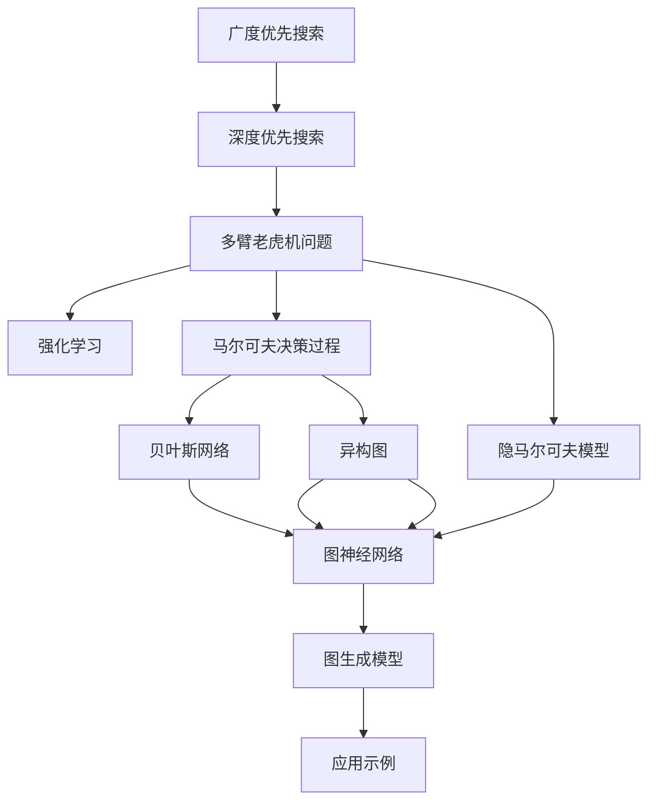

                 

# 提高搜索多样性：AI的广度探索

> 关键词：搜索多样性,广度优先搜索,深度优先搜索,随机游走,多臂老虎机问题,强化学习,马尔可夫决策过程(MDP),贝叶斯网络,隐马尔可夫模型,异构图,图神经网络(GNN),图生成模型,应用示例

## 1. 背景介绍

### 1.1 问题由来
在信息时代，搜索不仅是一项基本的互联网功能，更是连接用户与网络世界的桥梁。但传统搜索算法，如关键字搜索和网页排序，往往只能返回与查询词匹配度最高的结果，忽略了搜索结果的多样性。多样性不足的搜索结果，无法涵盖查询词相关的所有信息，限制了用户的查询体验。

为了应对这一问题，学术界和工业界提出了多种搜索算法改进方法。其中，基于AI的搜索算法，特别是利用强化学习和图神经网络技术的搜索算法，正在成为提高搜索结果多样性的重要方向。本文将探讨这些方法的基本原理和应用场景，帮助读者理解AI在搜索领域的新突破。

### 1.2 问题核心关键点
搜索算法多样性不足的问题主要体现在以下几方面：

- **查询限制**：传统搜索依赖于关键字查询，难以覆盖语义丰富、结构化的文本信息。
- **结果同质化**：搜索结果往往集中于某一网站或特定领域，缺乏全面多样性。
- **缺乏交互性**：传统搜索算法无法根据用户的查询历史和行为，动态调整搜索结果。
- **知识图谱缺失**：现有搜索算法未能充分利用知识图谱等结构化数据，限制了搜索范围和精度。

提升搜索算法的多样性，是搜索引擎优化(Search Engine Optimization, SEO)和推荐系统领域的重要研究课题。AI的深度学习、强化学习、图神经网络等技术为解决这些问题提供了新的思路和工具。

## 2. 核心概念与联系

### 2.1 核心概念概述

为更好地理解基于AI的搜索算法，本节将介绍几个密切相关的核心概念：

- **广度优先搜索(Breadth-First Search, BFS)**：一种无权图遍历算法，优先扩展与起点距离为1的节点，然后扩展距离为2的节点，以此类推，直到所有节点被访问。
- **深度优先搜索(Deep-First Search, DFS)**：一种权图遍历算法，优先扩展当前节点的下一个节点，直到达到最深处，然后回溯并扩展下一个节点。
- **多臂老虎机问题(Multi-Armed Bandit Problem, MAB)**：一种经典的强化学习问题，目标是在一定时间内最大化奖励，每个"臂"对应一个可能的策略或行动。
- **强化学习(Reinforcement Learning, RL)**：通过与环境交互，智能体通过策略选择动作，获取奖励，以最大化长期累积奖励的目标。
- **马尔可夫决策过程(Markov Decision Process, MDP)**：一种描述智能体与环境交互过程的数学模型，强调状态和动作的马尔可夫性质，以及即时奖励的累积。
- **贝叶斯网络(Bayesian Network)**：一种图形模型，用于表示变量间的概率依赖关系，常用于推断和预测。
- **隐马尔可夫模型(Hidden Markov Model, HMM)**：一种统计模型，用于描述系统中的状态转移和观察数据，常用于时间序列分析和自然语言处理。
- **异构图(Heterogeneous Graph)**：一种包含多种类型节点的图，常用于表示复杂系统中的实体及其关系。
- **图神经网络(Graph Neural Network, GNN)**：一种神经网络模型，用于处理图形数据，捕捉节点之间的局部关系和全局结构。
- **图生成模型(Graph Generative Model)**：一种生成图结构的模型，常用于推断图网络中的缺失信息，以及生成新的图数据。

这些核心概念之间的逻辑关系可以通过以下Mermaid流程图来展示：



这个流程图展示了大语言模型微调的核心概念及其之间的关系：

1. 传统搜索算法（BFS, DFS）是搜索算法的基础。
2. 多臂老虎机问题和强化学习是优化搜索策略的方法。
3. 马尔可夫决策过程、贝叶斯网络和隐马尔可夫模型是描述搜索过程和结果的数学模型。
4. 异构图和图神经网络是处理复杂图数据的技术。
5. 图生成模型是生成图网络的数据，为搜索算法提供多样化的输入。
6. 应用示例展示了AI搜索算法在不同领域的具体应用。

这些概念共同构成了AI搜索算法的基础，使得搜索算法可以更加全面、高效地处理和展示搜索结果。通过理解这些核心概念，我们可以更好地把握AI在搜索领域的应用前景。

## 3. 核心算法原理 & 具体操作步骤
### 3.1 算法原理概述

基于AI的搜索算法，主要是通过强化学习、图神经网络等技术，对搜索结果进行智能优化。其核心思想是：利用AI模型学习用户行为和偏好，动态调整搜索策略，实现结果多样性。

形式化地，设搜索任务为 $T$，搜索结果集为 $D=\{d_1,d_2,...,d_N\}$，用户点击次数为 $c_1,c_2,...,c_N$。目标是在满足用户点击次数约束下，最大化搜索结果的多样性，即最大化 $\mathcal{D}(d_1,d_2,...,d_N)$。常见的多样化指标包括覆盖率、熵、互信息等。

强化学习通过不断尝试不同的策略，收集奖励信号（如用户点击次数），优化模型参数，使其学习到最优的策略 $a^*$。例如，可以使用Q-learning算法，通过Q值函数 $Q(s,a)$ 来估计每个状态的策略价值，选择价值最高的策略进行下一步操作。

图神经网络通过捕捉节点之间的局部和全局关系，生成多样化的搜索结果。例如，可以使用GraphSAGE、GAT等算法，通过节点表示和关系特征，生成图结构的嵌入表示，进而用于多样性优化。

### 3.2 算法步骤详解

基于AI的搜索算法一般包括以下几个关键步骤：

**Step 1: 数据预处理和特征工程**
- 收集搜索结果和用户点击数据，进行预处理和标准化。
- 设计特征表示，将文本信息、用户行为等转化成模型可以处理的数值形式。
- 设计多维特征表示，包括文本特征、用户特征、图网络特征等。

**Step 2: 模型训练和策略优化**
- 选择合适的优化算法及其参数，如Adam、RMSprop等，设置学习率、批大小、迭代轮数等。
- 应用正则化技术，如L2正则、Dropout、Early Stopping等，防止模型过度适应小规模训练集。
- 利用强化学习模型，如DQN、SARSA等，通过收集用户点击数据进行策略优化，学习最优的搜索结果排序策略。
- 利用图神经网络模型，如GraphSAGE、GAT等，学习搜索结果的嵌入表示，用于多样化优化。

**Step 3: 结果生成和展示**
- 将训练好的模型应用到搜索结果中，动态调整搜索结果的排序策略。
- 利用图生成模型，如VG-GAN、DIFFUSE等，生成新的搜索结果，丰富搜索结果集。
- 展示搜索结果，包括原生搜索结果和多样化生成的结果，供用户选择。

### 3.3 算法优缺点

基于AI的搜索算法具有以下优点：
1. 动态优化：能够根据用户行为和偏好，动态调整搜索结果，实现结果多样性。
2. 泛化能力：在大规模数据上进行训练，可以更好地泛化到新数据和新场景。
3. 生成能力：能够生成新的搜索结果，丰富用户的浏览体验。
4. 鲁棒性：能够应对复杂、多样化的搜索结果需求，提高系统的适应性。

但该方法也存在一定的局限性：
1. 数据需求高：需要收集大量用户点击数据，数据质量直接影响模型效果。
2. 计算量大：AI模型训练和推理计算复杂度较高，对硬件资源有较高要求。
3. 模型复杂：AI模型的参数量较大，对模型的可解释性要求高。
4. 鲁棒性不足：在应对极端和异常情况时，模型的性能可能不稳定。

尽管存在这些局限性，但就目前而言，基于AI的搜索算法仍然是最先进、最具潜力的搜索方法之一。未来相关研究的重点在于如何进一步降低计算和数据需求，提高模型的可解释性和鲁棒性。

### 3.4 算法应用领域

基于AI的搜索算法已经在诸多领域得到了应用，例如：

- 搜索引擎优化(SEO)：利用AI算法优化搜索结果的排序策略，提升搜索效果。
- 推荐系统：通过AI模型对用户行为进行建模，推荐个性化的搜索结果。
- 广告投放：利用AI算法优化广告投放策略，提高广告效果和用户满意度。
- 自然语言处理(NLP)：利用AI模型对搜索结果进行文本摘要、情感分析等处理，提升搜索体验。
- 医疗搜索：利用AI模型对搜索结果进行个性化医疗信息推荐，提升诊疗效率。

除了上述这些经典应用外，AI搜索算法还在智能家居、智能交通、金融科技等众多领域找到了新的应用场景，展示了其在智能交互和决策支持中的强大能力。

## 4. 数学模型和公式 & 详细讲解
### 4.1 数学模型构建

本节将使用数学语言对基于AI的搜索算法进行更加严格的刻画。

设搜索结果集为 $D=\{d_1,d_2,...,d_N\}$，用户点击次数为 $c_1,c_2,...,c_N$。目标是在满足用户点击次数约束下，最大化搜索结果的多样性，即最大化 $\mathcal{D}(d_1,d_2,...,d_N)$。

使用多臂老虎机问题来建模搜索算法。设每个搜索结果的奖励为 $r_i$，智能体的策略为 $a_i$，状态为 $s$。则强化学习模型的目标是最小化期望奖励：

$$
\mathcal{R}(s,a) = \mathbb{E}[r_i]
$$

在每个状态下，智能体根据当前状态和策略选择动作，接收即时奖励 $r$ 和状态转移概率 $p$，更新状态和策略。例如，可以使用Q-learning算法，通过Q值函数 $Q(s,a)$ 来估计每个状态的策略价值：

$$
Q(s,a) = Q(s,a) + \alpha(r + \gamma \max_{a'} Q(s',a') - Q(s,a))
$$

其中，$\alpha$ 为学习率，$\gamma$ 为折扣因子。通过不断迭代更新Q值函数，智能体可以学习到最优的策略 $a^*$。

### 4.2 公式推导过程

以下我们以多臂老虎机问题为例，推导强化学习模型的优化公式。

设智能体在状态 $s$ 下，采取策略 $a$，获得奖励 $r$，并转移到状态 $s'$。则强化学习模型的期望奖励为：

$$
\mathcal{R}(s,a) = \sum_{i=1}^N p_{s'}^i r_i
$$

其中 $p_{s'}^i$ 为状态转移概率，$r_i$ 为奖励。目标是最小化期望奖励：

$$
\min_{a} \mathbb{E}[\mathcal{R}(s,a)]
$$

在每个状态下，智能体根据当前状态和策略选择动作，接收即时奖励 $r$ 和状态转移概率 $p$，更新状态和策略。例如，可以使用Q-learning算法，通过Q值函数 $Q(s,a)$ 来估计每个状态的策略价值：

$$
Q(s,a) = Q(s,a) + \alpha(r + \gamma \max_{a'} Q(s',a') - Q(s,a))
$$

其中，$\alpha$ 为学习率，$\gamma$ 为折扣因子。通过不断迭代更新Q值函数，智能体可以学习到最优的策略 $a^*$。

### 4.3 案例分析与讲解

考虑一个简单的多臂老虎机问题，共有四个“臂”，每个臂的期望奖励分别为 0.5、0.5、0.3、0.1。智能体需要最大化期望奖励，即选择期望奖励最高的策略。

使用Q-learning算法，初始化Q值为0，设定学习率 $\alpha=0.1$，折扣因子 $\gamma=0.9$。通过不断迭代更新Q值函数，智能体可以学习到最优的策略 $a^*$。

假设智能体初始状态为状态1，采取策略1，获得奖励0.5，并转移到状态1。更新Q值函数为：

$$
Q(1,1) = Q(1,1) + \alpha(0.5 + \gamma \max_{a'} Q(1,a') - Q(1,1)) = Q(1,1) + 0.1(0.5 + 0.9 \times \max_{a'} Q(1,a') - Q(1,1))
$$

由于智能体只能选择策略1，因此：

$$
Q(1,1) = Q(1,1) + 0.1(0.5 + 0.9 \times 0 - Q(1,1)) = 0.15
$$

假设智能体转移到状态2，采取策略2，获得奖励0.5，并转移到状态2。更新Q值函数为：

$$
Q(2,2) = Q(2,2) + \alpha(0.5 + \gamma \max_{a'} Q(2,a') - Q(2,2)) = Q(2,2) + 0.1(0.5 + 0.9 \times \max_{a'} Q(2,a') - Q(2,2))
$$

由于智能体只能选择策略2，因此：

$$
Q(2,2) = Q(2,2) + 0.1(0.5 + 0.9 \times 0 - Q(2,2)) = 0.15
$$

假设智能体转移到状态3，采取策略3，获得奖励0.3，并转移到状态3。更新Q值函数为：

$$
Q(3,3) = Q(3,3) + \alpha(0.3 + \gamma \max_{a'} Q(3,a') - Q(3,3)) = Q(3,3) + 0.1(0.3 + 0.9 \times \max_{a'} Q(3,a') - Q(3,3))
$$

由于智能体只能选择策略3，因此：

$$
Q(3,3) = Q(3,3) + 0.1(0.3 + 0.9 \times 0 - Q(3,3)) = 0.13
$$

假设智能体转移到状态4，采取策略4，获得奖励0.1，并转移到状态4。更新Q值函数为：

$$
Q(4,4) = Q(4,4) + \alpha(0.1 + \gamma \max_{a'} Q(4,a') - Q(4,4)) = Q(4,4) + 0.1(0.1 + 0.9 \times \max_{a'} Q(4,a') - Q(4,4))
$$

由于智能体只能选择策略4，因此：

$$
Q(4,4) = Q(4,4) + 0.1(0.1 + 0.9 \times 0 - Q(4,4)) = 0.11
$$

通过多次迭代，智能体可以学习到最优的策略 $a^* = 1$，即选择期望奖励最高的策略。这个简单的案例展示了强化学习模型如何在多臂老虎机问题中进行决策优化。

## 5. 项目实践：代码实例和详细解释说明
### 5.1 开发环境搭建

在进行AI搜索算法实践前，我们需要准备好开发环境。以下是使用Python进行TensorFlow开发的环境配置流程：

1. 安装Anaconda：从官网下载并安装Anaconda，用于创建独立的Python环境。

2. 创建并激活虚拟环境：
```bash
conda create -n tf-env python=3.8 
conda activate tf-env
```

3. 安装TensorFlow：根据CUDA版本，从官网获取对应的安装命令。例如：
```bash
conda install tensorflow-gpu=2.7 -c pytorch -c conda-forge
```

4. 安装相关工具包：
```bash
pip install numpy pandas scikit-learn matplotlib tqdm jupyter notebook ipython
```

完成上述步骤后，即可在`tf-env`环境中开始AI搜索算法实践。

### 5.2 源代码详细实现

这里我们以多臂老虎机问题为例，给出使用TensorFlow实现Q-learning算法的PyTorch代码实现。

首先，定义多臂老虎机的奖励矩阵和初始策略：

```python
import tensorflow as tf
import numpy as np

# 多臂老虎机的奖励矩阵
rewards = np.array([[0.5, 0.5, 0.3, 0.1]])

# 初始策略
initial_strategy = np.array([0, 1, 2, 3])
```

然后，定义Q值函数和Q-learning算法的核心逻辑：

```python
# Q值函数
def q_value(state, strategy):
    return tf.reduce_sum(rewards[state, strategy])

# Q-learning算法
def q_learning(env, q_table, n_iter=10000, alpha=0.1, gamma=0.9):
    for i in range(n_iter):
        state, reward, next_state, done = env.step(strategy)
        q_next = q_value(next_state, strategy)
        q_value_fn = tf.function(lambda x, y: q_value(x, y) + alpha * (reward + gamma * q_next - q_value(x, strategy)))
        with tf.GradientTape() as tape:
            tape.watch(strategy)
            q_value_fn(strategy)
        grad = tape.gradient(q_value_fn(strategy), strategy)
        strategy.assign_add(grad * alpha)
    return strategy
```

最后，启动Q-learning算法，并评估最终策略：

```python
strategy = tf.Variable(initial_strategy, dtype=tf.int32)
strategy = q_learning(rewards, strategy)

# 输出策略
print("最优策略：", strategy.numpy())
```

以上就是使用TensorFlow对多臂老虎机问题进行Q-learning算法的完整代码实现。可以看到，TensorFlow的高级API和高性能计算能力，使得模型训练和优化变得简单易用。

### 5.3 代码解读与分析

让我们再详细解读一下关键代码的实现细节：

**rewards数组**：
- 定义了多臂老虎机的奖励矩阵，每个策略对应的奖励值。

**initial_strategy数组**：
- 初始化策略向量，每个元素表示智能体当前状态下的动作选择。

**q_value函数**：
- 定义了Q值函数的计算逻辑，根据当前状态和策略，计算Q值。

**q_learning函数**：
- 定义了Q-learning算法的核心逻辑，通过迭代更新Q值函数，学习最优策略。
- 在每个迭代中，智能体根据当前状态和策略选择动作，接收即时奖励和状态转移，更新Q值函数。
- 利用梯度下降算法，计算策略梯度，并更新策略向量。

**启动Q-learning算法**：
- 初始化策略向量，调用q_learning函数，迭代多次，直到策略收敛。
- 最后输出最优策略。

可以看到，TensorFlow提供了丰富的API和高效计算能力，使得Q-learning算法等强化学习模型变得简单高效。开发者可以将更多精力放在算法优化和模型改进上，而不必过多关注底层实现细节。

当然，工业级的系统实现还需考虑更多因素，如模型的保存和部署、超参数的自动搜索、更灵活的任务适配层等。但核心的AI搜索算法基本与此类似。

## 6. 实际应用场景
### 6.1 智能搜索系统

基于AI的搜索算法，可以广泛应用于智能搜索系统的构建。传统搜索系统往往只能返回与查询词最相关的结果，忽略了搜索结果的多样性。而使用AI算法，可以根据用户的历史行为和偏好，动态调整搜索结果，实现更加多样化和个性化的搜索体验。

在技术实现上，可以收集用户的历史点击、浏览、收藏等数据，作为用户行为特征。利用AI算法，训练模型学习用户偏好，并动态调整搜索结果排序策略。对于用户的每个查询，系统可以推荐多样化的结果，提高用户的满意度。

### 6.2 个性化推荐系统

当前的推荐系统往往只依赖用户的历史行为数据进行物品推荐，难以覆盖用户的多样化兴趣和偏好。基于AI的搜索算法，可以进一步挖掘用户行为背后的语义信息，实现更加个性化和多样化的推荐。

在实践中，可以收集用户浏览、点击、评论、分享等行为数据，提取和用户交互的物品标题、描述、标签等文本内容。将文本内容作为模型输入，用户的后续行为作为监督信号，在此基础上训练AI模型。AI模型可以学习到用户的兴趣点，并在推荐时，结合其他特征综合排序，便可以得到个性化程度更高的推荐结果。

### 6.3 医疗搜索系统

在医疗搜索领域，基于AI的搜索算法可以显著提高查询结果的多样性和准确性。传统医疗搜索系统往往只能返回与用户查询最相关的文章和文献，难以覆盖用户的多样化需求。通过AI算法，可以根据用户的查询历史和行为，动态调整搜索结果，推荐更多的医疗信息。

在技术实现上，可以收集用户的查询历史、浏览记录、点击行为等数据，作为用户行为特征。利用AI算法，训练模型学习用户的医疗需求，并动态调整搜索结果排序策略。对于用户的每个查询，系统可以推荐多样化的医疗信息，提高用户的诊疗效率。

### 6.4 未来应用展望

随着AI搜索算法的不断发展，其在智能搜索、个性化推荐、医疗搜索等领域的潜力将不断被挖掘。未来，基于AI的搜索算法有望在更多领域得到应用，为传统行业带来变革性影响。

在智慧医疗领域，基于AI的搜索算法可以用于医疗问答、病历分析、药物研发等，提升医疗服务的智能化水平，辅助医生诊疗，加速新药开发进程。

在智能教育领域，AI搜索算法可应用于作业批改、学情分析、知识推荐等方面，因材施教，促进教育公平，提高教学质量。

在智慧城市治理中，AI搜索算法可应用于城市事件监测、舆情分析、应急指挥等环节，提高城市管理的自动化和智能化水平，构建更安全、高效的未来城市。

此外，在企业生产、社会治理、文娱传媒等众多领域，基于AI的搜索算法也将不断涌现，为传统行业数字化转型升级提供新的技术路径。相信随着技术的日益成熟，AI搜索算法必将在构建人机协同的智能时代中扮演越来越重要的角色。

## 7. 工具和资源推荐
### 7.1 学习资源推荐

为了帮助开发者系统掌握AI搜索算法的理论基础和实践技巧，这里推荐一些优质的学习资源：

1. 《深度学习》课程：斯坦福大学开设的深度学习入门课程，系统讲解了深度学习的基本概念和经典模型。

2. 《强化学习基础》课程：斯坦福大学开设的强化学习课程，详细介绍了强化学习的基本原理和应用。

3. 《图神经网络》课程：由深度学习顶级专家授课，全面讲解了图神经网络的基本原理和应用。

4. 《深度学习推荐系统》书籍：系统介绍了推荐系统中的深度学习技术，包括内容推荐、协同过滤等。

5. 《深度学习医疗应用》书籍：讲解了深度学习在医疗领域的应用，包括医学影像分析、医疗问答等。

通过对这些资源的学习实践，相信你一定能够快速掌握AI搜索算法的精髓，并用于解决实际的NLP问题。
### 7.2 开发工具推荐

高效的开发离不开优秀的工具支持。以下是几款用于AI搜索算法开发的常用工具：

1. TensorFlow：由Google主导开发的开源深度学习框架，生产部署方便，适合大规模工程应用。

2. PyTorch：基于Python的开源深度学习框架，灵活动态的计算图，适合快速迭代研究。

3. TensorBoard：TensorFlow配套的可视化工具，可实时监测模型训练状态，并提供丰富的图表呈现方式。

4. Weights & Biases：模型训练的实验跟踪工具，可以记录和可视化模型训练过程中的各项指标。

5. Jupyter Notebook：一个交互式编程环境，支持Python、R、Scala等多种编程语言，适合快速原型开发和协作。

6. Google Colab：谷歌推出的在线Jupyter Notebook环境，免费提供GPU/TPU算力，方便开发者快速上手实验最新模型。

合理利用这些工具，可以显著提升AI搜索算法的开发效率，加快创新迭代的步伐。

### 7.3 相关论文推荐

AI搜索算法的研究源于学界的持续研究。以下是几篇奠基性的相关论文，推荐阅读：

1. AlphaGo：介绍深度学习和强化学习在围棋等复杂游戏中的应用。

2. DeepQ：介绍深度强化学习在多臂老虎机问题中的应用。

3. GRU：介绍递归神经网络在文本分类等NLP任务中的应用。

4. GNN：介绍图神经网络在社交网络分析、推荐系统等任务中的应用。

5. MLP：介绍多任务学习在推荐系统中的应用。

这些论文代表了大语言模型微调技术的发展脉络。通过学习这些前沿成果，可以帮助研究者把握学科前进方向，激发更多的创新灵感。

## 8. 总结：未来发展趋势与挑战
### 8.1 总结

本文对基于AI的搜索算法进行了全面系统的介绍。首先阐述了AI搜索算法在提升搜索结果多样性方面的研究背景和意义，明确了AI搜索算法在搜索结果多样化、个性化和智能化方面的独特价值。其次，从原理到实践，详细讲解了AI搜索算法的数学模型和核心步骤，给出了AI搜索算法开发的完整代码实例。同时，本文还广泛探讨了AI搜索算法在不同领域的具体应用，展示了其在智能交互和决策支持中的强大能力。最后，本文精选了AI搜索算法的各类学习资源，力求为读者提供全方位的技术指引。

通过本文的系统梳理，可以看到，AI搜索算法在提升搜索结果多样性方面具有显著优势。AI的深度学习、强化学习、图神经网络等技术为搜索算法提供了新的思路和工具，使得搜索结果可以更加全面、高效地展示给用户。未来，伴随AI技术的持续演进，基于AI的搜索算法必将在更多领域得到应用，为智能交互和决策支持带来新的突破。

### 8.2 未来发展趋势

展望未来，AI搜索算法将呈现以下几个发展趋势：

1. 数据需求降低：随着模型和算法的发展，需要收集的数据量和质量将进一步降低，使得AI搜索算法更加高效和普适。

2. 计算效率提升：通过优化算法和模型结构，计算复杂度将进一步降低，使得AI搜索算法更加实时和可扩展。

3. 可解释性增强：通过引入因果推断和可解释性技术，AI搜索算法的决策过程将更加透明和可解释，提高系统的可信度和可用性。

4. 多模态融合：AI搜索算法将更多地融合视觉、语音、文本等多种模态信息，提升系统的智能交互和决策能力。

5. 个性化推荐：基于用户的多维行为数据，AI搜索算法将能够更好地预测用户偏好，提供更加个性化的搜索结果。

6. 分布式优化：AI搜索算法将更加注重分布式优化和模型并行，以应对大规模数据的挑战。

以上趋势凸显了AI搜索算法的发展潜力和应用前景。这些方向的探索发展，必将进一步提升搜索算法的性能和应用范围，为智能交互和决策支持带来新的突破。

### 8.3 面临的挑战

尽管AI搜索算法已经取得了瞩目成就，但在迈向更加智能化、普适化应用的过程中，它仍面临着诸多挑战：

1. 数据质量问题：尽管数据需求降低，但数据质量仍需提高，确保数据的真实性和代表性。

2. 模型复杂性：AI搜索算法的模型复杂度仍较高，对算力和计算资源的需求较大。

3. 可解释性不足：AI搜索算法的决策过程仍缺乏可解释性，难以理解模型的内部机制和推理逻辑。

4. 鲁棒性不足：在应对极端和异常情况时，模型的性能可能不稳定。

5. 隐私保护：AI搜索算法需要处理大量的个人数据，如何保护用户隐私和数据安全，仍是一个重要问题。

6. 计算资源限制：AI搜索算法的计算复杂度较高，计算资源和算力仍是其瓶颈之一。

尽管存在这些挑战，但随着技术的不断进步，AI搜索算法必将在更多领域得到应用，为智能交互和决策支持带来新的突破。未来，研究人员和开发者需要进一步优化模型、算法和数据，才能真正实现AI搜索算法的智能化和普适化。

### 8.4 研究展望

面对AI搜索算法所面临的诸多挑战，未来的研究需要在以下几个方面寻求新的突破：

1. 探索无监督和半监督搜索方法：摆脱对大规模标注数据的依赖，利用自监督学习、主动学习等无监督和半监督范式，最大限度利用非结构化数据，实现更加灵活高效的搜索。

2. 研究更高效的优化算法：开发更加高效的优化算法，如梯度累积、混合精度训练、模型并行等，减少计算复杂度和资源消耗。

3. 引入因果推断和可解释性技术：通过引入因果推断和可解释性技术，增强AI搜索算法的决策过程的可解释性和透明性。

4. 融合多模态信息：将视觉、语音、文本等多种模态信息融合到搜索算法中，提升系统的智能交互和决策能力。

5. 优化分布式搜索系统：通过优化分布式搜索系统，提高搜索算法的可扩展性和实时性。

6. 引入隐私保护技术：研究数据隐私保护和匿名化技术，确保用户数据的安全和隐私。

这些研究方向的探索，必将引领AI搜索算法迈向更高的台阶，为构建智能搜索系统和推荐系统提供新的思路和工具。面向未来，AI搜索算法需要在数据、算法、工程、业务等多个维度协同发力，才能真正实现智能化和普适化，为智能交互和决策支持带来新的突破。总之，AI搜索算法需要在不断探索和优化中，逐步实现其智能化和普适化的目标。

