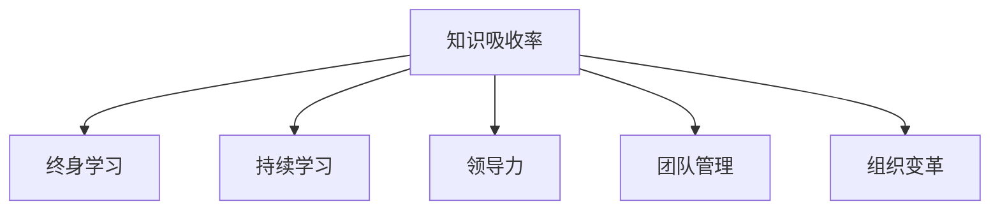

                 

# 提高知识吸收率:管理者成长的关键

> 关键词：知识吸收率,管理者成长,持续学习,终身学习,学习路径优化,领导力提升,决策力增强,团队管理,组织变革

## 1. 背景介绍

### 1.1 问题由来

在当前快速变化和竞争激烈的商业环境中，管理者需要不断学习新知识和技能，以适应市场变化和提升工作效率。然而，传统教育模式下学习效果不佳，很多人知识吸收率低，难以转化为实际的决策和管理能力。因此，如何提升知识吸收率，实现终身学习，已成为管理者成长的关键问题。

### 1.2 问题核心关键点
提升知识吸收率的核心在于将学习与工作实践深度结合，通过科学的学习路径规划，持续的反馈和调整，不断优化学习策略。这包括选择合适的学习方式、设置合理的学习目标、建立正向的学习激励机制等。管理者需要自我驱动，主动寻求和学习新的知识和技能，提高自身的决策力和领导力。

### 1.3 问题研究意义
提升知识吸收率对管理者个人成长、团队建设和组织变革具有重要意义：

1. 个人成长：管理者通过持续学习，不断更新知识结构，提升解决问题能力和领导力，实现职业生涯的长期发展。
2. 团队建设：管理者通过不断学习，可以更好地指导和激励团队成员，建立高效的团队协作体系。
3. 组织变革：管理者通过提升自身和团队的知识吸收率，推动组织的创新和变革，提升整体竞争力。

## 2. 核心概念与联系

### 2.1 核心概念概述

为更好地理解提升知识吸收率的方法，本节将介绍几个密切相关的核心概念：

- **知识吸收率(Knowledge Absorption Rate, KAR)**：指个体将学习到的知识转化为实际应用或决策的能力。衡量标准包括学习后行为改变、工作表现提升、解决问题的能力等。

- **终身学习(Lifelong Learning)**：指个体在一生中持续不断地学习新知识，提升自身能力和竞争力。核心在于将学习变成习惯，不断适应和应对变化。

- **持续学习(Continuous Learning)**：指个体在学习过程中不断进行反馈和调整，优化学习策略，保持学习动力。持续学习强调动态、灵活和自我驱动的学习过程。

- **领导力(Leadership)**：指管理者通过学习、实践和反思，提升决策、激励和沟通能力，带领团队实现目标。领导力是知识吸收率的重要应用场景。

- **团队管理(Team Management)**：指管理者通过学习团队协作、冲突解决和绩效管理等技能，建立高效的团队协作体系，提升整体团队表现。

- **组织变革(Organizational Change)**：指通过学习推动组织结构、流程和文化等方面的变革，提升组织竞争力。管理者在组织变革中扮演关键角色。

这些核心概念之间的逻辑关系可以通过以下Mermaid流程图来展示：



这个流程图展示了一系列提升知识吸收率的关键概念及其之间的关系：

1. 知识吸收率是管理者终身学习和持续学习的结果。
2. 终身学习和持续学习共同提升管理者的领导力。
3. 领导力和持续学习助力团队管理。
4. 团队管理和持续学习推动组织变革。

这些概念共同构成了管理者成长的框架，帮助管理者实现个人、团队和组织的全面发展。通过理解这些核心概念，我们可以更好地把握提升知识吸收率的关键要素和方法。

## 3. 核心算法原理 & 具体操作步骤
### 3.1 算法原理概述

提升知识吸收率的本质是一个持续学习、反馈和优化的过程。其核心思想是：通过科学的学习路径规划、多样化的学习方式、持续的反馈和调整，最大化知识转化为实践的能力。

具体而言，一个完整的提升知识吸收率的学习流程包括：

1. **需求分析**：识别学习需求和目标，设定具体可行的学习目标。
2. **资源准备**：选择和获取合适的学习资源，如书籍、课程、培训等。
3. **学习实施**：选择合适的学习方式，如阅读、实践、交流等，实施学习活动。
4. **效果评估**：通过自我评估和他人反馈，评估学习效果。
5. **调整优化**：根据评估结果，调整学习策略和路径，优化学习效果。

### 3.2 算法步骤详解

以下是提升知识吸收率的科学学习流程：

**Step 1: 需求分析**
- **明确目标**：识别需要学习的知识领域和具体目标，如提升领导力、改善团队管理等。
- **设定指标**：设定具体的评估指标，如解决问题能力、工作效率提升等。
- **时间规划**：根据目标和指标，设定合理的学习时间和周期。

**Step 2: 资源准备**
- **选择资源**：根据需求分析，选择合适的学习资源，如相关书籍、在线课程、研讨会等。
- **获取资源**：获取和准备所需的资源，如购买书籍、注册课程等。
- **资源整理**：整理和组织学习资源，建立学习计划。

**Step 3: 学习实施**
- **多样化学习**：选择多种学习方式，如阅读、实践、讨论等，结合自身特点，选择最有效的方式。
- **实践应用**：将学习到的知识应用到实际工作中，进行实践验证和改进。
- **交流互动**：与他人交流学习心得和经验，获取反馈和建议。

**Step 4: 效果评估**
- **自我评估**：定期进行自我评估，如通过问卷、案例分析等方式，评估学习效果。
- **他人反馈**：通过同事、领导、客户等获取他人的反馈，了解学习成果的实际应用情况。
- **对比分析**：将学习前后的工作表现进行对比，评估知识吸收效果。

**Step 5: 调整优化**
- **调整策略**：根据评估结果，调整学习策略和路径，如增加实践环节、优化交流方式等。
- **持续改进**：不断优化学习过程，逐步提升知识吸收率。
- **定期复盘**：定期回顾学习过程，总结经验和教训，形成可持续的学习机制。

### 3.3 算法优缺点

提升知识吸收率的科学学习流程具有以下优点：

1. **系统全面**：通过科学的学习路径规划和多样化学习方式，确保知识吸收的全面性和有效性。
2. **持续改进**：通过不断的反馈和调整，保持学习过程的动态性和灵活性。
3. **目标明确**：设定具体的学习目标和评估指标，有助于量化评估和持续改进。
4. **实践应用**：通过实践应用，增强学习成果的实际效用。

同时，该流程也存在一定的局限性：

1. **资源依赖**：高质量的学习资源是提升知识吸收率的基础，需要投入一定的成本和时间获取。
2. **自我驱动**：需要管理者具有较强的自我驱动和持续学习的意识，才能有效执行。
3. **时间管理**：科学的学习路径规划和资源准备需要一定的时间管理能力。
4. **效果评估**：评估过程可能较为复杂，需要定期进行，才能保证准确性。

尽管存在这些局限性，但总体而言，提升知识吸收率的科学学习流程仍是目前最有效的方法之一，能够帮助管理者实现个人和组织的全面发展。

### 3.4 算法应用领域

提升知识吸收率的科学学习流程在多个领域得到了广泛应用：

1. **企业管理**：帮助企业管理者提升领导力、决策力和团队管理能力，推动企业创新和发展。
2. **个人职业发展**：通过持续学习和技能提升，帮助个人实现职业目标和长期发展。
3. **组织变革管理**：通过提升团队和组织的知识吸收率，推动组织变革和战略转型。
4. **教育培训**：在各类教育和培训项目中，帮助学员提升知识吸收率，实现技能和知识的有效转化。
5. **技术研发**：在技术创新和产品开发中，通过持续学习和知识应用，推动技术进步和产品优化。

## 4. 数学模型和公式 & 详细讲解 & 举例说明

### 4.1 数学模型构建

假设学习者在学习过程中，每次学习后的知识吸收率为 $K(t)$，其中 $t$ 表示学习时间。则总知识吸收量 $A$ 可以表示为：

$$
A = \int_{0}^{T} K(t) dt
$$

其中 $T$ 表示学习时间总长度。

### 4.2 公式推导过程

为了优化知识吸收率，我们需要最大化 $A$。常见的优化策略包括：

1. **时间优化**：通过调整学习时间，如优化学习时长和频率，最大化知识吸收量。
2. **资源优化**：优化学习资源的选择和利用，选择最有效的学习方式和工具。
3. **路径优化**：通过优化学习路径，选择最合理的学习步骤和顺序，提高学习效果。

### 4.3 案例分析与讲解

假设某管理者的学习时间总长度为 $T=12$ 个月，其中前 $6$ 个月专注于领导力课程，后 $6$ 个月专注于团队管理课程。设每次学习后的知识吸收率分别为 $K_1(t)$ 和 $K_2(t)$，其中 $t$ 表示学习时间。通过积分计算总知识吸收量：

$$
A = \int_{0}^{6} K_1(t) dt + \int_{6}^{12} K_2(t) dt
$$

例如，假设 $K_1(t)=0.8t^2$，$K_2(t)=0.6t^3$，则总知识吸收量为：

$$
A = \int_{0}^{6} 0.8t^2 dt + \int_{6}^{12} 0.6t^3 dt = 84
$$

通过对比不同学习路径和资源配置方案，可以优化总知识吸收量，实现最佳的提升效果。

## 5. 项目实践：代码实例和详细解释说明
### 5.1 开发环境搭建

在进行提升知识吸收率的项目实践前，我们需要准备好开发环境。以下是使用Python进行代码实践的环境配置流程：

1. 安装Anaconda：从官网下载并安装Anaconda，用于创建独立的Python环境。

2. 创建并激活虚拟环境：
```bash
conda create -n learning-env python=3.8 
conda activate learning-env
```

3. 安装必要的Python包：
```bash
conda install numpy pandas matplotlib scikit-learn jupyter notebook
```

4. 安装Pip包：
```bash
pip install plotly
```

5. 设置Jupyter Notebook环境：
```bash
jupyter notebook --notebook-dir=notebooks
```

完成上述步骤后，即可在`learning-env`环境中开始项目实践。

### 5.2 源代码详细实现

以下是一个简单的代码示例，用于计算不同学习路径下的知识吸收量，并进行比较和优化。

首先，定义知识吸收率函数：

```python
import numpy as np
import matplotlib.pyplot as plt

def k1(t):
    return 0.8 * t**2

def k2(t):
    return 0.6 * t**3

# 计算不同时间下的知识吸收量
T = 12
A1 = np.integrate(lambda t: k1(t), (0, T))
A2 = np.integrate(lambda t: k2(t), (0, T))

print("Total knowledge absorption for path 1:", A1)
print("Total knowledge absorption for path 2:", A2)
```

然后，使用matplotlib绘制知识吸收量随时间变化的曲线：

```python
t = np.linspace(0, T, 100)
A1 = np.integrate(lambda t: k1(t), (0, t))
A2 = np.integrate(lambda t: k2(t), (0, t))

plt.plot(t, A1, label="Path 1")
plt.plot(t, A2, label="Path 2")
plt.xlabel("Time")
plt.ylabel("Knowledge Absorption")
plt.legend()
plt.show()
```

### 5.3 代码解读与分析

让我们再详细解读一下关键代码的实现细节：

**知识吸收率函数**：
- 定义了两个知识吸收率函数 $k_1(t)$ 和 $k_2(t)$，分别代表两种学习路径的知识吸收率变化。

**总知识吸收量计算**：
- 使用积分函数计算两种路径下的总知识吸收量 $A_1$ 和 $A_2$。

**可视化展示**：
- 使用matplotlib绘制两种路径下知识吸收量随时间变化的曲线，直观展示不同学习路径的效果。

通过这个简单的代码示例，我们可以看到，通过科学规划学习路径和资源配置，可以显著提升知识吸收率。实际应用中，需要根据具体情况调整和优化学习路径，以实现最佳效果。

## 6. 实际应用场景
### 6.1 企业管理

在企业管理中，提升知识吸收率对于管理者实现个人和团队成长具有重要意义。管理者通过持续学习，可以不断提升领导力和决策力，更好地应对市场变化和挑战。例如：

- **战略规划**：通过学习最新的商业战略和市场动态，管理者可以制定更科学的战略规划，推动企业长期发展。
- **团队管理**：通过学习团队协作、冲突解决和绩效管理等技能，管理者可以建立高效的团队协作体系，提升团队整体表现。
- **创新能力**：通过学习新技术和创新方法，管理者可以推动企业持续创新，提升竞争力。

### 6.2 个人职业发展

个人职业发展中，提升知识吸收率是实现职业目标和长期发展的关键。例如：

- **技能提升**：通过持续学习新技术和工具，如数据分析、编程语言等，提升自身技术能力，实现职业转型和提升。
- **职业晋升**：通过学习管理知识和领导技能，提升自身领导力，实现职业晋升和职业高度。
- **职业适应**：通过学习新行业和新领域的相关知识，保持职业适应性，应对行业变化和职业转型。

### 6.3 组织变革

在组织变革中，提升知识吸收率对于推动组织创新和转型具有重要意义。例如：

- **战略转型**：通过学习最新的行业趋势和技术创新，管理者可以推动组织战略转型，提升组织竞争力。
- **文化变革**：通过学习新的管理理念和组织文化，管理者可以推动组织文化变革，提升组织凝聚力和员工满意度。
- **技术升级**：通过学习新技术和方法，管理者可以推动组织技术升级，提升生产力和运营效率。

## 7. 工具和资源推荐
### 7.1 学习资源推荐

为了帮助开发者系统掌握提升知识吸收率的理论基础和实践技巧，这里推荐一些优质的学习资源：

1. **《终身学习》系列课程**：包括《高效学习》《科学学习法》《管理学习》等，由知名专家授课，涵盖学习原理、方法和实践案例。

2. **《从零到一》书籍**：这本书详细介绍了创业和创新的原理，提供实用的创业指南和案例分析。

3. **《学习的艺术》书籍**：这本书介绍了科学学习的方法和技巧，帮助读者提升学习效果。

4. **Coursera在线学习平台**：提供各种在线课程，涵盖商业、技术、人文等多个领域，支持自主学习。

5. **TED演讲**：TED演讲涵盖了多个领域的前沿话题，可以开阔视野，启发灵感。

通过对这些资源的学习实践，相信你一定能够快速掌握提升知识吸收率的精髓，并用于解决实际的职业和个人发展问题。

### 7.2 开发工具推荐

高效的开发离不开优秀的工具支持。以下是几款用于提升知识吸收率开发的常用工具：

1. **Anaconda**：用于创建和管理虚拟环境，方便安装和管理Python库和工具。

2. **Jupyter Notebook**：用于编写和执行Python代码，支持多种格式的数据分析和可视化。

3. **PyPlot**：基于matplotlib的绘图库，用于绘制各种类型的图表，支持交互式操作。

4. **SciPy**：用于科学计算和数据分析，提供丰富的数值计算和优化工具。

5. **NumPy**：用于高性能数值计算，支持多维数组和矩阵运算。

6. **Pandas**：用于数据分析和处理，支持数据清洗、转换和分析。

合理利用这些工具，可以显著提升提升知识吸收率的研究和实践效率，加快创新迭代的步伐。

### 7.3 相关论文推荐

提升知识吸收率的研究源于学界的持续研究。以下是几篇奠基性的相关论文，推荐阅读：

1. **《终身学习：人工智能与人类思维的交汇》**：详细介绍了终身学习的原理和方法，探讨人工智能与人类思维的交互。

2. **《科学学习法》**：介绍了科学学习的基本原则和技巧，帮助读者提升学习效果。

3. **《团队学习：如何构建高效的学习型组织》**：介绍了团队学习的理论和实践，提供实用的团队学习策略和方法。

4. **《组织变革：从战略到执行》**：介绍了组织变革的原理和方法，帮助管理者推动组织变革和创新。

这些论文代表了大规模学习理论的发展脉络。通过学习这些前沿成果，可以帮助研究者把握学科前进方向，激发更多的创新灵感。

## 8. 总结：未来发展趋势与挑战
### 8.1 总结

本文对提升知识吸收率的方法进行了全面系统的介绍。首先阐述了提升知识吸收率的研究背景和意义，明确了知识吸收率在管理者成长中的关键作用。其次，从原理到实践，详细讲解了提升知识吸收率的科学学习流程，给出了提升知识吸收率的项目实践代码实现。同时，本文还广泛探讨了提升知识吸收率在企业管理、个人职业发展和组织变革等多个领域的应用前景，展示了知识吸收率提升的广泛价值。此外，本文精选了提升知识吸收率的各类学习资源，力求为读者提供全方位的技术指引。

通过本文的系统梳理，可以看到，提升知识吸收率的方法在多个领域得到了广泛应用，帮助管理者实现个人和组织的全面发展。未来，伴随科学学习流程的不断完善和优化，提升知识吸收率必将成为管理者成长的重要手段。

### 8.2 未来发展趋势

展望未来，提升知识吸收率的研究和应用将呈现以下几个发展趋势：

1. **自适应学习**：通过智能算法，根据学习者的特点和需求，动态调整学习路径和资源，实现个性化学习。
2. **在线学习平台**：在线学习平台将成为提升知识吸收率的重要工具，提供灵活便捷的学习方式。
3. **跨界融合**：提升知识吸收率的研究将与其他学科交叉融合，如与心理学、行为学等领域结合，提供更全面、深入的学习方法和工具。
4. **技术进步**：利用人工智能和大数据技术，提升知识吸收率的精准性和效果，如通过推荐系统优化学习资源选择。
5. **文化变革**：提升知识吸收率的研究将推动组织文化变革，形成持续学习、创新驱动的企业文化。

这些趋势凸显了提升知识吸收率的广阔前景。这些方向的探索发展，必将进一步提升学习效率，推动知识转化为实际应用和决策能力，实现终身学习和持续发展的目标。

### 8.3 面临的挑战

尽管提升知识吸收率的研究取得了一定的进展，但在迈向更加智能化、普适化应用的过程中，它仍面临诸多挑战：

1. **资源获取**：高质量的学习资源获取难度大，成本高，如何降低资源依赖，提高资源利用效率，是一个重要挑战。
2. **时间管理**：科学的学习路径规划需要投入大量时间和精力，如何平衡工作和学习，提高学习效率，是一个关键问题。
3. **效果评估**：知识吸收率的评估过程复杂，如何量化评估和持续改进，需要进一步优化。
4. **自我驱动**：管理者需要具备较强的自我驱动和持续学习的意识，才能有效执行，如何激发学习动力和培养学习习惯，需要持续探索。
5. **技术门槛**：提升知识吸收率的研究需要一定的技术基础，如何降低技术门槛，普及科学学习方法，需要更多研究和推广。

这些挑战需要通过技术、管理、教育等多方面的努力，逐步克服。只有解决这些瓶颈问题，提升知识吸收率的研究才能真正发挥其潜力，实现终身学习和持续发展的目标。

### 8.4 研究展望

面对提升知识吸收率所面临的诸多挑战，未来的研究需要在以下几个方面寻求新的突破：

1. **技术辅助**：开发智能学习系统，利用人工智能和大数据技术，优化学习路径和资源选择，实现自适应学习。
2. **文化建设**：推动组织文化变革，形成持续学习、创新驱动的企业文化，提升整体学习效果。
3. **激励机制**：建立正向激励机制，通过奖励、认可等方式，激发学习动力和持续学习的热情。
4. **社区建设**：建立学习社区和交流平台，促进知识分享和经验交流，推动整体学习氛围。
5. **前沿探索**：深入探索跨学科融合和前沿技术，推动提升知识吸收率的研究进步。

这些研究方向的探索，必将引领提升知识吸收率的研究进入新的阶段，推动学习型组织和终身学习的普及和发展。只有勇于创新、敢于突破，才能不断拓展学习能力和知识吸收率的边界，实现个人和组织的全面发展。

## 9. 附录：常见问题与解答

**Q1: 如何选择合适的学习路径和资源？**

A: 选择合适的学习路径和资源需要考虑以下几个方面：
1. 识别自身需求和目标，选择与需求匹配的学习资源。
2. 评估资源的质量和可靠性，选择权威和有效的学习资源。
3. 结合自身学习习惯和时间安排，选择适合自己的学习方式。
4. 利用在线推荐系统，获取个性化的学习资源和路径推荐。

**Q2: 如何提高学习效率？**

A: 提高学习效率的方法包括：
1. 设定明确的学习目标和计划，制定详细的学习步骤和时间表。
2. 使用科学的学习方法，如分块学习、间隔复习等。
3. 多渠道获取学习资源，如书籍、课程、网络视频等。
4. 利用在线学习工具和应用程序，提高学习效率和便捷性。
5. 定期进行自我评估和反馈，调整学习策略和路径。

**Q3: 如何培养持续学习的习惯？**

A: 培养持续学习的习惯需要以下几个步骤：
1. 设定长远的学习目标和愿景，形成内在的学习动力。
2. 制定学习计划和日常学习任务，逐步养成良好的学习习惯。
3. 建立学习记录和反馈机制，记录学习进展和反思。
4. 参与学习社区和交流平台，获取他人的支持和激励。
5. 持续更新和优化学习策略，不断提高学习效率。

**Q4: 如何评估学习效果？**

A: 评估学习效果的方法包括：
1. 设定具体的评估指标，如知识掌握程度、技能应用能力等。
2. 进行自我评估和他人评估，获取多角度的反馈信息。
3. 利用在线测评工具和评估系统，提高评估的科学性和准确性。
4. 定期复盘和反思，总结学习经验和教训，持续改进。

通过这些常见问题的解答，可以帮助读者更好地理解提升知识吸收率的方法和技巧，实现个人和组织的全面发展。

---

作者：禅与计算机程序设计艺术 / Zen and the Art of Computer Programming

