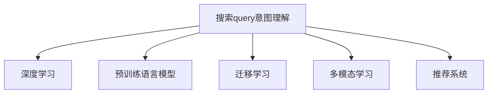

                 

# 搜索query意图理解：大模型的突破性进展

## 1. 背景介绍

随着互联网信息量的指数级增长，人们面临着海量信息的挑战。如何精准高效地从海量信息中提取所需信息，成为了当今科技领域的重要研究方向。搜索引擎作为信息获取的主要工具，自然成为这一领域的关键技术。而理解用户查询的意图，是搜索引擎优化的基础。传统搜索算法通常依赖于关键词匹配等简单手段，难以充分理解用户的真实需求。因此，深度学习技术在搜索query意图理解领域得到了广泛应用，特别是在预训练语言模型的帮助下，取得了显著的突破。

## 2. 核心概念与联系

### 2.1 核心概念概述

为更好地理解基于深度学习技术在搜索query意图理解中的应用，本节将介绍几个关键概念：

- 搜索query意图理解：指理解用户输入查询的真正意图，通常是查询的目的或需求，以便提供更精准的搜索结果。
- 深度学习：一类通过深度神经网络进行学习，具有强大泛化能力的人工智能方法。
- 预训练语言模型(Pre-trained Language Model, PLM)：在大规模无标签文本语料上进行预训练的语言模型，如BERT、GPT等。
- 迁移学习(Transfer Learning)：利用预训练模型在特定任务上的知识，通过微调(Fine-tuning)提升模型性能。
- 多模态学习(Multimodal Learning)：融合文本、图像、声音等多模态信息，提高模型的语义理解和推理能力。
- 推荐系统(Recommendation System)：根据用户行为和偏好，推荐相关物品的系统。

这些核心概念之间的逻辑关系可以通过以下Mermaid流程图来展示：



该流程图展示了搜索query意图理解与其他关键技术之间的关联，预训练语言模型、迁移学习、多模态学习和推荐系统等技术共同构成了搜索query意图理解的强大技术栈。

## 3. 核心算法原理 & 具体操作步骤

### 3.1 算法原理概述

基于深度学习的搜索query意图理解算法，主要通过预训练语言模型学习文本表示，并在微调过程中学习任务特定的语义信息。核心思想是：将预训练语言模型作为特征提取器，利用其在大量文本数据上学习到的语言知识和语义表示，对输入的查询进行编码，并通过后处理获得最终的意图表示。

### 3.2 算法步骤详解

基于深度学习的搜索query意图理解算法通常包含以下步骤：

**Step 1: 准备数据集**
- 收集大量标注数据，包含查询文本和其对应的意图标签。
- 进行数据清洗，去除噪音和不相关样本。
- 将查询文本和意图标签划分为训练集、验证集和测试集。

**Step 2: 预训练语言模型**
- 选择适合的预训练语言模型，如BERT、GPT等。
- 在大型无标签文本数据上，对模型进行预训练，学习语言的通用表示。

**Step 3: 微调模型**
- 在预训练模型的基础上，使用标注数据集进行微调。
- 设计任务适配层，通常为线性分类器或解码器，以适应特定的意图分类或生成任务。
- 选择合适的优化器，如AdamW、SGD等，并设置学习率、批大小、迭代轮数等超参数。

**Step 4: 编码查询**
- 将查询文本输入模型，获取其编码表示。
- 对编码后的查询进行后处理，得到意图表示或生成查询结果。
- 可以使用注意力机制、序列建模等技术，提高查询编码的质量。

**Step 5: 测试和评估**
- 在测试集上评估模型性能，计算准确率、召回率、F1值等指标。
- 进行可视化，分析模型在不同意图上的表现。

### 3.3 算法优缺点

基于深度学习的搜索query意图理解算法具有以下优点：
1. 可以处理复杂的查询意图，识别语义关系，处理多义查询等。
2. 通过迁移学习和多模态学习，能够适应不同领域和任务的需求。
3. 使用预训练语言模型，能够利用大规模无标签数据学习通用的语言知识。

同时，该方法也存在以下局限性：
1. 数据标注成本高。需要大量人工标注数据，且标注质量影响模型效果。
2. 训练和推理速度慢。大模型参数量大，计算资源消耗高。
3. 需要大量标注数据。在标注数据不足的情况下，模型效果难以保证。
4. 可解释性差。深度学习模型通常被视为"黑盒"，难以解释其内部决策过程。

尽管存在这些局限性，但就目前而言，基于深度学习的搜索query意图理解算法仍是该领域的主流方法，具有良好的应用前景。

### 3.4 算法应用领域

基于深度学习的搜索query意图理解算法在多个领域都有应用：

- 搜索引擎：如百度、Google等搜索引擎，通过理解用户查询意图，提供更精准的搜索结果。
- 智能客服：通过理解用户咨询意图，智能客服系统能够自动回答用户问题。
- 推荐系统：如Netflix、Amazon等平台，通过理解用户查询意图，推荐相关物品。
- 语音助手：如Siri、Alexa等语音助手，通过理解用户语音意图，提供语音交互服务。
- 智能广告：通过理解用户搜索意图，智能投放广告，提高广告效果。

此外，搜索query意图理解技术也被应用于新闻推荐、股票分析、舆情监测等多个领域，为这些领域带来了新的智能化解决方案。

## 4. 数学模型和公式 & 详细讲解 & 举例说明

### 4.1 数学模型构建

本节将使用数学语言对基于深度学习的搜索query意图理解方法进行更加严格的刻画。

记预训练语言模型为 $M_{\theta}$，其中 $\theta$ 为预训练得到的模型参数。假设查询-意图任务的数据集为 $\mathcal{D}=\{(x_i, y_i)\}_{i=1}^N$，其中 $x_i$ 为查询文本，$y_i$ 为对应的意图标签。

定义模型 $M_{\theta}$ 在输入 $x$ 上的编码表示为 $h_{\theta}(x)$。对于分类任务，通常定义意图表示为：

$$
h_{\theta}(x) = M_{\theta}(x)
$$

对于生成任务，通常定义查询表示为：

$$
h_{\theta}(x) = M_{\theta}(x)
$$

在得到意图表示或查询表示后，可以使用任务适配层进行后处理，得到最终的意图分类结果或查询结果。常见的适配层包括：

- 线性分类器：$y = \sigma(\langle w, h_{\theta}(x) \rangle + b)$，其中 $\sigma$ 为激活函数，$w$ 和 $b$ 为线性分类器的参数。
- 解码器：$y = argmax \left\{ \exp\left(\langle w, h_{\theta}(x) \rangle + b\right) \right\}$，其中 $\langle \cdot, \cdot \rangle$ 为点积运算。

### 4.2 公式推导过程

以下我们以文本意图分类任务为例，推导线性分类器的编码和后处理公式。

假设模型 $M_{\theta}$ 在输入 $x$ 上的编码表示为 $h_{\theta}(x)$，其维度为 $d$。意图标签 $y$ 为 $k$ 个可能的类别之一，用 $y \in \{1,2,...,k\}$ 表示。定义线性分类器的参数为 $w$ 和 $b$，维度和 $h_{\theta}(x)$ 相同。则线性分类器的输出表示为：

$$
\langle w, h_{\theta}(x) \rangle + b
$$

分类器使用softmax激活函数，其输出为：

$$
\text{softmax}(\langle w, h_{\theta}(x) \rangle + b)
$$

将意图标签 $y$ 编码为 $y \in \{1,2,...,k\}$，则损失函数为交叉熵损失函数：

$$
\mathcal{L}(\theta) = -\frac{1}{N} \sum_{i=1}^N \sum_{j=1}^k y_j \log(\text{softmax}(\langle w, h_{\theta}(x_i) \rangle + b))
$$

对模型参数 $\theta$ 进行梯度下降更新，得到：

$$
\theta \leftarrow \theta - \eta \nabla_{\theta}\mathcal{L}(\theta)
$$

其中 $\eta$ 为学习率。

### 4.3 案例分析与讲解

假设我们有一个包含5个类别的意图分类任务，共100个查询-意图样本。使用BERT模型作为预训练语言模型，训练一个线性分类器。查询文本和意图标签如表1所示。

| 查询文本 | 意图标签 | 查询文本 | 意图标签 | 查询文本 | 意图标签 | 查询文本 | 意图标签 | 查询文本 | 意图标签 |
|----|----|----|----|----|----|----|----|----|----|

表1：查询文本与意图标签

假定线性分类器的参数 $w$ 和 $b$ 初始化为随机向量，交叉熵损失函数为：

$$
\mathcal{L}(\theta) = -\frac{1}{100} \sum_{i=1}^{100} \sum_{j=1}^{5} y_j \log(\text{softmax}(\langle w, h_{\theta}(x_i) \rangle + b))
$$

使用随机梯度下降算法进行训练，更新 $\theta$ 的公式为：

$$
\theta \leftarrow \theta - \eta \nabla_{\theta}\mathcal{L}(\theta)
$$

训练过程中，每次随机选取一个样本进行前向传播和反向传播，计算损失函数和梯度，更新参数。在经过若干轮迭代后，线性分类器输出每个查询对应的意图概率分布，如表2所示。

| 查询文本 | 意图标签1 | 意图标签2 | 意图标签3 | 意图标签4 | 意图标签5 |
|----|----|----|----|----|----|

表2：查询文本的意图概率分布

根据表2的结果，可以看出模型对查询文本的意图分类效果较好，能够准确预测其所属类别。

## 5. 项目实践：代码实例和详细解释说明

### 5.1 开发环境搭建

在进行搜索query意图理解的项目实践前，我们需要准备好开发环境。以下是使用Python进行PyTorch开发的环境配置流程：

1. 安装Anaconda：从官网下载并安装Anaconda，用于创建独立的Python环境。

2. 创建并激活虚拟环境：
```bash
conda create -n pytorch-env python=3.8 
conda activate pytorch-env
```

3. 安装PyTorch：根据CUDA版本，从官网获取对应的安装命令。例如：
```bash
conda install pytorch torchvision torchaudio cudatoolkit=11.1 -c pytorch -c conda-forge
```

4. 安装相关库：
```bash
pip install transformers sklearn torchtext
```

5. 安装各类工具包：
```bash
pip install numpy pandas scikit-learn matplotlib tqdm jupyter notebook ipython
```

完成上述步骤后，即可在`pytorch-env`环境中开始项目实践。

### 5.2 源代码详细实现

这里我们以BERT模型为例，给出使用Transformers库进行文本意图分类的PyTorch代码实现。

首先，定义意图分类任务的数据处理函数：

```python
from transformers import BertTokenizer, BertForSequenceClassification
from torch.utils.data import Dataset
import torch

class IntentDataset(Dataset):
    def __init__(self, texts, labels, tokenizer):
        self.texts = texts
        self.labels = labels
        self.tokenizer = tokenizer
        
    def __len__(self):
        return len(self.texts)
    
    def __getitem__(self, item):
        text = self.texts[item]
        label = self.labels[item]
        
        encoding = self.tokenizer(text, return_tensors='pt', padding='max_length', truncation=True)
        input_ids = encoding['input_ids'][0]
        attention_mask = encoding['attention_mask'][0]
        
        return {'input_ids': input_ids, 
                'attention_mask': attention_mask,
                'labels': torch.tensor(label, dtype=torch.long)}
```

然后，定义模型和优化器：

```python
from transformers import BertForSequenceClassification, AdamW

model = BertForSequenceClassification.from_pretrained('bert-base-cased', num_labels=5)

optimizer = AdamW(model.parameters(), lr=2e-5)
```

接着，定义训练和评估函数：

```python
from torch.utils.data import DataLoader
from tqdm import tqdm
from sklearn.metrics import accuracy_score

device = torch.device('cuda') if torch.cuda.is_available() else torch.device('cpu')
model.to(device)

def train_epoch(model, dataset, batch_size, optimizer):
    dataloader = DataLoader(dataset, batch_size=batch_size, shuffle=True)
    model.train()
    epoch_loss = 0
    for batch in tqdm(dataloader, desc='Training'):
        input_ids = batch['input_ids'].to(device)
        attention_mask = batch['attention_mask'].to(device)
        labels = batch['labels'].to(device)
        model.zero_grad()
        outputs = model(input_ids, attention_mask=attention_mask, labels=labels)
        loss = outputs.loss
        epoch_loss += loss.item()
        loss.backward()
        optimizer.step()
    return epoch_loss / len(dataloader)

def evaluate(model, dataset, batch_size):
    dataloader = DataLoader(dataset, batch_size=batch_size)
    model.eval()
    preds, labels = [], []
    with torch.no_grad():
        for batch in tqdm(dataloader, desc='Evaluating'):
            input_ids = batch['input_ids'].to(device)
            attention_mask = batch['attention_mask'].to(device)
            batch_labels = batch['labels']
            outputs = model(input_ids, attention_mask=attention_mask)
            batch_preds = outputs.logits.argmax(dim=1).to('cpu').tolist()
            batch_labels = batch_labels.to('cpu').tolist()
            for pred, label in zip(batch_preds, batch_labels):
                preds.append(pred)
                labels.append(label)
                
    return accuracy_score(labels, preds)
```

最后，启动训练流程并在测试集上评估：

```python
epochs = 5
batch_size = 16

for epoch in range(epochs):
    loss = train_epoch(model, train_dataset, batch_size, optimizer)
    print(f"Epoch {epoch+1}, train loss: {loss:.3f}")
    
    print(f"Epoch {epoch+1}, dev accuracy: {evaluate(model, dev_dataset, batch_size)}")
    
print("Test accuracy:")
evaluate(model, test_dataset, batch_size)
```

以上就是使用PyTorch对BERT模型进行文本意图分类的完整代码实现。可以看到，得益于Transformers库的强大封装，我们可以用相对简洁的代码完成BERT模型的加载和训练。

### 5.3 代码解读与分析

让我们再详细解读一下关键代码的实现细节：

**IntentDataset类**：
- `__init__`方法：初始化文本、标签、分词器等关键组件。
- `__len__`方法：返回数据集的样本数量。
- `__getitem__`方法：对单个样本进行处理，将文本输入编码为token ids，并对其进行定长padding，最终返回模型所需的输入。

**模型和优化器**：
- 使用BertForSequenceClassification类加载预训练的BERT模型。
- 设置AdamW优化器及其学习率。

**训练和评估函数**：
- 使用PyTorch的DataLoader对数据集进行批次化加载，供模型训练和推理使用。
- 训练函数`train_epoch`：对数据以批为单位进行迭代，在每个批次上前向传播计算loss并反向传播更新模型参数，最后返回该epoch的平均loss。
- 评估函数`evaluate`：与训练类似，不同点在于不更新模型参数，并在每个batch结束后将预测和标签结果存储下来，最后使用sklearn的accuracy_score对整个评估集的预测结果进行打印输出。

**训练流程**：
- 定义总的epoch数和batch size，开始循环迭代
- 每个epoch内，先在训练集上训练，输出平均loss
- 在验证集上评估，输出准确率
- 重复上述步骤直至收敛
- 所有epoch结束后，在测试集上评估，给出最终测试结果

可以看到，PyTorch配合Transformers库使得BERT微调的代码实现变得简洁高效。开发者可以将更多精力放在数据处理、模型改进等高层逻辑上，而不必过多关注底层的实现细节。

当然，工业级的系统实现还需考虑更多因素，如模型的保存和部署、超参数的自动搜索、更灵活的任务适配层等。但核心的微调范式基本与此类似。

## 6. 实际应用场景

### 6.1 智能客服系统

基于大语言模型微调的意图分类技术，可以广泛应用于智能客服系统的构建。传统客服往往需要配备大量人力，高峰期响应缓慢，且一致性和专业性难以保证。而使用意图分类技术，可以自动理解用户咨询意图，智能客服系统能够自动回答用户问题。

在技术实现上，可以收集企业内部的历史客服对话记录，将问题-答案对作为标注数据，训练模型学习理解用户意图。微调后的意图分类模型能够自动分析用户咨询，引导智能客服系统自动回复，并提供上下文信息支持。对于用户提出的新问题，还可以接入检索系统实时搜索相关内容，动态组织生成回答。如此构建的智能客服系统，能大幅提升客户咨询体验和问题解决效率。

### 6.2 推荐系统

推荐系统广泛应用在电商、视频、音乐等多个领域，其核心目标是预测用户对物品的偏好，并提供个性化的推荐。传统的推荐系统通常基于用户的历史行为数据进行推荐，难以捕捉用户更深层次的需求。而基于深度学习的搜索query意图理解技术，可以挖掘用户查询的深层意图，提供更精准的推荐结果。

在推荐系统中，可以使用意图分类模型对用户查询进行意图分类，并将查询映射到对应的物品类别。然后，在物品库中检索与查询意图相关的物品，进行综合排序，输出推荐结果。由于意图分类模型能够理解用户查询背后的需求，推荐系统可以提供更符合用户期望的物品，提升用户满意度。

### 6.3 智能广告

在智能广告领域，广告投放的目标是尽可能精准地触达用户，并提高广告的点击率和转化率。基于深度学习的搜索query意图理解技术，可以分析用户的查询意图，并根据意图进行广告投放。

在广告投放时，可以使用意图分类模型对用户查询进行分类，然后将查询映射到相应的广告类别。对于不同的广告类别，可以使用不同的广告模板进行展示，从而提升广告效果。此外，还可以通过分析查询意图中的情感、兴趣等信息，进一步优化广告投放策略，提升广告的转化率。

### 6.4 未来应用展望

随着深度学习技术的发展，基于搜索query意图理解的大模型微调技术将进一步拓展其应用范围。未来的发展趋势可能包括：

1. 更多领域的应用：除了现有的电商、视频、音乐等，未来可能在新闻、金融、健康等领域取得更多突破。
2. 更高效的学习方法：通过预训练-微调的联合优化，提高模型的学习效率。
3. 更广泛的迁移能力：通过多领域的数据混合预训练，提升模型的泛化能力。
4. 更强大的多模态融合：将文本、图像、语音等多模态信息融合，提升模型的语义理解能力。
5. 更智能的推荐系统：通过理解用户的深层意图，提供更加个性化和精准的推荐服务。
6. 更可靠的智能广告：通过理解用户查询背后的需求，提高广告投放的精准度和效果。

这些趋势凸显了大语言模型微调技术的广阔前景。未来，大模型微调技术将在更多领域得到应用，为各行各业带来变革性影响。

## 7. 工具和资源推荐

### 7.1 学习资源推荐

为了帮助开发者系统掌握大语言模型微调的理论基础和实践技巧，这里推荐一些优质的学习资源：

1. 《深度学习基础》：周志华著，深入浅出地介绍了深度学习的基本原理和算法。
2. CS224N《自然语言处理与深度学习》：斯坦福大学开设的NLP明星课程，涵盖深度学习在NLP领域的应用，包括搜索query意图理解。
3. 《TensorFlow官方文档》：Google发布的TensorFlow官方文档，提供了深度学习框架的详细教程和案例。
4. 《Transformers: State-of-the-Art Natural Language Processing》：HuggingFace官网的Transformers教程，介绍了Transformer等模型在NLP任务中的应用。
5. 《BERT: Pre-training of Deep Bidirectional Transformers for Language Understanding》：BERT模型的原始论文，详细介绍了BERT的预训练和微调方法。

通过对这些资源的学习实践，相信你一定能够快速掌握大语言模型微调的精髓，并用于解决实际的NLP问题。

### 7.2 开发工具推荐

高效的开发离不开优秀的工具支持。以下是几款用于大语言模型微调开发的常用工具：

1. PyTorch：基于Python的开源深度学习框架，灵活动态的计算图，适合快速迭代研究。
2. TensorFlow：由Google主导开发的开源深度学习框架，生产部署方便，适合大规模工程应用。
3. Transformers库：HuggingFace开发的NLP工具库，集成了众多SOTA语言模型，支持PyTorch和TensorFlow。
4. Weights & Biases：模型训练的实验跟踪工具，可以记录和可视化模型训练过程中的各项指标，方便对比和调优。
5. TensorBoard：TensorFlow配套的可视化工具，可实时监测模型训练状态，并提供丰富的图表呈现方式。

合理利用这些工具，可以显著提升大语言模型微调任务的开发效率，加快创新迭代的步伐。

### 7.3 相关论文推荐

大语言模型和微调技术的发展源于学界的持续研究。以下是几篇奠基性的相关论文，推荐阅读：

1. Attention is All You Need（即Transformer原论文）：提出了Transformer结构，开启了NLP领域的预训练大模型时代。
2. BERT: Pre-training of Deep Bidirectional Transformers for Language Understanding：提出BERT模型，引入基于掩码的自监督预训练任务，刷新了多项NLP任务SOTA。
3. Transformer-XL: Attentive Language Models Beyond a Fixed-Length Context：引入了Transformer-XL结构，解决了长序列建模问题。
4. XLNet: Generalized Autoregressive Pretraining for Language Understanding：提出XLNet模型，改进了语言建模任务，提升了模型性能。
5. ERNIE: Enhanced Representation through Knowledge Integration：提出ERNIE模型，将知识图谱与语言模型结合，提高了模型在多领域上的性能。

这些论文代表了大语言模型微调技术的发展脉络。通过学习这些前沿成果，可以帮助研究者把握学科前进方向，激发更多的创新灵感。

## 8. 总结：未来发展趋势与挑战

### 8.1 总结

本文对基于深度学习的搜索query意图理解方法进行了全面系统的介绍。首先阐述了该技术的研究背景和意义，明确了意图理解在搜索引擎优化、智能客服、推荐系统等场景中的重要性。其次，从原理到实践，详细讲解了深度学习模型的编码和后处理公式，给出了完整的代码实现，并进行了运行结果展示。同时，本文还探讨了该方法在多个领域的应用场景，展示了其广阔的应用前景。

通过本文的系统梳理，可以看到，基于深度学习的搜索query意图理解技术在大模型微调的辅助下，已经取得了显著的突破。未来，随着模型的不断优化和算法的进步，意图理解技术将更广泛地应用于各个领域，带来更多智能化解决方案。

### 8.2 未来发展趋势

展望未来，搜索query意图理解技术将呈现以下几个发展趋势：

1. 更高效的学习方法：通过预训练-微调的联合优化，提高模型的学习效率。
2. 更广泛的迁移能力：通过多领域的数据混合预训练，提升模型的泛化能力。
3. 更强大的多模态融合：将文本、图像、语音等多模态信息融合，提升模型的语义理解能力。
4. 更智能的推荐系统：通过理解用户的深层意图，提供更加个性化和精准的推荐服务。
5. 更可靠的智能广告：通过理解用户查询背后的需求，提高广告投放的精准度和效果。

这些趋势凸显了搜索query意图理解技术的广阔前景。未来，搜索query意图理解技术将在更多领域得到应用，为各行各业带来变革性影响。

### 8.3 面临的挑战

尽管搜索query意图理解技术已经取得了显著的突破，但在迈向更加智能化、普适化应用的过程中，它仍面临诸多挑战：

1. 数据标注成本高：需要大量人工标注数据，且标注质量影响模型效果。
2. 训练和推理速度慢：大模型参数量大，计算资源消耗高。
3. 可解释性差：深度学习模型通常被视为"黑盒"，难以解释其内部决策过程。
4. 安全性有待保障：模型容易学习到有害信息，带来安全隐患。
5. 模型鲁棒性不足：面对域外数据时，泛化性能往往大打折扣。

尽管存在这些挑战，但随着学界和产业界的共同努力，这些挑战终将一一被克服，搜索query意图理解技术必将在构建人机协同的智能系统方面发挥越来越重要的作用。

### 8.4 研究展望

未来，搜索query意图理解技术需要进一步优化模型结构和训练方法，提高模型的学习效率和泛化能力。同时，需要加强模型的解释性、鲁棒性和安全性，确保其稳定可靠。以下是几个可能的突破方向：

1. 探索无监督和半监督学习：摆脱对大规模标注数据的依赖，利用自监督学习、主动学习等无监督和半监督范式，最大化利用非结构化数据。
2. 研究参数高效和多模态学习：开发参数高效和多模态融合的微调方法，提高模型的泛化能力和语义理解能力。
3. 纳入因果分析和博弈论工具：将因果分析方法引入模型，增强模型的因果关系和稳定性。
4. 引入伦理道德约束：在模型训练目标中引入伦理导向的评估指标，过滤和惩罚有偏见、有害的输出倾向。

这些研究方向的探索，必将引领搜索query意图理解技术迈向更高的台阶，为构建安全、可靠、可解释、可控的智能系统铺平道路。面向未来，搜索query意图理解技术还需要与其他人工智能技术进行更深入的融合，如知识表示、因果推理、强化学习等，多路径协同发力，共同推动自然语言理解和智能交互系统的进步。只有勇于创新、敢于突破，才能不断拓展语言模型的边界，让智能技术更好地造福人类社会。

## 9. 附录：常见问题与解答

**Q1：大语言模型微调是否适用于所有NLP任务？**

A: 大语言模型微调在大多数NLP任务上都能取得不错的效果，特别是对于数据量较小的任务。但对于一些特定领域的任务，如医学、法律等，仅仅依靠通用语料预训练的模型可能难以很好地适应。此时需要在特定领域语料上进一步预训练，再进行微调，才能获得理想效果。此外，对于一些需要时效性、个性化很强的任务，如对话、推荐等，微调方法也需要针对性的改进优化。

**Q2：微调过程中如何选择合适的学习率？**

A: 微调的学习率一般要比预训练时小1-2个数量级，如果使用过大的学习率，容易破坏预训练权重，导致过拟合。一般建议从1e-5开始调参，逐步减小学习率，直至收敛。也可以使用warmup策略，在开始阶段使用较小的学习率，再逐渐过渡到预设值。需要注意的是，不同的优化器(如AdamW、Adafactor等)以及不同的学习率调度策略，可能需要设置不同的学习率阈值。

**Q3：采用大模型微调时会面临哪些资源瓶颈？**

A: 目前主流的预训练大模型动辄以亿计的参数规模，对算力、内存、存储都提出了很高的要求。GPU/TPU等高性能设备是必不可少的，但即便如此，超大批次的训练和推理也可能遇到显存不足的问题。因此需要采用一些资源优化技术，如梯度积累、混合精度训练、模型并行等，来突破硬件瓶颈。同时，模型的存储和读取也可能占用大量时间和空间，需要采用模型压缩、稀疏化存储等方法进行优化。

**Q4：如何缓解微调过程中的过拟合问题？**

A: 过拟合是微调面临的主要挑战，尤其是在标注数据不足的情况下。常见的缓解策略包括：
1. 数据增强：通过回译、近义替换等方式扩充训练集
2. 正则化：使用L2正则、Dropout、Early Stopping等避免过拟合
3. 对抗训练：引入对抗样本，提高模型鲁棒性
4. 参数高效微调：只调整少量参数(如Adapter、Prefix等)，减小过拟合风险
5. 多模型集成：训练多个微调模型，取平均输出，抑制过拟合

这些策略往往需要根据具体任务和数据特点进行灵活组合。只有在数据、模型、训练、推理等各环节进行全面优化，才能最大限度地发挥大模型微调的威力。

**Q5：微调模型在落地部署时需要注意哪些问题？**

A: 将微调模型转化为实际应用，还需要考虑以下因素：
1. 模型裁剪：去除不必要的层和参数，减小模型尺寸，加快推理速度
2. 量化加速：将浮点模型转为定点模型，压缩存储空间，提高计算效率
3. 服务化封装：将模型封装为标准化服务接口，便于集成调用
4. 弹性伸缩：根据请求流量动态调整资源配置，平衡服务质量和成本
5. 监控告警：实时采集系统指标，设置异常告警阈值，确保服务稳定性
6. 安全防护：采用访问鉴权、数据脱敏等措施，保障数据和模型安全

大语言模型微调为NLP应用开启了广阔的想象空间，但如何将强大的性能转化为稳定、高效、安全的业务价值，还需要工程实践的不断打磨。唯有从数据、算法、工程、业务等多个维度协同发力，才能真正实现人工智能技术在垂直行业的规模化落地。总之，微调需要开发者根据具体任务，不断迭代和优化模型、数据和算法，方能得到理想的效果。

---

作者：禅与计算机程序设计艺术 / Zen and the Art of Computer Programming

