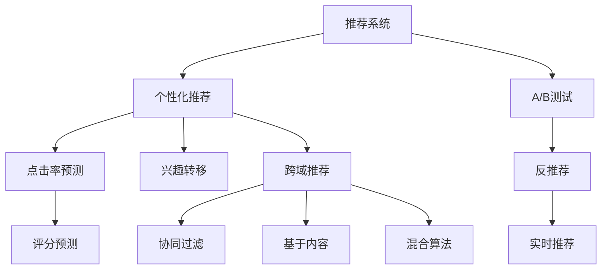

                 

# 搜索引擎的个性化推荐算法

## 1. 背景介绍

在数字时代，搜索引擎不仅提供关键词检索服务，更通过个性化推荐提升用户体验，为用户推荐最相关、最感兴趣的信息。个性化推荐算法是搜索引擎的核心技术之一，其效果直接影响用户体验、流量转化和商业收益。当前，个性化推荐已经广泛应用于电商平台、新闻媒体、视频网站等多个场景，成为互联网产品不可或缺的一部分。

个性化推荐的核心思想是：通过对用户历史行为数据进行分析，预测其未来行为和兴趣，从而提供精准的推荐内容。推荐系统的主要难点在于如何在保证推荐质量的同时，处理海量用户数据、保证推荐时效性和多样性，并防止推荐过程中出现信息过载、推荐重复等问题。

## 2. 核心概念与联系

### 2.1 核心概念概述

为更好地理解搜索引擎个性化推荐算法，本节将介绍几个关键概念：

- 推荐系统(Recommendation System)：利用算法为用户推荐相关内容的技术。包括基于协同过滤、基于内容的推荐、基于混合算法的推荐等多种类型。

- 个性化推荐(Personalized Recommendation)：根据用户历史行为和兴趣，为用户提供量身定制的推荐内容。

- 点击率预测(Click-Through Rate Prediction)：预测用户是否会对推荐内容进行点击的行为，以评估推荐质量。

- 兴趣转移(In-Interest Transfer)：通过用户的兴趣演化路径，预测未来兴趣点，进行长期推荐。

- A/B测试(A/B Testing)：在推荐算法中，通过对比不同策略的效果，选取最优推荐方案。

- 反推荐(Framework)：为防止推荐偏差，引入一个或多个反推荐模型，对推荐结果进行修正和优化。

- 实时推荐(Real-Time Recommendation)：在用户访问时，根据即时数据实时生成推荐内容，以提升用户体验。

- 跨域推荐(Cross-Domain Recommendation)：将不同领域的数据融合到推荐模型中，扩大推荐范围和内容。

这些核心概念之间的逻辑关系可以通过以下Mermaid流程图来展示：



这个流程图展示了推荐系统的主要模块和组件：

1. 推荐系统通过协同过滤、基于内容、混合算法等多种技术生成推荐内容。
2. 个性化推荐聚焦于用户历史行为和兴趣，生成定制化推荐内容。
3. 点击率预测和评分预测评估推荐效果。
4. A/B测试和反推荐用于优化算法性能，提升推荐质量。
5. 实时推荐和跨域推荐增强推荐的时效性和多样性。

## 3. 核心算法原理 & 具体操作步骤
### 3.1 算法原理概述

搜索引擎的个性化推荐算法通常基于机器学习框架，通过收集用户行为数据（如点击、浏览、搜索等），训练模型预测用户未来行为。推荐系统的核心算法包括：

1. 协同过滤(Collaborative Filtering, CF)：通过分析用户和物品间的相似性，预测用户对未见物品的评分，并进行推荐。
2. 基于内容的推荐(Content-Based Recommendation)：分析物品的特征与用户兴趣点的相似性，进行推荐。
3. 混合推荐(Mixed Recommendation)：结合协同过滤和基于内容的推荐，充分发挥二者的优点。
4. 深度学习推荐(Deep Learning Recommendation)：通过深度神经网络模型，提取更高层次的特征，提升推荐效果。
5. 强化学习推荐(Reinforcement Learning Recommendation)：通过用户行为反馈，优化推荐策略，实现更智能的推荐。

推荐系统主要涉及以下几个步骤：

1. 数据收集与预处理：收集用户行为数据，清洗、处理数据集，生成训练集和测试集。
2. 特征工程：设计、提取、选择特征，生成特征向量。
3. 模型训练与优化：选择合适的算法，训练模型，进行参数调优。
4. 推荐策略实现：基于训练好的模型，生成推荐结果。
5. 评估与迭代：通过评估指标（如点击率、召回率、覆盖率等），进行A/B测试，迭代优化模型。

### 3.2 算法步骤详解

#### 3.2.1 数据收集与预处理

推荐系统的第一步是数据收集与预处理。数据通常包含用户的点击、浏览、评分等行为数据，以及物品的元数据（如商品描述、属性等）。数据预处理包括数据清洗、去重、标准化等，生成用于模型训练的数据集。

#### 3.2.2 特征工程

特征工程是推荐系统的核心环节，涉及特征选择、特征提取和特征构建。特征选择的目的是从原始数据中筛选出与目标变量相关的特征，以提升模型性能。常用的特征包括：

- 用户特征：用户ID、用户历史行为、用户人口统计学信息等。
- 物品特征：物品ID、物品类别、物品属性等。
- 用户与物品交互特征：用户与物品的评分、点击、浏览次数等。

特征提取通常通过TF-IDF、Word2Vec等文本处理技术，将文本数据转化为数值特征。特征构建则是通过用户、物品和交互数据的多维组合，生成更高层次的特征，如用户兴趣向量、物品特征向量等。

#### 3.2.3 模型训练与优化

模型训练通常使用梯度下降等优化算法，最小化损失函数，拟合训练数据。常用的优化算法包括：

- 随机梯度下降(Stochastic Gradient Descent, SGD)
- 自适应学习率(Adaptive Learning Rate, e.g., AdaGrad, Adam)
- 正则化(Regularization, e.g., L1, L2正则)

模型训练需要选择合适的超参数，如学习率、正则化系数等，并进行交叉验证，防止过拟合。常用的评估指标包括：

- 平均绝对误差(Mean Absolute Error, MAE)
- 均方误差(Mean Squared Error, MSE)
- 准确率(Accuracy)
- 召回率(Recall)
- F1分数(F1 Score)

#### 3.2.4 推荐策略实现

推荐策略实现基于训练好的模型，生成推荐结果。推荐结果通常包含用户ID、物品ID和评分或概率。推荐结果的生成方式包括：

- 基于矩阵分解的推荐：如SVD(奇异值分解)、ALS(交替最小二乘法)
- 基于树模型的推荐：如GBDT、XGBoost
- 基于深度学习的推荐：如CNN、RNN、LSTM

推荐结果需要考虑排序和多样性，常用的排序策略包括：

- 基于评分排序：根据用户评分预测生成排序
- 基于点击排序：根据用户点击行为生成排序
- 基于混合排序：结合评分和点击行为生成排序

#### 3.2.5 评估与迭代

评估与迭代是推荐系统的关键环节，用于不断优化模型，提升推荐质量。常用的评估方法包括：

- A/B测试：通过对比不同策略的效果，选取最优推荐方案
- 交叉验证：在数据集上进行交叉验证，评估模型性能
- 数据增量更新：定期更新模型，适应新数据分布

### 3.3 算法优缺点

推荐系统的优点包括：

- 高效性：推荐系统能够快速生成推荐结果，满足用户即时需求。
- 个性化：推荐系统能够根据用户历史行为和兴趣，生成定制化推荐内容。
- 多样性：推荐系统能够提供多种推荐内容，满足用户多样性需求。
- 可扩展性：推荐系统能够处理大规模用户和物品数据，适应不断变化的业务需求。

推荐系统的缺点包括：

- 冷启动问题：新用户或新物品无法生成推荐，需要更多的数据支持。
- 数据稀疏性：用户行为数据和物品元数据往往存在稀疏性，影响模型性能。
- 过拟合问题：模型训练容易过拟合，需要引入正则化技术。
- 召回率问题：推荐系统容易生成重复或无关内容，降低用户满意度。
- 隐私问题：用户行为数据可能包含敏感信息，需要合理保护用户隐私。

### 3.4 算法应用领域

推荐系统广泛应用于以下领域：

- 电商平台：通过推荐商品，提升用户购买转化率和购物体验。
- 新闻媒体：通过推荐新闻，提升用户粘性和内容阅读量。
- 视频网站：通过推荐视频，提升用户观看时间和满意度。
- 社交网络：通过推荐好友，提升用户互动和社区活跃度。
- 智能家居：通过推荐智能设备，提升用户生活便捷性。

推荐系统不仅在电商、媒体等传统领域应用广泛，也在金融、医疗、教育等多个新兴领域得到应用。未来的推荐系统将更加智能、个性化和多样化，进一步提升用户体验和业务价值。

## 4. 数学模型和公式 & 详细讲解 & 举例说明

### 4.1 数学模型构建

推荐系统的数学模型通常基于用户行为数据和物品元数据，通过机器学习算法构建。推荐模型通常包含以下元素：

- 用户集合 $U$：所有用户集合，包含每个用户的特征向量 $u_i$。
- 物品集合 $I$：所有物品集合，包含每个物品的特征向量 $v_j$。
- 用户与物品交互矩阵 $R$：用户对物品的评分矩阵，包含每个用户对每个物品的评分 $r_{ij}$。
- 用户与物品交互向量：根据用户行为数据和物品元数据，生成用户兴趣向量 $u$ 和物品特征向量 $v$。

推荐模型的目标是最大化用户评分和物品评分的匹配度。常用的推荐模型包括：

- 矩阵分解模型：如SVD、ALS
- 树模型：如GBDT、XGBoost
- 深度学习模型：如CNN、RNN、LSTM

### 4.2 公式推导过程

#### 4.2.1 矩阵分解模型

矩阵分解模型基于奇异值分解(SVD)，将用户评分矩阵 $R$ 分解为三个矩阵的乘积：

$$
R = P \times \Sigma \times Q^T
$$

其中 $P$ 为左奇异矩阵，$\Sigma$ 为奇异值矩阵，$Q$ 为右奇异矩阵。用户兴趣向量 $u$ 和物品特征向量 $v$ 可以通过奇异矩阵 $P$ 和 $Q$ 计算：

$$
u = P_i^T \times \Sigma_i
$$
$$
v = Q_j^T \times \Sigma_j
$$

基于奇异值分解的评分预测公式为：

$$
\hat{r}_{ij} = u_i^T \times v_j
$$

#### 4.2.2 树模型

树模型如GBDT、XGBoost等，通过构建决策树进行推荐。树模型的评分预测公式为：

$$
\hat{r}_{ij} = f(u_i, v_j, x_i, y_j, \theta)
$$

其中 $x_i$ 和 $y_j$ 分别为用户和物品的特征向量，$\theta$ 为模型参数。

#### 4.2.3 深度学习模型

深度学习模型如CNN、RNN、LSTM等，通过神经网络模型提取更高层次的特征，进行推荐。常用的深度学习模型结构包括：

- 卷积神经网络(CNN)：用于提取图像、文本等结构化数据的特征。
- 循环神经网络(RNN)：用于提取序列数据的特征。
- 长短期记忆网络(LSTM)：用于处理时间序列数据，提取长期依赖关系。

### 4.3 案例分析与讲解

#### 4.3.1 案例一：电商平台推荐

某电商平台希望提升用户购买转化率，通过推荐系统为用户推荐商品。平台收集用户浏览、点击、购买等行为数据，以及商品价格、描述等元数据。平台选择基于矩阵分解的模型进行推荐，训练过程如下：

1. 数据预处理：收集用户行为数据，进行数据清洗、去重、标准化，生成训练集和测试集。
2. 特征工程：设计用户兴趣向量和物品特征向量，选择用户ID、商品ID、价格、评分等特征。
3. 模型训练：选择SVD算法，训练模型，进行参数调优。
4. 推荐策略实现：根据训练好的模型，生成推荐结果，进行排序。
5. 评估与迭代：通过A/B测试和交叉验证，评估推荐效果，迭代优化模型。

#### 4.3.2 案例二：新闻媒体推荐

某新闻媒体平台希望提升用户粘性和内容阅读量，通过推荐系统为用户推荐新闻。平台收集用户阅读、收藏、评论等行为数据，以及新闻标题、摘要、作者等元数据。平台选择基于深度学习的模型进行推荐，训练过程如下：

1. 数据预处理：收集用户行为数据，进行数据清洗、去重、标准化，生成训练集和测试集。
2. 特征工程：设计用户兴趣向量和新闻特征向量，选择用户ID、新闻ID、标题、摘要、作者等特征。
3. 模型训练：选择CNN模型，训练模型，进行参数调优。
4. 推荐策略实现：根据训练好的模型，生成推荐结果，进行排序。
5. 评估与迭代：通过A/B测试和交叉验证，评估推荐效果，迭代优化模型。

## 5. 项目实践：代码实例和详细解释说明

### 5.1 开发环境搭建

在进行推荐系统开发前，我们需要准备好开发环境。以下是使用Python进行PyTorch开发的环境配置流程：

1. 安装Anaconda：从官网下载并安装Anaconda，用于创建独立的Python环境。

2. 创建并激活虚拟环境：
```bash
conda create -n pytorch-env python=3.8 
conda activate pytorch-env
```

3. 安装PyTorch：根据CUDA版本，从官网获取对应的安装命令。例如：
```bash
conda install pytorch torchvision torchaudio cudatoolkit=11.1 -c pytorch -c conda-forge
```

4. 安装TensorFlow：
```bash
pip install tensorflow
```

5. 安装各类工具包：
```bash
pip install numpy pandas scikit-learn matplotlib tqdm jupyter notebook ipython
```

完成上述步骤后，即可在`pytorch-env`环境中开始推荐系统开发。

### 5.2 源代码详细实现

下面我们以基于深度学习的推荐系统为例，给出使用TensorFlow进行推荐系统开发的PyTorch代码实现。

首先，定义推荐模型的输入和输出：

```python
import tensorflow as tf
from tensorflow.keras.layers import Input, Embedding, Dense, concatenate, Model

# 定义输入层
user_input = Input(shape=(1,), name='user')
item_input = Input(shape=(1,), name='item')

# 定义用户嵌入层
user_embedding = Embedding(input_dim=num_users, output_dim=embedding_dim, name='user_embedding')(user_input)

# 定义物品嵌入层
item_embedding = Embedding(input_dim=num_items, output_dim=embedding_dim, name='item_embedding')(item_input)

# 定义深度学习模型
x = concatenate([user_embedding, item_embedding])
x = Dense(256, activation='relu')(x)
x = Dense(128, activation='relu')(x)
x = Dense(1, activation='sigmoid')(x)
model = Model(inputs=[user_input, item_input], outputs=x)

# 编译模型
model.compile(loss='binary_crossentropy', optimizer='adam', metrics=['accuracy'])
```

然后，定义推荐系统的训练和评估函数：

```python
from tensorflow.keras.preprocessing.sequence import pad_sequences
from sklearn.metrics import roc_auc_score

# 定义训练函数
def train(model, train_data, batch_size, epochs):
    model.fit(x=train_data['user_ids'], y=train_data['item_ratings'], 
              validation_data=(val_data['user_ids'], val_data['item_ratings']),
              batch_size=batch_size, epochs=epochs, verbose=1)
    return model

# 定义评估函数
def evaluate(model, test_data, batch_size):
    y_true = test_data['item_ratings']
    y_pred = model.predict(test_data['user_ids'], test_data['item_ids'], batch_size=batch_size)
    auc = roc_auc_score(y_true, y_pred)
    return auc
```

接着，启动训练流程并在测试集上评估：

```python
train_data = load_train_data()  # 加载训练数据
val_data = load_val_data()  # 加载验证数据
test_data = load_test_data()  # 加载测试数据

model = build_model()  # 构建推荐模型

# 定义超参数
batch_size = 32
epochs = 10

# 训练模型
model = train(model, train_data, batch_size, epochs)

# 评估模型
auc = evaluate(model, test_data, batch_size)
print(f'Test AUC: {auc:.3f}')
```

以上就是使用TensorFlow进行推荐系统开发的完整代码实现。可以看到，得益于TensorFlow的强大封装，我们可以用相对简洁的代码完成推荐系统的构建。

### 5.3 代码解读与分析

让我们再详细解读一下关键代码的实现细节：

**build_model函数**：
- 定义输入层和嵌入层，根据用户ID和物品ID生成用户和物品的嵌入向量。
- 通过多层全连接神经网络模型，提取更高层次的特征。
- 使用Sigmoid激活函数输出评分预测值，并定义损失函数和优化器。
- 返回定义好的推荐模型。

**train函数**：
- 使用模型fit函数训练模型，传入训练数据和验证数据，设置批量大小和迭代次数。
- 返回训练好的模型。

**evaluate函数**：
- 使用模型predict函数生成预测评分，并计算AUC指标。
- 返回AUC值。

**训练流程**：
- 定义总的批量大小和迭代次数，开始循环迭代
- 每个epoch内，在训练集上训练，并在验证集上评估模型性能
- 所有epoch结束后，在测试集上评估，输出测试AUC

可以看到，TensorFlow配合Keras库使得推荐系统的代码实现变得简洁高效。开发者可以将更多精力放在数据处理、模型改进等高层逻辑上，而不必过多关注底层的实现细节。

当然，工业级的系统实现还需考虑更多因素，如模型的保存和部署、超参数的自动搜索、更灵活的任务适配层等。但核心的推荐范式基本与此类似。

## 6. 实际应用场景

### 6.1 智能推荐

智能推荐系统通过分析用户历史行为数据，为用户推荐可能感兴趣的商品、新闻、视频等内容。智能推荐广泛应用于电商平台、新闻媒体、视频网站等多个场景，提升了用户粘性和业务转化率。

以电商平台的商品推荐为例，用户浏览、点击、购买等行为数据可以作为推荐系统的训练样本。平台通过收集这些数据，训练模型预测用户对未见商品的评分，生成推荐结果。推荐系统通过迭代优化，不断提升推荐质量，满足用户个性化需求，提升购买转化率。

### 6.2 个性化营销

个性化营销是推荐系统在广告投放中的重要应用。通过分析用户行为数据，推荐系统能够精准定位用户兴趣点，为广告主提供投放优化建议。

以程序化广告为例，广告主希望将广告投放到对其最感兴趣的用户手中。平台收集用户浏览、点击、搜索等行为数据，通过推荐系统预测用户对不同广告的点击概率。平台根据预测结果，优化广告投放策略，提升广告投放效果和用户满意度。

### 6.3 实时推荐

实时推荐系统能够根据用户即时行为数据，生成实时的推荐结果。实时推荐提升了用户体验和推荐效果，满足了用户的即时需求。

以新闻推荐为例，用户阅读、收藏、评论等行为数据可以作为推荐系统的训练样本。平台通过收集这些数据，训练模型预测用户对新闻的兴趣，生成实时推荐内容。推荐系统通过迭代优化，不断提升推荐质量，满足用户即时阅读需求，提升用户粘性和阅读量。

### 6.4 跨域推荐

跨域推荐系统能够将不同领域的数据融合到推荐模型中，扩大推荐范围和内容。跨域推荐提升了推荐多样性和个性化，满足了用户多样性需求。

以电商和视频推荐为例，电商平台用户可能对视频内容感兴趣，视频平台用户可能对电商商品感兴趣。平台通过收集用户在不同领域的浏览、点击、购买等行为数据，训练模型预测用户对不同领域的物品评分，生成推荐结果。推荐系统通过迭代优化，不断提升推荐质量，满足用户多样性需求，提升跨域转化率。

## 7. 工具和资源推荐

### 7.1 学习资源推荐

为了帮助开发者系统掌握推荐系统的理论基础和实践技巧，这里推荐一些优质的学习资源：

1. 《Recommender Systems: Algorithms, Implementation, and Case Studies》：介绍了推荐系统的基础算法和实际案例，适合入门和进阶学习。

2. 《Deep Learning for Recommendation Systems》：介绍了深度学习在推荐系统中的应用，适合对深度学习感兴趣的学习者。

3. 《Hands-On Recommender Systems》：提供了推荐系统的实际开发流程和案例，适合动手实践的学习者。

4. 《Recommender Systems in Practice》：介绍了推荐系统在实际应用中的技术挑战和解决方案，适合工程实践的学习者。

5. 《Advanced Topics in Recommender Systems》：介绍了推荐系统的前沿技术和研究热点，适合深入学习的研究者。

通过对这些资源的学习实践，相信你一定能够快速掌握推荐系统的精髓，并用于解决实际的推荐问题。

### 7.2 开发工具推荐

高效的开发离不开优秀的工具支持。以下是几款用于推荐系统开发的常用工具：

1. PyTorch：基于Python的开源深度学习框架，灵活动态的计算图，适合快速迭代研究。推荐系统中的深度学习部分常用PyTorch实现。

2. TensorFlow：由Google主导开发的开源深度学习框架，生产部署方便，适合大规模工程应用。推荐系统中的经典算法如矩阵分解等常用TensorFlow实现。

3. Keras：基于TensorFlow的高级API，提供简单易用的接口，适合快速原型开发和模型训练。

4. Scikit-learn：Python数据科学库，提供机器学习算法的实现，适合推荐系统中的经典算法如协同过滤等。

5. XGBoost：高效的梯度提升算法库，适合推荐系统中的树模型实现。

6. FastFM：高效的矩阵分解库，适合推荐系统中的稀疏矩阵分解。

合理利用这些工具，可以显著提升推荐系统的开发效率，加快创新迭代的步伐。

### 7.3 相关论文推荐

推荐系统的研究源于学界的持续研究。以下是几篇奠基性的相关论文，推荐阅读：

1. Collaborative Filtering for Implicit Feedback Datasets：介绍了协同过滤算法的经典方法，如ALS、SVD等。

2. Efficient Matrix Factorization Techniques for Recommender Systems：介绍了矩阵分解算法的改进方法，如SVD++、FM等。

3. Learning Deep Architectures for AI：介绍了深度学习在推荐系统中的应用，如CNN、RNN、LSTM等。

4. Multi-Task Learning for Recommendation Systems：介绍了多任务学习在推荐系统中的应用，如CTR、CTRM等。

5. Adaptive Recommendation by Simulating Human Interactions with Context-Sensitive Memory Networks：介绍了深度记忆网络在推荐系统中的应用，如LSTM、GRU等。

这些论文代表了大语言模型微调技术的发展脉络。通过学习这些前沿成果，可以帮助研究者把握学科前进方向，激发更多的创新灵感。

## 8. 总结：未来发展趋势与挑战

### 8.1 总结

本文对搜索引擎的个性化推荐算法进行了全面系统的介绍。首先阐述了推荐系统在搜索引擎中的核心地位，明确了推荐系统在提升用户体验、业务转化和商业收益方面的重要价值。其次，从原理到实践，详细讲解了推荐系统的数学模型和实现流程，给出了推荐系统开发的完整代码实例。同时，本文还广泛探讨了推荐系统在智能推荐、个性化营销、实时推荐、跨域推荐等多个场景中的应用前景，展示了推荐系统技术的广阔应用空间。

通过本文的系统梳理，可以看到，推荐系统技术在搜索引擎中扮演了越来越重要的角色，极大地提升了用户体验和业务价值。未来，伴随推荐系统的不断发展，搜索引擎将能够更好地满足用户需求，推动智能化进程。

### 8.2 未来发展趋势

展望未来，推荐系统技术将呈现以下几个发展趋势：

1. 深度学习推荐：通过深度神经网络模型，提取更高层次的特征，提升推荐效果。推荐系统中的深度学习模型将更加多样和复杂，如CNN、RNN、LSTM等。

2. 强化学习推荐：通过用户行为反馈，优化推荐策略，实现更智能的推荐。推荐系统中的强化学习算法将更加精细和高效。

3. 跨域推荐：将不同领域的数据融合到推荐模型中，扩大推荐范围和内容。推荐系统中的跨域推荐技术将更加灵活和强大。

4. 实时推荐：根据用户即时行为数据，生成实时的推荐结果。推荐系统中的实时推荐技术将更加高效和准确。

5. 可解释性推荐：通过生成可解释的推荐过程，提升推荐系统的透明度和可信度。推荐系统中的可解释性技术将更加普及和实用。

6. 隐私保护推荐：在推荐过程中，合理保护用户隐私和数据安全。推荐系统中的隐私保护技术将更加严格和全面。

以上趋势凸显了推荐系统技术的广阔前景。这些方向的探索发展，必将进一步提升推荐系统的性能和应用范围，为搜索引擎带来更多创新和突破。

### 8.3 面临的挑战

尽管推荐系统技术已经取得了显著进展，但在迈向更加智能化、普适化应用的过程中，它仍面临诸多挑战：

1. 数据稀疏性：用户行为数据和物品元数据往往存在稀疏性，影响模型性能。

2. 冷启动问题：新用户或新物品无法生成推荐，需要更多的数据支持。

3. 过拟合问题：模型训练容易过拟合，需要引入正则化技术。

4. 信息过载：推荐系统容易生成重复或无关内容，降低用户满意度。

5. 隐私问题：用户行为数据可能包含敏感信息，需要合理保护用户隐私。

6. 模型复杂性：推荐系统中的模型结构越来越复杂，需要更高的计算资源和训练成本。

正视推荐系统面临的这些挑战，积极应对并寻求突破，将推荐系统推向成熟的下一步。相信随着学界和产业界的共同努力，这些挑战终将一一被克服，推荐系统必将在推荐领域取得更大突破。

### 8.4 研究展望

面对推荐系统面临的诸多挑战，未来的研究需要在以下几个方面寻求新的突破：

1. 探索无监督和半监督推荐方法。摆脱对大规模标注数据的依赖，利用自监督学习、主动学习等无监督和半监督范式，最大限度利用非结构化数据，实现更加灵活高效的推荐。

2. 研究参数高效和计算高效的推荐范式。开发更加参数高效的推荐方法，在固定大部分预训练参数的情况下，只更新极少量的任务相关参数。同时优化推荐模型的计算图，减少前向传播和反向传播的资源消耗，实现更加轻量级、实时性的部署。

3. 引入更多先验知识。将符号化的先验知识，如知识图谱、逻辑规则等，与神经网络模型进行巧妙融合，引导推荐过程学习更准确、合理的推荐结果。

4. 结合因果分析和博弈论工具。将因果分析方法引入推荐模型，识别出推荐决策的关键特征，增强推荐输出解释的因果性和逻辑性。借助博弈论工具刻画人机交互过程，主动探索并规避推荐模型的脆弱点，提高系统稳定性。

5. 纳入伦理道德约束。在推荐过程中，引入伦理导向的评估指标，过滤和惩罚有偏见、有害的推荐内容，确保推荐系统的公平性和安全性。

这些研究方向的探索，必将引领推荐系统技术迈向更高的台阶，为搜索引擎带来更多创新和突破。面向未来，推荐系统技术还需要与其他人工智能技术进行更深入的融合，如知识表示、因果推理、强化学习等，多路径协同发力，共同推动搜索引擎技术的进步。只有勇于创新、敢于突破，才能不断拓展推荐系统的边界，让智能技术更好地造福用户和社会。

## 9. 附录：常见问题与解答

**Q1：推荐系统是如何进行个性化推荐的？**

A: 推荐系统通过分析用户历史行为数据，预测用户未来行为和兴趣，生成个性化推荐内容。主要包括以下几个步骤：

1. 数据收集与预处理：收集用户行为数据，清洗、处理数据集，生成训练集和测试集。

2. 特征工程：设计、提取、选择特征，生成特征向量。

3. 模型训练与优化：选择合适的算法，训练模型，进行参数调优。

4. 推荐策略实现：根据训练好的模型，生成推荐结果。

5. 评估与迭代：通过评估指标，进行A/B测试，迭代优化模型。

通过这些步骤，推荐系统能够根据用户历史行为，预测其未来行为，生成个性化推荐内容。

**Q2：推荐系统有哪些优点和缺点？**

A: 推荐系统的优点包括：

1. 高效性：推荐系统能够快速生成推荐结果，满足用户即时需求。

2. 个性化：推荐系统能够根据用户历史行为和兴趣，生成定制化推荐内容。

3. 多样性：推荐系统能够提供多种推荐内容，满足用户多样性需求。

4. 可扩展性：推荐系统能够处理大规模用户和物品数据，适应不断变化的业务需求。

推荐系统的缺点包括：

1. 数据稀疏性：用户行为数据和物品元数据往往存在稀疏性，影响模型性能。

2. 冷启动问题：新用户或新物品无法生成推荐，需要更多的数据支持。

3. 过拟合问题：模型训练容易过拟合，需要引入正则化技术。

4. 信息过载：推荐系统容易生成重复或无关内容，降低用户满意度。

5. 隐私问题：用户行为数据可能包含敏感信息，需要合理保护用户隐私。

正视推荐系统面临的这些挑战，积极应对并寻求突破，将推荐系统推向成熟的下一步。

**Q3：推荐系统在电商中的应用场景有哪些？**

A: 推荐系统在电商中的应用场景包括：

1. 商品推荐：通过分析用户浏览、点击、购买等行为数据，为用户推荐可能感兴趣的商品。

2. 跨品推荐：通过分析用户对不同商品的行为数据，推荐用户可能感兴趣的其他商品。

3. 跨域推荐：通过分析用户在不同领域的浏览、点击、购买等行为数据，推荐用户可能感兴趣的跨域商品。

4. 个性化营销：通过分析用户行为数据，精准定位用户兴趣点，为广告主提供投放优化建议。

5. 实时推荐：根据用户即时行为数据，生成实时的推荐结果，提升用户体验。

6. 搜索排序：通过分析用户搜索数据，优化搜索结果排序，提升用户满意度。

通过这些应用场景，推荐系统能够提升电商平台的商品转化率、用户粘性和业务收益。

**Q4：推荐系统在金融领域的应用有哪些？**

A: 推荐系统在金融领域的应用包括：

1. 股票推荐：通过分析用户历史交易数据，为用户推荐可能感兴趣的股票。

2. 投资组合推荐：通过分析用户风险偏好和历史交易数据，推荐适合用户的投资组合。

3. 风险管理：通过分析用户历史交易数据，预测风险点，提供风险预警。

4. 反欺诈推荐：通过分析用户行为数据，识别异常交易，提供反欺诈建议。

5. 个性化服务：通过分析用户行为数据，提供个性化的金融服务，提升用户体验。

6. 实时推荐：根据用户即时行为数据，生成实时的推荐结果，提升用户体验。

通过这些应用场景，推荐系统能够提升金融平台的用户满意度和业务收益。

**Q5：推荐系统在新闻媒体中的应用有哪些？**

A: 推荐系统在新闻媒体中的应用包括：

1. 新闻推荐：通过分析用户阅读、收藏、评论等行为数据，为用户推荐可能感兴趣的新闻。

2. 新闻排序：通过分析用户行为数据，优化新闻排序，提升用户满意度。

3. 热门推荐：通过分析用户行为数据，推荐热门新闻，吸引用户关注。

4. 个性化订阅：通过分析用户行为数据，推荐适合用户的个性化订阅内容。

5. 实时推荐：根据用户即时行为数据，生成实时的推荐结果，提升用户体验。

6. 内容优化：通过分析用户行为数据，优化新闻内容，提升用户阅读体验。

通过这些应用场景，推荐系统能够提升新闻媒体的用户粘性和阅读量。

---

作者：禅与计算机程序设计艺术 / Zen and the Art of Computer Programming

