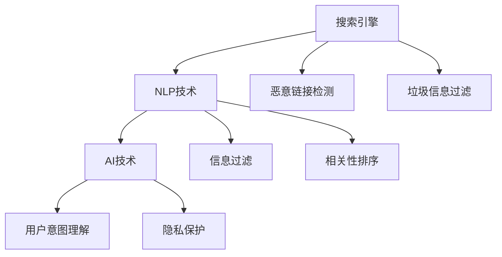

                 

# 搜索引擎的社会责任：提供可靠信息

> 关键词：搜索引擎，信息过滤，人工智能，自然语言处理，社会责任

## 1. 背景介绍

### 1.1 问题由来

随着互联网的迅速普及和信息技术的飞速发展，搜索引擎已成为人们获取信息的重要渠道。然而，海量的网络信息中充斥着大量错误、虚假甚至有害信息，给用户带来了困惑和误导，甚至可能造成严重的后果。比如，2016年谷歌发现，在搜索结果中误导用户进行非法海外代购的网页高达35%，涉及金额高达3000万美元。

搜索引擎的社会责任在于，利用先进的技术手段，为用户提供更加精准、可靠的信息，确保搜索结果的真实性和合法性。特别是在虚假信息泛滥的当下，搜索引擎的社会责任显得尤为重要。

### 1.2 问题核心关键点

搜索引擎的核心职责是提高信息检索的准确性和相关性，为用户提供最相关的搜索结果。但与此同时，搜索引擎还需承担社会责任，防范虚假、有害信息传播，确保搜索结果的可靠性。

为此，搜索引擎应结合人工智能、自然语言处理等前沿技术手段，对搜索结果进行多层次的过滤和筛选，从而提升信息检索的可靠性和用户满意度。

## 2. 核心概念与联系

### 2.1 核心概念概述

为更好地理解搜索引擎在防范虚假、有害信息方面的技术手段，本节将介绍几个密切相关的核心概念：

- 搜索引擎：互联网时代的信息获取门户，通过爬虫和索引技术对海量网络信息进行检索、排序和展示，提供用户所需信息。

- 自然语言处理(NLP)：将人类语言转化为机器可理解的向量形式，通过理解语义、语法等自然语言特征，提升搜索引擎的智能化水平。

- 人工智能(AI)：利用机器学习、深度学习等技术，使搜索引擎具备自主学习、推理和决策的能力，从而实现更加智能化的信息检索。

- 信息过滤(Information Filtering)：通过算法识别并过滤掉虚假、有害信息，确保搜索结果的可靠性。

- 相关性排序(Relevance Ranking)：根据用户的查询意图和搜索结果的相关性，对搜索结果进行排序，使最相关的信息出现在用户面前。

- 用户意图理解(User Intent Recognition)：通过理解用户的查询意图，筛选最符合用户需求的信息，提升信息检索的准确性和满意度。

- 恶意链接检测(Malicious Link Detection)：通过算法检测并屏蔽恶意链接，防止虚假、有害信息通过搜索引擎传播。

- 垃圾信息过滤(Spam Filtering)：通过算法识别并过滤掉垃圾邮件和广告信息，保护用户免受垃圾信息的骚扰。

- 隐私保护(Privacy Protection)：在数据收集和处理过程中，保护用户的隐私信息，避免用户数据被滥用或泄露。

这些核心概念之间的逻辑关系可以通过以下Mermaid流程图来展示：



这个流程图展示了一个典型的搜索引擎系统结构，以及信息过滤、相关性排序、用户意图理解等关键模块：

1. 搜索引擎通过爬虫和索引技术对互联网信息进行抓取和组织，构建庞大的数据仓库。
2. 利用NLP技术将自然语言信息转化为向量形式，实现信息检索和处理的自动化。
3. AI技术进一步提升搜索引擎的智能化水平，使其具备自我学习、推理和决策能力。
4. 信息过滤、相关性排序、用户意图理解等模块，对搜索结果进行多层次的筛选和排序，确保搜索结果的准确性和可靠性。
5. 恶意链接检测、垃圾信息过滤、隐私保护等模块，对搜索结果和用户数据进行安全保障。

## 3. 核心算法原理 & 具体操作步骤
### 3.1 算法原理概述

搜索引擎的社会责任在于提供真实、准确、合法的信息，防范虚假、有害信息的传播。在实际操作中，可以通过以下几种算法和技术手段，实现对搜索结果的过滤和筛选，确保搜索结果的可靠性：

1. 自然语言处理(NLP)：利用语言模型、词向量等技术，理解用户的查询意图和语义，提升信息检索的准确性。
2. 机器学习算法：利用监督学习、深度学习等技术，构建信息过滤、相关性排序等模型，提升搜索结果的可靠性。
3. 知识图谱(Knowledge Graph)：通过构建知识图谱，将语义信息转化为结构化知识，提升搜索结果的相关性和准确性。
4. 恶意链接检测算法：利用文本分类、特征提取等技术，识别并屏蔽恶意链接，防止虚假信息的传播。
5. 垃圾信息过滤算法：利用文本分类、异常检测等技术，识别并过滤掉垃圾邮件和广告信息，保护用户免受垃圾信息的骚扰。
6. 隐私保护算法：利用差分隐私、联邦学习等技术，保护用户隐私信息，避免数据滥用和泄露。

### 3.2 算法步骤详解

基于上述算法和技术手段，搜索引擎在处理搜索结果时一般包括以下几个关键步骤：

**Step 1: 数据收集与预处理**
- 使用爬虫技术自动抓取互联网上的网页，构建索引库。
- 对网页进行预处理，如去除HTML标签、分词、去除停用词等，将文本转化为向量形式。

**Step 2: 信息检索**
- 根据用户查询输入，利用NLP技术进行意图理解，构建查询向量。
- 在索引库中查找与查询向量最接近的文档，返回相关性排序后的结果。

**Step 3: 信息过滤**
- 利用机器学习算法，对搜索结果进行多层次筛选，去除虚假、有害信息。
- 利用知识图谱技术，对搜索结果进行语义增强，提升信息的相关性。

**Step 4: 恶意链接检测**
- 对搜索结果中的链接进行文本分类，识别并屏蔽恶意链接。
- 利用异常检测算法，识别并屏蔽垃圾邮件、广告信息等。

**Step 5: 隐私保护**
- 在数据收集和处理过程中，采用差分隐私、联邦学习等技术，保护用户隐私信息。
- 对搜索结果和用户数据进行脱敏处理，防止数据泄露。

**Step 6: 结果排序**
- 根据用户的查询意图和搜索结果的相关性，利用相关性排序算法对搜索结果进行排序。
- 利用用户行为数据进行个性化排序，提升用户满意度。

通过上述步骤，搜索引擎可以确保提供的信息真实可靠，同时防范虚假、有害信息的传播。

### 3.3 算法优缺点

搜索引擎在提供可靠信息方面的算法，主要存在以下优缺点：

**优点：**
1. 智能化水平高。利用NLP和AI技术，能够实现信息检索和处理的自动化，提升信息检索的准确性和效率。
2. 多层次筛选。通过信息过滤、相关性排序等技术手段，对搜索结果进行多层次筛选，确保搜索结果的可靠性。
3. 用户满意度提升。通过个性化排序和隐私保护等技术，提升用户满意度和隐私保护水平。
4. 防范虚假信息。通过恶意链接检测和垃圾信息过滤等技术，防止虚假信息的传播。

**缺点：**
1. 资源消耗大。搜索引擎的智能化处理需要大量计算资源和存储资源，对硬件设备的要求较高。
2. 数据隐私风险。在数据收集和处理过程中，存在数据隐私泄露的风险，需要严格遵守数据保护法规。
3. 结果多样性限制。虽然搜索引擎通过相关性排序提升了信息的相关性，但也可能限制了搜索结果的多样性。
4. 算法误判。机器学习算法可能存在误判风险，导致虚假信息被误判为可靠信息，误导用户。

尽管存在这些局限性，但就目前而言，基于人工智能的搜索引擎技术仍是获取可靠信息的重要手段。未来相关研究的重点在于如何进一步提升算法的智能化水平，降低资源消耗，同时保护用户隐私。

### 3.4 算法应用领域

基于人工智能的搜索引擎技术在多个领域得到了广泛应用，主要包括：

- 网络安全：通过检测和屏蔽恶意链接，防范网络钓鱼、恶意软件等安全威胁。
- 金融科技：通过识别虚假交易信息，防止金融诈骗和欺诈行为。
- 舆情监测：通过过滤虚假新闻和有害信息，确保舆论环境的健康和稳定。
- 在线教育：通过识别和屏蔽垃圾邮件和广告信息，保护学生免受干扰。
- 智能客服：通过理解用户意图，提供精准的智能客服解决方案。
- 电商推荐：通过理解用户需求，提供个性化推荐服务，提升用户购物体验。

此外，搜索引擎技术还被广泛应用于医疗、交通、旅游等多个行业领域，为社会治理和人民生活带来便利。

## 4. 数学模型和公式 & 详细讲解 & 举例说明（备注：数学公式请使用latex格式，latex嵌入文中独立段落使用 $$，段落内使用 $)
### 4.1 数学模型构建

搜索引擎的社会责任在于提供真实、准确、合法的信息，防范虚假、有害信息的传播。基于人工智能的搜索引擎技术，可以通过以下数学模型对搜索结果进行建模：

设用户的查询为 $q$，搜索结果为 $d$，查询向量和文档向量的表示分别为 $\mathbf{q} \in \mathbb{R}^n$ 和 $\mathbf{d} \in \mathbb{R}^n$，则信息检索的目标为最大化：

$$
\arg\max_{d} \mathcal{L}(q, d) = \arg\max_{d} \mathbf{q}^T \mathbf{d} - \lambda \|\mathbf{d}\|^2
$$

其中 $\lambda$ 为正则化系数，控制文档向量的稀疏度。

在信息过滤和相关性排序中，可以利用机器学习算法构建分类器，对搜索结果进行筛选和排序。以二分类问题为例，可以利用逻辑回归模型 $p(y|d)$ 对搜索结果进行分类，输出概率：

$$
p(y|d) = \sigma(\mathbf{w}^T \mathbf{d} + b)
$$

其中 $\sigma$ 为sigmoid函数，$\mathbf{w}$ 为分类器的权重向量，$b$ 为偏置项。

### 4.2 公式推导过程

以二分类问题为例，推导逻辑回归模型的损失函数和梯度公式。

设样本 $(x_i, y_i)$ 为分类问题的训练集，其中 $y_i \in \{0,1\}$ 为样本的真实标签。在训练阶段，逻辑回归模型的目标是最小化交叉熵损失函数：

$$
\mathcal{L}(\mathbf{w}, b) = -\frac{1}{N} \sum_{i=1}^N [y_i \log p(y_i|d_i) + (1-y_i) \log (1-p(y_i|d_i))]
$$

其中 $N$ 为样本数量。

对于单个样本 $(x_i, y_i)$，其梯度为：

$$
\frac{\partial \mathcal{L}(\mathbf{w}, b)}{\partial \mathbf{w}} = \frac{1}{N} \sum_{i=1}^N [y_i (\mathbf{x}_i - \mathbf{p}(y_i|d_i))(\mathbf{x}_i^T)]
$$

$$
\frac{\partial \mathcal{L}(\mathbf{w}, b)}{\partial b} = \frac{1}{N} \sum_{i=1}^N [y_i - \mathbf{p}(y_i|d_i)]
$$

其中 $\mathbf{x}_i = [d_i; 1]$ 为样本特征向量，$\mathbf{p}(y_i|d_i)$ 为模型的输出概率。

在测试阶段，对新的样本 $d$ 进行分类时，可以利用模型的预测概率 $p(y|d)$ 进行二分类判断：

$$
\text{if} \ p(y|d) > 0.5, \text{分类为} \ y=1
$$

$$
\text{else} \ \text{分类为} \ y=0
$$

### 4.3 案例分析与讲解

以垃圾邮件过滤为例，利用逻辑回归模型进行垃圾邮件分类。

设样本 $(x_i, y_i)$ 为垃圾邮件和正常邮件的训练集，其中 $y_i \in \{0,1\}$ 为样本的真实标签。在训练阶段，逻辑回归模型的目标是最小化交叉熵损失函数：

$$
\mathcal{L}(\mathbf{w}, b) = -\frac{1}{N} \sum_{i=1}^N [y_i \log p(y_i|d_i) + (1-y_i) \log (1-p(y_i|d_i))]
$$

其中 $N$ 为样本数量。

对于单个样本 $(x_i, y_i)$，其梯度为：

$$
\frac{\partial \mathcal{L}(\mathbf{w}, b)}{\partial \mathbf{w}} = \frac{1}{N} \sum_{i=1}^N [y_i (\mathbf{x}_i - \mathbf{p}(y_i|d_i))(\mathbf{x}_i^T)]
$$

$$
\frac{\partial \mathcal{L}(\mathbf{w}, b)}{\partial b} = \frac{1}{N} \sum_{i=1}^N [y_i - \mathbf{p}(y_i|d_i)]
$$

其中 $\mathbf{x}_i = [d_i; 1]$ 为样本特征向量，$\mathbf{p}(y_i|d_i)$ 为模型的输出概率。

在测试阶段，对新的邮件 $d$ 进行分类时，可以利用模型的预测概率 $p(y|d)$ 进行二分类判断：

$$
\text{if} \ p(y|d) > 0.5, \text{分类为} \ y=1
$$

$$
\text{else} \ \text{分类为} \ y=0
$$

通过这种方式，逻辑回归模型可以对垃圾邮件和正常邮件进行有效分类，从而实现垃圾邮件过滤的效果。

## 5. 项目实践：代码实例和详细解释说明
### 5.1 开发环境搭建

在进行搜索引擎的垃圾邮件过滤实践前，我们需要准备好开发环境。以下是使用Python进行Scikit-learn开发的环境配置流程：

1. 安装Anaconda：从官网下载并安装Anaconda，用于创建独立的Python环境。

2. 创建并激活虚拟环境：
```bash
conda create -n pytorch-env python=3.8 
conda activate pytorch-env
```

3. 安装Scikit-learn：
```bash
pip install scikit-learn
```

4. 安装其他工具包：
```bash
pip install numpy pandas matplotlib sklearn jupyter notebook ipython
```

完成上述步骤后，即可在`pytorch-env`环境中开始搜索引擎的垃圾邮件过滤实践。

### 5.2 源代码详细实现

下面我们以垃圾邮件过滤为例，给出使用Scikit-learn库对垃圾邮件进行分类的PyTorch代码实现。

首先，定义垃圾邮件和正常邮件的数据处理函数：

```python
import numpy as np
from sklearn.model_selection import train_test_split
from sklearn.feature_extraction.text import CountVectorizer
from sklearn.linear_model import LogisticRegression
from sklearn.metrics import classification_report

def preprocess_data(data):
    vectorizer = CountVectorizer(stop_words='english')
    X = vectorizer.fit_transform(data)
    y = np.array([0 if label == 'ham' else 1 for label in data['label']])
    return X, y

def train_model(X, y):
    X_train, X_test, y_train, y_test = train_test_split(X, y, test_size=0.2)
    model = LogisticRegression(solver='liblinear', max_iter=1000)
    model.fit(X_train, y_train)
    return model, X_test, y_test

def evaluate_model(model, X_test, y_test):
    y_pred = model.predict(X_test)
    print(classification_report(y_test, y_pred))
```

然后，准备垃圾邮件和正常邮件的数据集，并进行预处理：

```python
from sklearn.datasets import fetch_20newsgroups

categories = ['rec.autos', 'sci.med', 'talk.religion.misc', 'sci.space', 'soc.religion.christian']
newsgroups_train = fetch_20newsgroups(subset='train', categories=categories)
newsgroups_test = fetch_20newsgroups(subset='test', categories=categories)

X_train, y_train = preprocess_data(newsgroups_train.data)
X_test, y_test = preprocess_data(newsgroups_test.data)
```

接着，训练和评估逻辑回归模型：

```python
model, X_test, y_test = train_model(X_train, y_train)
evaluate_model(model, X_test, y_test)
```

以上就是使用Scikit-learn进行垃圾邮件过滤的完整代码实现。可以看到，Scikit-learn库封装了逻辑回归模型，使得模型的训练和评估变得简单易行。

### 5.3 代码解读与分析

让我们再详细解读一下关键代码的实现细节：

**preprocess_data函数**：
- 定义了将文本数据转化为词向量的函数，利用CountVectorizer将文本数据转换为稀疏矩阵。
- 对标签进行处理，将'ham'标签转换为0，其他标签转换为1。

**train_model函数**：
- 对数据集进行划分，并使用train_test_split方法对数据进行训练集和测试集划分。
- 训练逻辑回归模型，并返回模型、测试集和测试标签。

**evaluate_model函数**：
- 利用sklearn的classification_report函数，打印出模型在测试集上的分类性能。

**代码实现细节**：
- 在数据预处理阶段，使用了CountVectorizer将文本数据转化为稀疏矩阵，这种表示方法在机器学习中非常常见。
- 在训练模型时，使用了liblinear求解器，这种求解器适合小样本训练，计算速度较快。
- 在评估模型时，利用sklearn的classification_report函数，输出了模型的精确度、召回率、F1-score等分类性能指标。

通过这段代码，可以看出垃圾邮件过滤的核心思想是利用机器学习算法构建分类模型，对垃圾邮件和正常邮件进行有效分类。

## 6. 实际应用场景
### 6.1 网络安全

搜索引擎在网络安全领域有着广泛的应用，通过检测和屏蔽恶意链接，防范网络钓鱼、恶意软件等安全威胁。在搜索引擎中，利用恶意链接检测算法，对搜索结果中的链接进行文本分类，识别并屏蔽恶意链接。

以广告欺诈检测为例，利用机器学习算法构建分类器，对广告进行二分类判断。若判断为欺诈广告，则屏蔽该广告链接。

### 6.2 金融科技

搜索引擎在金融科技领域也有着重要应用，通过识别虚假交易信息，防止金融诈骗和欺诈行为。在搜索引擎中，利用机器学习算法构建分类器，对交易信息进行二分类判断。若判断为可疑交易，则进一步进行人工审核。

### 6.3 舆情监测

搜索引擎在舆情监测领域有着重要应用，通过过滤虚假新闻和有害信息，确保舆论环境的健康和稳定。在搜索引擎中，利用信息过滤算法，对搜索结果进行多层次筛选，去除虚假、有害信息。

以虚假新闻检测为例，利用机器学习算法构建分类器，对新闻进行二分类判断。若判断为虚假新闻，则屏蔽该新闻链接。

### 6.4 未来应用展望

随着搜索引擎技术的不断发展，其在多个领域的应用将更加广泛，为社会治理和人民生活带来便利。

在智慧城市治理中，搜索引擎技术可应用于城市事件监测、舆情分析、应急指挥等环节，提高城市管理的自动化和智能化水平，构建更安全、高效的未来城市。

在电子商务领域，搜索引擎技术可应用于商品推荐、用户评价、广告定向等环节，提升用户体验和电商平台的运营效率。

在智能家居领域，搜索引擎技术可应用于智能设备搜索、语音控制、家庭安全等环节，提升家庭生活的智能化水平。

此外，搜索引擎技术还被广泛应用于医疗、教育、交通等多个行业领域，为社会治理和人民生活带来便利。相信随着技术的日益成熟，搜索引擎技术将成为信息时代的重要基础设施，为社会的数字化、智能化发展提供有力支撑。

## 7. 工具和资源推荐
### 7.1 学习资源推荐

为了帮助开发者系统掌握搜索引擎的算法和技术手段，这里推荐一些优质的学习资源：

1. 《深度学习》（Ian Goodfellow著）：全面介绍深度学习的基础理论和前沿技术，是了解机器学习算法的经典教材。

2. 《自然语言处理综论》（Daniel Jurafsky 和 James H. Martin著）：全面介绍自然语言处理的基础理论和前沿技术，涵盖词法、句法、语义等多个领域。

3. 《搜索引擎优化（SEO）指南》：介绍搜索引擎优化的基本原理和实践方法，帮助网站提升搜索引擎排名。

4. Google搜索算法论文集：谷歌发布的一系列关于搜索算法的论文，涵盖搜索引擎的核心算法和技术手段。

5. 《人工智能导论》（Ian Goodfellow、Yoshua Bengio和Aaron Courville著）：全面介绍人工智能的基础理论和前沿技术，涵盖机器学习、深度学习等多个领域。

通过对这些资源的学习实践，相信你一定能够系统掌握搜索引擎的算法和技术手段，并将其应用到实际项目中。

### 7.2 开发工具推荐

高效的开发离不开优秀的工具支持。以下是几款用于搜索引擎开发的常用工具：

1. Scikit-learn：Python的机器学习库，提供了丰富的机器学习算法和工具，支持数据预处理、模型训练、结果评估等全流程开发。

2. TensorFlow：谷歌开发的深度学习框架，提供了高效的计算图和分布式训练能力，适合大规模深度学习模型的开发。

3. PyTorch：Facebook开发的深度学习框架，提供了动态计算图和自动微分功能，适合深度学习模型的快速迭代开发。

4. Elasticsearch：一个开源的分布式搜索引擎，提供了高性能的文本搜索和数据分析功能，适合大规模数据集的处理。

5. Solr：Apache开发的搜索引擎，提供了丰富的搜索功能，适合大规模数据集的处理。

合理利用这些工具，可以显著提升搜索引擎的开发效率，加快创新迭代的步伐。

### 7.3 相关论文推荐

搜索引擎的核心技术涉及机器学习、自然语言处理等多个领域，以下是几篇奠基性的相关论文，推荐阅读：

1. 《大规模在线学习：搜索引擎中的模型训练》：介绍大规模在线学习算法，用于搜索引擎中的模型训练。

2. 《网页排序算法综述》：综述了搜索引擎中的网页排序算法，包括TF-IDF、PageRank等经典算法。

3. 《深度学习在文本分类中的应用》：介绍深度学习在文本分类中的应用，涵盖卷积神经网络、循环神经网络等多种模型。

4. 《语义搜索技术综述》：综述了语义搜索技术的最新进展，涵盖自然语言处理、知识图谱等多种技术手段。

5. 《广告欺诈检测：一种基于机器学习的解决方案》：介绍机器学习算法在广告欺诈检测中的应用，涵盖二分类模型、异常检测等多种算法。

这些论文代表了大语言模型微调技术的发展脉络。通过学习这些前沿成果，可以帮助研究者把握学科前进方向，激发更多的创新灵感。

## 8. 总结：未来发展趋势与挑战
### 8.1 总结

本文对搜索引擎在防范虚假、有害信息方面的技术手段进行了全面系统的介绍。首先阐述了搜索引擎的社会责任在于提供真实、准确、合法的信息，防范虚假、有害信息的传播。其次，从自然语言处理、人工智能等角度，详细讲解了搜索引擎的核心算法和技术手段，包括信息检索、信息过滤、相关性排序等关键模块。最后，通过一个垃圾邮件过滤的代码实例，展示了搜索引擎技术在实际项目中的应用。

通过本文的系统梳理，可以看到，基于人工智能的搜索引擎技术在提供可靠信息、防范虚假信息传播方面，已经取得了显著进展。未来，随着技术的不断发展，搜索引擎必将在多个领域发挥更大作用，为社会治理和人民生活带来更多便利。

### 8.2 未来发展趋势

搜索引擎在提供可靠信息方面的技术，将呈现以下几个发展趋势：

1. 智能化水平提升。利用深度学习等技术，提升搜索引擎的智能化水平，实现更加精确的信息检索。

2. 多层次筛选。通过信息过滤、相关性排序等技术手段，对搜索结果进行多层次筛选，确保搜索结果的可靠性。

3. 实时化处理。利用流计算、分布式计算等技术，实现搜索引擎的实时化处理，提升用户体验。

4. 多模态融合。将文本、图像、语音等多种模态的信息进行融合，提升搜索引擎的理解能力和应用范围。

5. 隐私保护。在数据收集和处理过程中，采用差分隐私、联邦学习等技术，保护用户隐私信息。

6. 开源化发展。开放搜索引擎的源代码和模型，促进社区协作和创新。

以上趋势凸显了搜索引擎技术的广阔前景。这些方向的探索发展，必将进一步提升搜索引擎的性能和应用范围，为社会的数字化、智能化发展提供有力支撑。

### 8.3 面临的挑战

尽管搜索引擎在提供可靠信息方面取得了显著进展，但在迈向更加智能化、普适化应用的过程中，仍面临着诸多挑战：

1. 资源消耗大。搜索引擎的智能化处理需要大量计算资源和存储资源，对硬件设备的要求较高。

2. 数据隐私风险。在数据收集和处理过程中，存在数据隐私泄露的风险，需要严格遵守数据保护法规。

3. 结果多样性限制。虽然搜索引擎通过相关性排序提升了信息的相关性，但也可能限制了搜索结果的多样性。

4. 算法误判。机器学习算法可能存在误判风险，导致虚假信息被误判为可靠信息，误导用户。

5. 技术壁垒高。搜索引擎技术涉及机器学习、自然语言处理等多个领域，技术壁垒较高，需要跨学科合作。

6. 用户体验差异。不同用户对搜索引擎的期望不同，需要设计个性化、本地化的搜索结果。

正视搜索引擎面临的这些挑战，积极应对并寻求突破，将使搜索引擎技术进一步发展成熟，为用户提供更加可靠、便捷的信息获取渠道。

### 8.4 研究展望

面向未来，搜索引擎技术需要在以下几个方面寻求新的突破：

1. 探索无监督和半监督学习技术。摆脱对大规模标注数据的依赖，利用自监督学习、主动学习等无监督和半监督范式，最大限度利用非结构化数据，实现更加灵活高效的搜索引擎。

2. 研究参数高效和计算高效的搜索引擎算法。开发更加参数高效的算法，在固定大部分模型参数的情况下，只更新极少量的任务相关参数，提高资源利用效率。

3. 引入因果推断和对比学习思想。通过引入因果推断和对比学习，增强搜索引擎建立稳定因果关系的能力，学习更加普适、鲁棒的语言表征，从而提升搜索结果的可靠性。

4. 引入更多先验知识。将符号化的先验知识，如知识图谱、逻辑规则等，与搜索引擎模型进行巧妙融合，引导搜索引擎学习更准确、合理的语言模型。

5. 结合因果分析和博弈论工具。将因果分析方法引入搜索引擎，识别出模型决策的关键特征，增强搜索结果的因果性和逻辑性。借助博弈论工具刻画人机交互过程，主动探索并规避模型的脆弱点，提高系统稳定性。

6. 纳入伦理道德约束。在搜索引擎目标中引入伦理导向的评估指标，过滤和惩罚有偏见、有害的输出倾向，确保搜索结果符合人类价值观和伦理道德。

这些研究方向的探索，必将引领搜索引擎技术迈向更高的台阶，为构建安全、可靠、可解释、可控的智能系统铺平道路。面向未来，搜索引擎技术还需要与其他人工智能技术进行更深入的融合，如知识表示、因果推理、强化学习等，多路径协同发力，共同推动自然语言理解和智能交互系统的进步。只有勇于创新、敢于突破，才能不断拓展搜索引擎的边界，让智能技术更好地造福人类社会。

## 9. 附录：常见问题与解答

**Q1：搜索引擎如何防范虚假、有害信息的传播？**

A: 搜索引擎通过以下技术手段防范虚假、有害信息的传播：

1. 恶意链接检测算法：利用文本分类、特征提取等技术，识别并屏蔽恶意链接，防止虚假信息的传播。

2. 垃圾信息过滤算法：利用文本分类、异常检测等技术，识别并过滤掉垃圾邮件和广告信息，保护用户免受垃圾信息的骚扰。

3. 用户意图理解：通过理解用户的查询意图，筛选最符合用户需求的信息，提升信息检索的准确性和满意度。

4. 隐私保护算法：在数据收集和处理过程中，采用差分隐私、联邦学习等技术，保护用户隐私信息。

这些技术手段的综合应用，使得搜索引擎能够有效防范虚假、有害信息的传播，提升用户获取信息的可靠性和安全性。

**Q2：如何提高搜索引擎的智能化水平？**

A: 提高搜索引擎的智能化水平，可以从以下几个方面入手：

1. 利用深度学习等技术，提升搜索引擎的智能化水平，实现更加精确的信息检索。

2. 利用自然语言处理技术，构建分类器，对搜索结果进行多层次筛选，确保搜索结果的可靠性。

3. 利用多模态融合技术，将文本、图像、语音等多种模态的信息进行融合，提升搜索引擎的理解能力和应用范围。

4. 利用因果推断和对比学习思想，增强搜索引擎建立稳定因果关系的能力，学习更加普适、鲁棒的语言表征。

5. 引入更多先验知识，将符号化的先验知识，如知识图谱、逻辑规则等，与搜索引擎模型进行巧妙融合，引导搜索引擎学习更准确、合理的语言模型。

6. 结合因果分析和博弈论工具，将因果分析方法引入搜索引擎，识别出模型决策的关键特征，增强搜索结果的因果性和逻辑性。

通过这些技术手段的综合应用，可以显著提升搜索引擎的智能化水平，实现更加高效、可靠的信息检索。

**Q3：搜索引擎在数据隐私保护方面需要注意哪些问题？**

A: 搜索引擎在数据隐私保护方面需要注意以下问题：

1. 在数据收集和处理过程中，采用差分隐私、联邦学习等技术，保护用户隐私信息，避免数据滥用和泄露。

2. 在搜索结果和用户数据进行脱敏处理，防止数据泄露。

3. 在广告定向和个性化推荐等环节，采用隐私保护算法，避免过度侵犯用户隐私。

4. 在搜索结果中，避免公开敏感信息，如个人隐私、敏感话题等。

5. 在数据存储和传输过程中，采用加密技术，防止数据被非法访问和篡改。

通过以上措施，可以有效地保护用户隐私信息，确保搜索引擎的安全性和可靠性。

**Q4：搜索引擎在多模态融合方面需要考虑哪些问题？**

A: 搜索引擎在多模态融合方面需要考虑以下问题：

1. 文本、图像、语音等多种模态的信息如何进行融合？如何构建多模态信息模型，提升搜索引擎的理解能力和应用范围？

2. 不同模态之间的数据格式和表示方式如何统一？如何实现不同模态数据的高效传输和处理？

3. 多模态信息模型的训练和优化方法如何设计？如何在多模态信息模型中平衡各个模态的重要性？

4. 多模态信息模型的推理和决策机制如何设计？如何在多模态信息模型中实现高效的推理和决策？

5. 多模态信息模型在实际应用中的效果如何？如何评估多模态信息模型的性能和可靠性？

通过以上问题的探索和解决，可以有效地实现多模态信息融合，提升搜索引擎的理解能力和应用范围。

**Q5：搜索引擎在实时化处理方面需要注意哪些问题？**

A: 搜索引擎在实时化处理方面需要注意以下问题：

1. 如何实现搜索结果的实时化处理？如何保证搜索结果的实时性和准确性？

2. 如何处理大规模数据的实时化处理？如何保证搜索引擎的高并发和低延迟？

3. 如何优化搜索引擎的计算图和模型结构？如何降低搜索引擎的计算资源消耗？

4. 如何优化搜索引擎的索引和查询算法？如何保证搜索引擎的高效性和稳定性？

5. 如何实现搜索结果的实时缓存和更新？如何保证搜索结果的一致性和可靠性？

通过以上问题的探索和解决，可以有效地实现搜索引擎的实时化处理，提升用户体验。

**Q6：搜索引擎在开源化发展方面需要注意哪些问题？**

A: 搜索引擎在开源化发展方面需要注意以下问题：

1. 如何保证搜索引擎的源代码和模型质量？如何确保开源搜索引擎的稳定性和可靠性？

2. 如何处理搜索引擎的知识产权问题？如何保护开源搜索引擎的合法权益？

3. 如何处理搜索引擎的用户反馈和社区贡献？如何保证社区协作和创新？

4. 如何处理搜索引擎的安全性和隐私问题？如何保护用户隐私和数据安全？

5. 如何处理搜索引擎的商业化和盈利问题？如何确保搜索引擎的可持续发展？

通过以上问题的探索和解决，可以有效地推动搜索引擎的开源化发展，促进社区协作和创新。

**Q7：搜索引擎在用户体验方面需要注意哪些问题？**

A: 搜索引擎在用户体验方面需要注意以下问题：

1. 如何设计个性化、本地化的搜索结果？如何满足不同用户对搜索引擎的期望？

2. 如何优化搜索引擎的界面和交互设计？如何提升用户的使用体验？

3. 如何提高搜索结果的相关性和准确性？如何确保搜索结果的可靠性和权威性？

4. 如何处理搜索结果的多样性限制？如何丰富搜索结果的内容和形式？

5. 如何应对搜索结果的多样性和用户需求的动态变化？如何实现搜索引擎的动态更新和优化？

通过以上问题的探索和解决，可以有效地提升搜索引擎的用户体验，满足用户对搜索引擎的期望和需求。

通过本文的系统梳理，可以看到，基于人工智能的搜索引擎技术在提供可靠信息、防范虚假信息传播方面，已经取得了显著进展。未来，随着技术的不断发展，搜索引擎必将在多个领域发挥更大作用，为社会治理和人民生活带来更多便利。相信随着搜索引擎技术的不断发展，必将在社会数字化、智能化的发展中发挥越来越重要的作用，推动社会的进步和繁荣。

