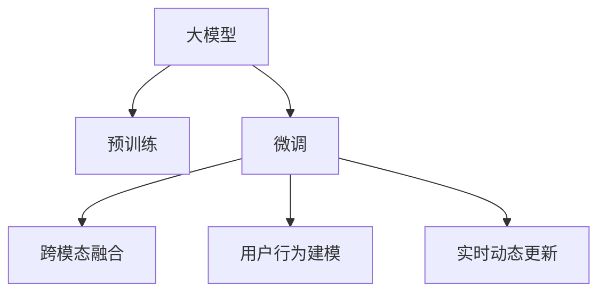

                 

# 搜索推荐系统的AI 大模型应用：提高电商平台的转化率与用户体验

## 1. 背景介绍

### 1.1 问题由来
在电商领域，搜索和推荐系统是最重要的两大组成部分，直接影响用户转化率和平台营收。随着用户数量的不断增长，如何优化搜索推荐系统以提升用户体验，成为各大电商平台亟需解决的痛点问题。

传统的搜索推荐系统基于规则、协同过滤、矩阵分解等方法，但面临诸多局限：

- **规则方法**：需要手动设计复杂且难以维护的规则，无法适应快速变化的市场需求。
- **协同过滤**：推荐基于用户历史行为，难以应对新用户的冷启动问题。
- **矩阵分解**：难以处理高维稀疏数据，算法复杂度较高。

近年来，随着深度学习和大模型的兴起，基于神经网络、预训练语言模型的方法在搜索推荐领域逐渐流行起来。这些方法能够更好地捕捉用户和商品之间的复杂关系，从而提供更精准、个性化的推荐结果。

### 1.2 问题核心关键点
面对搜索推荐系统面临的问题，AI大模型提供了一种新的解决方案，通过预训练语言模型在海量数据上进行学习和表示，再通过微调适配特定场景，提升搜索推荐系统的性能。具体关键点包括：

- **预训练大模型**：利用大规模无标签数据进行预训练，学习到通用的语言和知识表示。
- **微调适配**：通过少量有标签数据进行微调，学习特定任务，提升模型性能。
- **跨模态融合**：将图像、视频、文本等多种数据类型进行融合，提供更全面的推荐结果。
- **用户行为建模**：引入用户兴趣、行为、评价等多维度信息，提升推荐系统的理解能力。
- **实时动态更新**：利用实时数据流进行动态更新，提高推荐系统的时效性。

通过这些技术手段，电商平台的搜索推荐系统可以更好地理解用户需求，提供更个性化的商品推荐，从而显著提升用户体验和转化率。

### 1.3 问题研究意义
研究基于AI大模型的搜索推荐系统，对于提升电商平台的用户体验和业务效益，具有重要意义：

- **提升转化率**：通过精准推荐，提高用户购买意愿，增加平台营收。
- **个性化服务**：针对不同用户提供个性化推荐，提升用户粘性。
- **减少流失率**：通过推荐系统引导用户完成购物流程，降低用户流失率。
- **数据驱动决策**：基于大量数据进行动态调整，实现实时优化。
- **多模态融合**：利用图像、文本等多模态信息，提供更丰富的推荐内容。

本文将详细探讨如何利用AI大模型提升电商平台的搜索推荐系统性能，为电商平台的搜索推荐系统优化提供理论和方法指导。

## 2. 核心概念与联系

### 2.1 核心概念概述

为更好地理解AI大模型在电商搜索推荐系统中的应用，本节将介绍几个关键概念：

- **大模型**：基于大规模数据预训练的深度学习模型，具备强大的语言理解和生成能力。
- **预训练**：在无标签数据上训练模型，学习通用知识表示。
- **微调**：在预训练模型的基础上，利用有标签数据进行任务特定优化。
- **跨模态融合**：将不同类型的数据（如文本、图像、视频）进行融合，提供更全面的推荐结果。
- **用户行为建模**：引入用户历史行为、兴趣、评价等数据，提升推荐系统的理解能力。
- **实时动态更新**：基于实时数据流进行动态更新，提升推荐系统时效性。

这些概念之间的逻辑关系可以通过以下Mermaid流程图来展示：



这个流程图展示了大模型在电商搜索推荐系统中的核心概念及其之间的关系：

1. 大模型通过预训练获得基础能力。
2. 微调在大模型基础上进行任务特定优化，提升模型性能。
3. 跨模态融合将不同类型数据进行融合，提供更全面的推荐结果。
4. 用户行为建模引入多维度信息，提升推荐系统的理解能力。
5. 实时动态更新利用实时数据流进行动态调整，提高推荐系统时效性。

这些概念共同构成了大模型在电商搜索推荐系统中的应用框架，使其能够提供更精准、个性化的推荐服务。

## 3. 核心算法原理 & 具体操作步骤
### 3.1 算法原理概述

基于AI大模型的电商搜索推荐系统，本质上是一个深度学习模型在特定任务上的微调过程。其核心思想是：通过在大规模无标签数据上进行预训练，学习通用的语言和知识表示，再利用少量有标签数据进行微调，使其适应特定任务，如商品推荐、广告点击预测等。

形式化地，假设预训练模型为 $M_{\theta}$，其中 $\theta$ 为预训练得到的模型参数。给定电商平台的推荐任务 $T$ 的训练集 $D=\{(x_i,y_i)\}_{i=1}^N$，微调的目标是找到新的模型参数 $\hat{\theta}$，使得：

$$
\hat{\theta}=\mathop{\arg\min}_{\theta} \mathcal{L}(M_{\theta},D)
$$

其中 $\mathcal{L}$ 为针对任务 $T$ 设计的损失函数，用于衡量模型预测输出与真实标签之间的差异。常见的损失函数包括交叉熵损失、均方误差损失等。

通过梯度下降等优化算法，微调过程不断更新模型参数 $\theta$，最小化损失函数 $\mathcal{L}$，使得模型输出逼近真实标签。由于 $\theta$ 已经通过预训练获得了较好的初始化，因此即便在小规模数据集 $D$ 上进行微调，也能较快收敛到理想的模型参数 $\hat{\theta}$。

### 3.2 算法步骤详解

基于AI大模型的电商搜索推荐系统微调一般包括以下几个关键步骤：

**Step 1: 准备预训练模型和数据集**
- 选择合适的预训练语言模型 $M_{\theta}$ 作为初始化参数，如 BERT、GPT 等。
- 准备电商平台推荐任务 $T$ 的训练集 $D$，划分为训练集、验证集和测试集。一般要求标注数据与预训练数据的分布不要差异过大。

**Step 2: 添加任务适配层**
- 根据任务类型，在预训练模型顶层设计合适的输出层和损失函数。
- 对于分类任务，通常在顶层添加线性分类器和交叉熵损失函数。
- 对于生成任务，通常使用语言模型的解码器输出概率分布，并以负对数似然为损失函数。

**Step 3: 设置微调超参数**
- 选择合适的优化算法及其参数，如 AdamW、SGD 等，设置学习率、批大小、迭代轮数等。
- 设置正则化技术及强度，包括权重衰减、Dropout、Early Stopping 等。
- 确定冻结预训练参数的策略，如仅微调顶层，或全部参数都参与微调。

**Step 4: 执行梯度训练**
- 将训练集数据分批次输入模型，前向传播计算损失函数。
- 反向传播计算参数梯度，根据设定的优化算法和学习率更新模型参数。
- 周期性在验证集上评估模型性能，根据性能指标决定是否触发 Early Stopping。
- 重复上述步骤直到满足预设的迭代轮数或 Early Stopping 条件。

**Step 5: 测试和部署**
- 在测试集上评估微调后模型 $M_{\hat{\theta}}$ 的性能，对比微调前后的精度提升。
- 使用微调后的模型对新样本进行推理预测，集成到实际的应用系统中。
- 持续收集新的数据，定期重新微调模型，以适应数据分布的变化。

以上是基于AI大模型的电商搜索推荐系统微调的一般流程。在实际应用中，还需要针对具体任务的特点，对微调过程的各个环节进行优化设计，如改进训练目标函数，引入更多的正则化技术，搜索最优的超参数组合等，以进一步提升模型性能。

### 3.3 算法优缺点

基于AI大模型的电商搜索推荐系统微调方法具有以下优点：

- **通用高效**。利用预训练大模型的强大表征能力，能够快速适应不同任务，提升模型效率。
- **灵活可扩展**。通过引入用户行为建模、跨模态融合等技术，能够灵活应对多种推荐场景。
- **实时动态调整**。基于实时数据流进行动态更新，提高推荐系统时效性。
- **高精度**。通过深度学习模型的强大预测能力，提供精准推荐，提升用户体验。

同时，该方法也存在一定的局限性：

- **高资源需求**。大模型和微调过程需要大量计算资源和存储空间，成本较高。
- **依赖标注数据**。微调过程仍需要一定的标注数据，无法完全脱离人工标注。
- **可解释性不足**。深度学习模型的决策过程难以解释，难以进行用户行为分析和调试。
- **泛化能力有限**。如果预训练数据与电商场景差异较大，微调效果可能不理想。

尽管存在这些局限性，但就目前而言，基于AI大模型的微调方法仍是最主流且有效的电商搜索推荐系统范式。未来相关研究的重点在于如何进一步降低资源需求，提高可解释性和泛化能力，同时兼顾实时动态更新等优点。

### 3.4 算法应用领域

基于AI大模型的电商搜索推荐系统已经在商品推荐、广告点击预测、个性化服务等多个领域取得了显著效果，成为电商平台优化搜索推荐系统的有效手段。

具体而言，AI大模型在电商平台的搜索推荐系统中主要应用于：

- **商品推荐**：基于用户历史行为、兴趣、评价等信息，提供个性化推荐。
- **广告点击预测**：预测用户是否会点击广告，优化广告投放策略。
- **个性化服务**：根据用户行为和偏好，提供定制化的内容和活动。
- **实时推荐**：基于实时数据流进行动态更新，提供即时推荐。

此外，大模型还在电商平台的用户留存、复购率提升、品牌推广等方面发挥了重要作用，推动了电商平台的业务创新和用户满意度提升。

## 4. 数学模型和公式 & 详细讲解
### 4.1 数学模型构建

本节将使用数学语言对基于AI大模型的电商搜索推荐系统微调过程进行更加严格的刻画。

记预训练语言模型为 $M_{\theta}$，其中 $\theta$ 为预训练得到的模型参数。假设电商平台推荐任务 $T$ 的训练集为 $D=\{(x_i,y_i)\}_{i=1}^N, x_i \in \mathcal{X}, y_i \in \mathcal{Y}$。

定义模型 $M_{\theta}$ 在输入 $x$ 上的输出为 $\hat{y}=M_{\theta}(x)$，其中 $\mathcal{X}$ 为输入空间，$\mathcal{Y}$ 为输出空间。假设推荐任务 $T$ 为二分类任务，则定义模型在训练集上的损失函数为：

$$
\mathcal{L}(\theta) = -\frac{1}{N}\sum_{i=1}^N \log(\sigma(\hat{y}_i)) \cdot y_i + (1-\sigma(\hat{y}_i)) \cdot (1-y_i)
$$

其中 $\sigma(z)$ 为sigmoid函数，用于将输出 $\hat{y}$ 映射到 $[0,1]$ 区间，$y_i$ 为真实标签。

### 4.2 公式推导过程

以下我们以商品推荐任务为例，推导基于AI大模型的推荐系统损失函数及其梯度的计算公式。

假设模型 $M_{\theta}$ 在输入 $x$ 上的输出为 $\hat{y}=M_{\theta}(x) \in [0,1]$，表示商品被点击的概率。真实标签 $y \in \{0,1\}$。则二分类交叉熵损失函数定义为：

$$
\ell(M_{\theta}(x),y) = -[y\log \hat{y} + (1-y)\log (1-\hat{y})]
$$

将其代入经验风险公式，得：

$$
\mathcal{L}(\theta) = -\frac{1}{N}\sum_{i=1}^N \ell(M_{\theta}(x_i),y_i)
$$

根据链式法则，损失函数对参数 $\theta_k$ 的梯度为：

$$
\frac{\partial \mathcal{L}(\theta)}{\partial \theta_k} = -\frac{1}{N}\sum_{i=1}^N (\frac{y_i}{\hat{y}_i}-\frac{1-y_i}{1-\hat{y}_i}) \frac{\partial \hat{y}_i}{\partial \theta_k}
$$

其中 $\frac{\partial \hat{y}_i}{\partial \theta_k}$ 可进一步递归展开，利用自动微分技术完成计算。

在得到损失函数的梯度后，即可带入参数更新公式，完成模型的迭代优化。重复上述过程直至收敛，最终得到适应电商平台推荐任务的最优模型参数 $\theta^*$。

## 5. 项目实践：代码实例和详细解释说明
### 5.1 开发环境搭建

在进行电商搜索推荐系统开发前，我们需要准备好开发环境。以下是使用Python进行PyTorch开发的环境配置流程：

1. 安装Anaconda：从官网下载并安装Anaconda，用于创建独立的Python环境。

2. 创建并激活虚拟环境：
```bash
conda create -n pytorch-env python=3.8 
conda activate pytorch-env
```

3. 安装PyTorch：根据CUDA版本，从官网获取对应的安装命令。例如：
```bash
conda install pytorch torchvision torchaudio cudatoolkit=11.1 -c pytorch -c conda-forge
```

4. 安装Transformers库：
```bash
pip install transformers
```

5. 安装各类工具包：
```bash
pip install numpy pandas scikit-learn matplotlib tqdm jupyter notebook ipython
```

完成上述步骤后，即可在`pytorch-env`环境中开始电商搜索推荐系统的开发。

### 5.2 源代码详细实现

这里以商品推荐任务为例，给出使用Transformers库对BERT模型进行电商搜索推荐系统微调的PyTorch代码实现。

首先，定义推荐任务的数据处理函数：

```python
from transformers import BertTokenizer
from torch.utils.data import Dataset
import torch

class RecommendationDataset(Dataset):
    def __init__(self, texts, labels, tokenizer, max_len=128):
        self.texts = texts
        self.labels = labels
        self.tokenizer = tokenizer
        self.max_len = max_len
        
    def __len__(self):
        return len(self.texts)
    
    def __getitem__(self, item):
        text = self.texts[item]
        label = self.labels[item]
        
        encoding = self.tokenizer(text, return_tensors='pt', max_length=self.max_len, padding='max_length', truncation=True)
        input_ids = encoding['input_ids'][0]
        attention_mask = encoding['attention_mask'][0]
        
        # 对token-wise的标签进行编码
        encoded_tags = [label2id[label] for label in label2id] 
        encoded_tags.extend([label2id['not_recommend']] * (self.max_len - len(encoded_tags)))
        labels = torch.tensor(encoded_tags, dtype=torch.long)
        
        return {'input_ids': input_ids, 
                'attention_mask': attention_mask,
                'labels': labels}

# 标签与id的映射
label2id = {'not_recommend': 0, 'recommend': 1}
id2label = {v: k for k, v in label2id.items()}

# 创建dataset
tokenizer = BertTokenizer.from_pretrained('bert-base-cased')

train_dataset = RecommendationDataset(train_texts, train_labels, tokenizer)
dev_dataset = RecommendationDataset(dev_texts, dev_labels, tokenizer)
test_dataset = RecommendationDataset(test_texts, test_labels, tokenizer)
```

然后，定义模型和优化器：

```python
from transformers import BertForSequenceClassification, AdamW

model = BertForSequenceClassification.from_pretrained('bert-base-cased', num_labels=len(label2id))

optimizer = AdamW(model.parameters(), lr=2e-5)
```

接着，定义训练和评估函数：

```python
from torch.utils.data import DataLoader
from tqdm import tqdm
from sklearn.metrics import classification_report

device = torch.device('cuda') if torch.cuda.is_available() else torch.device('cpu')
model.to(device)

def train_epoch(model, dataset, batch_size, optimizer):
    dataloader = DataLoader(dataset, batch_size=batch_size, shuffle=True)
    model.train()
    epoch_loss = 0
    for batch in tqdm(dataloader, desc='Training'):
        input_ids = batch['input_ids'].to(device)
        attention_mask = batch['attention_mask'].to(device)
        labels = batch['labels'].to(device)
        model.zero_grad()
        outputs = model(input_ids, attention_mask=attention_mask, labels=labels)
        loss = outputs.loss
        epoch_loss += loss.item()
        loss.backward()
        optimizer.step()
    return epoch_loss / len(dataloader)

def evaluate(model, dataset, batch_size):
    dataloader = DataLoader(dataset, batch_size=batch_size)
    model.eval()
    preds, labels = [], []
    with torch.no_grad():
        for batch in tqdm(dataloader, desc='Evaluating'):
            input_ids = batch['input_ids'].to(device)
            attention_mask = batch['attention_mask'].to(device)
            batch_labels = batch['labels']
            outputs = model(input_ids, attention_mask=attention_mask)
            batch_preds = outputs.logits.argmax(dim=2).to('cpu').tolist()
            batch_labels = batch_labels.to('cpu').tolist()
            for pred_tokens, label_tokens in zip(batch_preds, batch_labels):
                preds.append(pred_tokens[:len(label_tokens)])
                labels.append(label_tokens)
                
    print(classification_report(labels, preds))
```

最后，启动训练流程并在测试集上评估：

```python
epochs = 5
batch_size = 16

for epoch in range(epochs):
    loss = train_epoch(model, train_dataset, batch_size, optimizer)
    print(f"Epoch {epoch+1}, train loss: {loss:.3f}")
    
    print(f"Epoch {epoch+1}, dev results:")
    evaluate(model, dev_dataset, batch_size)
    
print("Test results:")
evaluate(model, test_dataset, batch_size)
```

以上就是使用PyTorch对BERT进行电商搜索推荐系统微调的完整代码实现。可以看到，得益于Transformers库的强大封装，我们可以用相对简洁的代码完成BERT模型的加载和微调。

### 5.3 代码解读与分析

让我们再详细解读一下关键代码的实现细节：

**RecommendationDataset类**：
- `__init__`方法：初始化文本、标签、分词器等关键组件。
- `__len__`方法：返回数据集的样本数量。
- `__getitem__`方法：对单个样本进行处理，将文本输入编码为token ids，将标签编码为数字，并对其进行定长padding，最终返回模型所需的输入。

**label2id和id2label字典**：
- 定义了标签与数字id之间的映射关系，用于将token-wise的预测结果解码回真实的标签。

**训练和评估函数**：
- 使用PyTorch的DataLoader对数据集进行批次化加载，供模型训练和推理使用。
- 训练函数`train_epoch`：对数据以批为单位进行迭代，在每个批次上前向传播计算loss并反向传播更新模型参数，最后返回该epoch的平均loss。
- 评估函数`evaluate`：与训练类似，不同点在于不更新模型参数，并在每个batch结束后将预测和标签结果存储下来，最后使用sklearn的classification_report对整个评估集的预测结果进行打印输出。

**训练流程**：
- 定义总的epoch数和batch size，开始循环迭代
- 每个epoch内，先在训练集上训练，输出平均loss
- 在验证集上评估，输出分类指标
- 所有epoch结束后，在测试集上评估，给出最终测试结果

可以看到，PyTorch配合Transformers库使得BERT微调的代码实现变得简洁高效。开发者可以将更多精力放在数据处理、模型改进等高层逻辑上，而不必过多关注底层的实现细节。

当然，工业级的系统实现还需考虑更多因素，如模型的保存和部署、超参数的自动搜索、更灵活的任务适配层等。但核心的微调范式基本与此类似。

## 6. 实际应用场景
### 6.1 智能客服系统

基于大模型微调的电商搜索推荐系统，可以广泛应用于智能客服系统的构建。传统客服往往需要配备大量人力，高峰期响应缓慢，且一致性和专业性难以保证。而使用微调后的电商搜索推荐系统，可以7x24小时不间断服务，快速响应客户咨询，用自然流畅的语言解答各类常见问题。

在技术实现上，可以收集客户的历史咨询记录，将问题和最佳答复构建成监督数据，在此基础上对预训练电商搜索推荐系统进行微调。微调后的系统能够自动理解客户意图，匹配最合适的商品推荐，进行客户互动，提升客户满意度。

### 6.2 商品推荐

电商搜索推荐系统的主要任务之一是商品推荐。通过微调大模型，电商平台能够根据用户历史行为、浏览记录、评价信息等数据，生成个性化的商品推荐列表。

具体而言，可以收集用户浏览、点击、购买等行为数据，提取商品标题、描述、标签等文本内容，将文本内容作为模型输入，用户的后续行为（如是否点击、购买等）作为监督信号，在此基础上微调预训练语言模型。微调后的模型能够从文本内容中准确把握用户的兴趣点，生成符合用户期望的商品推荐结果。

### 6.3 个性化活动推送

电商平台还可以利用微调后的电商搜索推荐系统，进行个性化活动的推送。通过分析用户行为和兴趣，生成推荐结果，然后将商品推送给用户。同时，通过微调后的系统，动态调整推荐策略，确保推荐效果最优。

例如，某电商平台在“双十一”期间，利用微调后的系统，针对不同用户群体生成个性化的促销活动推送，提升用户参与度和活动转化率，增加销售额。

### 6.4 未来应用展望

随着大模型和微调方法的不断发展，基于AI大模型的电商搜索推荐系统将在更多领域得到应用，为电商平台的业务创新和用户满意度提升提供新的技术路径。

在智慧零售领域，基于微调的系统能够更精准地识别用户需求，提供个性化购物建议，提升用户体验，实现智能零售的转型升级。

在智能物流领域，通过微调后的电商搜索推荐系统，可以实现智能化的仓储管理和物流配送，提升供应链效率，降低运营成本。

此外，在智能家居、智能穿戴设备等众多领域，基于大模型的电商搜索推荐系统也具有广阔的应用前景。相信随着技术的不断进步，微调技术将在更多领域发挥重要作用，为产业升级提供新的动能。

## 7. 工具和资源推荐
### 7.1 学习资源推荐

为了帮助开发者系统掌握大模型在电商搜索推荐系统中的应用，这里推荐一些优质的学习资源：

1. 《深度学习与电商搜索推荐系统》系列博文：深度学习专家撰写，介绍了电商搜索推荐系统的工作原理和常用模型，提供了完整的微调代码示例。

2. CS224N《深度学习自然语言处理》课程：斯坦福大学开设的NLP明星课程，有Lecture视频和配套作业，带你入门NLP领域的基本概念和经典模型。

3. 《Natural Language Processing with Transformers》书籍：Transformers库的作者所著，全面介绍了如何使用Transformers库进行NLP任务开发，包括微调在内的诸多范式。

4. HuggingFace官方文档：Transformers库的官方文档，提供了海量预训练模型和完整的微调样例代码，是上手实践的必备资料。

5. 《电商搜索推荐系统》书籍：系统介绍电商搜索推荐系统的理论、算法和实践方法，提供了丰富的案例和代码示例。

通过对这些资源的学习实践，相信你一定能够快速掌握大模型在电商搜索推荐系统中的应用，并用于解决实际的电商问题。
###  7.2 开发工具推荐

高效的开发离不开优秀的工具支持。以下是几款用于电商搜索推荐系统开发的常用工具：

1. PyTorch：基于Python的开源深度学习框架，灵活动态的计算图，适合快速迭代研究。大部分预训练语言模型都有PyTorch版本的实现。

2. TensorFlow：由Google主导开发的开源深度学习框架，生产部署方便，适合大规模工程应用。同样有丰富的预训练语言模型资源。

3. Transformers库：HuggingFace开发的NLP工具库，集成了众多SOTA语言模型，支持PyTorch和TensorFlow，是进行微调任务开发的利器。

4. Weights & Biases：模型训练的实验跟踪工具，可以记录和可视化模型训练过程中的各项指标，方便对比和调优。与主流深度学习框架无缝集成。

5. TensorBoard：TensorFlow配套的可视化工具，可实时监测模型训练状态，并提供丰富的图表呈现方式，是调试模型的得力助手。

6. Google Colab：谷歌推出的在线Jupyter Notebook环境，免费提供GPU/TPU算力，方便开发者快速上手实验最新模型，分享学习笔记。

合理利用这些工具，可以显著提升电商搜索推荐系统的开发效率，加快创新迭代的步伐。

### 7.3 相关论文推荐

大模型和微调技术的发展源于学界的持续研究。以下是几篇奠基性的相关论文，推荐阅读：

1. Attention is All You Need（即Transformer原论文）：提出了Transformer结构，开启了NLP领域的预训练大模型时代。

2. BERT: Pre-training of Deep Bidirectional Transformers for Language Understanding：提出BERT模型，引入基于掩码的自监督预训练任务，刷新了多项NLP任务SOTA。

3. Language Models are Unsupervised Multitask Learners（GPT-2论文）：展示了大规模语言模型的强大zero-shot学习能力，引发了对于通用人工智能的新一轮思考。

4. Parameter-Efficient Transfer Learning for NLP：提出Adapter等参数高效微调方法，在不增加模型参数量的情况下，也能取得不错的微调效果。

5. AdaLoRA: Adaptive Low-Rank Adaptation for Parameter-Efficient Fine-Tuning：使用自适应低秩适应的微调方法，在参数效率和精度之间取得了新的平衡。

6. Text Matching with Transformers：利用Transformer结构进行文本匹配任务，展示了其在大规模文本数据上的优越性能。

这些论文代表了大模型和微调技术的发展脉络。通过学习这些前沿成果，可以帮助研究者把握学科前进方向，激发更多的创新灵感。

## 8. 总结：未来发展趋势与挑战
### 8.1 总结

本文对基于AI大模型的电商搜索推荐系统进行了全面系统的介绍。首先阐述了电商搜索推荐系统面临的问题和AI大模型的应用前景，明确了微调在提升推荐系统性能方面的独特价值。其次，从原理到实践，详细讲解了电商搜索推荐系统的数学原理和关键步骤，给出了微调任务开发的完整代码实例。同时，本文还广泛探讨了微调方法在电商推荐系统中的应用场景，展示了微调范式的巨大潜力。

通过本文的系统梳理，可以看到，基于AI大模型的微调方法在电商搜索推荐系统中具有显著优势，能够提供精准推荐，提升用户体验和业务效益。未来，随着技术进步，微调方法将进一步拓展到更多电商场景，实现智能化、个性化推荐，推动电商平台的创新发展。

### 8.2 未来发展趋势

展望未来，基于AI大模型的电商搜索推荐系统将呈现以下几个发展趋势：

1. **多模态融合**：将文本、图像、视频等多种数据类型进行融合，提供更全面的推荐结果。
2. **跨平台协同**：利用大模型的跨平台能力，实现不同平台之间的推荐系统协同。
3. **用户意图理解**：通过微调系统，更深入地理解用户意图和需求，提供更个性化、精准的推荐。
4. **实时动态调整**：基于实时数据流进行动态更新，提升推荐系统时效性。
5. **混合推荐策略**：结合规则、协同过滤、深度学习等方法，实现多维度推荐。

这些趋势凸显了大模型在电商搜索推荐系统中的应用前景。这些方向的探索发展，必将进一步提升电商平台的推荐系统性能，带来更优质的用户体验和业务效益。

### 8.3 面临的挑战

尽管基于AI大模型的微调方法已经取得了瞩目成就，但在迈向更加智能化、普适化应用的过程中，它仍面临着诸多挑战：

1. **高资源需求**：大模型和微调过程需要大量计算资源和存储空间，成本较高。
2. **依赖标注数据**：微调过程仍需要一定的标注数据，无法完全脱离人工标注。
3. **可解释性不足**：深度学习模型的决策过程难以解释，难以进行用户行为分析和调试。
4. **泛化能力有限**：如果预训练数据与电商场景差异较大，微调效果可能不理想。
5. **实时动态更新**：基于实时数据流进行动态更新，系统稳定性需要保障。

尽管存在这些挑战，但就目前而言，基于AI大模型的微调方法仍是最主流且有效的电商搜索推荐系统范式。未来相关研究的重点在于如何进一步降低资源需求，提高可解释性和泛化能力，同时兼顾实时动态更新等优点。

### 8.4 研究展望

面对电商搜索推荐系统所面临的挑战，未来的研究需要在以下几个方面寻求新的突破：

1. **无监督和半监督微调方法**：探索如何利用大规模非结构化数据进行无监督或半监督微调，降低对标注数据的依赖。
2. **多模态数据融合**：结合文本、图像、视频等多种数据类型，提升推荐系统的多维度理解能力。
3. **因果推断与对比学习**：引入因果推断和对比学习，增强微调模型建立稳定因果关系的能力，学习更加普适、鲁棒的语言表征。
4. **用户行为建模**：引入更丰富的用户行为和评价信息，提升推荐系统的理解能力。
5. **实时动态更新**：基于实时数据流进行动态更新，提高推荐系统时效性。

这些研究方向的探索，必将引领电商搜索推荐系统迈向更高的台阶，为电商平台的用户体验和业务创新提供新的技术支持。

## 9. 附录：常见问题与解答

**Q1：电商搜索推荐系统是否适用于所有电商平台？**

A: 电商搜索推荐系统在大多数电商平台中都能取得较好的效果，但不同的电商平台有其独特的业务模式和用户需求。针对具体平台，需要根据其特点进行微调和优化。

**Q2：如何选择合适的预训练语言模型？**

A: 选择合适的预训练语言模型需要考虑以下几个因素：
1. 平台业务类型：根据电商平台的业务类型选择合适的模型，如零售、在线教育等。
2. 数据量规模：根据电商平台的业务数据规模选择合适的模型，如小型平台可以选择BERT，大型平台可以选择GPT。
3. 计算资源：根据电商平台计算资源情况选择合适的模型，如计算资源较少的平台可以选择参数较小的模型。

**Q3：微调过程中如何防止过拟合？**

A: 防止过拟合是微调过程中需要注意的重要问题。以下是几种常见的方法：
1. 数据增强：通过回译、近义替换等方式扩充训练集。
2. 正则化：使用L2正则、Dropout、Early Stopping等防止过拟合。
3. 对抗训练：引入对抗样本，提高模型鲁棒性。
4. 参数高效微调：只调整少量参数，减小过拟合风险。

**Q4：微调后模型的评估方法有哪些？**

A: 微调后模型的评估方法主要有以下几个：
1. 精度和召回率：适用于二分类或多分类任务，评估模型预测结果与真实标签的匹配程度。
2. 均方误差和平均绝对误差：适用于回归任务，评估模型预测结果与真实标签的差异。
3. 平均互信息：适用于多标签任务，评估模型预测结果与真实标签的相关性。
4. 准确率-召回率曲线：适用于二分类任务，评估模型在不同阈值下的表现。

**Q5：微调后的模型如何部署？**

A: 微调后的模型部署主要包括以下几个步骤：
1. 模型裁剪：去除不必要的层和参数，减小模型尺寸。
2. 量化加速：将浮点模型转为定点模型，压缩存储空间，提高计算效率。
3. 服务化封装：将模型封装为标准化服务接口，便于集成调用。
4. 监控告警：实时采集系统指标，设置异常告警阈值，确保服务稳定性。

通过以上部署步骤，可以将微调后的模型部署到实际业务系统中，实现精准推荐和实时更新，提升用户体验和业务效益。

