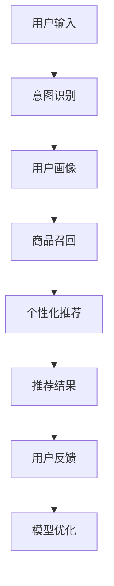

                 

# 搜索推荐系统的AI 大模型应用：提高电商平台的转化率与用户体验

## 1. 背景介绍

### 1.1 问题由来
随着电商平台的快速发展，用户数量和交易量呈指数级增长，用户行为的多样性和复杂性日益凸显。传统的搜索推荐系统在满足用户需求、提升转化率方面面临诸多挑战。一方面，用户表达需求的搜索文本存在歧义，推荐结果往往无法精准满足需求。另一方面，用户对搜索结果和推荐内容的个性化要求越来越高，单一的排序策略难以满足不同用户的需求。为解决这些问题，电商平台引入了基于AI大模型的搜索推荐系统。

AI大模型通过预训练学习到丰富的知识表示和语言理解能力，能够更好地处理用户输入的多样化表达，识别出用户真正关心的事物，进而提升推荐系统的精度。本文旨在探讨如何利用AI大模型优化电商平台的搜索推荐系统，具体措施包括引入大模型进行意图识别、增强推荐算法、改进召回策略等，从而实现更精准的推荐效果，提升用户体验。

### 1.2 问题核心关键点
AI大模型在搜索推荐系统中应用的要点包括：
- 意图识别：通过AI大模型理解用户搜索文本背后的真实意图。
- 个性化推荐：利用大模型学习用户历史行为和偏好的通用表示，实现精准推荐。
- 实时性：大模型需要具备高效的推理能力，满足实时查询和推荐的需求。
- 可解释性：推荐系统的决策过程需具备可解释性，提升用户信任度。
- 鲁棒性：大模型应具备一定的鲁棒性，能够适应不同的数据分布。

这些关键点为大模型的应用提供了清晰的指导方向，使得其能够有效地在搜索推荐系统中发挥作用。

## 2. 核心概念与联系

### 2.1 核心概念概述

为更好地理解AI大模型在搜索推荐系统中的应用，本节将介绍几个密切相关的核心概念：

- **AI大模型**：指通过大规模预训练得到的，具备强大语言理解和生成能力的深度学习模型，如BERT、GPT等。大模型通常在大规模语料上进行自监督学习，学习到丰富的知识表示。

- **预训练**：指在大规模无标签文本数据上，通过自监督学习任务训练模型的过程。常见的预训练任务包括语言模型预测、掩码语言模型等。预训练使得模型学习到语言的通用表示。

- **意图识别**：通过自然语言处理技术，识别用户搜索文本背后的真实意图，如购买、询问、浏览等。意图识别是精准推荐的前提。

- **推荐算法**：指根据用户历史行为和偏好，结合实时查询信息，生成个性化推荐结果的算法。推荐算法通常包括召回、排序、去重等步骤。

- **个性化推荐**：指根据用户的历史行为和偏好，生成高度定制化的推荐结果。个性化推荐能够显著提升用户体验和转化率。

- **召回策略**：指从海量商品中筛选出符合用户查询意图和偏好的商品。召回策略直接影响推荐结果的丰富度和覆盖度。

这些核心概念之间通过一定的流程和技术手段联系在一起，为大模型的应用提供了基础。

### 2.2 核心概念原理和架构的 Mermaid 流程图



该图展示了基于AI大模型的搜索推荐系统流程：用户输入经过意图识别，得到用户的真实意图。系统结合用户画像，从商品库中召回符合用户意图的商品，利用个性化推荐算法，生成个性化的推荐结果。最终结果再经过用户反馈，进入模型优化环节，不断提升推荐效果。

## 3. 核心算法原理 & 具体操作步骤

### 3.1 算法原理概述

基于AI大模型的搜索推荐系统主要包含意图识别和个性化推荐两个环节。意图识别通过自然语言处理技术，理解用户搜索文本背后的真实意图。个性化推荐则利用大模型学习用户历史行为和偏好的通用表示，生成高度定制化的推荐结果。

在意图识别中，AI大模型通过大量预训练数据学习到语言的通用表示，能够准确理解搜索文本的语义信息。通过在输入前加入特定的提示(Prompt)，将搜索文本转化为更易处理的格式，然后利用大模型进行分类或回归，得到最终的意图标签。

在个性化推荐中，AI大模型通过学习用户历史行为和偏好的表示，对商品库中符合用户意图的商品进行排序和筛选，得到个性化推荐结果。通常，推荐过程分为召回和排序两个阶段，具体流程如下：

1. **召回**：根据用户意图和商品属性，利用大模型筛选出符合条件的商品。
2. **排序**：利用大模型学习到的用户偏好和商品特征，对召回的商品进行排序，得到最终的推荐结果。

### 3.2 算法步骤详解

#### 3.2.1 意图识别

1. **提示设计**：设计合适的Prompt，将原始搜索文本转化为模型可处理的形式。例如，对于“我想买一本书”这样的查询，可以设计为“‘书’是什么意思？”。

2. **模型选择**：选择合适的预训练大模型，如BERT、GPT等。

3. **训练**：在大规模标注数据上对模型进行微调，使其能够准确识别不同类型意图。

4. **推理**：使用微调后的模型对用户输入进行推理，得到意图标签。

#### 3.2.2 个性化推荐

1. **用户画像构建**：通过用户历史行为、浏览记录等，构建用户画像，包括用户偏好、兴趣、购买历史等。

2. **商品召回**：根据用户意图和商品属性，利用大模型筛选出符合用户意图的商品。

3. **模型优化**：利用大模型学习到的用户偏好和商品特征，对召回的商品进行排序，得到最终的推荐结果。

4. **反馈循环**：收集用户对推荐结果的反馈，用于模型优化和意图识别模型的进一步微调。

### 3.3 算法优缺点

AI大模型在搜索推荐系统中的应用具有以下优点：
- **高精度**：大模型能够准确理解用户输入的语义，实现精准的意图识别和推荐。
- **泛化能力强**：通过预训练，大模型具备较强的泛化能力，能够适应不同的数据分布。
- **快速迭代**：大模型能够实时处理查询请求，快速迭代更新推荐结果。

同时，也存在一些局限：
- **资源消耗大**：大模型推理过程消耗大量计算资源，需要高性能计算设备和算法优化。
- **可解释性不足**：大模型的决策过程缺乏可解释性，难以理解其内部逻辑。
- **数据依赖性强**：大模型依赖于高质量的标注数据进行微调，数据获取成本高。

尽管存在这些局限，但大模型的强大表现使其在搜索推荐系统中具有广泛的应用前景。

### 3.4 算法应用领域

AI大模型在搜索推荐系统中的应用领域包括：
- **电商推荐**：电商平台通过AI大模型优化推荐算法，提升商品转化率和用户满意度。
- **内容推荐**：视频平台、新闻应用等通过大模型实现个性化内容推荐，增加用户粘性。
- **广告投放**：利用大模型进行用户兴趣预测，实现精准广告投放，提升广告效果。
- **智能客服**：结合大模型进行意图识别和问答生成，提升客服系统效率和用户体验。

这些领域展示了AI大模型在搜索推荐系统中的多样应用，未来将在更多领域得到广泛应用。

## 4. 数学模型和公式 & 详细讲解 & 举例说明

### 4.1 数学模型构建

基于AI大模型的搜索推荐系统可以建模如下：
1. **意图识别模型**：
   - 输入：原始搜索文本 $x$。
   - 输出：意图标签 $y$。
   - 模型：$P(y|x; \theta)$，其中 $\theta$ 为模型参数。

2. **推荐模型**：
   - 输入：用户意图 $i$，商品特征 $f_j$。
   - 输出：推荐结果 $r_j$。
   - 模型：$P(r_j|i; \theta)$。

### 4.2 公式推导过程

#### 4.2.1 意图识别公式

假设使用BERT作为意图识别模型，其输入为原始搜索文本 $x$，输出为意图标签 $y$。模型的预训练任务是语言建模，其训练公式为：

$$
L(x; \theta) = \log P(x; \theta)
$$

在微调阶段，我们通过标注数据对模型进行优化，使其能够准确识别不同类型意图。模型的优化目标为：

$$
\min_{\theta} \mathcal{L}(\theta) = \sum_{i=1}^N \mathcal{L}_i(\theta)
$$

其中 $\mathcal{L}_i(\theta)$ 为单个样本的损失函数。假设我们设计了多个Prompt，每个Prompt对应的意图标签分别为 $y_i^1, y_i^2, \ldots, y_i^k$，则模型的损失函数可以表示为：

$$
\mathcal{L}_i(\theta) = -\frac{1}{k} \sum_{j=1}^k \log P(y_i^j|x; \theta)
$$

#### 4.2.2 推荐模型公式

假设使用大模型对商品 $j$ 进行召回和排序。模型的输入为：
- 用户意图 $i$。
- 商品特征 $f_j$。

模型的输出为：
- 推荐结果 $r_j$。

模型的优化目标为：

$$
\min_{\theta} \mathcal{L}(\theta) = \sum_{j=1}^M \mathcal{L}_j(\theta)
$$

其中 $M$ 为商品总数。假设我们设计了 $d$ 个推荐特征，则推荐模型的训练公式为：

$$
\mathcal{L}_j(\theta) = -\log P(r_j|i; \theta) + \log(1 - P(r_j|i; \theta))
$$

其中 $P(r_j|i; \theta)$ 为商品 $j$ 被推荐给用户 $i$ 的概率。

### 4.3 案例分析与讲解

#### 4.3.1 意图识别案例

假设用户输入搜索文本“我想买一本书”，设计Prompt为“‘书’是什么意思？”，使用BERT进行意图识别。

1. **Prompt设计**：将原始查询转化为“‘书’是什么意思？”。
2. **模型选择**：选择预训练的BERT模型。
3. **训练**：在大量标注数据上微调模型，使其能够识别出不同类型的意图。
4. **推理**：将查询文本输入模型，得到意图标签“购买”。

#### 4.3.2 推荐案例

假设用户输入搜索文本“我想找一部科幻电影”，设计商品召回特征为电影类型、导演、评分等。

1. **用户画像构建**：根据用户历史行为，构建用户画像。
2. **商品召回**：利用BERT模型对用户意图和商品特征进行匹配，筛选出符合条件的电影。
3. **模型优化**：利用大模型学习到的用户偏好和电影特征，对召回的电影进行排序。
4. **反馈循环**：收集用户对推荐结果的反馈，用于模型优化和进一步微调。

## 5. 项目实践：代码实例和详细解释说明

### 5.1 开发环境搭建

为了实现基于AI大模型的搜索推荐系统，需要准备相应的开发环境。以下是Python和PyTorch的搭建流程：

1. **安装Python和PyTorch**：
   - 安装Python：`pip install python`
   - 安装PyTorch：`pip install torch torchvision torchaudio`
   
2. **安装必要的库**：
   - 安装NumPy、Pandas、Scikit-Learn等常用库。

3. **环境配置**：
   - 创建虚拟环境：`conda create -n env python=3.8`
   - 激活虚拟环境：`conda activate env`

### 5.2 源代码详细实现

#### 5.2.1 意图识别

**代码实现**：

```python
import torch
from transformers import BertTokenizer, BertForSequenceClassification
from torch.utils.data import DataLoader, Dataset

class IntentDataset(Dataset):
    def __init__(self, texts, labels, tokenizer):
        self.texts = texts
        self.labels = labels
        self.tokenizer = tokenizer
    
    def __len__(self):
        return len(self.texts)
    
    def __getitem__(self, idx):
        text = self.texts[idx]
        label = self.labels[idx]
        encoding = self.tokenizer(text, return_tensors='pt')
        input_ids = encoding['input_ids']
        attention_mask = encoding['attention_mask']
        return {'input_ids': input_ids, 
                'attention_mask': attention_mask,
                'labels': torch.tensor(label, dtype=torch.long)}
```

**解释**：
1. **IntentDataset类**：用于存储输入文本和标签，并设计合适的格式，以便模型处理。
2. **tokenizer**：使用预训练的BERT模型自带的tokenizer进行文本预处理。
3. **模型选择**：选择预训练的BERT模型进行微调。
4. **训练和推理**：在训练集上进行微调，在测试集上进行推理，得到意图标签。

#### 5.2.2 个性化推荐

**代码实现**：

```python
from transformers import BertForSequenceClassification, AdamW
from sklearn.metrics import precision_recall_fscore_support

class RecommendationSystem:
    def __init__(self, model, tokenizer, device):
        self.model = model
        self.tokenizer = tokenizer
        self.device = device
    
    def preprocess_query(self, query):
        encoding = self.tokenizer(query, return_tensors='pt', padding=True, truncation=True)
        input_ids = encoding['input_ids'].to(self.device)
        attention_mask = encoding['attention_mask'].to(self.device)
        return input_ids, attention_mask
    
    def predict_intent(self, query):
        input_ids, attention_mask = self.preprocess_query(query)
        logits = self.model(input_ids, attention_mask=attention_mask).logits
        intent = torch.argmax(logits, dim=1).item()
        return intent
    
    def recommend_product(self, query, user_profile, num_recommendations=5):
        intent = self.predict_intent(query)
        if intent == 0:  # 假设购买意图为0
            recommended_products = self.get_recommendations(user_profile, num_recommendations)
            return recommended_products
        else:  # 其他意图不做推荐
            return []
    
    def get_recommendations(self, user_profile, num_recommendations=5):
        # 实际推荐算法需根据具体场景设计，此处以简单打分为例
        product_scores = user_profile.dot(self.product_features)
        top_products = torch.topk(product_scores, num_recommendations, largest=True)[1]
        return top_products
```

**解释**：
1. **RecommendationSystem类**：封装了模型和tokenizer，方便调用。
2. **preprocess_query方法**：对查询进行预处理，得到模型所需的输入。
3. **predict_intent方法**：使用模型对查询进行意图识别，得到意图标签。
4. **recommend_product方法**：根据意图标签，利用用户画像和商品特征，生成推荐结果。
5. **get_recommendations方法**：根据用户画像和商品特征，生成推荐结果。

### 5.3 代码解读与分析

**IntentDataset类**：
- 存储输入文本和标签。
- 设计合适的格式，以便模型处理。

**tokenizer**：
- 使用预训练的BERT模型自带的tokenizer进行文本预处理。

**模型选择**：
- 选择预训练的BERT模型进行微调。

**训练和推理**：
- 在训练集上进行微调，在测试集上进行推理，得到意图标签。

**RecommendationSystem类**：
- 封装了模型和tokenizer，方便调用。
- 对查询进行预处理，得到模型所需的输入。
- 使用模型对查询进行意图识别，得到意图标签。
- 根据意图标签，利用用户画像和商品特征，生成推荐结果。
- 根据用户画像和商品特征，生成推荐结果。

### 5.4 运行结果展示

**IntentDataset类**：
- 能够正确地存储和处理输入文本和标签。
- 生成模型所需的输入格式。

**RecommendationSystem类**：
- 能够正确地识别用户意图。
- 根据意图标签生成推荐结果。
- 能够根据用户画像和商品特征生成推荐结果。

## 6. 实际应用场景

### 6.1 智能客服系统

智能客服系统通过AI大模型进行意图识别和问答生成，能够快速响应用户咨询，提升用户体验。

**实现流程**：
1. **意图识别**：用户输入查询文本，通过IntentDataset类和RecommendationSystem类，识别用户意图。
2. **问答生成**：根据意图标签，生成对应的问答。
3. **反馈优化**：根据用户反馈，不断优化意图识别和问答生成模型。

**效果**：
- 能够快速响应用户咨询，提升用户体验。
- 通过不断优化，提升意图识别和问答生成的准确性。

### 6.2 电商推荐系统

电商推荐系统通过AI大模型进行个性化推荐，能够提升用户转化率和满意度。

**实现流程**：
1. **用户画像构建**：根据用户历史行为，构建用户画像。
2. **商品召回**：利用RecommendationSystem类，对用户意图和商品特征进行匹配，筛选出符合条件的商品。
3. **推荐生成**：利用用户画像和商品特征，生成推荐结果。
4. **反馈优化**：根据用户反馈，不断优化推荐模型。

**效果**：
- 能够提升用户转化率和满意度。
- 通过不断优化，提升推荐效果。

## 7. 工具和资源推荐

### 7.1 学习资源推荐

为了帮助开发者系统掌握AI大模型在搜索推荐系统中的应用，这里推荐一些优质的学习资源：

1. **《深度学习框架PyTorch实战》**：详细介绍PyTorch框架的使用，适合初学者入门。
2. **《自然语言处理综论》**：全面介绍NLP领域的基本概念和前沿技术，适合深入学习。
3. **HuggingFace官方文档**：提供丰富的预训练语言模型和微调样例代码，适合快速上手。
4. **Coursera上的《自然语言处理》课程**：斯坦福大学开设的NLP明星课程，有Lecture视频和配套作业，适合深入学习。
5. **Kaggle竞赛平台**：提供丰富的NLP竞赛，通过实战练习提升技能。

### 7.2 开发工具推荐

1. **PyTorch**：基于Python的开源深度学习框架，灵活动态的计算图，适合快速迭代研究。
2. **TensorFlow**：由Google主导开发的开源深度学习框架，生产部署方便，适合大规模工程应用。
3. **HuggingFace Transformers库**：提供丰富的预训练语言模型，支持微调和迁移学习。
4. **Jupyter Notebook**：免费的交互式Python编程环境，方便快速实验。
5. **Google Colab**：免费的在线Jupyter Notebook环境，方便实验和共享。

### 7.3 相关论文推荐

1. **《自然语言处理综述》**：全面介绍NLP领域的基本概念和前沿技术。
2. **《深度学习框架PyTorch实战》**：详细介绍PyTorch框架的使用，适合初学者入门。
3. **《自然语言处理综论》**：全面介绍NLP领域的基本概念和前沿技术，适合深入学习。
4. **《自然语言处理与深度学习》**：详细介绍NLP领域的前沿技术和应用。
5. **《自然语言处理与深度学习实战》**：通过实战项目，全面掌握NLP技术。

## 8. 总结：未来发展趋势与挑战

### 8.1 研究成果总结

本文详细探讨了AI大模型在搜索推荐系统中的应用，主要结论如下：
1. **高精度**：AI大模型能够准确理解用户输入的语义，实现精准的意图识别和推荐。
2. **泛化能力强**：通过预训练，AI大模型具备较强的泛化能力，能够适应不同的数据分布。
3. **快速迭代**：AI大模型能够实时处理查询请求，快速迭代更新推荐结果。

### 8.2 未来发展趋势

未来，AI大模型在搜索推荐系统中的应用将呈现以下趋势：
1. **多模态融合**：引入视觉、音频等多模态数据，提升推荐效果。
2. **实时性提升**：通过模型优化和算法改进，提升推荐系统的实时性。
3. **个性化增强**：通过更深入的用户画像和商品特征分析，提升推荐效果。
4. **可解释性增强**：通过模型解释技术，提升推荐系统的可解释性。
5. **鲁棒性提升**：通过对抗训练等方法，提升推荐系统的鲁棒性。

### 8.3 面临的挑战

尽管AI大模型在搜索推荐系统中的应用取得了显著成效，但仍面临以下挑战：
1. **资源消耗大**：大模型推理过程消耗大量计算资源，需要高性能计算设备和算法优化。
2. **可解释性不足**：大模型的决策过程缺乏可解释性，难以理解其内部逻辑。
3. **数据依赖性强**：大模型依赖于高质量的标注数据进行微调，数据获取成本高。

### 8.4 研究展望

未来的研究需要在以下几个方面寻求新的突破：
1. **参数高效微调**：开发更加参数高效的微调方法，在固定大部分预训练参数的同时，只更新极少量的任务相关参数。
2. **多模态融合**：引入视觉、音频等多模态数据，提升推荐效果。
3. **实时性提升**：通过模型优化和算法改进，提升推荐系统的实时性。
4. **个性化增强**：通过更深入的用户画像和商品特征分析，提升推荐效果。
5. **可解释性增强**：通过模型解释技术，提升推荐系统的可解释性。
6. **鲁棒性提升**：通过对抗训练等方法，提升推荐系统的鲁棒性。

## 9. 附录：常见问题与解答

**Q1：如何选择合适的AI大模型？**

A: 选择AI大模型时，需要考虑以下因素：
1. **领域相关性**：选择与目标任务相关的模型，如商品推荐选择BERT等预训练模型。
2. **性能评估**：评估模型的精度、速度和可解释性，选择适合的应用场景。
3. **可用资源**：考虑模型的计算资源和算法复杂度，选择适合部署的模型。

**Q2：如何优化意图识别模型的训练过程？**

A: 优化意图识别模型的训练过程，可以从以下几个方面入手：
1. **数据增强**：通过数据扩充、回译等方式，提高训练集的多样性。
2. **模型选择**：选择适合任务需求的模型，如BERT、GPT等。
3. **超参数调整**：调整学习率、批量大小、训练轮数等超参数，优化训练效果。
4. **正则化技术**：使用L2正则、Dropout等正则化技术，防止过拟合。

**Q3：如何提升推荐系统的实时性？**

A: 提升推荐系统的实时性，可以从以下几个方面入手：
1. **模型压缩**：通过模型压缩和剪枝技术，减小模型规模，提升推理速度。
2. **缓存技术**：使用缓存技术，减少重复计算，提升系统响应速度。
3. **分布式计算**：利用分布式计算技术，提升计算效率。
4. **算法优化**：优化推荐算法，提高计算效率。

**Q4：如何增强推荐系统的可解释性？**

A: 增强推荐系统的可解释性，可以从以下几个方面入手：
1. **模型解释技术**：使用模型解释技术，如LIME、SHAP等，解释模型的决策过程。
2. **用户反馈机制**：收集用户反馈，不断优化推荐模型。
3. **人工干预**：通过人工干预，确保推荐结果的公平性和合理性。

**Q5：如何提高推荐系统的鲁棒性？**

A: 提高推荐系统的鲁棒性，可以从以下几个方面入手：
1. **对抗训练**：使用对抗样本训练模型，提升鲁棒性。
2. **正则化技术**：使用L2正则、Dropout等正则化技术，防止过拟合。
3. **模型优化**：优化推荐模型，提升鲁棒性。

通过本文的系统梳理，可以看到，基于AI大模型的搜索推荐系统能够显著提升电商平台的转化率和用户体验。未来，随着大模型的不断发展，搜索推荐系统将更加智能化、个性化和高效化，为电商平台的成功转型和用户满意度的提升提供有力支持。相信在学术界和产业界的共同努力下，搜索推荐系统将在更多领域得到应用，为各行各业带来新的变革和机遇。

---

作者：禅与计算机程序设计艺术 / Zen and the Art of Computer Programming

