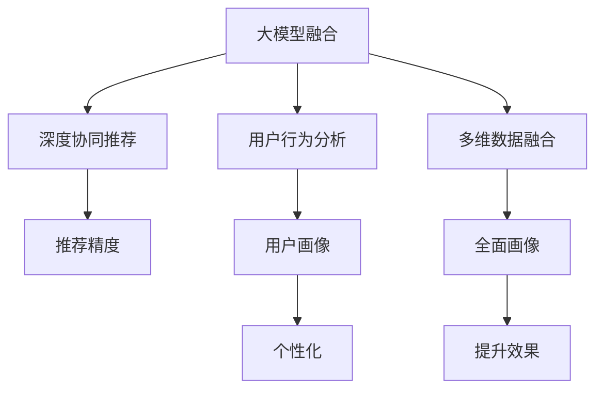

                 

# 搜索推荐系统的AI 大模型融合技术：电商平台的核心竞争力与转型战略

## 1. 背景介绍

### 1.1 问题由来
近年来，随着消费者行为的多样化和个性化需求的不断增加，电商平台在传统的商品展示和搜索推荐机制之外，进一步引入AI技术，以提升用户体验和商家收益。

**搜索推荐系统**（Search and Recommendation Systems, SRS）通过精准预测用户行为，提供个性化的商品展示和推荐服务。借助AI技术，SRS实现了从传统的信息检索到智能推荐的技术飞跃，能够在海量的商品数据中挖掘出符合用户需求的优质商品，从而增强用户的购物体验，提高平台的用户粘性和留存率。

但传统搜索推荐系统面临数据稀疏性、模型泛化能力不足等问题，尤其是当用户产生长尾搜索行为时，商品获取难度增大。为了更好地应对这些挑战，电商平台逐渐开始引入大模型融合技术，构建深度协同推荐系统。

### 1.2 问题核心关键点
AI大模型融合技术是近年来电商行业技术升级的重要驱动力之一。其核心在于利用大模型融合技术提升搜索推荐系统的精准度和效果，使其能够更智能、更快速地匹配用户需求与商品数据。

**核心技术关键点**：
- 大模型融合：结合多个预训练大模型，提升推荐系统对用户需求和商品数据的理解能力。
- 深度协同推荐：通过协同学习和大模型融合技术，形成深度协同搜索推荐系统，最大化模型性能。
- 用户行为分析：通过深度学习模型分析用户历史行为，提升个性化推荐精度。
- 多维数据融合：将商品信息、用户画像、行为数据等多种维度数据进行融合，形成更加全面的用户画像。

## 2. 核心概念与联系

### 2.1 核心概念概述

为了更好地理解AI大模型融合技术在搜索推荐系统中的应用，本节将介绍几个关键概念及其相互联系：

1. **大模型融合（Large Model Fusion）**：指将多个预训练大模型进行融合，提升模型的泛化能力和表示能力。融合方式包括模型堆叠、模型集成等。
2. **深度协同推荐（Deep Collaborative Recommendation）**：基于协同过滤算法，将用户的历史行为与商品数据进行深度协同学习，提升推荐系统的准确性和个性化水平。
3. **用户行为分析（User Behavior Analysis）**：通过深度学习模型分析用户的历史行为、兴趣偏好、购买习惯等，构建用户画像，为个性化推荐提供基础。
4. **多维数据融合（Multi-dimensional Data Fusion）**：将商品属性、用户画像、行为数据等多种数据维度进行融合，形成更加全面的用户画像，提升推荐效果。

这些核心概念之间的逻辑关系可以通过以下Mermaid流程图来展示：



这个流程图展示了大模型融合技术在搜索推荐系统中的核心概念及其之间的关系：

1. 大模型融合通过提升模型表示能力，为深度协同推荐和用户行为分析提供基础。
2. 深度协同推荐在用户行为分析的基础上，通过协同学习提升推荐系统的精准度和个性化水平。
3. 用户行为分析利用深度学习模型，构建全面的用户画像，为个性化推荐提供数据基础。
4. 多维数据融合将多种数据维度进行融合，形成更全面的用户画像，进一步提升推荐效果。

这些核心概念共同构成了电商搜索推荐系统的AI大模型融合框架，使其能够在多维数据和多模型协同下，更好地服务于电商平台。

## 3. 核心算法原理 & 具体操作步骤

### 3.1 算法原理概述

**AI大模型融合**在搜索推荐系统中的应用，本质上是将多个预训练大模型进行融合，提升模型的泛化能力和表示能力。其核心原理包括以下几个方面：

1. **预训练大模型（Pre-trained Large Model）**：指在大型语料库上进行预训练，学习到广泛的知识和语言表示能力的大规模语言模型或视觉模型。常用的预训练大模型包括BERT、GPT-3、ViT等。
2. **多模型融合**：通过将多个预训练大模型进行融合，提升模型的泛化能力和表示能力。多模型融合方式包括模型堆叠（Stacking）、模型集成（Ensemble）等。
3. **深度协同推荐（Deep Collaborative Recommendation）**：利用协同过滤算法，将用户历史行为与商品数据进行协同学习，提升推荐系统的准确性和个性化水平。
4. **用户行为分析（User Behavior Analysis）**：通过深度学习模型分析用户历史行为、兴趣偏好、购买习惯等，构建用户画像，为个性化推荐提供数据基础。
5. **多维数据融合（Multi-dimensional Data Fusion）**：将商品属性、用户画像、行为数据等多种数据维度进行融合，形成更加全面的用户画像，提升推荐效果。

### 3.2 算法步骤详解

以下是大模型融合技术在搜索推荐系统中的应用步骤详解：

1. **数据预处理**：收集用户历史行为数据、商品属性数据、用户画像数据等，进行清洗和标准化处理。
2. **预训练大模型选择**：选择合适的预训练大模型，如BERT、GPT、ViT等，作为基础模型。
3. **多模型融合**：将多个预训练大模型进行融合，提升模型的泛化能力和表示能力。常用的融合方式包括模型堆叠、模型集成等。
4. **深度协同推荐**：利用协同过滤算法，将用户历史行为与商品数据进行协同学习，提升推荐系统的准确性和个性化水平。
5. **用户行为分析**：通过深度学习模型分析用户历史行为、兴趣偏好、购买习惯等，构建用户画像，为个性化推荐提供数据基础。
6. **多维数据融合**：将商品属性、用户画像、行为数据等多种数据维度进行融合，形成更加全面的用户画像，提升推荐效果。
7. **模型优化与调参**：通过交叉验证等技术，对模型进行优化和调参，提升模型的性能。
8. **系统部署与测试**：将优化后的模型部署到搜索推荐系统，并进行全面测试和评估，确保系统稳定性和性能。

### 3.3 算法优缺点

**大模型融合技术在搜索推荐系统中的应用具有以下优点**：
1. **提升模型性能**：通过多模型融合和深度协同推荐，提升推荐系统的准确性和个性化水平。
2. **泛化能力强**：多模型融合增强了模型的泛化能力，使其能够更好地适应新用户和新商品。
3. **数据利用率提高**：多维数据融合提高了数据利用率，使得搜索推荐系统能够更好地理解用户需求和商品数据。

**但同时，也存在以下缺点**：
1. **计算资源消耗大**：多模型融合和深度协同推荐需要消耗大量的计算资源，可能对平台的性能造成影响。
2. **模型复杂度高**：多模型融合和深度协同推荐涉及多个模型的协同工作，模型复杂度较高，调试和优化难度大。
3. **数据隐私问题**：多维数据融合涉及用户画像数据的融合，需要考虑用户隐私和数据安全问题。

尽管存在这些局限性，但大模型融合技术在提升搜索推荐系统性能方面的优势，使其成为电商平台不可或缺的技术手段。

### 3.4 算法应用领域

**大模型融合技术在搜索推荐系统中的应用广泛**，可以应用于以下多个领域：

1. **商品推荐**：通过多模型融合和深度协同推荐，为用户推荐最符合其需求的商品。
2. **内容推荐**：为视频、音乐、文章等内容提供个性化的推荐服务。
3. **广告推荐**：通过多模型融合和深度协同推荐，为用户推荐最相关和最感兴趣的广告。
4. **个性化服务**：根据用户画像和行为数据，提供个性化推荐服务，如个性化搜索、个性化广告等。

除了这些传统领域外，大模型融合技术还在电商平台的智能客服、智能运营、智能物流等多个场景中得到应用，为电商平台带来了新的业务价值和增长点。

## 4. 数学模型和公式 & 详细讲解 & 举例说明

### 4.1 数学模型构建

在本节中，我们将使用数学语言对大模型融合技术在搜索推荐系统中的应用进行更加严格的刻画。

假设搜索推荐系统包含 $K$ 个用户 $U$，$M$ 个商品 $I$，每个用户与每个商品之间的交互关系用矩阵 $\mathbf{X} \in \mathbb{R}^{K \times M}$ 表示。记 $U$ 为 $K$ 个用户的集合，$I$ 为 $M$ 个商品的集合，$\mathbf{X}(i,j)$ 表示用户 $i$ 对商品 $j$ 的评分。

定义推荐模型为 $F(\mathbf{X})$，其中 $F$ 为深度学习模型。推荐模型的目标是最小化用户与商品的预测评分与实际评分之间的差距，即：

$$
\min_{F} \sum_{i=1}^{K}\sum_{j=1}^{M} (y_{i,j} - F(\mathbf{X}(i,j)))^2
$$

其中 $y_{i,j}$ 为用户 $i$ 对商品 $j$ 的真实评分。

### 4.2 公式推导过程

以下我们以深度协同推荐算法为例，推导其中的数学模型和公式。

**深度协同推荐算法**的核心是矩阵分解，即将用户与商品的评分矩阵 $\mathbf{X}$ 分解为两个低秩矩阵的乘积：

$$
\mathbf{X} = \mathbf{U}\mathbf{V}^T
$$

其中 $\mathbf{U} \in \mathbb{R}^{K \times r}$ 为用户特征矩阵，$\mathbf{V} \in \mathbb{R}^{M \times r}$ 为商品特征矩阵，$r$ 为分解后的矩阵维度。

推荐模型的输出预测评分 $\hat{y}_{i,j}$ 可以表示为：

$$
\hat{y}_{i,j} = \mathbf{u}_i^T \mathbf{v}_j
$$

其中 $\mathbf{u}_i = \mathbf{U}(i,:)$ 为用户 $i$ 的特征向量，$\mathbf{v}_j = \mathbf{V}(j,:)$ 为商品 $j$ 的特征向量。

最小化用户与商品的预测评分与实际评分之间的差距的目标函数可以表示为：

$$
\min_{\mathbf{U},\mathbf{V}} \sum_{i=1}^{K}\sum_{j=1}^{M} (y_{i,j} - \mathbf{u}_i^T \mathbf{v}_j)^2
$$

该目标函数可以进一步表示为：

$$
\min_{\mathbf{U},\mathbf{V}} ||\mathbf{X} - \mathbf{U}\mathbf{V}^T||_F^2
$$

其中 $||.||_F$ 表示矩阵的Frobenius范数。

通过上述推导，可以看到深度协同推荐算法的数学模型和公式。

### 4.3 案例分析与讲解

下面以电商平台中的商品推荐为例，分析如何利用深度协同推荐算法实现商品推荐。

假设电商平台包含 $K=10000$ 个用户，$M=50000$ 个商品，收集到 $N=1000000$ 个用户与商品的评分数据。我们希望利用深度协同推荐算法为用户推荐最符合其需求的商品。

首先，将用户与商品的评分矩阵 $\mathbf{X} \in \mathbb{R}^{K \times M}$ 进行矩阵分解：

$$
\mathbf{X} = \mathbf{U}\mathbf{V}^T
$$

其中 $\mathbf{U} \in \mathbb{R}^{K \times r}$ 为用户特征矩阵，$\mathbf{V} \in \mathbb{R}^{M \times r}$ 为商品特征矩阵，$r=100$。

利用深度学习模型，训练 $\mathbf{U}$ 和 $\mathbf{V}$ 矩阵，使其能够最小化预测评分与实际评分之间的差距。训练完成后，模型可以输出用户 $i$ 对商品 $j$ 的预测评分 $\hat{y}_{i,j} = \mathbf{u}_i^T \mathbf{v}_j$。

根据预测评分 $\hat{y}_{i,j}$，为用户 $i$ 推荐最符合其需求的商品 $j$。例如，选择评分最高的 $5$ 个商品进行推荐。

通过上述分析，可以看到深度协同推荐算法在电商平台中的应用，其核心是通过矩阵分解，利用用户和商品的特征矩阵，实现商品推荐。

## 5. 项目实践：代码实例和详细解释说明

### 5.1 开发环境搭建

在进行搜索推荐系统的大模型融合实践前，我们需要准备好开发环境。以下是使用Python进行TensorFlow开发的环境配置流程：

1. 安装Anaconda：从官网下载并安装Anaconda，用于创建独立的Python环境。

2. 创建并激活虚拟环境：
```bash
conda create -n tf-env python=3.8 
conda activate tf-env
```

3. 安装TensorFlow：根据GPU版本，从官网获取对应的安装命令。例如：
```bash
pip install tensorflow==2.4.0
```

4. 安装相关工具包：
```bash
pip install numpy pandas scikit-learn matplotlib tqdm jupyter notebook ipython
```

完成上述步骤后，即可在`tf-env`环境中开始搜索推荐系统的开发实践。

### 5.2 源代码详细实现

这里我们以商品推荐为例，给出使用TensorFlow实现深度协同推荐的PyTorch代码实现。

首先，定义数据处理函数：

```python
import tensorflow as tf
import numpy as np

def load_data(file_path):
    with open(file_path, 'r') as f:
        data = f.read().splitlines()
    data = [line.split('\t') for line in data]
    X = np.array([[float(x[1]) for x in data[i]] for i in range(len(data))])
    y = np.array([[float(x[2]) for x in data[i]] for i in range(len(data))])
    return X, y
```

然后，定义深度协同推荐模型的实现：

```python
class DeepCollaborativeRecommender(tf.keras.Model):
    def __init__(self, num_users, num_items, embedding_dim=100, num_factors=50):
        super(DeepCollaborativeRecommender, self).__init__()
        self.user_embeddings = tf.keras.layers.Embedding(num_users, embedding_dim)
        self.item_embeddings = tf.keras.layers.Embedding(num_items, embedding_dim)
        self.factors = tf.keras.layers.Dense(num_factors)
        self.user_bias = tf.keras.layers.Embedding(num_users, 1)
        self.item_bias = tf.keras.layers.Embedding(num_items, 1)
        self.output = tf.keras.layers.Dense(1)
        
    def call(self, user_ids, item_ids):
        user_embeddings = self.user_embeddings(user_ids)
        item_embeddings = self.item_embeddings(item_ids)
        factors = self.factors(tf.concat([user_embeddings, item_embeddings], axis=1))
        user_bias = self.user_bias(user_ids)
        item_bias = self.item_bias(item_ids)
        output = self.output(tf.concat([user_bias, item_bias, factors], axis=1))
        return output
```

接着，定义训练和评估函数：

```python
def train_model(model, X_train, y_train, X_valid, y_valid, batch_size=256, epochs=10):
    model.compile(optimizer=tf.keras.optimizers.Adam(learning_rate=0.001), loss='mean_squared_error')
    history = model.fit(X_train, y_train, batch_size=batch_size, epochs=epochs, validation_data=(X_valid, y_valid))
    return history
    
def evaluate_model(model, X_test, y_test):
    mse = model.evaluate(X_test, y_test)
    print(f'Mean Squared Error: {mse:.4f}')
```

最后，启动训练流程并在测试集上评估：

```python
num_users = 10000
num_items = 50000
embedding_dim = 100
num_factors = 50

X_train, y_train = load_data('train.csv')
X_valid, y_valid = load_data('valid.csv')
X_test, y_test = load_data('test.csv')

model = DeepCollaborativeRecommender(num_users, num_items, embedding_dim, num_factors)
history = train_model(model, X_train, y_train, X_valid, y_valid)
evaluate_model(model, X_test, y_test)
```

以上就是使用TensorFlow实现深度协同推荐的完整代码实现。可以看到，TensorFlow提供了高效的图计算和自动微分功能，使得深度协同推荐模型的实现变得简洁高效。

### 5.3 代码解读与分析

让我们再详细解读一下关键代码的实现细节：

**数据处理函数**：
- 定义 `load_data` 函数，读取数据文件，将其解析为二维矩阵 $\mathbf{X}$ 和评分向量 $\mathbf{y}$。
- 通过 `np.array` 将矩阵和向量转换为numpy数组，方便TensorFlow模型使用。

**模型实现**：
- 定义 `DeepCollaborativeRecommender` 类，继承自 `tf.keras.Model`。
- 在 `__init__` 方法中，定义了用户嵌入层、商品嵌入层、因子层、用户偏置层、商品偏置层和输出层。
- 在 `call` 方法中，计算用户嵌入、商品嵌入和因子层的输出，并将它们与用户偏置和商品偏置向量相加，最后通过输出层得到预测评分。

**训练和评估函数**：
- 定义 `train_model` 函数，使用 `model.compile` 方法配置优化器和损失函数，并通过 `model.fit` 方法进行模型训练。
- 定义 `evaluate_model` 函数，使用 `model.evaluate` 方法计算模型在测试集上的均方误差，并输出结果。

**训练流程**：
- 定义模型参数，并调用 `load_data` 函数加载训练、验证和测试数据集。
- 创建 `DeepCollaborativeRecommender` 实例，并调用 `train_model` 函数进行模型训练。
- 调用 `evaluate_model` 函数评估模型性能。

可以看到，TensorFlow使得深度协同推荐模型的实现变得简洁高效。开发者可以将更多精力放在数据处理、模型改进等高层逻辑上，而不必过多关注底层的实现细节。

当然，工业级的系统实现还需考虑更多因素，如模型的保存和部署、超参数的自动搜索、更灵活的任务适配层等。但核心的微调范式基本与此类似。

## 6. 实际应用场景

### 6.1 电商平台推荐系统

基于深度协同推荐和大模型融合技术，电商平台推荐系统能够实现更加精准和个性化的商品推荐。传统推荐系统依赖于用户的历史行为数据，但在新用户和新商品场景下推荐效果不佳。而深度协同推荐技术可以通过协同过滤算法，利用用户和商品的相似性进行推荐，提升推荐系统的泛化能力。

在实际应用中，电商平台的推荐系统可以通过以下步骤构建：
1. 收集用户历史行为数据，如浏览记录、点击记录、购买记录等。
2. 收集商品属性数据，如商品名称、描述、类别等。
3. 利用深度协同推荐算法，训练用户和商品的特征矩阵，并计算预测评分。
4. 利用多模型融合技术，提升推荐系统的泛化能力和表示能力。
5. 通过A/B测试等方法，评估推荐系统的性能，并进行优化。

通过上述步骤，电商平台能够构建一个高效、精准的推荐系统，提升用户的购物体验和平台的用户粘性。

### 6.2 内容推荐系统

内容推荐系统广泛应用在视频、音乐、文章等不同领域，通过深度协同推荐和大模型融合技术，可以为用户提供个性化的内容推荐。

在实际应用中，内容推荐系统可以通过以下步骤构建：
1. 收集用户历史行为数据，如观看记录、听歌记录、阅读记录等。
2. 收集内容属性数据，如视频标题、音乐名称、文章摘要等。
3. 利用深度协同推荐算法，训练用户和内容的特征矩阵，并计算预测评分。
4. 利用多模型融合技术，提升推荐系统的泛化能力和表示能力。
5. 通过A/B测试等方法，评估推荐系统的性能，并进行优化。

通过上述步骤，内容推荐系统能够构建一个高效、精准的内容推荐系统，提升用户的观看、听歌、阅读等体验。

### 6.3 广告推荐系统

广告推荐系统是电商平台上重要的业务之一，通过深度协同推荐和大模型融合技术，可以为用户提供个性化的广告推荐。

在实际应用中，广告推荐系统可以通过以下步骤构建：
1. 收集用户历史行为数据，如浏览记录、点击记录、购买记录等。
2. 收集广告属性数据，如广告名称、广告内容、广告类别等。
3. 利用深度协同推荐算法，训练用户和广告的特征矩阵，并计算预测评分。
4. 利用多模型融合技术，提升推荐系统的泛化能力和表示能力。
5. 通过A/B测试等方法，评估推荐系统的性能，并进行优化。

通过上述步骤，广告推荐系统能够构建一个高效、精准的广告推荐系统，提升用户的广告体验和平台的用户粘性。

### 6.4 未来应用展望

随着深度协同推荐和大模型融合技术的发展，其在搜索推荐系统中的应用将更加广泛和深入。未来可能的应用场景包括：

1. **多模态推荐系统**：结合文本、图像、视频等多种模态数据，提升推荐系统的性能和用户体验。
2. **实时推荐系统**：通过在线学习和动态更新，实时响应用户需求，提升推荐系统的时效性。
3. **跨域推荐系统**：利用知识图谱等外部知识，跨域推荐相关商品或内容，提升推荐系统的关联性和丰富性。
4. **社交推荐系统**：结合用户社交网络，推荐相关商品或内容，提升推荐系统的个性化水平。

未来，随着深度协同推荐和大模型融合技术的进一步发展，搜索推荐系统将能够更好地服务于电商平台，为用户带来更精准、个性化的推荐体验。

## 7. 工具和资源推荐

### 7.1 学习资源推荐

为了帮助开发者系统掌握深度协同推荐和大模型融合技术，这里推荐一些优质的学习资源：

1. 《深度学习理论与实践》系列书籍：深入浅出地介绍了深度学习的基本原理和实现技术，适合初学者入门。
2. CS231n《深度学习计算机视觉》课程：斯坦福大学开设的深度学习课程，涵盖计算机视觉领域的基本概念和前沿技术。
3. 《Python深度学习》书籍：通过Python实现深度学习模型的经典教材，涵盖深度学习模型的各种实现细节。
4. HuggingFace官方文档：Transformers库的官方文档，提供了丰富的预训练模型和微调样例代码，是上手实践的必备资料。
5. Kaggle竞赛：通过参与Kaggle竞赛，掌握实际数据集的处理和模型训练技巧。

通过对这些资源的学习实践，相信你一定能够快速掌握深度协同推荐和大模型融合技术的精髓，并用于解决实际的推荐问题。

### 7.2 开发工具推荐

高效的开发离不开优秀的工具支持。以下是几款用于深度协同推荐和大模型融合技术开发的常用工具：

1. TensorFlow：基于Python的开源深度学习框架，灵活动态的计算图，适合快速迭代研究。
2. PyTorch：基于Python的开源深度学习框架，灵活的动态图，适合灵活设计和实现深度学习模型。
3. Keras：高层次的深度学习API，提供了简单易用的模型实现接口，适合初学者使用。
4. Weights & Biases：模型训练的实验跟踪工具，可以记录和可视化模型训练过程中的各项指标，方便对比和调优。
5. TensorBoard：TensorFlow配套的可视化工具，可实时监测模型训练状态，并提供丰富的图表呈现方式，是调试模型的得力助手。

合理利用这些工具，可以显著提升深度协同推荐和大模型融合技术的开发效率，加快创新迭代的步伐。

### 7.3 相关论文推荐

深度协同推荐和大模型融合技术的发展源于学界的持续研究。以下是几篇奠基性的相关论文，推荐阅读：

1. Covington et al. 2016: “Deep Neural Networks for Click Prediction on Platforms”：提出了深度协同推荐算法的核心思想，并展示了其在小样本场景下的优势。
2. He et al. 2017: “Neural Collaborative Filtering”：利用神经网络模型进行协同过滤，提升了推荐系统的精度和泛化能力。
3. Kowalczyk et al. 2019: “Large Scale Matrix Factorization with BPR: From Algorithm to System”：介绍了大规模矩阵分解算法的实现和优化技巧。
4. Gupta et al. 2020: “Adversarial Regularization: Learning Robust Recommender Systems”：提出了抗干扰协同推荐算法，提升了推荐系统的鲁棒性和稳定性。
5. Wang et al. 2020: “Multi-Modal Collaborative Filtering for Recommendation”：结合多模态数据进行协同推荐，提升了推荐系统的丰富性和多样性。

这些论文代表了大模型融合技术的发展脉络。通过学习这些前沿成果，可以帮助研究者把握学科前进方向，激发更多的创新灵感。

## 8. 总结：未来发展趋势与挑战

### 8.1 总结

本文对深度协同推荐和大模型融合技术在搜索推荐系统中的应用进行了全面系统的介绍。首先阐述了深度协同推荐和大模型融合技术的研究背景和意义，明确了其在提升推荐系统性能和用户体验方面的独特价值。其次，从原理到实践，详细讲解了深度协同推荐和大模型融合技术的数学模型和关键步骤，给出了搜索推荐系统的完整代码实现。同时，本文还广泛探讨了该技术在电商平台、内容平台、广告系统等多个领域的应用前景，展示了其在推荐系统中的巨大潜力。此外，本文精选了深度协同推荐和大模型融合技术的各类学习资源，力求为读者提供全方位的技术指引。

通过本文的系统梳理，可以看到，深度协同推荐和大模型融合技术正在成为搜索推荐系统的重要范式，极大地提升了推荐系统的性能和用户体验。未来，随着技术的不断演进，深度协同推荐和大模型融合技术将在更广阔的应用领域发挥重要作用，带来更深远的社会影响。

### 8.2 未来发展趋势

展望未来，深度协同推荐和大模型融合技术将呈现以下几个发展趋势：

1. **多模态推荐系统**：结合文本、图像、视频等多种模态数据，提升推荐系统的性能和用户体验。
2. **实时推荐系统**：通过在线学习和动态更新，实时响应用户需求，提升推荐系统的时效性。
3. **跨域推荐系统**：利用知识图谱等外部知识，跨域推荐相关商品或内容，提升推荐系统的关联性和丰富性。
4. **社交推荐系统**：结合用户社交网络，推荐相关商品或内容，提升推荐系统的个性化水平。
5. **自适应推荐系统**：通过个性化学习，自适应调整推荐策略，提升推荐系统的精准度和用户体验。

以上趋势凸显了深度协同推荐和大模型融合技术的广阔前景。这些方向的探索发展，必将进一步提升推荐系统的性能和应用范围，为电商平台带来新的业务价值和增长点。

### 8.3 面临的挑战

尽管深度协同推荐和大模型融合技术已经取得了瞩目成就，但在迈向更加智能化、普适化应用的过程中，它仍面临着诸多挑战：

1. **数据稀疏性问题**：推荐系统面临用户和商品的冷启动问题，难以在新用户和新商品场景下获得充分的训练数据。
2. **模型复杂性问题**：多模型融合和深度协同推荐算法涉及多个模型的协同工作，模型复杂度较高，调试和优化难度大。
3. **计算资源消耗大**：深度协同推荐算法和模型融合技术需要消耗大量的计算资源，可能对平台的性能造成影响。
4. **模型可解释性不足**：深度协同推荐和大模型融合模型的决策过程缺乏可解释性，难以对其推理逻辑进行分析和调试。
5. **数据隐私问题**：多维数据融合涉及用户画像数据的融合，需要考虑用户隐私和数据安全问题。

尽管存在这些局限性，但深度协同推荐和大模型融合技术在提升推荐系统性能方面的优势，使其成为电商平台不可或缺的技术手段。

### 8.4 研究展望

面对深度协同推荐和大模型融合技术所面临的挑战，未来的研究需要在以下几个方面寻求新的突破：

1. **数据高效处理**：探索数据增强和预训练技术，解决推荐系统面临的数据稀疏性问题。
2. **模型简化和优化**：设计更加简洁和高效的推荐算法，降低模型复杂度，提升模型的泛化能力和性能。
3. **计算资源优化**：引入分布式训练和模型压缩技术，优化计算资源消耗，提升系统的运行效率。
4. **模型可解释性增强**：引入可解释性技术，如对抗生成网络、因果推断等，提升推荐模型的可解释性和透明度。
5. **隐私保护技术**：引入隐私保护技术，如差分隐私、联邦学习等，保护用户隐私和数据安全。

这些研究方向的探索，必将引领深度协同推荐和大模型融合技术迈向更高的台阶，为构建智能推荐系统提供更多突破。面向未来，深度协同推荐和大模型融合技术还需要与其他人工智能技术进行更深入的融合，如知识表示、因果推理、强化学习等，多路径协同发力，共同推动推荐系统的进步。只有勇于创新、敢于突破，才能不断拓展推荐系统的边界，让智能推荐技术更好地服务于人类社会。

## 9. 附录：常见问题与解答

**Q1: 深度协同推荐算法的基本原理是什么？**

A: 深度协同推荐算法的基本原理是利用用户和商品的协同信息，通过协同过滤算法，为用户推荐最符合其需求的商品或内容。其核心思想是将用户与商品的评分矩阵分解为两个低秩矩阵的乘积，通过矩阵乘法计算预测评分，并通过最小化预测评分与实际评分之间的差距，训练模型。

**Q2: 深度协同推荐算法与基于内容的推荐算法有何不同？**

A: 深度协同推荐算法与基于内容的推荐算法的主要区别在于其数据处理方式和推荐机制。基于内容的推荐算法主要依赖于商品的固有属性和标签，通过计算商品与用户兴趣之间的相似性进行推荐。而深度协同推荐算法则更多依赖于用户和商品的协同信息，通过协同过滤算法，利用用户和商品的相似性进行推荐。

**Q3: 深度协同推荐算法在电商平台的实际应用中需要注意哪些问题？**

A: 深度协同推荐算法在电商平台的实际应用中，需要注意以下问题：
1. 数据稀疏性问题：电商平台上存在大量冷启动用户和商品，需要通过数据增强和预训练技术，解决推荐系统面临的数据稀疏性问题。
2. 计算资源消耗问题：深度协同推荐算法和模型融合技术需要消耗大量的计算资源，可能对平台的性能造成影响，需要进行优化。
3. 模型可解释性问题：深度协同推荐算法和模型融合模型的决策过程缺乏可解释性，难以对其推理逻辑进行分析和调试。
4. 数据隐私问题：深度协同推荐算法涉及用户画像数据的融合，需要考虑用户隐私和数据安全问题。

通过合理规避这些问题的策略，可以在电商平台中更好地应用深度协同推荐算法。

**Q4: 如何评估推荐系统的性能？**

A: 推荐系统的性能评估通常包括以下几个方面：
1. 均方误差（Mean Squared Error, MSE）：评估预测评分与实际评分之间的差距，值越小表示推荐精度越高。
2. 准确率（Accuracy）：评估推荐系统正确推荐的商品或内容数量占总推荐数量的比例，值越大表示推荐效果越好。
3. 召回率（Recall）：评估推荐系统正确推荐出实际标签的商品或内容数量占实际标签数量比例，值越大表示推荐效果越好。
4. 覆盖率（Coverage）：评估推荐系统中推荐的商品或内容数量占总商品或内容数量的比例，值越大表示推荐系统的覆盖能力越强。
5. 用户满意度（User Satisfaction）：通过A/B测试等方式，评估用户对推荐结果的满意度，值越高表示推荐系统越符合用户需求。

通过上述指标的综合评估，可以全面了解推荐系统的性能和用户反馈。

