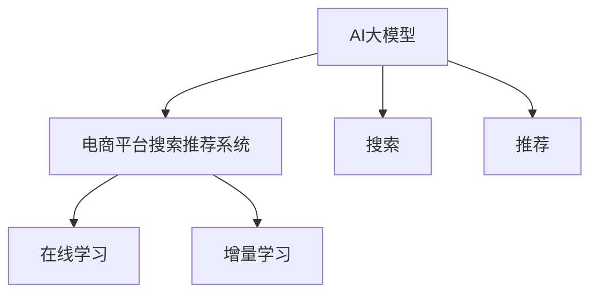

                 

# 搜索推荐系统的AI 大模型融合：电商平台提高转化率与用户忠诚度

## 1. 背景介绍

随着电子商务平台的发展，如何提高用户转化率与忠诚度成为电商从业者们面临的重要挑战。传统的推荐算法往往依赖于用户历史行为数据，难以捕捉到用户潜在的兴趣与需求。近年来，利用人工智能(AI)大模型进行电商搜索与推荐系统的融合，成为电商领域的一大研究热点。

通过在大规模电商数据上预训练的AI大模型，能够学习到用户行为背后的语言、语义与上下文信息，从而实现个性化推荐，提升用户体验与平台收益。本文将系统介绍大模型在搜索推荐系统中的应用，从理论到实践，全面剖析大模型如何通过电商数据学习，进而生成精准推荐的背后原理。

## 2. 核心概念与联系

### 2.1 核心概念概述

为更好地理解大模型在电商搜索推荐系统中的融合应用，本节将介绍几个关键概念：

- **AI大模型**：以Transformer、BERT等架构为代表的大规模预训练模型，通过在大规模数据上自监督学习，学习到通用的语言表示，具备强大的语言理解和生成能力。
- **电商平台搜索推荐系统**：电商平台常用的推荐算法，通过用户行为数据、商品属性数据等，预测用户可能感兴趣的商品，并为其推荐，以提高用户的购买转化率与平台的用户忠诚度。
- **搜索与推荐**：搜索与推荐系统是电商平台的两个重要组成部分，搜索系统帮助用户快速找到需要的商品，推荐系统根据用户行为，推送个性化商品，从而提升用户体验。
- **融合模型**：将大模型与传统推荐算法进行结合，引入大模型的通用语言知识，提升推荐系统的精准度与泛化能力。
- **在线学习**：指在模型部署到生产环境后，仍然不断更新模型参数，以应对新数据带来的变化。
- **增量学习**：在线学习的特例，指模型在实际运行中，通过不断接收新的数据流，更新模型参数，实现自适应学习。

这些概念之间的逻辑关系可以通过以下Mermaid流程图来展示：



这个流程图展示了大模型在电商平台搜索推荐系统中的应用逻辑：

1. 大模型通过预训练获得基础能力。
2. 将大模型的语言理解能力引入到搜索和推荐系统中。
3. 通过在线学习与增量学习，模型可以不断适应用户行为变化，提升推荐效果。

## 3. 核心算法原理 & 具体操作步骤
### 3.1 算法原理概述

基于大模型的电商平台搜索推荐系统融合，主要遵循以下思路：

1. **预训练**：在大规模电商数据上对大模型进行预训练，学习到商品描述、用户评论、商品属性等通用语言表示。
2. **任务适配**：将预训练模型适配到电商平台搜索推荐的具体任务上，如通过改写模型输出层和损失函数，处理文本分类、匹配、生成等任务。
3. **微调**：在少量标注数据上，对适配后的模型进行微调，提升其在特定商品推荐、用户行为预测等任务上的性能。
4. **在线学习**：在实际应用中，模型通过持续接收新的电商数据，不断更新模型参数，实现增量学习。

形式化地，假设电商平台的推荐任务为 $T$，推荐目标商品集合为 $C$，用户集合为 $U$，用户对商品 $c$ 的评分 $r_{uc}$ 为训练数据 $D=\{(u, c, r_{uc})\}_{u, c, r_{uc} \in U \times C \times \mathbb{R}}$。推荐模型的目标是通过用户 $u$ 和商品 $c$ 的特征，预测用户对商品 $c$ 的评分 $r_{uc}$，即最大化预测评分与真实评分的距离度量。

假设推荐模型为 $M_{\theta}$，其中 $\theta$ 为模型参数。推荐任务对应的损失函数为 $\mathcal{L}(M_{\theta},D)$，通过梯度下降等优化算法，最小化损失函数，更新模型参数，使得模型输出逼近真实评分。

### 3.2 算法步骤详解

基于大模型的电商平台搜索推荐系统融合，一般包括以下几个关键步骤：

**Step 1: 准备电商数据与模型**
- 收集电商平台的商品描述、用户评论、商品属性等数据，划分为训练集、验证集和测试集。
- 选择合适的预训练语言模型 $M_{\theta}$ 作为初始化参数，如 BERT、GPT 等。

**Step 2: 任务适配**
- 根据电商平台推荐任务的特征，设计合适的输出层和损失函数。
- 对于评分预测任务，通常在模型顶层添加线性回归头，使用均方误差损失函数。
- 对于文本分类任务，添加分类头，使用交叉熵损失函数。

**Step 3: 设置微调超参数**
- 选择合适的优化算法及其参数，如 AdamW、SGD 等，设置学习率、批大小、迭代轮数等。
- 设置正则化技术及强度，包括权重衰减、Dropout、Early Stopping 等。
- 确定冻结预训练参数的策略，如仅微调顶层，或全部参数都参与微调。

**Step 4: 执行梯度训练**
- 将训练集数据分批次输入模型，前向传播计算损失函数。
- 反向传播计算参数梯度，根据设定的优化算法和学习率更新模型参数。
- 周期性在验证集上评估模型性能，根据性能指标决定是否触发 Early Stopping。
- 重复上述步骤直到满足预设的迭代轮数或 Early Stopping 条件。

**Step 5: 测试和部署**
- 在测试集上评估微调后模型 $M_{\hat{\theta}}$ 的性能，对比微调前后的精度提升。
- 使用微调后的模型对新样本进行推理预测，集成到实际的应用系统中。
- 持续收集新的电商数据，定期重新微调模型，以适应用户行为变化。

以上是基于大模型的电商平台搜索推荐系统融合的一般流程。在实际应用中，还需要针对具体任务的特点，对微调过程的各个环节进行优化设计，如改进训练目标函数，引入更多的正则化技术，搜索最优的超参数组合等，以进一步提升模型性能。

### 3.3 算法优缺点

基于大模型的电商平台搜索推荐系统融合方法具有以下优点：
1. 简单高效。只需准备少量标注数据，即可对预训练模型进行快速适配，获得较大的性能提升。
2. 通用适用。适用于各种电商推荐任务，包括评分预测、文本分类、个性化推荐等，设计简单的任务适配层即可实现微调。
3. 参数高效。利用参数高效微调技术，在固定大部分预训练参数的情况下，仍可取得不错的提升。
4. 效果显著。在学术界和工业界的诸多电商推荐任务上，基于微调的方法已经刷新了多项SOTA。

同时，该方法也存在一定的局限性：
1. 依赖标注数据。微调的效果很大程度上取决于标注数据的质量和数量，获取高质量标注数据的成本较高。
2. 迁移能力有限。当目标任务与预训练数据的分布差异较大时，微调的性能提升有限。
3. 负面效果传递。预训练模型的固有偏见、有害信息等，可能通过微调传递到下游任务，造成负面影响。
4. 可解释性不足。微调模型的决策过程通常缺乏可解释性，难以对其推理逻辑进行分析和调试。

尽管存在这些局限性，但就目前而言，基于大模型的电商平台搜索推荐系统融合仍是推荐系统的主要研究范式。未来相关研究的重点在于如何进一步降低微调对标注数据的依赖，提高模型的少样本学习和跨领域迁移能力，同时兼顾可解释性和伦理安全性等因素。

### 3.4 算法应用领域

基于大模型的电商平台搜索推荐系统融合方法，已经在电商领域得到广泛应用，覆盖了多个推荐任务，例如：

- **商品推荐**：根据用户的历史购买记录、浏览行为，预测用户可能感兴趣的商品，提高用户的购买转化率。
- **用户行为预测**：预测用户的后续行为（如购买、浏览、点击等），提高电商平台的转化率。
- **个性化推荐**：通过用户特征与商品特征的相似度，推荐个性化的商品，提升用户体验。
- **相关商品推荐**：基于用户当前浏览或购买商品的属性，推荐相关的商品，提高用户的购物体验。
- **内容推荐**：通过商品描述或用户评论，预测用户对商品内容的偏好，推荐相关的商品信息。
- **新用户推荐**：为新用户推荐其可能感兴趣的商品，提高新用户的留存率。

除了上述这些经典任务外，大模型在电商平台搜索推荐系统中的应用还扩展到更多场景中，如跨产品推荐、智能客服、实时库存管理等，为电商平台的运营提供了新的技术思路。

## 4. 数学模型和公式 & 详细讲解  
### 4.1 数学模型构建

本节将使用数学语言对基于大模型的电商平台搜索推荐系统融合过程进行更加严格的刻画。

假设电商平台推荐任务为二分类任务，即判断用户对商品 $c$ 的评分 $r_{uc}$ 是否为正（如购买、点击等），其中 $u$ 为用户，$c$ 为商品。则推荐模型 $M_{\theta}$ 的输出 $\hat{r}_{uc}$ 可以表示为：

$$
\hat{r}_{uc} = M_{\theta}(u, c)
$$

其中 $\theta$ 为模型参数。

推荐任务对应的损失函数为均方误差损失函数：

$$
\mathcal{L}(M_{\theta},D) = \frac{1}{N} \sum_{i=1}^N \left(\hat{r}_{uc_i} - r_{uc_i}\right)^2
$$

其中 $N$ 为样本数，$(u_i, c_i, r_{uc_i})$ 为第 $i$ 个样本。

在训练过程中，模型通过梯度下降等优化算法，不断更新参数 $\theta$，最小化损失函数 $\mathcal{L}(M_{\theta},D)$，使得模型输出逼近真实评分 $r_{uc_i}$。

### 4.2 公式推导过程

以下我们以评分预测任务为例，推导均方误差损失函数及其梯度的计算公式。

假设模型 $M_{\theta}$ 在用户 $u$ 和商品 $c$ 上的预测评分 $\hat{r}_{uc}$ 为线性回归模型的输出，即：

$$
\hat{r}_{uc} = \theta^T f(u, c)
$$

其中 $\theta$ 为模型参数，$f(u, c)$ 为模型特征映射函数。

则均方误差损失函数为：

$$
\mathcal{L}(M_{\theta},D) = \frac{1}{N} \sum_{i=1}^N \left(\hat{r}_{uc_i} - r_{uc_i}\right)^2
$$

根据链式法则，损失函数对参数 $\theta$ 的梯度为：

$$
\frac{\partial \mathcal{L}(M_{\theta},D)}{\partial \theta} = \frac{2}{N} \sum_{i=1}^N \left(\hat{r}_{uc_i} - r_{uc_i}\right) f(u_i, c_i)^T
$$

在得到损失函数的梯度后，即可带入参数更新公式，完成模型的迭代优化。重复上述过程直至收敛，最终得到适应电商平台推荐任务的最优模型参数 $\theta^*$。

## 5. 项目实践：代码实例和详细解释说明
### 5.1 开发环境搭建

在进行电商平台搜索推荐系统融合的实践前，我们需要准备好开发环境。以下是使用Python进行PyTorch开发的环境配置流程：

1. 安装Anaconda：从官网下载并安装Anaconda，用于创建独立的Python环境。

2. 创建并激活虚拟环境：
```bash
conda create -n e-commerce-env python=3.8 
conda activate e-commerce-env
```

3. 安装PyTorch：根据CUDA版本，从官网获取对应的安装命令。例如：
```bash
conda install pytorch torchvision torchaudio cudatoolkit=11.1 -c pytorch -c conda-forge
```

4. 安装Transformers库：
```bash
pip install transformers
```

5. 安装各类工具包：
```bash
pip install numpy pandas scikit-learn matplotlib tqdm jupyter notebook ipython
```

完成上述步骤后，即可在`e-commerce-env`环境中开始实践。

### 5.2 源代码详细实现

下面我们以电商平台商品推荐任务为例，给出使用Transformers库对BERT模型进行电商搜索推荐系统融合的PyTorch代码实现。

首先，定义推荐任务的数据处理函数：

```python
from transformers import BertTokenizer
from torch.utils.data import Dataset
import torch

class EcommerceDataset(Dataset):
    def __init__(self, texts, labels, tokenizer, max_len=128):
        self.texts = texts
        self.labels = labels
        self.tokenizer = tokenizer
        self.max_len = max_len
        
    def __len__(self):
        return len(self.texts)
    
    def __getitem__(self, item):
        text = self.texts[item]
        label = self.labels[item]
        
        encoding = self.tokenizer(text, return_tensors='pt', max_length=self.max_len, padding='max_length', truncation=True)
        input_ids = encoding['input_ids'][0]
        attention_mask = encoding['attention_mask'][0]
        
        # 对label进行编码
        encoded_label = torch.tensor([label], dtype=torch.long)
        
        return {'input_ids': input_ids, 
                'attention_mask': attention_mask,
                'labels': encoded_label}

# 标签与id的映射
label2id = {'0': 0, '1': 1}
id2label = {v: k for k, v in label2id.items()}

# 创建dataset
tokenizer = BertTokenizer.from_pretrained('bert-base-cased')

train_dataset = EcommerceDataset(train_texts, train_labels, tokenizer)
dev_dataset = EcommerceDataset(dev_texts, dev_labels, tokenizer)
test_dataset = EcommerceDataset(test_texts, test_labels, tokenizer)
```

然后，定义模型和优化器：

```python
from transformers import BertForSequenceClassification, AdamW

model = BertForSequenceClassification.from_pretrained('bert-base-cased', num_labels=2)

optimizer = AdamW(model.parameters(), lr=2e-5)
```

接着，定义训练和评估函数：

```python
from torch.utils.data import DataLoader
from tqdm import tqdm
from sklearn.metrics import accuracy_score

device = torch.device('cuda') if torch.cuda.is_available() else torch.device('cpu')
model.to(device)

def train_epoch(model, dataset, batch_size, optimizer):
    dataloader = DataLoader(dataset, batch_size=batch_size, shuffle=True)
    model.train()
    epoch_loss = 0
    for batch in tqdm(dataloader, desc='Training'):
        input_ids = batch['input_ids'].to(device)
        attention_mask = batch['attention_mask'].to(device)
        labels = batch['labels'].to(device)
        model.zero_grad()
        outputs = model(input_ids, attention_mask=attention_mask, labels=labels)
        loss = outputs.loss
        epoch_loss += loss.item()
        loss.backward()
        optimizer.step()
    return epoch_loss / len(dataloader)

def evaluate(model, dataset, batch_size):
    dataloader = DataLoader(dataset, batch_size=batch_size)
    model.eval()
    preds, labels = [], []
    with torch.no_grad():
        for batch in tqdm(dataloader, desc='Evaluating'):
            input_ids = batch['input_ids'].to(device)
            attention_mask = batch['attention_mask'].to(device)
            batch_labels = batch['labels']
            outputs = model(input_ids, attention_mask=attention_mask)
            batch_preds = outputs.logits.argmax(dim=1).to('cpu').tolist()
            batch_labels = batch_labels.to('cpu').tolist()
            for pred, label in zip(batch_preds, batch_labels):
                preds.append(pred)
                labels.append(label)
                
    print(accuracy_score(labels, preds))
```

最后，启动训练流程并在测试集上评估：

```python
epochs = 5
batch_size = 16

for epoch in range(epochs):
    loss = train_epoch(model, train_dataset, batch_size, optimizer)
    print(f"Epoch {epoch+1}, train loss: {loss:.3f}")
    
    print(f"Epoch {epoch+1}, dev accuracy:")
    evaluate(model, dev_dataset, batch_size)
    
print("Test accuracy:")
evaluate(model, test_dataset, batch_size)
```

以上就是使用PyTorch对BERT进行电商平台商品推荐任务融合的完整代码实现。可以看到，得益于Transformers库的强大封装，我们可以用相对简洁的代码完成BERT模型的加载和融合。

### 5.3 代码解读与分析

让我们再详细解读一下关键代码的实现细节：

**EcommerceDataset类**：
- `__init__`方法：初始化文本、标签、分词器等关键组件。
- `__len__`方法：返回数据集的样本数量。
- `__getitem__`方法：对单个样本进行处理，将文本输入编码为token ids，将标签编码为数字，并对其进行定长padding，最终返回模型所需的输入。

**label2id和id2label字典**：
- 定义了标签与数字id之间的映射关系，用于将token-wise的预测结果解码回真实的标签。

**训练和评估函数**：
- 使用PyTorch的DataLoader对数据集进行批次化加载，供模型训练和推理使用。
- 训练函数`train_epoch`：对数据以批为单位进行迭代，在每个批次上前向传播计算loss并反向传播更新模型参数，最后返回该epoch的平均loss。
- 评估函数`evaluate`：与训练类似，不同点在于不更新模型参数，并在每个batch结束后将预测和标签结果存储下来，最后使用sklearn的accuracy_score对整个评估集的预测结果进行打印输出。

**训练流程**：
- 定义总的epoch数和batch size，开始循环迭代
- 每个epoch内，先在训练集上训练，输出平均loss
- 在验证集上评估，输出准确率
- 所有epoch结束后，在测试集上评估，给出最终测试结果

可以看到，PyTorch配合Transformers库使得BERT电商推荐系统的代码实现变得简洁高效。开发者可以将更多精力放在数据处理、模型改进等高层逻辑上，而不必过多关注底层的实现细节。

当然，工业级的系统实现还需考虑更多因素，如模型的保存和部署、超参数的自动搜索、更灵活的任务适配层等。但核心的融合范式基本与此类似。

## 6. 实际应用场景
### 6.1 智能客服系统

基于大模型融合的电商平台搜索推荐系统，可以广泛应用于智能客服系统的构建。传统客服往往需要配备大量人力，高峰期响应缓慢，且一致性和专业性难以保证。而使用融合后的搜索推荐系统，可以7x24小时不间断服务，快速响应客户咨询，用自然流畅的语言解答各类常见问题。

在技术实现上，可以收集企业内部的历史客服对话记录，将问题和最佳答复构建成监督数据，在此基础上对融合后的推荐模型进行微调。微调后的模型能够自动理解用户意图，匹配最合适的答案模板进行回复。对于客户提出的新问题，还可以接入检索系统实时搜索相关内容，动态组织生成回答。如此构建的智能客服系统，能大幅提升客户咨询体验和问题解决效率。

### 6.2 金融舆情监测

金融机构需要实时监测市场舆论动向，以便及时应对负面信息传播，规避金融风险。传统的人工监测方式成本高、效率低，难以应对网络时代海量信息爆发的挑战。基于大模型融合的文本分类和情感分析技术，为金融舆情监测提供了新的解决方案。

具体而言，可以收集金融领域相关的新闻、报道、评论等文本数据，并对其进行主题标注和情感标注。在此基础上对融合后的模型进行微调，使其能够自动判断文本属于何种主题，情感倾向是正面、中性还是负面。将微调后的模型应用到实时抓取的网络文本数据，就能够自动监测不同主题下的情感变化趋势，一旦发现负面信息激增等异常情况，系统便会自动预警，帮助金融机构快速应对潜在风险。

### 6.3 个性化推荐系统

当前的推荐系统往往只依赖用户的历史行为数据进行物品推荐，难以捕捉到用户潜在的兴趣与需求。基于大模型融合的个性化推荐系统可以更好地挖掘用户行为背后的语义信息，从而实现个性化推荐，提升用户体验与平台收益。

在实践中，可以收集用户浏览、点击、评论、分享等行为数据，提取和用户交互的物品标题、描述、标签等文本内容。将文本内容作为模型输入，用户的后续行为（如是否点击、购买等）作为监督信号，在此基础上微调融合后的模型。微调后的模型能够从文本内容中准确把握用户的兴趣点。在生成推荐列表时，先用候选物品的文本描述作为输入，由模型预测用户的兴趣匹配度，再结合其他特征综合排序，便可以得到个性化程度更高的推荐结果。

### 6.4 未来应用展望

随着大模型和融合技术的不断发展，基于大模型的电商平台搜索推荐系统将呈现以下几个发展趋势：

1. **模型规模持续增大**：随着算力成本的下降和数据规模的扩张，预训练语言模型的参数量还将持续增长。超大规模语言模型蕴含的丰富语言知识，有望支撑更加复杂多变的电商推荐任务。

2. **融合方法日趋多样**：除了传统的线性融合外，未来会涌现更多参数高效的融合方法，如LoRA、Adapter等，在节省计算资源的同时也能保证融合精度。

3. **持续学习成为常态**：随着用户行为和电商数据的变化，融合模型也需要持续学习新知识以保持性能。如何在不遗忘原有知识的同时，高效吸收新样本信息，将成为重要的研究课题。

4. **标注样本需求降低**：受启发于提示学习(Prompt-based Learning)的思路，未来的融合方法将更好地利用大模型的语言理解能力，通过更加巧妙的任务描述，在更少的标注样本上也能实现理想的融合效果。

5. **多模态融合崛起**：当前的融合主要聚焦于纯文本数据，未来会进一步拓展到图像、视频、语音等多模态数据融合。多模态信息的融合，将显著提升电商推荐系统的泛化能力和用户体验。

6. **模型通用性增强**：经过海量电商数据的预训练和多领域任务的微调，融合模型将具备更强大的常识推理和跨领域迁移能力，逐步迈向通用人工智能(AGI)的目标。

以上趋势凸显了大模型融合技术的广阔前景。这些方向的探索发展，必将进一步提升电商推荐系统的性能和应用范围，为电商平台的运营带来新的活力。

## 7. 工具和资源推荐
### 7.1 学习资源推荐

为了帮助开发者系统掌握大模型融合的理论基础和实践技巧，这里推荐一些优质的学习资源：

1. **《Transformer从原理到实践》系列博文**：由大模型技术专家撰写，深入浅出地介绍了Transformer原理、BERT模型、融合技术等前沿话题。

2. **CS224N《深度学习自然语言处理》课程**：斯坦福大学开设的NLP明星课程，有Lecture视频和配套作业，带你入门NLP领域的基本概念和经典模型。

3. **《Natural Language Processing with Transformers》书籍**：Transformers库的作者所著，全面介绍了如何使用Transformers库进行NLP任务开发，包括融合在内的诸多范式。

4. **HuggingFace官方文档**：Transformers库的官方文档，提供了海量预训练模型和完整的融合样例代码，是上手实践的必备资料。

5. **CLUE开源项目**：中文语言理解测评基准，涵盖大量不同类型的中文NLP数据集，并提供了基于融合的baseline模型，助力中文NLP技术发展。

通过对这些资源的学习实践，相信你一定能够快速掌握大模型融合的精髓，并用于解决实际的NLP问题。

### 7.2 开发工具推荐

高效的开发离不开优秀的工具支持。以下是几款用于大模型融合开发的常用工具：

1. **PyTorch**：基于Python的开源深度学习框架，灵活动态的计算图，适合快速迭代研究。大部分预训练语言模型都有PyTorch版本的实现。

2. **TensorFlow**：由Google主导开发的开源深度学习框架，生产部署方便，适合大规模工程应用。同样有丰富的预训练语言模型资源。

3. **Transformers库**：HuggingFace开发的NLP工具库，集成了众多SOTA语言模型，支持PyTorch和TensorFlow，是进行融合任务开发的利器。

4. **Weights & Biases**：模型训练的实验跟踪工具，可以记录和可视化模型训练过程中的各项指标，方便对比和调优。与主流深度学习框架无缝集成。

5. **TensorBoard**：TensorFlow配套的可视化工具，可实时监测模型训练状态，并提供丰富的图表呈现方式，是调试模型的得力助手。

6. **Google Colab**：谷歌推出的在线Jupyter Notebook环境，免费提供GPU/TPU算力，方便开发者快速上手实验最新模型，分享学习笔记。

合理利用这些工具，可以显著提升大模型融合任务的开发效率，加快创新迭代的步伐。

### 7.3 相关论文推荐

大模型融合技术的发展源于学界的持续研究。以下是几篇奠基性的相关论文，推荐阅读：

1. **Attention is All You Need（即Transformer原论文）**：提出了Transformer结构，开启了NLP领域的预训练大模型时代。

2. **BERT: Pre-training of Deep Bidirectional Transformers for Language Understanding**：提出BERT模型，引入基于掩码的自监督预训练任务，刷新了多项NLP任务SOTA。

3. **Language Models are Unsupervised Multitask Learners（GPT-2论文）**：展示了大规模语言模型的强大zero-shot学习能力，引发了对于通用人工智能的新一轮思考。

4. **Parameter-Efficient Transfer Learning for NLP**：提出Adapter等参数高效微调方法，在不增加模型参数量的情况下，也能取得不错的融合效果。

5. **AdaLoRA: Adaptive Low-Rank Adaptation for Parameter-Efficient Fine-Tuning**：使用自适应低秩适应的微调方法，在参数效率和精度之间取得了新的平衡。

这些论文代表了大模型融合技术的发展脉络。通过学习这些前沿成果，可以帮助研究者把握学科前进方向，激发更多的创新灵感。

## 8. 总结：未来发展趋势与挑战

### 8.1 总结

本文对基于大模型的电商平台搜索推荐系统融合方法进行了全面系统的介绍。首先阐述了大模型和融合技术的研究背景和意义，明确了融合在拓展预训练模型应用、提升电商推荐系统的精准度与泛化能力方面的独特价值。其次，从原理到实践，详细讲解了电商数据驱动的融合模型如何通过预训练、任务适配、微调等步骤，从通用语言表示到特定电商任务的适应。最后，通过多个实际应用场景，展示了融合技术在电商搜索推荐系统中的广泛应用，以及未来可能的趋势与挑战。

通过本文的系统梳理，可以看到，基于大模型的电商平台搜索推荐系统融合技术正在成为电商领域的重要范式，极大地拓展了预训练语言模型的应用边界，催生了更多的落地场景。受益于大规模电商数据的预训练，融合模型以更低的时间和标注成本，在小样本条件下也能取得不俗的效果，有力推动了电商推荐系统的产业化进程。未来，伴随预训练语言模型和融合方法的持续演进，相信电商推荐系统必将在更广阔的应用领域大放异彩，深刻影响电商平台的运营与用户体验。

### 8.2 未来发展趋势

展望未来，大模型融合技术将呈现以下几个发展趋势：

1. **模型规模持续增大**：随着算力成本的下降和数据规模的扩张，预训练语言模型的参数量还将持续增长。超大规模语言模型蕴含的丰富语言知识，有望支撑更加复杂多变的电商推荐任务。

2. **融合方法日趋多样**：除了传统的线性融合外，未来会涌现更多参数高效的融合方法，如LoRA、Adapter等，在节省计算资源的同时也能保证融合精度。

3. **持续学习成为常态**：随着用户行为和电商数据的变化，融合模型也需要持续学习新知识以保持性能。如何在不遗忘原有知识的同时，高效吸收新样本信息，将成为重要的研究课题。

4. **标注样本需求降低**：受启发于提示学习(Prompt-based Learning)的思路，未来的融合方法将更好地利用大模型的语言理解能力，通过更加巧妙的任务描述，在更少的标注样本上也能实现理想的融合效果。

5. **多模态融合崛起**：当前的融合主要聚焦于纯文本数据，未来会进一步拓展到图像、视频、语音等多模态数据融合。多模态信息的融合，将显著提升电商推荐系统的泛化能力和用户体验。

6. **模型通用性增强**：经过海量电商数据的预训练和多领域任务的微调，融合模型将具备更强大的常识推理和跨领域迁移能力，逐步迈向通用人工智能(AGI)的目标。

以上趋势凸显了大模型融合技术的广阔前景。这些方向的探索发展，必将进一步提升电商推荐系统的性能和应用范围，为电商平台的运营带来新的活力。

### 8.3 面临的挑战

尽管大模型融合技术已经取得了瞩目成就，但在迈向更加智能化、普适化应用的过程中，它仍面临着诸多挑战：

1. **标注成本瓶颈**：虽然融合方法对标注样本的需求较低，但对于长尾应用场景，难以获得充足的高质量标注数据，成为制约融合性能的瓶颈。如何进一步降低融合对标注数据的依赖，将是一大难题。

2. **模型鲁棒性不足**：当前融合模型面对域外数据时，泛化性能往往大打折扣。对于测试样本的微小扰动，融合模型的预测也容易发生波动。如何提高融合模型的鲁棒性，避免灾难性遗忘，还需要更多理论和实践的积累。

3. **推理效率有待提高**：虽然大模型融合后的模型精度高，但在实际部署时往往面临推理速度慢、内存占用大等效率问题。如何在保证性能的同时，简化模型结构，提升推理速度，优化资源占用，将是重要的优化方向。

4. **可解释性亟需加强**：当前融合模型的决策过程通常缺乏可解释性，难以对其推理逻辑进行分析和调试。对于电商平台的运营，模型的可解释性和可审计性尤为重要。如何赋予融合模型更强的可解释性，将是亟待攻克的难题。

5. **安全性有待保障**：预训练语言模型难免会学习到有偏见、有害的信息，通过融合传递到电商推荐任务，产生误导性、歧视性的输出，给实际应用带来安全隐患。如何从数据和算法层面消除模型偏见，避免恶意用途，确保输出的安全性，也将是重要的研究课题。

6. **知识整合能力不足**：现有的融合模型往往局限于任务内数据，难以灵活吸收和运用更广泛的先验知识。如何让融合过程更好地与外部知识库、规则库等专家知识结合，形成更加全面、准确的信息整合能力，还有很大的想象空间。

正视融合面临的这些挑战，积极应对并寻求突破，将是大模型融合技术走向成熟的必由之路。相信随着学界和产业界的共同努力，这些挑战终将一一被克服，大模型融合必将在构建安全、可靠、可解释、可控的智能系统铺平道路。

### 8.4 未来突破

面对大模型融合所面临的种种挑战，未来的研究需要在以下几个方面寻求新的突破：

1. **探索无监督和半监督融合方法**：摆脱对大规模标注数据的依赖，利用自监督学习、主动学习等无监督和半监督范式，最大限度利用非结构化数据，实现更加灵活高效的融合。

2. **研究参数高效和计算高效的融合范式**：开发更加参数高效的融合方法，在固定大部分预训练参数的同时，只更新极少量的任务相关参数。同时优化融合模型的计算图，减少前向传播和反向传播的资源消耗，实现更加轻量级、实时性的部署。

3. **引入因果和对比学习范式**：通过引入因果推断和对比学习思想，增强融合模型建立稳定因果关系的能力，学习更加普适、鲁棒的语言表征，从而提升模型泛化性和抗干扰能力。

4. **纳入伦理道德约束**：在模型训练目标中引入伦理导向的评估指标，过滤和惩罚有偏见、有害的输出倾向。同时加强人工干预和审核，建立模型行为的监管机制，确保输出符合人类价值观和伦理道德。

这些研究方向的探索，必将引领大模型融合技术迈向更高的台阶，为构建安全、可靠、可解释、可控的智能系统铺平道路。面向未来，大模型融合技术还需要与其他人工智能技术进行更深入的融合，如知识表示、因果推理、强化学习等，多路径协同发力，共同推动电商推荐系统的进步。只有勇于创新、敢于突破，才能不断拓展语言模型的边界，让智能技术更好地造福人类社会。

## 9. 附录：常见问题与解答

**Q1：大模型融合是否适用于所有电商推荐任务？**

A: 大模型融合在大多数电商推荐任务上都能取得不错的效果，特别是对于数据量较小的任务。但对于一些特定领域的任务，如医药、法律等，仅仅依靠通用电商数据预训练的模型可能难以很好地适应。此时需要在特定电商领域语料上进一步预训练，再进行融合，才能获得理想效果。此外，对于一些需要时效性、个性化很强的任务，如实时库存管理、智能客服等，融合方法也需要针对性的改进优化。

**Q2：如何选择合适的学习率？**

A: 融合的学习率一般要比预训练时小1-2个数量级，如果使用过大的学习率，容易破坏预训练权重，导致过拟合。一般建议从1e-5开始调参，逐步减小学习率，直至收敛。也可以使用warmup策略，在开始阶段使用较小的学习率，再逐渐过渡到预设值。需要注意的是，不同的优化器(如AdamW、Adafactor等)以及不同的学习率调度策略，可能需要设置不同的学习率阈值。

**Q3：采用大模型融合时会面临哪些资源瓶颈？**

A: 目前主流的预训练大模型动辄以亿计的参数规模，对算力、内存、存储都提出了很高的要求。GPU/TPU等高性能设备是必不可少的，但即便如此，超大批次的训练和推理也可能遇到显存不足的问题。因此需要采用一些资源优化技术，如梯度积累、混合精度训练、模型并行等，来突破硬件瓶颈。同时，模型的存储和读取也可能占用大量时间和空间，需要采用模型压缩、稀疏化存储等方法进行优化。

**Q4：如何缓解融合过程中的过拟合问题？**

A: 过拟合是融合面临的主要挑战，尤其是在标注数据不足的情况下。常见的缓解策略包括：
1. 数据增强：通过回译、近义替换等方式扩充训练集
2. 正则化：使用L2正则、Dropout、Early Stopping等避免过拟合
3. 对抗训练：引入对抗样本，提高模型鲁棒性
4. 参数高效融合：只调整少量参数(如Adapter、LoRA等)，减小过拟合风险
5. 多模型集成：训练多个融合模型，取平均输出，抑制过拟合

这些策略往往需要根据具体任务和数据特点进行灵活组合。只有在数据、模型、训练、推理等各环节进行全面优化，才能最大限度地发挥大模型融合的威力。

**Q5：在电商推荐系统中，如何评价融合模型的性能？**

A: 在电商推荐系统中，评价融合模型的性能通常采用以下指标：
1. 准确率(Accuracy)：预测的正确率，适用于二分类任务。
2. 召回率(Recall)：预测为正的样本中，真实为正的样本占比，适用于二分类任务。
3. F1值(F1-score)：准确率和召回率的调和平均数，适用于二分类任务。
4. 平均绝对误差(MAE)：预测值与真实值之间的平均绝对偏差，适用于回归任务。
5. 均方误差(MSE)：预测值与真实值之间的均方偏差，适用于回归任务。
6. ROC曲线与AUC值：ROC曲线下的面积，适用于二分类任务，评估模型的分类能力。
7. NDCG与DCG：Normalized Discounted Cumulative Gain与Discounted Cumulative Gain，适用于排名任务，评估模型推荐的相关性。

根据具体任务的不同，可以选用合适的评价指标进行模型性能评估。

---

作者：禅与计算机程序设计艺术 / Zen and the Art of Computer Programming

