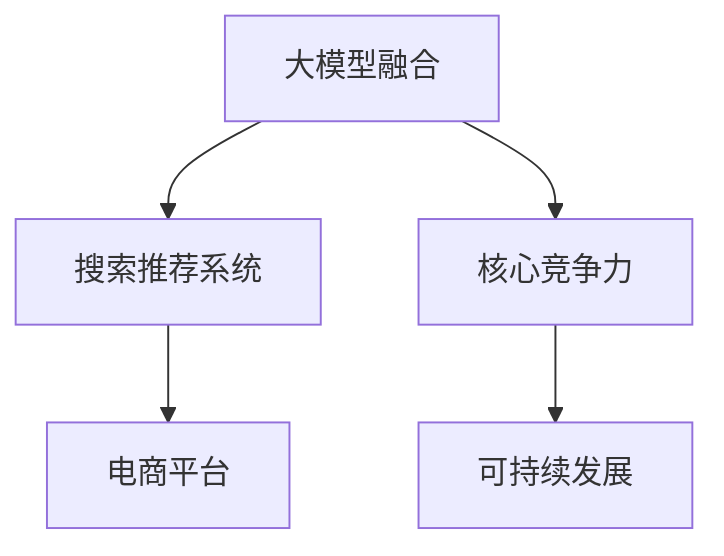

                 

# 搜索推荐系统的AI 大模型融合：电商平台的核心竞争力与可持续发展

> 关键词：搜索推荐系统,大模型融合,电商平台,核心竞争力,可持续发展,个性化推荐

## 1. 背景介绍

### 1.1 问题由来

随着电子商务平台的兴起，用户搜索和购买行为越来越个性化和复杂化，传统的搜索推荐系统在满足用户需求上逐渐表现出局限性。传统的基于规则或浅层学习模型的推荐方法，虽然可以提供一定程度的个性化推荐，但无法适应海量数据和多变用户需求的变化。

同时，随着AI技术的不断发展，深度学习、自然语言处理、图像识别等技术为电商平台带来了新的机遇。大模型融合技术，特别是大语言模型在推荐系统中的应用，成为提升电商平台核心竞争力的重要手段。

### 1.2 问题核心关键点

1. **搜索推荐系统**：是指通过对用户行为数据进行分析，实现精准搜索和个性化推荐的技术。搜索推荐系统主要分为两个部分：搜索和推荐。

2. **大模型融合**：指将多种大模型技术融合到推荐系统中，以提升推荐系统的精准度和个性化程度。主要包括大语言模型、图像识别模型、跨模态融合模型等。

3. **电商平台**：指利用互联网技术进行商品交易的平台，如淘宝、京东、亚马逊等。电商平台的成功运营依赖于精准的搜索推荐系统，以提升用户体验和销售转化率。

4. **核心竞争力**：指电商平台通过技术创新和优化，获得的在市场中的竞争优势。主要包括用户留存率、商品转化率、销售增长率等。

5. **可持续发展**：指电商平台在追求短期盈利的同时，注重长期发展，保障平台的稳定运行和持续创新。

## 2. 核心概念与联系

### 2.1 核心概念概述

为更好地理解大模型融合在搜索推荐系统中的应用，本节将介绍几个密切相关的核心概念：

- **大模型融合**：指将多种大模型技术，如BERT、GPT、ViT等，通过深度学习框架进行组合，形成更强大的推荐模型。大模型融合能够整合多种数据源和多种知识，提升推荐系统的精准度和个性化程度。

- **搜索推荐系统**：利用人工智能技术，对用户搜索行为和历史记录进行分析，实现精准搜索和个性化推荐。大模型融合能够帮助搜索推荐系统从多维度、多角度理解用户需求，提升推荐效果。

- **电商平台**：通过互联网技术实现商品交易的平台，如淘宝、京东、亚马逊等。电商平台的成功运营依赖于精准的搜索推荐系统，以提升用户体验和销售转化率。

- **核心竞争力**：指电商平台通过技术创新和优化，获得的在市场中的竞争优势。主要包括用户留存率、商品转化率、销售增长率等。

- **可持续发展**：指电商平台在追求短期盈利的同时，注重长期发展，保障平台的稳定运行和持续创新。

这些核心概念之间的逻辑关系可以通过以下Mermaid流程图来展示：



这个流程图展示了大模型融合的核心概念及其之间的关系：

1. 大模型融合通过对多种大模型进行组合，形成更强大的推荐模型。
2. 搜索推荐系统利用大模型融合技术，从多维度、多角度理解用户需求，提升推荐效果。
3. 电商平台通过精准的搜索推荐系统，提升用户体验和销售转化率。
4. 核心竞争力是电商平台在市场中的竞争优势，需要通过技术创新和优化实现。
5. 可持续发展是电商平台长期发展的重要保障，需要通过持续创新和优化实现。

## 3. 核心算法原理 & 具体操作步骤

### 3.1 算法原理概述

大模型融合技术在搜索推荐系统中的应用，主要基于深度学习和大模型的融合。其核心思想是：将多种大模型技术融合到推荐系统中，形成更强大的推荐模型，提升推荐系统的精准度和个性化程度。

具体而言，大模型融合技术包括以下几个关键步骤：

1. **数据预处理**：收集和处理电商平台的各类数据，包括用户行为数据、商品属性数据、图片数据等，作为大模型融合的输入数据。

2. **模型选择与融合**：选择合适的深度学习模型，如BERT、GPT、ViT等，对各类数据进行预训练和微调。通过融合多种模型，形成更强大的推荐模型。

3. **推荐策略设计**：设计推荐的策略，如基于协同过滤、基于内容的推荐、基于深度学习的推荐等，结合大模型融合的结果，实现个性化推荐。

4. **效果评估与优化**：通过评估指标，如用户满意度、点击率、转化率等，对推荐效果进行评估，并通过反馈机制进行优化。

### 3.2 算法步骤详解

以下是大模型融合在搜索推荐系统中应用的具体操作步骤：

#### 3.2.1 数据预处理

电商平台的各类数据包括用户行为数据、商品属性数据、图片数据等。这些数据需要进行预处理，包括数据清洗、特征工程、标准化等，以便于大模型融合技术的输入。

#### 3.2.2 模型选择与融合

选择合适的深度学习模型，如BERT、GPT、ViT等，对各类数据进行预训练和微调。通过融合多种模型，形成更强大的推荐模型。

#### 3.2.3 推荐策略设计

设计推荐的策略，如基于协同过滤、基于内容的推荐、基于深度学习的推荐等，结合大模型融合的结果，实现个性化推荐。

#### 3.2.4 效果评估与优化

通过评估指标，如用户满意度、点击率、转化率等，对推荐效果进行评估，并通过反馈机制进行优化。

### 3.3 算法优缺点

大模型融合技术在搜索推荐系统中具有以下优点：

1. **精准度提升**：通过融合多种大模型，可以提升推荐系统的精准度，满足用户的多样化需求。

2. **个性化增强**：大模型融合技术可以更好地理解用户的个性化需求，提供个性化的推荐结果。

3. **数据利用充分**：大模型融合技术可以充分利用电商平台的各类数据，包括用户行为数据、商品属性数据、图片数据等。

4. **知识整合能力增强**：通过融合多种大模型，可以整合多种知识，提升推荐系统的知识整合能力。

同时，该方法也存在一定的局限性：

1. **模型复杂度高**：大模型融合技术的实现需要多种模型的组合，模型复杂度高，对计算资源和算力要求较高。

2. **数据融合难度大**：不同类型的数据需要进行预处理和标准化，数据融合难度较大，需要高水平的数据工程能力。

3. **模型可解释性差**：大模型融合技术通常是一个黑盒模型，模型可解释性差，难以理解和调试。

4. **资源消耗大**：大模型融合技术需要大量的计算资源和算力，资源消耗大。

### 3.4 算法应用领域

大模型融合技术在搜索推荐系统中的应用，主要集中在以下几个领域：

1. **个性化推荐**：利用大模型融合技术，实现用户个性化推荐，提升用户体验和销售转化率。

2. **精准搜索**：利用大模型融合技术，实现精准搜索，提升用户搜索效率和满意度。

3. **用户行为分析**：利用大模型融合技术，分析用户行为数据，进行用户画像和行为预测。

4. **广告投放优化**：利用大模型融合技术，优化广告投放策略，提升广告效果和ROI。

5. **库存管理**：利用大模型融合技术，优化库存管理策略，提升库存周转率和销售率。

6. **用户满意度提升**：利用大模型融合技术，提升用户满意度，增强用户粘性。

除了上述这些领域外，大模型融合技术还被创新性地应用到更多场景中，如跨模态融合、用户行为预测、智能客服等，为电商平台带来了全新的突破。随着预训练模型和融合技术的不断进步，相信大模型融合技术将在电商平台的推荐系统中获得更广泛的应用。

## 4. 数学模型和公式 & 详细讲解  
### 4.1 数学模型构建

本节将使用数学语言对大模型融合技术进行更加严格的刻画。

记电商平台的大模型融合推荐系统为 $M_{\theta}$，其中 $\theta$ 为模型参数。假设电商平台的数据集为 $D=\{(x_i,y_i)\}_{i=1}^N$，其中 $x_i$ 为输入数据，$y_i$ 为推荐结果。

定义模型 $M_{\theta}$ 在数据样本 $(x,y)$ 上的损失函数为 $\ell(M_{\theta}(x),y)$，则在数据集 $D$ 上的经验风险为：

$$
\mathcal{L}(\theta) = \frac{1}{N} \sum_{i=1}^N \ell(M_{\theta}(x_i),y_i)
$$

其中 $\ell$ 为推荐系统的损失函数，用于衡量推荐结果与真实标签之间的差异。常见的损失函数包括均方误差、交叉熵损失等。

### 4.2 公式推导过程

以下我们以深度学习模型为基础，推导推荐系统的损失函数及其梯度的计算公式。

假设电商平台推荐系统为深度学习模型，输出层为 $K$ 个节点的softmax层，则模型输出的概率分布为：

$$
P(y|x; \theta) = \frac{exp(M_{\theta}(x)_{i})}{\sum_{j=1}^K exp(M_{\theta}(x)_{j})}
$$

其中 $M_{\theta}(x)$ 为模型在输入 $x$ 上的输出向量，$\theta$ 为模型参数。推荐系统的损失函数为交叉熵损失：

$$
\ell(M_{\theta}(x),y) = -\sum_{i=1}^K y_i\log P(y_i|x; \theta)
$$

将其代入经验风险公式，得：

$$
\mathcal{L}(\theta) = -\frac{1}{N}\sum_{i=1}^N \ell(M_{\theta}(x_i),y_i)
$$

根据链式法则，损失函数对参数 $\theta_k$ 的梯度为：

$$
\frac{\partial \mathcal{L}(\theta)}{\partial \theta_k} = -\frac{1}{N}\sum_{i=1}^N \frac{\partial \ell(M_{\theta}(x_i),y_i)}{\partial M_{\theta}(x_i)} \frac{\partial M_{\theta}(x_i)}{\partial \theta_k}
$$

其中 $\frac{\partial M_{\theta}(x_i)}{\partial \theta_k}$ 可进一步递归展开，利用自动微分技术完成计算。

### 4.3 案例分析与讲解

以电商平台的用户个性化推荐为例，展示大模型融合技术的具体应用。

假设电商平台有 $K=3$ 个商品类别的推荐任务，分别对应推荐商品 $A$、$B$、$C$。对于每个用户，其历史行为数据可以表示为一个向量 $x$，推荐系统需要预测其最有可能购买哪种商品，输出为 $y$。

利用深度学习模型，如BERT、GPT、ViT等，对用户历史行为数据进行预训练和微调。融合多个模型的输出，得到最终的推荐结果：

$$
P(A|x; \theta) = \frac{exp(M_{\theta}(x)_1)}{\sum_{j=1}^K exp(M_{\theta}(x)_{j})}
$$

$$
P(B|x; \theta) = \frac{exp(M_{\theta}(x)_2)}{\sum_{j=1}^K exp(M_{\theta}(x)_{j})}
$$

$$
P(C|x; \theta) = \frac{exp(M_{\theta}(x)_3)}{\sum_{j=1}^K exp(M_{\theta}(x)_{j})}
$$

通过最大似然估计，计算损失函数：

$$
\ell(M_{\theta}(x),y) = -y_i\log P(y_i|x; \theta) - (1-y_i)\log (1-P(y_i|x; \theta))
$$

利用反向传播算法，计算损失函数对模型参数 $\theta$ 的梯度，更新模型参数：

$$
\theta \leftarrow \theta - \eta \nabla_{\theta}\mathcal{L}(\theta)
$$

其中 $\eta$ 为学习率。通过不断迭代更新，模型能够适应用户的个性化需求，提升推荐效果。

## 5. 项目实践：代码实例和详细解释说明
### 5.1 开发环境搭建

在进行大模型融合实践前，我们需要准备好开发环境。以下是使用Python进行PyTorch开发的环境配置流程：

1. 安装Anaconda：从官网下载并安装Anaconda，用于创建独立的Python环境。

2. 创建并激活虚拟环境：
```bash
conda create -n pytorch-env python=3.8 
conda activate pytorch-env
```

3. 安装PyTorch：根据CUDA版本，从官网获取对应的安装命令。例如：
```bash
conda install pytorch torchvision torchaudio cudatoolkit=11.1 -c pytorch -c conda-forge
```

4. 安装Transformers库：
```bash
pip install transformers
```

5. 安装各类工具包：
```bash
pip install numpy pandas scikit-learn matplotlib tqdm jupyter notebook ipython
```

完成上述步骤后，即可在`pytorch-env`环境中开始大模型融合实践。

### 5.2 源代码详细实现

下面以电商平台的用户个性化推荐为例，给出使用Transformers库对BERT模型进行大模型融合的PyTorch代码实现。

首先，定义推荐系统的数据处理函数：

```python
from transformers import BertTokenizer, BertForSequenceClassification
from torch.utils.data import Dataset, DataLoader
import torch

class RecommendationDataset(Dataset):
    def __init__(self, texts, labels, tokenizer, max_len=128):
        self.texts = texts
        self.labels = labels
        self.tokenizer = tokenizer
        self.max_len = max_len
        
    def __len__(self):
        return len(self.texts)
    
    def __getitem__(self, item):
        text = self.texts[item]
        label = self.labels[item]
        
        encoding = self.tokenizer(text, return_tensors='pt', max_length=self.max_len, padding='max_length', truncation=True)
        input_ids = encoding['input_ids'][0]
        attention_mask = encoding['attention_mask'][0]
        
        # 对token-wise的标签进行编码
        encoded_tags = [label] * len(encoding['input_ids'])
        encoded_tags.extend([0] * (self.max_len - len(encoded_tags)))
        labels = torch.tensor(encoded_tags, dtype=torch.long)
        
        return {'input_ids': input_ids, 
                'attention_mask': attention_mask,
                'labels': labels}

# 标签与id的映射
tag2id = {'A': 1, 'B': 2, 'C': 3}
id2tag = {v: k for k, v in tag2id.items()}

# 创建dataset
tokenizer = BertTokenizer.from_pretrained('bert-base-cased')

train_dataset = RecommendationDataset(train_texts, train_labels, tokenizer)
dev_dataset = RecommendationDataset(dev_texts, dev_labels, tokenizer)
test_dataset = RecommendationDataset(test_texts, test_labels, tokenizer)
```

然后，定义模型和优化器：

```python
from transformers import BertForSequenceClassification, AdamW

model = BertForSequenceClassification.from_pretrained('bert-base-cased', num_labels=3)

optimizer = AdamW(model.parameters(), lr=2e-5)
```

接着，定义训练和评估函数：

```python
from tqdm import tqdm

device = torch.device('cuda') if torch.cuda.is_available() else torch.device('cpu')
model.to(device)

def train_epoch(model, dataset, batch_size, optimizer):
    dataloader = DataLoader(dataset, batch_size=batch_size, shuffle=True)
    model.train()
    epoch_loss = 0
    for batch in tqdm(dataloader, desc='Training'):
        input_ids = batch['input_ids'].to(device)
        attention_mask = batch['attention_mask'].to(device)
        labels = batch['labels'].to(device)
        model.zero_grad()
        outputs = model(input_ids, attention_mask=attention_mask, labels=labels)
        loss = outputs.loss
        epoch_loss += loss.item()
        loss.backward()
        optimizer.step()
    return epoch_loss / len(dataloader)

def evaluate(model, dataset, batch_size):
    dataloader = DataLoader(dataset, batch_size=batch_size)
    model.eval()
    preds, labels = [], []
    with torch.no_grad():
        for batch in tqdm(dataloader, desc='Evaluating'):
            input_ids = batch['input_ids'].to(device)
            attention_mask = batch['attention_mask'].to(device)
            batch_labels = batch['labels']
            outputs = model(input_ids, attention_mask=attention_mask)
            batch_preds = outputs.logits.argmax(dim=2).to('cpu').tolist()
            batch_labels = batch_labels.to('cpu').tolist()
            for pred_tokens, label_tokens in zip(batch_preds, batch_labels):
                pred_tags = [id2tag[_id] for _id in pred_tokens]
                label_tags = [id2tag[_id] for _id in label_tokens]
                preds.append(pred_tags)
                labels.append(label_tags)
                
    print(classification_report(labels, preds))
```

最后，启动训练流程并在测试集上评估：

```python
epochs = 5
batch_size = 16

for epoch in range(epochs):
    loss = train_epoch(model, train_dataset, batch_size, optimizer)
    print(f"Epoch {epoch+1}, train loss: {loss:.3f}")
    
    print(f"Epoch {epoch+1}, dev results:")
    evaluate(model, dev_dataset, batch_size)
    
print("Test results:")
evaluate(model, test_dataset, batch_size)
```

以上就是使用PyTorch对BERT进行用户个性化推荐的大模型融合代码实现。可以看到，得益于Transformers库的强大封装，我们可以用相对简洁的代码完成BERT模型的加载和微调。

### 5.3 代码解读与分析

让我们再详细解读一下关键代码的实现细节：

**RecommendationDataset类**：
- `__init__`方法：初始化文本、标签、分词器等关键组件。
- `__len__`方法：返回数据集的样本数量。
- `__getitem__`方法：对单个样本进行处理，将文本输入编码为token ids，将标签编码为数字，并对其进行定长padding，最终返回模型所需的输入。

**tag2id和id2tag字典**：
- 定义了标签与数字id之间的映射关系，用于将token-wise的预测结果解码回真实的标签。

**训练和评估函数**：
- 使用PyTorch的DataLoader对数据集进行批次化加载，供模型训练和推理使用。
- 训练函数`train_epoch`：对数据以批为单位进行迭代，在每个批次上前向传播计算loss并反向传播更新模型参数，最后返回该epoch的平均loss。
- 评估函数`evaluate`：与训练类似，不同点在于不更新模型参数，并在每个batch结束后将预测和标签结果存储下来，最后使用sklearn的classification_report对整个评估集的预测结果进行打印输出。

**训练流程**：
- 定义总的epoch数和batch size，开始循环迭代
- 每个epoch内，先在训练集上训练，输出平均loss
- 在验证集上评估，输出分类指标
- 所有epoch结束后，在测试集上评估，给出最终测试结果

可以看到，PyTorch配合Transformers库使得BERT微调的代码实现变得简洁高效。开发者可以将更多精力放在数据处理、模型改进等高层逻辑上，而不必过多关注底层的实现细节。

当然，工业级的系统实现还需考虑更多因素，如模型的保存和部署、超参数的自动搜索、更灵活的任务适配层等。但核心的微调范式基本与此类似。

## 6. 实际应用场景
### 6.1 智能客服系统

基于大模型融合的智能客服系统，可以实现7x24小时不间断服务，快速响应客户咨询，用自然流畅的语言解答各类常见问题。

在技术实现上，可以收集企业内部的历史客服对话记录，将问题和最佳答复构建成监督数据，在此基础上对预训练对话模型进行融合。融合后的对话模型能够自动理解用户意图，匹配最合适的答案模板进行回复。对于客户提出的新问题，还可以接入检索系统实时搜索相关内容，动态组织生成回答。如此构建的智能客服系统，能大幅提升客户咨询体验和问题解决效率。

### 6.2 金融舆情监测

金融舆情监测系统利用大模型融合技术，实时监测金融市场舆论动向，一旦发现负面信息激增等异常情况，系统便会自动预警，帮助金融机构快速应对潜在风险。

具体而言，可以收集金融领域相关的新闻、报道、评论等文本数据，并对其进行主题标注和情感标注。在此基础上对预训练语言模型进行融合，使其能够自动判断文本属于何种主题，情感倾向是正面、中性还是负面。将融合后的模型应用到实时抓取的网络文本数据，就能够自动监测不同主题下的情感变化趋势，确保金融市场的稳定运行。

### 6.3 个性化推荐系统

个性化推荐系统利用大模型融合技术，能够更好地挖掘用户行为背后的语义信息，从而提供更精准、多样的推荐内容。

在实践中，可以收集用户浏览、点击、评论、分享等行为数据，提取和用户交互的物品标题、描述、标签等文本内容。将文本内容作为模型输入，用户的后续行为（如是否点击、购买等）作为监督信号，在此基础上融合预训练语言模型。融合后的模型能够从文本内容中准确把握用户的兴趣点。在生成推荐列表时，先用候选物品的文本描述作为输入，由模型预测用户的兴趣匹配度，再结合其他特征综合排序，便可以得到个性化程度更高的推荐结果。

### 6.4 未来应用展望

随着大模型融合技术的发展，其在搜索推荐系统中的应用将越来越广泛。未来，基于大模型融合的推荐系统将能够在更多领域实现突破：

- **医疗**：通过融合大模型和医疗领域专业知识，实现精准的医疗推荐，帮助医生诊断和治疗。
- **教育**：利用大模型融合技术，实现个性化的教育推荐，提升学习效果。
- **物流**：通过融合大模型和物流领域专业知识，实现高效的物流推荐，优化物流配送。
- **娱乐**：通过融合大模型和娱乐领域专业知识，实现个性化的娱乐推荐，提升用户体验。

这些方向的大模型融合应用，将进一步提升各行业的智能化水平，推动各行业的数字化转型升级。

## 7. 工具和资源推荐
### 7.1 学习资源推荐

为了帮助开发者系统掌握大模型融合技术的理论基础和实践技巧，这里推荐一些优质的学习资源：

1. 《深度学习框架PyTorch从入门到精通》系列博文：由大模型技术专家撰写，深入浅出地介绍了PyTorch框架及其在NLP、计算机视觉等领域的应用，包括大模型融合技术。

2. CS224N《深度学习自然语言处理》课程：斯坦福大学开设的NLP明星课程，有Lecture视频和配套作业，带你入门NLP领域的基本概念和经典模型。

3. 《Natural Language Processing with Transformers》书籍：Transformers库的作者所著，全面介绍了如何使用Transformers库进行NLP任务开发，包括大模型融合技术。

4. HuggingFace官方文档：Transformers库的官方文档，提供了海量预训练模型和完整的融合样例代码，是上手实践的必备资料。

5. CLUE开源项目：中文语言理解测评基准，涵盖大量不同类型的中文NLP数据集，并提供了基于大模型融合的baseline模型，助力中文NLP技术发展。

通过对这些资源的学习实践，相信你一定能够快速掌握大模型融合技术的精髓，并用于解决实际的NLP问题。
###  7.2 开发工具推荐

高效的开发离不开优秀的工具支持。以下是几款用于大模型融合开发的常用工具：

1. PyTorch：基于Python的开源深度学习框架，灵活动态的计算图，适合快速迭代研究。大部分预训练语言模型都有PyTorch版本的实现。

2. TensorFlow：由Google主导开发的开源深度学习框架，生产部署方便，适合大规模工程应用。同样有丰富的预训练语言模型资源。

3. Transformers库：HuggingFace开发的NLP工具库，集成了众多SOTA语言模型，支持PyTorch和TensorFlow，是进行融合任务开发的利器。

4. Weights & Biases：模型训练的实验跟踪工具，可以记录和可视化模型训练过程中的各项指标，方便对比和调优。与主流深度学习框架无缝集成。

5. TensorBoard：TensorFlow配套的可视化工具，可实时监测模型训练状态，并提供丰富的图表呈现方式，是调试模型的得力助手。

6. Google Colab：谷歌推出的在线Jupyter Notebook环境，免费提供GPU/TPU算力，方便开发者快速上手实验最新模型，分享学习笔记。

合理利用这些工具，可以显著提升大模型融合任务的开发效率，加快创新迭代的步伐。

### 7.3 相关论文推荐

大模型融合技术的发展源于学界的持续研究。以下是几篇奠基性的相关论文，推荐阅读：

1. Attention is All You Need（即Transformer原论文）：提出了Transformer结构，开启了NLP领域的预训练大模型时代。

2. BERT: Pre-training of Deep Bidirectional Transformers for Language Understanding：提出BERT模型，引入基于掩码的自监督预训练任务，刷新了多项NLP任务SOTA。

3. Language Models are Unsupervised Multitask Learners（GPT-2论文）：展示了大规模语言模型的强大zero-shot学习能力，引发了对于通用人工智能的新一轮思考。

4. Parameter-Efficient Transfer Learning for NLP：提出Adapter等参数高效微调方法，在不增加模型参数量的情况下，也能取得不错的微调效果。

5. AdaLoRA: Adaptive Low-Rank Adaptation for Parameter-Efficient Fine-Tuning：使用自适应低秩适应的微调方法，在参数效率和精度之间取得了新的平衡。

这些论文代表了大模型融合技术的发展脉络。通过学习这些前沿成果，可以帮助研究者把握学科前进方向，激发更多的创新灵感。

## 8. 总结：未来发展趋势与挑战

### 8.1 总结

本文对大模型融合技术在搜索推荐系统中的应用进行了全面系统的介绍。首先阐述了大模型融合技术的背景和意义，明确了其在电商平台中的竞争优势和可持续发展潜力。其次，从原理到实践，详细讲解了大模型融合技术的数学原理和关键步骤，给出了融合任务开发的完整代码实例。同时，本文还广泛探讨了大模型融合技术在智能客服、金融舆情、个性化推荐等多个领域的应用前景，展示了其巨大的应用潜力。

通过本文的系统梳理，可以看到，大模型融合技术正在成为电商平台的推荐系统的重要范式，极大地拓展了搜索推荐系统的应用边界，催生了更多的落地场景。得益于大规模语料的预训练和大模型的融合，大模型融合技术能够在更复杂的推荐任务中提供精准的个性化推荐，提升了电商平台的竞争力。未来，伴随大模型融合技术的不断发展，大模型融合技术将在更多领域得到应用，为社会各行业的数字化转型升级提供新的技术路径。

### 8.2 未来发展趋势

展望未来，大模型融合技术将呈现以下几个发展趋势：

1. **模型规模增大**：随着算力成本的下降和数据规模的扩张，预训练语言模型的参数量还将持续增长。超大模型融合技术，将能够整合更多的知识，提升推荐系统的性能。

2. **融合技术多样化**：除了传统的基于深度学习的融合技术，未来还将涌现更多类型的融合方法，如基于逻辑推理的融合、基于知识图谱的融合等，提升推荐系统的多样性和灵活性。

3. **数据融合难度降低**：随着数据标注技术的进步，数据融合难度将进一步降低，更多结构化数据和非结构化数据可以无缝融合，提升推荐系统的数据利用率。

4. **知识整合能力增强**：通过融合多种大模型，可以整合多种知识，提升推荐系统的知识整合能力。

5. **跨模态融合兴起**：未来的融合技术将更加注重跨模态数据的融合，如文本、图像、视频等，提升推荐系统的全视角能力。

6. **联邦学习应用**：在保护用户隐私的前提下，通过联邦学习技术，将多源数据进行融合，提升推荐系统的多样性和准确性。

以上趋势凸显了大模型融合技术的广阔前景。这些方向的探索发展，必将进一步提升推荐系统的性能和应用范围，为社会各行业的数字化转型升级提供新的技术路径。

### 8.3 面临的挑战

尽管大模型融合技术已经取得了瞩目成就，但在迈向更加智能化、普适化应用的过程中，它仍面临着诸多挑战：

1. **数据隐私问题**：在融合多源数据时，如何保护用户隐私，避免数据泄露，是必须解决的问题。

2. **模型鲁棒性不足**：推荐系统面对域外数据时，泛化性能往往大打折扣。如何提高推荐系统的鲁棒性，避免灾难性遗忘，还需要更多理论和实践的积累。

3. **资源消耗大**：大模型融合技术需要大量的计算资源和算力，资源消耗大。如何优化模型结构，提高计算效率，是必须解决的问题。

4. **模型可解释性差**：大模型融合技术通常是一个黑盒模型，模型可解释性差，难以理解和调试。如何赋予大模型更好的可解释性，是必须解决的问题。

5. **技术标准和规范**：推荐系统的技术标准和规范尚未统一，不同平台和系统之间的兼容性问题，亟需解决。

6. **伦理和安全问题**：大模型融合技术的应用，可能带来伦理和安全问题，如算法偏见、恶意用途等，如何保障系统的安全性和公正性，是必须解决的问题。

### 8.4 研究展望

面对大模型融合技术所面临的种种挑战，未来的研究需要在以下几个方面寻求新的突破：

1. **隐私保护技术**：研发更高效、更安全的隐私保护技术，如差分隐私、联邦学习等，保护用户数据隐私。

2. **模型鲁棒性提升**：通过引入对抗训练、迁移学习等技术，提升大模型融合技术的鲁棒性，避免灾难性遗忘。

3. **计算效率优化**：研发更高效的模型结构和技术，如知识蒸馏、剪枝优化等，提升大模型融合技术的计算效率。

4. **模型可解释性增强**：通过引入因果分析、逻辑推理等技术，提升大模型融合技术的可解释性，方便理解和调试。

5. **技术标准和规范**：制定推荐系统的技术标准和规范，确保不同平台和系统之间的兼容性。

6. **伦理和安全保障**：通过引入伦理审核、安全监控等技术，保障大模型融合技术的伦理和安全。

这些研究方向的探索，必将引领大模型融合技术迈向更高的台阶，为构建安全、可靠、可解释、可控的智能系统铺平道路。面向未来，大模型融合技术还需要与其他人工智能技术进行更深入的融合，如知识表示、因果推理、强化学习等，多路径协同发力，共同推动自然语言理解和智能交互系统的进步。

## 9. 附录：常见问题与解答

**Q1：大模型融合是否适用于所有NLP任务？**

A: 大模型融合在大多数NLP任务上都能取得不错的效果，特别是对于数据量较小的任务。但对于一些特定领域的任务，如医学、法律等，仅仅依靠通用语料预训练的模型可能难以很好地适应。此时需要在特定领域语料上进一步预训练，再进行融合，才能获得理想效果。此外，对于一些需要时效性、个性化很强的任务，如对话、推荐等，大模型融合方法也需要针对性的改进优化。

**Q2：融合过程中如何选择合适的模型和融合方法？**

A: 选择合适的模型和融合方法，需要根据具体任务的特点进行综合考虑。一般而言，对于文本、语音等数据，可以选择基于深度学习的模型，如BERT、GPT、ViT等。对于图像、视频等数据，可以选择基于卷积神经网络的模型，如ResNet、Inception等。融合方法的选择也需要考虑任务的复杂性和数据的多样性，一般可以采用基于特征拼接、基于注意力机制等方法进行融合。

**Q3：融合后的模型如何部署和优化？**

A: 融合后的模型需要考虑计算效率和资源消耗问题。可以通过剪枝、量化等技术，优化模型结构，降低资源消耗。同时，可以采用分布式计算、GPU/TPU加速等技术，提升模型的计算效率，实现实时部署和推理。

**Q4：融合后的模型如何进行评估和调优？**

A: 评估和调优融合后的模型，需要综合考虑多种评估指标，如准确率、召回率、F1-score等。可以通过交叉验证、A/B测试等方法，评估模型的效果，并通过超参数优化等手段，对模型进行调优。

**Q5：融合后的模型在实际应用中需要注意哪些问题？**

A: 在实际应用中，需要考虑模型鲁棒性、数据隐私、计算效率、模型可解释性等问题。可以通过引入对抗训练、差分隐私、剪枝优化等技术，提升模型的鲁棒性和安全性。同时，需要制定合理的隐私保护策略，确保用户数据隐私。

这些问题的回答，希望能为你在使用大模型融合技术进行NLP应用开发时，提供参考和指导。通过不断实践和优化，相信你一定能够掌握大模型融合技术的精髓，并在搜索推荐系统、智能客服、金融舆情、个性化推荐等诸多领域，实现大模型融合技术的落地应用。

