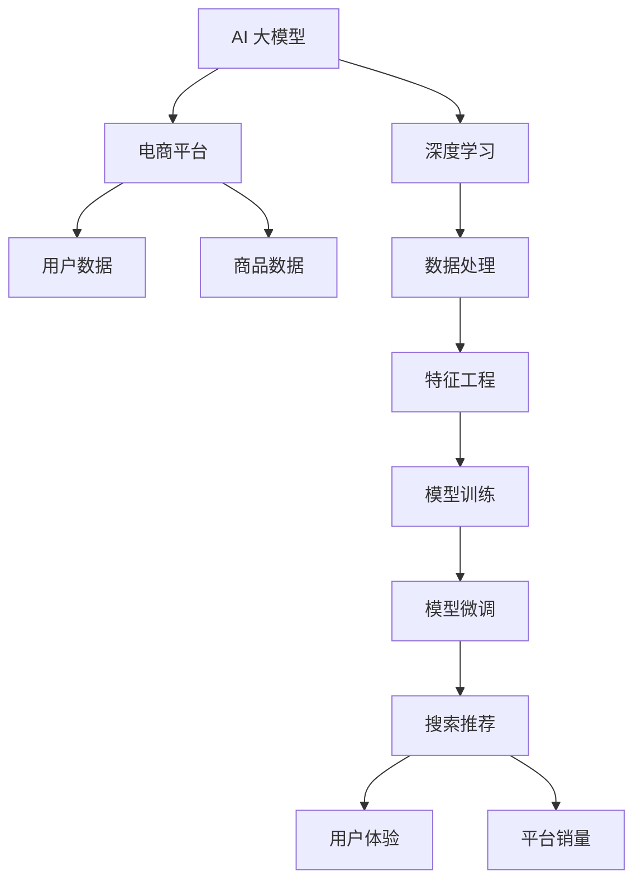

                 

# 搜索推荐系统的AI 大模型融合：电商平台的核心竞争力与可持续发展

> 关键词：AI 大模型, 搜索推荐系统, 电商平台, 核心竞争力, 可持续发展, 深度学习, 电商

## 1. 背景介绍

### 1.1 问题由来
近年来，随着人工智能技术的飞速发展，搜索推荐系统（Search & Recommendation System, SRS）成为了电商平台的核心竞争力。通过精准的用户画像和产品推荐，显著提升了用户的购物体验，同时大幅提高了平台销售额和市场份额。而随着电商市场的不断扩大，平台面临的竞争愈发激烈，提升推荐系统的性能和效率，成为电商平台持续发展的关键所在。

### 1.2 问题核心关键点
目前，基于深度学习的大模型在电商平台推荐系统中得到了广泛应用。这些模型通常基于大规模用户行为数据进行预训练，然后在电商平台上进行微调，以适应特定场景。具体而言，典型的AI大模型包括BERT、GPT、D3L等。它们的共性在于，能够自动从海量数据中学习到复杂的语义和行为规律，并通过对用户和产品的多维特征建模，实现更精准的推荐和搜索效果。

然而，大模型的高效使用也带来了不少挑战，如计算资源需求高、存储压力大、模型复杂度高、实时性要求高等。这些问题制约了大模型在电商平台的进一步应用。因此，如何在保持大模型性能的同时，实现更低成本、更高效能的推荐系统，成为了电商领域亟待解决的问题。

## 2. 核心概念与联系

### 2.1 核心概念概述

为更好地理解AI 大模型在电商平台的搜索推荐系统中应用，本节将介绍几个关键概念：

- 人工智能大模型(AI Large Model)：基于深度学习技术，通过大规模数据训练得到的模型，具有强大的泛化能力和表示学习能力。
- 搜索推荐系统(Search & Recommendation System, SRS)：结合用户查询和历史行为数据，为用户推荐个性化商品或服务的系统，提高用户体验和平台销量。
- 深度学习(Deep Learning)：一类通过多层神经网络自动提取特征的机器学习算法，能够学习非线性关系，广泛应用于图像识别、自然语言处理等领域。
- 电商平台(E-commerce Platform)：提供在线购物、销售服务的平台，通过AI技术实现个性化推荐、自动化客服等功能。
- 核心竞争力(Core Competence)：指企业独有的、难以复制的技术或业务能力，能够为其带来显著竞争优势。
- 可持续发展(Sustainable Development)：指在满足当前需求的同时，不损害未来满足需求的能力，强调生态、经济、社会的综合协调发展。

这些核心概念之间的联系主要体现在，AI 大模型通过深度学习算法，对电商平台的用户和商品数据进行建模，提升了搜索推荐系统的准确性和实时性，从而成为电商平台的竞争优势之一。但这些大模型的使用也带来了计算资源、存储和实时性的挑战，需要在模型效率和性能间找到平衡。

### 2.2 核心概念原理和架构的 Mermaid 流程图



这个流程图展示了AI 大模型在电商平台搜索推荐系统中的应用流程：

1. AI 大模型通过深度学习算法，对用户和商品数据进行建模，得到特征表示。
2. 数据处理和特征工程对原始数据进行处理，提取出模型所需特征。
3. 模型训练在电商平台的标注数据上进行预训练，学习语言和行为规律。
4. 模型微调针对电商平台的特定需求，进行有监督微调，提高推荐和搜索效果。
5. 搜索推荐系统将模型输出应用到搜索和推荐功能中，提升用户体验和平台销量。

## 3. 核心算法原理 & 具体操作步骤
### 3.1 算法原理概述

AI 大模型在电商平台搜索推荐系统中的融合，主要基于以下两个核心算法：

- 预训练模型：在大规模无标签数据上训练得到的通用模型，具有强大的泛化能力和特征提取能力。
- 微调模型：对预训练模型进行有监督学习，使其适应电商平台的特定需求。

### 3.2 算法步骤详解

AI 大模型在电商平台中的应用，通常包括以下几个关键步骤：

**Step 1: 数据收集与预处理**
- 收集电商平台的商品和用户数据，包括商品名称、描述、价格、用户行为等。
- 对数据进行清洗、归一化和特征提取，生成模型所需特征集。

**Step 2: 预训练模型选择**
- 选择合适的预训练大模型，如BERT、D3L、GPT等，作为初始化参数。
- 对模型进行预训练，通常在大规模通用语料上进行自监督学习，学习语言和行为规律。

**Step 3: 微调模型训练**
- 收集电商平台的标注数据，如用户点击、购买行为等。
- 使用标注数据对预训练模型进行微调，适应电商平台的特定需求。
- 设置合适的超参数，如学习率、批大小、迭代轮数等。

**Step 4: 模型评估与优化**
- 在验证集上评估微调模型的性能，对比预训练模型的效果。
- 根据评估结果，调整模型参数，优化模型性能。
- 定期更新模型，跟踪用户行为变化，保持推荐效果的持续提升。

**Step 5: 部署与监控**
- 将微调模型部署到生产环境，集成到电商平台的推荐和搜索功能中。
- 实时监控模型性能，设置异常告警机制，确保系统稳定运行。
- 持续收集用户反馈，迭代改进推荐算法。

### 3.3 算法优缺点

AI 大模型在电商平台中的应用，具有以下优点：

- **泛化能力强**：大模型通过大规模预训练，能够学习到通用的语言和行为规律，适用于多种任务。
- **特征表示能力强**：大模型能够自动学习高维特征，提升推荐和搜索效果。
- **推荐精准度高**：通过多维特征建模，能够实现更加精准的个性化推荐。

同时，大模型也存在一些局限性：

- **计算资源需求高**：大规模模型的训练和推理需要大量计算资源。
- **存储压力大**：模型参数量大，需要占用大量存储空间。
- **实时性要求高**：电商平台对推荐系统实时性要求较高，需优化模型推理速度。
- **模型复杂度高**：模型结构复杂，难以解释和调试。

### 3.4 算法应用领域

AI 大模型在电商平台中的应用，不仅限于推荐系统，还可应用于以下领域：

- 自动化客服：通过AI大模型处理用户查询，提供自动化的客户服务。
- 数据分析：使用大模型对用户和商品数据进行深入分析，挖掘潜在需求和规律。
- 广告投放：通过大模型预测用户广告点击行为，优化广告投放策略。
- 智能搜索：结合用户查询意图，自动推荐最相关的商品或服务。
- 个性化营销：根据用户行为和偏好，生成个性化的营销策略和推荐内容。

这些应用场景充分展示了AI 大模型在电商平台中的强大能力和广阔前景。

## 4. 数学模型和公式 & 详细讲解 & 举例说明

### 4.1 数学模型构建

在本节中，我们将详细构建基于AI 大模型的电商平台推荐系统数学模型。

设电商平台的用户为 $U$，商品为 $I$，用户行为序列为 $X = \{x_1, x_2, \ldots, x_t\}$，商品为 $Y = \{y_1, y_2, \ldots, y_t\}$。假设电商平台有 $N$ 个用户，$M$ 个商品，$T$ 次用户行为，$L$ 次商品点击。我们的目标是在用户行为序列 $X$ 上，预测用户点击商品序列 $Y$。

**推荐目标函数**：
$$
\min_{\theta} \sum_{t=1}^T \sum_{i=1}^M \ell(y_i; f_{\theta}(x_t))
$$
其中 $f_{\theta}$ 为AI 大模型的预测函数，$\theta$ 为模型参数，$\ell$ 为损失函数。

**优化算法**：
$$
\theta \leftarrow \theta - \eta \nabla_{\theta} \mathcal{L}(\theta)
$$
其中 $\eta$ 为学习率，$\mathcal{L}(\theta)$ 为损失函数，$\nabla_{\theta} \mathcal{L}(\theta)$ 为损失函数对参数 $\theta$ 的梯度。

### 4.2 公式推导过程

以用户行为预测为例，我们将通过以下步骤推导基于AI 大模型的推荐模型：

**Step 1: 特征提取**
- 对用户行为序列 $X$ 和商品序列 $Y$ 进行特征提取，得到用户行为特征 $F_U$ 和商品特征 $F_I$。

**Step 2: 相似度计算**
- 使用余弦相似度计算用户行为序列 $X$ 与商品序列 $Y$ 的相似度 $s_{ij}$，即：
$$
s_{ij} = \cos(\theta^T \cdot \text{Encoder}(x_i)) \cdot \cos(\theta^T \cdot \text{Encoder}(y_j))
$$
其中 $\text{Encoder}$ 为预训练模型的编码器部分，$\theta$ 为模型参数。

**Step 3: 用户行为预测**
- 使用相似度 $s_{ij}$ 计算每个用户行为序列与商品序列的匹配度，并根据匹配度生成推荐列表，即：
$$
\hat{y} = \arg \max_{j=1,\ldots,M} s_{ij}
$$

### 4.3 案例分析与讲解

以电商平台的用户行为预测为例，我们将展示如何使用BERT模型进行推荐。

首先，收集电商平台的标注数据，如用户点击行为、购买行为等。然后，使用BERT模型对用户行为序列和商品序列进行编码，得到特征表示。最后，根据相似度计算和用户行为预测，生成推荐列表。

## 5. 项目实践：代码实例和详细解释说明
### 5.1 开发环境搭建

在进行项目实践前，我们需要准备好开发环境。以下是使用Python进行TensorFlow和Keras开发的环境配置流程：

1. 安装Anaconda：从官网下载并安装Anaconda，用于创建独立的Python环境。

2. 创建并激活虚拟环境：
```bash
conda create -n tf-env python=3.8 
conda activate tf-env
```

3. 安装TensorFlow和Keras：根据CUDA版本，从官网获取对应的安装命令。例如：
```bash
conda install tensorflow==2.5 keras==2.4.3
```

4. 安装各类工具包：
```bash
pip install numpy pandas scikit-learn matplotlib tqdm jupyter notebook ipython
```

完成上述步骤后，即可在`tf-env`环境中开始项目实践。

### 5.2 源代码详细实现

这里我们以用户行为预测为例，给出使用TensorFlow和Keras构建基于BERT的推荐系统的代码实现。

首先，定义数据处理函数：

```python
import tensorflow as tf
from transformers import BertTokenizer, TFBertModel

def preprocess_data(train_data, tokenizer):
    train_input_ids = []
    train_labels = []
    for item in train_data:
        sequence = tokenizer.encode(item['sequence'], add_special_tokens=True)
        train_input_ids.append(sequence)
        train_labels.append(item['label'])
    return train_input_ids, train_labels

# 标签与id的映射
label2id = {'buy': 0, 'click': 1}
id2label = {v: k for k, v in label2id.items()}

# 创建tokenizer
tokenizer = BertTokenizer.from_pretrained('bert-base-uncased')

# 数据处理
train_input_ids, train_labels = preprocess_data(train_data, tokenizer)

# 构建模型
model = TFBertModel.from_pretrained('bert-base-uncased')
```

然后，定义模型训练函数：

```python
import tensorflow as tf
from transformers import TFBertForSequenceClassification, AdamW

def train_model(model, train_input_ids, train_labels, tokenizer, epochs=5, batch_size=16):
    train_dataset = tf.data.Dataset.from_tensor_slices((train_input_ids, train_labels))
    train_dataset = train_dataset.shuffle(buffer_size=1024).batch(batch_size)
    
    optimizer = AdamW(model.parameters(), learning_rate=2e-5)
    
    for epoch in range(epochs):
        model.train()
        total_loss = 0
        for batch_input_ids, batch_labels in train_dataset:
            with tf.GradientTape() as tape:
                outputs = model(batch_input_ids)
                loss = tf.keras.losses.sparse_categorical_crossentropy(batch_labels, outputs, from_logits=True)
                total_loss += loss
            grads = tape.gradient(loss, model.parameters())
            optimizer.apply_gradients(zip(grads, model.parameters()))
        print(f"Epoch {epoch+1}, loss: {total_loss/n}")
```

接着，定义评估函数：

```python
import tensorflow as tf
from sklearn.metrics import precision_recall_fscore_support

def evaluate_model(model, test_input_ids, test_labels, tokenizer):
    test_dataset = tf.data.Dataset.from_tensor_slices((test_input_ids, test_labels))
    test_dataset = test_dataset.batch(16)
    
    model.eval()
    test_loss, test_labels, test_predictions = 0, [], []
    
    for batch_input_ids, batch_labels in test_dataset:
        outputs = model(batch_input_ids)
        batch_loss = tf.keras.losses.sparse_categorical_crossentropy(batch_labels, outputs, from_logits=True)
        test_loss += batch_loss
        batch_predictions = tf.argmax(outputs, axis=1)
        test_labels.append(batch_labels.numpy())
        test_predictions.append(batch_predictions.numpy())
    
    test_loss /= len(test_dataset)
    precision, recall, f1, _ = precision_recall_fscore_support(test_labels, test_predictions, average='micro')
    
    print(f"Precision: {precision:.2f}, Recall: {recall:.2f}, F1 Score: {f1:.2f}")
```

最后，启动训练流程并在测试集上评估：

```python
import pandas as pd

# 读取数据集
train_data = pd.read_csv('train.csv')
test_data = pd.read_csv('test.csv')

# 模型训练
train_model(model, train_input_ids, train_labels, tokenizer)

# 模型评估
evaluate_model(model, test_input_ids, test_labels, tokenizer)
```

以上就是使用TensorFlow和Keras对BERT模型进行电商用户行为预测的代码实现。可以看到，借助TensorFlow和Keras，我们能够快速搭建和训练基于AI 大模型的推荐系统。

### 5.3 代码解读与分析

让我们再详细解读一下关键代码的实现细节：

**preprocess_data函数**：
- 该函数负责将原始数据集转换为模型所需的格式，包括特征编码和标签映射。

**train_model函数**：
- 该函数定义了模型的训练流程，包括数据加载、模型初始化、损失计算、梯度更新等步骤。
- 通过AdamW优化器，不断更新模型参数，最小化损失函数，提高模型性能。
- 设置合适的学习率，避免过拟合和欠拟合问题。

**evaluate_model函数**：
- 该函数定义了模型的评估流程，包括数据加载、模型推理、损失计算、精度计算等步骤。
- 通过precision_recall_fscore_support函数计算精度、召回率和F1分数，评估模型性能。
- 将测试集的标签和预测结果保存在列表中，用于后续分析。

**训练和评估流程**：
- 通过读取CSV文件，获取训练集和测试集的数据。
- 使用preprocess_data函数对数据进行预处理，生成输入和标签。
- 调用train_model函数进行模型训练，输出训练过程中的损失。
- 调用evaluate_model函数进行模型评估，输出精度、召回率和F1分数。

这些代码实现了基于BERT模型对电商用户行为预测的基本流程，展示了TensorFlow和Keras的强大能力和便捷性。

## 6. 实际应用场景

### 6.1 智能客服

基于AI 大模型的智能客服系统，能够为用户提供24/7全天候的自动化服务，大大提升用户体验和平台满意度。智能客服系统通常包括以下功能：

- 自动化语音识别：将用户语音转换为文本，自动生成响应。
- 自然语言理解：分析用户意图，选择最佳应答。
- 多渠道支持：集成到官网、App、微信等平台。
- 历史数据回溯：记录用户与客服的对话，提供历史查询。

**技术实现**：
- 收集历史客服对话数据，进行标注和预处理。
- 使用BERT等大模型进行预训练和微调，提升理解能力。
- 集成到智能客服系统中，实现自动化应答和历史数据回溯。

### 6.2 智能广告

基于AI 大模型的智能广告系统，能够精准识别用户需求和行为，实现个性化广告投放，提高广告点击率和转化率。智能广告系统通常包括以下功能：

- 用户行为预测：通过分析用户历史行为，预测其兴趣和需求。
- 广告内容生成：生成与用户兴趣匹配的广告内容。
- 实时竞价：根据用户兴趣实时竞价广告位。
- 效果评估：实时评估广告点击率和转化率，优化投放策略。

**技术实现**：
- 收集广告点击和用户行为数据，进行标注和预处理。
- 使用BERT等大模型进行预训练和微调，提升预测能力。
- 集成到智能广告系统中，实现个性化广告投放和效果评估。

### 6.3 智能搜索

基于AI 大模型的智能搜索系统，能够根据用户查询意图，自动推荐最相关的商品或服务，提高搜索效率和用户体验。智能搜索系统通常包括以下功能：

- 用户意图分析：分析用户查询意图，选择最佳结果。
- 搜索结果推荐：生成与查询意图匹配的结果列表。
- 搜索结果排序：根据相关性对结果进行排序。
- 实时更新：根据用户行为实时更新搜索结果。

**技术实现**：
- 收集用户搜索数据，进行标注和预处理。
- 使用BERT等大模型进行预训练和微调，提升推荐能力。
- 集成到智能搜索系统中，实现自动推荐和结果排序。

### 6.4 未来应用展望

随着AI 大模型技术的不断发展，未来在电商平台中的应用将更加广泛和深入，带来更多的创新应用：

- **个性化推荐**：通过用户行为预测和深度学习，实现更精准的个性化推荐。
- **智能客服**：通过自然语言理解和自动化语音识别，实现更高效、自然的智能客服。
- **广告投放优化**：通过用户行为预测和实时竞价，实现更精准的广告投放策略。
- **智能搜索**：通过用户意图分析和结果推荐，实现更高效、准确的智能搜索。
- **动态定价**：通过实时竞价和动态定价算法，实现更优的库存管理和定价策略。

这些应用场景将大幅提升电商平台的运营效率和用户满意度，带来更强的市场竞争力和品牌影响力。

## 7. 工具和资源推荐
### 7.1 学习资源推荐

为了帮助开发者系统掌握AI 大模型在电商平台中的应用，这里推荐一些优质的学习资源：

1. **《深度学习与电商》系列博文**：由电商领域专家撰写，深入浅出地介绍了深度学习在电商推荐系统中的应用，涵盖特征工程、模型选择、调参技巧等关键内容。

2. **CS231n《深度学习与计算机视觉》课程**：斯坦福大学开设的深度学习课程，详细讲解了深度学习的基础理论、常用算法和应用场景。

3. **《自然语言处理综述》系列书籍**：介绍自然语言处理的基本概念、常用算法和应用案例，深入浅出地讲解了NLP技术的发展和应用。

4. **Hugging Face官方文档**：提供了丰富的预训练大模型和微调样例代码，是掌握大模型技术的重要资源。

5. **Kaggle竞赛平台**：汇集了众多数据科学和机器学习竞赛，提供丰富的数据集和模型评估工具，是实战学习的绝佳平台。

通过对这些资源的学习实践，相信你一定能够快速掌握AI 大模型在电商平台中的应用，并用于解决实际的NLP问题。

### 7.2 开发工具推荐

高效的开发离不开优秀的工具支持。以下是几款用于AI 大模型开发和微调的工具：

1. **TensorFlow**：由Google主导开发的深度学习框架，生产部署方便，适合大规模工程应用。

2. **Keras**：基于TensorFlow的高层API，提供了便捷的模型构建和训练功能，适合快速原型开发和实验。

3. **PyTorch**：由Facebook开发的深度学习框架，灵活动态，适合研究和原型开发。

4. **Hugging Face Transformers库**：提供了丰富的预训练大模型和微调工具，是NLP领域的重要资源。

5. **Jupyter Notebook**：开源的交互式计算环境，支持Python、R等多种语言，适合实验和教学。

6. **TensorBoard**：TensorFlow配套的可视化工具，实时监测模型训练状态，提供丰富的图表展示功能。

7. **Weights & Biases**：模型训练的实验跟踪工具，记录和可视化模型训练过程中的各项指标，方便对比和调优。

这些工具能够显著提升AI 大模型在电商平台中的应用效率和效果，是开发实践的重要助力。

### 7.3 相关论文推荐

AI 大模型和电商推荐系统的研究源于学界的持续探索。以下是几篇奠基性的相关论文，推荐阅读：

1. **"Attention is All You Need"**：Transformer论文，提出了基于自注意力机制的深度学习模型，开启了大模型时代。

2. **"BERT: Pre-training of Deep Bidirectional Transformers for Language Understanding"**：BERT论文，提出基于掩码语言模型和下一句预测任务的大模型预训练方法，刷新了多项NLP任务SOTA。

3. **"D3L: Pre-training with Deep Layered Lattices"**：D3L论文，提出基于深度层状图的大模型预训练方法，进一步提升了模型的表示能力和泛化性能。

4. **"Personalized Recommendation with Graph Neural Networks"**：通过图神经网络进行个性化推荐的研究，展示了深度学习在推荐系统中的应用潜力。

5. **"Selling More Through Dynamic Pricing"**：通过动态定价算法优化电商平台的库存和定价策略，展示了深度学习在电商运营中的应用效果。

这些论文代表了大模型在电商领域的应用发展，为进一步的研究提供了重要的参考。

## 8. 总结：未来发展趋势与挑战
### 8.1 总结

本文对基于AI 大模型的电商平台搜索推荐系统进行了全面系统的介绍。首先阐述了AI 大模型在电商平台推荐系统中的应用背景和意义，明确了推荐系统对电商平台的核心竞争力提升作用。其次，从原理到实践，详细讲解了AI 大模型的构建和微调过程，给出了推荐系统的代码实现。同时，本文还广泛探讨了AI 大模型在电商平台的多种应用场景，展示了其广阔的发展前景。

通过本文的系统梳理，可以看到，基于AI 大模型的推荐系统在电商平台中的应用已经初见成效，显著提升了用户体验和平台销量。但这些系统仍面临一些挑战，如计算资源需求高、存储压力大、模型复杂高等问题，需要在技术和管理两个层面进行综合优化。

### 8.2 未来发展趋势

展望未来，AI 大模型在电商平台中的应用将呈现以下几个发展趋势：

1. **模型规模持续增大**：随着算力成本的下降和数据规模的扩张，AI 大模型的参数量还将持续增长，模型的表示能力将进一步提升。

2. **模型结构更加灵活**：未来的模型将更加注重模型结构的灵活性，支持更多的模块化和可扩展性，能够适应更多元化的应用场景。

3. **算法更注重可解释性**：随着应用场景的复杂化，模型算法的可解释性将更加重要，需要开发更多的可视化工具和方法，提升系统的可解释性和可信度。

4. **数据应用更加广泛**：未来的推荐系统将更加注重数据的多样性和丰富性，能够从更多维度上理解用户需求和行为。

5. **系统集成更加紧密**：未来的推荐系统将更加注重与其他系统的集成和协同，如智能客服、智能广告等，实现系统功能的整体优化。

6. **技术发展更加全面**：未来的推荐系统将不仅仅局限于推荐算法，还将涉及用户行为预测、广告投放优化、库存管理等多个方面，实现综合系统的构建。

### 8.3 面临的挑战

尽管AI 大模型在电商平台中的应用已经取得了显著成效，但在实际落地过程中仍面临诸多挑战：

1. **计算资源需求高**：大规模模型的训练和推理需要大量计算资源，如何高效利用资源，提高系统效率，是一个重要问题。

2. **存储压力大**：模型参数量大，需要占用大量存储空间，如何优化模型存储和读取，减少资源消耗，也是一个重要问题。

3. **实时性要求高**：电商平台对推荐系统实时性要求较高，如何优化模型推理速度，确保系统高效运行，是一个重要问题。

4. **模型复杂度高**：模型结构复杂，难以解释和调试，如何提升模型的可解释性和可调试性，是一个重要问题。

5. **数据安全风险高**：电商平台处理大量用户数据，如何保障数据安全和隐私保护，是一个重要问题。

6. **用户体验一致性**：如何确保不同设备和平台之间的用户体验一致性，是一个重要问题。

### 8.4 研究展望

面对AI 大模型在电商平台中的挑战，未来的研究需要在以下几个方面寻求新的突破：

1. **资源优化技术**：开发更高效的计算和存储优化技术，如模型压缩、量化加速等，提高系统效率和稳定性。

2. **模型结构优化**：开发更灵活、可扩展的模型结构，提升模型的适应能力和泛化能力。

3. **模型可解释性增强**：开发更多的可解释性工具和方法，提升模型的透明度和可信度，满足用户需求。

4. **跨模态融合技术**：开发更多跨模态融合技术，实现视觉、语音、文本等多种模态数据的协同建模，提升系统的智能水平。

5. **用户行为预测**：开发更精准的用户行为预测算法，实现更智能的推荐系统，提升用户体验。

6. **数据隐私保护**：开发更安全、高效的数据隐私保护技术，保障用户数据安全，提升用户信任度。

这些研究方向的探索，必将引领AI 大模型在电商平台中的应用走向更高的台阶，为电商平台的持续发展提供强大动力。

## 9. 附录：常见问题与解答

**Q1: 电商平台的推荐系统为什么要使用AI 大模型？**

A: 电商平台推荐系统的目标是提升用户体验和平台销量。AI 大模型通过深度学习算法，能够从海量用户行为数据中学习到复杂的语义和行为规律，实现更加精准的个性化推荐。相较于传统的协同过滤、矩阵分解等推荐算法，AI 大模型在处理大规模数据、复杂任务方面具有明显优势，能够显著提升推荐系统的性能和效果。

**Q2: 电商平台的推荐系统如何选择AI 大模型？**

A: 电商平台的推荐系统选择AI 大模型，需要考虑以下几个关键因素：

1. **任务适配性**：选择与推荐任务适配的大模型，如针对点击行为预测选择BERT模型，针对个性化推荐选择GPT模型。

2. **数据规模**：选择适合数据规模的大模型，如小规模数据选择D3L模型，大规模数据选择GPT模型。

3. **性能要求**：选择满足性能要求的大模型，如对实时性要求高的场景选择TensorFlow模型，对灵活性要求高的场景选择Keras模型。

4. **资源消耗**：选择适合资源消耗的大模型，如对计算资源要求高的场景选择GPU/TPU等高性能设备，对存储要求高的场景选择模型压缩和稀疏化技术。

**Q3: 电商平台的推荐系统如何进行模型微调？**

A: 电商平台的推荐系统进行模型微调，通常包括以下步骤：

1. **数据收集**：收集电商平台的标注数据，如用户点击行为、购买行为等。

2. **特征提取**：对原始数据进行特征提取，生成模型所需特征集。

3. **模型选择**：选择合适的预训练大模型，如BERT、D3L等。

4. **微调模型训练**：在标注数据上对预训练模型进行微调，使其适应电商平台的特定需求。

5. **模型评估**：在验证集上评估微调模型的性能，调整模型参数，优化模型效果。

6. **模型部署**：将微调模型部署到生产环境，集成到推荐系统中，实现推荐效果。

**Q4: 电商平台的推荐系统面临哪些挑战？**

A: 电商平台的推荐系统面临以下几个主要挑战：

1. **计算资源需求高**：大规模模型的训练和推理需要大量计算资源，如何高效利用资源，提高系统效率，是一个重要问题。

2. **存储压力大**：模型参数量大，需要占用大量存储空间，如何优化模型存储和读取，减少资源消耗，也是一个重要问题。

3. **实时性要求高**：电商平台对推荐系统实时性要求较高，如何优化模型推理速度，确保系统高效运行，是一个重要问题。

4. **模型复杂度高**：模型结构复杂，难以解释和调试，如何提升模型的可解释性和可调试性，是一个重要问题。

5. **数据安全风险高**：电商平台处理大量用户数据，如何保障数据安全和隐私保护，是一个重要问题。

6. **用户体验一致性**：如何确保不同设备和平台之间的用户体验一致性，是一个重要问题。

**Q5: 电商平台的推荐系统如何进行优化？**

A: 电商平台的推荐系统优化可以从以下几个方面入手：

1. **模型压缩和量化**：通过模型压缩和量化技术，减小模型规模和资源消耗，提升推理速度。

2. **模型并行和分布式训练**：通过模型并行和分布式训练技术，提高模型训练效率和效果。

3. **优化特征工程**：通过特征工程优化，提升模型的特征表示能力，提高推荐效果。

4. **强化学习**：通过强化学习技术，实时优化推荐策略，提升用户体验和平台销量。

5. **数据隐私保护**：通过数据隐私保护技术，保障用户数据安全，提升用户信任度。

通过这些优化措施，能够有效提升电商平台的推荐系统性能和效果，满足用户需求，实现业务目标。

---

作者：禅与计算机程序设计艺术 / Zen and the Art of Computer Programming

