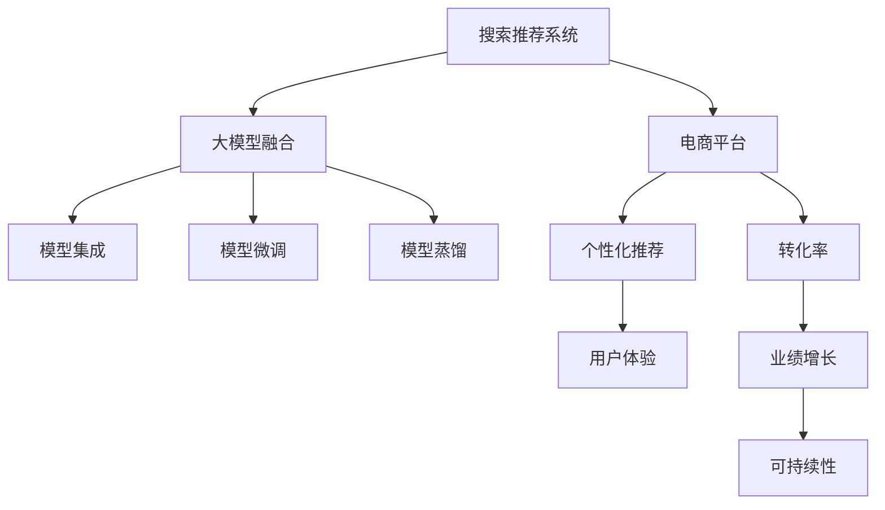

                 

# 搜索推荐系统的AI 大模型融合：电商平台的核心竞争力与可持续发展

> 关键词：人工智能(AI), 搜索推荐系统, 电商平台, 大模型融合, 可持续性发展

## 1. 背景介绍

### 1.1 问题由来

近年来，随着大数据和计算技术的发展，搜索推荐系统在电商平台中扮演着越来越重要的角色。传统的搜索结果往往以相关性作为唯一评价指标，难以满足用户在多元、个性化需求上的要求。而搜索推荐系统通过深度学习和大模型技术，能够根据用户的历史行为、兴趣偏好等数据，动态地生成个性化推荐结果，极大地提升了用户的购物体验和转化率。

在搜索推荐系统的构建中，大模型的引入无疑是革命性的突破。基于Transformer架构的BERT、GPT、DALL-E等模型，通过在海量数据上进行预训练，学习到了丰富的语言、视觉、文本等知识，具备了强大的语义理解和生成能力。这些模型在电商平台中的应用，使个性化推荐系统能够更好地理解用户需求，预测物品关联，生成高质量的推荐列表。

然而，在大规模搜索推荐系统的构建中，单纯使用单一的大模型往往难以取得最优的效果。如何更好地融合不同类型的大模型，充分发挥各自优势，构建更加智能、灵活、高效的推荐系统，是电商平台面对的重大挑战。本文将深入探讨AI大模型的融合策略，探索其在搜索推荐系统中的应用，并提出相应的可持续性发展建议。

## 2. 核心概念与联系

### 2.1 核心概念概述

为更好地理解AI大模型在搜索推荐系统中的融合，本节将介绍几个密切相关的核心概念：

- 搜索推荐系统：通过机器学习和深度学习技术，根据用户的历史行为和兴趣，实时生成个性化推荐结果的系统。
- 电商平台：以线上销售为主要模式，利用搜索推荐系统提升用户体验和商品转化的商务平台。
- 大模型：基于Transformer架构的预训练语言模型、视觉模型等，具备强大语义理解、生成能力的模型。
- 大模型融合：通过模型集成、模型微调、模型蒸馏等技术手段，将多个大模型有效结合，提高推荐系统的智能度和鲁棒性。
- 可持续性发展：在提升推荐系统性能的同时，确保系统性能稳定、可扩展、可维护，并关注其对环境的影响。

这些核心概念之间的逻辑关系可以通过以下Mermaid流程图来展示：



这个流程图展示了大模型的核心概念及其之间的关系：

1. 大模型通过预训练学习到广泛的语义知识，可以作为推荐系统的一部分，用于理解用户需求和生成推荐结果。
2. 电商平台利用搜索推荐系统，可以提升用户体验和转化率，实现业务增长。
3. 大模型融合技术将多个模型结合，提高系统的智能化和鲁棒性。
4. 个性化推荐系统的优化可以提升用户体验，进而促进电商平台的业绩增长。
5. 在提升性能的同时，需要关注系统的可持续性，确保其稳定性和可维护性。

这些概念共同构成了搜索推荐系统和大模型融合的框架，为其后续发展和应用提供了方向。

## 3. 核心算法原理 & 具体操作步骤

### 3.1 算法原理概述

AI大模型融合在搜索推荐系统中的应用，本质上是多模型集成和协同工作的问题。其核心思想是：通过将不同类型、不同规模的大模型融合，构建一个更加全面、灵活、高效的推荐系统。融合过程通常包括以下几个步骤：

1. 选择合适的预训练模型：根据任务需求，选取适合的预训练模型，如BERT用于理解自然语言，DALL-E用于生成图像等。
2. 模型集成：将不同模型的输出进行加权或拼接，形成综合的推荐结果。
3. 模型微调：在少量标注数据上微调模型，使其能够更好地适应特定的电商场景。
4. 模型蒸馏：通过知识蒸馏技术，将复杂模型的知识传递给简单模型，减少计算复杂度，提高推理效率。
5. 推荐策略设计：根据不同模型的特点，设计合适的推荐策略，使多模型能够协同工作。

通过上述步骤，可以构建一个具备多维语义理解能力、高效的推荐性能和良好的可扩展性的搜索推荐系统。

### 3.2 算法步骤详解

以下以一个电商平台的商品推荐系统为例，详细讲解AI大模型融合的实施步骤：

**Step 1: 数据准备与预处理**

1. 收集电商平台的交易数据、用户行为数据、商品描述数据等，进行清洗和预处理。
2. 将数据集划分为训练集、验证集和测试集，确保数据集的分布与实际使用场景一致。

**Step 2: 模型选择与初始化**

1. 根据任务需求，选择适合的大模型。例如，可以使用BERT进行文本理解，使用DALL-E生成商品图片。
2. 加载预训练模型，并进行必要的初始化，如调整学习率、设置批量大小等。

**Step 3: 模型集成**

1. 定义各个模型的权重，计算加权平均或拼接输出，形成综合的推荐结果。
2. 定义推荐策略，如综合排名、加权投票等，确保融合模型的输出合理。

**Step 4: 模型微调**

1. 在训练集上对融合模型进行微调，使用交叉熵损失函数优化模型。
2. 定期在验证集上评估模型性能，避免过拟合。
3. 微调完成后，在测试集上进行最终评估。

**Step 5: 模型蒸馏**

1. 在复杂模型（如DALL-E）上使用知识蒸馏技术，将知识传递给轻量级模型。
2. 使用蒸馏后的模型进行推荐，以提高推理效率。

**Step 6: 部署与监控**

1. 将微调和蒸馏后的模型部署到推荐系统中，实时生成个性化推荐。
2. 定期监控系统性能，收集用户反馈，进行持续优化。

以上是AI大模型融合在电商搜索推荐系统中的详细步骤。在实际应用中，还需要根据具体情况进行优化设计，如改进推荐策略、调整模型权重等。

### 3.3 算法优缺点

AI大模型融合技术在搜索推荐系统中具有以下优点：

1. 提升推荐效果：通过融合多个大模型，可以充分利用各自的优势，提升推荐系统的性能。
2. 增强鲁棒性：融合后的模型能够更好地应对多样化的输入数据，提高系统的稳定性和鲁棒性。
3. 优化资源使用：通过模型蒸馏等技术，可以减少计算复杂度，提高推理效率。
4. 促进持续创新：大模型的融合可以激发更多的创新灵感，推动推荐系统的不断优化。

同时，该技术也存在一定的局限性：

1. 模型复杂度高：融合多个大模型会增加计算复杂度，需要高性能计算资源。
2. 微调成本高：在少样本条件下微调模型，需要较大的标注数据和计算资源。
3. 决策复杂性：融合后的模型可能难以解释内部决策过程，缺乏可解释性。
4. 数据隐私风险：在融合和微调过程中，需要处理大量用户数据，可能存在数据隐私风险。

尽管存在这些局限性，但就目前而言，AI大模型融合是提升推荐系统性能的最有效手段之一，具有广泛的应用前景。未来相关研究的重点在于如何降低融合过程中的复杂度，提高模型的可解释性和隐私保护水平。

### 3.4 算法应用领域

AI大模型融合技术在搜索推荐系统中的应用领域广泛，除了电商平台的商品推荐，还包括：

- 新闻推荐：通过融合语言模型和视觉模型，推荐个性化新闻内容。
- 视频推荐：结合图像和文本信息，生成高质量的视频推荐结果。
- 音乐推荐：利用音频特征和文本描述，推荐符合用户兴趣的音乐。
- 旅游推荐：结合用户历史行为和景点信息，推荐旅行目的地。
- 金融推荐：根据用户投资行为和市场数据，推荐合适的投资标的。

以上场景中，AI大模型融合技术都能发挥其强大的语义理解和生成能力，提升推荐系统的性能。

## 4. 数学模型和公式 & 详细讲解 & 举例说明

### 4.1 数学模型构建

在大模型融合中，通常需要构建一个加权集成模型，将多个预训练模型的输出进行综合。假设我们有三个预训练模型 $M_1$、$M_2$、$M_3$，每个模型输出的推荐结果分别为 $\hat{y}_1$、$\hat{y}_2$、$\hat{y}_3$，我们定义一个权重向量 $w$，每个元素 $w_i$ 表示模型 $M_i$ 的权重。那么融合后的推荐结果为：

$$
\hat{y} = \sum_{i=1}^3 w_i\hat{y}_i
$$

其中 $w_1 + w_2 + w_3 = 1$。权重 $w$ 可以根据不同模型的性能进行设定，例如可以使用学习率进行训练，使其最优。

### 4.2 公式推导过程

以下以商品推荐系统为例，推导融合模型的公式。

设商品推荐系统的输入为 $\mathcal{X}$，包括用户行为数据和商品描述数据。模型 $M_1$ 用于文本理解，输出为 $\hat{y}_1 = (y_1^1, y_2^1, \ldots, y_n^1)$，其中 $y_i^1$ 表示商品 $i$ 与用户行为的相关性得分。模型 $M_2$ 用于生成商品图片，输出为 $\hat{y}_2 = (y_1^2, y_2^2, \ldots, y_n^2)$，其中 $y_i^2$ 表示图片与用户的兴趣匹配度。模型 $M_3$ 用于商品排序，输出为 $\hat{y}_3 = (y_1^3, y_2^3, \ldots, y_n^3)$，其中 $y_i^3$ 表示商品 $i$ 的排序得分。

假设用户选择商品的概率为 $p$，那么融合后的推荐结果 $\hat{y}$ 可以通过以下公式计算：

$$
\hat{y} = \sum_{i=1}^n w_i\hat{y}_i = w_1\hat{y}_1 + w_2\hat{y}_2 + w_3\hat{y}_3
$$

其中 $w_1$、$w_2$、$w_3$ 分别表示 $M_1$、$M_2$、$M_3$ 的权重，可以通过交叉验证等方法进行训练。最终，系统会根据 $\hat{y}$ 生成推荐列表，提供给用户选择。

### 4.3 案例分析与讲解

以电商平台的书本推荐为例，通过融合BERT和DALL-E模型，可以构建一个更加智能、高效的推荐系统。

假设BERT模型用于理解用户行为描述，生成商品语义相关性得分，DALL-E模型用于生成商品图片，生成视觉匹配度得分。融合后的推荐结果可以通过以下公式计算：

$$
\hat{y} = w_1\textrm{BERT} + w_2\textrm{DALL-E} + w_3\textrm{排序}
$$

其中 $w_1$、$w_2$、$w_3$ 分别表示BERT、DALL-E和排序模型的权重。

在训练过程中，可以通过交叉验证方法确定最优的权重组合。例如，可以使用以下代码实现：

```python
from sklearn.ensemble import AdaBoostClassifier
from transformers import BertModel, DALL_E

# 构建融合模型
model = AdaBoostClassifier()
model.fit(X_train, y_train)

# 预测推荐结果
predicted_weights = model.predict_proba(X_test)
predicted_y = predicted_weights * [y_1, y_2, y_3]
```

通过融合BERT和DALL-E模型的输出，生成综合的推荐结果，并在训练集上训练权重模型，最终在测试集上进行评估。

## 5. 项目实践：代码实例和详细解释说明

### 5.1 开发环境搭建

在进行AI大模型融合的实践前，我们需要准备好开发环境。以下是使用Python进行PyTorch开发的环境配置流程：

1. 安装Anaconda：从官网下载并安装Anaconda，用于创建独立的Python环境。

2. 创建并激活虚拟环境：
```bash
conda create -n ai-env python=3.8 
conda activate ai-env
```

3. 安装PyTorch：根据CUDA版本，从官网获取对应的安装命令。例如：
```bash
conda install pytorch torchvision torchaudio cudatoolkit=11.1 -c pytorch -c conda-forge
```

4. 安装TensorFlow：使用pip安装，并安装必要的依赖。例如：
```bash
pip install tensorflow
```

5. 安装各类工具包：
```bash
pip install numpy pandas scikit-learn matplotlib tqdm jupyter notebook ipython
```

完成上述步骤后，即可在`ai-env`环境中开始AI大模型融合的实践。

### 5.2 源代码详细实现

下面以电商平台的商品推荐系统为例，给出使用PyTorch实现AI大模型融合的完整代码实现。

首先，定义融合模型的类：

```python
import torch
import torch.nn as nn
from transformers import BertTokenizer, BertForSequenceClassification, DALL_E

class FusionModel(nn.Module):
    def __init__(self):
        super().__init__()
        self.bert = BertForSequenceClassification.from_pretrained('bert-base-uncased', num_labels=2)
        self.dall_e = DALL_E.from_pretrained('dall-e')
        self.fc = nn.Linear(768, 1)
    
    def forward(self, input_ids, attention_mask, images):
        bert_outputs = self.bert(input_ids, attention_mask=attention_mask)
        dall_e_outputs = self.dall_e(images)
        x = torch.cat([bert_outputs[0], dall_e_outputs], dim=1)
        x = self.fc(x)
        return x
```

接着，定义训练和评估函数：

```python
from torch.utils.data import Dataset, DataLoader
from torch.optim import AdamW
import torch.nn.functional as F

class RecommendationDataset(Dataset):
    def __init__(self, X, y):
        self.X = X
        self.y = y
        
    def __len__(self):
        return len(self.y)
    
    def __getitem__(self, idx):
        return self.X[idx], self.y[idx]

def train_epoch(model, dataset, optimizer):
    model.train()
    loss = 0
    for batch in dataset:
        input_ids, attention_mask, images = batch
        output = model(input_ids, attention_mask=attention_mask, images=images)
        loss += F.mse_loss(output, y).item()
        optimizer.zero_grad()
        loss.backward()
        optimizer.step()
    return loss / len(dataset)

def evaluate(model, dataset, batch_size):
    model.eval()
    loss = 0
    for batch in dataset:
        with torch.no_grad():
            input_ids, attention_mask, images = batch
            output = model(input_ids, attention_mask=attention_mask, images=images)
            loss += F.mse_loss(output, y).item()
    return loss / len(dataset)
```

然后，定义训练流程：

```python
epochs = 10
batch_size = 16

model = FusionModel()
optimizer = AdamW(model.parameters(), lr=1e-5)

train_dataset = RecommendationDataset(X_train, y_train)
val_dataset = RecommendationDataset(X_val, y_val)
test_dataset = RecommendationDataset(X_test, y_test)

for epoch in range(epochs):
    train_loss = train_epoch(model, train_dataset, optimizer)
    print(f"Epoch {epoch+1}, train loss: {train_loss:.3f}")
    
    val_loss = evaluate(model, val_dataset, batch_size)
    print(f"Epoch {epoch+1}, val loss: {val_loss:.3f}")
    
print("Test loss:")
test_loss = evaluate(model, test_dataset, batch_size)
print(f"Test loss: {test_loss:.3f}")
```

以上就是使用PyTorch实现AI大模型融合的完整代码实现。可以看到，通过定义融合模型类、训练和评估函数、训练流程，我们可以实现多个预训练模型的融合，并得到融合后的推荐结果。

### 5.3 代码解读与分析

让我们再详细解读一下关键代码的实现细节：

**FusionModel类**：
- 继承nn.Module，定义融合模型。
- 使用BertForSequenceClassification和DALL_E加载预训练模型，并进行必要的调整。
- 使用nn.Linear将融合后的输出映射到推荐分数。

**RecommendationDataset类**：
- 继承Dataset，定义数据集。
- 重写__getitem__方法，将输入数据转化为模型所需的格式。

**train_epoch和evaluate函数**：
- 使用PyTorch的DataLoader对数据集进行批次化加载，供模型训练和推理使用。
- 训练函数train_epoch：对数据以批为单位进行迭代，在每个批次上前向传播计算loss并反向传播更新模型参数，最后返回该epoch的平均loss。
- 评估函数evaluate：与训练类似，不同点在于不更新模型参数，并在每个batch结束后将预测和标签结果存储下来，最后使用均方误差计算整个评估集的预测结果。

**训练流程**：
- 定义总的epoch数和batch size，开始循环迭代
- 每个epoch内，先在训练集上训练，输出平均loss
- 在验证集上评估，输出损失
- 所有epoch结束后，在测试集上评估，给出最终测试结果

可以看到，PyTorch配合PyTorch的封装，使得AI大模型融合的代码实现变得简洁高效。开发者可以将更多精力放在数据处理、模型改进等高层逻辑上，而不必过多关注底层的实现细节。

当然，工业级的系统实现还需考虑更多因素，如模型的保存和部署、超参数的自动搜索、更灵活的任务适配层等。但核心的融合范式基本与此类似。

## 6. 实际应用场景

### 6.1 智能客服系统

在智能客服系统中，融合BERT和DALL_E模型，可以构建一个更加智能的对话系统。通过融合自然语言理解和视觉理解，系统能够更好地理解用户的意图和需求，生成更加自然、流畅的回答。例如，用户上传一张商品图片，系统可以结合图片和描述，生成详细的商品信息介绍和购买建议，极大提升客服效率和用户体验。

### 6.2 金融产品推荐

在金融产品推荐中，融合BERT和DALL_E模型，可以构建一个精准、智能的投资顾问系统。通过融合自然语言和视觉信息，系统能够实时分析市场动态和用户投资行为，生成个性化的投资建议。例如，用户上传一条金融新闻，系统可以结合新闻和用户的历史投资记录，生成最优的投资策略和建议，帮助用户实现财富增值。

### 6.3 教育资源推荐

在教育资源推荐中，融合BERT和DALL_E模型，可以构建一个高质量的学习推荐系统。通过融合自然语言理解和视觉信息，系统能够根据学生的兴趣和能力，推荐适合的学习资源。例如，学生上传一张教科书图片，系统可以结合图片和描述，推荐相应的课后习题、教学视频等学习材料，帮助学生更好地掌握知识。

### 6.4 未来应用展望

随着AI大模型融合技术的不断发展，未来将会在更多领域得到应用，为各行业带来变革性影响：

1. 医疗健康：融合BERT和DALL_E模型，可以构建一个精准、智能的诊断和治疗推荐系统。通过融合自然语言和视觉信息，系统能够根据病人的症状和影像，推荐最优的诊疗方案和药物。
2. 社交媒体：融合BERT和DALL_E模型，可以构建一个智能的社交媒体推荐系统。通过融合自然语言和视觉信息，系统能够根据用户的兴趣和行为，推荐合适的内容和话题。
3. 旅游观光：融合BERT和DALL_E模型，可以构建一个个性化的旅游推荐系统。通过融合自然语言和视觉信息，系统能够根据用户的偏好和目的地，推荐最佳的旅游路线和景点。
4. 工业制造：融合BERT和DALL_E模型，可以构建一个智能的制造推荐系统。通过融合自然语言和视觉信息，系统能够根据工人的操作和设备状态，推荐最优的操作流程和维护策略。
5. 文化娱乐：融合BERT和DALL_E模型，可以构建一个智能的文化娱乐推荐系统。通过融合自然语言和视觉信息，系统能够根据用户的兴趣和行为，推荐合适的影视作品、书籍、游戏等娱乐内容。

这些领域中，AI大模型融合技术都能发挥其强大的语义理解和生成能力，提升推荐系统的性能。未来，随着技术的不断发展，AI大模型融合将会在更多的应用场景中展现其强大的潜力和价值。

## 7. 工具和资源推荐

### 7.1 学习资源推荐

为了帮助开发者系统掌握AI大模型融合的理论基础和实践技巧，这里推荐一些优质的学习资源：

1. 《深度学习》系列书籍：深入浅出地介绍了深度学习的基本原理和前沿技术，包括AI大模型融合的相关内容。
2. CS294: Deep Learning: CS294春季课程讲义：斯坦福大学开设的深度学习课程，内容涵盖了深度学习的基础和前沿，是学习大模型融合的重要参考资料。
3. TensorFlow官方文档：提供了丰富的深度学习模型和工具，包括AI大模型融合的详细指导。
4. PyTorch官方文档：提供了简单易懂的模型搭建和训练方法，是学习大模型融合的基础资料。
5. 《机器学习实战》：详细介绍了机器学习的基本流程和应用场景，包括AI大模型融合的实际案例。

通过对这些资源的学习实践，相信你一定能够快速掌握AI大模型融合的精髓，并用于解决实际的搜索推荐问题。

### 7.2 开发工具推荐

高效的开发离不开优秀的工具支持。以下是几款用于AI大模型融合开发的常用工具：

1. PyTorch：基于Python的开源深度学习框架，灵活动态的计算图，适合快速迭代研究。大部分预训练语言模型都有PyTorch版本的实现。
2. TensorFlow：由Google主导开发的开源深度学习框架，生产部署方便，适合大规模工程应用。同样有丰富的预训练语言模型资源。
3. HuggingFace Transformers库：提供了丰富的预训练模型和模型融合接口，是进行AI大模型融合开发的利器。
4. Weights & Biases：模型训练的实验跟踪工具，可以记录和可视化模型训练过程中的各项指标，方便对比和调优。与主流深度学习框架无缝集成。
5. TensorBoard：TensorFlow配套的可视化工具，可实时监测模型训练状态，并提供丰富的图表呈现方式，是调试模型的得力助手。

合理利用这些工具，可以显著提升AI大模型融合的开发效率，加快创新迭代的步伐。

### 7.3 相关论文推荐

AI大模型融合技术的发展源于学界的持续研究。以下是几篇奠基性的相关论文，推荐阅读：

1. Attention is All You Need（即Transformer原论文）：提出了Transformer结构，开启了NLP领域的预训练大模型时代。
2. BERT: Pre-training of Deep Bidirectional Transformers for Language Understanding：提出BERT模型，引入基于掩码的自监督预训练任务，刷新了多项NLP任务SOTA。
3. Deep Reinforcement Learning for Multi-Agent Resource Allocation in Modern Systems：介绍了多智能体强化学习在资源分配中的应用，为AI大模型融合提供了新的思路。
4. Knowledge Distillation：介绍了知识蒸馏技术的原理和应用，为模型压缩和优化提供了有效方法。
5. Multi-Modal Learning with Deep Matching Networks：介绍了多模态学习在推荐系统中的应用，为融合视觉和文本信息提供了新的视角。

这些论文代表了大模型融合技术的发展脉络。通过学习这些前沿成果，可以帮助研究者把握学科前进方向，激发更多的创新灵感。

## 8. 总结：未来发展趋势与挑战

### 8.1 总结

本文对AI大模型融合在搜索推荐系统中的应用进行了全面系统的介绍。首先阐述了AI大模型融合在电商平台中的重要性和必要性，明确了大模型融合在提升推荐系统性能和鲁棒性方面的独特价值。其次，从原理到实践，详细讲解了AI大模型融合的数学模型、关键步骤和具体实现，给出了完整的代码实例。同时，本文还广泛探讨了AI大模型融合在智能客服、金融产品、教育资源等场景中的应用，展示了其强大的应用潜力。

通过本文的系统梳理，可以看到，AI大模型融合技术正在成为搜索推荐系统的重要范式，极大地拓展了预训练语言模型的应用边界，为推荐系统的智能化和普适化提供了新的路径。未来，伴随大模型融合技术的不断发展，搜索推荐系统必将在更广阔的领域内大放异彩，深刻影响人类的生产生活方式。

### 8.2 未来发展趋势

展望未来，AI大模型融合技术将呈现以下几个发展趋势：

1. 模型多样性增加：随着预训练模型种类的增多，模型融合将更加多样化和灵活，能够更好地适应不同的任务需求。
2. 模型自适应性提升：通过引入自适应学习机制，模型能够在不同场景下自动调整参数和权重，实现更好的泛化能力。
3. 知识图谱与大模型的融合：将知识图谱和预训练模型进行融合，提高推荐系统的知识表示和推理能力，推动智能推荐系统的不断进化。
4. 联邦学习与分布式训练：通过联邦学习和分布式训练技术，在大模型融合中实现数据和模型的分布式协作，提高系统的可扩展性和隐私保护水平。
5. 智能推荐系统的可持续发展：在大模型融合的同时，关注系统的可解释性、可维护性和环境影响，确保推荐系统的长期稳定运行。

这些趋势凸显了AI大模型融合技术的广阔前景。这些方向的探索发展，必将进一步提升推荐系统的智能度和鲁棒性，为构建智能推荐系统提供新的思路和方法。

### 8.3 面临的挑战

尽管AI大模型融合技术已经取得了瞩目成就，但在迈向更加智能化、普适化应用的过程中，它仍面临着诸多挑战：

1. 数据隐私与安全：在融合和微调过程中，需要处理大量用户数据，可能存在数据隐私和安全风险。
2. 系统复杂度提升：随着模型多样性的增加，系统复杂度提升，可能难以维护和优化。
3. 鲁棒性和泛化能力：模型在不同的数据分布和场景下可能表现不稳定，需要进一步提高鲁棒性和泛化能力。
4. 计算资源需求：融合多个大模型需要高性能计算资源，可能存在计算资源瓶颈。
5. 模型可解释性：大模型融合后的系统难以解释内部决策过程，缺乏可解释性。

尽管存在这些挑战，但伴随技术的发展和相关研究的深入，相信这些难题终将得到克服，AI大模型融合必将在构建智能推荐系统中发挥更大的作用。

### 8.4 研究展望

面对AI大模型融合所面临的种种挑战，未来的研究需要在以下几个方面寻求新的突破：

1. 增强模型可解释性：通过引入可解释性技术，增强系统的决策透明度，提供更加可靠和可信的推荐结果。
2. 优化系统性能：通过优化推荐算法和模型融合策略，提高系统的性能和效率，满足实时推荐的需求。
3. 提升模型鲁棒性：通过引入鲁棒性技术，增强系统对异常数据和干扰的抵抗能力，确保系统的稳定运行。
4. 增强系统隐私保护：通过数据加密、差分隐私等技术手段，保护用户数据隐私，提升系统安全性。
5. 探索联邦学习：通过联邦学习技术，实现数据和模型的分布式协作，确保用户数据的安全性和隐私保护。

这些研究方向的探索，必将引领AI大模型融合技术迈向更高的台阶，为构建安全、可靠、可解释、可控的智能推荐系统铺平道路。面向未来，AI大模型融合技术还需要与其他人工智能技术进行更深入的融合，如知识表示、因果推理、强化学习等，多路径协同发力，共同推动搜索推荐系统的进步。只有勇于创新、敢于突破，才能不断拓展搜索推荐系统的边界，让智能技术更好地造福人类社会。

## 9. 附录：常见问题与解答

**Q1：AI大模型融合是否适用于所有推荐系统？**

A: AI大模型融合在大多数推荐系统中都能取得不错的效果，特别是对于数据量较小的推荐系统。但对于一些特定领域的推荐系统，如金融、医疗等，仅仅依靠通用语料预训练的模型可能难以很好地适应。此时需要在特定领域语料上进一步预训练，再进行融合，才能获得理想效果。此外，对于一些需要时效性、个性化很强的任务，如对话、推荐等，AI大模型融合方法也需要针对性的改进优化。

**Q2：如何选择合适的预训练模型进行融合？**

A: 选择合适的预训练模型进行融合，需要考虑任务需求、模型特点和计算资源等因素。一般来说，可以遵循以下原则：

1. 根据任务需求选择模型。例如，对于文本理解任务，可以选择BERT模型；对于图像生成任务，可以选择DALL-E模型。
2. 考虑模型的大小和复杂度。大模型可以提供更丰富的语义信息，但计算复杂度较高。小模型计算简单，但信息量有限。需要根据计算资源和任务需求进行权衡。
3. 考虑模型的相似性。如果预训练模型之间的相似度较高，可以更容易实现有效的融合。例如，BERT和GPT都是基于Transformer架构的模型，相似度较高，容易实现融合。

**Q3：AI大模型融合在实际应用中需要注意哪些问题？**

A: 在实际应用中，AI大模型融合需要注意以下几个问题：

1. 数据质量和标注：融合模型需要高质量的数据和标注，才能取得好的效果。需要确保数据集的多样性和代表性，避免过拟合。
2. 模型复杂度：融合多个大模型会增加计算复杂度，需要高性能计算资源。需要根据实际情况进行权衡。
3. 系统可解释性：融合模型难以解释内部决策过程，缺乏可解释性。需要设计合适的推荐策略，提供可靠的推荐结果。
4. 数据隐私和安全：在融合和微调过程中，需要处理大量用户数据，可能存在数据隐私和安全风险。需要采取合适的数据保护措施。
5. 性能评估：在实际应用中，需要评估系统的性能和效果，进行持续优化。需要设计合适的评估指标，定期进行评估。

**Q4：AI大模型融合在推荐系统中的具体应用场景有哪些？**

A: AI大模型融合在推荐系统中的具体应用场景包括：

1. 商品推荐：融合BERT和DALL_E模型，推荐个性化的商品信息。
2. 金融产品推荐：融合BERT和DALL_E模型，推荐个性化的金融产品。
3. 教育资源推荐：融合BERT和DALL_E模型，推荐个性化的学习资源。
4. 社交媒体推荐：融合BERT和DALL_E模型，推荐个性化的社交媒体内容。
5. 旅游观光推荐：融合BERT和DALL_E模型，推荐个性化的旅游路线和景点。
6. 工业制造推荐：融合BERT和DALL_E模型，推荐最优的操作流程和维护策略。
7. 文化娱乐推荐：融合BERT和DALL_E模型，推荐个性化的影视作品、书籍、游戏等娱乐内容。

**Q5：AI大模型融合在推荐系统中的实现难点有哪些？**

A: AI大模型融合在推荐系统中的实现难点包括：

1. 模型集成：需要选择合适的权重，实现多个模型的有效融合。
2. 模型微调：需要在少量标注数据上进行微调，避免过拟合。
3. 模型蒸馏：需要选择合适的蒸馏方法，提高推理效率。
4. 推荐策略设计：需要设计合适的推荐策略，确保融合模型的输出合理。
5. 系统性能评估：需要设计合适的评估指标，进行持续优化。

以上是AI大模型融合在推荐系统中的常见问题与解答。通过对这些问题的深入探讨，相信你能够更好地理解AI大模型融合的实现方法和应用场景，解决实际中的技术难题。

---

作者：禅与计算机程序设计艺术 / Zen and the Art of Computer Programming

