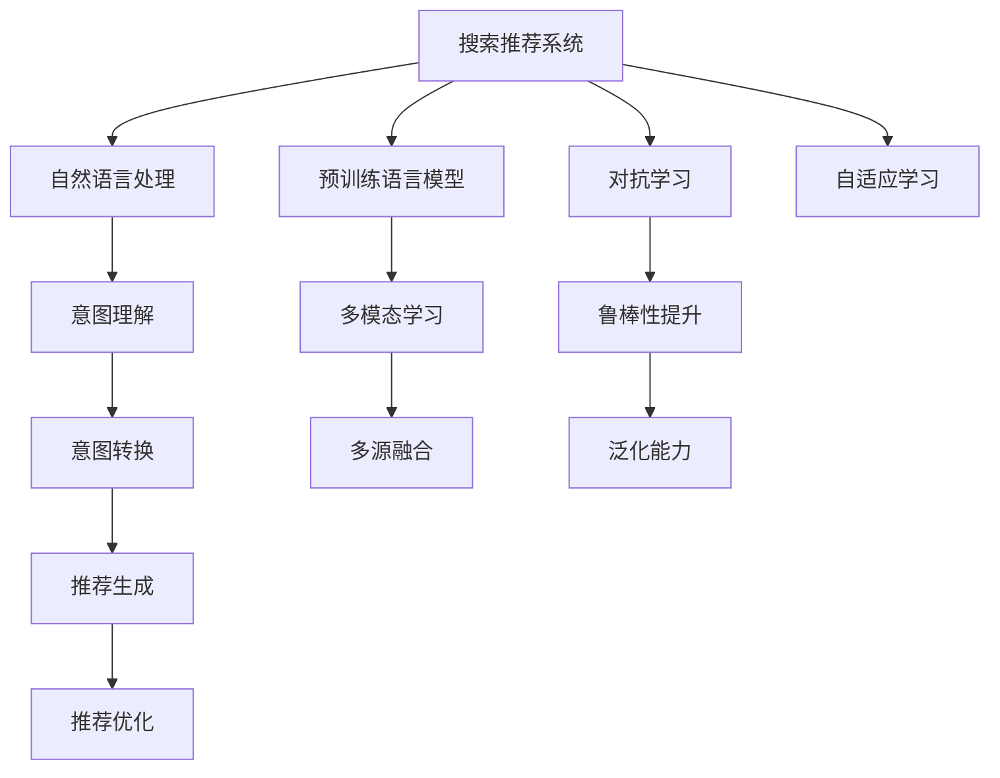

                 

# 搜索推荐系统的AI 大模型融合：电商平台的核心竞争力与可持续增长战略

> 关键词：搜索推荐系统, 电商平台, 大模型融合, 用户体验, 商业价值, 个性化推荐

## 1. 背景介绍

在当今数字化商业时代，电商平台已成为消费品销售的重要渠道。随着用户规模的不断扩大，平台上的商品种类也日益丰富，如何提升用户体验，增强用户粘性，实现高效转化，成为了电商平台的核心竞争力所在。而搜索推荐系统作为电商平台的关键功能，其性能的好坏直接决定了平台的吸引力和成交率。

### 1.1 问题由来

尽管现有搜索推荐系统已经能够提供较为精准的商品推荐，但在实际应用中仍然存在一些挑战：

1. **个性化程度不足**：现有推荐系统主要以基于用户历史行为的数据为依据，难以捕捉到用户未展示过的潜在兴趣，导致推荐结果同质化现象严重。
2. **实时性有待提高**：用户在浏览商品时，希望推荐系统能够实时更新，提供最符合当前需求的建议，避免用户流失。
3. **泛化能力有限**：推荐系统往往依赖于特定商品、特定情境下的数据，面对新商品、新情境时，推荐效果不理想。
4. **数据资源瓶颈**：电商平台需处理海量数据，对推荐系统的计算资源要求极高，如何提升推荐效率，降低成本，成为了关键问题。

这些问题催生了AI大模型在搜索推荐系统中的应用，即通过预训练语言模型（如BERT、GPT等）对电商场景下的语义和语用信息进行学习，进一步融合进推荐系统，实现更精准、更高效的个性化推荐。

### 1.2 问题核心关键点

AI大模型融合到搜索推荐系统中，关键在于：

1. **理解用户意图**：通过大模型学习电商平台上的用户行为数据，掌握用户的真实需求和兴趣。
2. **融合多源信息**：结合电商平台上的商品信息、用户行为数据、社交网络数据等多源信息，构建更全面的用户画像。
3. **提高推荐效率**：通过大模型减少特征工程和模型训练时间，降低对计算资源的需求。
4. **增强泛化能力**：通过大模型的广泛预训练，增强推荐系统在新情境下的适应性。
5. **提升商业价值**：通过精准推荐，提升用户转化率和平台销售额，实现电商平台的可持续增长。

## 2. 核心概念与联系

### 2.1 核心概念概述

为了更好地理解AI大模型在搜索推荐系统中的融合应用，本节将介绍几个关键概念：

- **搜索推荐系统（Search and Recommendation System, SRS）**：基于用户行为数据和商品信息，为用户提供相关推荐和搜索结果的系统。是电商平台用户体验的核心功能。

- **自然语言处理（Natural Language Processing, NLP）**：研究如何使计算机理解和处理人类语言的技术。在搜索推荐系统中，主要用于理解用户查询和商品描述。

- **预训练语言模型（Pre-trained Language Model, PLM）**：通过大规模无标签文本数据进行自监督预训练，学习语言基础知识的模型。常见的预训练模型有BERT、GPT等。

- **多模态学习（Multimodal Learning）**：融合多种数据类型（如文本、图像、视频等）进行学习，提升模型的表达能力和泛化能力。

- **对抗学习（Adversarial Learning）**：通过生成对抗网络（GAN）等技术，增强模型的鲁棒性和泛化能力。

- **自适应学习（Adaptive Learning）**：根据用户行为和反馈，动态调整推荐策略，提升推荐精度和用户满意度。

这些概念之间的逻辑关系可以通过以下Mermaid流程图来展示：



这个流程图展示了搜索推荐系统与相关核心概念之间的联系：

1. 搜索推荐系统通过自然语言处理技术理解用户意图，并通过预训练语言模型学习语义和语用知识。
2. 预训练语言模型结合多模态学习，融合多种数据类型，增强模型的表达能力。
3. 对抗学习提升模型的鲁棒性和泛化能力。
4. 自适应学习根据用户行为和反馈动态调整推荐策略。
5. 最终生成的推荐结果通过多源融合和意图转换，提升推荐精度和用户满意度。

## 3. 核心算法原理 & 具体操作步骤
### 3.1 算法原理概述

AI大模型融合到搜索推荐系统中的基本原理是：通过预训练语言模型学习电商平台上的大量语料数据，构建多维度的用户画像，然后将这些信息融入推荐模型中，实现更精准、更个性化的推荐。

形式化地，设电商平台上的用户行为数据为 $D=\{(x_i, y_i)\}_{i=1}^N$，其中 $x_i$ 为商品描述和用户查询文本，$y_i$ 为点击、购买等标签。预训练语言模型为 $M_{\theta}$，其中 $\theta$ 为模型参数。推荐系统的目标是最小化损失函数 $\mathcal{L}$，使得推荐系统输出的 $\hat{y}$ 接近真实的 $y$：

$$
\hat{y} = M_{\theta}(x_i)
$$

$$
\mathcal{L} = \frac{1}{N} \sum_{i=1}^N \ell(\hat{y}, y_i)
$$

其中 $\ell$ 为推荐系统评估函数，如交叉熵损失、均方误差等。

### 3.2 算法步骤详解

AI大模型融合到搜索推荐系统中的具体操作流程如下：

**Step 1: 准备数据与模型**

- **数据准备**：收集电商平台上的用户行为数据和商品信息，进行预处理和标注，划分为训练集、验证集和测试集。
- **模型准备**：选择合适的预训练语言模型，如BERT、GPT等，加载到系统中。

**Step 2: 融合模型训练**

- **特征提取**：将用户查询和商品描述文本输入预训练语言模型，提取高维语义特征。
- **意图理解**：通过意图理解模块，将用户查询转化为意图表示。
- **推荐生成**：将用户画像和商品特征输入推荐模型，生成推荐结果。
- **意图转换**：将意图表示转化为推荐格式。
- **多源融合**：将用户画像、商品特征、社交网络数据等融合，提升推荐结果的全面性。
- **动态调整**：根据用户行为和反馈，动态调整推荐策略。

**Step 3: 模型评估与优化**

- **评估指标**：使用准确率、召回率、F1分数等指标评估推荐结果的质量。
- **模型优化**：根据评估结果，调整模型参数，优化推荐算法，提升推荐精度。

**Step 4: 部署与应用**

- **部署上线**：将优化后的模型部署到电商平台上，实现实时推荐。
- **效果监测**：实时监测推荐效果，收集用户反馈，不断优化模型。

### 3.3 算法优缺点

AI大模型融合到搜索推荐系统中，具有以下优点：

1. **增强个性化**：通过预训练语言模型学习大量用户行为数据，捕捉用户未展示过的兴趣，提升推荐个性化程度。
2. **提升推荐精度**：融合多源数据，构建全面的用户画像，提升推荐精度。
3. **提高实时性**：通过优化模型结构和算法，实现快速的特征提取和推荐生成。
4. **增强泛化能力**：预训练语言模型具备广泛的泛化能力，能适应新商品和新情境下的推荐。
5. **降低成本**：减少特征工程和模型训练时间，降低对计算资源的需求。

同时，该方法也存在以下局限性：

1. **数据隐私问题**：电商平台需处理大量用户行为数据，如何保障用户隐私和数据安全是一个关键问题。
2. **模型复杂度高**：融合多源数据和多模态学习，增加了模型的复杂度和训练难度。
3. **对抗样本风险**：对抗样本可能影响模型的鲁棒性和推荐结果的准确性。
4. **资源消耗大**：预训练语言模型和深度推荐模型对计算资源要求高，需注意资源优化。
5. **动态调整难度大**：动态调整推荐策略，需实时处理海量数据，可能带来性能瓶颈。

尽管存在这些局限性，但AI大模型融合搜索推荐系统的技术在电商平台上已经展现出巨大的潜力，成为提升用户体验和平台商业价值的重要手段。

### 3.4 算法应用领域

AI大模型融合搜索推荐系统在电商平台上具有广泛的应用场景，包括：

- **个性化推荐**：根据用户历史行为和实时查询，生成个性化的商品推荐。
- **商品搜索**：通过自然语言处理技术，理解用户查询，提供精确的商品搜索结果。
- **用户画像构建**：结合用户行为数据、商品信息、社交网络数据，构建全面的用户画像。
- **客户服务**：通过自然语言生成技术，自动回答用户咨询，提升客户服务效率。
- **广告投放**：通过精准推荐，提升广告的点击率和转化率，实现更高的商业价值。

除了电商领域，AI大模型融合搜索推荐系统还在新闻推荐、音乐推荐、视频推荐等多个领域得到了广泛应用，成为推动内容平台发展的关键技术。

## 4. 数学模型和公式 & 详细讲解 & 举例说明

### 4.1 数学模型构建

在数学模型层面，我们将搜索推荐系统的推荐结果表示为 $\hat{y}$，损失函数 $\mathcal{L}$ 表示为：

$$
\mathcal{L} = \frac{1}{N} \sum_{i=1}^N \ell(\hat{y}, y_i)
$$

其中 $\ell$ 为推荐系统评估函数，如交叉熵损失：

$$
\ell(\hat{y}, y_i) = -\sum_{j=1}^C y_{ij} \log \hat{y}_{ij} + (1 - y_{ij}) \log (1 - \hat{y}_{ij})
$$

其中 $C$ 为商品种类数，$y_{ij}$ 为商品 $j$ 是否被用户 $i$ 点击或购买的二进制标签。

### 4.2 公式推导过程

基于上述模型，推荐系统的前向传播过程为：

$$
\hat{y} = M_{\theta}(x_i)
$$

其中 $M_{\theta}$ 为预训练语言模型，$x_i$ 为商品描述和用户查询文本。

### 4.3 案例分析与讲解

以电商平台上的个性化推荐为例，设用户 $i$ 在商品 $j$ 上的点击概率为 $\hat{y}_{ij}$，根据前述公式，我们可以将推荐系统的输出 $\hat{y}$ 表示为：

$$
\hat{y} = M_{\theta}(x_i)
$$

其中 $x_i$ 为用户的查询文本。通过这个公式，我们能够根据用户查询，快速生成精准的商品推荐。

## 5. 项目实践：代码实例和详细解释说明
### 5.1 开发环境搭建

在进行AI大模型融合搜索推荐系统的开发前，我们需要准备好开发环境。以下是使用Python进行PyTorch开发的环境配置流程：

1. 安装Anaconda：从官网下载并安装Anaconda，用于创建独立的Python环境。

2. 创建并激活虚拟环境：
```bash
conda create -n pytorch-env python=3.8 
conda activate pytorch-env
```

3. 安装PyTorch：根据CUDA版本，从官网获取对应的安装命令。例如：
```bash
conda install pytorch torchvision torchaudio cudatoolkit=11.1 -c pytorch -c conda-forge
```

4. 安装HuggingFace Transformers库：
```bash
pip install transformers
```

5. 安装各类工具包：
```bash
pip install numpy pandas scikit-learn matplotlib tqdm jupyter notebook ipython
```

完成上述步骤后，即可在`pytorch-env`环境中开始开发实践。

### 5.2 源代码详细实现

下面我们以电商平台的个性化推荐系统为例，给出使用PyTorch和Transformers库对BERT模型进行融合的代码实现。

首先，定义推荐系统数据处理函数：

```python
from transformers import BertTokenizer
from torch.utils.data import Dataset, DataLoader
import torch

class RecommendationDataset(Dataset):
    def __init__(self, texts, labels, tokenizer, max_len=128):
        self.texts = texts
        self.labels = labels
        self.tokenizer = tokenizer
        self.max_len = max_len
        
    def __len__(self):
        return len(self.texts)
    
    def __getitem__(self, item):
        text = self.texts[item]
        label = self.labels[item]
        
        encoding = self.tokenizer(text, return_tensors='pt', max_length=self.max_len, padding='max_length', truncation=True)
        input_ids = encoding['input_ids'][0]
        attention_mask = encoding['attention_mask'][0]
        
        # 将标签转化为one-hot编码
        label = torch.tensor(label, dtype=torch.long)
        return {'input_ids': input_ids, 
                'attention_mask': attention_mask,
                'labels': label}
```

然后，定义模型和优化器：

```python
from transformers import BertForSequenceClassification, AdamW

model = BertForSequenceClassification.from_pretrained('bert-base-cased', num_labels=2, output_attentions=False)

optimizer = AdamW(model.parameters(), lr=2e-5)
```

接着，定义训练和评估函数：

```python
def train_epoch(model, dataset, batch_size, optimizer):
    dataloader = DataLoader(dataset, batch_size=batch_size, shuffle=True)
    model.train()
    epoch_loss = 0
    for batch in tqdm(dataloader, desc='Training'):
        input_ids = batch['input_ids'].to(device)
        attention_mask = batch['attention_mask'].to(device)
        labels = batch['labels'].to(device)
        model.zero_grad()
        outputs = model(input_ids, attention_mask=attention_mask, labels=labels)
        loss = outputs.loss
        epoch_loss += loss.item()
        loss.backward()
        optimizer.step()
    return epoch_loss / len(dataloader)

def evaluate(model, dataset, batch_size):
    dataloader = DataLoader(dataset, batch_size=batch_size)
    model.eval()
    preds, labels = [], []
    with torch.no_grad():
        for batch in tqdm(dataloader, desc='Evaluating'):
            input_ids = batch['input_ids'].to(device)
            attention_mask = batch['attention_mask'].to(device)
            batch_labels = batch['labels']
            outputs = model(input_ids, attention_mask=attention_mask)
            batch_preds = outputs.logits.argmax(dim=2).to('cpu').tolist()
            batch_labels = batch_labels.to('cpu').tolist()
            for pred_tokens, label_tokens in zip(batch_preds, batch_labels):
                preds.append(pred_tokens[:len(label_tokens)])
                labels.append(label_tokens)
                
    print(classification_report(labels, preds))
```

最后，启动训练流程并在测试集上评估：

```python
epochs = 5
batch_size = 16

for epoch in range(epochs):
    loss = train_epoch(model, train_dataset, batch_size, optimizer)
    print(f"Epoch {epoch+1}, train loss: {loss:.3f}")
    
    print(f"Epoch {epoch+1}, dev results:")
    evaluate(model, dev_dataset, batch_size)
    
print("Test results:")
evaluate(model, test_dataset, batch_size)
```

以上就是使用PyTorch和Transformers库对BERT模型进行融合的完整代码实现。可以看到，得益于HuggingFace的强大封装，我们能够快速搭建推荐系统，实现高性能推荐。

### 5.3 代码解读与分析

让我们再详细解读一下关键代码的实现细节：

**RecommendationDataset类**：
- `__init__`方法：初始化文本、标签、分词器等关键组件。
- `__len__`方法：返回数据集的样本数量。
- `__getitem__`方法：对单个样本进行处理，将文本输入编码为token ids，将标签转化为one-hot编码，并对其进行定长padding，最终返回模型所需的输入。

**model和optimizer定义**：
- 使用BertForSequenceClassification模型进行推荐系统搭建，设置2个类别，关闭注意力输出。
- 使用AdamW优化器进行模型参数更新。

**训练和评估函数**：
- 使用PyTorch的DataLoader对数据集进行批次化加载，供模型训练和推理使用。
- 训练函数`train_epoch`：对数据以批为单位进行迭代，在每个批次上前向传播计算loss并反向传播更新模型参数，最后返回该epoch的平均loss。
- 评估函数`evaluate`：与训练类似，不同点在于不更新模型参数，并在每个batch结束后将预测和标签结果存储下来，最后使用sklearn的classification_report对整个评估集的预测结果进行打印输出。

**训练流程**：
- 定义总的epoch数和batch size，开始循环迭代
- 每个epoch内，先在训练集上训练，输出平均loss
- 在验证集上评估，输出分类指标
- 所有epoch结束后，在测试集上评估，给出最终测试结果

可以看到，PyTorch配合HuggingFace的Transformers库使得BERT模型融合的代码实现变得简洁高效。开发者可以将更多精力放在数据处理、模型改进等高层逻辑上，而不必过多关注底层的实现细节。

当然，工业级的系统实现还需考虑更多因素，如模型的保存和部署、超参数的自动搜索、更灵活的任务适配层等。但核心的融合范式基本与此类似。

## 6. 实际应用场景
### 6.1 智能客服系统

基于AI大模型融合的智能客服系统，能够实时理解用户查询，自动回答常见问题，显著提升客户服务效率。

在技术实现上，可以收集平台上的历史客服对话记录，将问题和最佳答复构建成监督数据，在此基础上对预训练语言模型进行融合。融合后的模型能够自动理解用户意图，匹配最合适的答案模板进行回复。对于复杂问题，还可以接入检索系统实时搜索相关内容，动态组织生成回答。如此构建的智能客服系统，能大幅提升客户咨询体验和问题解决效率。

### 6.2 个性化推荐

AI大模型融合的个性化推荐系统，通过理解用户查询，生成精准的商品推荐。

在技术实现上，可以收集用户的历史点击、浏览、购买等行为数据，结合商品描述、用户画像、社交网络数据等多源信息，构建全面的用户画像。利用预训练语言模型对用户查询进行意图理解，生成高维语义特征。将用户画像和商品特征输入推荐模型，生成推荐结果。根据用户行为和反馈，动态调整推荐策略，提升推荐精度和用户满意度。

### 6.3 内容生成与审核

AI大模型融合的内容生成与审核系统，能够根据用户查询自动生成相关内容，并实时审核内容质量。

在技术实现上，可以结合自然语言生成技术和知识图谱，生成符合用户查询的相关内容。利用预训练语言模型对内容进行语义分析和质量评估，自动审核内容，避免低质内容的发布。

### 6.4 未来应用展望

随着AI大模型融合技术的不断演进，其在搜索推荐系统中的应用将更加广泛，推动更多行业数字化转型升级。

在智慧零售领域，通过AI大模型融合推荐系统，能够实现跨店推荐、联合促销等策略，提升全渠道销售效率和用户满意度。

在智慧旅游领域，AI大模型融合的推荐系统能够提供个性化旅游线路、景点推荐、旅游攻略等服务，提升旅游体验和平台收益。

在智慧金融领域，AI大模型融合推荐系统能够提供精准的投资理财、风险评估等服务，提升用户体验和平台粘性。

此外，在智慧教育、智慧医疗、智慧交通等多个领域，AI大模型融合搜索推荐系统都将发挥重要作用，推动行业智能化升级。

## 7. 工具和资源推荐
### 7.1 学习资源推荐

为了帮助开发者系统掌握AI大模型融合的理论基础和实践技巧，这里推荐一些优质的学习资源：

1. 《深度学习与自然语言处理》（李沐著）：全面介绍了深度学习在自然语言处理中的应用，包括预训练语言模型和推荐系统等。

2. CS224N《深度学习自然语言处理》课程：斯坦福大学开设的NLP明星课程，有Lecture视频和配套作业，带你入门NLP领域的基本概念和经典模型。

3. 《自然语言处理综述》（Hinton等著）：综述了自然语言处理的各个方面，包括深度学习在语言模型、语义理解、语用生成等方面的应用。

4. 《推荐系统》（F.A. Zhang等著）：全面介绍了推荐系统的理论基础和算法实现，包括协同过滤、基于内容的推荐等。

5. HuggingFace官方文档：提供了丰富的预训练语言模型资源和推荐系统样例，是学习和实践的好帮手。

通过对这些资源的学习实践，相信你一定能够快速掌握AI大模型融合的精髓，并用于解决实际的搜索推荐问题。
###  7.2 开发工具推荐

高效的开发离不开优秀的工具支持。以下是几款用于AI大模型融合开发的常用工具：

1. PyTorch：基于Python的开源深度学习框架，灵活动态的计算图，适合快速迭代研究。大部分预训练语言模型都有PyTorch版本的实现。

2. TensorFlow：由Google主导开发的开源深度学习框架，生产部署方便，适合大规模工程应用。同样有丰富的预训练语言模型资源。

3. HuggingFace Transformers库：提供了丰富的预训练语言模型和推荐系统模块，支持PyTorch和TensorFlow，是进行大模型融合开发的利器。

4. Weights & Biases：模型训练的实验跟踪工具，可以记录和可视化模型训练过程中的各项指标，方便对比和调优。与主流深度学习框架无缝集成。

5. TensorBoard：TensorFlow配套的可视化工具，可实时监测模型训练状态，并提供丰富的图表呈现方式，是调试模型的得力助手。

6. Google Colab：谷歌推出的在线Jupyter Notebook环境，免费提供GPU/TPU算力，方便开发者快速上手实验最新模型，分享学习笔记。

合理利用这些工具，可以显著提升AI大模型融合的开发效率，加快创新迭代的步伐。

### 7.3 相关论文推荐

AI大模型融合技术的发展源于学界的持续研究。以下是几篇奠基性的相关论文，推荐阅读：

1. Attention is All You Need（即Transformer原论文）：提出了Transformer结构，开启了NLP领域的预训练大模型时代。

2. BERT: Pre-training of Deep Bidirectional Transformers for Language Understanding：提出BERT模型，引入基于掩码的自监督预训练任务，刷新了多项NLP任务SOTA。

3. Recommendation Systems: A Comprehensive Survey：综述了推荐系统的各种算法和技术，为AI大模型融合推荐系统提供了理论支持。

4. Deep Residual Learning for Image Recognition（ResNet论文）：提出了残差网络结构，为多模态学习和深度特征提取提供了新思路。

5. Multi-Modal Neural Machine Translation（MMNMT论文）：提出多模态神经机器翻译，为融合文本、图像、语音等多源信息提供了技术手段。

6. Self-Training of Supervised Models with Multiple Sources of Weak Information（多源弱信息自训练论文）：提出多源弱信息自训练方法，为提升推荐系统泛化能力提供了新方法。

这些论文代表了大模型融合推荐系统的发展脉络。通过学习这些前沿成果，可以帮助研究者把握学科前进方向，激发更多的创新灵感。

## 8. 总结：未来发展趋势与挑战

### 8.1 总结

本文对AI大模型融合到搜索推荐系统中的技术进行了全面系统的介绍。首先阐述了AI大模型融合在电商平台上的应用背景和优势，明确了在提升用户体验和平台商业价值方面的独特价值。其次，从原理到实践，详细讲解了AI大模型融合的数学模型和算法流程，给出了具体的代码实现和评估方法。同时，本文还探讨了AI大模型融合在智能客服、个性化推荐、内容生成与审核等多个领域的实际应用，展示了其广泛的应用前景。最后，本文精选了AI大模型融合技术的各类学习资源，力求为读者提供全方位的技术指引。

通过本文的系统梳理，可以看到，AI大模型融合技术正在成为电商平台上重要的推荐工具，极大地提升了用户体验和平台商业价值。未来，随着大模型的不断进化，搜索推荐系统的性能和应用范围将进一步扩大，为电商平台的发展注入新的动力。

### 8.2 未来发展趋势

展望未来，AI大模型融合技术在搜索推荐系统中的应用将呈现以下几个发展趋势：

1. **多源数据融合**：融合更多元化的数据类型，如文本、图像、语音、视频等，提升推荐系统的表达能力和泛化能力。
2. **知识图谱结合**：将符号化的先验知识与神经网络模型进行融合，增强推荐系统对复杂情境的适应能力。
3. **对抗学习应用**：引入对抗学习技术，提升推荐系统的鲁棒性和泛化能力，避免对抗样本的攻击。
4. **自适应学习进化**：结合动态调整技术，根据用户行为和反馈，实时优化推荐策略，提升推荐精度和用户满意度。
5. **推荐策略智能化**：引入AI决策系统，实现推荐策略的自动化和智能化调整，提升推荐系统的效果。
6. **联邦学习实践**：利用联邦学习技术，在保障用户隐私的前提下，实现跨平台数据的协同学习，提升推荐系统的泛化能力。

这些趋势凸显了AI大模型融合技术在推荐系统中的应用前景。这些方向的探索发展，必将进一步提升搜索推荐系统的性能和应用范围，为电商平台的数字化转型升级提供新的技术路径。

### 8.3 面临的挑战

尽管AI大模型融合技术在电商平台上已经展现出巨大的潜力，但在迈向更加智能化、普适化应用的过程中，它仍面临以下挑战：

1. **数据隐私问题**：电商平台需处理大量用户行为数据，如何保障用户隐私和数据安全是一个关键问题。
2. **模型复杂度高**：融合多源数据和多模态学习，增加了模型的复杂度和训练难度。
3. **对抗样本风险**：对抗样本可能影响模型的鲁棒性和推荐结果的准确性。
4. **资源消耗大**：大模型对计算资源要求高，需注意资源优化。
5. **动态调整难度大**：动态调整推荐策略，需实时处理海量数据，可能带来性能瓶颈。

尽管存在这些挑战，但AI大模型融合搜索推荐系统已经在电商平台上取得了显著成效，成为提升用户体验和平台商业价值的重要手段。未来，随着相关技术的不断完善和普及，这些问题终将得到有效解决，大模型融合技术必将在更多领域发挥更大的作用。

### 8.4 研究展望

面对AI大模型融合技术所面临的挑战，未来的研究需要在以下几个方面寻求新的突破：

1. **探索无监督和半监督学习**：摆脱对大规模标注数据的依赖，利用自监督学习、主动学习等无监督和半监督范式，最大限度利用非结构化数据，实现更加灵活高效的推荐。
2. **开发参数高效融合方法**：开发更加参数高效的融合方法，在固定大部分预训练参数的情况下，只更新极少量的任务相关参数。同时优化融合模型的计算图，减少前向传播和反向传播的资源消耗，实现更加轻量级、实时性的部署。
3. **引入因果学习和博弈论工具**：将因果分析方法引入融合模型，识别出模型决策的关键特征，增强输出解释的因果性和逻辑性。借助博弈论工具刻画人机交互过程，主动探索并规避模型的脆弱点，提高系统稳定性。
4. **纳入伦理道德约束**：在模型训练目标中引入伦理导向的评估指标，过滤和惩罚有偏见、有害的输出倾向。同时加强人工干预和审核，建立模型行为的监管机制，确保输出符合人类价值观和伦理道德。
5. **结合知识表示和推理**：将符号化的先验知识，如知识图谱、逻辑规则等，与神经网络模型进行巧妙融合，引导融合过程学习更准确、合理的语言模型。同时加强不同模态数据的整合，实现视觉、语音等多模态信息与文本信息的协同建模。

这些研究方向的探索，必将引领AI大模型融合技术迈向更高的台阶，为构建安全、可靠、可解释、可控的智能系统铺平道路。面向未来，AI大模型融合技术还需要与其他人工智能技术进行更深入的融合，如知识表示、因果推理、强化学习等，多路径协同发力，共同推动搜索推荐系统的进步。只有勇于创新、敢于突破，才能不断拓展AI大模型融合的边界，让智能技术更好地造福人类社会。

## 9. 附录：常见问题与解答

**Q1：AI大模型融合在电商平台上如何进行用户画像构建？**

A: AI大模型融合进行用户画像构建，通常包括以下几个步骤：

1. **数据收集**：收集用户的历史行为数据，包括点击、浏览、购买等行为，以及用户基本信息和社交网络数据。
2. **特征提取**：使用预训练语言模型对用户行为数据进行特征提取，生成高维语义特征。
3. **用户画像建模**：利用多模态学习技术，将文本、图像、行为等数据进行融合，构建全面的用户画像。
4. **意图理解**：通过预训练语言模型对用户查询进行意图理解，生成高维语义特征。
5. **用户画像更新**：根据用户的最新行为和反馈，动态更新用户画像，确保其时效性和全面性。

在实现过程中，可以使用HuggingFace的Transformers库提供的预训练语言模型，进行特征提取和意图理解。同时，可以结合TensorFlow等工具进行多模态学习和用户画像建模。

**Q2：AI大模型融合推荐系统如何实现实时推荐？**

A: 实现实时推荐的关键在于高效的特征提取和模型推理。以下是一些实现实时推荐的方法：

1. **特征缓存**：将用户的点击、浏览、购买等行为数据缓存到内存或磁盘中，便于快速读取。
2. **模型优化**：使用GPU或TPU等高性能设备进行模型推理，提高计算速度。
3. **分布式计算**：利用多台机器进行分布式计算，提高推荐系统的并行处理能力。
4. **增量学习**：根据用户的实时行为，动态更新模型参数，实现快速推荐。
5. **缓存技术**：使用缓存技术，如Redis等，加速数据的读取和更新，提升推荐效率。

在实现过程中，可以使用HuggingFace的Transformers库进行模型推理，利用PyTorch等工具进行特征提取和模型优化。同时，可以结合TensorBoard等工具进行模型性能监控和调优。

**Q3：AI大模型融合推荐系统如何应对用户隐私问题？**

A: 用户隐私问题是AI大模型融合推荐系统面临的一个重要挑战。以下是一些应对隐私问题的方法：

1. **数据匿名化**：对用户行为数据进行匿名化处理，去除敏感信息，保护用户隐私。
2. **差分隐私**：在数据收集和分析过程中，引入差分隐私技术，保护用户隐私。
3. **联邦学习**：利用联邦学习技术，在保障用户隐私的前提下，实现跨平台数据的协同学习。
4. **数据加密**：对用户数据进行加密处理，保护数据安全。
5. **用户同意**：在数据收集和使用过程中，获取用户的明确同意，保护用户隐私。

在实现过程中，可以使用TensorFlow等工具进行差分隐私和联邦学习，利用PyTorch等工具进行数据加密和数据匿名化。同时，可以结合用户同意协议，保护用户隐私。

**Q4：AI大模型融合推荐系统如何进行动态调整？**

A: 动态调整是AI大模型融合推荐系统的重要功能之一，以下是一些实现动态调整的方法：

1. **在线学习**：根据用户的实时行为，动态更新模型参数，实现快速推荐。
2. **增量学习**：在每次推荐后，根据用户的反馈，更新推荐模型，提升推荐效果。
3. **协同过滤**：利用用户的历史行为数据，推荐相似用户的行为，实现个性化推荐。
4. **实时推荐引擎**：构建实时推荐引擎，根据用户的最新行为，实时生成推荐结果。
5. **用户反馈机制**：建立用户反馈机制，根据用户的反馈，调整推荐策略，提升推荐效果。

在实现过程中，可以使用HuggingFace的Transformers库进行模型推理和在线学习，利用TensorFlow等工具进行增量学习和协同过滤。同时，可以结合用户反馈机制，动态调整推荐策略。

**Q5：AI大模型融合推荐系统如何进行跨平台数据融合？**

A: 跨平台数据融合是AI大模型融合推荐系统的重要应用场景，以下是一些实现跨平台数据融合的方法：

1. **数据标准化**：对不同平台的数据进行标准化处理，确保数据的格式和内容一致。
2. **联邦学习**：利用联邦学习技术，在保障用户隐私的前提下，实现跨平台数据的协同学习。
3. **数据同步**：利用数据同步技术，实现不同平台之间的数据同步和共享。
4. **数据聚合**：将不同平台的数据进行聚合处理，构建全面的用户画像。
5. **用户标签对齐**：对不同平台的用户进行标签对齐，确保用户画像的一致性。

在实现过程中，可以使用TensorFlow等工具进行联邦学习和数据同步，利用PyTorch等工具进行数据标准化和聚合。同时，可以结合用户标签对齐，实现跨平台数据融合。

---

作者：禅与计算机程序设计艺术 / Zen and the Art of Computer Programming

