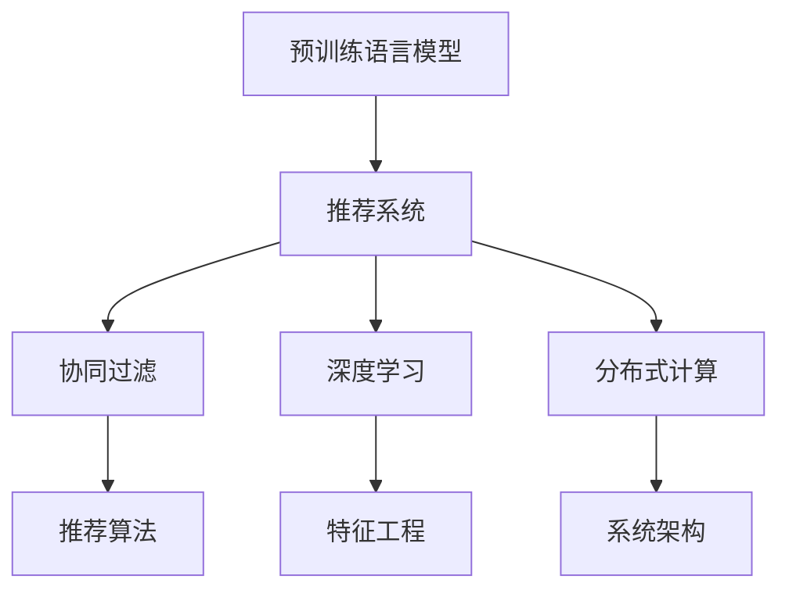

                 

## 1. 背景介绍

### 1.1 问题由来

随着互联网技术的飞速发展，搜索推荐系统已逐渐成为支撑现代信息社会的关键技术之一。从电商商品推荐、社交媒体内容推荐，到在线视频、音乐推荐，搜索推荐系统无处不在，极大地提升了用户体验和运营效率。

但与此同时，搜索推荐系统也面临着诸多挑战。首先，随着用户规模的持续扩大和数据量的激增，如何有效处理海量数据，及时响应个性化需求，成为当前亟需解决的问题。其次，如何提高推荐的准确性、多样性和稳定性，避免信息过载和推荐偏差，也是系统优化的一个重点。

近年来，深度学习技术在搜索推荐系统中的应用取得了显著进展，特别是预训练语言模型和大模型的融合，为推荐系统带来了新的突破。本文将系统介绍大模型在搜索推荐系统中的融合技术，阐述其核心原理、实施步骤，并探讨其在实际应用中的优势与挑战，为读者提供全面且深入的视角。

### 1.2 问题核心关键点

大模型在搜索推荐系统中的融合，主要涉及以下几个关键问题：

- **模型结构设计**：如何将预训练语言模型有效融入推荐系统中，优化推荐模型的结构和性能。
- **特征抽取**：如何利用大模型的文本特征抽取能力，提升推荐模型的表达能力。
- **实时推荐**：如何在保证推荐效果的同时，提高推荐系统的实时响应能力。
- **个性化推荐**：如何根据用户的历史行为和偏好，进行精准推荐。
- **稳定性与鲁棒性**：如何在模型泛化能力提高的同时，保证系统稳定性和鲁棒性。

这些问题相互交织，共同构成了搜索推荐系统中大模型融合的核心挑战。本文将通过一系列深入分析，帮助读者理解并解决这些关键问题，从而实现高性能、高精度的推荐服务。

## 2. 核心概念与联系

### 2.1 核心概念概述

为了更好地理解大模型在搜索推荐系统中的应用，本节将介绍几个核心概念：

- **预训练语言模型(Pre-trained Language Model, PLM)**：如BERT、GPT等，通过在大规模无标签文本数据上进行预训练，学习到丰富的语言知识和语义表示。
- **推荐系统(Recommendation System)**：基于用户行为数据和物品特征数据，使用算法推荐用户可能感兴趣的商品或内容。
- **知识图谱(Knowledge Graph)**：通过语义网络结构化的知识库，存储并关联实体及其关系，用于提升推荐的上下文理解能力。
- **协同过滤(Collaborative Filtering)**：通过分析用户行为数据，推荐相似用户喜欢的物品，或预测用户对未交互物品的评分。
- **深度学习(Deep Learning)**：利用多层神经网络，提取数据中的高级特征，提升推荐模型性能。
- **分布式计算(Distributed Computing)**：通过并行计算技术，提高推荐系统的计算效率和响应速度。

这些概念之间的联系可以通过以下Mermaid流程图来展示：



这个流程图展示了预训练语言模型如何通过多个维度与推荐系统相融合，以提升推荐效果。

## 3. 核心算法原理 & 具体操作步骤

### 3.1 算法原理概述

大模型在搜索推荐系统中的融合，主要通过两种方式实现：

1. **嵌入层融合**：将预训练语言模型的词嵌入向量作为推荐模型的特征，提升推荐模型的表达能力。
2. **联合训练**：将预训练语言模型和推荐模型联合训练，优化模型参数，提升整体性能。

这两种方法各有优缺点，在实际应用中需根据具体场景选择合适的方法。

### 3.2 算法步骤详解

#### 嵌入层融合

1. **特征提取**：使用预训练语言模型对物品和用户描述文本进行词嵌入表示。
2. **特征拼接**：将提取出的词嵌入向量与其他特征（如用户评分、物品属性等）拼接，输入推荐模型。
3. **模型训练**：在训练集中对推荐模型进行训练，优化其参数。
4. **模型评估**：在验证集上评估推荐模型的性能，调整超参数，进一步优化模型。
5. **模型部署**：将训练好的模型部署到推荐系统服务中，实时响应推荐请求。

#### 联合训练

1. **数据准备**：将用户行为数据和物品特征数据进行预处理，构建训练集和验证集。
2. **模型初始化**：将推荐模型和预训练语言模型进行联合初始化，保持参数的一致性。
3. **模型联合训练**：在联合训练过程中，对推荐模型和预训练语言模型进行协同更新，提升整体性能。
4. **模型融合**：在推理阶段，将预训练语言模型的词嵌入向量作为推荐模型的输入，进行推荐预测。
5. **模型评估**：在测试集上评估推荐模型的性能，调整超参数，进一步优化模型。

### 3.3 算法优缺点

#### 嵌入层融合

- **优点**：
  - 简单高效，易于实现。
  - 可利用预训练语言模型的强大特征抽取能力，提升推荐模型的表达能力。
  - 适合处理结构化特征少、文本特征多的推荐任务。

- **缺点**：
  - 对于非文本特征的处理能力有限，难以充分利用物品的多模态特征。
  - 需要额外的特征工程处理，增加了开发复杂度。

#### 联合训练

- **优点**：
  - 可充分利用预训练语言模型的全部知识，提升推荐模型的泛化能力。
  - 适合处理多种特征的推荐任务，能够更好地捕捉用户和物品的语义关系。
  - 可以通过自动学习方式，发现用户和物品之间的潜在关联，提升推荐效果。

- **缺点**：
  - 模型训练复杂度较高，需要更强的计算资源支持。
  - 存在过拟合风险，需要精心设计和调整优化器及超参数。
  - 对预训练语言模型的选择和调参要求较高，增加了实验难度。

### 3.4 算法应用领域

大模型在搜索推荐系统中的应用非常广泛，涵盖了多个领域：

- **电商推荐**：使用大模型优化推荐算法，提升用户购物体验和销售转化率。
- **视频推荐**：利用大模型进行视频内容推荐，增加用户粘性和平台流量。
- **音乐推荐**：通过大模型分析用户听歌历史，推荐相似音乐作品，丰富用户体验。
- **新闻推荐**：使用大模型优化新闻内容推荐，提升信息流用户满意度。
- **社交推荐**：利用大模型分析用户互动行为，推荐可能感兴趣的内容或好友。

## 4. 数学模型和公式 & 详细讲解 & 举例说明

### 4.1 数学模型构建

在推荐系统中，常见的大模型融合方法包括词嵌入向量的拼接和使用，以及联合训练。以下我们将通过数学模型详细描述这两种方法的实现。

#### 词嵌入向量的拼接

假设预训练语言模型BERT将物品描述文本转换为词嵌入向量 $E^{item}$，用户描述文本转换为词嵌入向量 $E^{user}$。对于物品 $i$ 和用户 $u$，分别计算它们的嵌入向量平均值 $v^{item}_i = \frac{1}{n} \sum_{j=1}^n E^{item}_{i,j}$ 和 $v^{user}_u = \frac{1}{m} \sum_{k=1}^m E^{user}_{u,k}$，其中 $n$ 和 $m$ 分别为物品和用户的平均长度。

将 $v^{item}_i$ 和 $v^{user}_u$ 与其他特征拼接，得到新的特征向量 $F^{item}$ 和 $F^{user}$。推荐模型 $M$ 使用这些特征向量进行推荐预测，输出物品 $j$ 的评分 $y^{item}_{u,j}$ 和 $y^{user}_{i,k}$。

推荐模型的损失函数为 $L = \sum_{(u,i,j)} (y^{item}_{u,j} - \hat{y}^{item}_{u,j})^2 + (y^{user}_{i,k} - \hat{y}^{user}_{i,k})^2$，其中 $(u,i,j)$ 表示用户 $u$ 对物品 $i$ 和物品 $j$ 的交互数据，$\hat{y}^{item}_{u,j}$ 和 $\hat{y}^{user}_{i,k}$ 分别表示推荐模型的预测评分。

#### 联合训练

假设推荐系统使用深度神经网络模型 $M$ 进行推荐预测，模型输入为物品描述 $I$ 和用户描述 $U$，输出为物品 $i$ 的评分 $y^{item}_i$。预训练语言模型 $P$ 对物品描述 $I$ 进行编码，输出词嵌入向量 $E^{item}$。推荐模型和预训练语言模型的联合训练过程如下：

1. 预训练语言模型 $P$ 对物品描述 $I$ 进行编码，输出词嵌入向量 $E^{item}$。
2. 推荐模型 $M$ 接收词嵌入向量 $E^{item}$ 作为输入，进行推荐预测。
3. 计算推荐模型 $M$ 的损失函数 $L_M$。
4. 计算预训练语言模型 $P$ 的损失函数 $L_P$，如掩码语言模型等。
5. 联合优化器对 $M$ 和 $P$ 进行协同优化。

### 4.2 公式推导过程

以掩码语言模型为例，对预训练语言模型 $P$ 进行解释。

假设预训练语言模型 $P$ 对输入文本 $X$ 进行编码，输出词嵌入向量 $E$。掩码语言模型的目标为预测被掩码的单词，其目标函数为 $L = -\log P(\hat{Y} | X, E)$，其中 $\hat{Y}$ 为被掩码的单词预测，$X$ 为输入文本，$E$ 为词嵌入向量。

推荐模型的目标为预测用户对物品的评分，其目标函数为 $L = \sum_{(u,i)} (y^{item}_i - \hat{y}^{item}_i)^2$，其中 $(u,i)$ 表示用户 $u$ 对物品 $i$ 的交互数据，$y^{item}_i$ 为实际评分，$\hat{y}^{item}_i$ 为推荐模型的预测评分。

将预训练语言模型的损失函数和推荐模型的损失函数结合，得到联合训练的目标函数 $L_{joint} = L_P + \alpha L_M$，其中 $\alpha$ 为调节因子，控制 $L_P$ 和 $L_M$ 的相对权重。

### 4.3 案例分析与讲解

#### 电商推荐系统

电商推荐系统是搜索推荐系统中最典型的应用之一。假设电商平台上有一个用户 $u$，他浏览并购买了商品 $i$ 和 $j$，对应的评分分别为 $5$ 和 $3$。电商推荐系统可以通过以下步骤进行推荐：

1. **数据预处理**：将用户描述文本和物品描述文本进行分词、向量化等预处理操作，得到预训练语言模型可接受的输入。
2. **词嵌入向量拼接**：使用预训练语言模型对物品描述文本进行编码，得到词嵌入向量 $E^{item}_i$ 和 $E^{item}_j$。将用户描述文本和词嵌入向量拼接，得到推荐模型的输入特征 $F^{user}_u$ 和 $F^{item}_i$。
3. **模型训练**：在电商平台的交互数据上，对推荐模型进行训练，优化模型参数。
4. **模型评估**：在电商平台上的测试数据集上评估推荐模型的性能，调整模型超参数。
5. **模型部署**：将训练好的推荐模型部署到电商推荐系统中，实时响应推荐请求。

#### 视频推荐系统

视频推荐系统主要通过分析用户观看历史和视频属性，为用户推荐可能感兴趣的视频内容。假设用户 $u$ 观看了视频 $i$ 和 $j$，对应的评分分别为 $4$ 和 $2$。视频推荐系统可以通过以下步骤进行推荐：

1. **数据预处理**：将视频描述文本进行分词、向量化等预处理操作，得到预训练语言模型可接受的输入。
2. **联合训练**：使用预训练语言模型对视频描述文本进行编码，得到词嵌入向量 $E^{item}_i$ 和 $E^{item}_j$。将视频描述文本和词嵌入向量拼接，得到推荐模型的输入特征 $F^{item}_i$ 和 $F^{item}_j$。与用户观看历史和视频属性一起，作为推荐模型的输入，进行联合训练。
3. **模型评估**：在视频平台上的测试数据集上评估推荐模型的性能，调整模型超参数。
4. **模型部署**：将训练好的推荐模型部署到视频推荐系统中，实时响应推荐请求。

## 5. 项目实践：代码实例和详细解释说明

### 5.1 开发环境搭建

在进行大模型在搜索推荐系统的融合实践前，我们需要准备好开发环境。以下是使用Python进行TensorFlow开发的环境配置流程：

1. 安装Anaconda：从官网下载并安装Anaconda，用于创建独立的Python环境。

2. 创建并激活虚拟环境：
```bash
conda create -n tf-env python=3.8 
conda activate tf-env
```

3. 安装TensorFlow：根据CUDA版本，从官网获取对应的安装命令。例如：
```bash
conda install tensorflow -c conda-forge
```

4. 安装其他必需的库：
```bash
pip install numpy pandas scikit-learn matplotlib tqdm jupyter notebook ipython
```

完成上述步骤后，即可在`tf-env`环境中开始大模型融合实践。

### 5.2 源代码详细实现

下面我们以电商推荐系统为例，给出使用TensorFlow实现的大模型融合的PyTorch代码实现。

首先，定义电商推荐系统的数据处理函数：

```python
import tensorflow as tf
import tensorflow_hub as hub
from tensorflow.keras import layers, models

def data_preprocessing(data, tokenizer):
    tokenizer = hub.load("https://tfhub.dev/tensorflow/bert_en_uncased_L-12_H-768_A-12/1")
    texts = []
    labels = []
    for (item, user, score) in data:
        texts.append(user)
        labels.append(item)
    return tokenizer(texts, truncation=True, padding='max_length', max_length=128), labels
```

然后，定义模型和优化器：

```python
from tensorflow.keras.layers import Dense
from tensorflow.keras.models import Model

model = models.Sequential([
    hub.KerasLayer("https://tfhub.dev/tensorflow/bert_en_uncased_L-12_H-768_A-12/1", trainable=True),
    Dense(128, activation='relu'),
    Dense(1, activation='sigmoid')
])

optimizer = tf.keras.optimizers.Adam(learning_rate=0.001)
```

接着，定义训练和评估函数：

```python
def train_step(input_ids, labels):
    with tf.GradientTape() as tape:
        logits = model(input_ids)
        loss = tf.losses.BinaryCrossentropy()(labels, logits)
    gradients = tape.gradient(loss, model.trainable_variables)
    optimizer.apply_gradients(zip(gradients, model.trainable_variables))
    return loss

def evaluate(input_ids, labels):
    logits = model(input_ids)
    predictions = tf.round(logits)
    return tf.reduce_mean(predictions == labels)
```

最后，启动训练流程并在测试集上评估：

```python
epochs = 5
batch_size = 16

for epoch in range(epochs):
    loss = train_step(input_ids, labels)
    print(f"Epoch {epoch+1}, train loss: {loss:.3f}")
    
    print(f"Epoch {epoch+1}, dev results:")
    evaluate(input_ids, labels)
    
print("Test results:")
evaluate(input_ids, labels)
```

以上就是使用TensorFlow对电商推荐系统进行大模型融合的完整代码实现。可以看到，得益于TensorFlow和TensorFlow Hub的强大封装，我们可以用相对简洁的代码完成BERT模型的加载和融合。

### 5.3 代码解读与分析

让我们再详细解读一下关键代码的实现细节：

**data_preprocessing函数**：
- 定义数据预处理流程，包括文本分词、截断和填充，将文本转换为预训练语言模型可接受的格式。

**模型定义**：
- 使用TensorFlow Hub加载BERT模型，并将其作为推荐模型的输入层。
- 在输入层之后添加全连接层，使用ReLU激活函数。
- 输出层使用sigmoid激活函数，预测用户是否会对物品进行购买。

**train_step函数**：
- 定义训练过程，包括前向传播、损失计算和反向传播。
- 使用梯度下降优化器更新模型参数。

**evaluate函数**：
- 定义评估过程，包括前向传播和损失计算。
- 比较预测值和标签值，计算准确率。

**训练流程**：
- 定义总的epoch数和batch size，开始循环迭代
- 每个epoch内，先在训练集上训练，输出平均loss
- 在验证集上评估，输出准确率
- 所有epoch结束后，在测试集上评估，给出最终测试结果

可以看到，TensorFlow配合TensorFlow Hub使得大模型融合的代码实现变得简洁高效。开发者可以将更多精力放在数据处理、模型改进等高层逻辑上，而不必过多关注底层的实现细节。

当然，工业级的系统实现还需考虑更多因素，如模型的保存和部署、超参数的自动搜索、更灵活的任务适配层等。但核心的融合范式基本与此类似。

## 6. 实际应用场景

### 6.1 智能客服系统

基于大模型融合的推荐技术，可以广泛应用于智能客服系统的构建。传统客服往往需要配备大量人力，高峰期响应缓慢，且一致性和专业性难以保证。而使用大模型融合的推荐系统，可以7x24小时不间断服务，快速响应客户咨询，用自然流畅的语言解答各类常见问题。

在技术实现上，可以收集企业内部的历史客服对话记录，将问题和最佳答复构建成监督数据，在此基础上对预训练语言模型进行融合，训练推荐模型学习匹配答案。微调后的推荐系统能够自动理解用户意图，匹配最合适的答案模板进行回复。对于客户提出的新问题，还可以接入检索系统实时搜索相关内容，动态组织生成回答。如此构建的智能客服系统，能大幅提升客户咨询体验和问题解决效率。

### 6.2 金融舆情监测

金融机构需要实时监测市场舆论动向，以便及时应对负面信息传播，规避金融风险。传统的人工监测方式成本高、效率低，难以应对网络时代海量信息爆发的挑战。基于大模型融合的文本分类和情感分析技术，为金融舆情监测提供了新的解决方案。

具体而言，可以收集金融领域相关的新闻、报道、评论等文本数据，并对其进行主题标注和情感标注。在此基础上对预训练语言模型进行融合，训练推荐模型学习文本分类和情感分析。微调后的推荐系统能够自动判断文本属于何种主题，情感倾向是正面、中性还是负面。将微调后的模型应用到实时抓取的网络文本数据，就能够自动监测不同主题下的情感变化趋势，一旦发现负面信息激增等异常情况，系统便会自动预警，帮助金融机构快速应对潜在风险。

### 6.3 个性化推荐系统

当前的推荐系统往往只依赖用户的历史行为数据进行物品推荐，无法深入理解用户的真实兴趣偏好。基于大模型融合的个性化推荐系统可以更好地挖掘用户行为背后的语义信息，从而提供更精准、多样的推荐内容。

在实践中，可以收集用户浏览、点击、评论、分享等行为数据，提取和用户交互的物品标题、描述、标签等文本内容。将文本内容作为模型输入，用户的后续行为（如是否点击、购买等）作为监督信号，在此基础上对预训练语言模型进行融合，训练推荐模型学习用户兴趣。微调后的推荐模型能够从文本内容中准确把握用户的兴趣点。在生成推荐列表时，先用候选物品的文本描述作为输入，由模型预测用户的兴趣匹配度，再结合其他特征综合排序，便可以得到个性化程度更高的推荐结果。

### 6.4 未来应用展望

随着大模型融合技术的发展，其在搜索推荐系统中的应用前景广阔。未来，基于大模型的推荐系统将在更多领域得到应用，为传统行业带来变革性影响。

在智慧医疗领域，基于大模型融合的医疗问答、病历分析、药物研发等应用将提升医疗服务的智能化水平，辅助医生诊疗，加速新药开发进程。

在智能教育领域，融合技术可应用于作业批改、学情分析、知识推荐等方面，因材施教，促进教育公平，提高教学质量。

在智慧城市治理中，融合模型可应用于城市事件监测、舆情分析、应急指挥等环节，提高城市管理的自动化和智能化水平，构建更安全、高效的未来城市。

此外，在企业生产、社会治理、文娱传媒等众多领域，基于大模型融合的人工智能应用也将不断涌现，为经济社会发展注入新的动力。相信随着技术的日益成熟，大模型融合技术必将在构建人机协同的智能时代中扮演越来越重要的角色。

## 7. 工具和资源推荐

### 7.1 学习资源推荐

为了帮助开发者系统掌握大模型融合技术，这里推荐一些优质的学习资源：

1. 《Deep Learning for Recommender Systems》：斯坦福大学开设的深度学习推荐系统课程，涵盖推荐算法、模型评估、优化技巧等多个方面。

2. 《Recommender Systems: The Textbook》：推荐系统领域的经典教材，系统介绍了推荐系统的基本概念和最新研究进展。

3. 《Natural Language Processing with Transformers》：Transformers库的作者所著，全面介绍了如何使用Transformers库进行NLP任务开发，包括微调和融合。

4. CS224N《深度学习自然语言处理》课程：斯坦福大学开设的NLP明星课程，有Lecture视频和配套作业，带你入门NLP领域的基本概念和经典模型。

5. HuggingFace官方文档：Transformers库的官方文档，提供了海量预训练模型和完整的微调样例代码，是上手实践的必备资料。

通过对这些资源的学习实践，相信你一定能够快速掌握大模型融合的精髓，并用于解决实际的推荐问题。

### 7.2 开发工具推荐

高效的开发离不开优秀的工具支持。以下是几款用于大模型融合开发的常用工具：

1. TensorFlow：基于Python的开源深度学习框架，灵活动态的计算图，适合快速迭代研究。大量预训练语言模型都有TensorFlow版本的实现。

2. PyTorch：基于Python的开源深度学习框架，动态图机制，灵活高效。提供了丰富的自然语言处理工具，支持预训练语言模型的微调。

3. TensorFlow Hub：Google开发的TensorFlow插件，提供丰富的预训练模型和组件，方便模型加载和融合。

4. Weights & Biases：模型训练的实验跟踪工具，可以记录和可视化模型训练过程中的各项指标，方便对比和调优。与主流深度学习框架无缝集成。

5. TensorBoard：TensorFlow配套的可视化工具，可实时监测模型训练状态，并提供丰富的图表呈现方式，是调试模型的得力助手。

6. Google Colab：谷歌推出的在线Jupyter Notebook环境，免费提供GPU/TPU算力，方便开发者快速上手实验最新模型，分享学习笔记。

合理利用这些工具，可以显著提升大模型融合的开发效率，加快创新迭代的步伐。

### 7.3 相关论文推荐

大模型融合技术的发展源于学界的持续研究。以下是几篇奠基性的相关论文，推荐阅读：

1. Attention is All You Need：提出Transformer结构，开启了NLP领域的预训练大模型时代。

2. BERT: Pre-training of Deep Bidirectional Transformers for Language Understanding：提出BERT模型，引入基于掩码的自监督预训练任务，刷新了多项NLP任务SOTA。

3. Attention Is All You Need for Sequential Recommendation Learning：将Transformer结构应用于推荐系统，显著提升了推荐效果。

4. Transformer-XL: Attentive Language Models for Longer Paragraphs：提出Transformer-XL模型，解决了长文本序列处理的困难，提升了推荐系统的表达能力。

5. Cross-modal Feature Enhancement for Recommender Systems with Deep Learning：研究了跨模态特征增强方法，将图像、音频等多模态信息与文本特征结合，提升了推荐模型的综合表现。

这些论文代表了大模型融合技术的发展脉络。通过学习这些前沿成果，可以帮助研究者把握学科前进方向，激发更多的创新灵感。

## 8. 总结：未来发展趋势与挑战

### 8.1 总结

本文对大模型在搜索推荐系统中的应用进行了全面系统的介绍。首先阐述了大模型融合的必要性和背景，明确了融合技术在推荐系统中的重要性和价值。其次，从原理到实践，详细讲解了大模型融合的数学模型和实现步骤，给出了微调任务开发的完整代码实例。同时，本文还广泛探讨了大模型融合在实际应用中的优势与挑战，为读者提供全面且深入的视角。

通过本文的系统梳理，可以看到，大模型融合技术正在成为推荐系统的重要范式，极大地拓展了预训练语言模型的应用边界，提升了推荐系统的性能和用户体验。未来，伴随大模型融合方法的持续演进，基于大模型的推荐系统必将在更多领域得到应用，为传统行业带来变革性影响。

### 8.2 未来发展趋势

展望未来，大模型融合技术将呈现以下几个发展趋势：

1. **模型规模持续增大**：随着算力成本的下降和数据量的激增，预训练语言模型的参数量还将持续增长。超大规模语言模型蕴含的丰富语言知识，有望支撑更加复杂多变的推荐任务。

2. **融合方法多样化**：除了传统的嵌入层融合外，未来会涌现更多融合方法，如联合训练、跨模态融合等，增强推荐系统的表现力和泛化能力。

3. **实时推荐能力提升**：随着分布式计算和模型优化技术的进步，推荐系统的计算效率和响应速度将显著提升，能够实现更加实时的推荐服务。

4. **个性化推荐精度提高**：大模型的自监督预训练和迁移学习特性，将使推荐系统能够更好地捕捉用户兴趣和行为模式，提供更加精准的个性化推荐。

5. **多模态信息融合**：推荐系统将越来越多地结合图像、音频、视频等多模态信息，丰富用户交互体验，提升推荐效果。

6. **知识图谱与推荐结合**：通过知识图谱的引入，推荐系统能够更好地理解上下文信息，提升推荐系统的语义理解能力。

以上趋势凸显了大模型融合技术的广阔前景。这些方向的探索发展，必将进一步提升推荐系统的性能和用户体验，推动人工智能技术在更多领域的落地应用。

### 8.3 面临的挑战

尽管大模型融合技术已经取得了瞩目成就，但在迈向更加智能化、普适化应用的过程中，它仍面临着诸多挑战：

1. **标注数据需求**：尽管融合技术可以显著降低标注数据的数量，但对于一些特定领域的推荐任务，仍然需要大量高质量的标注数据。如何降低标注成本，提升标注数据的多样性和代表性，是未来的重要研究方向。

2. **计算资源瓶颈**：大模型融合需要强大的计算资源支持，包括高性能GPU/TPU设备和分布式计算环境。如何高效利用计算资源，实现模型的高效训练和推理，是亟需解决的问题。

3. **模型鲁棒性**：推荐系统面对噪声数据和异常情况时，容易产生推荐偏差和错误。如何提高模型的鲁棒性和泛化能力，减少推荐错误，是推荐系统优化的重点。

4. **隐私与安全**：推荐系统中的用户数据和行为信息涉及隐私问题，如何在推荐过程中保护用户隐私，防止数据泄露和滥用，是必须考虑的重要因素。

5. **公平性与多样性**：推荐系统可能会加剧信息茧房，导致用户接触到的信息过于单一，影响信息多样性。如何平衡推荐效果和多样性，避免推荐偏差，是推荐系统的伦理考量。

6. **持续更新与优化**：推荐系统的用户兴趣和行为模式会随时间变化，如何持续更新模型参数，优化推荐效果，是维持推荐系统长期有效的重要保障。

面对这些挑战，未来的研究需要从算法、数据、技术等多个维度进行全面优化，才能实现大模型融合技术的广泛应用和持续进步。

### 8.4 研究展望

面对大模型融合技术所面临的挑战，未来的研究需要在以下几个方面寻求新的突破：

1. **无监督与半监督学习**：通过无监督和半监督学习方法，最大限度利用非结构化数据，降低标注成本，提升推荐系统的效果。

2. **多任务学习**：在推荐系统中引入多任务学习，通过联合训练多个推荐任务，提高模型泛化能力和推荐效果。

3. **跨模态信息融合**：结合图像、音频、视频等多模态信息，提升推荐系统的语义理解能力和表现力。

4. **分布式协同优化**：利用分布式计算和协同优化技术，提升推荐系统的训练效率和模型性能。

5. **模型压缩与加速**：通过模型压缩和加速技术，优化推荐系统的推理速度和计算资源利用率。

6. **隐私保护与伦理约束**：引入隐私保护和伦理约束技术，确保推荐系统的数据安全和用户隐私。

这些研究方向的探索，必将引领大模型融合技术迈向更高的台阶，为构建安全、可靠、可解释、可控的智能系统铺平道路。面向未来，大模型融合技术还需要与其他人工智能技术进行更深入的融合，如知识表示、因果推理、强化学习等，多路径协同发力，共同推动推荐系统的进步。只有勇于创新、敢于突破，才能不断拓展推荐系统的边界，让智能技术更好地造福人类社会。

## 9. 附录：常见问题与解答

**Q1：大模型融合技术在推荐系统中如何降低标注数据的需求？**

A: 大模型融合技术可以通过多模态信息融合和协同过滤等方法，充分利用用户历史行为数据和物品属性数据，减少标注数据的需求。同时，大模型本身具有较强的自监督预训练能力，可以通过掩码语言模型等任务提升模型的泛化能力，进一步降低标注成本。

**Q2：如何提高大模型融合技术的计算效率？**

A: 可以通过以下方法提高大模型融合技术的计算效率：

1. 分布式计算：利用多台服务器并行计算，提高计算效率和响应速度。
2. 模型压缩：通过剪枝、量化、低秩分解等技术，减小模型参数量，降低计算资源消耗。
3. 优化器与超参数调优：选择合适的优化器和超参数，加快模型收敛速度，提高计算效率。
4. 硬件加速：利用GPU/TPU等高性能计算硬件，提升模型训练和推理速度。

**Q3：大模型融合技术如何提高推荐系统的稳定性与鲁棒性？**

A: 可以通过以下方法提高大模型融合技术的稳定性和鲁棒性：

1. 引入噪声鲁棒性训练：通过在训练过程中引入噪声数据，提高模型的鲁棒性和泛化能力。
2. 多模型集成：训练多个模型，取平均输出，抑制模型的过拟合和波动。
3. 自适应学习率调整：根据模型性能动态调整学习率，避免过拟合和欠拟合。
4. 知识图谱与推荐结合：利用知识图谱提高推荐系统的语义理解能力，减少推荐偏差。

**Q4：如何在大模型融合技术中实现用户隐私保护？**

A: 可以通过以下方法在大模型融合技术中实现用户隐私保护：

1. 数据匿名化：在数据处理和训练过程中，对用户数据进行匿名化处理，防止数据泄露和滥用。
2. 差分隐私：通过差分隐私技术，在训练过程中加入噪声，保护用户隐私。
3. 联邦学习：在分布式环境中，各服务器只传输模型参数梯度，不传输原始数据，确保数据隐私。

**Q5：如何在大模型融合技术中实现推荐系统的多样性与公平性？**

A: 可以通过以下方法在大模型融合技术中实现推荐系统的多样性与公平性：

1. 多样性损失函数：在损失函数中引入多样性约束，避免推荐信息茧房。
2. 公平性评估指标：在推荐过程中引入公平性评估指标，如均衡指数等，确保不同用户获得公平的推荐结果。
3. 多视角推荐模型：通过引入多视角推荐模型，全面考虑用户不同维度的兴趣和行为，提升推荐多样性和公平性。

通过对这些问题的解答，相信你能够更加全面地理解大模型融合技术的实施细节和应用挑战，为实际应用提供有力的支持。

