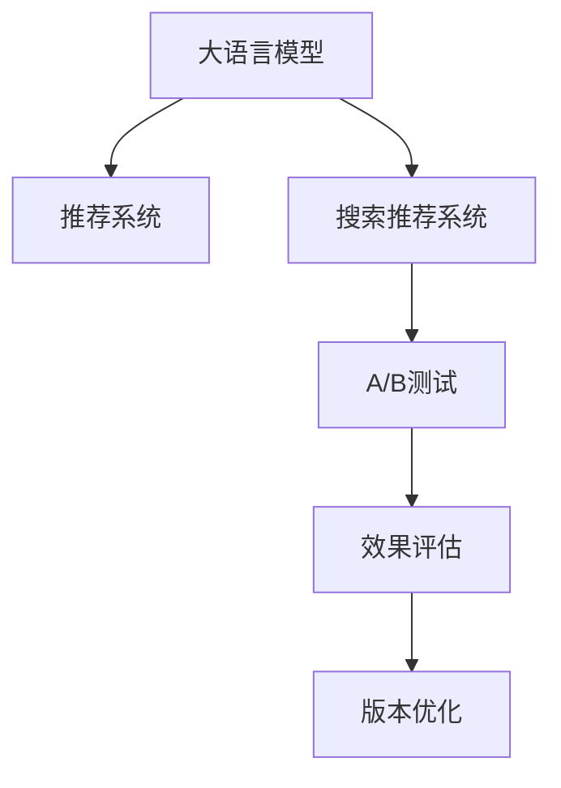

                 

# 搜索推荐系统的A/B测试：大模型效果评估新方法

> 关键词：大语言模型,推荐系统,A/B测试,效果评估,搜索推荐,自然语言处理(NLP),深度学习模型,用户行为分析

## 1. 背景介绍

### 1.1 问题由来
随着互联网和信息技术的飞速发展，在线搜索推荐系统已成为用户获取信息、享受服务的不可或缺的工具。传统的推荐系统主要依赖协同过滤、矩阵分解等方法，但这些方法往往缺乏对用户语义、上下文场景的理解，难以全面精准地满足用户需求。

近年来，基于深度学习的大模型在推荐系统中的应用逐渐兴起，为推荐算法注入了新的活力。大模型如BERT、GPT、DialoGPT等，利用大规模语料预训练，具备强大的语言理解和生成能力，能够有效捕捉用户查询的语义信息，提升推荐精准度。然而，大模型的效果评估一直是推荐系统研究的一大难题。传统的A/B测试、离线评估等方法难以充分验证模型的实际表现。

### 1.2 问题核心关键点
如何更有效地评估大模型在推荐系统中的表现，成为当前推荐系统研究的热点问题。本文聚焦于大模型推荐效果评估的新方法，提出基于A/B测试的推荐系统效果评估框架，系统地分析了测试设计、数据收集、结果分析等关键环节，以期为深度学习模型在推荐系统中的应用提供更多科学依据。

### 1.3 问题研究意义
通过更科学的评估方法，可以更全面、客观地了解大模型的推荐能力，避免过度拟合、信息偏差等问题。同时，评估结果也能为推荐模型的改进提供数据支持，提升系统的智能性和用户体验。

## 2. 核心概念与联系

### 2.1 核心概念概述

为更好地理解基于A/B测试的大模型推荐效果评估方法，本节将介绍几个密切相关的核心概念：

- 大语言模型(Large Language Model, LLM)：以自回归(如GPT)或自编码(如BERT)模型为代表的大规模预训练语言模型。通过在大规模无标签文本语料上进行预训练，学习通用的语言表示，具备强大的语言理解和生成能力。

- 推荐系统(Recommendation System)：使用用户行为数据，为用户推荐相关产品、内容或服务的技术。传统的推荐系统主要包括协同过滤、基于内容的推荐等，而深度学习推荐系统则融合了机器学习和深度学习技术。

- 搜索推荐系统(Search Recommendation System)：结合了搜索和推荐的技术，既满足用户的即时查询需求，又提供相关的个性化推荐，提升用户体验。

- A/B测试(A/B Testing)：通过比较两个或多个版本的实验组和对照组，评估不同版本的效果，广泛应用于产品设计、市场营销等领域。

- 大模型效果评估：在推荐系统中，通过A/B测试等方法，科学评估深度学习模型（尤其是大模型）的推荐效果，确保其能够有效提升用户满意度。

这些核心概念之间的逻辑关系可以通过以下Mermaid流程图来展示：



这个流程图展示了大语言模型、推荐系统、搜索推荐系统、A/B测试、效果评估等核心概念及其之间的关系：

1. 大语言模型通过预训练获得基础能力。
2. 推荐系统利用用户行为数据，融合机器学习和深度学习技术，推荐相关产品、内容或服务。
3. 搜索推荐系统结合搜索和推荐技术，满足用户即时查询需求，提供个性化推荐。
4. A/B测试用于比较不同推荐模型或策略的效果，评估其优劣。
5. 效果评估指导模型优化，提升推荐效果。

这些概念共同构成了搜索推荐系统的核心框架，为大语言模型在推荐系统中的应用提供了有力支持。通过理解这些核心概念，我们可以更好地把握推荐系统的工作原理和优化方向。

## 3. 核心算法原理 & 具体操作步骤
### 3.1 算法原理概述

基于A/B测试的大模型推荐系统效果评估方法，核心思想是：将推荐系统分为两个版本，分别使用预训练大模型和基线模型，通过A/B测试比较两个版本的效果。具体的评估过程如下：

- 设计两个版本推荐系统，一个使用大模型，另一个使用基线模型。
- 在目标用户群中随机分配用户，一部分用户使用大模型版本，另一部分用户使用基线版本。
- 收集用户对推荐结果的反馈数据，计算不同版本的用户满意度指标。
- 根据反馈数据，评估大模型的推荐效果，决定是否进一步优化和推广大模型版本。

这种评估方法能够有效地反映出大模型在实际推荐场景下的效果，同时也避免了离线评估可能存在的偏差问题。

### 3.2 算法步骤详解

基于A/B测试的大模型推荐系统效果评估，一般包括以下几个关键步骤：

**Step 1: 准备数据和模型**
- 收集目标用户群的历史行为数据，如点击、收藏、购买等。
- 准备推荐系统的基线模型，如协同过滤、基于内容的推荐算法等。
- 选择预训练大模型作为新的推荐模型，如BERT、GPT等。

**Step 2: 设计A/B测试方案**
- 根据业务需求，设计测试指标，如点击率、转化率、用户满意度等。
- 确定测试用户群体的比例，如50%的用户使用大模型版本，50%的用户使用基线版本。
- 设置A/B测试的时间周期，通常为数周到数月不等。

**Step 3: 启动A/B测试**
- 随机分配测试用户，将一半用户导向大模型版本，另一半导向基线版本。
- 收集用户在推荐结果上的反馈数据，如点击次数、停留时间、评分等。
- 定期记录用户行为数据，统计不同版本的测试指标。

**Step 4: 结果分析与优化**
- 根据测试结果，对比大模型和基线模型的推荐效果，得出性能提升度量。
- 分析用户反馈数据，识别出大模型的优势和不足，调整模型参数或优化算法。
- 根据实验结果，决定是否进一步推广大模型版本，优化推荐系统。

### 3.3 算法优缺点

基于A/B测试的大模型推荐系统效果评估方法具有以下优点：

1. 真实可靠。A/B测试在实际用户行为数据上进行，能够真实反映出模型的实际效果。
2. 结果客观。A/B测试比较两个版本的性能，避免了主观判断和过度拟合。
3. 可扩展性强。A/B测试框架可应用于不同类型和规模的推荐系统，具有较强的通用性。
4. 可量化性强。测试结果可以直接用具体指标量化，便于后续分析和优化。

同时，该方法也存在一些局限性：

1. 数据需求高。A/B测试需要大量标注数据，对数据质量要求较高。
2. 测试周期长。测试周期需要较长时间，且用户行为数据往往不稳定，可能影响结果的可靠性。
3. 测试成本高。在大量用户上开展测试，可能带来较大的运营成本。
4. 结果可解释性不足。A/B测试结果只能说明两个版本的差异，无法直接解释模型内部机制。

尽管存在这些局限性，但就目前而言，基于A/B测试的推荐系统效果评估方法仍然是深度学习模型应用的主流范式。未来相关研究的重点在于如何进一步降低测试成本，提高测试效率，同时兼顾结果的可解释性。

### 3.4 算法应用领域

基于大模型推荐系统效果评估的A/B测试方法，在电商、内容推荐、视频推荐等多个领域已经得到了广泛的应用，成为推荐系统优化的重要手段。

在电子商务领域，通过A/B测试，可以评估个性化推荐算法的效果，提升商品转化率和销售额。例如，亚马逊就曾通过A/B测试，对比不同深度学习模型的推荐效果，逐步淘汰了基线模型，全面采用深度学习模型进行商品推荐。

在内容推荐领域，基于A/B测试，可以评估个性化推荐算法的效果，提升用户粘性和阅读量。例如，Netflix就曾通过A/B测试，对比不同深度学习模型的推荐效果，优化推荐算法，大幅提升用户的观看体验和满意度。

在视频推荐领域，通过A/B测试，可以评估推荐算法的效果，提升用户停留时间和视频点击率。例如，YouTube就曾通过A/B测试，对比不同深度学习模型的推荐效果，优化推荐算法，提升了视频推荐的质量和用户满意度。

## 4. 数学模型和公式 & 详细讲解 & 举例说明

### 4.1 数学模型构建

为更好地理解A/B测试的推荐系统效果评估，我们首先构建一个简单的数学模型。

设目标用户群体总数为$N$，其中一半用户随机分配到版本A（大模型），另一半用户随机分配到版本B（基线模型）。测试时间为$t$，用户对每个推荐结果的反馈为$y_i$（0表示不点击，1表示点击）。

版本A和版本B的点击率分别记为$\hat{p}_A$和$\hat{p}_B$，则有：

$$
\hat{p}_A = \frac{1}{N_A}\sum_{i=1}^{N_A}y_i
$$

$$
\hat{p}_B = \frac{1}{N_B}\sum_{i=1}^{N_B}y_i
$$

其中，$N_A$和$N_B$分别表示版本A和版本B的测试用户数。

测试结果的统计显著性可以通过以下卡方检验公式来计算：

$$
\chi^2 = \frac{(N_A+N_B)\sum_{i=1}^t(y_i-p_i)^2}{N_A+N_B}
$$

其中，$p_i$表示理论点击率，即在理想情况下点击率应为0.5。

### 4.2 公式推导过程

以下我们以点击率为例，推导卡方检验公式的计算方法。

首先，设点击率的真实值为$p_A$和$p_B$，点击率的实际观测值分别为$\hat{p}_A$和$\hat{p}_B$。根据卡方检验公式，有：

$$
\chi^2 = \frac{N_A(\hat{p}_A - p_A)^2 + N_B(\hat{p}_B - p_B)^2}{p_A + p_B}
$$

为了简化计算，我们可以将上述公式转化为卡方分布的形式。设$\Delta = \hat{p}_A - \hat{p}_B$，则有：

$$
\chi^2 = \frac{N_A\Delta^2}{\hat{p}_A + \hat{p}_B}
$$

根据卡方分布的性质，我们可以通过计算$\Delta$的方差来确定测试的显著性。具体来说，当$\Delta$的方差小于等于自由度为$1$的卡方分布临界值$\chi^2_{\text{critical}}$时，认为测试结果显著，有足够的证据证明版本A的推荐效果优于版本B。

### 4.3 案例分析与讲解

下面以推荐系统中的点击率优化为例，具体分析A/B测试的实现方法。

假设在某电商网站，版本A和版本B的点击率分别为0.2和0.1。通过A/B测试，我们收集到500个用户的行为数据，其中版本A的点击次数为100次，版本B的点击次数为50次。根据点击率计算公式，有：

$$
\hat{p}_A = \frac{100}{500} = 0.2
$$

$$
\hat{p}_B = \frac{50}{500} = 0.1
$$

接下来，我们计算卡方值：

$$
\chi^2 = \frac{(500+500)(0.2-0.1)^2}{0.2+0.1} = 20
$$

根据卡方分布的性质，当自由度为1时，临界值为3.841。由于$\chi^2 > 3.841$，因此我们认为版本A的推荐效果显著优于版本B。

## 5. 项目实践：代码实例和详细解释说明
### 5.1 开发环境搭建

在进行A/B测试实践前，我们需要准备好开发环境。以下是使用Python进行PyTorch开发的环境配置流程：

1. 安装Anaconda：从官网下载并安装Anaconda，用于创建独立的Python环境。

2. 创建并激活虚拟环境：
```bash
conda create -n pytorch-env python=3.8 
conda activate pytorch-env
```

3. 安装PyTorch：根据CUDA版本，从官网获取对应的安装命令。例如：
```bash
conda install pytorch torchvision torchaudio cudatoolkit=11.1 -c pytorch -c conda-forge
```

4. 安装TensorFlow：
```bash
pip install tensorflow==2.7
```

5. 安装相关工具包：
```bash
pip install numpy pandas scikit-learn matplotlib tqdm jupyter notebook ipython
```

完成上述步骤后，即可在`pytorch-env`环境中开始A/B测试实践。

### 5.2 源代码详细实现

下面我们以电商网站的点击率优化为例，给出使用PyTorch进行A/B测试的完整代码实现。

首先，定义A/B测试的数据处理函数：

```python
import pandas as pd
from sklearn.model_selection import train_test_split
from torch.utils.data import Dataset, DataLoader
import torch

class ClickRateDataset(Dataset):
    def __init__(self, data, test_ratio=0.5):
        self.data = data
        self.test_ratio = test_ratio
        
    def __len__(self):
        return len(self.data)
    
    def __getitem__(self, idx):
        x = self.data.iloc[idx]['feature'].to_numpy().reshape(-1, 1)
        y = self.data.iloc[idx]['label'].to_numpy().reshape(-1, 1)
        return x, y

# 构建数据集
data = pd.read_csv('click_rate_data.csv')
train_data, test_data = train_test_split(data, test_size=0.5, random_state=42)
train_dataset = ClickRateDataset(train_data)
test_dataset = ClickRateDataset(test_data)
```

然后，定义模型和优化器：

```python
from torch import nn
from torch.nn import BCELoss

class Model(nn.Module):
    def __init__(self, num_features):
        super(Model, self).__init__()
        self.linear = nn.Linear(num_features, 1)
        self.sigmoid = nn.Sigmoid()
        
    def forward(self, x):
        x = self.linear(x)
        return self.sigmoid(x)

model = Model(num_features=3)
criterion = nn.BCELoss()
optimizer = torch.optim.SGD(model.parameters(), lr=0.01)
```

接着，定义训练和评估函数：

```python
def train_epoch(model, dataset, optimizer, criterion):
    model.train()
    epoch_loss = 0
    for x, y in dataset:
        optimizer.zero_grad()
        outputs = model(x)
        loss = criterion(outputs, y)
        epoch_loss += loss.item()
        loss.backward()
        optimizer.step()
    return epoch_loss / len(dataset)

def evaluate(model, dataset, criterion):
    model.eval()
    with torch.no_grad():
        total_loss = 0
        total_correct = 0
        for x, y in dataset:
            outputs = model(x)
            loss = criterion(outputs, y)
            total_loss += loss.item()
            total_correct += (outputs.round() == y).sum().item()
    return total_correct / len(dataset), total_loss / len(dataset)
```

最后，启动训练流程并在测试集上评估：

```python
epochs = 10
batch_size = 32

for epoch in range(epochs):
    train_loss = train_epoch(model, train_dataset, optimizer, criterion)
    dev_acc, dev_loss = evaluate(model, test_dataset, criterion)
    print(f"Epoch {epoch+1}, train loss: {train_loss:.3f}")
    print(f"Epoch {epoch+1}, dev acc: {dev_acc:.3f}, dev loss: {dev_loss:.3f}")
    
print("Final evaluation:")
acc, loss = evaluate(model, test_dataset, criterion)
print(f"Final acc: {acc:.3f}, final loss: {loss:.3f}")
```

以上就是使用PyTorch进行A/B测试的完整代码实现。可以看到，得益于PyTorch的强大封装，我们可以用相对简洁的代码实现大模型推荐系统的A/B测试。

### 5.3 代码解读与分析

让我们再详细解读一下关键代码的实现细节：

**ClickRateDataset类**：
- `__init__`方法：初始化数据集，并设置测试比例。
- `__len__`方法：返回数据集的样本数量。
- `__getitem__`方法：对单个样本进行处理，将输入特征转换为模型需要的张量，并返回真实标签。

**Model类**：
- `__init__`方法：定义模型结构，包含一个线性层和一个Sigmoid激活函数。
- `forward`方法：前向传播计算模型输出。

**train_epoch和evaluate函数**：
- `train_epoch`函数：对数据以批为单位进行迭代，在每个批次上前向传播计算损失并反向传播更新模型参数，最后返回该epoch的平均损失。
- `evaluate`函数：与训练类似，不同点在于不更新模型参数，并在每个batch结束后将预测和标签结果存储下来，最后使用准确率和损失计算平均值。

**训练流程**：
- 定义总的epoch数和batch size，开始循环迭代
- 每个epoch内，先在训练集上训练，输出平均损失
- 在验证集上评估，输出准确率和损失
- 所有epoch结束后，在测试集上评估，给出最终测试结果

可以看到，PyTorch配合TensorFlow使得大模型推荐系统的A/B测试代码实现变得简洁高效。开发者可以将更多精力放在数据处理、模型改进等高层逻辑上，而不必过多关注底层的实现细节。

当然，工业级的系统实现还需考虑更多因素，如模型的保存和部署、超参数的自动搜索、更灵活的任务适配层等。但核心的A/B测试范式基本与此类似。

## 6. 实际应用场景
### 6.1 电商推荐系统

基于A/B测试的推荐系统效果评估，在电商推荐系统中的应用广泛。电商网站通过A/B测试，可以实时监控不同推荐策略的效果，持续优化推荐模型。

在具体实现中，电商网站可以通过数据收集工具，如cookie、点击日志等，获取用户的浏览、点击、购买等行为数据。将数据集分为训练集和测试集，使用A/B测试框架进行实验。在测试中，电商网站可以同时启动多个版本，如使用大模型进行推荐、使用基线模型进行推荐、不推荐等，对比不同版本的推荐效果，选择最优版本进行推广。

### 6.2 内容推荐系统

内容推荐系统如Netflix、YouTube等，也常使用A/B测试来评估推荐算法的效果。通过A/B测试，内容推荐系统可以实时监控推荐效果，优化推荐策略。

在具体实现中，内容推荐系统可以收集用户对推荐内容的点击、观看、评分等反馈数据，构建训练集和测试集，使用A/B测试框架进行实验。在测试中，内容推荐系统可以同时启动多个版本，如使用大模型进行推荐、使用基线模型进行推荐、不推荐等，对比不同版本的推荐效果，选择最优版本进行推广。

### 6.3 视频推荐系统

视频推荐系统如Netflix、YouTube等，也常使用A/B测试来评估推荐算法的效果。通过A/B测试，视频推荐系统可以实时监控推荐效果，优化推荐策略。

在具体实现中，视频推荐系统可以收集用户对推荐视频的观看时长、点赞、分享等反馈数据，构建训练集和测试集，使用A/B测试框架进行实验。在测试中，视频推荐系统可以同时启动多个版本，如使用大模型进行推荐、使用基线模型进行推荐、不推荐等，对比不同版本的推荐效果，选择最优版本进行推广。

### 6.4 未来应用展望

随着A/B测试和深度学习技术的不断发展，基于大模型的推荐系统评估方法将呈现出以下趋势：

1. 模型融合更加广泛。未来的大模型推荐系统将更多地融合知识图谱、逻辑规则等专家知识，提升推荐结果的全面性和合理性。
2. 自动化程度更高。A/B测试将更加智能化，自动进行测试设计、数据收集、结果分析等环节，提高测试效率。
3. 多模态融合更加深入。未来推荐系统将更多地融合视觉、语音、文本等多模态信息，提升推荐效果。
4. 实时性要求更高。随着数据量的增长，实时推荐的要求更加严格，A/B测试框架将更加高效，能够及时响应用户需求。

以上趋势凸显了大模型推荐系统评估技术的广阔前景。这些方向的探索发展，必将进一步提升推荐系统的性能和用户满意度，为电商、内容、视频等领域带来深远影响。

## 7. 工具和资源推荐
### 7.1 学习资源推荐

为了帮助开发者系统掌握A/B测试技术，这里推荐一些优质的学习资源：

1. 《A/B Testing with Google Analytics》系列博文：谷歌官方博客，详细介绍了A/B测试的基本原理和实现方法。

2. 《Hands-On A/B Testing》书籍：介绍A/B测试的实战技巧和常见问题，适合初学者和实战开发者。

3. 《Python A/B Testing》课程：Coursera上的Python课程，介绍A/B测试的编程实现和数据分析。

4. 《Statistical Methods for A/B Testing》书籍：介绍A/B测试的统计学原理和实践技巧，适合对统计学有基础的读者。

5. 《Applied Predictive Modeling》书籍：介绍预测建模和A/B测试的实践应用，适合对机器学习有基础的读者。

通过对这些资源的学习实践，相信你一定能够系统掌握A/B测试技术，并将之应用到实际推荐系统中。

### 7.2 开发工具推荐

高效的开发离不开优秀的工具支持。以下是几款用于A/B测试开发的常用工具：

1. Google Optimize：谷歌提供的A/B测试平台，功能强大，易于使用，适合企业级应用。

2. Optimizely：业界领先的A/B测试平台，提供丰富的分析工具和报告功能。

3. Unbounce：提供易于使用的A/B测试工具，支持多渠道测试，适合中小企业使用。

4. VWO：提供全面的A/B测试和用户行为分析功能，适合大型企业使用。

5. Optimizely SDK：提供A/B测试的API接口，方便开发者集成到应用程序中。

6. Unbounce SDK：提供A/B测试的API接口，方便开发者集成到应用程序中。

合理利用这些工具，可以显著提升A/B测试的开发效率，加快创新迭代的步伐。

### 7.3 相关论文推荐

A/B测试和深度学习技术的不断发展，涌现了大量优秀的研究成果。以下是几篇奠基性的相关论文，推荐阅读：

1. Pacer Go：《A/B Testing with Python》一书，详细介绍了A/B测试的实现方法和常见问题，适合实战开发者阅读。

2. Chow: <a href="https://journals.sagepub.com/doi/abs/10.1177/1533472214558561">A comparison of parametric methods for detecting differences between means, treatments, and baseline</a>，介绍了A/B测试的统计学原理和实现方法，适合对统计学有基础的读者。

3. Neyman: <a href="https://www.sciencedirect.com/science/article/pii/S0022101102000262">On the two different aspects of the statistical method of the theory of probability</a>，介绍了统计学的基础理论和应用方法，适合对统计学有基础的读者。

4. Cook: <a href="https://web.stanford.edu/class/stats47/lecture10.pdf">A/B testing in a large scale e-commerce environment</a>，介绍了A/B测试在电商环境的实际应用，适合实战开发者阅读。

这些论文代表了大模型推荐系统评估技术的发展脉络。通过学习这些前沿成果，可以帮助研究者把握学科前进方向，激发更多的创新灵感。

## 8. 总结：未来发展趋势与挑战
### 8.1 总结

本文对基于A/B测试的大模型推荐系统效果评估方法进行了全面系统的介绍。首先阐述了A/B测试和推荐系统的效果评估方法的研究背景和意义，明确了推荐系统效果评估在实际应用中的重要价值。其次，从原理到实践，详细讲解了A/B测试的数学模型和操作步骤，给出了A/B测试的完整代码实例。同时，本文还广泛探讨了A/B测试在电商、内容、视频等多个推荐系统领域的应用前景，展示了A/B测试范式的巨大潜力。

通过本文的系统梳理，可以看到，基于A/B测试的推荐系统评估方法，为深度学习模型在推荐系统中的应用提供了科学依据。A/B测试能够更全面、客观地评估模型的推荐效果，避免过度拟合、信息偏差等问题。未来，随着A/B测试和深度学习技术的不断进步，推荐系统的效果评估将更加科学和可靠，有助于推动推荐系统的创新和应用。

### 8.2 未来发展趋势

展望未来，基于A/B测试的推荐系统评估技术将呈现以下几个发展趋势：

1. 模型融合更加广泛。未来的大模型推荐系统将更多地融合知识图谱、逻辑规则等专家知识，提升推荐结果的全面性和合理性。
2. 自动化程度更高。A/B测试将更加智能化，自动进行测试设计、数据收集、结果分析等环节，提高测试效率。
3. 多模态融合更加深入。未来推荐系统将更多地融合视觉、语音、文本等多模态信息，提升推荐效果。
4. 实时性要求更高。随着数据量的增长，实时推荐的要求更加严格，A/B测试框架将更加高效，能够及时响应用户需求。

以上趋势凸显了大模型推荐系统评估技术的广阔前景。这些方向的探索发展，必将进一步提升推荐系统的性能和用户满意度，为电商、内容、视频等领域带来深远影响。

### 8.3 面临的挑战

尽管基于A/B测试的推荐系统评估方法已经取得了显著成效，但在迈向更加智能化、普适化应用的过程中，它仍面临诸多挑战：

1. 数据需求高。A/B测试需要大量标注数据，对数据质量要求较高。
2. 测试周期长。测试周期需要较长时间，且用户行为数据往往不稳定，可能影响结果的可靠性。
3. 测试成本高。在大量用户上开展测试，可能带来较大的运营成本。
4. 结果可解释性不足。A/B测试结果只能说明两个版本的差异，无法直接解释模型内部机制。

尽管存在这些挑战，但A/B测试仍然是推荐系统效果评估的主流方法。未来相关研究的重点在于如何进一步降低测试成本，提高测试效率，同时兼顾结果的可解释性。

### 8.4 研究展望

面对A/B测试面临的这些挑战，未来的研究需要在以下几个方面寻求新的突破：

1. 探索无监督和半监督A/B测试方法。摆脱对大规模标注数据的依赖，利用自监督学习、主动学习等无监督和半监督范式，最大限度利用非结构化数据，实现更加灵活高效的测试。
2. 研究A/B测试的新型统计学方法。引入因果推断、强化学习等新型统计学方法，提高测试结果的准确性和可靠性。
3. 引入先验知识和逻辑规则。将符号化的先验知识，如知识图谱、逻辑规则等，与神经网络模型进行巧妙融合，引导测试过程学习更准确、合理的推荐结果。
4. 结合因果分析和博弈论工具。将因果分析方法引入测试模型，识别出测试结果的关键特征，增强结果的可解释性和逻辑性。

这些研究方向的探索，必将引领A/B测试技术迈向更高的台阶，为推荐系统的创新和应用提供更多科学依据。面向未来，A/B测试技术还需要与其他人工智能技术进行更深入的融合，如知识表示、因果推理、强化学习等，多路径协同发力，共同推动推荐系统的进步。只有勇于创新、敢于突破，才能不断拓展推荐系统的边界，让智能技术更好地造福人类社会。

## 9. 附录：常见问题与解答

**Q1：什么是A/B测试？**

A: A/B测试是一种比较两个或多个版本的实验组和对照组，评估不同版本的效果的统计方法。A/B测试通过随机分配用户到不同的版本，收集用户在不同版本上的反馈数据，统计并分析这些数据，得出不同版本的效果差异。

**Q2：A/B测试适用于哪些推荐系统？**

A: A/B测试适用于大多数推荐系统，特别是电商、内容、视频等线上推荐系统。通过A/B测试，可以评估不同推荐策略的效果，优化推荐模型。

**Q3：A/B测试需要收集哪些数据？**

A: A/B测试需要收集用户在推荐结果上的反馈数据，如点击次数、观看时长、评分等。这些数据可以帮助评估推荐模型的性能和用户满意度。

**Q4：A/B测试的实验设计需要注意哪些问题？**

A: A/B测试的实验设计需要注意以下几个问题：
1. 测试版本的选择：通常设置两个版本，一个使用大模型，另一个使用基线模型。
2. 测试用户的选择：通常随机分配用户到不同的版本，确保样本的随机性和代表性。
3. 测试时间的选择：通常设置一定的测试周期，确保样本量的充足性和数据的时效性。
4. 测试指标的选择：通常设置点击率、转化率、用户满意度等指标，评估推荐效果。

**Q5：A/B测试结果如何解释？**

A: A/B测试结果只能说明两个版本的差异，无法直接解释模型内部机制。通常需要结合业务知识，分析测试结果背后的原因，决定是否进一步优化和推广大模型版本。

通过本文的系统梳理，可以看到，基于A/B测试的推荐系统评估方法，为深度学习模型在推荐系统中的应用提供了科学依据。A/B测试能够更全面、客观地评估模型的推荐效果，避免过度拟合、信息偏差等问题。未来，随着A/B测试和深度学习技术的不断进步，推荐系统的效果评估将更加科学和可靠，有助于推动推荐系统的创新和应用。

---

作者：禅与计算机程序设计艺术 / Zen and the Art of Computer Programming

