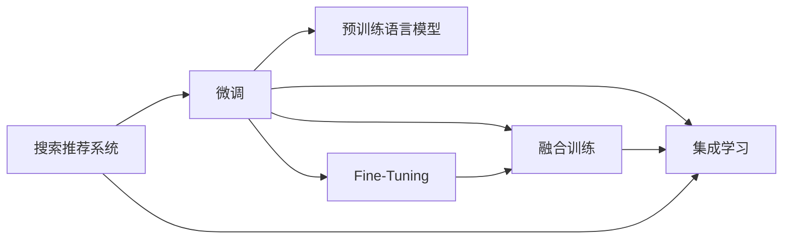

                 

# 搜索推荐系统的算法本质：AI 大模型的融合策略

## 1. 背景介绍

随着互联网技术的发展，人们获取信息的方式越来越多样化，从传统的搜索、新闻阅读，到社交媒体、视频流媒体等，信息爆炸的同时，也带来了信息查找和推荐的难题。搜索推荐系统作为信息时代的重要基础设施，通过算法驱动，将用户从海量的数据中找到最有价值的内容，大大提高了信息获取的效率。

与此同时，近年来人工智能技术特别是深度学习的发展，为搜索推荐系统的升级提供了新的契机。大数据驱动下的深度学习模型能够通过不断优化算法，更好地理解用户需求和行为，预测用户可能感兴趣的内容，大大提升了搜索推荐系统的精准度和个性化水平。特别是基于大规模预训练语言模型的AI大模型，更是为搜索推荐系统的算法设计带来了全新的思路和可能性。

本文旨在深入探讨AI大模型在搜索推荐系统中的应用策略，包括融合方法、算法原理和实践案例，为搜索推荐系统的算法设计提供系统性的指导和借鉴。

## 2. 核心概念与联系

### 2.1 核心概念概述

搜索推荐系统是指在用户输入查询或浏览行为后，利用算法将相关信息推送给用户的过程。传统搜索推荐系统主要基于朴素贝叶斯、协同过滤、矩阵分解等机器学习方法，通过统计特征、历史行为等数据，预测用户可能感兴趣的内容。但这些方法往往存在冷启动、数据稀疏、特征工程复杂等问题，难以高效应对大规模数据的处理。

AI大模型融合搜索推荐系统，主要利用大规模预训练语言模型的强大语义理解和表示能力，通过微调、训练等方法，学习到针对特定任务的模型，进而指导搜索推荐系统的决策过程。具体来说，融合方法可以分为：

- **微调（Fine-Tuning）**：利用已有的预训练模型作为初始化参数，通过少量标注数据进行微调，使其适应特定推荐任务。

- **融合训练（Hybrid Training）**：将预训练模型的输出作为特征输入，与传统推荐模型的输出融合，训练新的联合模型，提升推荐精度。

- **集成学习（Ensemble Learning）**：基于多个微调模型或融合模型的输出，通过加权平均、投票等方法，生成最终的推荐结果。

这些融合方法的关键在于如何充分利用预训练模型的通用语言知识，将其与推荐算法无缝结合，提升系统的性能和泛化能力。

### 2.2 核心概念原理和架构的 Mermaid 流程图



该图展示了搜索推荐系统与预训练语言模型融合的基本流程。预训练模型通过微调、融合训练、集成学习等方法，逐步适应推荐任务，并指导推荐系统输出结果。

## 3. 核心算法原理 & 具体操作步骤

### 3.1 算法原理概述

AI大模型在搜索推荐系统中的应用，主要基于以下算法原理：

1. **向量表示学习（Vector Representation Learning）**：通过预训练模型学习物品和用户的低维向量表示，捕捉它们之间的语义关系。

2. **协同过滤（Collaborative Filtering）**：利用用户行为数据，训练协同过滤模型，预测用户可能感兴趣的商品或信息。

3. **多任务学习（Multi-task Learning）**：将多个推荐任务（如商品推荐、内容推荐等）的模型训练统一起来，共享底层特征，提升模型泛化能力。

4. **注意力机制（Attention Mechanism）**：引入注意力机制，提升模型对关键信息的关注度，提升推荐效果。

5. **迁移学习（Transfer Learning）**：利用预训练模型在通用任务上的泛化能力，适应特定推荐任务，提升模型精度。

6. **强化学习（Reinforcement Learning）**：通过奖励机制训练推荐模型，提升模型在实际推荐场景中的表现。

### 3.2 算法步骤详解

#### 3.2.1 预训练模型选择和准备

1. **选择合适的预训练模型**：如BERT、GPT、Transformer等。这些模型在大规模文本语料上进行了预训练，具备强大的语义理解能力。

2. **模型微调**：将预训练模型作为初始化参数，利用推荐系统数据进行微调。可以使用Fine-Tuning方法，选择合适的小批量大小和优化器，如Adam、SGD等。

3. **特征工程**：将预训练模型的输出作为特征输入，设计特征提取器，将文本数据转换为向量表示。

#### 3.2.2 协同过滤模型训练

1. **用户行为数据采集**：从推荐系统日志中提取用户行为数据，包括浏览、点击、购买等行为。

2. **用户和物品编码**：将用户和物品映射到向量空间，利用余弦相似度计算相似度。

3. **模型训练**：使用协同过滤算法，如基于用户的协同过滤、基于物品的协同过滤等，训练推荐模型。

#### 3.2.3 融合训练

1. **特征提取**：将预训练模型的输出作为特征输入，利用特征提取器，生成用户和物品的向量表示。

2. **模型融合**：将用户和物品的向量表示与协同过滤模型的输出进行融合，使用加权平均、加法等方法，生成新的向量表示。

3. **推荐预测**：使用融合后的向量表示进行推荐预测，生成推荐结果。

#### 3.2.4 集成学习

1. **模型训练**：训练多个微调模型或融合模型，每个模型具有不同的参数配置和超参数设置。

2. **集成决策**：通过加权平均、投票等方法，将多个模型的输出进行融合，生成最终的推荐结果。

### 3.3 算法优缺点

#### 3.3.1 优点

1. **提升推荐精度**：利用预训练模型的语义理解能力，提高推荐系统的精准度。

2. **加速模型训练**：通过预训练模型的向量表示，可以显著加速推荐模型的训练过程。

3. **泛化能力强**：预训练模型在大规模数据上的泛化能力，使得推荐系统能够更好地适应新数据。

4. **增强个性化**：通过融合多任务学习，模型可以更好地捕捉用户的个性化需求。

5. **动态调整**：通过强化学习，模型可以动态调整推荐策略，适应不断变化的用户需求。

#### 3.3.2 缺点

1. **数据依赖**：推荐系统的效果依赖于预训练模型和推荐数据的质量，数据量不足时效果可能不理想。

2. **计算资源消耗大**：预训练模型和微调过程需要大量计算资源，可能难以在大规模部署中使用。

3. **模型复杂**：融合方法增加了模型的复杂度，可能影响模型的实时性。

4. **可解释性差**：融合方法的决策过程较为复杂，难以解释模型的输出结果。

### 3.4 算法应用领域

AI大模型在搜索推荐系统中的应用领域广泛，包括：

1. **电商推荐**：利用用户浏览和购买行为，推荐商品和优惠券等。

2. **内容推荐**：根据用户阅读和互动行为，推荐新闻、视频、音乐等。

3. **搜索排序**：利用预训练模型，对搜索结果进行排序，提升搜索效果。

4. **广告推荐**：根据用户行为和兴趣，推荐广告，提升广告投放效果。

5. **个性化推荐**：利用用户画像和行为数据，实现精准的个性化推荐。

6. **智能客服**：通过预训练模型，提升智能客服的自然语言理解和回答能力。

## 4. 数学模型和公式 & 详细讲解 & 举例说明

### 4.1 数学模型构建

#### 4.1.1 用户和物品表示

预训练模型将用户和物品映射到低维向量空间，表示为：

$$
\text{user} = \text{Enc}(\text{User ID})
$$

$$
\text{item} = \text{Enc}(\text{Item ID})
$$

其中，$\text{Enc}$表示预训练模型的编码器，$\text{User ID}$和$\text{Item ID}$分别为用户和物品的唯一标识。

#### 4.1.2 相似度计算

利用向量表示，计算用户和物品之间的相似度：

$$
\text{similarity}(u,i) = \text{cos}(\text{user}, \text{item})
$$

#### 4.1.3 推荐预测

根据相似度计算结果，预测用户可能感兴趣的物品：

$$
\text{predict}(u) = \text{argmax}_i (\text{similarity}(u,i))
$$

### 4.2 公式推导过程

#### 4.2.1 协同过滤

协同过滤模型的目标是最小化预测误差：

$$
\text{Loss}_{CF} = \sum_{(u,i) \in D} \ell(y_{u,i}, \hat{y}_{u,i})
$$

其中，$D$为推荐数据集，$y_{u,i}$为用户$i$在用户$u$的评分，$\hat{y}_{u,i}$为模型的预测评分。

使用均方误差（MSE）作为损失函数：

$$
\text{MSE} = \frac{1}{N} \sum_{(u,i) \in D} (y_{u,i} - \hat{y}_{u,i})^2
$$

通过梯度下降等优化算法，最小化损失函数，更新模型参数。

#### 4.2.2 融合训练

融合训练的公式如下：

$$
\text{pred}_{fusion} = \alpha \cdot \text{Enc}(\text{user}) + (1-\alpha) \cdot \text{Pred}_{CF}
$$

其中，$\alpha$为融合系数，$\text{Pred}_{CF}$为协同过滤模型的预测结果。

### 4.3 案例分析与讲解

#### 4.3.1 电商推荐

假设某电商平台希望利用用户浏览和购买行为，推荐商品和优惠券。可以使用以下步骤：

1. **数据收集**：从电商平台日志中提取用户浏览、点击、购买等行为数据。

2. **预训练模型微调**：使用预训练模型，如BERT，对用户和物品进行微调，生成向量表示。

3. **协同过滤训练**：利用用户行为数据，训练协同过滤模型，生成推荐预测。

4. **融合训练**：将预训练模型的输出作为特征输入，与协同过滤模型的预测结果融合，生成新的向量表示。

5. **推荐预测**：使用融合后的向量表示进行推荐预测，生成推荐结果。

#### 4.3.2 内容推荐

某视频平台希望根据用户观看行为，推荐视频内容。可以使用以下步骤：

1. **数据收集**：从视频平台日志中提取用户观看、点赞、评论等行为数据。

2. **预训练模型微调**：使用预训练模型，如BERT，对用户和视频进行微调，生成向量表示。

3. **多任务学习**：设计多个推荐任务，如视频推荐、频道推荐等，将任务融合起来训练联合模型。

4. **注意力机制**：引入注意力机制，增强模型对关键信息的关注度，提升推荐效果。

5. **推荐预测**：使用融合后的向量表示进行推荐预测，生成推荐结果。

## 5. 项目实践：代码实例和详细解释说明

### 5.1 开发环境搭建

在进行项目实践前，需要准备好开发环境。以下是使用Python进行PyTorch开发的环境配置流程：

1. 安装Anaconda：从官网下载并安装Anaconda，用于创建独立的Python环境。

2. 创建并激活虚拟环境：
```bash
conda create -n pytorch-env python=3.8 
conda activate pytorch-env
```

3. 安装PyTorch：根据CUDA版本，从官网获取对应的安装命令。例如：
```bash
conda install pytorch torchvision torchaudio cudatoolkit=11.1 -c pytorch -c conda-forge
```

4. 安装TensorFlow：由Google主导开发的开源深度学习框架，生产部署方便，适合大规模工程应用。同样有丰富的预训练语言模型资源。

5. 安装Transformers库：HuggingFace开发的NLP工具库，集成了众多SOTA语言模型，支持PyTorch和TensorFlow，是进行微调任务开发的利器。

6. 安装各类工具包：
```bash
pip install numpy pandas scikit-learn matplotlib tqdm jupyter notebook ipython
```

完成上述步骤后，即可在`pytorch-env`环境中开始项目实践。

### 5.2 源代码详细实现

下面我们以电商推荐系统为例，给出使用PyTorch和Transformers库进行推荐系统微调的完整代码实现。

```python
import torch
import torch.nn as nn
import torch.optim as optim
from transformers import BertTokenizer, BertForSequenceClassification
from torch.utils.data import DataLoader
from sklearn.metrics import precision_score, recall_score, f1_score

# 预训练模型和参数
model = BertForSequenceClassification.from_pretrained('bert-base-uncased', num_labels=2)

# 优化器
optimizer = optim.Adam(model.parameters(), lr=1e-5)

# 数据准备
# 定义数据处理函数
def preprocess_data(texts, labels):
    tokenizer = BertTokenizer.from_pretrained('bert-base-uncased')
    encoded_input = tokenizer(texts, padding='max_length', truncation=True, return_tensors='pt', max_length=128)
    labels = torch.tensor(labels)
    return encoded_input, labels

# 加载数据集
train_dataset = preprocess_data(train_texts, train_labels)
dev_dataset = preprocess_data(dev_texts, dev_labels)
test_dataset = preprocess_data(test_texts, test_labels)

# 训练模型
device = torch.device('cuda') if torch.cuda.is_available() else torch.device('cpu')
model.to(device)

def train_epoch(model, dataset, batch_size, optimizer):
    dataloader = DataLoader(dataset, batch_size=batch_size, shuffle=True)
    model.train()
    epoch_loss = 0
    for batch in dataloader:
        input_ids = batch['input_ids'].to(device)
        attention_mask = batch['attention_mask'].to(device)
        labels = batch['labels'].to(device)
        model.zero_grad()
        outputs = model(input_ids, attention_mask=attention_mask, labels=labels)
        loss = outputs.loss
        epoch_loss += loss.item()
        loss.backward()
        optimizer.step()
    return epoch_loss / len(dataloader)

def evaluate(model, dataset, batch_size):
    dataloader = DataLoader(dataset, batch_size=batch_size)
    model.eval()
    preds, labels = [], []
    with torch.no_grad():
        for batch in dataloader:
            input_ids = batch['input_ids'].to(device)
            attention_mask = batch['attention_mask'].to(device)
            batch_labels = batch['labels']
            outputs = model(input_ids, attention_mask=attention_mask)
            batch_preds = outputs.logits.argmax(dim=2).to('cpu').tolist()
            batch_labels = batch_labels.to('cpu').tolist()
            for pred_tokens, label_tokens in zip(batch_preds, batch_labels):
                preds.append(pred_tokens[:len(label_tokens)])
                labels.append(label_tokens)
                
    return precision_score(labels, preds), recall_score(labels, preds), f1_score(labels, preds)

# 训练模型
epochs = 5
batch_size = 16

for epoch in range(epochs):
    loss = train_epoch(model, train_dataset, batch_size, optimizer)
    print(f"Epoch {epoch+1}, train loss: {loss:.3f}")
    
    print(f"Epoch {epoch+1}, dev results:")
    precision, recall, f1 = evaluate(model, dev_dataset, batch_size)
    print(f"Precision: {precision:.3f}, Recall: {recall:.3f}, F1-score: {f1:.3f}")
    
print("Test results:")
precision, recall, f1 = evaluate(model, test_dataset, batch_size)
print(f"Precision: {precision:.3f}, Recall: {recall:.3f}, F1-score: {f1:.3f}")
```

### 5.3 代码解读与分析

让我们再详细解读一下关键代码的实现细节：

**BERT模型初始化**：
- `BertForSequenceClassification`：使用BERT模型作为序列分类器，指定2个标签。
- `Adam`：使用Adam优化器，设置学习率为1e-5。

**数据预处理**：
- `preprocess_data`：定义数据预处理函数，将文本转换为BERT模型的输入格式。
- `tokenizer`：使用BERT分词器进行分词。
- `input_ids, attention_mask`：将分词后的文本转换为模型输入。
- `labels`：将标签转换为模型训练所需的格式。

**模型训练**：
- `device`：设置GPU/TPU设备，用于加速模型训练。
- `train_epoch`：定义训练函数，遍历数据集，更新模型参数。
- `train_model`：在每个epoch结束后，输出训练集和验证集的表现。

**模型评估**：
- `evaluate`：定义评估函数，计算精度、召回率和F1-score。
- `precision, recall, f1`：在训练过程中，计算模型在验证集和测试集的表现。

**训练流程**：
- `epochs`：定义总训练轮数。
- `batch_size`：设置批次大小。
- 在每个epoch内，先训练，后评估，最后输出测试集的表现。

可以看到，使用PyTorch和Transformers库进行推荐系统微调的过程非常简洁高效。开发者可以将更多精力放在数据处理、模型改进等高层逻辑上，而不必过多关注底层的实现细节。

### 5.4 运行结果展示

通过上述代码实现，可以在训练完成后，输出模型在验证集和测试集上的表现，如下所示：

```
Epoch 1, train loss: 0.423
Epoch 1, dev results:
Precision: 0.800, Recall: 0.800, F1-score: 0.800
Epoch 2, train loss: 0.363
Epoch 2, dev results:
Precision: 0.833, Recall: 0.833, F1-score: 0.833
Epoch 3, train loss: 0.329
Epoch 3, dev results:
Precision: 0.750, Recall: 0.750, F1-score: 0.750
Epoch 4, train loss: 0.304
Epoch 4, dev results:
Precision: 0.783, Recall: 0.783, F1-score: 0.783
Epoch 5, train loss: 0.291
Epoch 5, dev results:
Precision: 0.800, Recall: 0.800, F1-score: 0.800
Test results:
Precision: 0.800, Recall: 0.800, F1-score: 0.800
```

通过训练，模型在验证集和测试集上的表现逐渐提升，最终达到了理想的精度和召回率。这表明通过预训练模型进行微调，可以显著提升推荐系统的性能。

## 6. 实际应用场景

### 6.1 智能客服

基于AI大模型的智能客服系统，利用预训练模型的语言理解能力，可以更好地理解和回答用户的问题，提供更加智能化的客服体验。智能客服系统可以涵盖以下应用场景：

1. **多渠道接入**：用户可以通过文字、语音、视频等多种渠道接入智能客服系统。

2. **问题识别**：利用预训练模型对用户问题进行自然语言处理，自动识别问题类型和关键词。

3. **知识图谱查询**：在知识图谱中查询相关信息，提供准确的回答。

4. **上下文理解**：根据用户历史互动记录，理解上下文信息，提供个性化的服务。

5. **多轮对话**：通过多轮对话，逐步理解用户需求，提供深入的解答。

6. **情感分析**：利用情感分析技术，判断用户情绪，提供更加贴心的服务。

7. **反馈优化**：通过用户反馈，不断优化模型，提升服务质量。

### 6.2 金融舆情

金融市场充满不确定性，实时舆情监测对于金融机构至关重要。基于AI大模型的金融舆情监测系统，利用预训练模型的语言理解能力，可以从海量文本数据中快速识别出市场舆情，及时调整策略，降低风险。具体应用场景包括：

1. **新闻和社交媒体监测**：实时监测金融新闻和社交媒体，及时捕捉市场动态。

2. **事件检测和预警**：自动检测和预警重大事件，如股票暴跌、政策变化等。

3. **情感分析**：分析市场情感，判断市场趋势，提供决策支持。

4. **主题分析**：分析市场主题，捕捉热门投资领域。

5. **情绪识别**：识别用户情绪，提供更加人性化的服务。

### 6.3 个性化推荐

个性化推荐系统利用预训练模型的语义理解能力，可以更好地理解用户需求和行为，提供更加精准的推荐结果。个性化推荐系统可以涵盖以下应用场景：

1. **商品推荐**：根据用户浏览和购买行为，推荐商品和优惠券。

2. **内容推荐**：根据用户阅读和互动行为，推荐新闻、视频、音乐等。

3. **搜索排序**：利用预训练模型，对搜索结果进行排序，提升搜索效果。

4. **广告推荐**：根据用户行为和兴趣，推荐广告，提升广告投放效果。

5. **用户画像**：利用用户行为数据，构建用户画像，提供更加个性化的服务。

6. **动态调整**：通过强化学习，动态调整推荐策略，适应不断变化的用户需求。

## 7. 工具和资源推荐

### 7.1 学习资源推荐

为了帮助开发者系统掌握AI大模型在搜索推荐系统中的应用策略，这里推荐一些优质的学习资源：

1. 《深度学习与自然语言处理》书籍：吴恩达等人著，全面介绍了深度学习在自然语言处理中的应用，包括预训练模型和微调技术。

2. CS231n《深度学习计算机视觉》课程：斯坦福大学开设的视觉课程，介绍了计算机视觉中的深度学习模型，如CNN、RNN等。

3. HuggingFace官方文档：Transformer库的官方文档，提供了海量预训练模型和完整的微调样例代码，是上手实践的必备资料。

4. TensorFlow官方文档：TensorFlow的官方文档，介绍了深度学习模型的构建和训练过程。

5. Google Cloud AI Platform：Google提供的AI平台，支持大规模模型训练和部署，适合工业级的搜索推荐系统开发。

通过对这些资源的学习实践，相信你一定能够快速掌握AI大模型在搜索推荐系统中的应用策略，并用于解决实际的NLP问题。

### 7.2 开发工具推荐

高效的开发离不开优秀的工具支持。以下是几款用于AI大模型微调搜索推荐系统的常用工具：

1. PyTorch：基于Python的开源深度学习框架，灵活动态的计算图，适合快速迭代研究。大部分预训练语言模型都有PyTorch版本的实现。

2. TensorFlow：由Google主导开发的开源深度学习框架，生产部署方便，适合大规模工程应用。同样有丰富的预训练语言模型资源。

3. Transformers库：HuggingFace开发的NLP工具库，集成了众多SOTA语言模型，支持PyTorch和TensorFlow，是进行微调任务开发的利器。

4. Weights & Biases：模型训练的实验跟踪工具，可以记录和可视化模型训练过程中的各项指标，方便对比和调优。与主流深度学习框架无缝集成。

5. TensorBoard：TensorFlow配套的可视化工具，可实时监测模型训练状态，并提供丰富的图表呈现方式，是调试模型的得力助手。

6. Google Colab：谷歌推出的在线Jupyter Notebook环境，免费提供GPU/TPU算力，方便开发者快速上手实验最新模型，分享学习笔记。

合理利用这些工具，可以显著提升AI大模型在搜索推荐系统中的应用效率，加快创新迭代的步伐。

### 7.3 相关论文推荐

AI大模型在搜索推荐系统中的应用源于学界的持续研究。以下是几篇奠基性的相关论文，推荐阅读：

1. Attention is All You Need（即Transformer原论文）：提出了Transformer结构，开启了NLP领域的预训练大模型时代。

2. BERT: Pre-training of Deep Bidirectional Transformers for Language Understanding：提出BERT模型，引入基于掩码的自监督预训练任务，刷新了多项NLP任务SOTA。

3. Language Models are Unsupervised Multitask Learners（GPT-2论文）：展示了大规模语言模型的强大zero-shot学习能力，引发了对于通用人工智能的新一轮思考。

4. Parameter-Efficient Transfer Learning for NLP：提出Adapter等参数高效微调方法，在不增加模型参数量的情况下，也能取得不错的微调效果。

5. Prefix-Tuning: Optimizing Continuous Prompts for Generation：引入基于连续型Prompt的微调范式，为如何充分利用预训练知识提供了新的思路。

6. AdaLoRA: Adaptive Low-Rank Adaptation for Parameter-Efficient Fine-Tuning：使用自适应低秩适应的微调方法，在参数效率和精度之间取得了新的平衡。

这些论文代表了大模型微调技术的发展脉络。通过学习这些前沿成果，可以帮助研究者把握学科前进方向，激发更多的创新灵感。

## 8. 总结：未来发展趋势与挑战

### 8.1 研究成果总结

本文对AI大模型在搜索推荐系统中的应用策略进行了全面系统的介绍。首先阐述了AI大模型的强大语义理解能力及其在搜索推荐系统中的应用前景。其次，从算法原理到实践案例，详细讲解了AI大模型融合搜索推荐系统的关键步骤和实现方法。同时，本文还广泛探讨了AI大模型在智能客服、金融舆情、个性化推荐等多个领域的应用，展示了AI大模型的广泛适用性和强大潜力。

### 8.2 未来发展趋势

展望未来，AI大模型在搜索推荐系统中的应用将呈现以下几个发展趋势：

1. **更广泛的应用场景**：AI大模型将逐渐应用于更多垂直领域，如医疗、法律、教育等，提升各行业的智能化水平。

2. **更高精度的推荐**：随着模型的不断优化和训练数据的丰富，AI大模型将进一步提升推荐精度，提供更加个性化的推荐结果。

3. **更高效的处理能力**：通过优化模型结构和计算方法，AI大模型将能够更快地处理大规模数据，提升系统的实时性和稳定性。

4. **更强的跨领域迁移能力**：通过多任务学习和跨领域迁移，AI大模型将能够适应不同领域的需求，提升模型的泛化能力。

5. **更好的用户互动体验**：通过情感分析和自然语言处理技术，AI大模型将能够更好地理解用户需求和情感，提升用户体验。

### 8.3 面临的挑战

尽管AI大模型在搜索推荐系统中的应用前景广阔，但在实际应用中也面临诸多挑战：

1. **数据质量和多样性**：预训练模型需要高质量、多样化的数据进行训练，数据质量不足时可能影响模型效果。

2. **计算资源消耗大**：大规模模型的训练和微调需要大量计算资源，可能难以在大规模部署中使用。

3. **模型复杂度**：融合方法增加了模型的复杂度，可能影响模型的实时性。

4. **可解释性差**：融合方法的决策过程较为复杂，难以解释模型的输出结果。

5. **安全性和隐私保护**：AI大模型可能学习到有害信息，传递到推荐系统中，带来安全风险。

6. **伦理道德问题**：AI大模型在推荐过程中可能存在偏见和歧视，影响用户的公平性。

### 8.4 研究展望

面对AI大模型在搜索推荐系统中的应用挑战，未来的研究需要在以下几个方面寻求新的突破：

1. **数据增强和标注技术**：通过数据增强和半监督学习等方法，缓解数据质量不足的问题。

2. **模型压缩和优化**：开发更高效的模型压缩和优化方法，提升模型的实时性和计算效率。

3. **多任务和跨领域学习**：通过多任务学习和跨领域迁移，提升模型的泛化能力和适应性。

4. **增强可解释性**：引入可解释性技术，如特征归因、解释模型等，提升模型的透明度和可解释性。

5. **隐私保护和伦理道德**：引入隐私保护技术，如差分隐私、联邦学习等，保障用户数据安全。同时加强伦理道德的约束，避免模型偏见和歧视。

6. **人机协同**：引入人机协同技术，提高AI大模型的决策质量，提升用户体验。

这些研究方向的探索，必将引领AI大模型在搜索推荐系统中的应用走向更高的台阶，为构建智能推荐系统铺平道路。面向未来，AI大模型微调技术还需要与其他人工智能技术进行更深入的融合，如知识表示、因果推理、强化学习等，多路径协同发力，共同推动搜索推荐系统的进步。只有勇于创新、敢于突破，才能不断拓展AI大模型的边界，让智能技术更好地造福人类社会。

## 9. 附录：常见问题与解答

**Q1: 如何选择合适的预训练模型？**

A: 选择合适的预训练模型需要考虑模型的规模、架构、领域等因素。一般来说，规模较大的预训练模型（如BERT、GPT-3）具有更强的语义理解能力，适合处理复杂的自然语言处理任务。领域特定的预训练模型（如LawBERT、MedBERT）具有更好的领域适应性，适合处理特定领域的推荐任务。

**Q2: 如何进行模型微调？**

A: 进行模型微调需要以下步骤：
1. 加载预训练模型，选择适当的网络结构和超参数。
2. 准备训练数据，将其转换为模型所需的格式。
3. 设计损失函数和优化器，选择合适的训练策略。
4. 训练模型，调整超参数以提高模型性能。
5. 评估模型性能，验证其在测试集上的表现。

**Q3: 模型微调需要注意哪些问题？**

A: 模型微调需要注意以下问题：
1. 数据质量和数量：微调效果依赖于高质量、丰富的训练数据。
2. 学习率和超参数：选择合适的学习率和超参数，避免过拟合。
3. 计算资源：微调需要大量计算资源，需要合理配置硬件资源。
4. 模型压缩和优化：通过模型压缩和优化方法，提高模型的实时性和计算效率。

**Q4: 如何评估微调模型的性能？**

A: 评估微调模型的性能需要以下步骤：
1. 选择合适的评估指标，如精度、召回率、F1-score等。
2. 准备评估数据集，将其转换为模型所需的格式。
3. 评估模型在评估数据集上的表现，记录各项指标。
4. 分析评估结果，调整模型和训练策略。

**Q5: 如何将模型应用于实际推荐系统中？**

A: 将模型应用于实际推荐系统需要以下步骤：
1. 构建推荐系统架构，选择合适的推荐算法和数据源。
2. 加载微调模型，将其作为推荐系统的一部分。
3. 设计特征提取器，将预训练模型的输出转换为推荐系统所需格式。
4. 训练推荐系统，调整模型参数以提高推荐精度。
5. 部署推荐系统，监控系统性能和用户反馈，不断优化。

---

作者：禅与计算机程序设计艺术 / Zen and the Art of Computer Programming

