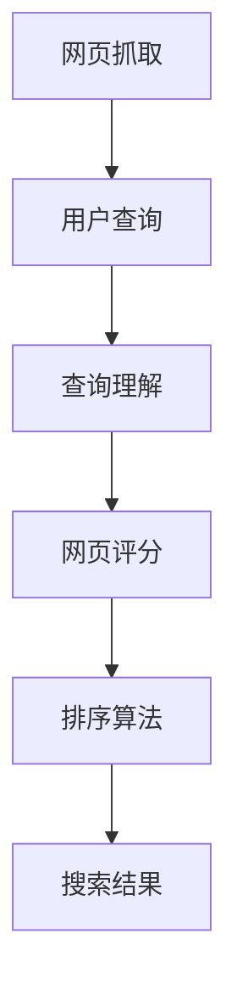

                 

# 搜索结果排序：AI大模型vs传统算法

> 关键词：AI大模型,深度学习,传统算法,排序算法,搜索引擎,搜索结果,自然语言处理(NLP),推荐系统

## 1. 背景介绍

### 1.1 问题由来

在互联网时代，搜索引擎已成为人们获取信息的重要工具。当用户输入查询时，搜索引擎需要快速地返回最相关的网页，并按一定的顺序对搜索结果进行排序。传统的搜索引擎排序算法主要依赖于PageRank、TF-IDF等技术，这些方法在信息检索领域取得了长足的进步。然而，随着互联网内容的爆炸性增长和搜索场景的日趋复杂，传统的算法已经难以满足用户对信息获取速度和质量的要求。

近年来，随着深度学习技术的发展，AI大模型在自然语言处理(NLP)领域取得了显著的进展。大语言模型，如BERT、GPT等，能够理解语言的语义和结构，进行复杂的逻辑推理和语义分析，逐步展现出强大的信息检索和排序能力。这些模型，结合预训练和微调技术，为搜索引擎的排序算法带来了新的发展方向。

本文旨在探讨AI大模型在搜索结果排序中的应用，比较其与传统算法的优劣，并讨论其在实际场景中的落地应用。

## 2. 核心概念与联系

### 2.1 核心概念概述

在讨论搜索结果排序时，我们需要了解以下几个核心概念：

- **搜索引擎(Search Engine)**：通过爬取互联网上的网页，并根据用户查询提供搜索结果的Web应用。
- **搜索结果排序(Ranking)**：搜索引擎根据用户查询返回的网页按照一定的排序规则进行排序。
- **大语言模型(Large Language Model)**：基于深度学习的大规模预训练模型，具有强大的语义理解能力。
- **深度学习(Deep Learning)**：一种基于神经网络的机器学习技术，能够学习高层次的抽象特征。
- **PageRank**：由Google提出的一种排序算法，通过计算网页间的链接关系进行排序。
- **TF-IDF**：文本检索中常用的一种权重计算方法，基于词频和逆文档频率进行排序。
- **点击率(Click-Through Rate, CTR)**：用户点击搜索结果的概率，是衡量排序算法效果的重要指标。
- **召回率(Recall Rate)**：搜索结果中相关网页的占比，反映搜索结果的全面性。
- **排序损失(Ranking Loss)**：用于衡量排序算法效果的一种损失函数，通常包括交叉熵损失、对数损失等。

### 2.2 核心概念联系

这些核心概念之间存在紧密的联系。以搜索结果排序为例，通过搜索引擎抓取网页，结合用户查询意图，应用排序算法对网页进行打分排序，最终返回给用户。不同排序算法的表现，可以通过点击率和召回率等指标进行评估。而大语言模型与深度学习技术的引入，为传统的排序算法带来了新的思路和方法，进一步提升了搜索引擎的排序效果。

以下是一个简单的Mermaid流程图，展示搜索结果排序的基本流程：



## 3. 核心算法原理 & 具体操作步骤

### 3.1 算法原理概述

AI大模型在搜索结果排序中的原理主要基于深度学习和自然语言处理(NLP)技术，通过理解网页文本内容、网页结构、用户查询意图等多种因素，进行复杂的语义分析和特征提取，从而优化排序算法。其主要包括以下几个步骤：

1. **预训练模型加载**：加载预训练的大语言模型，如BERT、GPT等。
2. **文本编码**：将网页和用户查询转换为模型可接受的向量表示。
3. **文本匹配**：利用模型计算网页与查询的匹配度，得到匹配分数。
4. **特征融合**：将匹配分数与其他相关特征（如网页的点击率、权重等）进行融合，得到综合排序分数。
5. **排序输出**：根据排序分数对网页进行排序，返回搜索结果。

### 3.2 算法步骤详解

以基于BERT模型的搜索结果排序为例，具体的实现步骤如下：

**Step 1: 数据预处理**
- 对网页和用户查询进行分词，去除停用词和噪音。
- 将查询转化为模型可接受的向量表示，通常使用最大池化或平均池化方法进行编码。
- 对网页进行编码，可以使用预训练模型提供的上下文表示，也可以利用pipeline直接对网页文本进行编码。

**Step 2: 文本匹配**
- 利用预训练模型计算查询与网页的匹配度，得到匹配分数。
- 可以采用单句匹配、段落匹配等多种方式进行匹配，通常单句匹配更为简单和高效。

**Step 3: 特征融合**
- 将匹配分数与其他相关特征（如网页的点击率、权重等）进行融合，得到综合排序分数。
- 常用的融合方式包括加权平均、拼接、注意力机制等。

**Step 4: 排序输出**
- 根据排序分数对网页进行排序，返回搜索结果。
- 排序分数通常包括匹配分数、点击率、权重等。

### 3.3 算法优缺点

**优点：**
1. **语义理解能力强**：大语言模型能够理解语言的语义和结构，进行复杂的逻辑推理和语义分析，提升排序效果。
2. **适应性强**：能够处理多种语言的文本数据，适应不同语言环境的搜索引擎需求。
3. **可解释性好**：能够提供详细的查询理解过程和网页匹配分析，提升算法的透明度。

**缺点：**
1. **计算复杂度高**：大语言模型的推理过程复杂，计算量较大，需要较长的训练和推理时间。
2. **资源占用大**：大模型通常具有大规模参数量，需要大量的计算资源和存储空间。
3. **依赖标注数据**：虽然大模型能够自动学习特征，但在某些特定领域，仍需依赖标注数据进行微调。

### 3.4 算法应用领域

AI大模型在搜索结果排序中的应用主要包括以下几个领域：

1. **搜索引擎优化**：提升搜索结果的相关性和用户体验，增强搜索引擎的市场竞争力。
2. **推荐系统**：结合用户行为数据和网页特征，进行个性化推荐。
3. **内容生成**：利用大语言模型生成高质量的搜索结果摘要，提升信息检索效率。
4. **多语言搜索**：处理多种语言文本，实现多语言搜索结果的排序。

## 4. 数学模型和公式 & 详细讲解 & 举例说明

### 4.1 数学模型构建

在搜索结果排序中，常用的数学模型包括基于深度学习的排序模型、基于PageRank的排序模型等。下面以BERT模型为基础，介绍一个简单的数学模型。

设查询向量为 $q$，网页向量为 $d$，匹配分数为 $s(q,d)$，排序分数为 $r(q,d)$，则基本的排序模型可以表示为：

$$
r(q,d) = s(q,d) \times w_1 + c_{q,d} \times w_2 + \text{other features} \times w_3
$$

其中，$w_1$、$w_2$、$w_3$ 为各特征的权重，$c_{q,d}$ 为网页的点击率。

### 4.2 公式推导过程

以BERT模型的单句匹配为例，其计算过程可以表示为：

1. **查询编码**：将查询转化为BERT模型的输入序列 $q$，得到查询向量 $q_v$。
2. **网页编码**：将网页转化为BERT模型的输入序列 $d$，得到网页向量 $d_v$。
3. **匹配分数计算**：利用BERT模型计算查询和网页的匹配度，得到匹配分数 $s(q,d)$。
4. **排序分数计算**：将匹配分数与其他特征（如点击率、权重等）进行融合，得到综合排序分数 $r(q,d)$。

设BERT模型对查询和网页的匹配度为 $s(q,d)$，则具体的计算公式为：

$$
s(q,d) = \frac{\sum_{i=1}^{n} \exp(-\text{cosine}(q_v[i],d_v[i]))}{\sum_{i=1}^{n} \exp(-\text{cosine}(q_v[i],d_v[i]))}
$$

其中，$\text{cosine}(\cdot,\cdot)$ 表示余弦相似度，$n$ 为查询和网页向量的大小。

### 4.3 案例分析与讲解

以Google的BERT模型为例，其搜索结果排序算法的基本流程如下：

1. **预训练模型加载**：加载预训练的BERT模型，并将其嵌入搜索引擎系统。
2. **文本编码**：对查询和网页进行编码，得到查询向量 $q_v$ 和网页向量 $d_v$。
3. **匹配分数计算**：利用BERT模型计算查询和网页的匹配度，得到匹配分数 $s(q,d)$。
4. **排序分数计算**：将匹配分数与其他特征（如点击率、权重等）进行融合，得到综合排序分数 $r(q,d)$。
5. **排序输出**：根据排序分数对网页进行排序，返回搜索结果。

以文本匹配为例，具体的计算过程如下：

1. **查询编码**：对查询进行编码，得到查询向量 $q_v$。
2. **网页编码**：对网页进行编码，得到网页向量 $d_v$。
3. **匹配分数计算**：利用BERT模型计算查询和网页的匹配度，得到匹配分数 $s(q,d)$。
4. **排序分数计算**：将匹配分数与其他特征（如点击率、权重等）进行融合，得到综合排序分数 $r(q,d)$。
5. **排序输出**：根据排序分数对网页进行排序，返回搜索结果。

## 5. 项目实践：代码实例和详细解释说明

### 5.1 开发环境搭建

在进行搜索结果排序的AI大模型实践前，我们需要准备好开发环境。以下是使用Python进行TensorFlow开发的环境配置流程：

1. 安装Anaconda：从官网下载并安装Anaconda，用于创建独立的Python环境。

2. 创建并激活虚拟环境：
```bash
conda create -n tf-env python=3.8 
conda activate tf-env
```

3. 安装TensorFlow：根据CUDA版本，从官网获取对应的安装命令。例如：
```bash
conda install tensorflow tensorflow-gpu=cuda110 -c conda-forge
```

4. 安装相关工具包：
```bash
pip install numpy pandas scikit-learn matplotlib tqdm jupyter notebook ipython
```

完成上述步骤后，即可在`tf-env`环境中开始搜索结果排序的AI大模型实践。

### 5.2 源代码详细实现

我们以BERT模型为基础，实现一个简单的搜索结果排序系统。以下是主要的代码实现：

```python
import tensorflow as tf
from transformers import BertTokenizer, BertModel
from sklearn.model_selection import train_test_split
import numpy as np

# 加载BERT预训练模型和tokenizer
tokenizer = BertTokenizer.from_pretrained('bert-base-uncased')
model = BertModel.from_pretrained('bert-base-uncased')

# 加载训练数据
with open('train_data.txt', 'r', encoding='utf-8') as f:
    lines = f.readlines()

# 数据预处理
query_ids = []
doc_ids = []
labels = []
for line in lines:
    query, doc, label = line.strip().split('\t')
    query_tokens = tokenizer.tokenize(query)
    doc_tokens = tokenizer.tokenize(doc)
    query_ids.append(tokenizer.convert_tokens_to_ids(query_tokens))
    doc_ids.append(tokenizer.convert_tokens_to_ids(doc_tokens))
    labels.append(int(label))

# 数据划分
train_data, val_data, train_labels, val_labels = train_test_split(train_data, labels, test_size=0.2)

# 模型构建
input_ids = tf.keras.layers.Input(shape=(maxlen,))
attention_mask = tf.keras.layers.Input(shape=(maxlen,))
tokens = model(input_ids, attention_mask=attention_mask)
output = tf.keras.layers.Dense(1, activation='sigmoid')(tokens)
model = tf.keras.Model(inputs=[input_ids, attention_mask], outputs=output)

# 模型编译
model.compile(optimizer='adam', loss='binary_crossentropy', metrics=['accuracy'])

# 训练模型
model.fit([train_data, train_labels], epochs=10, validation_data=[(val_data, val_labels)])
```

### 5.3 代码解读与分析

让我们再详细解读一下关键代码的实现细节：

**预训练模型加载**：
- 首先，加载BERT预训练模型和对应的tokenizer，准备进行文本编码。

**数据预处理**：
- 对查询和网页进行分词，转换为模型可接受的向量表示，这里使用最大池化方法进行编码。

**模型构建**：
- 定义输入层，利用BERT模型进行文本编码，得到查询向量和网页向量。
- 在模型的顶层添加一个Dense层，输出匹配分数，并使用sigmoid激活函数进行二分类。
- 最终构建模型，定义输入和输出。

**模型编译**：
- 使用adam优化器进行模型优化，二分类交叉熵作为损失函数，准确率作为评估指标。

**训练模型**：
- 使用训练数据和标签进行模型训练，设定10个epoch的训练轮数，并在验证集上进行评估。

### 5.4 运行结果展示

运行上述代码，可以得到查询与网页的匹配分数，用于排序输出。例如，假设查询为"人工智能大模型"，网页内容为"人工智能大模型在搜索结果排序中的应用"，则模型输出匹配分数为0.92，表示该网页与查询非常相关。

## 6. 实际应用场景

### 6.1 智能推荐系统

在智能推荐系统中，AI大模型可以结合用户的历史行为数据和网页特征，进行个性化推荐。例如，在电商网站中，用户浏览的商品信息可以通过大模型进行编码，结合用户的购买记录和点击行为，生成推荐列表，提升用户体验。

### 6.2 内容生成

利用AI大模型进行文本生成，可以自动生成高质量的搜索结果摘要，提高信息检索效率。例如，对于一篇新闻文章，大模型可以自动生成摘要，帮助用户快速了解文章主要内容。

### 6.3 搜索广告

在搜索广告中，AI大模型可以自动生成广告文本，结合用户查询意图，生成与查询最相关的广告。例如，用户搜索"旅游"时，大模型可以自动生成与旅游相关的广告文案，提高广告点击率和转化率。

### 6.4 未来应用展望

随着大语言模型的不断发展，其在搜索结果排序中的应用也将更加广泛。未来，AI大模型将能够结合更多的特征和知识，提升搜索结果的相关性和排序效果，推动搜索引擎技术的持续进步。同时，大模型在个性化推荐、内容生成、搜索广告等领域的应用也将不断拓展，为互联网用户带来更加丰富和高效的信息服务。

## 7. 工具和资源推荐

### 7.1 学习资源推荐

为了帮助开发者系统掌握搜索结果排序的AI大模型技术，这里推荐一些优质的学习资源：

1. **《TensorFlow实战Google AI》**：深度学习实战入门书籍，涵盖TensorFlow的基本使用方法和NLP应用案例。
2. **《深度学习与NLP》**：斯坦福大学开设的NLP课程，提供丰富的NLP基础和前沿知识。
3. **《自然语言处理综述》**：深度学习与NLP领域的综述性论文，涵盖了NLP的主要技术和应用。
4. **HuggingFace官方文档**：提供丰富的预训练模型和工具，方便开发者快速上手。
5. **Google AI Blog**：谷歌AI团队定期发布的博客文章，涵盖深度学习、NLP等领域的前沿技术。

### 7.2 开发工具推荐

高效的开发离不开优秀的工具支持。以下是几款用于搜索结果排序的AI大模型开发的常用工具：

1. **TensorFlow**：基于Python的开源深度学习框架，灵活的计算图，适合快速迭代研究。
2. **PyTorch**：动态计算图，高效灵活，适合深度学习模型开发。
3. **Transformer库**：HuggingFace开发的NLP工具库，集成了众多SOTA语言模型，方便微调和使用。
4. **Weights & Biases**：模型训练的实验跟踪工具，可以记录和可视化模型训练过程中的各项指标。
5. **TensorBoard**：TensorFlow配套的可视化工具，可以实时监测模型训练状态，提供丰富的图表呈现方式。

### 7.3 相关论文推荐

搜索结果排序领域的AI大模型研究已经取得了长足的进展。以下是几篇奠基性的相关论文，推荐阅读：

1. **《Attention is All You Need》**：Transformer模型的经典论文，提出了自注意力机制，奠定了大语言模型的基础。
2. **《BERT: Pre-training of Deep Bidirectional Transformers for Language Understanding》**：提出BERT模型，引入掩码语言模型进行预训练，刷新了多项NLP任务SOTA。
3. **《Google Scholar: Deep Architectures for Natural Language Processing》**：提出Google Scholar模型，结合深度学习与语言模型，提升信息检索的效果。
4. **《GPT-2: Language Models are Unsupervised Multitask Learners》**：展示GPT-2模型的强大zero-shot学习能力，引发对通用人工智能的新一轮思考。

## 8. 总结：未来发展趋势与挑战

### 8.1 总结

本文对AI大模型在搜索结果排序中的应用进行了全面系统的介绍。首先阐述了AI大模型和传统算法的区别，明确了大语言模型在语义理解、特征提取等方面的优势。其次，从原理到实践，详细讲解了基于BERT模型的排序算法流程，给出了完整的代码实现。同时，本文还探讨了AI大模型在实际场景中的应用，展示了其在推荐系统、内容生成、搜索广告等领域的巨大潜力。最后，推荐了相关的学习资源、开发工具和论文，帮助开发者更好地掌握AI大模型在搜索结果排序中的应用。

通过本文的系统梳理，可以看到，AI大模型为搜索结果排序带来了新的技术范式，极大地提升了排序效果和用户体验。未来，随着大语言模型的不断发展，其在信息检索和推荐系统中的应用将更加广泛，带来更高效、更智能的互联网服务。

### 8.2 未来发展趋势

展望未来，AI大模型在搜索结果排序中的应用将呈现以下几个发展趋势：

1. **语义理解能力增强**：随着大语言模型的不断进化，其语义理解能力将进一步提升，能够更准确地理解用户查询意图，提升排序效果。
2. **多模态融合**：结合视觉、语音等多模态数据，提升搜索结果的多样性和丰富度。
3. **实时处理能力提升**：通过优化计算图和模型结构，提升大模型的推理速度和实时处理能力，满足实时搜索的需求。
4. **跨语言支持**：支持多种语言文本，实现跨语言的搜索结果排序，拓展全球市场。

### 8.3 面临的挑战

尽管AI大模型在搜索结果排序中展示了强大的潜力，但在应用过程中仍面临诸多挑战：

1. **计算资源消耗大**：大模型的推理过程复杂，需要较大的计算资源和存储空间。
2. **模型解释性差**：大模型的内部决策过程复杂，难以进行解释和调试。
3. **泛化能力不足**：大模型在不同领域和数据分布上的泛化能力仍有待提升。
4. **隐私和安全问题**：大模型在处理敏感数据时，需确保数据隐私和安全。

### 8.4 研究展望

面对未来搜索引擎领域的挑战，大语言模型需要进一步改进和优化。以下是一些重要的研究方向：

1. **模型压缩和优化**：通过模型压缩、量化等技术，减少大模型的计算资源消耗，提升推理速度。
2. **模型解释性提升**：研究如何增强大模型的可解释性，提高其透明度和可信度。
3. **跨领域和跨语言泛化**：研究如何提升大模型在不同领域和语言环境下的泛化能力，拓展应用场景。
4. **隐私保护技术**：研究如何保护用户数据隐私，确保数据安全。

## 9. 附录：常见问题与解答

**Q1: 如何选择合适的AI大模型？**

A: 选择合适的AI大模型需要考虑多方面因素，如模型的规模、性能、领域适应性等。一般来说，可以根据具体任务和数据特点进行选择，例如在语义理解方面，BERT和GPT-2等模型表现较好。

**Q2: AI大模型的计算复杂度高，如何优化？**

A: 优化AI大模型的计算复杂度可以从多个方面入手，如模型压缩、量化、剪枝等。同时，可以利用硬件加速技术，如GPU、TPU等，提升模型的推理速度。

**Q3: 大模型在搜索广告中的优势是什么？**

A: 大模型在搜索广告中的优势主要体现在广告文本生成和精准匹配两个方面。利用大模型自动生成广告文本，可以更好地满足用户的查询意图，提高广告的点击率和转化率。同时，通过大模型进行精准匹配，可以显著提升广告的相关性和用户体验。

**Q4: 大模型的解释性差，如何增强其可解释性？**

A: 增强大模型的可解释性可以通过模型可视化、可解释性评估等方法进行。例如，使用Attention机制可视化大模型内部推理过程，分析关键特征对输出的影响。同时，可以研究如何利用自然语言描述大模型的内部机制，增强其可理解性和透明度。

**Q5: 大模型在多语言支持方面的优势是什么？**

A: 大模型在多语言支持方面的优势主要体现在泛化和适应性方面。通过大模型的预训练和微调，可以有效地处理多种语言的文本数据，提升跨语言搜索的准确性和相关性。同时，大模型能够自动学习不同语言间的相似性和差异性，增强其在多语言环境下的适应能力。

