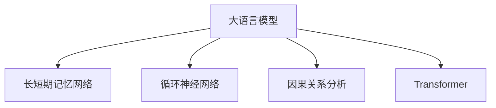

                 

# 政策分析和预测：LLM 协助政府决策

> 关键词：政策分析, 预测模型, 政府决策, 自然语言处理, 长短期记忆网络(LSTM), 循环神经网络(RNN), 因果关系分析

## 1. 背景介绍

### 1.1 问题由来

现代社会的复杂性和多元性，使得政府在制定和实施政策时面临诸多挑战。政策制定的决策依据通常来自于大量的统计数据、调查报告和专家分析。然而，传统的数据驱动决策方法往往难以捕捉到文本数据中隐含的因果关系和语义信息。基于深度学习的大语言模型（LLM）为政策分析与预测提供了全新的工具。

### 1.2 问题核心关键点

- 政策决策需要综合考虑多种复杂因素，数据来源多样、结构复杂。
- 传统的统计方法难以捕捉数据中的因果关系和语义信息。
- 大语言模型（如Transformer、BERT、GPT等）具备强大的自然语言理解和生成能力，可以从中提取复杂的语义和因果关系。
- 利用大语言模型进行政策分析和预测，可以在政府决策过程中提供辅助和支持。

## 2. 核心概念与联系

### 2.1 核心概念概述

为更好地理解LLM在政策分析和预测中的应用，本节将介绍几个核心概念：

- **大语言模型 (LLM)**：以自回归（如GPT）或自编码（如BERT）模型为代表的大规模预训练语言模型。通过在大规模无标签文本语料上进行预训练，学习通用的语言表示，具备强大的语言理解和生成能力。

- **长短期记忆网络 (LSTM)**：一种特殊的循环神经网络（RNN），能够处理序列数据并记忆其上下文信息。LSTM广泛应用于序列预测任务，如文本生成、语音识别等。

- **因果关系分析**：分析变量间因果关系的模型，用于识别政策实施后的效果和影响因素。

- **循环神经网络 (RNN)**：一种能处理序列数据的神经网络，通过隐藏状态记忆先前的输入，可用于文本分类、情感分析等任务。

- **Transformer**：一种基于自注意力机制的模型，广泛应用于机器翻译、文本生成等任务。

这些核心概念之间的逻辑关系可以通过以下Mermaid流程图来展示：



这个流程图展示了大语言模型的工作原理和其在序列数据处理中的应用。

## 3. 核心算法原理 & 具体操作步骤
### 3.1 算法原理概述

利用大语言模型进行政策分析和预测，本质上是将文本数据转化为数值数据，并使用深度学习模型进行分析与预测。核心步骤包括：

1. **文本预处理**：将政策文本转化为模型可处理的数值形式。
2. **序列建模**：使用LSTM或Transformer等模型对序列数据进行处理。
3. **因果关系分析**：通过分析模型的预测结果和实际数据，识别因果关系。
4. **模型预测**：根据历史数据和因果关系，进行政策效果预测。

### 3.2 算法步骤详解

#### 步骤1：文本预处理

政策文本的数据预处理包括：
- **分词**：将政策文本分词，提取关键词和短语。
- **向量化**：使用词向量或BERT等模型对分词后的文本进行向量表示。
- **归一化**：对向量进行归一化处理，减少数据量级差异。

#### 步骤2：序列建模

政策文本具有时间序列特征，可以使用LSTM或Transformer等模型进行建模。

1. **LSTM建模**：
   - **输入层**：将预处理后的政策文本序列输入模型。
   - **隐藏层**：LSTM模型使用隐藏状态记忆先前的输入，捕捉时间序列中的上下文信息。
   - **输出层**：输出政策文本的表示，用于后续分析。

2. **Transformer建模**：
   - **自注意力机制**：Transformer通过多头自注意力机制捕捉文本中的长距离依赖。
   - **编码器-解码器结构**：Transformer模型具有编码器-解码器结构，能够对序列数据进行建模。
   - **预训练**：使用大规模无标签文本进行预训练，学习通用语言表示。

#### 步骤3：因果关系分析

通过分析模型的预测结果和实际数据，识别政策文本中的因果关系。

1. **时间序列分析**：利用时间序列分析模型，识别政策文本中时间序列中的趋势和周期性。
2. **因果推断**：使用因果推断模型，如Granger因果检验、因果图模型等，分析政策实施效果与政策文本中的因素之间的关系。
3. **回归分析**：使用回归分析模型，预测政策实施后的效果。

#### 步骤4：模型预测

根据历史数据和因果关系，进行政策效果预测。

1. **历史数据**：收集历史政策实施数据，包括政策文本、实施效果等。
2. **模型训练**：使用LSTM或Transformer等模型对历史数据进行训练。
3. **预测**：根据训练好的模型，预测新政策的效果。

### 3.3 算法优缺点

大语言模型在政策分析和预测中的应用具有以下优点：
1. **处理文本能力强**：大语言模型能够处理政策文本中的复杂语义和因果关系。
2. **模型可解释性强**：使用LSTM或Transformer等模型，能够可视化模型内部的学习过程。
3. **多领域适应性**：大语言模型在多领域政策分析中具有较好的泛化能力。

同时，也存在一些缺点：
1. **数据需求量大**：需要进行大规模预训练，数据需求量较大。
2. **模型复杂度高**：大语言模型和因果关系分析模型较为复杂，需要较长时间训练。
3. **模型解释性不足**：因果关系分析模型难以解释具体的因果关系。

## 4. 数学模型和公式 & 详细讲解 & 举例说明

### 4.1 数学模型构建

政策分析与预测的数学模型可以表示为：
$$
\mathcal{M} = \{(x_t, y_t)\}_{t=1}^T
$$
其中，$x_t$ 表示政策文本在时间$t$的向量表示，$y_t$ 表示政策实施效果在时间$t$的实际数据。

### 4.2 公式推导过程

#### LSTM模型

LSTM模型的隐藏状态表示为：
$$
h_t = \phi(x_t, h_{t-1})
$$
其中，$\phi$ 为LSTM的隐藏状态更新函数，$h_{t-1}$ 为前一时刻的隐藏状态，$x_t$ 为当前时刻的输入。

使用LSTM对政策文本进行建模时，可以表示为：
$$
\hat{y} = g(h_T)
$$
其中，$g$ 为模型的预测函数，$h_T$ 为LSTM模型的最终隐藏状态。

#### Transformer模型

Transformer模型的自注意力机制可以表示为：
$$
\text{Attention}(Q, K, V) = \text{Softmax}(Q K^T) V
$$
其中，$Q, K, V$ 分别为查询向量、键向量和值向量。

Transformer模型的输出可以表示为：
$$
y = \text{MLP}(\text{Attention}(Q, K, V))
$$
其中，MLP为全连接层，用于对自注意力机制的结果进行进一步处理。

### 4.3 案例分析与讲解

以政策文本的情感分析为例：
- **数据准备**：收集政策文本和对应的情感标签，如积极、消极、中性等。
- **模型训练**：使用LSTM或Transformer模型对政策文本进行建模，并使用情感标签进行训练。
- **情感分析**：对新政策文本进行情感分析，判断其情感倾向。

## 5. 项目实践：代码实例和详细解释说明

### 5.1 开发环境搭建

开发环境搭建步骤如下：

1. **安装Python**：
   ```
   conda create -n pytorch-env python=3.8
   conda activate pytorch-env
   ```

2. **安装PyTorch和相关库**：
   ```
   conda install pytorch torchvision torchaudio cudatoolkit=11.1 -c pytorch -c conda-forge
   pip install transformers scikit-learn pandas numpy
   ```

3. **安装相关工具**：
   ```
   pip install jupyter notebook ipython matplotlib tqdm
   ```

### 5.2 源代码详细实现

#### LSTM模型

```python
import torch
import torch.nn as nn
import torch.optim as optim

class LSTM(nn.Module):
    def __init__(self, input_size, hidden_size, output_size):
        super(LSTM, self).__init__()
        self.hidden_size = hidden_size
        self.lstm = nn.LSTM(input_size, hidden_size, num_layers=2, batch_first=True, bidirectional=True)
        self.fc = nn.Linear(hidden_size * 2, output_size)

    def forward(self, x):
        h0 = torch.zeros(2, x.size(0), self.hidden_size).to(x.device)
        c0 = torch.zeros(2, x.size(0), self.hidden_size).to(x.device)
        out, _ = self.lstm(x, (h0, c0))
        out = self.fc(out[:, -1, :])
        return out

# 加载数据
data = ...

# 定义模型
model = LSTM(input_size, hidden_size, output_size)

# 定义优化器和损失函数
optimizer = optim.Adam(model.parameters(), lr=0.001)
criterion = nn.CrossEntropyLoss()

# 训练模型
for epoch in range(num_epochs):
    for i, (inputs, labels) in enumerate(data_loader):
        inputs, labels = inputs.to(device), labels.to(device)
        optimizer.zero_grad()
        outputs = model(inputs)
        loss = criterion(outputs, labels)
        loss.backward()
        optimizer.step()
```

#### Transformer模型

```python
import torch
import torch.nn as nn
import transformers

class Transformer(nn.Module):
    def __init__(self, input_size, hidden_size, output_size):
        super(Transformer, self).__init__()
        self.encoder = nn.Transformer(input_size, hidden_size, num_heads=8, num_encoder_layers=2)
        self.decoder = nn.Transformer(hidden_size, output_size, num_heads=8, num_decoder_layers=2)
        self.fc = nn.Linear(hidden_size, output_size)

    def forward(self, x):
        x = self.encoder(x)
        x = self.decoder(x)
        x = self.fc(x)
        return x

# 加载数据
data = ...

# 定义模型
model = Transformer(input_size, hidden_size, output_size)

# 定义优化器和损失函数
optimizer = optim.Adam(model.parameters(), lr=0.001)
criterion = nn.CrossEntropyLoss()

# 训练模型
for epoch in range(num_epochs):
    for i, (inputs, labels) in enumerate(data_loader):
        inputs, labels = inputs.to(device), labels.to(device)
        optimizer.zero_grad()
        outputs = model(inputs)
        loss = criterion(outputs, labels)
        loss.backward()
        optimizer.step()
```

### 5.3 代码解读与分析

LSTM模型中，我们使用LSTM层对政策文本进行建模，并使用全连接层进行最终预测。Transformer模型中，我们使用Transformer层对政策文本进行建模，并使用线性层进行最终预测。

代码实现了模型定义、数据加载、模型训练和预测的完整流程。通过这些代码，可以快速搭建起LSTM或Transformer模型，进行政策文本的情感分析或效果预测。

## 6. 实际应用场景

### 6.1 政策文本情感分析

政策文本情感分析可以用于评估政策的社会影响和公众情绪。

1. **数据准备**：收集政策文本和对应的情感标签，如积极、消极、中性等。
2. **模型训练**：使用LSTM或Transformer模型对政策文本进行建模，并使用情感标签进行训练。
3. **情感分析**：对新政策文本进行情感分析，判断其情感倾向。

### 6.2 政策效果预测

政策效果预测可以用于评估政策实施后的实际效果。

1. **数据准备**：收集政策文本和对应的效果数据，如GDP增长率、就业率等。
2. **模型训练**：使用LSTM或Transformer模型对政策文本进行建模，并使用效果数据进行训练。
3. **效果预测**：对新政策文本进行效果预测，评估其可能带来的影响。

## 7. 工具和资源推荐

### 7.1 学习资源推荐

- **Transformers官方文档**：详细介绍了Transformer模型及其应用，适合深入学习和实践。
- **LSTM论文**：经典的长短期记忆网络论文，适合理解LSTM模型的基本原理。
- **Transformer论文**：经典的Transformer模型论文，适合理解Transformer模型的基本原理。
- **因果关系分析论文**：经典的研究论文，适合理解因果关系分析的基本方法。

### 7.2 开发工具推荐

- **PyTorch**：广泛使用的深度学习框架，支持LSTM和Transformer等模型的实现。
- **Jupyter Notebook**：便于实验和模型验证的平台，支持Python代码的交互式执行。
- **TensorBoard**：可视化工具，可用于监控模型训练过程和结果。

### 7.3 相关论文推荐

- **LSTM论文**：经典的长短期记忆网络论文，适合理解LSTM模型的基本原理。
- **Transformer论文**：经典的Transformer模型论文，适合理解Transformer模型的基本原理。
- **因果关系分析论文**：经典的研究论文，适合理解因果关系分析的基本方法。

## 8. 总结：未来发展趋势与挑战

### 8.1 研究成果总结

本文对大语言模型在政策分析和预测中的应用进行了详细探讨。主要贡献包括：
- 详细介绍了大语言模型、LSTM和Transformer等核心概念。
- 提供了政策文本情感分析和效果预测的实现流程。
- 分析了LSTM和Transformer模型在政策文本分析中的应用效果。

### 8.2 未来发展趋势

未来大语言模型在政策分析和预测中的应用将呈现以下趋势：

1. **模型复杂度提升**：未来大语言模型将更注重模型的复杂度和准确度，采用更先进的模型结构，如BERT、GPT等。
2. **多领域应用拓展**：大语言模型将逐步应用于更多领域，如医疗、教育、环境保护等，提供更广泛的政策分析和预测。
3. **因果关系分析增强**：通过引入因果关系分析，提高政策效果预测的准确度和可靠性。
4. **多模态融合**：将政策文本、图像、视频等多模态数据结合，提高政策分析和预测的全面性和准确度。
5. **模型自动化优化**：通过自动化优化技术，提高模型的训练速度和效果，缩短模型开发周期。

### 8.3 面临的挑战

大语言模型在政策分析和预测中面临以下挑战：

1. **数据获取困难**：政策文本和效果数据难以获取，数据质量难以保证。
2. **模型训练耗时**：大语言模型训练需要大量时间和计算资源，难以快速迭代优化。
3. **模型复杂度高**：大语言模型和因果关系分析模型较为复杂，难以理解和调试。
4. **模型解释性不足**：大语言模型和因果关系分析模型难以解释具体的因果关系。
5. **模型可解释性不足**：大语言模型和因果关系分析模型难以解释具体的因果关系。

### 8.4 研究展望

未来大语言模型在政策分析和预测中的应用需要解决以下问题：
1. **数据获取**：通过数据挖掘和爬虫技术，获取更多政策文本和效果数据，提高数据质量。
2. **模型优化**：通过模型自动化优化技术，提高模型的训练速度和效果，缩短模型开发周期。
3. **模型解释性**：通过可解释性技术，提高模型的可解释性，增加模型可信度。
4. **多模态融合**：将政策文本、图像、视频等多模态数据结合，提高政策分析和预测的全面性和准确度。
5. **多领域应用**：将大语言模型应用于更多领域，如医疗、教育、环境保护等，提供更广泛的政策分析和预测。

## 9. 附录：常见问题与解答

**Q1: 大语言模型是否适用于所有政策分析任务？**

A: 大语言模型在大多数政策分析任务上都能取得不错的效果，特别是对于数据量较小的任务。但对于一些特定领域的任务，如医疗、法律等，仅仅依靠通用语料预训练的模型可能难以很好地适应。此时需要在特定领域语料上进一步预训练，再进行微调，才能获得理想效果。

**Q2: 如何选择合适的学习率？**

A: 大语言模型的学习率通常比传统深度学习模型更小，一般在0.001到0.01之间。如果学习率过大，容易破坏预训练权重，导致过拟合。建议从0.001开始，根据模型的收敛情况逐步调整。

**Q3: 模型训练时如何避免过拟合？**

A: 避免过拟合的方法包括：
1. **数据增强**：通过数据增强技术，如回译、近义词替换等，扩充训练数据集。
2. **正则化**：使用L2正则化、Dropout等技术，减少模型复杂度。
3. **早停策略**：在验证集上设置早停策略，避免过拟合。
4. **模型裁剪**：去除不必要的层和参数，减小模型尺寸。

**Q4: 模型训练和推理时如何处理长序列？**

A: 长序列处理是政策文本分析中的常见问题，可以通过以下方法解决：
1. **分段处理**：将长序列分割成多个子序列，分别处理后合并。
2. **卷积神经网络**：使用卷积神经网络对长序列进行处理，减少计算量和存储空间。
3. **注意力机制**：使用Transformer中的注意力机制，对长序列中的关键信息进行提取。

**Q5: 大语言模型在多领域应用时需要注意哪些问题？**

A: 大语言模型在多领域应用时需要注意以下问题：
1. **领域适配**：在大语言模型中引入领域适配技术，提高模型在不同领域中的泛化能力。
2. **知识融合**：将领域知识和规则与大语言模型进行融合，提高模型的知识整合能力。
3. **模型迁移**：通过迁移学习技术，将大语言模型迁移到新领域中，快速适应新任务。

---

作者：禅与计算机程序设计艺术 / Zen and the Art of Computer Programming

