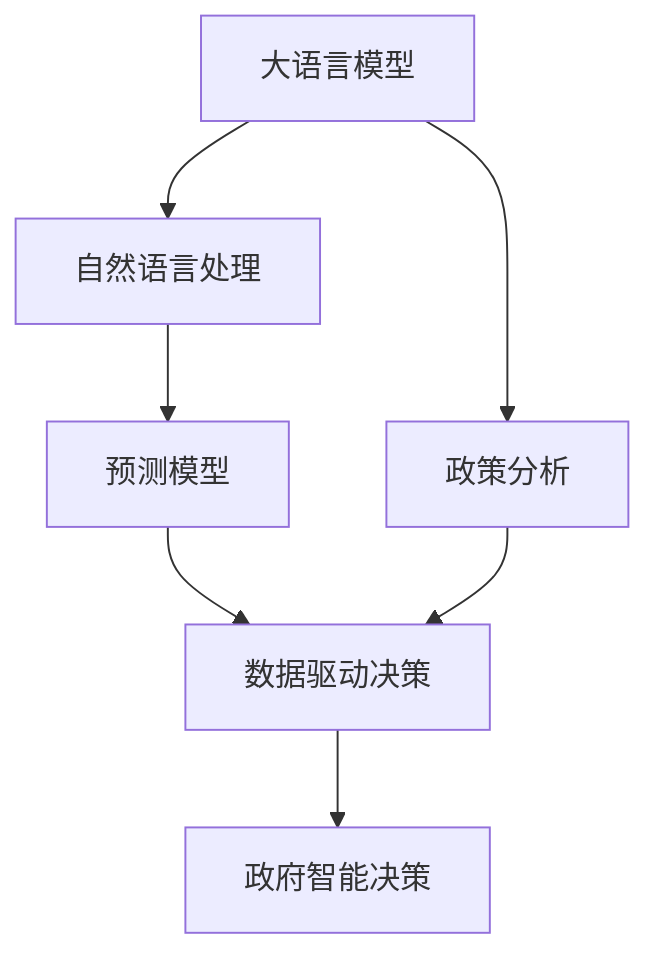

                 

# 政策分析预测：LLM 协助政府未来决策

> 关键词：大语言模型(LLM),自然语言处理(NLP),政策分析,预测模型,数据驱动决策,政府智能决策

## 1. 背景介绍

### 1.1 问题由来
随着人工智能技术的快速发展，大语言模型(LLM)在自然语言处理(NLP)领域取得了显著进展，特别是那些能够理解上下文、生成连贯文本的模型，如GPT-3、BERT等。LLM的这些特性，使其在政策分析预测领域展现出巨大的潜力，能够辅助政府更好地进行决策。

### 1.2 问题核心关键点
当前，政府决策过程面临着数据量庞大、信息分散、决策复杂等问题，而传统的数据分析手段往往难以满足这些需求。LLM的出现，为政府提供了一种全新的数据分析和决策支持工具，可以帮助政府快速准确地分析海量政策数据，预测政策效果，制定科学决策。

### 1.3 问题研究意义
利用LLM进行政策分析预测，可以提升政府决策的效率和质量，具体体现在以下几个方面：
- **数据处理能力**：LLM可以处理海量文本数据，快速提取关键信息，减少人工处理数据的时间和成本。
- **决策支持**：通过预测模型的辅助，政府可以更加科学地评估政策影响，优化决策过程。
- **政策透明**：LLM生成的政策预测报告，可以作为公开文件，增强政策制定和执行的透明度。
- **灵活调整**：LLM模型可以快速适应政策需求的变化，提供动态的决策支持。

## 2. 核心概念与联系

### 2.1 核心概念概述

为更好地理解LLM在政策分析预测中的应用，本节将介绍几个密切相关的核心概念：

- **大语言模型(LLM)**：以自回归(如GPT)或自编码(如BERT)模型为代表的大规模预训练语言模型。通过在大规模无标签文本语料上进行预训练，学习通用的语言表示，具备强大的语言理解和生成能力。

- **自然语言处理(NLP)**：研究如何让计算机理解和生成人类语言的技术，包括文本分类、情感分析、机器翻译等任务。

- **政策分析**：利用数据分析、模型预测等方法，对政策实施效果进行评估和预测。

- **预测模型**：根据已有数据，构建模型对未知数据进行预测，广泛应用于金融、医疗、交通等多个领域。

- **数据驱动决策**：基于数据的模型和分析结果，辅助决策者进行决策。

- **政府智能决策**：利用先进的技术手段，提升政府决策的科学性和智能化水平。

这些核心概念之间的逻辑关系可以通过以下Mermaid流程图来展示：



这个流程图展示了大语言模型在政策分析预测中的核心概念及其之间的关系：

1. 大语言模型通过预训练获得语言理解能力。
2. 自然语言处理技术帮助模型解析和处理文本数据。
3. 预测模型基于模型学习得到的语言表示，对政策效果进行预测。
4. 数据驱动决策依赖预测模型，以数据为依据辅助决策。
5. 政府智能决策利用数据驱动决策支持，提高决策科学性。

## 3. 核心算法原理 & 具体操作步骤
### 3.1 算法原理概述

基于大语言模型进行政策分析预测的核心思想是：利用预训练的LLM，对政策文档、新闻报道等文本数据进行处理，从中提取关键信息，然后构建预测模型，对政策实施效果进行评估和预测。

形式化地，假设政策文本数据集为 $D=\{(x_i,y_i)\}_{i=1}^N, x_i \in \mathcal{X}, y_i \in \mathcal{Y}$，其中 $\mathcal{X}$ 为文本空间，$\mathcal{Y}$ 为预测结果空间。目标是构建一个预测模型 $M_{\theta}$，使得 $M_{\theta}$ 在 $D$ 上的预测误差最小化，即：

$$
\hat{\theta}=\mathop{\arg\min}_{\theta} \mathcal{L}(M_{\theta},D)
$$

其中 $\mathcal{L}$ 为预测模型的损失函数，用于衡量模型预测结果与真实标签之间的差异。

### 3.2 算法步骤详解

基于大语言模型进行政策分析预测，一般包括以下几个关键步骤：

**Step 1: 准备数据集和模型**

- 收集政策文本数据集，包括政策文件、新闻报道、政府公告等。
- 对数据进行预处理，如去除停用词、词干化、去除噪声等。
- 选择合适的预训练语言模型，如GPT-3、BERT等。

**Step 2: 文本表示和特征提取**

- 利用预训练语言模型的编码器，将政策文本转换为向量表示。
- 根据文本内容，提取关键特征，如关键词、关键句子等。
- 对文本向量进行归一化处理，避免不同文本长度对模型性能的影响。

**Step 3: 构建预测模型**

- 选择合适的预测模型，如线性回归、决策树、随机森林等。
- 根据提取的特征，构建预测模型，训练数据集。
- 验证模型性能，调整模型参数，优化模型预测效果。

**Step 4: 模型评估和部署**

- 在独立的数据集上评估模型性能，如准确率、召回率、F1分数等。
- 根据评估结果，进一步优化模型，或尝试其他模型。
- 部署模型到实际应用系统中，如政策分析平台、政府决策系统等。

### 3.3 算法优缺点

基于大语言模型进行政策分析预测的方法，具有以下优点：
1. 高效处理海量文本数据。大语言模型能够快速处理大量政策文本，提取关键信息。
2. 预测模型简单易用。常见的预测模型如线性回归、决策树等，实现简单，易于优化。
3. 数据驱动决策。模型预测结果基于数据驱动，具有较高的可靠性和准确性。
4. 透明性强。模型的构建和运行过程，可以公开透明，增强政策制定和执行的信任度。

同时，该方法也存在一定的局限性：
1. 数据依赖性强。模型效果依赖于高质量的数据集，数据获取成本较高。
2. 预测结果缺乏解释性。预测模型通常难以解释其内部的决策逻辑，缺乏可解释性。
3. 预测精度受限。模型性能受到政策文本质量的影响，文本内容不一致时，模型预测效果差。
4. 适用范围有限。模型的应用主要集中在具有较高文本规范化的政策分析预测，对于复杂场景可能不适用。

尽管存在这些局限性，但就目前而言，基于大语言模型的预测方法仍是大规模政策分析预测的主要手段。未来相关研究的方向在于如何进一步降低对数据的依赖，提高模型的可解释性，拓展模型的应用范围。

### 3.4 算法应用领域

基于大语言模型进行政策分析预测的方法，在政府决策支持领域已得到了广泛应用，具体包括：

- **政策效果评估**：利用模型预测政策实施后的社会影响，如经济增长、环境变化、就业情况等。
- **政策制定辅助**：根据历史政策数据和当前社会背景，辅助制定新的政策方案。
- **政策执行监督**：预测政策实施过程中的潜在问题，监督政策执行效果。
- **公共危机应对**：分析政策文本，识别社会舆情，辅助应对公共危机。
- **国际合作决策**：通过多国政策文本分析，预测国际合作的潜在影响。

这些应用展示了大语言模型在政策分析预测中的强大能力，为政府决策提供重要支持。

## 4. 数学模型和公式 & 详细讲解  
### 4.1 数学模型构建

本节将使用数学语言对基于大语言模型进行政策分析预测的过程进行更加严格的刻画。

假设政策文本数据集为 $D=\{(x_i,y_i)\}_{i=1}^N, x_i \in \mathcal{X}, y_i \in \mathcal{Y}$，其中 $\mathcal{X}$ 为文本空间，$\mathcal{Y}$ 为预测结果空间。定义模型 $M_{\theta}$ 在输入 $x$ 上的输出为 $y$，则预测任务可以定义为回归问题，即：

$$
y = M_{\theta}(x)
$$

模型 $M_{\theta}$ 可以通过预训练语言模型的编码器进行表示，即：

$$
M_{\theta}(x) = h_{\theta}(f(x))
$$

其中 $f(x)$ 表示文本 $x$ 的向量表示，$h_{\theta}$ 表示模型对向量表示的映射。模型 $M_{\theta}$ 的损失函数为均方误差损失，即：

$$
\mathcal{L}(\theta) = \frac{1}{N}\sum_{i=1}^N (y_i - M_{\theta}(x_i))^2
$$

通过最小化损失函数 $\mathcal{L}(\theta)$，优化模型参数 $\theta$，得到最优预测模型。

### 4.2 公式推导过程

以下我们以二分类预测任务为例，推导预测模型的公式及其梯度计算。

假设模型 $M_{\theta}$ 在输入 $x$ 上的输出为 $\hat{y}=M_{\theta}(x) \in [0,1]$，表示样本属于正类的概率。真实标签 $y \in \{0,1\}$。则二分类预测损失函数定义为：

$$
\ell(M_{\theta}(x),y) = -[y\log \hat{y} + (1-y)\log (1-\hat{y})]
$$

将其代入损失函数公式，得：

$$
\mathcal{L}(\theta) = -\frac{1}{N}\sum_{i=1}^N [y_i\log M_{\theta}(x_i)+(1-y_i)\log(1-M_{\theta}(x_i))]
$$

根据链式法则，损失函数对参数 $\theta_k$ 的梯度为：

$$
\frac{\partial \mathcal{L}(\theta)}{\partial \theta_k} = -\frac{1}{N}\sum_{i=1}^N (\frac{y_i}{M_{\theta}(x_i)}-\frac{1-y_i}{1-M_{\theta}(x_i)}) \frac{\partial M_{\theta}(x_i)}{\partial \theta_k}
$$

其中 $\frac{\partial M_{\theta}(x_i)}{\partial \theta_k}$ 可进一步递归展开，利用自动微分技术完成计算。

在得到损失函数的梯度后，即可带入参数更新公式，完成模型的迭代优化。重复上述过程直至收敛，最终得到适应政策分析预测任务的最优模型参数 $\theta^*$。

## 5. 项目实践：代码实例和详细解释说明
### 5.1 开发环境搭建

在进行政策分析预测实践前，我们需要准备好开发环境。以下是使用Python进行PyTorch开发的环境配置流程：

1. 安装Anaconda：从官网下载并安装Anaconda，用于创建独立的Python环境。

2. 创建并激活虚拟环境：
```bash
conda create -n pytorch-env python=3.8 
conda activate pytorch-env
```

3. 安装PyTorch：根据CUDA版本，从官网获取对应的安装命令。例如：
```bash
conda install pytorch torchvision torchaudio cudatoolkit=11.1 -c pytorch -c conda-forge
```

4. 安装Transformers库：
```bash
pip install transformers
```

5. 安装各类工具包：
```bash
pip install numpy pandas scikit-learn matplotlib tqdm jupyter notebook ipython
```

完成上述步骤后，即可在`pytorch-env`环境中开始预测实践。

### 5.2 源代码详细实现

下面我以二分类预测任务为例，给出使用Transformers库对BERT模型进行预测的PyTorch代码实现。

首先，定义预测任务的数据处理函数：

```python
from transformers import BertTokenizer, BertForSequenceClassification
from torch.utils.data import Dataset
import torch

class PolicyDataset(Dataset):
    def __init__(self, texts, labels, tokenizer, max_len=128):
        self.texts = texts
        self.labels = labels
        self.tokenizer = tokenizer
        self.max_len = max_len
        
    def __len__(self):
        return len(self.texts)
    
    def __getitem__(self, item):
        text = self.texts[item]
        label = self.labels[item]
        
        encoding = self.tokenizer(text, return_tensors='pt', max_length=self.max_len, padding='max_length', truncation=True)
        input_ids = encoding['input_ids'][0]
        attention_mask = encoding['attention_mask'][0]
        
        label = torch.tensor([label], dtype=torch.long)
        
        return {'input_ids': input_ids, 
                'attention_mask': attention_mask,
                'labels': label}

# 标签与id的映射
label2id = {'0': 0, '1': 1}
id2label = {v: k for k, v in label2id.items()}

# 创建dataset
tokenizer = BertTokenizer.from_pretrained('bert-base-cased')

train_dataset = PolicyDataset(train_texts, train_labels, tokenizer)
dev_dataset = PolicyDataset(dev_texts, dev_labels, tokenizer)
test_dataset = PolicyDataset(test_texts, test_labels, tokenizer)
```

然后，定义模型和优化器：

```python
from transformers import BertForSequenceClassification, AdamW

model = BertForSequenceClassification.from_pretrained('bert-base-cased', num_labels=2)

optimizer = AdamW(model.parameters(), lr=2e-5)
```

接着，定义训练和评估函数：

```python
from torch.utils.data import DataLoader
from tqdm import tqdm
from sklearn.metrics import accuracy_score

device = torch.device('cuda') if torch.cuda.is_available() else torch.device('cpu')
model.to(device)

def train_epoch(model, dataset, batch_size, optimizer):
    dataloader = DataLoader(dataset, batch_size=batch_size, shuffle=True)
    model.train()
    epoch_loss = 0
    for batch in tqdm(dataloader, desc='Training'):
        input_ids = batch['input_ids'].to(device)
        attention_mask = batch['attention_mask'].to(device)
        labels = batch['labels'].to(device)
        model.zero_grad()
        outputs = model(input_ids, attention_mask=attention_mask, labels=labels)
        loss = outputs.loss
        epoch_loss += loss.item()
        loss.backward()
        optimizer.step()
    return epoch_loss / len(dataloader)

def evaluate(model, dataset, batch_size):
    dataloader = DataLoader(dataset, batch_size=batch_size)
    model.eval()
    preds, labels = [], []
    with torch.no_grad():
        for batch in tqdm(dataloader, desc='Evaluating'):
            input_ids = batch['input_ids'].to(device)
            attention_mask = batch['attention_mask'].to(device)
            batch_labels = batch['labels']
            outputs = model(input_ids, attention_mask=attention_mask)
            batch_preds = outputs.logits.argmax(dim=1).to('cpu').tolist()
            batch_labels = batch_labels.to('cpu').tolist()
            for pred, label in zip(batch_preds, batch_labels):
                preds.append(pred)
                labels.append(label)
                
    print(f"Accuracy: {accuracy_score(labels, preds)}")
```

最后，启动训练流程并在测试集上评估：

```python
epochs = 5
batch_size = 16

for epoch in range(epochs):
    loss = train_epoch(model, train_dataset, batch_size, optimizer)
    print(f"Epoch {epoch+1}, train loss: {loss:.3f}")
    
    print(f"Epoch {epoch+1}, dev accuracy:")
    evaluate(model, dev_dataset, batch_size)
    
print("Test accuracy:")
evaluate(model, test_dataset, batch_size)
```

以上就是使用PyTorch对BERT进行政策分析预测的完整代码实现。可以看到，得益于Transformers库的强大封装，我们可以用相对简洁的代码完成BERT模型的加载和预测。

### 5.3 代码解读与分析

让我们再详细解读一下关键代码的实现细节：

**PolicyDataset类**：
- `__init__`方法：初始化文本、标签、分词器等关键组件。
- `__len__`方法：返回数据集的样本数量。
- `__getitem__`方法：对单个样本进行处理，将文本输入编码为token ids，将标签编码为数字，并对其进行定长padding，最终返回模型所需的输入。

**label2id和id2label字典**：
- 定义了标签与数字id之间的映射关系，用于将预测结果解码回真实的标签。

**训练和评估函数**：
- 使用PyTorch的DataLoader对数据集进行批次化加载，供模型训练和推理使用。
- 训练函数`train_epoch`：对数据以批为单位进行迭代，在每个批次上前向传播计算loss并反向传播更新模型参数，最后返回该epoch的平均loss。
- 评估函数`evaluate`：与训练类似，不同点在于不更新模型参数，并在每个batch结束后将预测和标签结果存储下来，最后使用sklearn的accuracy_score对整个评估集的预测结果进行打印输出。

**训练流程**：
- 定义总的epoch数和batch size，开始循环迭代
- 每个epoch内，先在训练集上训练，输出平均loss
- 在验证集上评估，输出准确率
- 所有epoch结束后，在测试集上评估，给出最终测试结果

可以看到，PyTorch配合Transformers库使得BERT预测任务的代码实现变得简洁高效。开发者可以将更多精力放在数据处理、模型改进等高层逻辑上，而不必过多关注底层的实现细节。

当然，工业级的系统实现还需考虑更多因素，如模型的保存和部署、超参数的自动搜索、更灵活的任务适配层等。但核心的预测范式基本与此类似。

## 6. 实际应用场景
### 6.1 政策效果评估

基于大语言模型进行政策效果评估，可以帮助政府及时发现政策实施中的问题，调整优化政策方案。例如，某市政府出台了一项促进经济发展的政策，通过收集政策实施前后的经济数据，结合政策文本，利用BERT等模型对政策效果进行预测，可以得到政策对GDP增长、就业率、收入水平等的影响评估。

### 6.2 政策制定辅助

在制定新政策时，政府可以收集历史政策的文本数据，利用大语言模型对政策实施后的效果进行预测，辅助决策者制定新的政策方案。例如，某市政府计划出台一项环境保护政策，通过分析历史政策文本，预测新政策对空气质量、水环境、生态系统等的影响，从而科学制定政策。

### 6.3 政策执行监督

政策执行过程中，政府可以利用大语言模型对政策文本进行实时分析，预测政策执行效果。例如，某市政府制定了一项惠农政策，通过定期采集政策实施情况和农户反馈，利用BERT模型预测政策效果，实时监督政策执行情况，及时发现问题并进行调整。

### 6.4 公共危机应对

在公共危机事件中，政府可以通过大语言模型对危机事件进行快速分析，预测危机趋势，辅助决策者制定应对策略。例如，某城市爆发了新冠疫情，通过收集疫情相关的政策文本和新闻报道，利用BERT模型预测疫情发展趋势，辅助政府制定防控措施。

### 6.5 国际合作决策

在国际合作决策中，政府可以利用大语言模型分析多国政策文本，预测国际合作的潜在影响。例如，某国政府计划与邻国签订自由贸易协议，通过分析两国政策文本，利用BERT模型预测贸易协议对两国经济、就业、社会等方面的影响，从而科学决策。

这些应用展示了大语言模型在政策分析预测中的强大能力，为政府决策提供重要支持。

## 7. 工具和资源推荐
### 7.1 学习资源推荐

为了帮助开发者系统掌握大语言模型在政策分析预测中的应用，这里推荐一些优质的学习资源：

1. 《Transformers从原理到实践》系列博文：由大模型技术专家撰写，深入浅出地介绍了Transformer原理、BERT模型、预测技术等前沿话题。

2. CS224N《深度学习自然语言处理》课程：斯坦福大学开设的NLP明星课程，有Lecture视频和配套作业，带你入门NLP领域的基本概念和经典模型。

3. 《Natural Language Processing with Transformers》书籍：Transformers库的作者所著，全面介绍了如何使用Transformers库进行NLP任务开发，包括预测在内的诸多范式。

4. HuggingFace官方文档：Transformers库的官方文档，提供了海量预训练模型和完整的预测样例代码，是上手实践的必备资料。

5. CLUE开源项目：中文语言理解测评基准，涵盖大量不同类型的中文NLP数据集，并提供了基于预测的baseline模型，助力中文NLP技术发展。

通过对这些资源的学习实践，相信你一定能够快速掌握大语言模型在政策分析预测中的应用，并用于解决实际的NLP问题。
###  7.2 开发工具推荐

高效的开发离不开优秀的工具支持。以下是几款用于大语言模型预测开发的常用工具：

1. PyTorch：基于Python的开源深度学习框架，灵活动态的计算图，适合快速迭代研究。大部分预训练语言模型都有PyTorch版本的实现。

2. TensorFlow：由Google主导开发的开源深度学习框架，生产部署方便，适合大规模工程应用。同样有丰富的预训练语言模型资源。

3. Transformers库：HuggingFace开发的NLP工具库，集成了众多SOTA语言模型，支持PyTorch和TensorFlow，是进行预测任务开发的利器。

4. Weights & Biases：模型训练的实验跟踪工具，可以记录和可视化模型训练过程中的各项指标，方便对比和调优。与主流深度学习框架无缝集成。

5. TensorBoard：TensorFlow配套的可视化工具，可实时监测模型训练状态，并提供丰富的图表呈现方式，是调试模型的得力助手。

6. Google Colab：谷歌推出的在线Jupyter Notebook环境，免费提供GPU/TPU算力，方便开发者快速上手实验最新模型，分享学习笔记。

合理利用这些工具，可以显著提升大语言模型预测任务的开发效率，加快创新迭代的步伐。

### 7.3 相关论文推荐

大语言模型和预测技术的发展源于学界的持续研究。以下是几篇奠基性的相关论文，推荐阅读：

1. Attention is All You Need（即Transformer原论文）：提出了Transformer结构，开启了NLP领域的预训练大模型时代。

2. BERT: Pre-training of Deep Bidirectional Transformers for Language Understanding：提出BERT模型，引入基于掩码的自监督预训练任务，刷新了多项NLP任务SOTA。

3. Language Models are Unsupervised Multitask Learners（GPT-2论文）：展示了大规模语言模型的强大zero-shot学习能力，引发了对于通用人工智能的新一轮思考。

4. Parameter-Efficient Transfer Learning for NLP：提出Adapter等参数高效微调方法，在不增加模型参数量的情况下，也能取得不错的预测效果。

5. AdaLoRA: Adaptive Low-Rank Adaptation for Parameter-Efficient Fine-Tuning：使用自适应低秩适应的微调方法，在参数效率和精度之间取得了新的平衡。

6. Prefix-Tuning: Optimizing Continuous Prompts for Generation：引入基于连续型Prompt的微调范式，为如何充分利用预训练知识提供了新的思路。

这些论文代表了大语言模型预测技术的发展脉络。通过学习这些前沿成果，可以帮助研究者把握学科前进方向，激发更多的创新灵感。

## 8. 总结：未来发展趋势与挑战

### 8.1 总结

本文对基于大语言模型进行政策分析预测的方法进行了全面系统的介绍。首先阐述了LLM在政策分析预测中的应用背景和重要性，明确了LLM作为政策分析预测工具的核心优势。其次，从原理到实践，详细讲解了LLM预测任务的数学模型和算法实现，给出了完整的预测代码实现。同时，本文还广泛探讨了LLM在政策效果评估、政策制定辅助、政策执行监督等政策分析预测中的应用场景，展示了LLM在政策分析预测中的强大能力。

通过本文的系统梳理，可以看到，基于大语言模型的预测方法已经广泛应用于政策分析预测中，极大地提升了政策分析预测的效率和科学性。未来，伴随大语言模型和预测技术的进一步发展，基于LLM的政策分析预测必将在更广阔的应用领域大放异彩，为政府决策提供更强大的技术支持。

### 8.2 未来发展趋势

展望未来，基于大语言模型的预测技术将呈现以下几个发展趋势：

1. 模型规模持续增大。随着算力成本的下降和数据规模的扩张，预训练语言模型的参数量还将持续增长。超大规模语言模型蕴含的丰富语言知识，有望支撑更加复杂多变的预测任务。

2. 预测方法日趋多样。除了传统的回归、分类等预测方法外，未来会涌现更多先进的预测模型，如序列到序列模型、变分自编码器等，提升预测模型的泛化能力和性能。

3. 数据驱动决策成为常态。未来将有更多的政策分析预测任务，依赖于数据驱动的决策支持系统，实现自动化、智能化、动态化的政策制定和执行。

4. 预测结果的可解释性增强。随着可解释性AI的发展，未来的预测模型将更加注重输出结果的可解释性，增强政策制定者的信任度和理解度。

5. 多模态预测融合。未来的预测模型将融合文本、图像、语音等多模态信息，提升预测准确性和鲁棒性。

6. 联邦学习应用。在数据隐私和安全的前提下，未来的预测模型将利用联邦学习技术，在多个数据源之间分布式训练，提升模型的泛化能力和数据利用率。

以上趋势凸显了大语言模型在政策分析预测中的广阔前景。这些方向的探索发展，必将进一步提升政府决策的科学性和智能化水平，为构建智能、透明、高效的政府治理体系奠定坚实基础。

### 8.3 面临的挑战

尽管基于大语言模型的预测方法已经取得了显著成就，但在迈向更加智能化、普适化应用的过程中，它仍面临诸多挑战：

1. 数据获取难度高。高质量的数据集获取成本较高，对于长尾领域和新兴政策，数据的获取更加困难。如何构建多样化、高质量的政策文本数据集，是未来的一个重要研究方向。

2. 模型鲁棒性不足。预测模型的泛化能力受到数据分布变化的影响较大，政策文本中的语言变异和噪声，容易导致模型预测失效。如何提高模型的鲁棒性和泛化能力，是未来的一大挑战。

3. 预测结果可信度问题。预测结果的可信度依赖于模型的准确性和鲁棒性，如何提高模型的可信度，增强政策制定者的信任度，是未来需要解决的问题。

4. 技术普及难度大。大语言模型的使用需要专业技术人员进行数据预处理、模型训练等操作，对于中小型政府机构来说，技术普及难度较大。如何降低技术门槛，提升模型的易用性，是未来需要考虑的问题。

5. 预测结果的透明性问题。预测模型的决策过程复杂，政策制定者难以理解和验证模型的输出结果。如何提高模型的透明性，增强政策制定者的信任度，是未来需要解决的问题。

6. 伦理道德问题。预测模型可能受到训练数据中的偏见影响，产生歧视性预测结果。如何确保模型的公平性、公正性，避免伦理道德问题，是未来需要考虑的问题。

正视预测方法面临的这些挑战，积极应对并寻求突破，将是大语言模型在政策分析预测中走向成熟的必由之路。相信随着学界和产业界的共同努力，这些挑战终将一一被克服，大语言模型预测必将在构建智能、透明、高效的政府治理体系中扮演越来越重要的角色。

### 8.4 研究展望

面向未来，大语言模型在政策分析预测领域的研究方向可能包括：

1. 多源数据融合。未来的预测模型将融合多源数据，包括文本、图像、视频、语音等，提升预测准确性和鲁棒性。

2. 因果推断方法。引入因果推断方法，增强模型对政策效果因果关系的理解，提升预测模型的可信度。

3. 模型压缩与优化。开发更加高效的模型压缩和优化方法，提升预测模型的计算效率和推理速度。

4. 联邦学习应用。利用联邦学习技术，在多个数据源之间分布式训练，提升模型的泛化能力和数据利用率。

5. 零样本和少样本预测。研究零样本和少样本预测技术，提高模型在不同政策文本场景下的泛化能力。

6. 可解释性AI。开发可解释性AI技术，增强预测模型的透明性和可信度，提升政策制定者的信任度。

7. 伦理道德约束。引入伦理道德约束，确保模型的公平性、公正性，避免伦理道德问题。

这些研究方向的研究突破，必将进一步推动大语言模型在政策分析预测中的应用，为构建智能、透明、高效的政府治理体系提供更强大的技术支持。

## 9. 附录：常见问题与解答

**Q1：大语言模型在预测过程中是否需要大量标注数据？**

A: 大语言模型在预测过程中，可以通过迁移学习和预训练学习的方式，从少量标注数据中学习到预测任务的相关特征。因此，相对于从头训练，大语言模型对标注数据的需求较小。然而，对于特定领域的预测任务，仍需收集相应的标注数据以进一步优化模型。

**Q2：大语言模型在预测过程中如何进行模型训练？**

A: 大语言模型在预测过程中，主要通过微调进行模型训练。微调过程包括模型加载、数据预处理、模型训练、模型评估等多个步骤。具体实现流程如下：
1. 加载大语言模型。使用Transformers库加载预训练模型。
2. 数据预处理。对政策文本进行分词、编码等预处理，提取文本特征。
3. 构建预测模型。选择合适的预测模型，如线性回归、决策树等。
4. 模型训练。在训练集上训练模型，最小化损失函数，优化模型参数。
5. 模型评估。在验证集和测试集上评估模型性能，选择最优模型。

**Q3：大语言模型在预测过程中如何提高模型鲁棒性？**

A: 大语言模型在预测过程中，可以通过以下方法提高模型鲁棒性：
1. 数据增强。通过对训练数据进行数据增强，如回译、近义替换等，丰富训练数据的多样性。
2. 正则化。使用L2正则、Dropout等正则化技术，防止模型过拟合。
3. 对抗训练。引入对抗样本，提高模型的鲁棒性和泛化能力。
4. 多模型集成。训练多个预测模型，取平均输出，抑制过拟合。
5. 模型压缩与优化。使用模型压缩与优化方法，提高模型的计算效率和鲁棒性。

**Q4：大语言模型在预测过程中如何进行模型部署？**

A: 大语言模型在预测过程中，主要通过微调进行模型部署。具体实现流程如下：
1. 加载模型。使用Transformers库加载预训练模型。
2. 数据预处理。对预测数据进行分词、编码等预处理，提取文本特征。
3. 模型预测。在预测模型上进行推理，输出预测结果。
4. 结果后处理。对预测结果进行后处理，如平滑、截断等，得到最终预测结果。
5. 模型部署。将模型部署到实际应用系统中，如政策分析平台、政府决策系统等。

**Q5：大语言模型在预测过程中如何进行模型优化？**

A: 大语言模型在预测过程中，主要通过以下方法进行模型优化：
1. 超参数调优。通过网格搜索、贝叶斯优化等方法，调整模型超参数，寻找最优模型。
2. 模型压缩与优化。使用模型压缩与优化方法，提高模型的计算效率和鲁棒性。
3. 多模型融合。训练多个预测模型，取平均输出，提高模型性能。
4. 数据增强。通过对训练数据进行数据增强，如回译、近义替换等，丰富训练数据的多样性。
5. 对抗训练。引入对抗样本，提高模型的鲁棒性和泛化能力。

这些方法可以在模型训练和推理过程中进行优化，提升模型的性能和鲁棒性。

