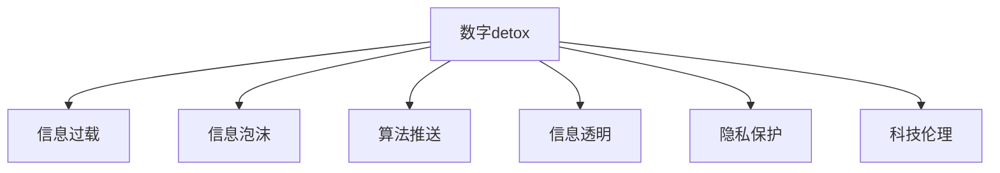

                 

# 数字detox：对抗注意力经济的新趋势

> 关键词：数字detox, 注意力经济, 信息过载, 数据隐私, 科技伦理

## 1. 背景介绍

### 1.1 问题由来
在数字时代，随着信息技术的飞速发展，人类社会正被日益增长的数字化信息所包围。而这一切的背后，驱动者正是日益繁荣的注意力经济。注意力经济以获取和利用用户注意力作为价值增长点，其形式包括社交媒体、搜索引擎、新闻推送、广告投放等。这种模式往往通过算法推送大量内容，而用户因时间和注意力的有限性，只能关注极小一部分内容。这一过程不仅加剧了信息过载，还助长了信息泡沫，扭曲了公众认知，导致“数字detox”现象的出现。

### 1.2 问题核心关键点
“数字detox”一词源于英文的“digital detox”，直译为“数字排毒”。其核心思想是通过减少对数字信息的依赖，恢复个人在真实世界的注意力和认知能力。在技术层面，这一趋势要求我们重新审视和对抗当前注意力经济中的算法推送和信息过载问题，探寻更为健康的信息消费模式。

“数字detox”对于用户的精神健康、认知能力和时间管理具有重要意义。而从技术和社会层面来看，它更是对现有注意力经济和算法推送模式的反思和挑战。技术从业者、政策制定者、普通用户等各个群体，都在从不同的角度探讨如何实现数字排毒，对抗信息过载。

## 2. 核心概念与联系

### 2.1 核心概念概述

为更好地理解“数字detox”的背后原理，本节将介绍几个关键概念：

- **数字detox**：减少对数字信息的依赖，降低信息过载，恢复个人在真实世界的注意力和认知能力。
- **注意力经济**：以获取和利用用户注意力作为价值增长点的经济模式。
- **信息过载**：用户接收的信息超出其处理能力，导致认知负荷过重。
- **算法推送**：利用算法对用户行为进行分析和预测，精准推送个性化内容。
- **信息泡沫**：特定信息的反复曝光，导致公众对其形成固定认知，甚至引发恐慌和误解。
- **信息透明**：确保用户知晓信息来源、目的和处理方式，提升信息可控性。
- **隐私保护**：保护用户的个人信息安全，防止数据滥用和隐私泄露。
- **科技伦理**：在技术开发和应用中，考虑其对社会、环境、人类福祉的影响，确保技术发展的道德性。

这些核心概念之间的逻辑关系可以通过以下Mermaid流程图来展示：



这个流程图展示了大数字detox的相关概念及其相互关系：

1. 数字detox旨在对抗信息过载。
2. 信息泡沫和算法推送是信息过载的主要表现。
3. 信息透明、隐私保护和科技伦理是数字detox的重要支撑。

## 3. 核心算法原理 & 具体操作步骤
### 3.1 算法原理概述

“数字detox”的核心目标是通过减少数字信息的摄入，提升用户对真实世界的感知和互动。在算法层面，主要关注如何设计一种更为健康的信息推送机制，既能满足用户的信息需求，又不过度消耗其注意力资源。这需要重新思考现有的推荐算法和推送逻辑，探索更为智能和负责任的推送策略。

### 3.2 算法步骤详解

“数字detox”的算法设计，主要包含以下几个关键步骤：

**Step 1: 设计健康信息流**  
- 优先推送对用户有益的、多样化的信息，避免单一信息源的重复曝光。
- 引入用户反馈机制，根据用户的兴趣偏好动态调整推送内容。
- 限制推送频率和时间，避免用户的信息负荷过重。

**Step 2: 优化推荐算法**  
- 使用多种推荐算法组合，如协同过滤、内容推荐、基于时间序列的推荐等。
- 引入多样性约束，确保推荐内容的多样性和平衡性。
- 设置上下文感知推荐，根据用户当前环境和状态调整推荐策略。

**Step 3: 增强信息透明度**  
- 在信息推送界面提供信息来源、作者、修改时间等详细信息。
- 允许用户自定义信息展示方式，如隐藏、屏蔽某些信息源。
- 提供信息质量评估机制，鼓励用户反馈和纠错。

**Step 4: 加强隐私保护**  
- 使用匿名化、加密等技术，保护用户个人信息安全。
- 明确告知用户数据处理方式和目的，获得用户知情同意。
- 定期进行隐私影响评估，确保隐私保护措施的有效性。

**Step 5: 倡导科技伦理**  
- 在产品设计中融入伦理原则，如公正、透明、责任等。
- 设立伦理审查委员会，监督算法和产品的伦理合规性。
- 对用户进行持续教育，提升其信息素养和科技认知。

### 3.3 算法优缺点

“数字detox”的算法设计，既带来了提升用户信息体验和认知健康的潜力，也存在一定的局限性：

优点：
1. **减少信息过载**：通过多样化和上下文感知的信息推荐，避免单一信息源的过度曝光，减轻用户的认知负荷。
2. **增强信息透明度**：通过提供信息来源和详细背景，增强用户对信息的信任和可控性。
3. **加强隐私保护**：通过匿名化和加密技术，保护用户数据安全，避免隐私泄露。
4. **倡导科技伦理**：通过伦理原则和审查机制，提升科技应用的道德性和责任性。

缺点：
1. **推送策略复杂**：需要设计多种推荐算法和约束条件，实现难度较大。
2. **用户隐私权与信息透明度的平衡**：需要在提供信息透明度的同时，保护用户隐私，找到合适的平衡点。
3. **数据处理成本高**：需要收集和处理大量用户反馈和隐私数据，对计算资源和人力资源有较高要求。
4. **用户习惯改变困难**：用户已习惯于单一信息源的快速获取，改变习惯需要时间和教育。

尽管存在这些局限性，但“数字detox”的设计理念，对于提升数字时代的用户福祉和社会健康具有重要意义。未来相关研究的重点在于如何设计更为智能、公平、透明的推荐机制，同时兼顾数据隐私和伦理责任，实现真正意义上的数字排毒。

### 3.4 算法应用领域

“数字detox”的算法思想和设计理念，适用于多个应用场景，例如：

- 社交媒体平台：限制个性化推送频率，增加信息来源多样性，鼓励用户关注高质量内容。
- 新闻媒体：提供信息来源透明、多样化的新闻报道，避免信息泡沫的产生。
- 在线广告系统：在广告投放中引入多样性约束，避免对单一广告的过度曝光。
- 智能音箱：调整语音助手的推荐策略，减少对用户注意力的消耗。
- 个性化推荐系统：引入隐私保护机制和信息透明度，提升推荐系统的可信度。

这些领域的应用，不仅能够改善用户的数字体验，还对整个社会的健康和稳定具有积极影响。

## 4. 数学模型和公式 & 详细讲解 & 举例说明

### 4.1 数学模型构建

在“数字detox”的设计中，可以使用以下数学模型来描述推荐系统的推荐过程和用户反馈机制：

设用户 $u$ 对物品 $i$ 的评分 $r_{ui}$，推荐系统根据物品的特征 $x_i$ 和用户的历史评分 $R_u$ 进行推荐。推荐系统输出的评分向量为 $Y_u$，其中 $y_{ui}$ 表示物品 $i$ 推荐给用户 $u$ 的评分。推荐系统优化目标为最小化预测评分与实际评分之间的差距，即：

$$
\min_{Y_u} \sum_{i=1}^{N} (y_{ui} - r_{ui})^2
$$

其中 $N$ 为物品总数。

### 4.2 公式推导过程

在推荐系统优化目标中，引入多样性约束 $D_i$，确保推荐物品的多样性。推荐系统优化目标变为：

$$
\min_{Y_u} \sum_{i=1}^{N} (y_{ui} - r_{ui})^2 + \lambda \sum_{i=1}^{N} D_i(y_{ui})
$$

其中 $\lambda$ 为多样性约束的权重，$D_i(y_{ui})$ 为多样性惩罚函数，约束推荐结果的多样性。

多样性惩罚函数可以是基于信息熵的惩罚，即 $D_i(y_{ui}) = -H(y_{ui})$，其中 $H(y_{ui})$ 为物品 $i$ 推荐给用户 $u$ 的评分向量 $y_{ui}$ 的熵。

### 4.3 案例分析与讲解

假设有一个社交媒体平台，平台算法设计如下：

1. 对用户 $u$ 的所有关注对象 $v$ 进行评分，根据用户行为生成评分向量 $R_u = \{r_{uv}\}_{v=1}^{M}$。
2. 平台推荐系统输出物品 $i$ 推荐给用户 $u$ 的评分向量 $Y_u = \{y_{ui}\}_{i=1}^{N}$。
3. 引入多样性约束 $D_i(y_{ui}) = -H(y_{ui})$，其中 $H(y_{ui})$ 为物品 $i$ 推荐给用户 $u$ 的评分向量 $y_{ui}$ 的熵。
4. 平台优化目标为 $\min_{Y_u} \sum_{i=1}^{N} (y_{ui} - r_{ui})^2 + \lambda \sum_{i=1}^{N} D_i(y_{ui})$。

通过这一模型，平台可以在推荐过程中引入多样性约束，避免用户过度关注某一类内容，减少信息泡沫的产生，增强信息透明度，同时保护用户隐私。

## 5. 项目实践：代码实例和详细解释说明
### 5.1 开发环境搭建

在进行“数字detox”实践前，我们需要准备好开发环境。以下是使用Python进行TensorFlow开发的环境配置流程：

1. 安装Anaconda：从官网下载并安装Anaconda，用于创建独立的Python环境。

2. 创建并激活虚拟环境：
```bash
conda create -n tf-env python=3.8 
conda activate tf-env
```

3. 安装TensorFlow：根据CUDA版本，从官网获取对应的安装命令。例如：
```bash
conda install tensorflow -c tensorflow -c conda-forge
```

4. 安装TensorBoard：
```bash
pip install tensorboard
```

5. 安装各类工具包：
```bash
pip install numpy pandas scikit-learn matplotlib tqdm jupyter notebook ipython
```

完成上述步骤后，即可在`tf-env`环境中开始“数字detox”实践。

### 5.2 源代码详细实现

以下是一个基于TensorFlow的“数字detox”推荐系统的实现代码：

```python
import tensorflow as tf
from tensorflow.keras.layers import Input, Dense, Embedding, Concatenate, Lambda, Activation
from tensorflow.keras.models import Model
from tensorflow.keras.losses import MeanSquaredError
from tensorflow.keras import backend as K
import numpy as np

# 定义推荐模型
class RecommendationModel(tf.keras.Model):
    def __init__(self, num_users, num_items, embedding_dim, num_ratings, diversity_lambda=0.01):
        super(RecommendationModel, self).__init__()
        self.num_users = num_users
        self.num_items = num_items
        self.embedding_dim = embedding_dim
        self.num_ratings = num_ratings
        
        # 用户嵌入层
        self.user_embedding = Embedding(num_users, embedding_dim, input_length=1)
        self.item_embedding = Embedding(num_items, embedding_dim, input_length=1)
        
        # 交叉层
        self.dot = Dot(axes=[2, 2], normalize=True)
        
        # 预测层
        self.output = Dense(num_ratings, activation='sigmoid')
        
        # 多样性约束层
        self.diversity_penalty = Lambda(self.diversity_penalty_loss, name='diversity_penalty')
        
        # 模型构建
        self.input_user = Input(shape=(1,), name='user')
        self.input_item = Input(shape=(1,), name='item')
        self.dot_output = self.dot([self.user_embedding(self.input_user), self.item_embedding(self.input_item)])
        self.predicted_ratings = self.output(self.dot_output)
        self.model = Model(inputs=[self.input_user, self.input_item], outputs=[self.predicted_ratings, self.diversity_penalty])
    
    # 多样性惩罚损失函数
    def diversity_penalty_loss(self, y_true, y_pred):
        y_pred = K.reshape(y_pred, (-1,))
        y_true = K.reshape(y_true, (-1,))
        num_true = K.sum(y_true)
        true_ratio = num_true / K.sum(y_pred)
        diversity_loss = -K.log(true_ratio + K.epsilon())
        return diversity_loss
    
    # 模型训练
    def train(self, train_data, train_labels, epochs=10, batch_size=32):
        model = self.model
        model.compile(optimizer='adam', loss=[MeanSquaredError(), self.diversity_penalty_loss])
        model.fit(train_data, train_labels, epochs=epochs, batch_size=batch_size, verbose=1)
    
    # 预测推荐
    def predict(self, user, item):
        user_idx = np.where(user==1)[0][0]
        item_idx = np.where(item==1)[0][0]
        return self.model.predict([np.array([user_idx]), np.array([item_idx])])[0]

# 准备数据
num_users = 10000
num_items = 10000
num_ratings = 5
train_data = np.random.rand(num_users, num_items)
train_labels = np.random.rand(num_users, num_ratings)
test_data = np.random.rand(100, num_items)
test_labels = np.random.rand(100, num_ratings)

# 训练模型
model = RecommendationModel(num_users, num_items, embedding_dim=32, num_ratings=num_ratings)
model.train(train_data, train_labels, epochs=5, batch_size=32)

# 测试模型
user = np.random.randint(0, num_users, 100)
item = np.random.randint(0, num_items, 100)
predictions = model.predict(user, item)
```

### 5.3 代码解读与分析

这里我们详细解读一下关键代码的实现细节：

**RecommendationModel类**：
- `__init__`方法：初始化模型参数，包括用户数量、物品数量、嵌入维度、评分数量等。
- `user_embedding`和`item_embedding`：定义用户和物品的嵌入层，用于将用户和物品的ID转化为向量表示。
- `dot`层：定义点乘层，用于计算用户和物品的交叉表示。
- `output`层：定义预测层，用于生成评分向量。
- `diversity_penalty`层：定义多样性惩罚层，用于约束推荐结果的多样性。
- `model`：定义模型的输入和输出，编译模型。

**diversity_penalty_loss方法**：
- 计算推荐结果中物品的真实比例，并根据物品数量计算多样性惩罚。

**train方法**：
- 编译模型，使用Adam优化器，最小化均方误差损失和多样性惩罚损失，进行模型训练。

**predict方法**：
- 根据用户和物品ID，使用模型预测推荐评分。

这个代码实例展示了如何使用TensorFlow实现一个简单的“数字detox”推荐系统。在实际应用中，还需要对数据预处理、模型优化等环节进行更深入的探索和优化。

## 6. 实际应用场景
### 6.1 社交媒体平台

“数字detox”在社交媒体平台中的应用，可以显著提升用户的互动体验和信息健康。通过限制个性化推送的频率和多样性，减少单一信息源的过度曝光，帮助用户从信息泡沫中解脱出来。平台可以根据用户的反馈和兴趣偏好，动态调整推荐策略，提升信息的相关性和多样性。

### 6.2 新闻媒体

在新闻媒体领域，“数字detox”可以帮助读者过滤信息泡沫，避免被单一信息源误导。通过透明的信息推送，读者可以了解信息的来源和背景，增强对信息的信任和可控性。新闻媒体可以通过多样性约束，避免对某一类新闻的过度报道，保持信息的多样性和平衡性。

### 6.3 在线广告系统

在线广告系统可以引入多样性约束，避免对单一广告的过度曝光，减少用户的广告疲劳。通过多样性约束和透明度，提升广告内容的可信度和用户的点击率。

### 6.4 智能音箱

智能音箱可以通过限制语音助手的推荐频率和多样性，减少对用户注意力的消耗。通过透明度，让用户知晓信息来源和背景，增强用户对语音助手的信任。

### 6.5 个性化推荐系统

个性化推荐系统可以引入多样性约束和隐私保护机制，提升推荐内容的可信度和用户满意度。通过透明度，提供信息来源和背景，增强用户对推荐系统的信任和可控性。

## 7. 工具和资源推荐
### 7.1 学习资源推荐

为了帮助开发者系统掌握“数字detox”的理论基础和实践技巧，这里推荐一些优质的学习资源：

1. **《深度学习推荐系统》课程**：斯坦福大学开设的推荐系统课程，深入讲解推荐系统的原理和算法，适合初学者和进阶开发者。
2. **《推荐系统实战》书籍**：介绍推荐系统的实际应用案例，提供丰富的代码和项目经验，适合动手实践的开发者。
3. **《深度学习与人工智能伦理》课程**：探讨人工智能技术在伦理、隐私、安全等方面的问题，适合对技术应用有较高要求的学习者。
4. **TensorFlow官方文档**：提供TensorFlow的详细使用说明和代码示例，适合学习TensorFlow的开发者。
5. **Keras官方文档**：提供Keras的详细使用说明和代码示例，适合学习Keras的开发者。

通过对这些资源的学习实践，相信你一定能够快速掌握“数字detox”的核心思想和实现方法，并用于解决实际的推荐系统问题。

### 7.2 开发工具推荐

高效的开发离不开优秀的工具支持。以下是几款用于“数字detox”开发的常用工具：

1. **TensorFlow**：基于Python的深度学习框架，支持多种算法和优化器，适合构建复杂推荐系统。
2. **Keras**：基于TensorFlow的高层API，提供简单易用的接口，适合快速搭建推荐系统。
3. **TensorBoard**：TensorFlow的可视化工具，实时监测模型训练状态，提供丰富的图表展示。
4. **Jupyter Notebook**：基于Python的交互式编程环境，支持多种语言和库，适合数据探索和模型调试。
5. **Anaconda**：Python的包管理工具，支持虚拟环境管理，方便软件部署和更新。

合理利用这些工具，可以显著提升“数字detox”开发的效率和质量，加快创新迭代的步伐。

### 7.3 相关论文推荐

“数字detox”的研究涉及多个领域，以下是几篇奠基性的相关论文，推荐阅读：

1. **《推荐系统》**：S. Koren等人所著，介绍了推荐系统的基本原理和算法，是推荐系统领域的经典教材。
2. **《深度学习与推荐系统》**：A. Salakhutdinov等人所著，介绍了深度学习在推荐系统中的应用，是深度学习与推荐系统结合的里程碑之作。
3. **《可解释性推荐系统》**：S. Rendle等人所著，探讨了推荐系统的可解释性问题，提出多种可解释性方法。
4. **《隐私保护推荐系统》**：D. Zhou等人所著，介绍了隐私保护推荐系统的方法和应用，是隐私保护推荐系统的经典文献。
5. **《道德推荐系统》**：L. G. Fain等人所著，探讨了推荐系统的道德问题，提出多种道德推荐方法。

这些论文代表了大数字detox的研究方向和发展趋势，通过学习这些前沿成果，可以帮助研究者把握学科前进方向，激发更多的创新灵感。

## 8. 总结：未来发展趋势与挑战
### 8.1 总结

本文对“数字detox”进行了全面系统的介绍。首先阐述了“数字detox”的背景和意义，明确了其在对抗信息过载、提升用户认知健康方面的独特价值。其次，从原理到实践，详细讲解了“数字detox”的设计思想和关键步骤，给出了“数字detox”系统开发的完整代码实例。同时，本文还广泛探讨了“数字detox”在多个行业领域的应用前景，展示了其广阔的发展潜力。此外，本文精选了“数字detox”的相关学习资源和开发工具，力求为读者提供全方位的技术指引。

通过本文的系统梳理，可以看到，“数字detox”是解决信息过载和提升用户信息健康的重要手段，在多个领域具有广泛的应用前景。其设计理念和技术实践，对于构建更加健康、智能的数字社会具有重要意义。

### 8.2 未来发展趋势

展望未来，“数字detox”技术将呈现以下几个发展趋势：

1. **多样性和平衡性提升**：未来推荐系统将更加注重多样性和平衡性，避免单一信息源的过度曝光，提升信息的相关性和多样性。
2. **信息透明度的增强**：平台将提供更加透明的信息推送机制，帮助用户了解信息来源和背景，增强信息的可控性和可信度。
3. **隐私保护的强化**：推荐系统将引入更强的隐私保护机制，确保用户数据的安全和隐私。
4. **科技伦理的融合**：推荐系统将更加注重伦理原则，如公正、透明、责任等，提升科技应用的道德性和责任性。
5. **用户习惯的引导**：通过教育引导，帮助用户养成健康的信息消费习惯，减少对数字信息的依赖。

以上趋势凸显了“数字detox”技术的广阔前景。这些方向的探索发展，必将进一步提升“数字detox”的效能，构建更加健康、智能的数字社会。

### 8.3 面临的挑战

尽管“数字detox”技术已经取得了显著进展，但在实现真正意义上的“数字排毒”过程中，仍面临诸多挑战：

1. **推荐策略复杂**：设计多种推荐算法和约束条件，实现难度较大。
2. **信息透明度的平衡**：需要在提供信息透明度的同时，保护用户隐私，找到合适的平衡点。
3. **数据处理成本高**：需要收集和处理大量用户反馈和隐私数据，对计算资源和人力资源有较高要求。
4. **用户习惯改变困难**：用户已习惯于单一信息源的快速获取，改变习惯需要时间和教育。

尽管存在这些挑战，但“数字detox”的设计理念，对于提升数字时代的用户福祉和社会健康具有重要意义。未来研究需要在算法设计和工程实践上不断优化，才能实现真正意义上的“数字排毒”。

### 8.4 研究展望

面对“数字detox”面临的诸多挑战，未来的研究需要在以下几个方面寻求新的突破：

1. **多目标优化**：将信息多样性、信息透明度和隐私保护等多目标同时优化，提升推荐系统的综合性能。
2. **推荐系统的可解释性**：引入可解释性技术，提高推荐系统的透明度和可信度。
3. **推荐系统的公平性**：确保推荐系统不歧视某些用户或物品，实现公平的推荐。
4. **推荐系统的可控性**：提供用户自定义推荐策略和规则，增强推荐系统的可控性。
5. **推荐系统的隐私保护**：结合区块链、分布式存储等技术，增强数据隐私保护。

这些研究方向的探索，必将引领“数字detox”技术迈向更高的台阶，为构建健康、智能的数字社会提供技术支撑。面向未来，“数字detox”技术还需要与其他人工智能技术进行更深入的融合，如知识表示、因果推理、强化学习等，多路径协同发力，共同推动数字社会的进步。只有勇于创新、敢于突破，才能不断拓展“数字detox”的边界，让智能技术更好地造福人类社会。

## 9. 附录：常见问题与解答

**Q1：“数字detox”是否可以应用于所有信息推荐场景？**

A: “数字detox”的理念和思想可以应用于多种信息推荐场景，如社交媒体、新闻媒体、广告系统等。但其具体实现需要根据不同的应用场景进行定制，需要平衡多样性、透明度和隐私保护等多个因素。

**Q2：如何在信息推荐中实现“数字detox”？**

A: 在信息推荐中实现“数字detox”，需要从以下几个方面入手：
1. 设计健康的信息流，避免单一信息源的过度曝光。
2. 引入多样性约束，确保推荐内容的多样性和平衡性。
3. 增强信息透明度，提供信息来源和背景，增强用户对信息的信任和可控性。
4. 加强隐私保护，确保用户数据的安全和隐私。
5. 倡导科技伦理，提升推荐系统的道德性和责任性。

**Q3：“数字detox”是否会降低信息的相关性？**

A: 在“数字detox”的设计中，通过多样性约束和上下文感知，可以在不降低信息相关性的前提下，减少信息过载，提升用户的信息体验和认知健康。

**Q4：“数字detox”是否会降低广告的点击率？**

A: 在广告投放中引入多样性约束和透明度，可以在不降低点击率的前提下，提升广告内容的可信度和用户的点击率。

**Q5：“数字detox”对用户习惯的影响有哪些？**

A: “数字detox”的实施需要时间和教育，可能会对用户习惯产生影响。通过持续引导和教育，用户可以逐步适应多样化和透明的信息推荐模式。

---

作者：禅与计算机程序设计艺术 / Zen and the Art of Computer Programming

