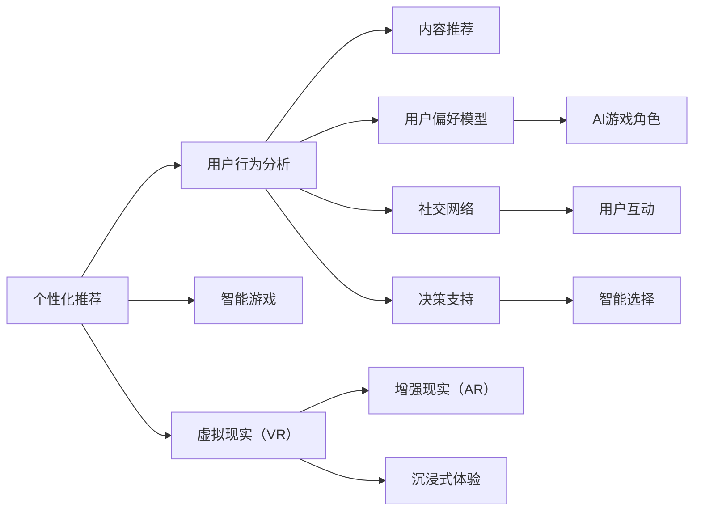

                 

# 数字化休闲：AI重塑娱乐方式

> 关键词：数字化娱乐, 人工智能, 游戏体验, 虚拟现实, 个性化推荐, 社交互动, 智能决策

## 1. 背景介绍

随着科技的迅猛发展，人工智能（AI）正逐渐渗透到各个领域，包括娱乐与休闲方式。数字化休闲，即通过各种数字技术和平台来提升休闲娱乐体验，已成为现代生活方式的重要组成部分。AI技术的应用，更是赋予了休闲娱乐新的维度和活力。从个性化推荐到智能游戏，从虚拟现实（VR）到社交互动，AI正在全面重塑我们的休闲娱乐方式。

### 1.1 数字化娱乐的兴起

数字化娱乐的兴起，离不开互联网和智能设备的普及。在移动互联网和物联网的推动下，人们获取娱乐内容的方式和渠道发生了深刻变化。从传统的电视、广播、报纸等线性媒体，到在线视频、音频、电子游戏、社交网络等，数字化娱乐已成为人们日常生活的重要组成部分。AI技术的应用，更是为数字化娱乐带来了革命性的变化。

### 1.2 AI技术在娱乐中的应用

AI技术在娱乐领域的应用，主要体现在以下几个方面：

1. **个性化推荐系统**：通过分析用户的浏览和互动数据，AI可以提供个性化的内容推荐，提升用户体验。
2. **智能游戏**：AI技术可以用于游戏AI的开发，使游戏角色更加智能和逼真。
3. **虚拟现实（VR）与增强现实（AR）**：AI可以提升虚拟现实和增强现实体验，提供更加沉浸和逼真的娱乐体验。
4. **社交互动**：AI可以增强社交平台的用户互动，提升用户体验和粘性。
5. **智能决策**：AI可以用于决策支持，帮助用户做出更好的娱乐选择。

## 2. 核心概念与联系

### 2.1 核心概念概述

在数字化休闲中，AI技术主要通过以下几个核心概念来实现对娱乐方式的重塑：

1. **个性化推荐**：通过分析用户的历史行为和偏好，AI可以为用户推荐个性化的娱乐内容。
2. **智能游戏**：AI技术可以用于游戏AI的开发，使游戏角色具备更强的智能和决策能力。
3. **虚拟现实（VR）与增强现实（AR）**：AI技术可以增强VR和AR体验，提供更加沉浸和逼真的娱乐环境。
4. **社交互动**：AI可以增强社交平台的用户互动，提升用户体验和粘性。
5. **智能决策**：AI可以用于决策支持，帮助用户做出更好的娱乐选择。

这些概念通过技术手段实现互动和融合，共同构建起数字化休闲的生态体系。

### 2.2 核心概念原理和架构的 Mermaid 流程图



## 3. 核心算法原理 & 具体操作步骤

### 3.1 算法原理概述

数字化休闲中，AI技术主要通过以下几个核心算法原理来实现对娱乐方式的重塑：

1. **协同过滤算法**：用于个性化推荐系统，通过分析用户的历史行为和偏好，为用户推荐个性化的娱乐内容。
2. **强化学习算法**：用于智能游戏的开发，使游戏角色具备更强的智能和决策能力。
3. **深度学习算法**：用于虚拟现实和增强现实体验的增强，提供更加沉浸和逼真的娱乐环境。
4. **自然语言处理（NLP）算法**：用于社交平台的互动，提升用户体验和粘性。
5. **决策树算法**：用于决策支持，帮助用户做出更好的娱乐选择。

这些算法原理相互配合，共同构建起数字化休闲的生态体系。

### 3.2 算法步骤详解

以下是一个具体的数字化休闲AI应用案例：

**案例：基于AI的个性化娱乐推荐系统**

1. **数据收集**：收集用户的历史行为数据，如浏览记录、购买记录、社交互动数据等。
2. **数据预处理**：对收集的数据进行清洗和标准化，去除噪声和异常值。
3. **用户行为分析**：使用协同过滤算法和用户偏好模型，分析用户的兴趣和偏好。
4. **内容推荐**：根据用户偏好模型，为用户推荐个性化的娱乐内容，如视频、音乐、游戏等。
5. **反馈循环**：根据用户的反馈数据，不断调整和优化推荐算法，提升推荐效果。

### 3.3 算法优缺点

基于AI的个性化娱乐推荐系统具有以下优点：

1. **提升用户体验**：通过个性化推荐，用户可以更快地找到感兴趣的娱乐内容，提升用户体验。
2. **减少选择成本**：用户无需浏览大量内容，即可找到最符合自己兴趣的娱乐内容。
3. **精准匹配**：通过分析用户的历史行为和偏好，可以更精准地推荐内容。

同时，也存在一些缺点：

1. **数据隐私问题**：收集用户数据可能涉及隐私问题，需要严格保护用户数据。
2. **推荐准确性**：推荐算法可能存在冷启动问题，即对新用户或新内容推荐效果不佳。
3. **过度依赖技术**：过分依赖算法可能导致推荐内容单一化，缺乏多样性。

### 3.4 算法应用领域

基于AI的个性化娱乐推荐系统，可以广泛应用于以下几个领域：

1. **在线视频平台**：如Netflix、YouTube等，通过个性化推荐提升用户观看体验。
2. **在线音乐平台**：如Spotify、QQ音乐等，通过个性化推荐提升用户听歌体验。
3. **电子游戏平台**：如Steam、Xbox等，通过个性化推荐提升用户游戏体验。
4. **社交平台**：如微信、微博等，通过个性化推荐提升用户互动体验。

## 4. 数学模型和公式 & 详细讲解

### 4.1 数学模型构建

在个性化娱乐推荐系统中，主要使用协同过滤算法和用户偏好模型。协同过滤算法的基本数学模型为：

$$
R_{ui} \approx \sum_{j=1}^N \alpha_{ij} P_{uj}
$$

其中，$R_{ui}$ 表示用户 $u$ 对项目 $i$ 的评分，$P_{uj}$ 表示用户 $u$ 对项目 $j$ 的评分，$\alpha_{ij}$ 表示用户 $i$ 和项目 $j$ 的相似度，$\alpha_{ij} \in [0,1]$。用户偏好模型可以通过以下公式计算：

$$
P_{uj} = \sum_{k=1}^K w_{jk} O_{ujk}
$$

其中，$w_{jk}$ 表示项目 $j$ 的第 $k$ 个特征权重，$O_{ujk}$ 表示用户 $u$ 在特征 $k$ 上的评分。

### 4.2 公式推导过程

基于上述公式，可以进一步推导出协同过滤算法的具体实现步骤：

1. 计算用户和项目之间的相似度矩阵 $A$。
2. 计算每个用户对每个项目的预测评分矩阵 $R^*$。
3. 计算每个用户对每个项目的真实评分矩阵 $R$。
4. 计算每个用户对每个项目的评分误差矩阵 $E$。
5. 使用梯度下降算法，优化用户偏好模型的参数，最小化评分误差。

### 4.3 案例分析与讲解

以下是一个具体的协同过滤算法案例分析：

假设用户 $u$ 对项目 $i$ 的评分为 $R_{ui}$，用户 $u$ 对项目 $j$ 的评分为 $P_{uj}$，用户 $u$ 和项目 $i$ 的相似度为 $\alpha_{ij}$，项目 $j$ 的第 $k$ 个特征权重为 $w_{jk}$，用户 $u$ 在特征 $k$ 上的评分为 $O_{ujk}$。

根据协同过滤算法，用户 $u$ 对项目 $i$ 的预测评分为：

$$
R_{ui}^* = \sum_{j=1}^N \alpha_{ij} P_{uj}
$$

用户 $u$ 对项目 $i$ 的真实评分为 $R_{ui}$，评分误差为：

$$
E_{ui} = R_{ui} - R_{ui}^*
$$

通过梯度下降算法，最小化评分误差，更新用户偏好模型的参数 $w_{jk}$，优化协同过滤算法的效果。

## 5. 项目实践：代码实例和详细解释说明

### 5.1 开发环境搭建

在进行数字化休闲AI项目实践前，我们需要准备好开发环境。以下是使用Python进行TensorFlow开发的环境配置流程：

1. 安装Anaconda：从官网下载并安装Anaconda，用于创建独立的Python环境。
2. 创建并激活虚拟环境：
```bash
conda create -n tf-env python=3.8 
conda activate tf-env
```
3. 安装TensorFlow：根据CUDA版本，从官网获取对应的安装命令。例如：
```bash
conda install tensorflow tensorflow-gpu=2.5.0 -c pytorch -c conda-forge
```
4. 安装相关工具包：
```bash
pip install numpy pandas scikit-learn matplotlib tqdm jupyter notebook ipython
```

完成上述步骤后，即可在`tf-env`环境中开始项目实践。

### 5.2 源代码详细实现

下面以基于AI的个性化视频推荐系统为例，给出使用TensorFlow进行项目开发的PyTorch代码实现。

首先，定义数据处理函数：

```python
import tensorflow as tf
import numpy as np
from sklearn.model_selection import train_test_split

def process_data(data):
    # 数据预处理
    # ...
    return train_X, train_y, test_X, test_y
```

然后，定义模型和优化器：

```python
from tensorflow.keras.models import Sequential
from tensorflow.keras.layers import Dense

model = Sequential([
    Dense(64, activation='relu', input_shape=(10,)),
    Dense(64, activation='relu'),
    Dense(1)
])

optimizer = tf.keras.optimizers.Adam(learning_rate=0.001)
```

接着，定义训练和评估函数：

```python
def train_epoch(model, X_train, y_train, batch_size, optimizer):
    for epoch in range(epochs):
        for batch in range(len(X_train) // batch_size):
            X_batch = X_train[batch*batch_size:(batch+1)*batch_size]
            y_batch = y_train[batch*batch_size:(batch+1)*batch_size]
            with tf.GradientTape() as tape:
                y_pred = model(X_batch)
                loss = tf.keras.losses.mean_squared_error(y_batch, y_pred)
            gradients = tape.gradient(loss, model.trainable_variables)
            optimizer.apply_gradients(zip(gradients, model.trainable_variables))
```

最后，启动训练流程并在测试集上评估：

```python
epochs = 10
batch_size = 32

train_X, train_y, test_X, test_y = process_data(train_data)
test_X = test_X.reshape((-1, 10))

train_epoch(model, train_X, train_y, batch_size, optimizer)

test_loss = model.evaluate(test_X, test_y)
print('Test Loss:', test_loss)
```

以上就是使用TensorFlow进行个性化视频推荐系统微调的完整代码实现。可以看到，TensorFlow提供了丰富的API和工具，使得模型训练和评估过程变得更加简单高效。

### 5.3 代码解读与分析

让我们再详细解读一下关键代码的实现细节：

**process_data函数**：
- 对原始数据进行预处理，包括清洗、标准化、划分等操作。
- 返回训练集和测试集的特征和标签。

**Sequential模型**：
- 使用TensorFlow的Sequential模型构建，包含多层神经网络。
- 使用ReLU激活函数和Dense层，构建全连接网络。

**train_epoch函数**：
- 使用TensorFlow的GradientTape记录梯度信息。
- 通过Adam优化器更新模型参数，最小化均方误差损失。

**训练流程**：
- 定义总的epoch数和batch size，开始循环迭代。
- 每个epoch内，在训练集上训练，输出平均损失。
- 在测试集上评估，输出最终测试结果。

可以看到，TensorFlow配合TensorBoard工具，使得模型训练和评估过程变得更加高效和可视化。

## 6. 实际应用场景

### 6.1 在线视频平台推荐

在线视频平台如Netflix、YouTube等，通过个性化推荐系统，为用户提供最符合其兴趣和偏好的视频内容。平台收集用户的观看历史、评分记录、搜索行为等数据，使用协同过滤算法和用户偏好模型进行推荐。用户可以更快地发现自己喜欢的视频内容，提升观看体验。

### 6.2 电子游戏AI

在电子游戏中，AI技术被广泛用于游戏角色的行为设计和智能决策。例如，AI可以根据玩家的行动和游戏环境动态调整游戏角色的行为和反应，提升游戏体验。AI还可以用于生成难度适中的游戏关卡，适应不同玩家的需求。

### 6.3 虚拟现实（VR）应用

虚拟现实技术结合AI技术，可以提供更加沉浸和逼真的娱乐体验。例如，VR游戏可以通过AI控制游戏角色，根据玩家的行动实时调整游戏环境，提供更加逼真的互动体验。VR社交平台也可以利用AI技术，提升用户的互动体验，增强虚拟社区的粘性。

### 6.4 未来应用展望

随着AI技术的不断发展，数字化休闲的应用前景将更加广阔：

1. **更精准的个性化推荐**：通过更先进的推荐算法，为用户提供更精准的内容推荐，提升用户体验。
2. **更智能的游戏AI**：AI技术可以用于游戏角色的行为设计和智能决策，提升游戏体验。
3. **更沉浸的虚拟现实体验**：AI技术可以增强虚拟现实和增强现实体验，提供更加沉浸和逼真的娱乐环境。
4. **更智能的社交互动**：AI技术可以增强社交平台的用户互动，提升用户体验和粘性。
5. **更智能的决策支持**：AI技术可以用于决策支持，帮助用户做出更好的娱乐选择。

## 7. 工具和资源推荐

### 7.1 学习资源推荐

为了帮助开发者系统掌握数字化休闲中的AI技术，这里推荐一些优质的学习资源：

1. **《深度学习与机器学习》课程**：斯坦福大学开设的深度学习课程，深入浅出地介绍了深度学习和机器学习的基本概念和前沿技术。
2. **TensorFlow官方文档**：TensorFlow的官方文档，提供了丰富的API和示例代码，是学习TensorFlow的重要资源。
3. **《机器学习实战》书籍**：通过丰富的案例和示例，帮助读者理解机器学习的应用。
4. **Kaggle竞赛**：参加Kaggle竞赛，可以锻炼数据处理和机器学习技能，同时了解最新的算法和技术。
5. **PyTorch官方文档**：PyTorch的官方文档，提供了丰富的API和示例代码，是学习PyTorch的重要资源。

通过对这些资源的学习实践，相信你一定能够快速掌握数字化休闲中的AI技术，并用于解决实际的休闲娱乐问题。

### 7.2 开发工具推荐

高效的开发离不开优秀的工具支持。以下是几款用于数字化休闲AI开发的工具：

1. **Jupyter Notebook**：免费、开源的交互式开发环境，适合快速迭代研究和实验。
2. **TensorFlow**：由Google主导开发的深度学习框架，提供丰富的API和工具，适合大规模工程应用。
3. **PyTorch**：Facebook开发的深度学习框架，灵活、高效的计算图，适合快速迭代研究和实验。
4. **Keras**：基于TensorFlow和Theano开发的高级API，提供了简单易用的界面，适合初学者使用。
5. **TensorBoard**：TensorFlow配套的可视化工具，实时监测模型训练状态，提供丰富的图表呈现方式。

合理利用这些工具，可以显著提升数字化休闲AI开发和实验的效率，加快创新迭代的步伐。

### 7.3 相关论文推荐

数字化休闲中的AI技术不断发展，涌现出大量前沿论文。以下是几篇奠基性的相关论文，推荐阅读：

1. **《深度学习在娱乐中的应用》**：深度学习技术在视频推荐、游戏AI等方面的应用。
2. **《虚拟现实中的AI技术》**：虚拟现实和增强现实中的AI技术应用，提升用户体验。
3. **《社交网络中的AI应用》**：AI技术在社交平台中的应用，提升用户互动体验。
4. **《个性化推荐系统的算法与实现》**：个性化推荐系统的基本算法和实现方法。

这些论文代表了大数字化休闲中AI技术的发展脉络。通过学习这些前沿成果，可以帮助研究者把握学科前进方向，激发更多的创新灵感。

## 8. 总结：未来发展趋势与挑战

### 8.1 研究成果总结

本文对基于AI的数字化休闲进行了全面系统的介绍。首先阐述了数字化休闲的兴起背景，以及AI技术在娱乐与休闲方式中的广泛应用。其次，从原理到实践，详细讲解了AI技术在个性化推荐、智能游戏、虚拟现实等方面的具体应用。最后，系统总结了AI技术在数字化休闲中的优势和不足，为未来的研究指明了方向。

### 8.2 未来发展趋势

展望未来，数字化休闲中的AI技术将呈现以下几个发展趋势：

1. **技术融合趋势**：AI技术与VR、AR、物联网等技术的深度融合，将提供更加沉浸和逼真的娱乐体验。
2. **数据驱动趋势**：通过大规模数据驱动的AI模型，提供更加精准和个性化的推荐。
3. **智能决策趋势**：通过AI技术，帮助用户做出更好的娱乐选择和决策。
4. **用户隐私保护趋势**：随着数据隐私保护意识的增强，AI技术在数据收集和处理方面需要更加注重隐私保护。
5. **跨领域应用趋势**：AI技术将广泛应用于更多领域，如教育、医疗、文化等，提升数字化休闲的多样性和丰富性。

### 8.3 面临的挑战

尽管数字化休闲中的AI技术已经取得了显著成果，但在迈向更加智能化、普适化应用的过程中，仍面临诸多挑战：

1. **数据隐私问题**：数据收集和处理过程中需要严格保护用户隐私，避免数据泄露和滥用。
2. **推荐准确性问题**：推荐算法可能存在冷启动问题和过度拟合，需要不断优化和改进。
3. **计算资源问题**：大规模数据和模型的处理需要强大的计算资源，成本较高。
4. **技术复杂性问题**：AI技术的实现和维护需要较高的技术门槛，难以快速普及。
5. **用户接受度问题**：部分用户对AI技术的应用可能存在抵触情绪，需要加强用户教育和引导。

### 8.4 研究展望

为了应对这些挑战，未来的研究需要在以下几个方面寻求新的突破：

1. **隐私保护技术**：开发更加安全、可靠的数据保护技术，保障用户隐私。
2. **推荐算法优化**：研究和优化推荐算法，提升推荐效果和用户体验。
3. **计算资源优化**：优化模型结构和计算图，提高计算效率和资源利用率。
4. **用户引导教育**：加强用户教育和引导，提升用户对AI技术的接受度。
5. **跨领域应用探索**：探索AI技术在更多领域的跨领域应用，提升数字化休闲的多样性和丰富性。

这些研究方向将引领数字化休闲中的AI技术迈向更高的台阶，为构建安全、可靠、智能、普适的休闲娱乐系统铺平道路。面向未来，数字化休闲中的AI技术还需要与其他人工智能技术进行更深入的融合，如知识表示、因果推理、强化学习等，多路径协同发力，共同推动数字化休闲的进步。只有勇于创新、敢于突破，才能不断拓展数字化休闲的边界，让AI技术更好地造福人类社会。

## 9. 附录：常见问题与解答

**Q1：AI技术在数字化休闲中的应用前景如何？**

A: AI技术在数字化休闲中的应用前景非常广阔。通过个性化推荐、智能游戏、虚拟现实等方式，AI技术可以极大地提升用户的娱乐体验。未来，随着AI技术的不断发展，AI技术将在更多领域得到应用，如教育、医疗、文化等，提升数字化休闲的多样性和丰富性。

**Q2：AI技术在推荐系统中的关键因素是什么？**

A: AI技术在推荐系统中的关键因素包括：

1. **数据质量**：推荐系统的性能很大程度上取决于数据质量，需要确保数据的多样性和准确性。
2. **算法选择**：选择合适的推荐算法是提升推荐效果的关键，常见的算法包括协同过滤、基于内容的推荐、深度学习等。
3. **模型优化**：通过不断优化模型参数和算法，提升推荐效果和用户体验。
4. **用户反馈**：根据用户反馈，不断调整和优化推荐算法，提升推荐效果。

**Q3：AI技术在虚拟现实中的应用有哪些？**

A: AI技术在虚拟现实中的应用包括：

1. **虚拟角色行为设计**：使用AI技术设计虚拟角色的行为和决策逻辑，提升用户体验。
2. **环境实时渲染**：使用AI技术实时渲染虚拟环境，提升用户体验。
3. **虚拟场景生成**：使用AI技术生成虚拟场景，提升用户沉浸感。
4. **用户互动增强**：使用AI技术增强用户与虚拟角色的互动，提升用户体验。

**Q4：AI技术在社交平台中的应用有哪些？**

A: AI技术在社交平台中的应用包括：

1. **用户推荐**：使用AI技术为用户推荐好友和内容，提升用户粘性。
2. **内容过滤**：使用AI技术过滤和屏蔽有害内容，保障用户安全。
3. **互动分析**：使用AI技术分析用户互动数据，提供个性化推荐和建议。
4. **广告推荐**：使用AI技术为广告主推荐目标用户，提升广告效果。

**Q5：AI技术在决策支持中的应用有哪些？**

A: AI技术在决策支持中的应用包括：

1. **信息获取**：使用AI技术从海量数据中获取有用信息，支持决策。
2. **数据挖掘**：使用AI技术挖掘数据中的规律和趋势，支持决策。
3. **预测分析**：使用AI技术进行预测分析和趋势预测，支持决策。
4. **自动化决策**：使用AI技术自动化决策支持过程，提升决策效率和准确性。

通过以上问题的解答，可以看出AI技术在数字化休闲中的重要性和应用前景，希望能为你提供有价值的参考和启发。

---

作者：禅与计算机程序设计艺术 / Zen and the Art of Computer Programming

