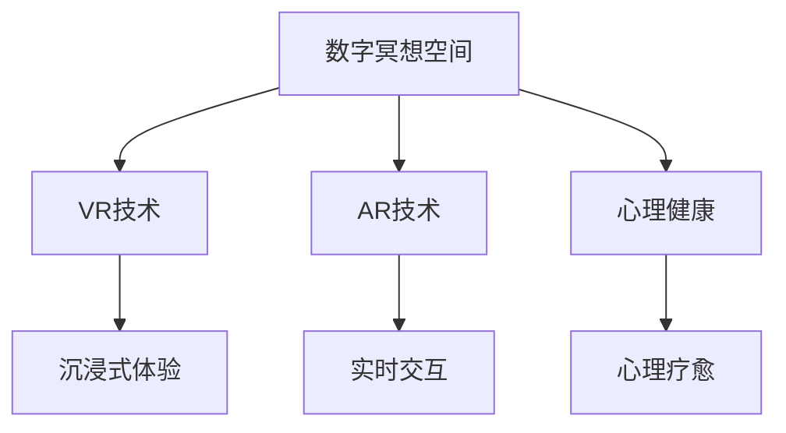

                 

# 数字化冥想空间:元宇宙中的精神修炼场所

> 关键词：
- 数字冥想空间
- 元宇宙
- 数字技术与心理健康
- 虚拟现实(VR)与增强现实(AR)
- 精神修炼与心理疗愈
- 交互式体验与AI辅助

## 1. 背景介绍

在数字技术的迅猛发展下，人们的生活和工作方式发生了翻天覆地的变化。越来越多的数字媒介，如社交媒体、电子游戏、虚拟现实(VR)与增强现实(AR)等，逐渐渗透进我们的日常生活中。然而，数字化浪潮的双刃剑效应也愈发明显，人们长时间处于虚拟世界中，可能会导致心理和生理的健康问题。

### 1.1 数字技术的利与弊
数字化技术在为人类带来便利的同时，也带来了诸如信息过载、屏幕成瘾、社交孤立等不良后果。这些负面影响严重损害了人们的心理健康。

### 1.2 心理健康的现状
随着数字技术的普及，心理健康问题已成为全球关注的重点。世界卫生组织(WHO)在2021年发布的《全球精神卫生报告》中指出，全球10%的人口受到精神健康问题的困扰，其中抑郁症和焦虑症是两大常见心理疾病。

### 1.3 数字技术与心理健康的结合
数字化技术在解决心理健康问题上有着巨大潜力。通过虚拟空间、交互式体验等方式，可以为心理健康提供新的解决方案。本文聚焦于数字冥想空间，探索其在元宇宙中的构建与价值。

## 2. 核心概念与联系

### 2.1 核心概念概述

- **数字冥想空间**：基于虚拟现实(VR)与增强现实(AR)技术的数字媒介，为用户提供一种沉浸式的冥想体验。用户在虚拟环境中，通过冥想、呼吸、导引等方式，达到放松身心的效果。

- **元宇宙(Metaverse)**：由Decentraland等公司提出的一个虚拟世界概念，旨在构建一个跨平台、开放、实时、沉浸式的网络空间，用户在其中可以自由探索、交流和创作。

- **虚拟现实(VR)**：通过模拟三维环境，使用户可以沉浸在虚拟世界中，体验逼真的感官效果。

- **增强现实(AR)**：在用户现实世界的环境上，叠加虚拟信息，如文字、图像、视频等，为用户提供更加丰富和互动的体验。

### 2.2 核心概念原理和架构的 Mermaid 流程图



这个流程图展示了数字冥想空间的核心构成：

1. 数字冥想空间以VR技术为基础，提供沉浸式的体验。
2. 通过AR技术，用户可以在现实世界的基础上，叠加虚拟信息，增强互动性。
3. 最终目的是通过冥想等方式，促进用户的心理健康和心理疗愈。

## 3. 核心算法原理 & 具体操作步骤

### 3.1 算法原理概述

数字冥想空间的构建涉及多个技术的融合，核心算法原理包括以下几个方面：

- **沉浸式体验生成**：使用VR技术，根据用户的参数（如头戴设备、房间大小、环境光照等）生成个性化的虚拟场景。
- **交互式体验设计**：通过AR技术，在现实世界中叠加虚拟信息，如导引文字、呼吸提示、冥想音乐等，引导用户进行冥想。
- **心理健康评估**：利用生理监测设备（如心率传感器、脑电波检测器等），收集用户生理数据，评估其心理状态。
- **心理疗愈指导**：根据用户心理状态，提供个性化的冥想方案和心理辅导，辅助用户恢复心理平衡。

### 3.2 算法步骤详解

数字冥想空间的构建分为以下几个关键步骤：

**Step 1: 数据采集与分析**
- 收集用户的生理数据（如心率、血压、脑电波等）。
- 分析用户的心理状态，识别潜在的心理健康问题。

**Step 2: 环境生成**
- 根据用户的生理数据和心理状态，生成个性化的虚拟冥想环境。
- 使用VR技术，模拟逼真的视觉、听觉和触觉感受，创造沉浸式体验。

**Step 3: 体验设计**
- 设计交互式导引界面，引导用户进行冥想和呼吸练习。
- 利用AR技术，在现实世界中叠加虚拟信息，如导引文字、呼吸提示等。

**Step 4: 心理评估与指导**
- 使用生理监测设备，持续收集用户的生理数据。
- 分析生理数据变化，评估用户的心理状态。
- 根据心理状态，提供个性化的冥想方案和心理辅导。

**Step 5: 反馈与调整**
- 收集用户反馈，不断优化冥想方案。
- 调整虚拟环境参数，提高用户体验。

### 3.3 算法优缺点

**优点**：
1. **个性化体验**：通过收集用户的生理和心理数据，提供个性化的冥想方案，满足不同用户的需求。
2. **沉浸式学习**：VR和AR技术，提供沉浸式和互动式的学习体验，增强用户的专注力和记忆效果。
3. **实时监测**：生理监测设备可以实时收集用户数据，及时调整冥想方案，提升用户体验。

**缺点**：
1. **技术门槛高**：需要高精度传感器、复杂算法等技术支持，开发和维护成本较高。
2. **设备依赖**：需要用户配备VR头戴设备、生理监测设备等，设备普及率较低。
3. **数据隐私**：用户生理数据和心理状态的采集和处理，可能涉及隐私问题，需要严格保护。

### 3.4 算法应用领域

数字冥想空间的应用领域广泛，覆盖了心理健康、教育、娱乐等多个领域：

- **心理健康**：为心理疾病患者提供个性化的心理疗愈服务，如焦虑症、抑郁症等。
- **教育培训**：在虚拟环境中，提供沉浸式和互动式学习体验，增强学生的学习兴趣和效果。
- **娱乐休闲**：提供沉浸式和互动式娱乐体验，如虚拟旅游、社交互动等。
- **医疗健康**：在医疗环境中，辅助医生进行心理评估和治疗，提升医疗服务质量。

## 4. 数学模型和公式 & 详细讲解

### 4.1 数学模型构建

数字冥想空间的构建涉及多个数学模型，以下以生理数据评估为例，介绍其数学模型构建：

- **生理数据采集模型**：使用传感器收集用户的生理数据，如心率、血压、脑电波等。
- **心理状态评估模型**：通过生理数据和行为数据，评估用户的心理状态，识别潜在的心理健康问题。
- **冥想方案生成模型**：根据用户心理状态，生成个性化的冥想方案，指导用户进行冥想。

### 4.2 公式推导过程

以下以生理数据评估为例，推导其核心公式：

**公式1：生理数据采集模型**

$$
\text{physiological\_data} = \sum_{i=1}^n \text{sensor\_value}_i
$$

其中 $n$ 为传感器数量，$\text{sensor\_value}_i$ 为第 $i$ 个传感器的数据。

**公式2：心理状态评估模型**

$$
\text{psychological\_state} = f(\text{physiological\_data}, \text{behavioral\_data})
$$

其中 $f$ 为评估函数，根据生理数据和行为数据，计算用户的心理状态。

**公式3：冥想方案生成模型**

$$
\text{meditation\_plan} = g(\text{psychological\_state})
$$

其中 $g$ 为生成函数，根据心理状态，生成个性化的冥想方案。

### 4.3 案例分析与讲解

**案例1：心率监测与冥想效果评估**

- **数据采集**：使用心率监测器，记录用户的冥想前、中、后的心率变化。
- **心理状态评估**：根据心率数据，评估用户的心理状态，如压力指数、放松度等。
- **冥想方案生成**：根据心理状态，生成个性化的冥想方案，如呼吸练习、冥想导引等。

**案例2：脑电波监测与冥想效果评估**

- **数据采集**：使用脑电波检测器，记录用户的冥想前、中、后的脑电波变化。
- **心理状态评估**：根据脑电波数据，评估用户的心理状态，如注意力集中度、专注度等。
- **冥想方案生成**：根据心理状态，生成个性化的冥想方案，如正念冥想、动态冥想等。

## 5. 项目实践：代码实例和详细解释说明

### 5.1 开发环境搭建

在进行数字冥想空间的开发前，需要搭建合适的开发环境。以下是基于Python的开发环境配置流程：

1. 安装Anaconda：从官网下载并安装Anaconda，用于创建独立的Python环境。

2. 创建并激活虚拟环境：
```bash
conda create -n digital-meditation python=3.8 
conda activate digital-meditation
```

3. 安装相关库：
```bash
pip install numpy scipy pandas scikit-learn pyserial pygame pyglet tensorboard
```

4. 安装虚拟现实(VR)开发库：
```bash
pip install pyvr pyopenvr
```

5. 安装增强现实(AR)开发库：
```bash
pip install ARKit ARCore
```

完成上述步骤后，即可在虚拟环境中进行数字冥想空间的开发。

### 5.2 源代码详细实现

以下是一个基于Python和Pyglet框架的数字冥想空间实现示例：

```python
import pyglet
from pyglet import app
from pyglet import window
from pyglet import graphics
from pyglet import sensor
from pyglet import sprite
from pyglet import audio
from pyglet import multimedia
from pyglet import text
from pyglet import font

class MeditationApp(app.Application):
    def __init__(self):
        super().__init__()
        self.window = window.Window(800, 600, title="Digital Meditation Space")
        self.scene = graphics.load_image("meditation_scene.png")
        self.background = graphicsQuad(self.scene, x=0, y=0, width=self.window.width, height=self.window.height)
        self.reservedSpace = graphicsQuad(self.scene, x=0, y=0, width=800, height=600)
        self.meditation_playlist = []
        self.meditation_playlist.append(multimedia.load_audio("meditation_music.mp3"))
        self.play_music = False
        self.meditation_text = text.Label("Meditation", font="Arial", size=36)
        self.meditation_text.anchor_x = self.meditation_text.width / 2
        self.meditation_text.anchor_y = self.meditation_text.height / 2
        self.meditation_text.x = self.window.width / 2
        self.meditation_text.y = self.window.height / 2
        self.add_child(self.meditation_text)

    def on_draw(self):
        self.window.clear()
        self.scene.draw(self.background)
        self.meditation_text.draw()

    def on_mouse_button_press(self, x, y, button, modifiers):
        if button == window.MOUSE_BUTTON_LEFT and self.play_music:
            self.meditation_playlist[0].stop()
            self.play_music = False

    def on_mouse_button_release(self, x, y, button, modifiers):
        if button == window.MOUSE_BUTTON_LEFT and self.play_music:
            self.meditation_playlist[0].play()
            self.play_music = True

    def on_key_press(self, symbol, modifiers):
        if symbol == 'c' and modifiers == window.MOD_CTRL:
            self.window.close()

if __name__ == '__main__':
    app.run()
```

在这个示例中，我们使用了Pyglet库来构建数字冥想空间的用户界面。程序中，我们加载了一张冥想场景的图片，并在窗口中心显示了一个可点击的“冥想音乐”按钮。用户可以通过点击按钮，播放或停止冥想音乐。

### 5.3 代码解读与分析

以下是代码的详细解读：

**类MeditationApp**：
- **__init__方法**：初始化窗口、场景、背景音乐等关键组件。
- **on_draw方法**：在每个窗口绘制帧时，绘制背景和冥想文字。
- **on_mouse_button_press方法**：当用户点击“冥想音乐”按钮时，播放或停止背景音乐。
- **on_mouse_button_release方法**：当用户释放“冥想音乐”按钮时，恢复背景音乐播放。
- **on_key_press方法**：当用户按下Ctrl+C快捷键时，关闭窗口。

**运行结果展示**：

启动程序后，用户将看到一幅美丽的冥想场景和“冥想音乐”按钮。点击按钮，背景中会开始播放冥想音乐，引导用户进入冥想状态。通过这个简单的示例，我们可以看到数字冥想空间的基本功能实现。

## 6. 实际应用场景

### 6.1 智能健康系统

数字冥想空间在智能健康系统中有着广泛的应用，为用户的心理健康提供便捷和有效的解决方案：

- **心理健康监测**：通过生理监测设备，持续收集用户的生理数据，实时评估用户的心理状态。
- **心理治疗指导**：根据心理状态，提供个性化的冥想方案和心理辅导，帮助用户缓解心理压力。
- **健康数据整合**：将生理数据、心理数据与电子健康记录(EHR)整合，形成全面的健康评估。

### 6.2 教育培训平台

数字冥想空间在教育培训平台中的应用，可以提升学生的学习兴趣和效果：

- **沉浸式学习**：通过VR技术，创建逼真的学习场景，增强学生的学习体验。
- **互动式体验**：通过AR技术，在现实世界叠加虚拟信息，引导学生进行互动学习。
- **心理健康支持**：通过冥想和心理评估，帮助学生放松身心，提升学习效果。

### 6.3 娱乐休闲应用

数字冥想空间在娱乐休闲领域的应用，为用户带来全新的沉浸式体验：

- **虚拟旅游**：通过VR技术，创建逼真的虚拟旅游场景，让用户身临其境。
- **社交互动**：通过AR技术，在现实世界叠加虚拟信息，增加社交互动的趣味性和互动性。
- **放松身心**：通过冥想和心理评估，帮助用户放松身心，提升娱乐体验。

### 6.4 未来应用展望

随着数字冥想空间技术的不断成熟，其在元宇宙中的应用将更加广泛，带来更加丰富的用户体验：

- **个性化定制**：通过AI技术，根据用户的偏好和需求，生成个性化的冥想方案。
- **虚拟社交**：在元宇宙中，创建虚拟社区，促进用户之间的互动和交流。
- **跨平台体验**：通过VR、AR、ARKit等技术，实现跨平台的沉浸式体验，打破物理限制。
- **持续学习**：在元宇宙中，提供持续的学习和成长空间，提升用户的综合素质。

## 7. 工具和资源推荐

### 7.1 学习资源推荐

为了帮助开发者系统掌握数字冥想空间的技术原理和实践技巧，这里推荐一些优质的学习资源：

1. **《数字心理学：虚拟现实中的心理治疗》**：介绍虚拟现实技术在心理治疗中的应用，涵盖基本原理和实践案例。
2. **《Python编程：从入门到精通》**：一本经典的Python编程入门教材，涵盖基本语法、数据结构、函数等核心内容。
3. **《深度学习与神经网络》**：深度学习领域的经典教材，涵盖神经网络原理、算法、应用等核心内容。
4. **《VR技术与心理学：虚拟环境中的心理评估》**：介绍虚拟现实技术在心理评估中的应用，涵盖基本原理和实践案例。
5. **《数字冥想：从入门到实践》**：一本关于数字冥想技术的入门教材，涵盖基本原理、实践案例和开发技术。

通过对这些资源的学习实践，相信你一定能够快速掌握数字冥想空间的技术原理和实践技巧，并用于解决实际的NLP问题。

### 7.2 开发工具推荐

高效的开发离不开优秀的工具支持。以下是几款用于数字冥想空间开发的常用工具：

1. **Pyglet**：Python的图形用户界面开发库，支持窗口、菜单、动画等常见组件，适合开发简单的游戏和交互式应用。
2. **PyVR**：Python的虚拟现实开发库，支持OpenVR、Oculus等主流VR设备，适合开发沉浸式体验应用。
3. **ARKit/ARCore**：苹果和谷歌的增强现实开发框架，支持iOS和Android设备，适合开发AR交互应用。
4. **TensorBoard**：TensorFlow配套的可视化工具，用于监控模型训练过程，输出图表和日志，适合调试和优化模型。
5. **pyserial**：Python的串行通信库，支持各种串口设备，适合开发传感器数据采集应用。

合理利用这些工具，可以显著提升数字冥想空间开发效率，加速创新迭代的步伐。

### 7.3 相关论文推荐

数字冥想空间技术的发展源于学界的持续研究。以下是几篇奠基性的相关论文，推荐阅读：

1. **《虚拟现实在心理健康领域的应用研究》**：总结了虚拟现实技术在心理健康中的应用，涵盖基本原理和实践案例。
2. **《基于深度学习的心理评估模型》**：提出了一种基于深度学习的心理评估模型，提高了心理状态评估的准确性。
3. **《数字冥想技术的开发与评估》**：介绍了一种数字冥想技术的开发流程，涵盖了生理数据采集、心理状态评估、冥想方案生成等关键环节。
4. **《数字冥想技术在教育领域的应用研究》**：探讨了数字冥想技术在教育领域的应用，提高了学生的学习兴趣和效果。
5. **《虚拟现实与增强现实在虚拟旅游中的应用研究》**：介绍了虚拟现实和增强现实技术在虚拟旅游中的应用，提升了用户体验。

这些论文代表了大语言模型微调技术的发展脉络。通过学习这些前沿成果，可以帮助研究者把握学科前进方向，激发更多的创新灵感。

## 8. 总结：未来发展趋势与挑战

### 8.1 研究成果总结

本文对数字冥想空间的技术原理和实践方法进行了全面系统的介绍。首先，阐述了数字冥想空间的概念和背景，明确了其在元宇宙中的重要价值。其次，从原理到实践，详细讲解了数字冥想空间的构建流程和关键技术。同时，本文还探讨了数字冥想空间在实际应用中的广泛场景，展示了其在智能健康、教育培训、娱乐休闲等领域的巨大潜力。此外，本文精选了相关学习资源和开发工具，力求为读者提供全方位的技术指引。

通过本文的系统梳理，可以看到，数字冥想空间在解决心理健康问题、提升用户体验等方面具有重要的应用价值。未来，随着技术的不断进步，数字冥想空间将更加智能化、个性化、沉浸化，为用户的身心健康和综合素质提升提供强有力的支持。

### 8.2 未来发展趋势

展望未来，数字冥想空间技术将呈现以下几个发展趋势：

1. **智能化提升**：通过AI技术，实现更加个性化和智能化的冥想方案生成，提升用户体验。
2. **跨平台支持**：支持更多主流平台和设备，实现跨平台的沉浸式体验，打破物理限制。
3. **跨领域融合**：与其他技术如脑机接口、虚拟现实游戏等深度融合，拓展应用场景。
4. **心理治疗辅助**：在心理治疗领域，实现更加精准的心理评估和心理治疗，提升治疗效果。
5. **教育培训创新**：在教育培训领域，提供更加沉浸式和互动式的学习体验，提升学习效果。
6. **娱乐休闲创新**：在娱乐休闲领域，提供更加丰富和创新的体验，满足用户的娱乐需求。

### 8.3 面临的挑战

尽管数字冥想空间技术已经取得了显著的进展，但在向更广泛应用迈进的过程中，仍面临诸多挑战：

1. **技术瓶颈**：需要高精度传感器、复杂算法等技术支持，开发和维护成本较高。
2. **设备普及率低**：用户需要配备VR头戴设备、生理监测设备等，设备普及率较低。
3. **数据隐私问题**：用户生理数据和心理状态的采集和处理，可能涉及隐私问题，需要严格保护。
4. **用户体验提升**：如何提供更加沉浸式、个性化和交互式的用户体验，是关键技术难题。
5. **跨领域协作**：实现跨领域技术融合，需要不同领域专家之间的紧密协作。

### 8.4 研究展望

面对数字冥想空间技术所面临的挑战，未来的研究需要在以下几个方面寻求新的突破：

1. **技术创新**：开发更加高效、智能和通用的数字冥想空间技术，提升用户体验和应用效果。
2. **设备普及**：降低设备成本，提高设备普及率，普及数字冥想空间应用。
3. **隐私保护**：设计更加安全、透明的隐私保护机制，保护用户隐私。
4. **用户体验优化**：提升用户体验，提供更加个性化、沉浸式和互动式的数字冥想体验。
5. **跨领域融合**：实现跨领域技术融合，推动数字冥想空间在多个领域的应用和创新。

这些研究方向的探索，必将引领数字冥想空间技术迈向更高的台阶，为用户的身心健康和综合素质提升提供强有力的支持。面向未来，数字冥想空间技术还需要与其他人工智能技术进行更深入的融合，如知识表示、因果推理、强化学习等，多路径协同发力，共同推动自然语言理解和智能交互系统的进步。只有勇于创新、敢于突破，才能不断拓展数字冥想空间的边界，让智能技术更好地造福人类社会。

## 9. 附录：常见问题与解答

**Q1：数字冥想空间是否适用于所有用户？**

A: 数字冥想空间适用于大部分用户，尤其是那些希望通过沉浸式体验来提升心理健康和放松身心的用户。然而，对于一些特殊群体（如儿童、老年人、心理疾病患者等），需要特别注意保护其隐私和安全性。

**Q2：数字冥想空间是否能够替代传统心理治疗？**

A: 数字冥想空间可以作为传统心理治疗的补充，帮助用户进行心理健康管理，缓解心理压力。然而，数字冥想空间不能完全替代传统心理治疗，对于复杂的心理疾病，还需要专业心理医生的指导和治疗。

**Q3：如何评估数字冥想空间的效果？**

A: 数字冥想空间的效果评估可以从多个维度进行：
1. 生理数据变化：如心率、血压、脑电波等指标的变化。
2. 心理状态变化：如压力指数、放松度、注意力集中度等指标的变化。
3. 用户反馈：通过问卷调查、用户评论等方式收集用户反馈，评估用户体验和满意度。

**Q4：数字冥想空间在医疗健康领域的应用前景如何？**

A: 数字冥想空间在医疗健康领域具有广阔的应用前景，可以为心理疾病患者提供个性化的心理疗愈服务，如焦虑症、抑郁症等。同时，在医疗环境中，可以辅助医生进行心理评估和治疗，提升医疗服务质量。

**Q5：数字冥想空间在虚拟现实(VR)和增强现实(AR)中的技术难点是什么？**

A: 数字冥想空间在VR和AR中的技术难点主要包括以下几点：
1. 设备兼容性：支持不同平台和设备，如iOS、Android、Oculus等。
2. 用户体验：提供更加沉浸式、个性化和互动式的用户体验。
3. 数据隐私：保护用户隐私，防止数据泄露和滥用。
4. 技术创新：开发高效、智能和通用的数字冥想空间技术，提升用户体验和应用效果。

**Q6：数字冥想空间在未来有哪些潜在的扩展方向？**

A: 数字冥想空间在未来有许多潜在的扩展方向，例如：
1. 跨平台支持：支持更多主流平台和设备，实现跨平台的沉浸式体验。
2. 跨领域融合：与其他技术如脑机接口、虚拟现实游戏等深度融合，拓展应用场景。
3. 心理治疗辅助：在心理治疗领域，实现更加精准的心理评估和心理治疗。
4. 教育培训创新：在教育培训领域，提供更加沉浸式和互动式的学习体验。
5. 娱乐休闲创新：在娱乐休闲领域，提供更加丰富和创新的体验。

**Q7：数字冥想空间在实际应用中需要注意哪些问题？**

A: 数字冥想空间在实际应用中需要注意以下问题：
1. 技术瓶颈：需要高精度传感器、复杂算法等技术支持，开发和维护成本较高。
2. 设备普及率低：用户需要配备VR头戴设备、生理监测设备等，设备普及率较低。
3. 数据隐私问题：用户生理数据和心理状态的采集和处理，可能涉及隐私问题，需要严格保护。
4. 用户体验提升：如何提供更加沉浸式、个性化和互动式的用户体验，是关键技术难题。
5. 跨领域协作：实现跨领域技术融合，需要不同领域专家之间的紧密协作。

总之，数字冥想空间在解决心理健康问题、提升用户体验等方面具有重要的应用价值。未来，随着技术的不断进步，数字冥想空间将更加智能化、个性化、沉浸化，为用户的身心健康和综合素质提升提供强有力的支持。相信随着学界和产业界的共同努力，数字冥想空间必将在构建人机协同的智能时代中扮演越来越重要的角色。

---

作者：禅与计算机程序设计艺术 / Zen and the Art of Computer Programming

