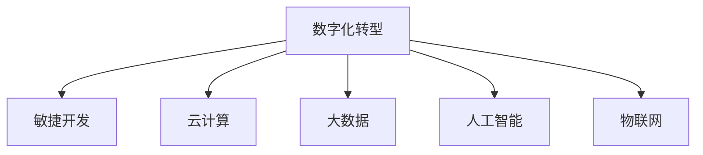
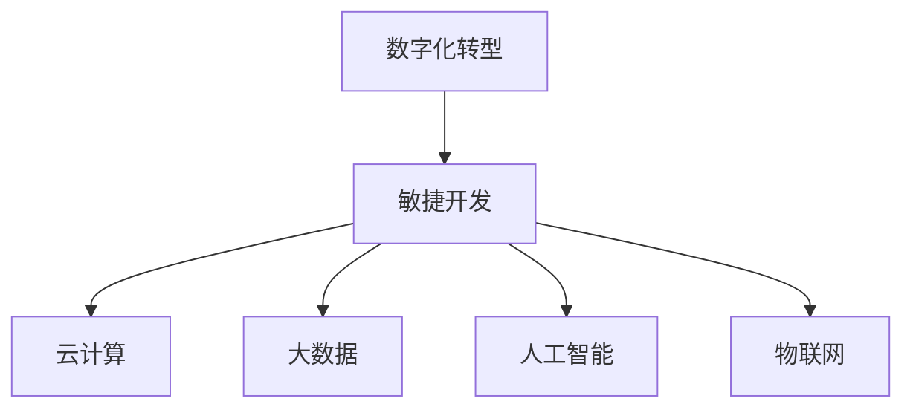

                 

# 数字化创业：打造未来企业的蓝图

在数字经济时代，企业能否成功转型，取决于其能否迅速适应数字化、智能化的发展趋势。数字化创业不仅仅是引入新技术，更是一场深刻的商业模式和管理方式的变革。本文将深入探讨数字化创业的核心概念、实现路径和未来趋势，帮助企业领导者绘制数字化转型的未来蓝图。

## 1. 背景介绍

### 1.1 数字化转型挑战

当前，许多企业面临数字化转型的巨大挑战：

- **技术复杂性**：数字化技术涉及多个领域，如云计算、大数据、人工智能、物联网等，技术栈复杂，整合难度大。
- **组织变革**：数字化转型需要组织结构、文化和管理模式的全面变革，这对企业的灵活性和适应能力提出了高要求。
- **数据治理**：数据是数字化的核心，但企业的数据质量、隐私保护和数据治理问题亟待解决。
- **人才缺口**：数字化领域的高素质人才稀缺，企业内部需要培养或引入具备数字化思维和技能的人才。

### 1.2 数字化创业的意义

数字化创业的意义在于通过引入数字化技术，提升企业效率、降低成本、增强竞争力，实现业务的可持续增长。数字化创业不仅关注技术应用，更强调商业模式创新和组织变革，旨在为企业带来全方位的价值提升。

## 2. 核心概念与联系

### 2.1 核心概念概述

- **数字化转型**：通过引入数字化技术，重塑企业的业务流程、组织结构和运营模式，实现效率提升、成本降低和价值增长。
- **数字化创业**：利用最新的数字化技术，创新商业模式，打造新的产品和服务，实现业务增长和市场竞争优势。
- **敏捷开发**：一种快速响应市场变化、快速迭代产品和服务的方法，强调以用户需求为中心，注重用户体验和反馈。
- **云计算**：通过互联网提供计算资源和服务的模式，具有弹性、按需使用、高可用性的特点。
- **大数据**：利用先进的数据处理和分析技术，从海量数据中提取有价值的信息，支持决策和业务创新。
- **人工智能**：通过机器学习、深度学习等技术，使机器具备自主学习、推理和决策能力，提升企业智能化水平。
- **物联网**：通过将物理设备、系统和人连接起来，实现信息互通和智能控制，推动工业和消费场景的智能化。

### 2.2 核心概念联系

数字化创业的实施离不开多个核心概念的协同作用：

- **数字化转型**是企业全面升级的核心驱动力，是实现数字化创业的必由之路。
- **敏捷开发**是数字化转型的重要方法论，能够快速响应市场变化，实现快速迭代。
- **云计算**和**大数据**提供了技术基础，支持数据存储、处理和分析，是数字化转型的基础设施。
- **人工智能**和**物联网**则是数字化创业的核心技术支撑，能够带来智能化的服务和产品。

这些概念通过下图的Mermaid流程图进行了可视化展示：



### 2.3 核心概念相互关系

各核心概念之间的关系如下图所示：



## 3. 核心算法原理 & 具体操作步骤

### 3.1 算法原理概述

数字化创业的核心算法原理主要涉及以下几个方面：

- **敏捷开发**：通过迭代开发和快速反馈，实现快速产品迭代和市场响应。
- **云计算**：采用弹性资源分配，支持按需使用和扩展，降低基础设施成本。
- **大数据**：通过数据采集、存储和分析，提供决策支持，优化运营效率。
- **人工智能**：通过机器学习和深度学习，实现智能决策和自动化流程。
- **物联网**：通过设备和系统的互联，实现实时数据收集和智能控制。

### 3.2 算法步骤详解

数字化创业的具体操作步骤如下：

**Step 1: 制定数字化战略**

- 确定企业数字化转型的愿景和目标。
- 制定详细的数字化战略，包括技术选型、业务场景、数据治理、人才需求等。
- 组建跨部门的数字化项目团队，负责战略执行和协调。

**Step 2: 实施敏捷开发**

- 采用敏捷开发方法论，快速响应市场变化和用户需求。
- 划分小团队，进行迭代开发和持续集成，确保产品质量和用户体验。
- 定期进行需求评审和用户反馈，调整开发方向和产品功能。

**Step 3: 部署云计算基础设施**

- 选择适合的云计算服务提供商，如AWS、Azure、阿里云等。
- 搭建云计算基础设施，包括虚拟机、数据库、存储、网络等。
- 确保安全性和可扩展性，制定云资源管理策略。

**Step 4: 数据治理和大数据分析**

- 建立数据治理机制，确保数据质量、安全和隐私保护。
- 构建大数据平台，支持数据采集、存储、处理和分析。
- 利用大数据技术，进行业务分析和决策支持。

**Step 5: 引入人工智能技术**

- 根据业务需求，选择合适的机器学习和深度学习算法。
- 构建模型训练和推理环境，进行模型训练和优化。
- 将模型集成到业务流程中，实现智能化决策和自动化流程。

**Step 6: 部署物联网应用**

- 选择适合的物联网设备和平台，如IoT gateway、传感器、云端平台等。
- 实现设备和系统的互联，收集实时数据。
- 利用物联网技术，实现智能控制和自动化管理。

### 3.3 算法优缺点

数字化创业的优势包括：

- **快速响应**：敏捷开发和云计算支持快速迭代和弹性扩展。
- **数据驱动**：大数据分析和人工智能支持数据驱动决策，提高运营效率。
- **智能服务**：人工智能和物联网实现智能服务和产品，提升用户体验。

数字化创业的挑战包括：

- **技术复杂性**：涉及多个技术领域，整合难度大。
- **组织变革**：需要文化和管理模式的全面变革。
- **数据治理**：数据质量、隐私保护和数据治理问题亟待解决。
- **人才缺口**：数字化领域的高素质人才稀缺。

### 3.4 算法应用领域

数字化创业的应用领域广泛，包括但不限于：

- **电子商务**：利用大数据和人工智能，提升销售预测、库存管理和客户体验。
- **金融科技**：通过云计算和大数据，实现智能风控、智能投顾和客户服务。
- **制造业**：利用物联网和人工智能，实现智能制造、质量控制和供应链管理。
- **医疗健康**：通过云计算和人工智能，提供远程诊疗、病历管理和健康监测。
- **智能交通**：利用物联网和人工智能，实现交通流量预测、智能导航和自动驾驶。

## 4. 数学模型和公式 & 详细讲解 & 举例说明

### 4.1 数学模型构建

数字化创业的数学模型构建主要包括以下几个步骤：

1. **需求建模**：将业务需求转化为数学模型，例如销售预测模型、库存管理模型、客户推荐模型等。
2. **数据建模**：利用统计学和概率论，构建数据模型，如回归分析、分类算法、聚类算法等。
3. **模型训练**：通过数据集训练机器学习模型，优化模型参数，例如使用梯度下降算法。
4. **模型评估**：评估模型性能，选择最优模型，例如使用交叉验证、AUC、RMSE等指标。

### 4.2 公式推导过程

以下是一个销售预测模型的公式推导过程：

假设历史销售数据为 $x_1, x_2, ..., x_t$，销售目标为 $y_t$。通过线性回归模型进行预测：

$$
y_t = \alpha + \beta x_t + \epsilon_t
$$

其中 $\alpha$ 和 $\beta$ 为模型参数，$\epsilon_t$ 为误差项。最小化均方误差：

$$
\hat{y}_t = \alpha + \beta x_t
$$

通过对模型进行训练，得到最优参数 $\hat{\alpha}$ 和 $\hat{\beta}$。例如，使用梯度下降算法：

$$
\hat{\alpha} = \alpha_0 - \frac{\eta}{N} \sum_{i=1}^N (y_i - \hat{y}_i)
$$
$$
\hat{\beta} = \beta_0 - \frac{\eta}{N} \sum_{i=1}^N (x_i - \hat{x}_i)(y_i - \hat{y}_i)
$$

### 4.3 案例分析与讲解

假设某电商平台利用数字化创业进行销售预测和库存管理：

- **需求建模**：利用历史销售数据和市场趋势，建立销售预测模型。
- **数据建模**：通过时间序列分析和线性回归，构建预测模型。
- **模型训练**：使用梯度下降算法进行模型训练，优化参数。
- **模型评估**：在测试集上评估模型性能，选择最优模型。

通过数字化创业，平台能够更准确地预测销售趋势，优化库存管理，提升用户体验和运营效率。

## 5. 项目实践：代码实例和详细解释说明

### 5.1 开发环境搭建

以下是搭建数字化创业项目开发环境的详细步骤：

1. **环境准备**：安装Python、pip、Jupyter Notebook等工具。
2. **项目初始化**：创建虚拟环境，安装依赖包，如numpy、pandas、scikit-learn、TensorFlow等。
3. **版本控制**：使用Git进行版本控制，确保代码的协作和备份。
4. **持续集成**：使用CI/CD工具，如Jenkins、GitLab CI等，实现代码的自动化构建和测试。

### 5.2 源代码详细实现

以下是一个使用Python实现销售预测模型的代码示例：

```python
import pandas as pd
import numpy as np
from sklearn.linear_model import LinearRegression

# 读取数据
data = pd.read_csv('sales_data.csv')

# 数据预处理
X = data.drop('sales', axis=1)
y = data['sales']

# 模型训练
model = LinearRegression()
model.fit(X, y)

# 模型预测
predictions = model.predict(X_test)
```

### 5.3 代码解读与分析

代码实现了使用线性回归模型进行销售预测的过程：

- **数据预处理**：使用Pandas库进行数据加载和预处理，去除无关特征。
- **模型训练**：使用scikit-learn库中的LinearRegression模型进行训练，得到最优参数。
- **模型预测**：使用训练好的模型进行预测，输出预测结果。

通过这一过程，企业能够快速实现销售预测和库存管理，提升运营效率和客户满意度。

### 5.4 运行结果展示

运行代码后，可以生成销售预测的可视化结果，例如绘制预测曲线、展示误差统计等。

## 6. 实际应用场景

### 6.1 电商平台的数字化转型

电商平台的数字化转型主要涉及以下几个方面：

- **敏捷开发**：快速响应市场变化，开发和迭代新功能。
- **云计算**：提供弹性计算资源，支持大规模用户交易。
- **大数据**：进行用户行为分析，优化推荐系统。
- **人工智能**：实现智能客服、智能搜索和个性化推荐。
- **物联网**：实现库存管理和智能物流。

通过数字化创业，电商平台能够提升用户体验、降低运营成本，实现业务增长。

### 6.2 金融科技的数字化应用

金融科技的数字化应用主要涉及以下几个方面：

- **云计算**：提供高可用性的基础设施，支持实时交易和数据处理。
- **大数据**：进行风险评估和欺诈检测，优化信贷审批流程。
- **人工智能**：实现智能投顾、智能风控和客户服务。
- **物联网**：实现智能监控和交易记录。

通过数字化创业，金融科技企业能够提升服务质量、降低运营成本，拓展市场空间。

### 6.3 智能制造的数字化升级

智能制造的数字化升级主要涉及以下几个方面：

- **云计算**：提供工业物联网的云平台，实现设备和数据集成。
- **大数据**：进行生产数据分析，优化生产流程。
- **人工智能**：实现设备预测性维护、质量控制和智能调度。
- **物联网**：实现设备互联和远程监控。

通过数字化创业，制造企业能够提升生产效率、降低生产成本，增强市场竞争力。

### 6.4 未来应用展望

未来，数字化创业将向以下几个方向发展：

- **产业互联网**：构建跨行业、跨领域的数字化生态，实现资源共享和协同创新。
- **数字孪生**：利用虚拟仿真技术，构建数字化的实体世界模型，实现智能管理和决策。
- **数字治理**：建立数据治理机制，确保数据安全、隐私保护和合规性。
- **智能协作**：利用AI和协作工具，实现跨部门、跨地域的协同工作和智能管理。

## 7. 工具和资源推荐

### 7.1 学习资源推荐

为了帮助读者深入理解数字化创业的原理和实现方法，推荐以下学习资源：

- **《数字化转型实战》**：介绍数字化转型的基础概念、战略规划和实现路径。
- **《人工智能基础》**：全面讲解机器学习、深度学习、自然语言处理等技术原理。
- **《云计算技术与应用》**：深入剖析云计算的架构、服务和最佳实践。
- **《大数据技术与应用》**：介绍大数据的采集、存储、处理和分析技术。
- **《物联网技术与应用》**：讲解物联网的原理、协议和应用场景。

### 7.2 开发工具推荐

为了提高数字化创业项目的开发效率和质量，推荐以下开发工具：

- **Jupyter Notebook**：支持代码编写、数据可视化、交互式分析，方便开发和协作。
- **Git**：版本控制工具，支持多人协作、代码管理、历史回溯。
- **CI/CD工具**：如Jenkins、GitLab CI，支持自动化构建、测试和部署。
- **数据可视化工具**：如Matplotlib、Seaborn、Tableau等，支持数据可视化、报告生成。

### 7.3 相关论文推荐

为了深入了解数字化创业的最新进展和研究动态，推荐以下相关论文：

- **《敏捷开发方法论》**：介绍敏捷开发的理论基础和实践技巧。
- **《云计算与大数据技术》**：综述云计算和大数据的技术进展和应用场景。
- **《人工智能与机器学习》**：探讨机器学习、深度学习、自然语言处理等前沿技术。
- **《物联网技术与应用》**：介绍物联网的原理、架构和应用实例。
- **《数字化转型的挑战与策略》**：分析数字化转型的难点和应对策略。

## 8. 总结：未来发展趋势与挑战

### 8.1 研究成果总结

数字化创业的核心在于通过引入数字化技术，重塑企业的业务流程和运营模式，实现数字化转型。数字化创业的实施离不开敏捷开发、云计算、大数据、人工智能和物联网等关键技术。通过本节的学习，读者能够全面理解数字化创业的原理和实现方法。

### 8.2 未来发展趋势

未来，数字化创业将呈现以下几个发展趋势：

- **技术融合**：云计算、大数据、人工智能、物联网等技术的深度融合，将推动企业数字化转型的全面升级。
- **数据智能**：数据驱动的决策和运营将成为企业的核心竞争力。
- **智能化服务**：通过人工智能和物联网技术，提供更智能、个性化的服务和产品。
- **可持续发展**：企业将更加注重绿色环保、社会责任和可持续发展。
- **全球协作**：构建跨行业、跨地域的数字化生态，实现资源共享和协同创新。

### 8.3 面临的挑战

数字化创业在实施过程中将面临以下挑战：

- **技术复杂性**：涉及多个技术领域，整合难度大。
- **组织变革**：需要文化和管理模式的全面变革。
- **数据治理**：数据质量、隐私保护和数据治理问题亟待解决。
- **人才缺口**：数字化领域的高素质人才稀缺。
- **安全性**：数据安全和隐私保护问题。

### 8.4 研究展望

未来的研究需要在以下几个方面取得突破：

- **技术创新**：推动技术融合和创新，提升数字化转型的效果和效率。
- **管理变革**：探索数字化转型的管理模式和组织结构，实现敏捷和柔性化管理。
- **数据治理**：建立全面的数据治理机制，保障数据安全、隐私保护和合规性。
- **人才建设**：培养和引进高素质数字化人才，形成数字化转型的核心竞争力。
- **可持续发展**：推动数字化转型的绿色环保和社会责任，实现可持续发展。

## 9. 附录：常见问题与解答

**Q1: 如何选择合适的数字化转型战略？**

A: 选择合适的数字化转型战略需要综合考虑企业的业务模式、市场环境、技术能力和资源条件。可以采用SWOT分析、PEST分析等方法，评估内外部的优势、劣势、机会和威胁。同时，借鉴行业最佳实践和成功案例，制定切实可行的数字化战略。

**Q2: 敏捷开发如何保证高质量的软件交付？**

A: 敏捷开发通过快速迭代和持续集成，提升软件交付的速度和灵活性。为了保证软件质量，可以采用测试驱动开发(TDD)、代码审查、自动化测试等方法，确保每个版本都符合高质量标准。

**Q3: 如何构建可靠的数据治理机制？**

A: 构建可靠的数据治理机制需要建立数据质量标准、数据隐私保护政策和数据使用规则。采用数据仓库、数据湖等技术平台，支持数据的采集、存储、处理和分析。同时，加强数据安全管理，确保数据的安全性和合规性。

**Q4: 如何引入人工智能技术？**

A: 引入人工智能技术需要根据业务需求选择合适的算法和模型。可以采用机器学习、深度学习等技术，实现智能决策、自动化流程和智能服务。同时，加强数据预处理和特征工程，提高模型的预测准确率和泛化能力。

**Q5: 如何构建跨行业、跨地域的数字化生态？**

A: 构建跨行业、跨地域的数字化生态需要建立标准化的数据接口、统一的业务流程和技术平台。加强企业间的合作和资源共享，推动数字化技术和应用在全行业的普及和应用。

通过深入理解数字化创业的原理和实现方法，企业能够更好地应对数字化转型的挑战，实现业务的持续增长和市场竞争优势。数字化创业不仅是技术的创新，更是企业战略和管理的全面升级，需要各方共同努力，才能实现数字化转型的成功。

---

作者：禅与计算机程序设计艺术 / Zen and the Art of Computer Programming

