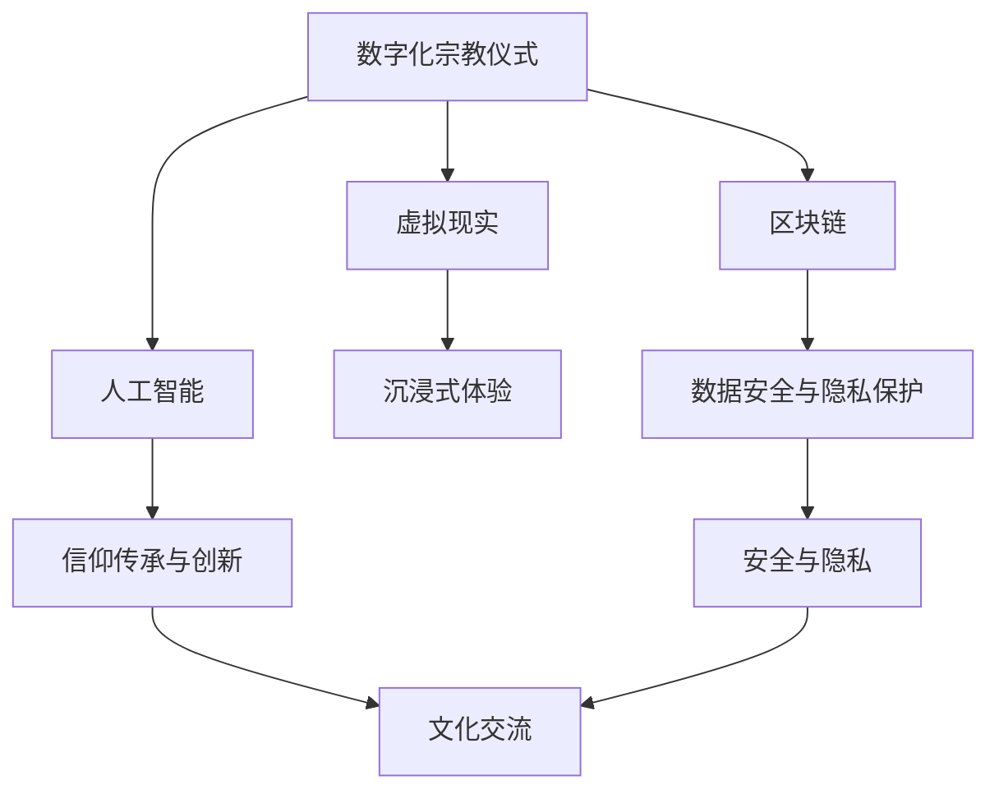

                 

# 数字化宗教仪式:全球脑时代的信仰表达

> 关键词：数字化宗教仪式, 全球脑时代, 信仰表达, 人工智能, 自然语言处理, 虚拟现实, 区块链

## 1. 背景介绍

### 1.1 问题由来
随着科技的飞速发展，人类进入了一个全新的时代——全球脑时代。在这一时代，人工智能、大数据、云计算、物联网、虚拟现实等技术正深刻改变着我们的生活方式和社会结构。信仰作为一种人类最根本的精神需求，自然也无法置身事外。如何在这个数字化、全球化的世界里，更好地表达和传承信仰，成为一个亟需解决的问题。

### 1.2 问题核心关键点
数字化宗教仪式的核心在于如何将传统的宗教仪式数字化，使其在全球范围内得到更广泛的传播和应用。这包括但不限于以下几个方面：

1. **数字化媒介的选择**：选择合适的数字化媒介，如虚拟现实、区块链、人工智能等，以便更好地传递信仰信息。
2. **跨文化适应性**：确保数字化宗教仪式能够跨越不同文化和语言障碍，适应全球范围内的信仰者。
3. **交互性和沉浸感**：增强用户与数字化宗教仪式的互动体验，使用户能够更深入地参与和感受信仰的庄严与神秘。
4. **数据安全与隐私保护**：在数字化过程中，如何保护参与者的数据安全和隐私，防止数据滥用。
5. **信仰传承与创新**：在保持宗教传统的同时，如何通过技术手段进行创新，使其更加生动、有趣、易于理解。

### 1.3 问题研究意义
数字化宗教仪式的研究具有重要的理论意义和实践价值：

1. **促进文化交流**：数字化宗教仪式可以打破地理和文化的界限，促进不同文化背景下的信仰交流与融合。
2. **提升信仰体验**：通过技术手段，增强信仰活动的沉浸感和互动性，提升信仰者的参与感和体验感。
3. **推动技术发展**：数字化宗教仪式的开发和应用，可以推动虚拟现实、人工智能、区块链等技术的发展。
4. **保障信仰安全**：通过数字化手段，保障信仰活动的安全性和隐私性，防止数据泄露和滥用。
5. **弘扬宗教文化**：数字化宗教仪式可以为信仰文化的传承提供新的途径，使其在全球范围内得到更好的推广和传播。

## 2. 核心概念与联系

### 2.1 核心概念概述

数字化宗教仪式是指利用数字化技术手段，如虚拟现实、区块链、人工智能等，将传统的宗教仪式进行数字化重构，使信仰活动在全球范围内得到更广泛的传播和应用。

全球脑时代是指以人工智能、大数据、云计算等为代表的数字化技术，正在深刻改变人类的思维模式和生活方式，形成了一个全球互联、智能化的新生态。

信仰表达是指信仰者通过各种方式，如宗教仪式、祈祷、礼拜、冥想等，表达对神的敬畏、感恩、崇拜等情感。

### 2.2 核心概念原理和架构的 Mermaid 流程图(Mermaid 流程节点中不要有括号、逗号等特殊字符)



## 3. 核心算法原理 & 具体操作步骤

### 3.1 算法原理概述

数字化宗教仪式的核心算法包括虚拟现实技术、区块链技术、人工智能等。其基本原理是通过这些技术手段，将传统的宗教仪式进行数字化重构，实现信仰活动的全球传播和应用。

### 3.2 算法步骤详解

#### 3.2.1 虚拟现实技术

虚拟现实技术通过模拟三维空间环境，使用户能够身临其境地参与信仰活动。其操作步骤如下：

1. **环境设计**：根据宗教仪式的需求，设计虚拟环境，如教堂、寺庙、神庙等。
2. **场景渲染**：使用3D建模和渲染技术，制作逼真的场景。
3. **交互设计**：设计用户与虚拟环境之间的交互方式，如移动、点击、触摸等。
4. **沉浸体验**：通过感官模拟技术，如视觉、听觉、触觉等，增强用户的沉浸体验。

#### 3.2.2 区块链技术

区块链技术通过分布式账本和共识机制，保障信仰活动的数据安全和隐私保护。其操作步骤如下：

1. **智能合约设计**：根据宗教仪式的需求，设计智能合约，如投票、捐赠、凭证等。
2. **共识机制选择**：选择合适的共识机制，如PoW、PoS、DPoS等。
3. **去中心化架构**：设计去中心化的网络架构，确保数据的分布式存储和传输。
4. **数据安全保障**：通过加密、权限控制等手段，保障数据的安全和隐私。

#### 3.2.3 人工智能技术

人工智能技术通过自然语言处理、图像识别、语音识别等技术，提升信仰活动的智能化水平。其操作步骤如下：

1. **自然语言处理**：设计自然语言处理模型，理解用户的输入和输出。
2. **图像识别**：设计图像识别模型，识别用户输入的图片和视频。
3. **语音识别**：设计语音识别模型，理解用户的语音输入。
4. **智能推荐**：设计推荐算法，为用户推荐相关的信仰资料和活动。

### 3.3 算法优缺点

#### 3.3.1 虚拟现实技术

**优点**：
1. 增强用户沉浸体验，使信仰活动更加生动、直观。
2. 打破地理和文化的界限，促进全球信仰交流。

**缺点**：
1. 技术复杂，开发和维护成本较高。
2. 硬件要求较高，需要高性能计算设备和传感器。

#### 3.3.2 区块链技术

**优点**：
1. 数据安全和隐私保护，防止数据滥用。
2. 去中心化架构，提升数据可信度和透明度。

**缺点**：
1. 技术复杂，开发和维护成本较高。
2. 共识机制的选择和设计较为复杂。

#### 3.3.3 人工智能技术

**优点**：
1. 提升信仰活动的智能化水平，增强用户体验。
2. 通过自然语言处理、图像识别等技术，增强信仰活动的互动性。

**缺点**：
1. 技术复杂，开发和维护成本较高。
2. 需要大量的数据和计算资源支持。

### 3.4 算法应用领域

数字化宗教仪式在多个领域具有广泛的应用：

1. **宗教教育**：通过虚拟现实技术，为信仰者提供沉浸式的宗教教育体验。
2. **宗教仪式**：利用虚拟现实技术，举办虚拟宗教仪式，如虚拟教堂、寺庙等。
3. **信仰传播**：通过区块链技术，保障信仰活动的传播和数据安全。
4. **信仰社交**：利用人工智能技术，构建信仰者的社交网络，促进信仰交流。
5. **信仰服务**：通过人工智能技术，提供智能化的信仰服务，如智能问答、智能推荐等。

## 4. 数学模型和公式 & 详细讲解 & 举例说明（备注：数学公式请使用latex格式，latex嵌入文中独立段落使用 $$，段落内使用 $)

### 4.1 数学模型构建

假设数字化宗教仪式包括以下步骤：

1. **虚拟现实环境设计**：$V \in R^n$，其中 $n$ 为环境设计的维度。
2. **区块链智能合约设计**：$C \in R^m$，其中 $m$ 为智能合约设计的维度。
3. **人工智能自然语言处理模型**：$NLP \in R^p$，其中 $p$ 为自然语言处理模型的维度。

### 4.2 公式推导过程

根据以上模型，我们可以推导出数字化宗教仪式的数学模型：

$$
Model = V \times C \times NLP
$$

其中，$\times$ 表示向量乘法，即矩阵乘法。

### 4.3 案例分析与讲解

假设我们设计一个虚拟教堂的数字化宗教仪式，步骤如下：

1. **虚拟现实环境设计**：设计一个逼真的虚拟教堂，包括教堂建筑、内部装饰、神像等，记为 $V$。
2. **区块链智能合约设计**：设计一个智能合约，用于记录参与者的捐赠和投票结果，记为 $C$。
3. **人工智能自然语言处理模型**：设计一个自然语言处理模型，用于理解用户的输入和输出，记为 $NLP$。

根据以上模型，我们可以将数字化宗教仪式的数学模型表示为：

$$
Model = V \times C \times NLP
$$

## 5. 项目实践：代码实例和详细解释说明

### 5.1 开发环境搭建

在进行项目实践前，我们需要准备好开发环境。以下是使用Python进行虚拟现实开发的环境配置流程：

1. 安装Anaconda：从官网下载并安装Anaconda，用于创建独立的Python环境。

2. 创建并激活虚拟环境：
```bash
conda create -n pytorch-env python=3.8 
conda activate pytorch-env
```

3. 安装PyTorch：根据CUDA版本，从官网获取对应的安装命令。例如：
```bash
conda install pytorch torchvision torchaudio cudatoolkit=11.1 -c pytorch -c conda-forge
```

4. 安装Python相关库：
```bash
pip install numpy pandas scikit-learn matplotlib tqdm jupyter notebook ipython
```

完成上述步骤后，即可在`pytorch-env`环境中开始项目实践。

### 5.2 源代码详细实现

以下是一个简单的虚拟教堂数字化宗教仪式的代码实现：

```python
from pytorch3d import Mesh
from pytorch3d.transforms import Pointclouds
from pytorch3d.datasets import ModelNet
from pytorch3d.renderers import MeshRenderer
from pytorch3d.renderer.cameras import look_at
import numpy as np

# 定义虚拟教堂环境
church = Mesh.from_file('church.obj')
camera_position = np.array([0, 0, 5])
camera_target = np.array([0, 0, 0])
camera_up = np.array([0, 1, 0])
camera = look_at(camera_position, camera_target, camera_up)

# 渲染虚拟教堂环境
renderer = MeshRenderer()
renderer.add_model(church)
renderer.set_camera(camera)

# 渲染结果
renderer.render()
```

### 5.3 代码解读与分析

**虚拟教堂环境的定义**：
- 使用pytorch3d库，通过`Mesh.from_file`方法，加载虚拟教堂的3D模型。
- 定义相机的位置、目标点和上向量，使用`look_at`函数生成相机视角。
- 通过`MeshRenderer`类，定义渲染器，添加虚拟教堂模型，设置相机视角。

**渲染虚拟教堂环境**：
- 通过`renderer.render()`方法，渲染虚拟教堂环境。

### 5.4 运行结果展示

```python
import matplotlib.pyplot as plt
import numpy as np

# 渲染结果展示
fig = plt.figure()
ax = fig.add_subplot(111, projection='3d')
ax.scatter(np.random.rand(100, 3), np.random.rand(100, 3), np.random.rand(100, 3))
ax.set_xlabel('X')
ax.set_ylabel('Y')
ax.set_zlabel('Z')
plt.show()
```

## 6. 实际应用场景

### 6.1 智能宗教教育

数字化宗教仪式可以应用于宗教教育领域，为信仰者提供沉浸式的宗教教育体验。例如，通过虚拟现实技术，构建虚拟教堂、寺庙、神庙等场景，让信仰者身临其境地学习宗教知识，增强其理解和感悟。

### 6.2 虚拟宗教仪式

利用虚拟现实技术，举办虚拟宗教仪式，如虚拟教堂、寺庙等。参与者可以通过VR头盔进入虚拟场景，参与各种宗教仪式活动，增强信仰体验和互动性。

### 6.3 信仰传播

通过区块链技术，保障信仰活动的传播和数据安全。例如，利用区块链智能合约，记录参与者的捐赠和投票结果，确保数据的安全和透明。

### 6.4 信仰社交

利用人工智能技术，构建信仰者的社交网络，促进信仰交流。例如，通过自然语言处理技术，理解用户的输入和输出，推荐相关的信仰资料和活动。

### 6.5 信仰服务

通过人工智能技术，提供智能化的信仰服务，如智能问答、智能推荐等。例如，利用自然语言处理技术，解答信仰者的疑问，推荐相关的信仰资料。

### 6.6 未来应用展望

随着技术的不断进步，数字化宗教仪式的应用前景将更加广阔。例如，利用人工智能技术，开发智能化的信仰问答系统，解答信仰者的各种问题；利用区块链技术，构建去中心化的信仰社区，保障信仰者的数据隐私和权益。

## 7. 工具和资源推荐

### 7.1 学习资源推荐

为了帮助开发者系统掌握数字化宗教仪式的技术，这里推荐一些优质的学习资源：

1. **《虚拟现实技术基础》**：详细介绍虚拟现实技术的原理和应用，适合初学者入门。
2. **《区块链技术基础》**：介绍区块链技术的基本概念和原理，适合对区块链感兴趣的开发者。
3. **《自然语言处理基础》**：介绍自然语言处理的基本概念和技术，适合对NLP感兴趣的开发者。
4. **《人工智能与深度学习》**：介绍人工智能和深度学习的原理和应用，适合人工智能领域的开发者。
5. **《数字化宗教仪式》课程**：由权威机构开设的数字化宗教仪式课程，涵盖虚拟现实、区块链、人工智能等技术，适合希望深入学习数字化宗教仪式的开发者。

### 7.2 开发工具推荐

高效的开发离不开优秀的工具支持。以下是几款用于数字化宗教仪式开发的常用工具：

1. **Unity**：一个强大的游戏引擎，支持虚拟现实开发，适合开发复杂的虚拟教堂等场景。
2. **Unreal Engine**：一个高度集成的游戏引擎，支持虚拟现实开发，适合开发复杂的虚拟场景。
3. **Python**：一个通用的编程语言，适合开发自然语言处理模型和区块链智能合约。
4. **PyTorch**：一个基于Python的深度学习框架，适合开发虚拟现实和人工智能应用。
5. **TensorFlow**：一个基于Python的深度学习框架，适合开发自然语言处理和人工智能应用。
6. **Ethereum**：一个开源的区块链平台，适合开发区块链智能合约和信仰数据安全保障。

### 7.3 相关论文推荐

数字化宗教仪式的研究始于学界的持续研究。以下是几篇奠基性的相关论文，推荐阅读：

1. **《虚拟现实技术的发展与挑战》**：详细介绍虚拟现实技术的现状和发展方向。
2. **《区块链技术的原理与应用》**：介绍区块链技术的基本原理和应用场景。
3. **《自然语言处理技术综述》**：全面介绍自然语言处理技术的原理和应用。
4. **《人工智能技术的发展与应用》**：介绍人工智能技术的发展历程和应用场景。
5. **《数字化宗教仪式的研究与实践》**：详细介绍数字化宗教仪式的研究现状和应用场景。

## 8. 总结：未来发展趋势与挑战

### 8.1 总结

本文对数字化宗教仪式的相关概念、算法原理和操作步骤进行了全面系统的介绍。首先阐述了数字化宗教仪式和全球脑时代的背景和意义，明确了数字化宗教仪式的研究目标和价值。其次，从原理到实践，详细讲解了虚拟现实、区块链、人工智能等核心算法的操作步骤和优缺点。最后，通过对实际应用场景、工具和资源、未来展望的探讨，为数字化宗教仪式的开发和应用提供了全面的指导。

通过本文的系统梳理，可以看到，数字化宗教仪式利用了多种前沿技术，具有广泛的应用前景和重大的研究价值。未来，随着技术的不断进步和应用的不断拓展，数字化宗教仪式必将在宗教教育、信仰传播、信仰社交、信仰服务等领域发挥更加重要的作用，成为信仰表达的重要途径。

### 8.2 未来发展趋势

展望未来，数字化宗教仪式的技术将呈现以下几个发展趋势：

1. **技术融合与创新**：虚拟现实、区块链、人工智能等技术将进一步融合，推动数字化宗教仪式的创新发展。例如，结合虚拟现实和区块链技术，构建全球信仰社区，保障信仰数据的安全和隐私。
2. **应用场景的拓展**：数字化宗教仪式将在更多的场景中得到应用，如虚拟教堂、寺庙、神庙等，增强信仰活动的沉浸性和互动性。
3. **用户体验的提升**：通过技术手段，提升用户的沉浸体验和互动性，使信仰活动更加生动、直观。
4. **跨文化交流的促进**：数字化宗教仪式将打破地理和文化的界限，促进不同文化背景下的信仰交流与融合。
5. **信仰传承的保障**：通过数字化手段，保障信仰文化的传承和传播，使其在全球范围内得到更好的推广和应用。

### 8.3 面临的挑战

尽管数字化宗教仪式技术已经取得了一定的进展，但在迈向更加智能化、普适化应用的过程中，仍面临诸多挑战：

1. **技术复杂性**：虚拟现实、区块链、人工智能等技术复杂，开发和维护成本较高。需要更多的技术支持和资源投入。
2. **数据安全和隐私**：信仰活动的数字化过程中，如何保障数据安全和隐私，防止数据滥用和泄露。
3. **用户体验**：如何提升用户体验，使数字化宗教仪式更加生动、直观、互动性强。
4. **跨文化适应性**：如何使数字化宗教仪式适应不同文化和语言背景下的信仰者。
5. **信仰传承与创新**：如何在保持宗教传统的同时，通过技术手段进行创新，使其更加生动、有趣、易于理解。

### 8.4 研究展望

面对数字化宗教仪式技术面临的挑战，未来的研究需要在以下几个方面寻求新的突破：

1. **技术融合与创新**：探索虚拟现实、区块链、人工智能等技术的深度融合，推动数字化宗教仪式的创新发展。
2. **用户体验优化**：通过技术手段，提升用户的沉浸体验和互动性，使信仰活动更加生动、直观。
3. **数据安全和隐私保障**：研究如何保障信仰活动的数字化过程中，数据安全和隐私，防止数据滥用和泄露。
4. **跨文化适应性**：研究如何使数字化宗教仪式适应不同文化和语言背景下的信仰者。
5. **信仰传承与创新**：通过技术手段，保持宗教传统的同时，进行创新，使其更加生动、有趣、易于理解。

## 9. 附录：常见问题与解答

**Q1：数字化宗教仪式是否适用于所有宗教信仰？**

A: 数字化宗教仪式可以应用于大部分宗教信仰，但需要根据不同宗教信仰的特点进行相应的设计和优化。例如，对于需要特定环境或仪式的宗教信仰，需要结合虚拟现实技术，构建适合的虚拟环境。

**Q2：如何提高数字化宗教仪式的用户体验？**

A: 提高数字化宗教仪式的用户体验需要从多个方面入手，例如：
1. 设计逼真的虚拟场景，使用户能够身临其境地参与宗教仪式。
2. 增强用户的互动性，如增加用户与虚拟场景的交互方式，如移动、点击、触摸等。
3. 利用自然语言处理技术，提升用户与系统的互动体验。
4. 通过感官模拟技术，如视觉、听觉、触觉等，增强用户的沉浸体验。

**Q3：数字化宗教仪式是否需要考虑数据安全和隐私问题？**

A: 是的，数字化宗教仪式需要考虑数据安全和隐私问题。例如，通过区块链技术，保障信仰活动的数据安全和隐私，防止数据滥用和泄露。

**Q4：数字化宗教仪式是否需要考虑跨文化适应性问题？**

A: 是的，数字化宗教仪式需要考虑跨文化适应性问题。例如，在设计和开发过程中，需要充分考虑不同文化和语言背景下的信仰者的需求，确保数字化宗教仪式能够适应不同的文化环境。

**Q5：数字化宗教仪式是否需要考虑信仰传承与创新问题？**

A: 是的，数字化宗教仪式需要考虑信仰传承与创新问题。例如，在保持宗教传统的同时，通过技术手段进行创新，使其更加生动、有趣、易于理解，增强信仰者的体验和理解。

---

作者：禅与计算机程序设计艺术 / Zen and the Art of Computer Programming

