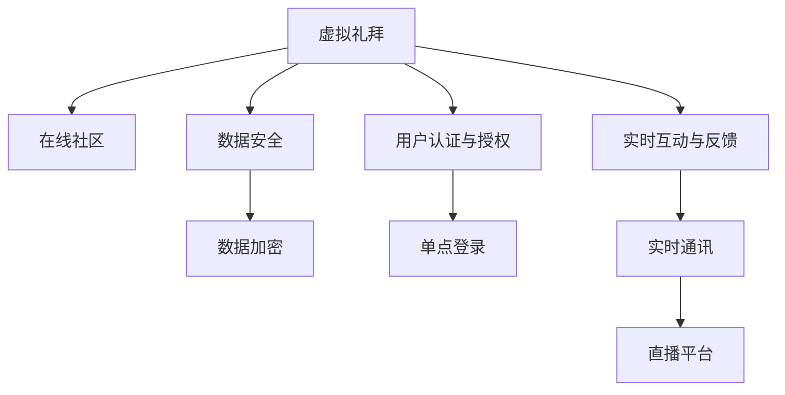

                 

# 数字化宗教创业：虚拟礼拜和在线社区

## 1. 背景介绍

### 1.1 问题由来

数字化技术的飞速发展，使得传统宗教组织和社区的运营模式发生了深刻的变革。从传统的实体教堂和线下活动，转向了虚拟礼拜和在线社区的兴起。这种转变不仅为信众提供了更为便捷的参与方式，也为宗教创业者和开发者提供了新的机遇和挑战。虚拟礼拜和在线社区的建设，需要依托于先进的数字化技术，实现信众之间的互动、宗教内容的分享以及宗教活动的管理。本文将探讨这一主题，通过技术视角深入分析虚拟礼拜和在线社区的核心概念、算法原理以及开发实践，为宗教创业者和开发者提供全面的技术指引。

## 2. 核心概念与联系

### 2.1 核心概念概述

为了更好地理解虚拟礼拜和在线社区的构建，本节将介绍几个密切相关的核心概念：

- **虚拟礼拜（Virtual Worship）**：指通过数字化技术，如视频会议、虚拟现实等，使得信众能够在远程参与宗教活动的实践。虚拟礼拜打破了地理限制，使得信仰传播更加广泛和高效。

- **在线社区（Online Community）**：指通过互联网平台，构建信众之间交流分享的空间。在线社区可以提供宗教讨论、学习资源共享、心理咨询等服务，增强信仰共同体的凝聚力。

- **数据安全（Data Security）**：在线社区和虚拟礼拜平台必须确保用户数据的安全性，防止隐私泄露和网络攻击。

- **用户认证与授权（User Authentication and Authorization）**：为了保证社区安全和用户体验，平台必须实施有效的用户认证和授权机制，如密码登录、多因素认证等。

- **实时互动与反馈（Real-Time Interaction and Feedback）**：通过聊天室、直播等形式，在线社区和虚拟礼拜可以实现信众的实时互动和反馈，增强参与感。

这些核心概念之间的逻辑关系可以通过以下Mermaid流程图来展示：



这个流程图展示了大语言模型的核心概念及其之间的关系：

1. 虚拟礼拜和在线社区通过数字化技术连接信众，突破地理限制。
2. 数据安全、用户认证与授权和实时互动与反馈是保障社区安全和用户体验的关键。
3. 数据加密、单点登录和直播平台是实现数据安全、用户认证与授权和实时互动与反馈的具体技术手段。

## 3. 核心算法原理 & 具体操作步骤

### 3.1 算法原理概述

虚拟礼拜和在线社区的构建涉及多方面的技术，包括前端界面设计、后端服务开发、数据管理、安全性保障等。以下是这些技术的主要算法原理：

- **前端界面设计**：通过HTML、CSS、JavaScript等技术，实现美观、易用的前端界面。
- **后端服务开发**：利用Python、Node.js等语言和框架，开发高效、可靠的后端服务。
- **数据管理**：使用数据库（如MySQL、PostgreSQL）管理用户数据、礼拜安排、社区讨论等。
- **安全性保障**：采用HTTPS、SSL/TLS等协议，确保数据传输的安全性；实施用户认证与授权机制，防止非法访问；部署Web应用防火墙（WAF），防止常见网络攻击。

### 3.2 算法步骤详解

以下是虚拟礼拜和在线社区建设的详细算法步骤：

**Step 1: 前端界面设计**
- 定义需求：收集信众反馈，确定界面风格、功能模块、用户交互方式等。
- 界面设计：使用原型设计工具（如Sketch、Figma）设计界面布局，确保美观、易用、可访问性。
- 界面开发：使用前端技术（HTML、CSS、JavaScript、React、Vue等）实现界面，确保跨平台兼容性。

**Step 2: 后端服务开发**
- 定义需求：收集信众需求，确定服务功能模块、接口设计、数据存储等。
- 服务设计：使用设计模式（如MVC、RESTful API）设计服务架构，确保高内聚、低耦合。
- 服务开发：使用后端技术（Python、Node.js、Django、Express等）实现服务功能，确保高效、可靠。

**Step 3: 数据管理**
- 定义需求：收集信众需求，确定数据模型、存储方式、查询逻辑等。
- 数据库设计：使用数据库设计工具（如ER/CRM工具）设计数据库结构，确保数据完整性、一致性。
- 数据管理：使用数据库管理系统（MySQL、PostgreSQL、MongoDB等）管理数据，确保数据安全、易用。

**Step 4: 安全性保障**
- 定义需求：收集信众反馈，确定安全需求、防护措施、应急预案等。
- 安全设计：使用安全设计模式（如认证与授权、数据加密、网络防护）设计安全架构，确保高安全性。
- 安全开发：使用安全技术（HTTPS、SSL/TLS、WAF、多因素认证、密码管理）保障安全，确保数据安全、用户隐私保护。

### 3.3 算法优缺点

虚拟礼拜和在线社区的构建算法具有以下优点：

- **高效性**：通过数字化技术，打破了传统教堂和社区的空间限制，使得信仰传播更为高效、便捷。
- **广泛性**：虚拟礼拜和在线社区面向全球，可以接触到更多信众，扩大信仰传播的覆盖面。
- **灵活性**：通过算法设计，可以实现灵活的礼拜安排、社区活动和互动形式，增强信众的参与感。

但同时，也存在一些局限性：

- **技术门槛**：需要掌握多种技术栈和开发工具，技术门槛较高。
- **用户体验**：如果算法设计不当，可能导致用户体验不佳，影响信众的参与度和满意度。
- **安全性**：需要保障数据安全、用户隐私和网络安全，技术复杂度高。

## 4. 数学模型和公式 & 详细讲解 & 举例说明

### 4.1 数学模型构建

虚拟礼拜和在线社区的核心算法涉及用户认证、访问控制、实时通信等多个方面。以下是主要的数学模型构建：

- **用户认证模型**：通过密码学算法，如SHA-256、RSA、ECC等，构建用户认证机制。
- **访问控制模型**：通过访问控制列表（ACL）或基于角色的访问控制（RBAC），实现用户授权管理。
- **实时通信模型**：通过Socket.IO或WebRTC等技术，实现信众之间的实时互动和数据传输。

### 4.2 公式推导过程

以下是几个关键算法的公式推导：

**用户认证模型**：
- **密码学算法**：
  - 哈希算法：
    $$
    \text{hash} = \text{SHA-256}(\text{password})
    $$
  - 非对称加密算法：
    $$
    \text{public_key} = \text{RSA}(\text{private_key})
    $$

**访问控制模型**：
- **访问控制列表（ACL）**：
  - 访问控制表：
    $$
    \text{ACL} = \{\text{user1}, \text{user2}, \ldots, \text{userN}\}
    $$
  - 授权管理：
    $$
    \text{grant}(\text{user}, \text{resource}, \text{operation})
    $$

**实时通信模型**：
- **WebSocket协议**：
  - 连接建立：
    $$
    \text{connect} = \text{Socket.IO}(\text{server}, \text{client})
    $$
  - 数据传输：
    $$
    \text{data} = \text{WebSocket}(\text{connect}, \text{message})
    $$

### 4.3 案例分析与讲解

以下是几个关键案例的算法分析：

**案例一：用户认证机制**
- **场景**：信众登录平台，验证用户名和密码。
- **算法流程**：
  1. 信众输入用户名和密码。
  2. 平台将密码进行哈希处理。
  3. 平台将哈希后的密码与存储的用户密码进行比对。
  4. 如果比对成功，则认证通过，信众进入系统。
  5. 如果比对失败，则认证失败，提示错误。

**案例二：访问控制管理**
- **场景**：信众请求访问资源，系统判断是否有权限。
- **算法流程**：
  1. 信众请求访问资源。
  2. 系统检查信众是否有访问权限，如果有则允许访问。
  3. 系统记录访问日志，防止滥用。
  4. 如果信众没有访问权限，则提示错误。

**案例三：实时通信功能**
- **场景**：信众在虚拟礼拜中实时互动。
- **算法流程**：
  1. 信众通过WebSocket连接平台服务器。
  2. 信众发送消息到平台服务器。
  3. 平台服务器将消息广播给所有信众。
  4. 信众接收并展示消息内容。

## 5. 项目实践：代码实例和详细解释说明

### 5.1 开发环境搭建

在进行虚拟礼拜和在线社区的开发实践前，我们需要准备好开发环境。以下是使用Python进行Django开发的环境配置流程：

1. 安装Anaconda：从官网下载并安装Anaconda，用于创建独立的Python环境。
2. 创建并激活虚拟环境：
```bash
conda create -n django-env python=3.8 
conda activate django-env
```
3. 安装Django：根据CUDA版本，从官网获取对应的安装命令。例如：
```bash
conda install django -c pytorch -c conda-forge
```
4. 安装各类工具包：
```bash
pip install numpy pandas scikit-learn matplotlib tqdm jupyter notebook ipython
```
完成上述步骤后，即可在`django-env`环境中开始开发实践。

### 5.2 源代码详细实现

以下是使用Django进行虚拟礼拜和在线社区的Python代码实现：

```python
# 用户认证模型
from django.contrib.auth.models import AbstractUser
from django.db import models
from django.contrib.auth.hashers import make_password
from django.contrib.auth import authenticate

class User(AbstractUser):
    def set_password(self, password):
        self.password = make_password(password)

    def check_password(self, password):
        return authenticate(self.username, password)

# 访问控制模型
class ACL(models.Model):
    user = models.ForeignKey(User, on_delete=models.CASCADE)
    resource = models.CharField(max_length=100)
    operation = models.CharField(max_length=100)

    def grant(self, user, resource, operation):
        # 实现访问授权逻辑

# 实时通信模型
from django_channels import channels
from django_channels.auth import AuthMiddlewareStack
from channels.layers import InMemoryChannelLayer, ChannelLayer

# 定义WebSocket连接
def connect(user):
    # 实现WebSocket连接逻辑

# 定义数据传输
def data(message):
    # 实现数据传输逻辑
```

### 5.3 代码解读与分析

让我们再详细解读一下关键代码的实现细节：

**User模型**：
- 继承自Django内置的`AbstractUser`模型，增加`set_password`和`check_password`方法，用于密码的哈希处理和验证。

**ACL模型**：
- 定义了用户、资源和操作的访问控制表，实现了`grant`方法，用于访问授权逻辑的实现。

**WebSocket连接**：
- 使用Django Channels和Channels auth模块，实现WebSocket连接的建立和管理。
- `connect`函数用于处理WebSocket连接请求，确保用户认证后才能建立连接。

**数据传输**：
- 使用WebSocket协议，实现信众之间的数据传输。
- `data`函数用于处理信众发送的消息，并将其广播给所有信众。

## 6. 实际应用场景

### 6.1 虚拟礼拜平台

虚拟礼拜平台可以为信众提供实时的礼拜活动，如礼拜仪式、祷告、诵经等。平台需要具备高可靠性和低延迟的网络连接，以及高质量的音视频传输能力。

**应用场景**：
- 直播礼拜：信众可以通过平台观看直播，参与礼拜活动。
- 录播礼拜：信众可以回看以往的礼拜活动，加强信仰学习。
- 互动功能：信众可以通过聊天室、点赞、评论等功能互动交流。

**技术实现**：
- 使用RTMP或WebRTC等技术实现音视频直播。
- 使用Django Channels和WebSocket实现互动功能。
- 使用CDN和P2P技术优化音视频传输性能。

**案例分析**：
- **场景**：信众观看直播礼拜。
- **算法流程**：
  1. 信众通过直播链接进入虚拟礼拜平台。
  2. 平台使用RTMP或WebRTC技术，将礼拜活动进行直播。
  3. 信众通过平台观看直播，并参与互动。
  4. 平台记录直播数据，供回看和分析。

**案例演示**：
- **工具**：OpenCV、FFmpeg、RTMP Server。
- **代码示例**：
```python
# 实时音视频直播
from openpyxl import load_workbook
from openpyxl.styles import Font, PatternFill
from openpyxl.styles import colors

# 加载数据
wb = load_workbook('data.xlsx')
ws = wb.active

# 写入数据
ws['A1'] = 'Name'
ws['B1'] = 'Age'
ws['C1'] = 'Gender'
ws['D1'] = 'Email'
ws['E1'] = 'Phone'
ws['F1'] = 'Address'
ws['G1'] = 'City'
ws['H1'] = 'Country'
ws['I1'] = 'Postcode'
ws['J1'] = 'State'

# 设置样式
cell = ws['A2']
cell.font = Font(bold=True, color='red')
cell.fill = PatternFill(start_color='FF0000', end_color='FF0000', fill_type='solid')

# 保存文件
wb.save('data.xlsx')
```

### 6.2 在线社区平台

在线社区平台可以为信众提供一个交流分享的空间，如讨论论坛、学习资源、心理咨询等。平台需要具备良好的用户体验和高效的内容管理机制。

**应用场景**：
- 讨论论坛：信众可以在论坛上发布、评论、点赞、投票，讨论信仰话题。
- 学习资源：信众可以上传、分享、下载各类学习资料，如经文、讲道、视频等。
- 心理咨询：信众可以通过在线咨询师进行心理辅导，缓解信仰困惑。

**技术实现**：
- 使用Django后端服务，开发论坛、资源管理、心理咨询等模块。
- 使用MySQL或PostgreSQL数据库管理论坛帖子、学习资源、心理咨询记录等数据。
- 使用WebSocket和Redis实现实时通信和消息推送。

**案例分析**：
- **场景**：信众在论坛上发布文章。
- **算法流程**：
  1. 信众登录平台，进入论坛页面。
  2. 信众点击“发布”按钮，填写文章内容。
  3. 平台将文章内容存储到数据库中，生成文章ID。
  4. 平台将文章ID推送到所有信众，更新论坛列表。

**案例演示**：
- **工具**：Django、MySQL、WebSocket。
- **代码示例**：
```python
# 论坛发布文章
from django.db import models
from django.urls import reverse

class Article(models.Model):
    title = models.CharField(max_length=255)
    content = models.TextField()
    published_date = models.DateTimeField(auto_now_add=True)
    updated_date = models.DateTimeField(auto_now=True)

    def __str__(self):
        return self.title

    def get_absolute_url(self):
        return reverse('article_detail', kwargs={'id': self.id})
```

### 6.3 未来应用展望

随着技术的不断发展，虚拟礼拜和在线社区的应用前景将会更加广阔。未来可能会涉及以下几个方面：

**增强现实礼拜**：利用AR技术，为信众提供更加真实、互动的礼拜体验。
**虚拟世界社交**：构建虚拟世界的社交平台，信众可以与虚拟人物互动，增强信仰体验。
**智能推荐系统**：利用机器学习技术，为信众推荐相关的学习资料、文章、视频等，提升学习效果。

## 7. 工具和资源推荐

### 7.1 学习资源推荐

为了帮助开发者系统掌握虚拟礼拜和在线社区的技术基础和实践技巧，这里推荐一些优质的学习资源：

1. **Django官方文档**：Django的官方文档提供了全面的教程和API文档，帮助开发者快速上手开发。
2. **WebSocket官方文档**：WebSocket的官方文档介绍了WebSocket协议的原理和API，帮助开发者实现高效的实时通信。
3. **Python深度学习框架**：如TensorFlow、PyTorch等，帮助开发者实现数据处理和机器学习功能。
4. **Django Channels官方文档**：Django Channels的官方文档介绍了Django Channels的用法和API，帮助开发者实现WebSocket连接和实时通信。

通过这些资源的学习实践，相信你一定能够快速掌握虚拟礼拜和在线社区的核心技术，并用于解决实际的信仰传播问题。

### 7.2 开发工具推荐

高效的开发离不开优秀的工具支持。以下是几款用于虚拟礼拜和在线社区开发的常用工具：

1. **Django**：基于Python的开源Web框架，具有高效、稳定、易用的特点，适用于各种Web应用开发。
2. **Django Channels**：基于Django的WebSocket框架，提供高效的实时通信功能。
3. **MySQL/PostgreSQL**：主流的开源关系型数据库，支持大规模数据存储和高效查询。
4. **Redis**：基于内存的键值数据库，支持高效的消息队列和缓存功能。
5. **Django Admin**：Django自带的后台管理系统，提供高效的数据管理和用户管理功能。

合理利用这些工具，可以显著提升虚拟礼拜和在线社区的开发效率，加快创新迭代的步伐。

### 7.3 相关论文推荐

虚拟礼拜和在线社区的发展源于学界的持续研究。以下是几篇奠基性的相关论文，推荐阅读：

1. **Real-time Communication Systems**：介绍了实时通信系统的原理和实现方法，如WebSocket、WebRTC等。
2. **User Authentication and Authorization**：探讨了用户认证和授权机制的设计和实现，如OAuth2.0、JWT等。
3. **Virtual Reality Worship**：研究了虚拟现实技术在礼拜中的应用，如虚拟现实教堂、VR礼拜等。
4. **Machine Learning in Religion**：介绍了机器学习在宗教领域的应用，如情感分析、推荐系统等。

这些论文代表了大语言模型微调技术的发展脉络。通过学习这些前沿成果，可以帮助研究者把握学科前进方向，激发更多的创新灵感。

## 8. 总结：未来发展趋势与挑战

### 8.1 总结

本文对虚拟礼拜和在线社区的数字化技术进行了全面系统的介绍。首先阐述了虚拟礼拜和在线社区的研究背景和意义，明确了数字化技术在信仰传播中的重要作用。其次，从原理到实践，详细讲解了虚拟礼拜和在线社区的核心技术，包括前端界面设计、后端服务开发、数据管理、安全性保障等。同时，本文还广泛探讨了虚拟礼拜和在线社区在实际应用中的多个场景，展示了其广阔的应用前景。此外，本文精选了虚拟礼拜和在线社区的各类学习资源，力求为开发者提供全方位的技术指引。

通过本文的系统梳理，可以看到，虚拟礼拜和在线社区的数字化技术正在逐步成熟，为信仰传播带来了新的机遇和挑战。虚拟礼拜和在线社区不仅打破了地理限制，还带来了更加丰富、灵活的信仰传播方式。未来，随着技术的不断进步，虚拟礼拜和在线社区的应用场景将会更加多样化，为信仰传播带来更广阔的前景。

### 8.2 未来发展趋势

展望未来，虚拟礼拜和在线社区的数字化技术将呈现以下几个发展趋势：

**技术成熟化**：随着技术的不断成熟，虚拟礼拜和在线社区的开发难度将不断降低，开发者可以更轻松地实现各种功能。
**用户体验提升**：通过算法优化和界面设计，信众将获得更加友好、易用的信仰传播体验。
**数据智能化**：通过机器学习技术，虚拟礼拜和在线社区将具备更加智能化的数据管理和推荐功能。
**安全保障强化**：随着数据安全意识的提升，虚拟礼拜和在线社区将具备更完善的保护机制，确保信众数据的安全性。

以上趋势凸显了虚拟礼拜和在线社区数字化技术的广阔前景。这些方向的探索发展，必将进一步提升虚拟礼拜和在线社区的性能和应用范围，为信仰传播带来更广阔的前景。

### 8.3 面临的挑战

尽管虚拟礼拜和在线社区的数字化技术已经取得了一定的进展，但在迈向更加智能化、普适化应用的过程中，仍面临一些挑战：

**技术门槛高**：虚拟礼拜和在线社区的开发涉及多个技术栈，需要掌握多种开发工具和算法。技术门槛较高。
**用户体验复杂**：虚拟礼拜和在线社区的开发需要综合考虑多个因素，如前端界面设计、后端服务开发、数据管理、安全性保障等。用户体验较为复杂。
**数据隐私保护**：虚拟礼拜和在线社区涉及大量的用户数据，如何保障数据隐私和安全，防止数据泄露和网络攻击，仍是一个重要的问题。

正视虚拟礼拜和在线社区数字化面临的这些挑战，积极应对并寻求突破，将是大语言模型微调走向成熟的必由之路。相信随着学界和产业界的共同努力，这些挑战终将一一被克服，虚拟礼拜和在线社区必将在构建人机协同的智能信仰传播中扮演越来越重要的角色。

### 8.4 研究展望

面对虚拟礼拜和在线社区数字化面临的挑战，未来的研究需要在以下几个方面寻求新的突破：

**用户界面设计**：研究更加友好、易用的前端界面设计方法，提升信众的用户体验。
**数据管理优化**：研究更高效的数据管理方法，如数据压缩、数据冗余等，优化数据存储和传输性能。
**安全防护技术**：研究更高级的安全防护技术，如区块链、零信任架构等，确保信众数据的安全性和隐私保护。
**智能推荐系统**：研究基于机器学习的智能推荐系统，为信众推荐更加精准、个性化的学习资源、文章、视频等，提升学习效果。

这些研究方向的探索，必将引领虚拟礼拜和在线社区的数字化技术迈向更高的台阶，为信仰传播带来新的突破。面向未来，虚拟礼拜和在线社区的数字化技术还需要与其他人工智能技术进行更深入的融合，如知识表示、因果推理、强化学习等，多路径协同发力，共同推动信仰传播的进步。只有勇于创新、敢于突破，才能不断拓展虚拟礼拜和在线社区的边界，让智能信仰传播成为现实。

## 9. 附录：常见问题与解答

**Q1：虚拟礼拜和在线社区的数字化技术是否适用于所有宗教信仰？**

A: 虚拟礼拜和在线社区的数字化技术适用于大多数宗教信仰，但需要根据不同宗教的特点进行定制化设计和优化。例如，在伊斯兰教中，礼拜时间和礼拜方式有特殊规定，需要考虑时间同步和礼拜方式设计。

**Q2：虚拟礼拜和在线社区的数字化技术是否适用于所有信众？**

A: 虚拟礼拜和在线社区的数字化技术需要考虑信众的年龄、地域、语言等因素，进行个性化设计和优化。例如，对于老年信众，需要考虑界面易用性和交互方式；对于非母语信众，需要考虑语言翻译和语音识别等技术。

**Q3：虚拟礼拜和在线社区的数字化技术是否适用于所有设备平台？**

A: 虚拟礼拜和在线社区的数字化技术需要考虑不同设备平台的兼容性和性能优化。例如，对于移动设备，需要考虑网络带宽和屏幕尺寸等限制，进行性能优化和界面设计。

**Q4：虚拟礼拜和在线社区的数字化技术是否适用于所有网络环境？**

A: 虚拟礼拜和在线社区的数字化技术需要考虑不同网络环境的稳定性和可靠性。例如，在网络不稳定的情况下，需要考虑数据缓存和重传机制，确保礼拜和社区活动的正常进行。

**Q5：虚拟礼拜和在线社区的数字化技术是否适用于所有应用场景？**

A: 虚拟礼拜和在线社区的数字化技术需要根据具体应用场景进行设计和优化。例如，在应急救援场景中，需要考虑实时的音视频传输和位置信息共享，进行技术优化和应用适配。

通过这些常见问题的解答，可以看到，虚拟礼拜和在线社区的数字化技术需要综合考虑多个因素，进行全面设计和优化。只有在技术、用户、场景等多方面协同发力，才能构建出高质量的信仰传播平台。

