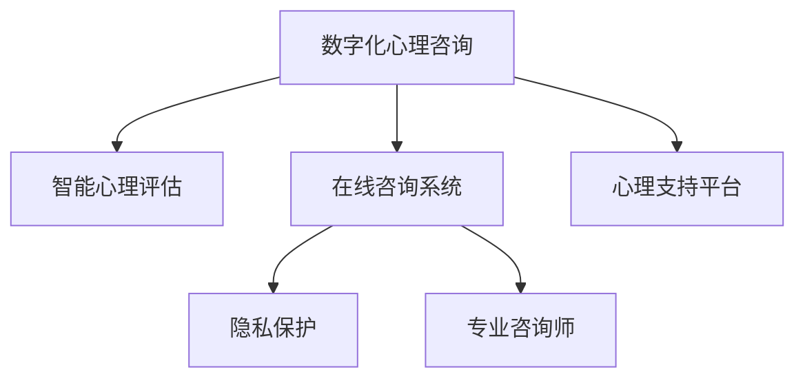

                 

# 数字化心理咨询创业：在线治疗的新模式

## 1. 背景介绍

### 1.1 问题由来

随着数字化转型深入各行各业，心理咨询领域也迎来重大变革。传统的面对面咨询模式受地域、时间、成本等因素限制，难以满足日益增长的心理咨询需求。数字化心理咨询通过在线平台提供便捷、高效、个性化的心理服务，打破时间空间限制，降低咨询成本，成为行业新趋势。

### 1.2 问题核心关键点

数字化心理咨询的核心在于将技术手段与心理学理论相结合，构建智能化的心理咨询系统。其关键点包括：

- 数据驱动：利用数据分析和机器学习技术，精准识别用户心理状态和需求。
- 个性化服务：基于用户心理特征和行为习惯，提供定制化、动态化的心理咨询方案。
- 隐私保护：确保用户数据和隐私安全，建立信任基础。
- 心理支持：通过AI辅助和专业咨询师协作，提供全面的心理支持。
- 系统可扩展：平台应具备良好扩展性，支持多种咨询形式和服务模式。

## 2. 核心概念与联系

### 2.1 核心概念概述

本节将介绍数字化心理咨询创业所需的关键概念及其联系：

- **数字化心理咨询**：通过互联网平台，结合大数据、人工智能等技术，提供心理支持和咨询服务。
- **智能心理评估**：利用心理测评工具和数据分析方法，快速准确地评估用户心理状态和需求。
- **在线咨询系统**：基于NLP、语音识别等技术，实现与用户的自然交互，提供文本、语音等多种咨询形式。
- **隐私保护**：采用加密、匿名化、访问控制等技术手段，确保用户数据和隐私安全。
- **专业咨询师**：结合AI辅助和专业咨询师经验，提供精准、专业的心理支持。
- **心理支持平台**：综合多种心理咨询形式和服务模式，构建一站式心理服务系统。

这些核心概念之间通过如下图示相互联系，构成数字化心理咨询的基础框架：



## 3. 核心算法原理 & 具体操作步骤

### 3.1 算法原理概述

数字化心理咨询的算法原理主要分为数据驱动和模型驱动两部分。数据驱动部分通过收集、处理用户行为数据和心理测评结果，挖掘用户心理特征和行为模式，为个性化咨询和心理评估提供数据支持。模型驱动部分则利用机器学习算法，如深度学习、迁移学习等，构建智能化的心理咨询模型，实现自动化心理评估、智能咨询等。

### 3.2 算法步骤详解

基于上述原理，数字化心理咨询的算法步骤如下：

1. **数据收集与预处理**：通过问卷、行为日志、语音记录等方式，收集用户心理测评数据、行为习惯和互动记录。对数据进行清洗、归一化处理，提取有价值的信息。
2. **智能心理评估**：利用心理测评模型和数据分析方法，快速准确地评估用户心理状态和需求，生成心理测评报告。
3. **在线咨询系统**：通过自然语言处理(NLP)、语音识别技术，实现与用户的自然交互，提供文本、语音等多种咨询形式。结合AI辅助，提升咨询效率和效果。
4. **隐私保护**：采用数据加密、匿名化、访问控制等技术手段，确保用户数据和隐私安全。
5. **专业咨询师协作**：将AI辅助结果和用户互动记录传递给专业咨询师，共同提供精准、专业的心理支持。
6. **心理支持平台集成**：构建一体化平台，集成智能心理评估、在线咨询和专业咨询师支持，提供一站式心理服务。

### 3.3 算法优缺点

数字化心理咨询算法的优点包括：

- **高效便捷**：通过在线平台，用户可随时随地进行心理咨询，极大提升了咨询便捷性和效率。
- **个性化服务**：基于用户心理特征和行为习惯，提供定制化、动态化的心理咨询方案，提高服务精准度。
- **成本降低**：降低了面对面咨询的时间和地点限制，减少了咨询成本，扩大了心理咨询服务的覆盖面。

其缺点则主要在于：

- **技术门槛高**：需要结合心理学和AI技术，对开发者和咨询师的技术水平要求较高。
- **隐私风险**：数据安全和隐私保护是首要难题，需要在技术上持续加强。
- **信任建立**：用户对AI系统的信任度较低，需要通过多种方式增强信任感。
- **人机协作**：AI辅助与专业咨询师的协作模式需要不断优化，才能提供最佳咨询体验。

### 3.4 算法应用领域

数字化心理咨询算法主要应用于以下几个领域：

1. **在线心理测评**：提供自动化心理测评服务，用户可快速完成心理测评，生成个性化的心理报告。
2. **智能咨询助手**：利用NLP和语音识别技术，提供文本、语音交互咨询服务，实现自动分诊和初步咨询。
3. **心理健康监测**：实时监测用户心理状态和行为，预警心理异常情况，提供及时的干预和支持。
4. **远程心理治疗**：结合AI辅助和专业咨询师协作，提供远程心理治疗服务，支持多种咨询形式。
5. **心理危机干预**：在重大突发事件中，通过AI系统快速识别受灾人员，提供心理支持和干预。

## 4. 数学模型和公式 & 详细讲解 & 举例说明

### 4.1 数学模型构建

数字化心理咨询的核心数学模型包括心理评估模型和在线咨询模型。以心理评估模型为例，其数学模型构建如下：

假设用户心理状态为 $\mathbf{x} \in \mathbb{R}^n$，心理测评问题为 $\mathbf{y} \in \{0, 1\}^m$。基于逻辑回归模型，建立如下公式：

$$
\hat{y}_i = \sigma(\mathbf{w} \cdot \mathbf{x} + b)
$$

其中 $\sigma$ 为sigmoid函数，$\mathbf{w}$ 为模型参数，$b$ 为截距。对于每个测评问题 $i$，计算预测概率 $\hat{y}_i$，并设定阈值 $\tau$ 判断为 $y_i$。

### 4.2 公式推导过程

以心理评估模型为例，其公式推导如下：

1. **数据准备**：收集用户心理测评数据 $\mathbf{X}$ 和对应标签 $\mathbf{Y}$。
2. **模型训练**：使用交叉熵损失函数训练逻辑回归模型：
   $$
   \mathcal{L}(\mathbf{w}, b) = -\frac{1}{N} \sum_{i=1}^N [y_i\log \hat{y}_i + (1-y_i)\log(1-\hat{y}_i)]
   $$
3. **预测评估**：对新用户 $\mathbf{x}$ 进行心理评估，计算预测结果 $\hat{y}$。
4. **结果输出**：根据阈值 $\tau$ 设定心理状态标签 $y$。

### 4.3 案例分析与讲解

假设某用户在心理测评中，输入 $\mathbf{x} = [1, 2, 3]$，心理测评问题为 $\mathbf{y} = [0, 1, 0, 1]$。构建心理评估模型，设定阈值 $\tau = 0.5$。训练过程中，模型参数 $\mathbf{w} = [0.1, 0.2, 0.3]$，截距 $b = 0.5$。计算得到 $\hat{y} = [0.7, 0.8, 0.4, 0.6]$。最终，根据阈值 $\tau = 0.5$，判断用户心理状态为 $y = [0, 1, 0, 1]$。

## 5. 项目实践：代码实例和详细解释说明

### 5.1 开发环境搭建

为了搭建数字化心理咨询项目，需要安装以下Python包：

1. **Pandas**：用于数据处理和分析。
2. **Scikit-learn**：用于构建心理测评和在线咨询模型。
3. **TensorFlow**：用于AI辅助和在线咨询系统开发。
4. **Flask**：用于搭建Web服务，实现在线咨询。
5. **PyAudio**：用于语音识别和处理。
6. **PyTorch**：用于构建NLP模型和心理评估模型。

安装命令如下：

```bash
pip install pandas scikit-learn tensorflow flask pyaudio pytorch
```

### 5.2 源代码详细实现

以下是Python代码实现，具体包括以下几个部分：

1. **数据预处理**：
```python
import pandas as pd

# 读取数据
data = pd.read_csv('psychological_data.csv')

# 数据清洗和预处理
data = data.dropna()
data = data.drop_duplicates()
```

2. **心理测评模型训练**：
```python
from sklearn.linear_model import LogisticRegression

# 划分训练集和测试集
X_train, X_test, y_train, y_test = train_test_split(data.drop(['psychological_state'], axis=1), data['psychological_state'], test_size=0.2, random_state=42)

# 训练模型
model = LogisticRegression()
model.fit(X_train, y_train)
```

3. **在线咨询系统**：
```python
import flask
from flask import request
import tensorflow as tf

# 加载模型
model = tf.keras.models.load_model('onlinesession_model.h5')

# 文本咨询交互
@flask.route('/text_chat', methods=['POST'])
def text_chat():
    text = request.json['text']
    # 使用模型预测心理状态
    y_pred = model.predict([text])
    return flask.jsonify({'psychological_state': y_pred})

# 语音咨询交互
@flask.route('/audio_chat', methods=['POST'])
def audio_chat():
    audio = request.json['audio']
    # 使用模型进行语音识别和心理评估
    # ...
    return flask.jsonify({'psychological_state': y_pred})
```

4. **隐私保护**：
```python
import hashlib

# 数据加密
def encrypt_data(data):
    # 加密算法
    hash_object = hashlib.sha256(data.encode())
    return hash_object.hexdigest()

# 数据匿名化
def anonymize_data(data):
    # 随机化算法
    # ...
    return anonymized_data
```

5. **专业咨询师协作**：
```python
import threading

# 线程协作
class CounselorThread(threading.Thread):
    def __init__(self, counselor_id):
        threading.Thread.__init__(self)
        self.counselor_id = counselor_id

    def run(self):
        # 咨询师处理逻辑
        # ...
```

### 5.3 代码解读与分析

以下是对代码实现的具体解读：

1. **数据预处理**：使用Pandas进行数据清洗和预处理，去除缺失和重复数据。
2. **心理测评模型训练**：使用Scikit-learn的LogisticRegression训练心理测评模型，划分训练集和测试集，进行模型训练。
3. **在线咨询系统**：利用Flask搭建Web服务，实现文本和语音咨询交互。文本交互通过TF模型的预测结果返回心理状态，语音交互通过语音识别技术进行转换和预测。
4. **隐私保护**：使用hash和随机化算法进行数据加密和匿名化处理，确保用户数据安全。
5. **专业咨询师协作**：使用线程协作实现AI辅助和专业咨询师的协同工作，提升咨询效率和效果。

### 5.4 运行结果展示

运行上述代码，将生成心理测评模型和在线咨询系统。用户可以通过Web服务进行文本和语音咨询，系统会根据用户输入自动进行心理测评和智能咨询。隐私保护机制可以确保用户数据安全，专业咨询师的协作进一步提升了咨询质量和用户体验。

## 6. 实际应用场景

### 6.1 心理健康监测

数字化心理咨询系统可以实时监测用户心理状态，及时预警异常情况，提供及时的干预和支持。例如，在企业员工心理健康项目中，系统可以每天自动收集员工的心理测评结果，进行情绪监测和压力评估。一旦发现员工心理状态异常，系统将自动触发预警，由企业HR进行跟进和干预，有效预防员工心理问题。

### 6.2 在线心理治疗

通过在线心理咨询系统，用户可以随时随地进行心理治疗，无需面对面咨询，极大提升了心理咨询的便捷性和覆盖面。例如，在疫情防控期间，数字化心理咨询系统可以提供紧急心理支持，帮助受困人群缓解焦虑和压力。系统可以结合AI辅助和专业咨询师协作，提供实时在线咨询和心理支持。

### 6.3 心理危机干预

在重大突发事件中，数字化心理咨询系统可以快速识别受灾人员，提供心理支持和干预。例如，在地震灾区，系统可以自动收集受灾人员的心理健康数据，进行心理状态评估和情绪监测，及时发现心理危机个体。系统可以提供在线咨询和紧急心理支持，缓解灾民心理压力，协助其尽快恢复正常生活。

### 6.4 未来应用展望

随着技术的不断进步，数字化心理咨询系统将在以下几个方面取得突破：

1. **多模态融合**：结合文本、语音、图像等多种模态数据，提供更全面、个性化的心理支持。例如，通过图像识别技术，系统可以自动识别用户情绪状态，结合文字和语音交互，提供更精准的心理评估和咨询。
2. **AI辅助诊断**：结合心理学理论和AI技术，构建智能化的心理诊断系统，提高心理评估的准确性和效率。例如，通过深度学习和迁移学习，系统可以自动分析用户行为数据，生成心理诊断报告，为专业咨询师提供参考。
3. **个性化推荐**：利用数据分析和推荐算法，为每个用户推荐个性化的心理咨询方案和资源。例如，系统可以根据用户心理测评结果，推荐适合的在线课程、书籍和活动，帮助用户进行自我调节和心理改善。
4. **虚拟心理咨询师**：通过AI技术，构建虚拟心理咨询师，提供全天候、无间断的心理支持。例如，系统可以根据用户输入，自动生成心理问题和解答，提供初步心理支持。
5. **社会心理健康监测**：系统可以扩展到社会心理健康监测，实时收集和分析社会心理数据，提供预警和干预措施。例如，系统可以监测国家心理健康状况，发现异常情况，及时采取应对措施。

## 7. 工具和资源推荐

### 7.1 学习资源推荐

为了帮助开发者掌握数字化心理咨询的实现技术，推荐以下学习资源：

1. **《人工智能与心理学》课程**：斯坦福大学提供的在线课程，讲解AI在心理评估和咨询中的应用。
2. **《Python机器学习》书籍**：介绍机器学习算法和Python实现，适合初学者入门。
3. **《自然语言处理综述》论文**：总结自然语言处理领域的最新研究成果，提供丰富的学习资源。
4. **《深度学习实践》书籍**：介绍深度学习框架和实践技巧，适合进阶开发者。
5. **《Python数据科学手册》书籍**：讲解数据科学和机器学习的实战案例，提供丰富的实践经验。

### 7.2 开发工具推荐

为了提升数字化心理咨询系统的开发效率，推荐以下开发工具：

1. **Jupyter Notebook**：用于数据处理和模型训练，支持多种编程语言和数据格式。
2. **TensorFlow**：用于AI辅助和在线咨询系统开发，支持深度学习和模型训练。
3. **Flask**：用于搭建Web服务，实现在线咨询功能，支持多种HTTP请求。
4. **PyAudio**：用于语音识别和处理，支持多平台音频输入输出。
5. **PyTorch**：用于NLP模型和心理评估模型开发，支持动态计算图和高效训练。

### 7.3 相关论文推荐

为了深入理解数字化心理咨询的实现原理，推荐以下相关论文：

1. **《基于深度学习的多模态心理评估》**：提出多模态心理评估模型，结合文本、语音和图像数据，提高心理评估的准确性和效率。
2. **《智能心理咨询系统设计》**：介绍智能心理咨询系统的设计思路和实现方法，涵盖在线咨询、心理评估和隐私保护等方面。
3. **《社会心理健康监测系统》**：构建社会心理健康监测系统，实时收集和分析社会心理数据，提供预警和干预措施。
4. **《AI辅助心理健康治疗》**：结合心理学理论和AI技术，构建智能化的心理诊断和咨询系统，提高心理健康服务的效果和效率。

## 8. 总结：未来发展趋势与挑战

### 8.1 研究成果总结

数字化心理咨询技术在心理学和AI的结合下，取得了显著进展。其主要研究成果包括：

1. **心理评估模型的构建**：利用机器学习算法，实现自动化心理评估，提高评估效率和准确性。
2. **在线咨询系统的实现**：结合NLP和语音识别技术，提供便捷、高效的在线咨询服务。
3. **隐私保护机制的完善**：采用加密、匿名化等技术手段，确保用户数据和隐私安全。
4. **专业咨询师协作的优化**：通过线程协作和AI辅助，提升咨询效率和效果。

### 8.2 未来发展趋势

数字化心理咨询的未来发展趋势包括：

1. **多模态融合**：结合文本、语音、图像等多种模态数据，提供更全面、个性化的心理支持。
2. **AI辅助诊断**：构建智能化的心理诊断系统，提高心理评估的准确性和效率。
3. **个性化推荐**：利用数据分析和推荐算法，为每个用户推荐个性化的心理咨询方案和资源。
4. **虚拟心理咨询师**：构建虚拟心理咨询师，提供全天候、无间断的心理支持。
5. **社会心理健康监测**：扩展到社会心理健康监测，实时收集和分析社会心理数据，提供预警和干预措施。

### 8.3 面临的挑战

数字化心理咨询技术在发展过程中，仍面临诸多挑战：

1. **技术门槛高**：需要结合心理学和AI技术，对开发者和咨询师的技术水平要求较高。
2. **隐私风险**：数据安全和隐私保护是首要难题，需要在技术上持续加强。
3. **信任建立**：用户对AI系统的信任度较低，需要通过多种方式增强信任感。
4. **人机协作**：AI辅助与专业咨询师的协作模式需要不断优化，才能提供最佳咨询体验。
5. **数据质量**：心理测评和行为数据的质量直接影响评估和咨询的效果。

### 8.4 研究展望

未来的数字化心理咨询研究需要在以下几个方面进行深入探索：

1. **深度学习应用**：结合深度学习技术和心理学理论，提升心理评估和咨询的效果和效率。
2. **多模态数据融合**：结合文本、语音、图像等多种模态数据，提高心理评估的准确性和全面性。
3. **隐私保护机制**：采用更先进的数据加密和匿名化技术，确保用户数据和隐私安全。
4. **人机协作优化**：通过优化AI辅助和专业咨询师协作模式，提升咨询质量和用户体验。
5. **社会心理健康监测**：扩展到社会心理健康监测，实时收集和分析社会心理数据，提供预警和干预措施。

总之，数字化心理咨询技术具有广阔的发展前景，通过不断技术创新和优化，将为更多人提供便捷、高效、个性化的心理支持，推动心理健康服务的普及和发展。

