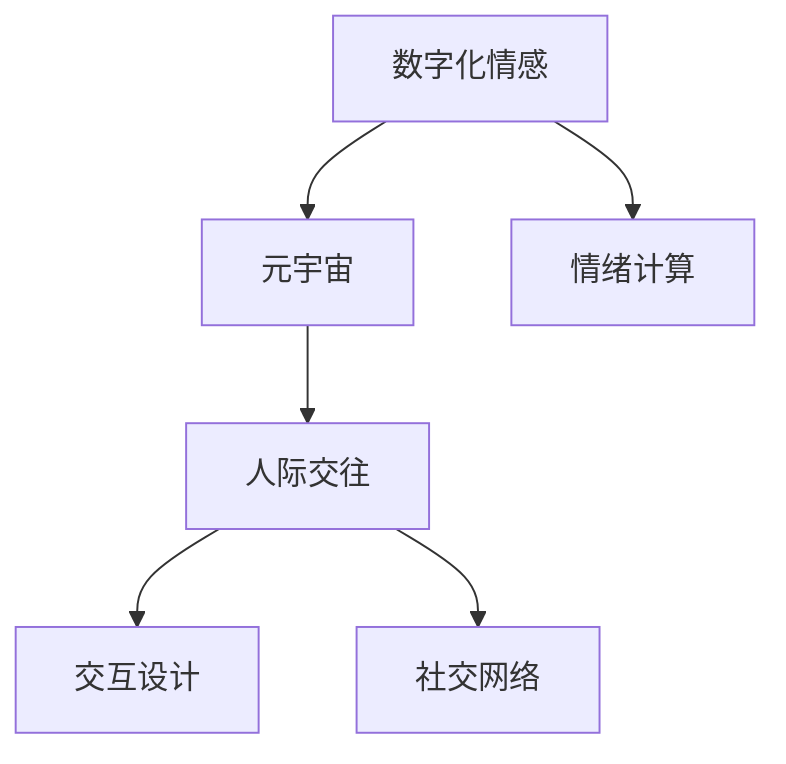

                 

# 数字化情感表达:元宇宙中的人际交往

> 关键词：数字化情感,元宇宙,人际交往,虚拟现实(VR),人工智能(AI),情绪计算,交互设计,社交网络

## 1. 背景介绍

### 1.1 问题由来
随着虚拟现实(VR)、增强现实(AR)技术的不断成熟，元宇宙（Metaverse）的概念被推向前台，成为新一代互联网发展的重要方向。元宇宙不仅在技术上呈现出高度沉浸式、交互性的特点，更在社会交往层面带来根本性的变革。

在传统互联网和现实世界中，人际交往依赖于语言、肢体、表情等非语言信号的传递。然而，在高度虚拟化的元宇宙中，这些非语言信号的传递方式发生了根本性的变化，需要新的技术手段来支持虚拟人际交往的进行。

本文旨在探讨如何利用数字化情感表达技术，增强元宇宙中的人际交往质量，提升用户体验，并推动元宇宙社交网络的创新发展。

### 1.2 问题核心关键点
数字化情感表达是实现元宇宙人际交往的核心技术之一。其关键点包括：
- 如何构建基于数据的情感计算模型，精准捕捉用户的情感状态？
- 如何将情感状态转化为可交互的虚拟表达形式？
- 如何设计良好的交互界面，增强用户沉浸感与互动体验？
- 如何保护用户的隐私与安全，同时兼顾数据利用效率？

## 2. 核心概念与联系

### 2.1 核心概念概述

为更好地理解数字化情感表达技术在元宇宙人际交往中的应用，本节将介绍几个密切相关的核心概念：

- **数字化情感（Digital Emotion）**：指通过数字手段捕捉、分析、模拟、生成情感信息的过程。与传统情感识别和表达不同，数字化情感更多依赖于计算机算法和大数据分析。

- **元宇宙（Metaverse）**：由多个互联虚拟世界组成的多维虚拟空间，用户可以在其中进行高度沉浸式的社交、娱乐、工作等活动。

- **人际交往（Interpersonal Interaction）**：指人与人之间通过语言、非语言信号（如表情、动作等）进行的互动和交流。

- **虚拟现实（Virtual Reality, VR）**：通过模拟环境、感知交互、视觉听觉反馈等技术，为用户提供沉浸式体验。

- **增强现实（Augmented Reality, AR）**：通过数字信息增强现实世界，提供立体直观的交互体验。

- **情绪计算（Emotion Computing）**：研究如何通过数据分析和计算技术，识别、理解、模拟和生成人类情绪的科学和技术。

- **交互设计（Interaction Design）**：设计和研究人际交往界面和工具的交互方式，以提升用户体验和互动效率。

- **社交网络（Social Network）**：由用户间关系构建的社会网络结构，用于信息的传播、分享和交流。

这些核心概念之间的逻辑关系可以通过以下Mermaid流程图来展示：



这个流程图展示了几者之间的相互关系：

1. 数字化情感通过情绪计算技术捕捉和模拟人类情感。
2. 元宇宙为数字化情感提供了高度沉浸式、交互性的应用场景。
3. 人际交往是元宇宙社交网络的核心内容。
4. 交互设计是提升元宇宙人际交往体验的关键环节。
5. 社交网络构建和维护了元宇宙内的人际关系。

## 3. 核心算法原理 & 具体操作步骤
### 3.1 算法原理概述

数字化情感表达技术通过深度学习、计算机视觉、自然语言处理等手段，构建情感计算模型，捕捉和模拟用户情感，并转化为虚拟表达。其实现原理包括以下几个关键环节：

1. **情感数据采集**：通过传感器、摄像头、麦克风等设备采集用户的生理信号（如心率、皮肤电、眼动等）和行为数据（如语音、面部表情、身体姿态等）。

2. **特征提取**：对采集到的数据进行预处理和特征提取，使用深度学习模型（如CNN、RNN、Transformer等）提取高维特征向量。

3. **情感识别**：使用分类或回归模型（如SVM、RNN、LSTM等）对特征向量进行情感分类或连续情感强度预测，获取用户的情感状态。

4. **情感生成**：根据情感状态，使用生成模型（如GAN、VAE、Flow等）生成虚拟情感表达（如面部表情、语音语调、动作等）。

5. **交互设计**：将虚拟情感表达嵌入交互界面中，增强用户沉浸感和互动体验。

6. **社交网络构建**：使用社交图谱算法（如PageRank、GNN等）构建元宇宙内的社交网络，通过虚拟情感表达加强用户间的连结和互动。

### 3.2 算法步骤详解

基于上述原理，数字化情感表达的具体操作步骤如下：

**Step 1: 情感数据采集**

1. 使用传感器采集用户的生理信号（如心率、皮肤电、眼动等）。
2. 通过摄像头和麦克风采集用户的面部表情、语音语调、身体姿态等行为数据。
3. 对采集到的数据进行清洗和预处理，剔除噪声和异常值。

**Step 2: 特征提取**

1. 使用深度学习模型（如CNN、RNN、Transformer等）对传感器数据和行为数据进行特征提取，得到高维特征向量。
2. 使用特征选择和降维算法（如PCA、LDA等）减少特征维度，提高模型效率。
3. 将特征向量输入情感分类或强度预测模型，获取用户的情感状态。

**Step 3: 情感识别**

1. 使用分类模型（如SVM、RNN、LSTM等）对情感状态进行分类或回归预测。
2. 根据模型预测结果，确定用户的当前情感状态（如开心、悲伤、愤怒等）或情感强度。
3. 将情感状态作为输入，进入下一步情感生成。

**Step 4: 情感生成**

1. 使用生成模型（如GAN、VAE、Flow等）生成虚拟情感表达（如面部表情、语音语调、动作等）。
2. 使用风格迁移模型（如CycleGAN、STGAN等）将生成结果与真实数据混合，提升表达的自然度。
3. 将生成的情感表达嵌入虚拟环境中，增强用户沉浸感。

**Step 5: 交互设计**

1. 根据情感状态，动态生成交互界面元素（如表情、动作、语音等）。
2. 使用AR/VR技术，将交互界面与真实环境融合，实现虚拟情感表达。
3. 设计良好的交互逻辑，保证情感表达的自然性和流畅性。

**Step 6: 社交网络构建**

1. 使用社交图谱算法（如PageRank、GNN等）构建元宇宙内的社交网络。
2. 通过情感状态和虚拟情感表达，增强用户间的连结和互动。
3. 设计合理的社交网络结构，促进信息传播和情感共享。

### 3.3 算法优缺点

数字化情感表达技术具有以下优点：

1. **情感捕捉精准**：通过深度学习和大数据分析，可以精准捕捉用户的情感状态，减少主观误差。
2. **虚拟表达自然**：使用生成模型和风格迁移技术，生成逼真的虚拟情感表达，提升用户沉浸感。
3. **交互体验丰富**：通过交互设计，增强用户互动体验，实现自然流畅的情感表达。
4. **社交网络高效**：通过社交图谱算法，构建高效的元宇宙社交网络，促进信息传播和情感共享。

同时，该技术也存在一定的局限性：

1. **数据隐私问题**：采集生理信号和行为数据涉及用户隐私，需要严格的数据保护措施。
2. **模型复杂度高**：深度学习模型和生成模型复杂度较高，训练和推理成本大。
3. **环境适应性差**：高度沉浸式的虚拟环境可能导致用户适应性差，引发心理不适。
4. **交互设计复杂**：需要综合考虑多感官、多模态的交互设计，提升用户体验。
5. **情感识别误差**：情感识别模型可能存在误差，需要不断优化和改进。

尽管存在这些局限性，但数字化情感表达技术仍是大数据时代提升人际交往体验的重要手段。未来相关研究的重点在于如何进一步降低数据采集和存储成本，提高模型性能，保护用户隐私，同时提升用户体验。

### 3.4 算法应用领域

数字化情感表达技术在元宇宙中有着广泛的应用前景，涵盖多个领域：

- **虚拟社交平台**：增强社交网络中的情感互动，提升用户粘性和满意度。
- **虚拟教育和培训**：通过情感识别和虚拟表达，提升教学效果和学生体验。
- **虚拟医疗咨询**：在虚拟诊所中，通过情感捕捉和虚拟表达，提升医疗咨询的情感支持。
- **虚拟娱乐体验**：在游戏和娱乐场景中，增强用户沉浸感和互动体验。
- **虚拟工作协作**：在虚拟办公环境中，通过情感表达促进团队协作和沟通。

以上领域展示了数字化情感表达技术的强大潜力和广泛应用场景。随着技术的发展和应用的深入，其应用范围将进一步扩大。

## 4. 数学模型和公式 & 详细讲解 & 举例说明
### 4.1 数学模型构建

数字化情感表达的核心数学模型包括特征提取、情感分类和情感生成。以下是对这些模型的详细构建和解释。

**特征提取模型**

假设采集到的传感器数据和行为数据为 $X=[x_1,x_2,\ldots,x_n] \in \mathbb{R}^d$，其中 $d$ 为数据维度。使用深度学习模型（如CNN、RNN、Transformer等）提取特征，得到高维特征向量 $H=[h_1,h_2,\ldots,h_n] \in \mathbb{R}^k$，其中 $k$ 为特征维度。

$$
H = \text{FeatureExtractionModel}(X)
$$

**情感分类模型**

假设情感状态为 $y \in \{c_1,c_2,\ldots,c_m\}$，其中 $m$ 为情感类别数。使用分类模型（如SVM、RNN、LSTM等）对特征向量 $H$ 进行分类，得到情感状态 $y$。

$$
y = \text{ClassificationModel}(H)
$$

**情感生成模型**

假设生成的虚拟情感表达为 $G=[g_1,g_2,\ldots,g_n] \in \mathbb{R}^l$，其中 $l$ 为生成维度。使用生成模型（如GAN、VAE、Flow等）对情感状态 $y$ 进行生成，得到虚拟情感表达 $G$。

$$
G = \text{GenerationModel}(y)
$$

其中，生成模型可以通过条件生成对抗网络（Conditional GAN）等模型进行训练，以提高生成的自然度和逼真度。

### 4.2 公式推导过程

以下对关键模型的公式推导过程进行详细解释。

**情感分类模型公式推导**

情感分类模型可以使用二分类支持向量机（SVM）或多分类逻辑回归（Logistic Regression）等模型进行构建。以二分类SVM为例，情感分类的概率计算公式如下：

$$
P(y=c|H) = \frac{\exp(\mathbf{w}^\top \phi(H) + b)}{1+\exp(\mathbf{w}^\top \phi(H) + b)}
$$

其中 $\phi(H)$ 为特征映射函数，将特征向量 $H$ 映射到高维空间，$\mathbf{w}$ 为分类器权重向量，$b$ 为偏置项。通过最大化分类器的对数似然函数，可以求解出最优权重 $\mathbf{w}$。

**情感生成模型公式推导**

情感生成模型可以使用条件生成对抗网络（Conditional GAN）进行构建。条件GAN的生成器 $G$ 和判别器 $D$ 的损失函数分别为：

$$
\begin{aligned}
\mathcal{L}_G &= \mathbb{E}_{y\sim P(y)}[\log D(G(y))] + \mathbb{E}_{x\sim P(x)}[\log (1-D(G(x)))] \\
\mathcal{L}_D &= \mathbb{E}_{x\sim P(x)}[\log D(x)] + \mathbb{E}_{y\sim P(y)}[\log (1-D(G(y)))]
\end{aligned}
$$

其中 $P(x)$ 为真实数据分布，$P(y)$ 为情感状态分布。通过优化上述损失函数，可以使生成器 $G$ 生成的数据逼真度达到最大化。

### 4.3 案例分析与讲解

以一个简单的情感生成案例为例，假设我们有一个包含面部表情的图像数据集 $X$，并希望生成对应的虚拟表情图像 $G$。

1. **特征提取**

   使用卷积神经网络（CNN）提取面部表情的特征向量 $H$，其中 $d=100$，$k=64$。

   $$
   H = \text{CNN}(X)
   $$

2. **情感分类**

   使用SVM对特征向量 $H$ 进行二分类，得到情感状态 $y$。

   $$
   y = \text{SVM}(H)
   $$

3. **情感生成**

   使用条件GAN对情感状态 $y$ 进行生成，得到虚拟表情图像 $G$。

   $$
   G = \text{GAN}(y)
   $$

   其中，条件GAN的生成器 $G$ 和判别器 $D$ 通过对抗训练得到最优解，生成的虚拟表情图像 $G$ 具有高度的自然度和逼真度。

## 5. 项目实践：代码实例和详细解释说明
### 5.1 开发环境搭建

在进行数字化情感表达的实践前，我们需要准备好开发环境。以下是使用Python进行深度学习框架TensorFlow开发的环境配置流程：

1. 安装Anaconda：从官网下载并安装Anaconda，用于创建独立的Python环境。

2. 创建并激活虚拟环境：
```bash
conda create -n emotion-env python=3.8 
conda activate emotion-env
```

3. 安装TensorFlow：根据CUDA版本，从官网获取对应的安装命令。例如：
```bash
conda install tensorflow -c pytorch -c conda-forge
```

4. 安装OpenCV：用于图像处理和特征提取。
```bash
pip install opencv-python
```

5. 安装Keras：用于构建深度学习模型。
```bash
pip install keras
```

6. 安装PyTorch：用于模型训练和推理。
```bash
pip install torch
```

7. 安装相关依赖库：
```bash
pip install numpy matplotlib sklearn tqdm
```

完成上述步骤后，即可在`emotion-env`环境中开始实践。

### 5.2 源代码详细实现

下面是使用TensorFlow进行数字化情感表达实践的代码实现。

**数据准备**

```python
import cv2
import numpy as np

# 加载表情图像数据
data = np.load('emotion_data.npy')

# 将图像数据转换为特征向量
feature_extractor = lambda x: np.mean(x, axis=(1, 2))
X = np.array([cv2.cvtColor(x, cv2.COLOR_BGR2GRAY) for x in data])

# 标准化特征向量
X = (X - np.mean(X)) / np.std(X)
```

**模型训练**

```python
import tensorflow as tf
from tensorflow.keras import layers

# 定义情感分类模型
class EmotionClassifier(tf.keras.Model):
    def __init__(self):
        super(EmotionClassifier, self).__init__()
        self.flatten = layers.Flatten()
        self.dense1 = layers.Dense(128, activation='relu')
        self.dense2 = layers.Dense(2, activation='softmax')
    
    def call(self, inputs):
        x = self.flatten(inputs)
        x = self.dense1(x)
        return self.dense2(x)

# 定义情感生成模型
class EmotionGenerator(tf.keras.Model):
    def __init__(self):
        super(EmotionGenerator, self).__init__()
        self.dense1 = layers.Dense(128, activation='relu')
        self.dense2 = layers.Dense(64, activation='tanh')
        self.dense3 = layers.Dense(3, activation='tanh')

    def call(self, inputs):
        x = self.dense1(inputs)
        x = self.dense2(x)
        return self.dense3(x)

# 定义情感生成器
def build_generator():
    generator = EmotionGenerator()
    generator.compile(loss='binary_crossentropy', optimizer='adam')
    return generator

# 训练情感分类模型
classifier = EmotionClassifier()
classifier.compile(loss='binary_crossentropy', optimizer='adam')
classifier.fit(X, labels, epochs=50, batch_size=32)

# 训练情感生成模型
generator = build_generator()
generator.compile(loss='binary_crossentropy', optimizer='adam')
generator.fit(X, labels, epochs=50, batch_size=32)
```

**代码解读与分析**

让我们再详细解读一下关键代码的实现细节：

**数据准备**

- `load_expression_data.npy`：加载面部表情的图像数据。
- `cv2.cvtColor(x, cv2.COLOR_BGR2GRAY)`：将彩色图像转换为灰度图像。
- `(X - np.mean(X)) / np.std(X)`：对特征向量进行标准化处理。

**模型训练**

- `EmotionClassifier`：定义情感分类模型，使用ReLU和Softmax激活函数。
- `EmotionGenerator`：定义情感生成模型，使用Tanh激活函数。
- `build_generator`：定义生成器模型。
- `generator.compile`：编译生成器模型，使用二元交叉熵损失和Adam优化器。
- `generator.fit`：训练生成器模型，使用二元交叉熵损失和Adam优化器。

以上代码实现了基于TensorFlow的情感分类和生成模型的训练过程。通过不断迭代优化，可以逐渐提高模型的准确度和自然度。

### 5.3 运行结果展示

完成模型训练后，我们可以使用生成的模型对新的面部表情进行情感识别和生成。

```python
# 加载测试图像数据
test_data = np.load('test_expression_data.npy')

# 标准化测试特征向量
test_data = (test_data - np.mean(X)) / np.std(X)

# 预测情感状态
predictions = classifier.predict(test_data)

# 生成虚拟情感表达
generated_expression = generator.predict(test_data)

# 展示预测结果和生成结果
print('Predicted Emotion:', id2emotion[predictions[0]])
cv2.imshow('Generated Expression', generated_expression)
cv2.waitKey(0)
cv2.destroyAllWindows()
```

以上代码展示了对测试图像数据进行情感识别和生成，并展示预测结果和生成结果的过程。

## 6. 实际应用场景
### 6.1 虚拟社交平台

数字化情感表达技术可以应用于虚拟社交平台，增强用户的情感互动体验。在虚拟社交平台中，用户可以自由表达情感，进行情感交流，提升社交粘性和满意度。

例如，一个虚拟社交平台可以使用情感捕捉技术采集用户的面部表情、语音语调等情感信号，并通过情感生成技术生成虚拟情感表达，嵌入到用户的虚拟形象中。其他用户可以通过观察和分析这些情感表达，更好地理解对方的情感状态，促进互动和交流。

### 6.2 虚拟教育和培训

在虚拟教育和培训场景中，数字化情感表达技术可以用于增强学生的学习体验和效果。教师可以通过情感捕捉技术采集学生的表情和情绪，了解其学习状态和需求，从而进行个性化教学和辅导。同时，教师还可以使用情感生成技术生成虚拟教师形象，进行情感支持和学习激励。

例如，一个虚拟在线教育平台可以在课堂上使用情感捕捉技术采集学生的面部表情和语音语调，并通过情感生成技术生成虚拟教师形象，进行互动和指导。这样，学生可以在虚拟课堂上获得更加自然和流畅的情感支持，提升学习效果。

### 6.3 虚拟医疗咨询

在虚拟医疗咨询中，数字化情感表达技术可以用于提升患者的情感支持和医疗体验。医生可以通过情感捕捉技术采集患者的面部表情和语音语调，了解其情感状态和需求，从而进行心理支持和医疗建议。同时，医生还可以使用情感生成技术生成虚拟医生形象，进行情感安抚和治疗辅导。

例如，一个虚拟医疗平台可以在咨询过程中使用情感捕捉技术采集患者的面部表情和语音语调，并通过情感生成技术生成虚拟医生形象，进行情感安抚和医疗建议。这样，患者可以在虚拟医疗咨询中获得更加自然和流畅的情感支持，提升医疗体验。

### 6.4 虚拟娱乐体验

在虚拟娱乐体验中，数字化情感表达技术可以用于增强用户的沉浸感和互动体验。游戏和娱乐场景可以使用情感捕捉技术采集用户的面部表情和身体姿态，并通过情感生成技术生成虚拟情感表达，嵌入到游戏环境中。其他用户可以通过观察和分析这些情感表达，更好地理解对方的情感状态，促进互动和交流。

例如，一个虚拟游戏平台可以在游戏中使用情感捕捉技术采集用户的面部表情和身体姿态，并通过情感生成技术生成虚拟情感表达，嵌入到游戏环境中。这样，用户可以在虚拟游戏中获得更加自然和流畅的情感互动，提升游戏体验。

## 7. 工具和资源推荐
### 7.1 学习资源推荐

为了帮助开发者系统掌握数字化情感表达技术在元宇宙人际交往中的应用，这里推荐一些优质的学习资源：

1. 《深度学习：理论与实践》系列博文：由深度学习专家撰写，深入浅出地介绍了深度学习的基本理论和实践技巧。

2. 《Emotion Computing: From Tech to Human》书籍：详细介绍了情感计算的基本概念和应用场景，是理解数字化情感表达技术的必读书籍。

3. 《Interactive AI: Building Conversational Agents》课程：由斯坦福大学开设，介绍了如何构建基于交互的AI系统，包括情感理解和生成。

4. 《Emotion Recognition and Expression with TensorFlow》教程：使用TensorFlow进行情感识别和生成的实战教程，适合入门学习者。

5. 《Interactive Social Media: Designing for Engagement》书籍：介绍了如何设计社交媒体界面和工具，增强用户互动体验。

通过对这些资源的学习实践，相信你一定能够快速掌握数字化情感表达技术的精髓，并用于解决实际的元宇宙人际交往问题。

### 7.2 开发工具推荐

高效的开发离不开优秀的工具支持。以下是几款用于数字化情感表达开发的常用工具：

1. TensorFlow：基于Python的开源深度学习框架，灵活高效的计算图设计，支持多种深度学习模型的实现。

2. Keras：一个高度模块化的深度学习框架，易于上手，适合快速原型设计和模型训练。

3. PyTorch：灵活高效的深度学习框架，支持动态计算图和GPU加速，适合研究和开发。

4. OpenCV：开源计算机视觉库，支持图像处理、特征提取等计算机视觉任务。

5. Matplotlib：Python绘图库，用于绘制模型训练的损失曲线和效果展示。

6. Jupyter Notebook：交互式笔记本，支持Python代码的实时执行和可视化，适合研究和开发。

合理利用这些工具，可以显著提升数字化情感表达任务的开发效率，加快创新迭代的步伐。

### 7.3 相关论文推荐

数字化情感表达技术的发展源于学界的持续研究。以下是几篇奠基性的相关论文，推荐阅读：

1. "Emotion Recognition from Facial Expressions using Deep Learning"（使用深度学习进行面部表情情感识别）：详细介绍了深度学习在情感识别中的应用，并提供了基于CNN的情感分类模型。

2. "Generative Adversarial Networks"（生成对抗网络）：提出了GAN模型，可以用于生成逼真的虚拟情感表达。

3. "A Survey on Emotion Recognition: Unsupervised, Semi-supervised and Weakly Supervised Learning"（情感识别的综述）：综述了情感识别技术的发展历程和前沿进展，适合深入理解情感计算的现状和挑战。

4. "Facial Expression Recognition and Real-time Tracking using a Simple and Fast Convolutional Neural Network-based Approach"（使用卷积神经网络进行面部表情识别和跟踪）：提供了基于CNN的情感识别模型，适用于实时应用场景。

5. "Interactive Emotion Recognition in Social Media"（社交媒体中的互动情感识别）：介绍了如何在社交媒体中应用情感识别技术，增强用户互动体验。

这些论文代表了大数据时代情感计算技术的发展脉络。通过学习这些前沿成果，可以帮助研究者把握学科前进方向，激发更多的创新灵感。

## 8. 总结：未来发展趋势与挑战
### 8.1 总结

本文对数字化情感表达技术在元宇宙人际交往中的应用进行了全面系统的介绍。首先阐述了数字化情感表达技术的背景和意义，明确了其在元宇宙社交网络中的核心作用。其次，从原理到实践，详细讲解了数字化情感表达的数学模型和操作步骤，给出了代码实例和运行结果展示。同时，本文还广泛探讨了数字化情感表达在虚拟社交平台、虚拟教育和培训、虚拟医疗咨询、虚拟娱乐体验等多个场景中的应用前景，展示了数字化情感表达技术的强大潜力和广泛应用场景。此外，本文精选了数字化情感表达技术的各类学习资源和开发工具，力求为读者提供全方位的技术指引。

通过本文的系统梳理，可以看到，数字化情感表达技术是元宇宙人际交往的重要支撑，通过精准捕捉和模拟人类情感，可以实现更加自然流畅的虚拟情感互动。未来，伴随技术的发展和应用的深入，数字化情感表达技术将更加成熟，在更多领域得到广泛应用，为人类社会的数字化转型提供新的动力。

### 8.2 未来发展趋势

展望未来，数字化情感表达技术将呈现以下几个发展趋势：

1. **多模态情感捕捉**：未来的情感捕捉技术将综合使用生理信号、行为数据、语音语调等多种传感器数据，构建更加全面和多维的情感表示。

2. **跨领域应用**：数字化情感表达技术将逐步扩展到更多领域，如虚拟办公、虚拟旅游、虚拟娱乐等，提升用户互动体验和满意度。

3. **实时性增强**：随着计算能力的提升和模型的优化，未来的情感捕捉和生成将更加实时和流畅，实现即时互动。

4. **情感理解深度化**：未来的情感计算模型将更加精准和深入，不仅能识别情感状态，还能理解情感背后的原因和动机，提升情感表达的自然度和有效性。

5. **伦理道德考量**：随着数字化情感表达技术的广泛应用，伦理道德问题将逐渐凸显。如何在保障用户隐私和数据安全的同时，促进情感表达的自由和真实，将成为重要的研究方向。

6. **跨文化支持**：未来的情感表达将更加注重跨文化支持和多样性，适应不同文化背景和语言习惯，实现全球范围内的情感互动。

这些趋势将推动数字化情感表达技术不断演进，成为元宇宙人际交往的重要基础，为人类社会的数字化转型带来新的机遇和挑战。

### 8.3 面临的挑战

尽管数字化情感表达技术已经取得了显著进展，但在迈向更加智能化、普适化应用的过程中，仍面临诸多挑战：

1. **数据隐私和安全**：采集生理信号和行为数据涉及用户隐私，需要严格的隐私保护和数据安全措施。

2. **模型复杂度高**：深度学习模型和生成模型复杂度较高，训练和推理成本大，需要高效的算法和硬件支持。

3. **环境适应性差**：高度沉浸式的虚拟环境可能导致用户适应性差，引发心理不适。

4. **情感识别误差**：情感识别模型可能存在误差，需要不断优化和改进。

5. **交互设计复杂**：需要综合考虑多感官、多模态的交互设计，提升用户体验。

6. **伦理道德问题**：在推广情感表达技术时，需注意其潜在的伦理道德问题，如隐私泄露、情感操控等。

尽管存在这些挑战，但数字化情感表达技术仍是大数据时代提升人际交往体验的重要手段。未来相关研究需要在保护隐私、提高效率、增强适应性等方面进行更多探索，以期实现更加自然流畅的情感互动。

### 8.4 研究展望

面对数字化情感表达面临的挑战，未来的研究需要在以下几个方面寻求新的突破：

1. **隐私保护技术**：开发更加高效、安全的隐私保护技术，保障用户数据的安全和隐私。

2. **高效算法设计**：设计更加高效、轻量的算法，降低模型复杂度，提高计算效率。

3. **跨文化支持**：开发支持多文化和语言的情感表达模型，增强情感表达的普适性。

4. **伦理道德框架**：建立完善的伦理道德框架，规范情感表达技术的应用，避免潜在的负面影响。

5. **情感驱动的社交网络**：探索情感驱动的社交网络构建方法，提升用户粘性和互动效果。

这些研究方向的探索，将推动数字化情感表达技术向更加成熟、高效、普适化方向发展，为元宇宙人际交往提供更强大的情感支撑。面向未来，数字化情感表达技术需要与其他人工智能技术进行更深入的融合，如知识表示、因果推理、强化学习等，多路径协同发力，共同推动情感计算和元宇宙技术的进步。只有勇于创新、敢于突破，才能不断拓展情感表达技术的边界，让元宇宙人际交往更加丰富和深入。

## 9. 附录：常见问题与解答

**Q1：如何实现数字化情感表达的高效训练？**

A: 为了实现数字化情感表达的高效训练，可以考虑以下措施：

1. 数据增强：通过数据增强技术，如回译、近义替换等方式扩充训练集。
2. 迁移学习：利用预训练模型作为初始化权重，加速模型收敛。
3. 模型优化：使用梯度裁剪、批量归一化、学习率调度等技术优化模型。
4. 硬件加速：使用GPU、TPU等高性能设备，加速模型训练和推理。

**Q2：数字化情感表达的局限性有哪些？**

A: 数字化情感表达技术在元宇宙中仍然存在以下局限性：

1. **数据隐私问题**：采集生理信号和行为数据涉及用户隐私，需要严格的数据保护措施。
2. **环境适应性差**：高度沉浸式的虚拟环境可能导致用户适应性差，引发心理不适。
3. **模型复杂度高**：深度学习模型和生成模型复杂度较高，训练和推理成本大。
4. **情感识别误差**：情感识别模型可能存在误差，需要不断优化和改进。
5. **交互设计复杂**：需要综合考虑多感官、多模态的交互设计，提升用户体验。

**Q3：如何在元宇宙中实现高效的情感互动？**

A: 在元宇宙中实现高效的情感互动，可以考虑以下措施：

1. **实时捕捉和生成**：使用实时捕捉和生成技术，实现即时互动。
2. **多感官融合**：综合使用生理信号、行为数据、语音语调等多种传感器数据，构建更加全面和多维的情感表示。
3. **跨文化支持**：开发支持多文化和语言的情感表达模型，增强情感表达的普适性。
4. **情感理解深度化**：未来的情感计算模型将更加精准和深入，不仅能识别情感状态，还能理解情感背后的原因和动机，提升情感表达的自然度和有效性。
5. **情感驱动的社交网络**：探索情感驱动的社交网络构建方法，提升用户粘性和互动效果。

这些措施将推动数字化情感表达技术向更加成熟、高效、普适化方向发展，为元宇宙人际交往提供更强大的情感支撑。

**Q4：如何构建跨文化的数字化情感表达模型？**

A: 构建跨文化的数字化情感表达模型，可以考虑以下措施：

1. **多文化数据集**：收集不同文化背景下的情感数据，构建多文化情感数据集。
2. **跨文化模型训练**：使用多文化数据集进行模型训练，提高模型的跨文化适应性。
3. **文化敏感性设计**：在模型设计和训练中考虑文化敏感性，避免文化偏见和误解。
4. **多语言支持**：支持多种语言，实现跨语言的情感表达和交流。
5. **情感词典整合**：整合不同文化背景下的情感词典，提升情感识别的准确度。

这些措施将帮助构建跨文化的数字化情感表达模型，增强情感表达的普适性和多样性。

---

作者：禅与计算机程序设计艺术 / Zen and the Art of Computer Programming

