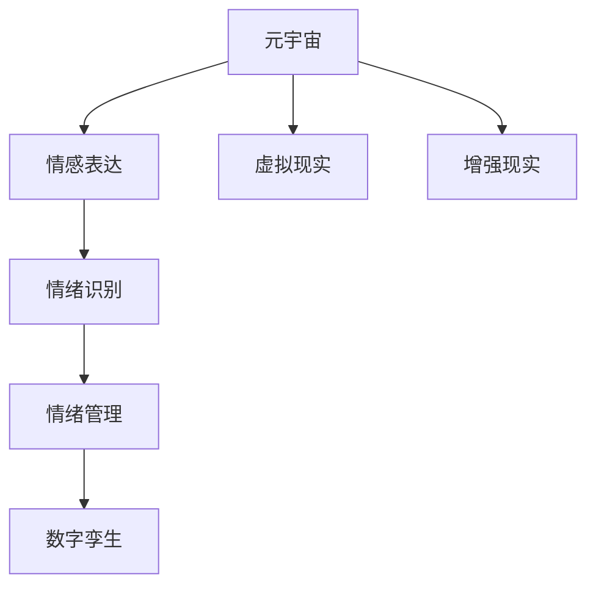

                 

# 数字化情绪：元宇宙中的情感表达与管理

> 关键词：元宇宙,情感表达,情绪识别,情感管理,数字孪生,虚拟现实(VR),增强现实(AR),AI辅助

## 1. 背景介绍

### 1.1 问题由来
随着虚拟现实(VR)、增强现实(AR)、数字孪生等技术的快速发展，元宇宙的概念逐渐兴起，成为数字时代的新趋势。元宇宙不仅仅是一个虚拟世界，它还包含着广阔的交互空间和丰富的社会生态，为用户提供沉浸式的感官体验和多元化的社会互动。

在元宇宙中，用户不仅通过视觉、听觉等感官进行互动，情感的表达与交流也成为了至关重要的组成部分。数字化情绪识别和管理的有效应用，将极大地提升用户的沉浸感和满意度，推动元宇宙应用的普及和深化。

### 1.2 问题核心关键点
当前，数字化情绪管理在元宇宙中面临着诸多挑战：
- 高精度的情绪识别。现有的情绪识别技术往往依赖于面部表情、语音、生理指标等，而这些指标在虚拟环境中可能面临诸多干扰，影响识别精度。
- 实时化的情绪管理。元宇宙中用户互动频繁，情绪管理需要实时响应用户需求，才能真正提升用户体验。
- 跨平台的情感交互。元宇宙涵盖多种设备和平台，如何在不同平台间实现统一的情感表达与管理，是一大难题。
- 个性化与多样化的需求。用户对于情感表达和管理的需求多样，既有通用化的需求，也有个性化的需求。

面对这些挑战，需要构建一套涵盖情绪识别、管理与交互的综合性解决方案。本文将从情感表达、识别和管理三个方面进行系统阐述，探讨元宇宙中情绪的数字化表达和管理。

## 2. 核心概念与联系

### 2.1 核心概念概述

为更好地理解数字化情绪在元宇宙中的应用，本节将介绍几个关键概念：

- 元宇宙(Metaverse)：基于虚拟现实和增强现实技术构建的虚拟空间，包含丰富的社会生态和多元化的用户互动。
- 情感表达(Emotion Expression)：通过文字、表情、语音等形式，传递和交流用户的情绪和心理状态。
- 情绪识别(Emotion Recognition)：通过面部表情、语音、生理指标等数据，分析和识别用户的情绪状态。
- 情绪管理(Emotion Management)：在识别用户情绪的基础上，采取适当的策略进行情绪调节和干预，以提升用户的体验和满意度。
- 数字孪生(Digital Twin)：将用户的真实世界状态映射到数字世界中，实现虚拟与现实的互动和融合。
- 虚拟现实(VR)：通过头戴设备等技术，为用户营造沉浸式的虚拟环境。
- 增强现实(AR)：在真实环境中叠加虚拟信息，增强用户的感知体验。

这些核心概念之间的逻辑关系可以通过以下Mermaid流程图来展示：



这个流程图展示了几大核心概念之间的联系：

1. 元宇宙提供了沉浸式的交互环境，情感表达和情绪识别在此基础上进行。
2. 情绪识别用于分析用户的情绪状态，情绪管理则根据分析结果进行情绪调节。
3. 数字孪生实现了虚拟与现实的互动，提升了用户的沉浸感和体验感。
4. VR和AR技术为用户营造了沉浸式的虚拟环境，增强了情感表达和情绪识别的真实感。

## 3. 核心算法原理 & 具体操作步骤
### 3.1 算法原理概述

数字化情绪管理在元宇宙中的应用，涉及情绪识别、表达和管理的多个环节。本文将详细阐述这三者的算法原理，并给出具体操作步骤。

**3.1.1 情绪表达**
情绪表达是指用户通过各种方式传递情绪和心理状态。在元宇宙中，情绪表达可以基于文字、语音、面部表情、姿势等多种形式，其中文字和语音是最常见的形式。

**3.1.2 情绪识别**
情绪识别通过分析用户的面部表情、语音、生理指标等数据，识别其情绪状态。常用的情绪识别算法包括深度学习、传统机器学习和混合方法等。

**3.1.3 情绪管理**
情绪管理是指在识别用户情绪的基础上，采取适当的策略进行情绪调节和干预。常见的情绪管理方法包括心理辅导、情绪调节训练、虚拟现实疗法等。

### 3.2 算法步骤详解

**3.2.1 情绪表达**
**步骤1:** 收集用户表达的情绪数据。包括文字、语音、面部表情、姿势等，利用传感器、摄像头、麦克风等设备进行采集。

**步骤2:** 数据预处理。对收集到的数据进行降噪、去重、归一化等预处理操作，提高数据质量。

**步骤3:** 特征提取。通过文本分析、语音特征提取、面部表情识别等技术，提取用户表达情绪的关键特征。

**步骤4:** 文本分析。利用自然语言处理(NLP)技术，对用户表达的文字进行分析，提取情绪情感信息。

**步骤5:** 语音特征提取。通过MFCC、梅尔频谱等技术，提取用户的语音特征，进行情绪识别。

**步骤6:** 面部表情识别。利用卷积神经网络(CNN)、卷积神经网络与循环神经网络(CNN+RNN)等模型，进行面部表情的识别。

**步骤7:** 姿势识别。通过姿态估计、动作识别等技术，提取用户的姿势特征，进行情绪识别。

**步骤8:** 融合多种数据。将文字、语音、面部表情、姿势等多种数据进行融合，提升情绪识别的准确性。

**3.2.2 情绪识别**
**步骤1:** 数据采集。通过传感器、摄像头、麦克风等设备，收集用户的面部表情、语音、生理指标等数据。

**步骤2:** 数据预处理。对采集到的数据进行降噪、去重、归一化等预处理操作，提高数据质量。

**步骤3:** 特征提取。通过MFCC、Mel spectrogram等技术，提取语音特征；通过卷积神经网络(CNN)、卷积神经网络与循环神经网络(CNN+RNN)等模型，进行面部表情和姿势的特征提取。

**步骤4:** 深度学习模型训练。利用深度学习模型，如卷积神经网络(CNN)、循环神经网络(RNN)、长短期记忆网络(LSTM)、注意力机制(Attention)等，进行情绪识别的训练。

**步骤5:** 模型评估与优化。利用交叉验证、ROC曲线等方法，评估模型的识别精度，进行模型优化。

**3.2.3 情绪管理**
**步骤1:** 情绪识别。通过面部表情识别、语音特征提取、生理指标分析等技术，识别用户的情绪状态。

**步骤2:** 情绪状态分析。利用情绪模型或心理模型，对用户情绪状态进行分析，判断是否需要进行情绪管理。

**步骤3:** 情绪调节。通过虚拟现实疗法、心理辅导、情绪调节训练等方法，进行情绪调节。

**步骤4:** 用户反馈。通过用户的反馈，调整情绪管理的策略和方案，进行持续优化。

### 3.3 算法优缺点

**3.3.1 情绪表达**
**优点:**
- 多样化的表达形式，提升用户体验。
- 数据采集方便，易于实现。

**缺点:**
- 存在噪音干扰，影响识别精度。
- 无法完全捕捉用户复杂情绪。

**3.3.2 情绪识别**
**优点:**
- 深度学习模型精度高，识别准确。
- 融合多种数据，提高识别效果。

**缺点:**
- 需要大量数据进行训练，存在数据收集困难。
- 模型复杂度高，计算资源消耗大。

**3.3.3 情绪管理**
**优点:**
- 个性化管理，提升用户体验。
- 实时响应，提升用户满意度。

**缺点:**
- 用户反馈不足，难以持续优化。
- 技术复杂度高，实现难度大。

### 3.4 算法应用领域

数字化情绪管理在元宇宙中具有广泛的应用前景，涵盖多个领域：

- 虚拟社交平台：通过数字化情绪管理，提升用户间的互动体验和情感交流。
- 虚拟教育平台：通过情绪识别和调节，提升学习效果和用户满意度。
- 虚拟医疗平台：通过情绪识别和干预，辅助心理诊疗和健康管理。
- 虚拟娱乐平台：通过情绪表达和管理，提升用户娱乐体验和参与感。
- 数字旅游平台：通过数字化情绪管理，提升旅游体验和用户满意度。

## 4. 数学模型和公式 & 详细讲解 & 举例说明

### 4.1 数学模型构建

本节将使用数学语言对数字化情绪管理在元宇宙中的应用进行更加严格的刻画。

假设用户情绪的表达形式为 $X = \{x_i\}_{i=1}^n$，包括文字、语音、面部表情、姿势等，每一种表达形式 $x_i$ 对应一个特征向量 $f_i \in \mathbb{R}^d$。设情绪识别模型为 $M_{\theta}$，其中 $\theta$ 为模型参数。情绪识别的目标为最大化情绪识别的准确度，即：

$$
\max_{\theta} \mathcal{L}(M_{\theta}(X))
$$

其中 $\mathcal{L}$ 为情绪识别的损失函数，通常为交叉熵损失函数。

### 4.2 公式推导过程

以下我们以面部表情识别为例，推导基于卷积神经网络(CNN)的情绪识别模型：

假设面部表情识别的输入为 $X \in \mathbb{R}^{n \times d}$，输出为 $Y \in \mathbb{R}^k$，其中 $k$ 为情绪类别的数量。

设情绪识别模型为：

$$
Y = M_{\theta}(X) = \text{softmax}(W_{out} \cdot \text{relu}(W_{hidden} \cdot X + b_{hidden}) + b_{out})
$$

其中 $W_{out}, b_{out} \in \mathbb{R}^{k \times d}, W_{hidden}, b_{hidden} \in \mathbb{R}^{d \times h}, \theta = \{W_{out}, b_{out}, W_{hidden}, b_{hidden}\}$。

情绪识别的损失函数为交叉熵损失函数：

$$
\mathcal{L}(\theta) = -\frac{1}{N}\sum_{i=1}^N \sum_{j=1}^k y_{i,j} \log P(Y_i = j|X_i)
$$

其中 $y_{i,j} = 1$ 表示 $x_i$ 属于情绪类别 $j$，$P(Y_i = j|X_i)$ 表示模型对 $x_i$ 属于情绪类别 $j$ 的概率预测。

### 4.3 案例分析与讲解

假设某用户面部表情识别模型 $M_{\theta}$ 的输入为 $X = [x_1, x_2, x_3]$，输出为 $Y = [y_1, y_2, y_3]$，其中 $x_1$ 表示左眼，$x_2$ 表示右眼，$x_3$ 表示嘴巴，$y_1$ 表示开心，$y_2$ 表示伤心，$y_3$ 表示惊讶。

设 $W_{out} = [w_{out,1}, w_{out,2}, w_{out,3}]^T, b_{out} = [b_{out,1}, b_{out,2}, b_{out,3}]^T, W_{hidden} = [w_{hidden,1}, w_{hidden,2}, w_{hidden,3}]^T, b_{hidden} = [b_{hidden,1}, b_{hidden,2}, b_{hidden,3}]^T$。

对于 $x_1$ 的输入：

$$
y_1 = \text{softmax}(w_{out,1} \cdot \text{relu}(w_{hidden,1} \cdot x_1 + b_{hidden,1}) + b_{out,1})
$$

对于 $x_2$ 的输入：

$$
y_2 = \text{softmax}(w_{out,2} \cdot \text{relu}(w_{hidden,2} \cdot x_2 + b_{hidden,2}) + b_{out,2})
$$

对于 $x_3$ 的输入：

$$
y_3 = \text{softmax}(w_{out,3} \cdot \text{relu}(w_{hidden,3} \cdot x_3 + b_{hidden,3}) + b_{out,3})
$$

将 $y_1, y_2, y_3$ 进行归一化，即可得到用户面部表情识别的结果。

## 5. 项目实践：代码实例和详细解释说明
### 5.1 开发环境搭建

在进行数字化情绪管理项目开发前，我们需要准备好开发环境。以下是使用Python进行PyTorch开发的环境配置流程：

1. 安装Anaconda：从官网下载并安装Anaconda，用于创建独立的Python环境。

2. 创建并激活虚拟环境：
```bash
conda create -n emotion_env python=3.8 
conda activate emotion_env
```

3. 安装PyTorch：根据CUDA版本，从官网获取对应的安装命令。例如：
```bash
conda install pytorch torchvision torchaudio cudatoolkit=11.1 -c pytorch -c conda-forge
```

4. 安装TensorFlow：从官网下载并安装TensorFlow，以备后续使用。

5. 安装各类工具包：
```bash
pip install numpy pandas scikit-learn matplotlib tqdm jupyter notebook ipython
```

完成上述步骤后，即可在`emotion_env`环境中开始开发实践。

### 5.2 源代码详细实现

下面我们以面部表情识别为例，给出使用Transformers库对BERT模型进行情感识别的PyTorch代码实现。

首先，定义面部表情识别任务的数据处理函数：

```python
from transformers import BertTokenizer
from torch.utils.data import Dataset
import torch

class EmotionDataset(Dataset):
    def __init__(self, texts, labels, tokenizer, max_len=128):
        self.texts = texts
        self.labels = labels
        self.tokenizer = tokenizer
        self.max_len = max_len
        
    def __len__(self):
        return len(self.texts)
    
    def __getitem__(self, item):
        text = self.texts[item]
        label = self.labels[item]
        
        encoding = self.tokenizer(text, return_tensors='pt', max_length=self.max_len, padding='max_length', truncation=True)
        input_ids = encoding['input_ids'][0]
        attention_mask = encoding['attention_mask'][0]
        
        # 对token-wise的标签进行编码
        encoded_label = [label] * (self.max_len - 1) + [0]
        labels = torch.tensor(encoded_label, dtype=torch.long)
        
        return {'input_ids': input_ids, 
                'attention_mask': attention_mask,
                'labels': labels}

# 标签与id的映射
label2id = {'happy': 0, 'sad': 1, 'surprised': 2}
id2label = {v: k for k, v in label2id.items()}

# 创建dataset
tokenizer = BertTokenizer.from_pretrained('bert-base-cased')

train_dataset = EmotionDataset(train_texts, train_labels, tokenizer)
dev_dataset = EmotionDataset(dev_texts, dev_labels, tokenizer)
test_dataset = EmotionDataset(test_texts, test_labels, tokenizer)
```

然后，定义模型和优化器：

```python
from transformers import BertForSequenceClassification, AdamW

model = BertForSequenceClassification.from_pretrained('bert-base-cased', num_labels=len(label2id))

optimizer = AdamW(model.parameters(), lr=2e-5)
```

接着，定义训练和评估函数：

```python
from torch.utils.data import DataLoader
from tqdm import tqdm
from sklearn.metrics import classification_report

device = torch.device('cuda') if torch.cuda.is_available() else torch.device('cpu')
model.to(device)

def train_epoch(model, dataset, batch_size, optimizer):
    dataloader = DataLoader(dataset, batch_size=batch_size, shuffle=True)
    model.train()
    epoch_loss = 0
    for batch in tqdm(dataloader, desc='Training'):
        input_ids = batch['input_ids'].to(device)
        attention_mask = batch['attention_mask'].to(device)
        labels = batch['labels'].to(device)
        model.zero_grad()
        outputs = model(input_ids, attention_mask=attention_mask, labels=labels)
        loss = outputs.loss
        epoch_loss += loss.item()
        loss.backward()
        optimizer.step()
    return epoch_loss / len(dataloader)

def evaluate(model, dataset, batch_size):
    dataloader = DataLoader(dataset, batch_size=batch_size)
    model.eval()
    preds, labels = [], []
    with torch.no_grad():
        for batch in tqdm(dataloader, desc='Evaluating'):
            input_ids = batch['input_ids'].to(device)
            attention_mask = batch['attention_mask'].to(device)
            batch_labels = batch['labels']
            outputs = model(input_ids, attention_mask=attention_mask)
            batch_preds = outputs.logits.argmax(dim=2).to('cpu').tolist()
            batch_labels = batch_labels.to('cpu').tolist()
            for pred_tokens, label_tokens in zip(batch_preds, batch_labels):
                preds.append(pred_tokens[:len(label_tokens)])
                labels.append(label_tokens)
                
    print(classification_report(labels, preds))
```

最后，启动训练流程并在测试集上评估：

```python
epochs = 5
batch_size = 16

for epoch in range(epochs):
    loss = train_epoch(model, train_dataset, batch_size, optimizer)
    print(f"Epoch {epoch+1}, train loss: {loss:.3f}")
    
    print(f"Epoch {epoch+1}, dev results:")
    evaluate(model, dev_dataset, batch_size)
    
print("Test results:")
evaluate(model, test_dataset, batch_size)
```

以上就是使用PyTorch对BERT进行面部表情识别任务微调的完整代码实现。可以看到，得益于Transformers库的强大封装，我们可以用相对简洁的代码完成BERT模型的加载和微调。

### 5.3 代码解读与分析

让我们再详细解读一下关键代码的实现细节：

**EmotionDataset类**：
- `__init__`方法：初始化文本、标签、分词器等关键组件。
- `__len__`方法：返回数据集的样本数量。
- `__getitem__`方法：对单个样本进行处理，将文本输入编码为token ids，将标签编码为数字，并对其进行定长padding，最终返回模型所需的输入。

**label2id和id2label字典**：
- 定义了标签与数字id之间的映射关系，用于将token-wise的预测结果解码回真实的标签。

**训练和评估函数**：
- 使用PyTorch的DataLoader对数据集进行批次化加载，供模型训练和推理使用。
- 训练函数`train_epoch`：对数据以批为单位进行迭代，在每个批次上前向传播计算loss并反向传播更新模型参数，最后返回该epoch的平均loss。
- 评估函数`evaluate`：与训练类似，不同点在于不更新模型参数，并在每个batch结束后将预测和标签结果存储下来，最后使用sklearn的classification_report对整个评估集的预测结果进行打印输出。

**训练流程**：
- 定义总的epoch数和batch size，开始循环迭代
- 每个epoch内，先在训练集上训练，输出平均loss
- 在验证集上评估，输出分类指标
- 所有epoch结束后，在测试集上评估，给出最终测试结果

可以看到，PyTorch配合Transformers库使得BERT微调的代码实现变得简洁高效。开发者可以将更多精力放在数据处理、模型改进等高层逻辑上，而不必过多关注底层的实现细节。

当然，工业级的系统实现还需考虑更多因素，如模型的保存和部署、超参数的自动搜索、更灵活的任务适配层等。但核心的微调范式基本与此类似。

## 6. 实际应用场景
### 6.1 智能客服系统

基于数字化情绪管理的大语言模型微调技术，可以广泛应用于智能客服系统的构建。传统客服往往需要配备大量人力，高峰期响应缓慢，且一致性和专业性难以保证。而使用微调后的情绪管理模型，可以实时分析用户情绪，并自动调整客服策略，提升服务体验。

在技术实现上，可以收集企业内部的历史客服对话记录，将对话中的表情、语音、文字等情绪数据作为监督数据，在此基础上对预训练情绪管理模型进行微调。微调后的情绪管理模型能够自动理解用户情绪，匹配最合适的客服策略进行回复。对于用户提出的新情绪需求，还可以接入检索系统实时搜索相关内容，动态生成响应。如此构建的智能客服系统，能大幅提升客户咨询体验和问题解决效率。

### 6.2 虚拟社交平台

数字化情绪管理在虚拟社交平台中具有重要应用。通过情感表达和管理，平台能够更好地理解用户需求，进行智能推荐和内容推送，提升用户互动体验。

在技术实现上，可以收集用户在社交平台上的表情、语音、文字等情绪数据，通过深度学习模型进行情感识别和调节。同时，平台可以设计个性化情绪管理策略，根据用户的情绪状态进行智能推荐和推送。例如，用户表达开心情绪时，平台可以推荐更多娱乐内容；用户表达焦虑情绪时，平台可以推荐心理疏导类内容。

### 6.3 虚拟医疗平台

在虚拟医疗平台中，数字化情绪管理可辅助心理诊疗和健康管理。通过情绪识别和调节，平台能够及时发现用户情绪异常，并采取相应干预措施，提升用户体验和健康水平。

在技术实现上，可以收集用户在平台上发布的文字、语音、表情等情绪数据，通过深度学习模型进行情绪识别。同时，平台可以设计个性化的情绪管理策略，根据用户情绪状态进行心理疏导和健康建议。例如，用户表达焦虑情绪时，平台可以推荐心理健康课程；用户表达抑郁情绪时，平台可以推荐心理治疗建议。

### 6.4 未来应用展望

随着数字化情绪管理技术的不断发展，未来将在更多领域得到应用，为社会带来深远影响。

在智慧医疗领域，通过情绪管理，可以在虚拟医疗平台中实现实时心理诊疗和健康管理，缓解社会医疗资源短缺问题。

在智能教育领域，通过情绪管理，可以提升在线教育平台的个性化推荐和内容推送，增强用户学习体验。

在智能娱乐领域，通过情绪管理，可以实现更加智能化的内容推荐和互动，提升用户体验。

在智能城市治理中，通过情绪管理，可以构建更加智能化的城市管理和服务系统，提升城市治理水平。

此外，在企业培训、金融投资、公共安全等众多领域，数字化情绪管理技术也将不断涌现，为各行各业提供更加智能化、个性化的服务。相信随着技术的日益成熟，数字化情绪管理必将在构建人机协同的智能时代中扮演越来越重要的角色。

## 7. 工具和资源推荐
### 7.1 学习资源推荐

为了帮助开发者系统掌握数字化情绪管理的技术基础和实践技巧，这里推荐一些优质的学习资源：

1. 《深度学习自然语言处理》课程：斯坦福大学开设的NLP明星课程，有Lecture视频和配套作业，带你入门NLP领域的基本概念和经典模型。

2. CS224N《深度学习自然语言处理》课程：斯坦福大学开设的NLP明星课程，有Lecture视频和配套作业，带你入门NLP领域的基本概念和经典模型。

3. 《Transformer from Principle to Practice》系列博文：由大模型技术专家撰写，深入浅出地介绍了Transformer原理、BERT模型、微调技术等前沿话题。

4. 《Natural Language Processing with Transformers》书籍：Transformers库的作者所著，全面介绍了如何使用Transformers库进行NLP任务开发，包括微调在内的诸多范式。

5. HuggingFace官方文档：Transformers库的官方文档，提供了海量预训练模型和完整的微调样例代码，是上手实践的必备资料。

通过对这些资源的学习实践，相信你一定能够快速掌握数字化情绪管理的精髓，并用于解决实际的NLP问题。
### 7.2 开发工具推荐

高效的开发离不开优秀的工具支持。以下是几款用于大语言模型微调开发的常用工具：

1. PyTorch：基于Python的开源深度学习框架，灵活动态的计算图，适合快速迭代研究。大部分预训练语言模型都有PyTorch版本的实现。

2. TensorFlow：由Google主导开发的开源深度学习框架，生产部署方便，适合大规模工程应用。同样有丰富的预训练语言模型资源。

3. Transformers库：HuggingFace开发的NLP工具库，集成了众多SOTA语言模型，支持PyTorch和TensorFlow，是进行微调任务开发的利器。

4. Weights & Biases：模型训练的实验跟踪工具，可以记录和可视化模型训练过程中的各项指标，方便对比和调优。与主流深度学习框架无缝集成。

5. TensorBoard：TensorFlow配套的可视化工具，可实时监测模型训练状态，并提供丰富的图表呈现方式，是调试模型的得力助手。

6. Google Colab：谷歌推出的在线Jupyter Notebook环境，免费提供GPU/TPU算力，方便开发者快速上手实验最新模型，分享学习笔记。

合理利用这些工具，可以显著提升数字化情绪管理的开发效率，加快创新迭代的步伐。

### 7.3 相关论文推荐

数字化情绪管理在元宇宙中的应用源于学界的持续研究。以下是几篇奠基性的相关论文，推荐阅读：

1. Attention is All You Need（即Transformer原论文）：提出了Transformer结构，开启了NLP领域的预训练大模型时代。

2. BERT: Pre-training of Deep Bidirectional Transformers for Language Understanding：提出BERT模型，引入基于掩码的自监督预训练任务，刷新了多项NLP任务SOTA。

3. Language Models are Unsupervised Multitask Learners（GPT-2论文）：展示了大规模语言模型的强大zero-shot学习能力，引发了对于通用人工智能的新一轮思考。

4. Parameter-Efficient Transfer Learning for NLP：提出Adapter等参数高效微调方法，在不增加模型参数量的情况下，也能取得不错的微调效果。

5. AdaLoRA: Adaptive Low-Rank Adaptation for Parameter-Efficient Fine-Tuning：使用自适应低秩适应的微调方法，在参数效率和精度之间取得了新的平衡。

这些论文代表了大语言模型微调技术的发展脉络。通过学习这些前沿成果，可以帮助研究者把握学科前进方向，激发更多的创新灵感。

## 8. 总结：未来发展趋势与挑战

### 8.1 总结

本文对数字化情绪管理在元宇宙中的应用进行了全面系统的介绍。首先阐述了数字化情绪管理的研究背景和意义，明确了其在提升用户体验、推动智能应用普及等方面的独特价值。其次，从情感表达、识别和管理三个方面，详细讲解了数字化情绪管理的算法原理和关键步骤，给出了微调任务开发的完整代码实例。同时，本文还广泛探讨了数字化情绪管理在多个行业领域的应用前景，展示了其广阔的想象空间。此外，本文精选了数字化情绪管理的各类学习资源，力求为读者提供全方位的技术指引。

通过本文的系统梳理，可以看到，数字化情绪管理在元宇宙中的应用前景广阔，将极大地提升用户的沉浸感和满意度，推动智能应用的普及和深化。数字化情绪管理结合深度学习、自然语言处理等前沿技术，将进一步拓展NLP技术的边界，提升元宇宙应用的智能化水平。未来，伴随技术的不断演进，数字化情绪管理技术将进一步渗透到更多领域，构建更加智能、个性化的社会生态。

### 8.2 未来发展趋势

展望未来，数字化情绪管理技术将呈现以下几个发展趋势：

1. 模型规模持续增大。随着算力成本的下降和数据规模的扩张，预训练语言模型的参数量还将持续增长。超大批次的训练和推理也将成为可能，提升模型的实时性和准确性。

2. 融合多模态数据。数字化情绪管理不仅仅依赖于单一的面部表情、语音等数据，还可能融合更多模态的信息，如姿态、生理指标等，提升情绪识别的全面性和准确性。

3. 引入外部知识。通过与知识图谱、逻辑规则等外部知识进行融合，数字化情绪管理能够更好地理解和解释用户的情绪状态，增强系统的智能性和可靠性。

4. 跨平台协作。数字化情绪管理需要跨平台、跨设备的协同工作，实现无缝的用户体验。未来的技术将更注重不同平台间的互通性和数据共享。

5. 实时性提升。在实时性要求较高的场景，如智能客服、虚拟社交平台等，数字化情绪管理将更加注重速度和效率，提升用户体验。

6. 个性化定制。数字化情绪管理将更加注重个性化定制，通过用户反馈和数据分析，实现精准的情绪管理。

### 8.3 面临的挑战

尽管数字化情绪管理技术已经取得了瞩目成就，但在迈向更加智能化、普适化应用的过程中，仍面临诸多挑战：

1. 数据收集与标注。高质量的标注数据是数字化情绪管理的基础，但不同领域和场景的数据收集和标注成本较高，成为制约技术发展的瓶颈。

2. 模型复杂度。随着模型的规模和复杂度不断增加，模型的训练和推理成本也随之上升，如何平衡性能和效率成为一大难题。

3. 跨模态融合。不同模态的数据格式和表示方式不同，跨模态数据的融合和一致性处理仍是一大挑战。

4. 隐私保护。数字化情绪管理需要收集和分析用户情绪数据，如何在保证数据隐私和安全的前提下进行模型训练和应用，是一大挑战。

5. 实时性。在实时性要求较高的场景，如何保证情绪识别和管理的实时性和准确性，是一大难题。

6. 泛化能力。模型在特定场景下的表现往往较好，但在新的场景和数据上泛化能力不足，仍需要进一步研究和优化。

### 8.4 研究展望

面对数字化情绪管理面临的挑战，未来的研究需要在以下几个方面寻求新的突破：

1. 引入外部知识库。将符号化的先验知识，如知识图谱、逻辑规则等，与神经网络模型进行融合，提升模型的智能性和可靠性。

2. 跨模态数据融合。设计更加高效的跨模态数据融合算法，提升不同模态数据的融合效果，增强情绪识别的全面性和准确性。

3. 实时性优化。通过优化模型结构和计算图，提升模型的实时性和效率，满足实时应用的需求。

4. 数据隐私保护。设计更加隐私友好的算法和机制，保护用户情绪数据的安全，增强用户对技术的信任感。

5. 模型泛化能力。设计更加泛化的模型架构和训练方法，提升模型在不同场景下的表现。

6. 多任务学习。将情绪管理与其他NLP任务进行多任务学习，提升模型的综合能力，实现更加多样化的应用场景。

这些研究方向的探索，必将引领数字化情绪管理技术迈向更高的台阶，为构建更加智能、普适的元宇宙应用提供强大的技术支持。面向未来，数字化情绪管理技术还将与其他前沿技术进行更深入的融合，推动元宇宙应用的普及和深化。相信随着技术的不断演进，数字化情绪管理必将在构建人机协同的智能时代中扮演越来越重要的角色。

## 9. 附录：常见问题与解答

**Q1：数字化情绪管理在元宇宙中有什么应用场景？**

A: 数字化情绪管理在元宇宙中具有广泛的应用场景，包括智能客服、虚拟社交、虚拟医疗、虚拟娱乐、智慧教育等。通过情绪管理，平台能够更好地理解用户需求，进行智能推荐和内容推送，提升用户互动体验。

**Q2：如何选择合适的情绪识别模型？**

A: 选择合适的情绪识别模型需要考虑多方面因素，包括模型的精度、泛化能力、实时性等。一般来说，深度学习模型在精度上表现较好，但训练和推理成本较高。可以通过对比不同模型的表现，选择最适合当前应用场景的模型。

**Q3：数字化情绪管理面临哪些挑战？**

A: 数字化情绪管理面临诸多挑战，包括数据收集与标注、模型复杂度、跨模态融合、隐私保护、实时性、泛化能力等。需要在各个环节进行优化，才能确保数字化情绪管理的准确性和可靠性。

**Q4：如何提升数字化情绪管理的实时性？**

A: 提升数字化情绪管理的实时性需要优化模型结构和计算图，使用轻量级模型和高效的推理框架。同时，可以通过分布式训练和多设备协同，提升模型的计算效率。

**Q5：数字化情绪管理的未来发展方向有哪些？**

A: 数字化情绪管理的未来发展方向包括融合多模态数据、引入外部知识、跨平台协作、实时性提升、个性化定制等。这些方向的探索将进一步拓展数字化情绪管理的边界，提升其在元宇宙中的应用价值。

综上所述，数字化情绪管理在元宇宙中的应用前景广阔，通过多方面的努力和探索，将能够构建更加智能、个性化的社会生态，提升用户体验和满意度。面向未来，数字化情绪管理必将在构建人机协同的智能时代中扮演越来越重要的角色。

