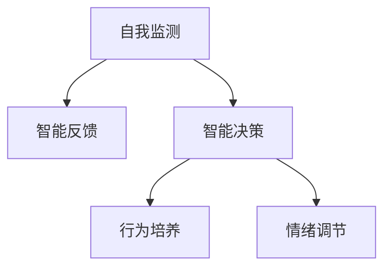
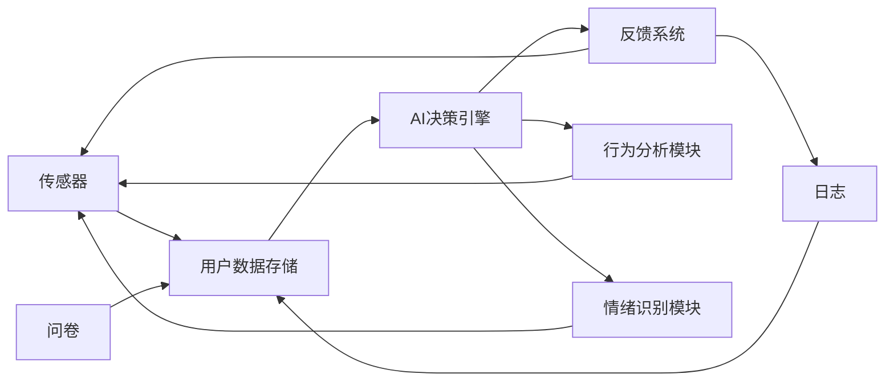

                 

# 数字化意志力：AI增强的自我控制

> 关键词：数字化意志力, AI增强, 自我控制, 智能决策, 人工智能, 心理模型, 应用场景, 系统架构, 算法原理, 研究现状, 未来展望

## 1. 背景介绍

### 1.1 问题由来

在数字化和智能化的时代，我们面临着前所未有的信息过载和决策复杂性。如何在海量信息和复杂任务中保持高效、理性、自控的决策能力，已成为现代社会的重要挑战。心理学和行为学的研究显示，人类的自我控制能力是有极限的，当信息过多或任务过难时，自控能力会明显下降，导致拖延、焦虑、错误决策等负面行为。

人工智能技术的快速发展，为增强人类的自我控制能力提供了新的可能性。通过将AI技术应用于自我控制和智能决策，我们有可能构建一个更加强大、高效、自控的数字化意志力系统，帮助我们在面对复杂任务时，保持冷静、理性、有目的地行动。

### 1.2 问题核心关键点

数字化意志力系统通过AI技术增强自我控制能力，其核心思想是：

- **自我监测与反馈**：利用AI技术实时监测用户的注意力、情绪、行为等关键指标，及时给出反馈，帮助用户了解自身状态，调整行为。
- **智能决策支持**：基于用户的历史行为和外界环境，利用AI模型提供决策建议，辅助用户做出更好的选择。
- **行为习惯培养**：通过AI技术进行行为数据统计和分析，找出最佳习惯路径，引导用户形成良好行为习惯。
- **情绪调节与压力管理**：利用AI技术识别情绪波动，提供情绪调节策略，帮助用户缓解压力。

这些核心能力共同构成了一个数字化意志力系统的基本框架，其目标是在复杂任务和信息过载的环境中，帮助用户保持高效、理性和自控的决策和行动。

### 1.3 问题研究意义

研究数字化意志力系统，对于提升人类在数字化环境中的自我控制能力，改善心理健康，提高工作效率，具有重要意义：

1. **提升自我控制能力**：通过实时监测和智能反馈，帮助用户识别并改善自控行为的薄弱环节，形成更强的自我控制力。
2. **改善心理健康**：通过情绪识别和调节，帮助用户缓解压力，提高心理健康水平，减少心理疾病的发生。
3. **提高工作效率**：通过智能决策支持，帮助用户更高效地完成复杂任务，提升工作质量。
4. **促进终身学习**：通过行为习惯的培养和优化，帮助用户形成良好的学习习惯，持续提升自我能力。
5. **增强决策科学性**：通过数据驱动的智能决策，减少决策偏差，提升决策的科学性和合理性。

## 2. 核心概念与联系

### 2.1 核心概念概述

数字化意志力系统的构建，涉及多个核心概念：

- **自我监测**：通过各种传感器、日志、问卷等方式，实时收集用户的注意力、情绪、行为等数据，了解用户当前状态。
- **智能反馈**：基于自我监测的数据，利用AI技术分析用户的自我控制状态，提供实时反馈和建议。
- **智能决策**：通过AI模型对用户行为和环境数据进行分析，提供决策建议，辅助用户选择最优方案。
- **行为培养**：利用AI技术统计和分析用户行为数据，找出最佳习惯路径，引导用户形成良好行为习惯。
- **情绪调节**：通过AI技术识别情绪波动，提供情绪调节策略，帮助用户缓解压力。

这些概念之间的逻辑关系可以通过以下Mermaid流程图来展示：



### 2.2 核心概念原理和架构的 Mermaid 流程图

在具体实现中，数字化意志力系统的架构可以如下展示：



该架构展示了从数据收集到行为反馈的整个流程，其中传感器、日志和问卷用于收集用户数据，AI决策引擎基于这些数据进行智能决策，反馈系统提供实时反馈，行为分析模块和情绪识别模块分别对行为和情绪进行深度分析。

## 3. 核心算法原理 & 具体操作步骤

### 3.1 算法原理概述

数字化意志力系统基于自控理论和AI技术，构建了一个动态反馈的自我控制闭环。其核心算法原理包括以下几个方面：

1. **自控模型构建**：基于心理学和行为学的研究成果，构建自控模型，描述用户行为和状态之间的关系。
2. **实时监测与反馈**：利用传感器、日志、问卷等手段，实时监测用户的行为和状态数据，提供实时的反馈和建议。
3. **智能决策支持**：通过AI模型对用户行为和环境数据进行分析，提供决策建议，辅助用户做出最优选择。
4. **行为数据分析**：利用AI技术对用户行为数据进行统计和分析，找出最佳习惯路径，引导用户形成良好行为习惯。
5. **情绪识别与调节**：利用AI技术识别用户的情绪波动，提供情绪调节策略，帮助用户缓解压力。

### 3.2 算法步骤详解

数字化意志力系统的开发一般包括以下几个关键步骤：

**Step 1: 数据收集与预处理**
- 选择合适的传感器和日志工具，收集用户的注意力、情绪、行为等关键指标。
- 对收集到的数据进行预处理，包括清洗、去噪、标准化等操作。

**Step 2: 自控模型训练**
- 基于心理学和行为学的研究成果，设计自控模型。
- 使用收集到的用户数据对模型进行训练，调整模型参数，使其能够准确描述用户行为和状态之间的关系。

**Step 3: AI决策引擎设计**
- 选择合适的AI模型（如深度学习、强化学习等）构建决策引擎。
- 将自控模型和环境数据作为输入，设计决策引擎的输出逻辑，生成决策建议。

**Step 4: 反馈系统实现**
- 设计反馈系统，将AI决策引擎的输出转化为可视化的反馈信息。
- 实时监测用户行为和状态数据，及时调整反馈信息。

**Step 5: 行为分析与习惯培养**
- 利用AI技术对用户行为数据进行统计和分析，找出最佳习惯路径。
- 提供行为指导和习惯培养计划，引导用户形成良好行为习惯。

**Step 6: 情绪识别与调节**
- 使用AI技术识别用户的情绪波动，提供情绪调节策略。
- 实时监测用户的情绪状态，及时调整情绪调节策略。

**Step 7: 系统集成与部署**
- 将上述各个模块进行集成，构建完整的数字化意志力系统。
- 将系统部署到用户设备或服务端，提供实际应用。

### 3.3 算法优缺点

数字化意志力系统具有以下优点：
1. **实时性高**：通过实时监测和反馈，及时调整用户行为，提升自我控制效果。
2. **智能决策**：基于AI模型，提供科学的决策建议，减少决策偏差。
3. **个性化定制**：根据用户行为和情绪数据，提供个性化的行为指导和情绪调节策略。
4. **数据驱动**：依赖于大量的数据和AI技术，提升系统的科学性和有效性。

同时，该系统也存在以下局限性：
1. **数据隐私问题**：用户数据的收集和存储需要遵守隐私保护政策，确保数据安全。
2. **模型复杂性**：自控模型的设计和AI决策引擎的实现较为复杂，需要专业知识和技术支持。
3. **用户接受度**：系统需要用户主动配合使用，可能存在用户接受度不高的问题。
4. **技术依赖性**：对传感器、日志、问卷等数据收集工具的依赖性较强，可能存在数据质量问题。

尽管存在这些局限性，但数字化意志力系统仍是大数据和人工智能在提升人类自我控制能力方面的一个重要探索方向。未来相关研究的重点在于如何进一步提高系统的准确性和可接受度，同时保障用户数据隐私。

### 3.4 算法应用领域

数字化意志力系统在多个领域都有广泛的应用前景：

- **教育与培训**：帮助学生提高自我控制能力，改善学习习惯，提升学习效果。
- **健康与医疗**：通过情绪调节和压力管理，帮助患者改善心理健康，提高生活质量。
- **工作效率**：通过智能决策和行为培养，提升员工工作效率，减少错误决策。
- **个人生活**：帮助用户形成健康的生活习惯，如戒烟、健身、睡眠等。
- **金融投资**：通过情绪调节和决策支持，提升投资决策的科学性和合理性。

这些应用场景展示了数字化意志力系统的广泛适用性，未来随着技术的进一步发展，其应用范围将进一步拓展。

## 4. 数学模型和公式 & 详细讲解

### 4.1 数学模型构建

数字化意志力系统的数学模型主要由以下几部分构成：

1. **用户行为模型**：描述用户行为和状态之间的关系，通常使用时间序列模型或状态转移模型。
2. **自控模型**：描述用户的自控能力和外界环境之间的关系，通常使用心理模型或行为模型。
3. **AI决策模型**：基于用户行为和环境数据，提供决策建议，通常使用深度学习模型或强化学习模型。
4. **情绪识别模型**：识别用户的情绪状态，通常使用情感分析模型或表情识别模型。

### 4.2 公式推导过程

以下以用户行为模型为例，推导时间序列模型的构建和参数估计过程。

假设用户的行为 $X_t$ 受时间 $t$ 和自控能力 $C_t$ 的影响，可以表示为：

$$
X_t = f(X_{t-1}, C_t, \epsilon_t)
$$

其中 $f$ 为行为生成函数，$\epsilon_t$ 为随机误差项。

假设 $C_t$ 和 $X_t$ 之间存在线性关系：

$$
X_t = \alpha C_t + \beta + \epsilon_t
$$

其中 $\alpha$ 为自控能力的系数，$\beta$ 为常数项，$\epsilon_t$ 为随机误差。

通过最小化误差平方和，可以得到参数估计公式：

$$
\hat{\alpha}, \hat{\beta} = \arg\min_{\alpha, \beta} \sum_{t=1}^T (X_t - \alpha C_t - \beta)^2
$$

其中 $T$ 为数据总长度。

### 4.3 案例分析与讲解

**案例：工作习惯培养**

在实际应用中，数字化意志力系统可以对员工的工作习惯进行培养。首先，系统通过传感器和日志收集员工的工作数据，如工作时间、休息时间、任务完成情况等。然后，利用时间序列模型描述员工行为和自控能力之间的关系。假设员工在自控能力强时，会优先完成紧急任务，而在自控能力弱时，会优先处理简单任务。

系统可以设计如下行为生成函数：

$$
X_t = 
\begin{cases}
1 & \text{if } C_t \geq \theta \\
0 & \text{otherwise}
\end{cases}
$$

其中 $X_t$ 为是否完成紧急任务的二元变量，$C_t$ 为自控能力，$\theta$ 为自控能力阈值。

通过参数估计公式，系统可以拟合出 $\alpha$ 和 $\beta$ 的估计值，并根据员工的实际行为数据，实时调整自控能力阈值 $\theta$。系统还可以利用强化学习模型，根据员工的长期表现，提供行为指导和习惯培养计划，帮助员工形成高效的工作习惯。

## 5. 项目实践：代码实例和详细解释说明

### 5.1 开发环境搭建

在进行数字化意志力系统开发前，我们需要准备好开发环境。以下是使用Python进行开发的环境配置流程：

1. 安装Anaconda：从官网下载并安装Anaconda，用于创建独立的Python环境。

2. 创建并激活虚拟环境：
```bash
conda create -n behavioral-env python=3.8 
conda activate behavioral-env
```

3. 安装相关Python库：
```bash
pip install numpy pandas scikit-learn torch transformers
```

4. 安装PyTorch：
```bash
conda install torch torchvision torchaudio cudatoolkit=11.1 -c pytorch -c conda-forge
```

5. 安装TensorBoard：
```bash
pip install tensorboard
```

完成上述步骤后，即可在`behavioral-env`环境中开始开发。

### 5.2 源代码详细实现

下面我们以情绪识别与调节为例，给出使用TensorFlow和TensorBoard进行情绪识别模型的PyTorch代码实现。

首先，定义情绪识别模型：

```python
import torch
from torch import nn
from torch.nn import functional as F

class EmotionNet(nn.Module):
    def __init__(self, num_classes):
        super(EmotionNet, self).__init__()
        self.conv1 = nn.Conv2d(3, 64, kernel_size=3, stride=1, padding=1)
        self.conv2 = nn.Conv2d(64, 128, kernel_size=3, stride=1, padding=1)
        self.pool = nn.MaxPool2d(kernel_size=2, stride=2)
        self.fc1 = nn.Linear(128 * 224 * 224, 512)
        self.fc2 = nn.Linear(512, num_classes)
        self.dropout = nn.Dropout(0.5)
        
    def forward(self, x):
        x = self.pool(F.relu(self.conv1(x)))
        x = self.pool(F.relu(self.conv2(x)))
        x = x.view(-1, 128 * 224 * 224)
        x = F.relu(self.fc1(x))
        x = self.dropout(x)
        x = self.fc2(x)
        return F.softmax(x, dim=1)
```

然后，定义情绪识别数据集和数据加载器：

```python
from torchvision import datasets, transforms

transform = transforms.Compose([
    transforms.Resize(224),
    transforms.ToTensor(),
    transforms.Normalize([0.5, 0.5, 0.5], [0.5, 0.5, 0.5])
])

train_dataset = datasets.ImageFolder(root='train', transform=transform)
test_dataset = datasets.ImageFolder(root='test', transform=transform)

train_loader = torch.utils.data.DataLoader(train_dataset, batch_size=64, shuffle=True)
test_loader = torch.utils.data.DataLoader(test_dataset, batch_size=64, shuffle=False)
```

接着，定义训练和评估函数：

```python
from torch.utils.data import DataLoader
from tqdm import tqdm
from sklearn.metrics import accuracy_score

def train_epoch(model, optimizer, train_loader):
    model.train()
    total_loss = 0
    for batch in tqdm(train_loader):
        inputs, labels = batch
        optimizer.zero_grad()
        outputs = model(inputs)
        loss = F.cross_entropy(outputs, labels)
        total_loss += loss.item()
        loss.backward()
        optimizer.step()
    return total_loss / len(train_loader)

def evaluate(model, test_loader):
    model.eval()
    total_correct = 0
    with torch.no_grad():
        for batch in test_loader:
            inputs, labels = batch
            outputs = model(inputs)
            _, predicted = torch.max(outputs.data, 1)
            total_correct += (predicted == labels).sum().item()
    return total_correct / len(test_loader)

device = torch.device('cuda' if torch.cuda.is_available() else 'cpu')
model = EmotionNet(num_classes=7).to(device)
optimizer = torch.optim.Adam(model.parameters(), lr=0.001)

num_epochs = 10
for epoch in range(num_epochs):
    loss = train_epoch(model, optimizer, train_loader)
    acc = evaluate(model, test_loader)
    print(f'Epoch {epoch+1}, loss: {loss:.4f}, accuracy: {acc:.4f}')
```

最后，运行模型并进行评估：

```python
num_epochs = 10
for epoch in range(num_epochs):
    loss = train_epoch(model, optimizer, train_loader)
    acc = evaluate(model, test_loader)
    print(f'Epoch {epoch+1}, loss: {loss:.4f}, accuracy: {acc:.4f}')
```

以上就是使用TensorFlow和TensorBoard进行情绪识别模型的完整代码实现。可以看到，TensorFlow提供了强大的图形化界面和模型可视化工具，使得模型的训练和评估变得更加直观。

### 5.3 代码解读与分析

让我们再详细解读一下关键代码的实现细节：

**EmotionNet类**：
- `__init__`方法：初始化卷积层、池化层、全连接层和Dropout层。
- `forward`方法：定义前向传播过程，包括卷积、池化、全连接和softmax等操作。

**train_epoch函数**：
- 使用`torch.utils.data.DataLoader`对数据集进行批次化加载，供模型训练使用。
- 在每个批次上前向传播计算loss并反向传播更新模型参数，最后返回该epoch的平均loss。

**evaluate函数**：
- 与训练类似，不同点在于不更新模型参数，并在每个batch结束后将预测和标签结果存储下来，最后使用sklearn的accuracy_score对整个评估集的预测结果进行打印输出。

**训练流程**：
- 定义总的epoch数，开始循环迭代
- 每个epoch内，在训练集上训练，输出平均loss和精度
- 在测试集上评估，输出测试集精度
- 所有epoch结束后，打印训练和测试结果

可以看到，TensorFlow和TensorBoard使得情绪识别模型的训练过程变得简单高效。开发者可以将更多精力放在模型架构设计、超参数调优等高层逻辑上，而不必过多关注底层的实现细节。

当然，工业级的系统实现还需考虑更多因素，如模型的保存和部署、超参数的自动搜索、更灵活的任务适配层等。但核心的情绪识别范式基本与此类似。

## 6. 实际应用场景

### 6.1 智能办公系统

数字化意志力系统可以应用于智能办公系统中，帮助员工提升工作效率和自我控制能力。例如，系统可以实时监测员工的工作状态，如注意力集中度、情绪波动、任务完成情况等，及时提供反馈和建议。系统还可以基于员工的行为数据，提供行为指导和习惯培养计划，帮助员工形成高效的工作习惯。

在技术实现上，系统可以通过传感器、日志和问卷等手段收集员工数据，利用AI技术进行分析，生成实时的反馈和建议。系统还可以使用时间序列模型和强化学习模型，根据员工的长期表现，提供个性化的行为指导和习惯培养计划。

### 6.2 在线教育平台

在在线教育平台上，数字化意志力系统可以帮助学生提升学习效果和自我控制能力。例如，系统可以实时监测学生的学习行为，如学习时间、休息时间、任务完成情况等，及时提供反馈和建议。系统还可以基于学生的历史学习数据，提供学习计划和行为指导，帮助学生形成良好的学习习惯。

在技术实现上，系统可以通过学习管理系统、应用日志等手段收集学生数据，利用AI技术进行分析，生成实时的反馈和建议。系统还可以使用时间序列模型和强化学习模型，根据学生的长期表现，提供个性化的学习计划和行为指导。

### 6.3 金融投资平台

在金融投资平台上，数字化意志力系统可以帮助投资者提升投资决策的科学性和合理性。例如，系统可以实时监测投资者的情绪波动，提供情绪调节策略，帮助投资者缓解压力。系统还可以基于投资者的历史行为数据，提供投资建议和行为指导，帮助投资者形成理性的投资习惯。

在技术实现上，系统可以通过情绪识别模型和投资交易日志等手段收集投资者数据，利用AI技术进行分析，生成实时的反馈和建议。系统还可以使用情绪识别模型和强化学习模型，根据投资者的长期表现，提供个性化的投资建议和行为指导。

### 6.4 未来应用展望

随着数字化意志力系统的不断发展，其在多个领域的应用前景将进一步拓展：

- **智能家居**：帮助家庭成员形成健康的生活习惯，如健康饮食、规律作息等。
- **心理健康**：通过情绪识别和调节，帮助患者改善心理健康，提高生活质量。
- **智能交通**：通过行为监测和反馈，提高驾驶员的驾驶安全和舒适度。
- **智能农业**：通过行为监测和建议，提高农业生产的效率和质量。

这些应用场景展示了数字化意志力系统的广泛适用性，未来随着技术的进一步发展，其应用范围将进一步拓展。

## 7. 工具和资源推荐

### 7.1 学习资源推荐

为了帮助开发者系统掌握数字化意志力系统的理论基础和实践技巧，这里推荐一些优质的学习资源：

1. **《深度学习》教材**：DeepLearning.AI提供的深度学习课程，涵盖深度学习的基本概念和应用实践，适合入门学习。

2. **TensorFlow官方文档**：TensorFlow的官方文档，提供了丰富的API和模型实现，是学习TensorFlow的重要资源。

3. **Transformers库**：HuggingFace开发的NLP工具库，集成了众多预训练语言模型，适合进行智能决策和行为分析。

4. **Coursera《深度学习与神经网络》课程**：斯坦福大学提供的深度学习课程，系统讲解了深度学习的基本原理和应用，适合进阶学习。

5. **《自然语言处理综述》论文**：自然语言处理领域的经典综述论文，介绍了NLP的基本概念和前沿技术，适合学术研究。

通过对这些资源的学习实践，相信你一定能够快速掌握数字化意志力系统的精髓，并用于解决实际的NLP问题。

### 7.2 开发工具推荐

高效的开发离不开优秀的工具支持。以下是几款用于数字化意志力系统开发的常用工具：

1. **TensorFlow**：由Google主导开发的开源深度学习框架，生产部署方便，适合大规模工程应用。

2. **PyTorch**：基于Python的开源深度学习框架，灵活动态的计算图，适合快速迭代研究。

3. **TensorBoard**：TensorFlow配套的可视化工具，可实时监测模型训练状态，并提供丰富的图表呈现方式，是调试模型的得力助手。

4. **TensorFlow Extended (TFX)**：用于数据整合和模型部署的自动化工具，提供了完整的端到端系统实现，适合大规模工程应用。

5. **Apache Kafka**：分布式流处理系统，支持实时数据采集和处理，适合高并发场景。

6. **Hadoop**：大数据处理平台，支持大规模数据存储和计算，适合海量数据处理。

合理利用这些工具，可以显著提升数字化意志力系统的开发效率，加快创新迭代的步伐。

### 7.3 相关论文推荐

数字化意志力系统的研究源于学界的持续研究。以下是几篇奠基性的相关论文，推荐阅读：

1. **《深度学习理论与应用》**：DeepLearning.AI的深度学习课程教材，系统讲解了深度学习的基本概念和应用实践，适合入门学习。

2. **《情绪识别与调节》**：关于情绪识别和调节的经典论文，介绍了情绪识别的算法和模型，适合学术研究。

3. **《行为数据分析与建模》**：关于行为数据分析和建模的经典论文，介绍了行为数据分析的基本方法和应用实践，适合学术研究。

4. **《人工智能伦理与社会影响》**：关于人工智能伦理和社会影响的经典论文，介绍了AI技术的伦理问题和社会影响，适合学术研究。

这些论文代表了大语言模型微调技术的发展脉络。通过学习这些前沿成果，可以帮助研究者把握学科前进方向，激发更多的创新灵感。

## 8. 总结：未来发展趋势与挑战

### 8.1 总结

本文对数字化意志力系统的核心概念、算法原理和操作步骤进行了全面系统的介绍。首先阐述了数字化意志力系统的研究背景和意义，明确了其在提升人类自我控制能力、改善心理健康、提高工作效率等方面的重要价值。其次，从原理到实践，详细讲解了数字化意志力系统的构建过程，包括数据收集、模型训练、反馈系统、行为分析和情绪调节等关键步骤。最后，本文还探讨了数字化意志力系统的实际应用场景，展示了其在多个领域中的广泛适用性。

通过本文的系统梳理，可以看到，数字化意志力系统是人工智能在提升人类自我控制能力方面的重要探索方向，具有广阔的应用前景。未来随着技术的不断发展，该系统有望在更多领域中得到应用，为人类认知智能的进化带来深远影响。

### 8.2 未来发展趋势

展望未来，数字化意志力系统将呈现以下几个发展趋势：

1. **智能化水平提升**：通过引入更多的智能算法和机器学习模型，提升系统的智能化水平，实现更精准的行为分析和情绪调节。
2. **个性化定制**：根据用户的个性化需求，提供定制化的行为指导和情绪调节策略，提升用户的满意度和接受度。
3. **多模态融合**：融合视觉、听觉、触觉等多模态信息，提升系统的感知能力和用户体验。
4. **实时交互**：通过自然语言处理技术，实现实时交互，提升系统的智能性和可操作性。
5. **伦理和社会影响**：引入伦理和社会影响评估机制，确保系统的行为符合人类价值观和伦理道德，减少负面影响。

这些趋势凸显了数字化意志力系统的广阔前景，为未来在更多领域中应用提供了方向。

### 8.3 面临的挑战

尽管数字化意志力系统具备广泛的应用前景，但在实现过程中仍面临诸多挑战：

1. **数据隐私问题**：用户数据的收集和存储需要遵守隐私保护政策，确保数据安全。
2. **模型复杂性**：系统的建模和训练需要专业知识和技术支持，模型复杂性较高。
3. **用户接受度**：系统的使用需要用户主动配合，可能存在用户接受度不高的问题。
4. **技术依赖性**：系统对传感器、日志、问卷等数据收集工具的依赖性较强，可能存在数据质量问题。

尽管存在这些挑战，但数字化意志力系统仍是大数据和人工智能在提升人类自我控制能力方面的一个重要探索方向。未来相关研究的重点在于如何进一步提高系统的准确性和可接受度，同时保障用户数据隐私。

### 8.4 研究展望

面向未来，数字化意志力系统的研究需要在以下几个方面寻求新的突破：

1. **多模态融合**：融合视觉、听觉、触觉等多模态信息，提升系统的感知能力和用户体验。
2. **实时交互**：通过自然语言处理技术，实现实时交互，提升系统的智能性和可操作性。
3. **伦理和社会影响**：引入伦理和社会影响评估机制，确保系统的行为符合人类价值观和伦理道德，减少负面影响。
4. **个性化定制**：根据用户的个性化需求，提供定制化的行为指导和情绪调节策略，提升用户的满意度和接受度。
5. **智能化水平提升**：通过引入更多的智能算法和机器学习模型，提升系统的智能化水平，实现更精准的行为分析和情绪调节。

这些研究方向的探索，必将引领数字化意志力系统迈向更高的台阶，为构建安全、可靠、可解释、可控的智能系统铺平道路。面向未来，数字化意志力系统还需要与其他人工智能技术进行更深入的融合，如知识表示、因果推理、强化学习等，多路径协同发力，共同推动自然语言理解和智能交互系统的进步。只有勇于创新、敢于突破，才能不断拓展语言模型的边界，让智能技术更好地造福人类社会。

## 9. 附录：常见问题与解答

**Q1：数字化意志力系统如何提升自我控制能力？**

A: 数字化意志力系统通过实时监测用户的注意力、情绪、行为等关键指标，及时给出反馈，帮助用户了解自身状态，调整行为。同时，系统利用AI模型对用户行为和环境数据进行分析，提供决策建议，辅助用户做出更好的选择。通过行为数据分析和习惯培养，系统引导用户形成良好行为习惯，从而提升自我控制能力。

**Q2：如何保障数字化意志力系统的数据隐私？**

A: 数字化意志力系统需要严格遵守数据隐私保护政策，确保用户数据的安全性。具体措施包括：
1. 数据匿名化：对用户数据进行匿名化处理，保护用户隐私。
2. 数据加密：对用户数据进行加密存储，防止数据泄露。
3. 访问控制：限制系统访问数据的权限，确保数据只能被授权人员访问。
4. 隐私声明：向用户明确数据收集和使用目的，征得用户同意。

**Q3：数字化意志力系统的建模和训练有哪些挑战？**

A: 数字化意志力系统的建模和训练面临以下挑战：
1. 数据质量：数据收集和存储需要考虑数据质量问题，避免噪声和偏差。
2. 模型复杂性：系统的建模需要考虑多模态数据的融合和交互，模型复杂性较高。
3. 超参数调优：系统的训练需要调整多个超参数，需要进行大量的实验和优化。
4. 模型解释性：系统的建模需要考虑模型的解释性，便于用户理解和接受。

**Q4：如何评估数字化意志力系统的有效性？**

A: 数字化意志力系统的有效性可以通过以下指标进行评估：
1. 自我控制能力提升：系统帮助用户提升自我控制能力，改善学习、工作、生活等领域的效率和质量。
2. 行为习惯培养：系统帮助用户形成良好的行为习惯，提升长期效果。
3. 情绪调节效果：系统帮助用户缓解压力，改善心理健康。
4. 用户满意度：用户对系统的满意度，通过用户反馈和问卷调查进行评估。
5. 系统性能：系统的准确性、实时性和稳定性，通过实验和测试进行评估。

**Q5：数字化意志力系统的应用场景有哪些？**

A: 数字化意志力系统在多个领域都有广泛的应用场景，包括：
1. 教育与培训：帮助学生提升自我控制能力，改善学习效果。
2. 健康与医疗：通过情绪调节和压力管理，改善心理健康，提高生活质量。
3. 工作效率：通过智能决策和行为培养，提升员工工作效率。
4. 个人生活：帮助用户形成健康的生活习惯，如戒烟、健身、睡眠等。
5. 金融投资：通过情绪调节和决策支持，提升投资决策的科学性和合理性。

这些应用场景展示了数字化意志力系统的广泛适用性，未来随着技术的进一步发展，其应用范围将进一步拓展。

---

作者：禅与计算机程序设计艺术 / Zen and the Art of Computer Programming

