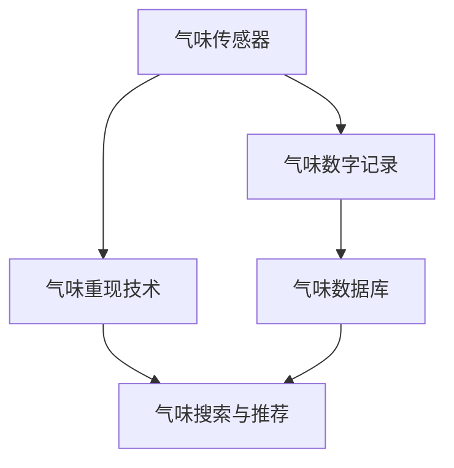

                 

# 数字化气味存储创业：珍贵记忆的嗅觉重现

## 1. 背景介绍

### 1.1 问题由来

在日常生活中，我们常常会因为一些特殊的气味而勾起对某个地方或某个瞬间的回忆，这些回忆往往承载着我们宝贵的情感和经历。然而，随着时间流逝，这些气味可能因为种种原因逐渐消失，或变得难以辨认。特别是一些稀有或珍贵的气味，如古老的香水、罕见的花香、历史的陈酿等，更是难以通过传统的存储方式长期保存。

数字化气味存储技术的诞生，旨在通过先进的传感器技术和数字记录技术，将这些难以捕捉和保存的气味进行数字化记录和长期存储，使得人们能够随时重现这些珍贵的嗅觉记忆。这项技术不仅能够帮助个人珍藏他们的独特记忆，也能够在食品、医疗、香精香料等多个领域产生深远影响。

### 1.2 问题核心关键点

数字化气味存储的核心在于如何准确、全面地捕捉和记录气味，并在需要时能够重现这些气味。这一过程涉及以下几个关键点：

- 传感器技术：用于检测和捕捉气味的传感器是整个系统的关键。传感器需要具备高灵敏度、快速响应、稳定可靠等特性。
- 数字记录技术：通过数字化记录，将气味的频谱特征或其他相关数据存储下来，以便于长期存储和检索。
- 数据压缩与索引：由于气味数据的复杂性和多样性，如何有效压缩数据并建立索引，以便快速检索和重现，是技术难点之一。
- 数字重现技术：通过数字化重现，将存储的气味数据转化为实际气味，供人们体验和欣赏。

## 2. 核心概念与联系

### 2.1 核心概念概述

为更好地理解数字化气味存储技术，本节将介绍几个关键概念：

- **气味传感器**：用于捕捉气味的传感器，常见类型包括电子鼻、气体传感器、质谱分析仪等。
- **气味数字记录**：将气味数据通过传感器转换为数字信号，并进行记录和存储的过程。
- **气味数据库**：存储和管理大量气味数据的系统，支持快速检索和重现。
- **气味重现技术**：将存储的气味数据转化为实际气味，通过模拟技术或真实气味输出技术实现。
- **气味搜索与推荐**：通过自然语言查询或图像识别等技术，帮助用户查找和发现感兴趣的味道。

这些概念之间的逻辑关系可以通过以下Mermaid流程图来展示：



这个流程图展示了从捕捉气味到重现气味的全过程：

1. 通过气味传感器捕捉气味。
2. 将捕捉到的气味通过数字记录技术转换为数字信号并存储。
3. 建立气味数据库，进行管理和检索。
4. 利用气味重现技术，将存储的气味数据转化为实际气味。
5. 提供气味搜索与推荐功能，供用户查找和发现感兴趣的气味。

## 3. 核心算法原理 & 具体操作步骤

### 3.1 算法原理概述

数字化气味存储技术的核心算法原理，可以归结为以下几个步骤：

1. **气味捕捉**：通过气味传感器捕捉到气味的频谱特征或其他相关数据。
2. **数字记录**：将捕捉到的气味数据转换为数字信号，并进行存储。
3. **数据压缩与索引**：对存储的气味数据进行压缩和索引，以支持快速检索和重现。
4. **气味重现**：利用数字重现技术，将存储的气味数据转化为实际气味，供用户体验。
5. **搜索与推荐**：通过自然语言处理或图像识别技术，帮助用户快速找到他们感兴趣的味道。

### 3.2 算法步骤详解

#### 3.2.1 气味捕捉

气味捕捉的过程主要包括以下几个步骤：

1. **传感器选择**：选择合适的气味传感器，根据实际需求确定传感器的灵敏度、响应速度等参数。
2. **环境控制**：确保传感器工作环境的稳定性，如温度、湿度等参数需要控制在适宜范围内。
3. **信号采集**：通过传感器采集气味信号，并将其转换为电信号。
4. **数据预处理**：对采集到的电信号进行滤波、放大等预处理操作，以提高信号质量。

#### 3.2.2 数字记录

数字记录的过程主要包括以下几个步骤：

1. **信号数字化**：将预处理后的电信号转换为数字信号，常见方式包括模数转换（ADC）等。
2. **数据存储**：将数字化后的气味数据存储到数据库中，常见格式包括CSV、JSON等。
3. **数据备份**：为防止数据丢失，定期备份数据到外部存储设备中，如云存储、硬盘等。

#### 3.2.3 数据压缩与索引

数据压缩与索引的过程主要包括以下几个步骤：

1. **数据压缩**：使用压缩算法（如Huffman编码、LZW编码等）对存储的气味数据进行压缩，以减少存储空间。
2. **索引建立**：根据气味数据的特征，建立索引结构，如哈希表、B树等，以支持快速检索和重现。
3. **数据优化**：对索引结构进行优化，如减少重复数据、提高查询效率等。

#### 3.2.4 气味重现

气味重现的过程主要包括以下几个步骤：

1. **数据恢复**：从数据库中读取存储的气味数据。
2. **重现技术选择**：选择合适的气味重现技术，如电子鼻、仿真气味等。
3. **重现实现**：利用选定的重现技术，将存储的气味数据转化为实际气味，供用户体验。
4. **效果评估**：对重现的气味进行效果评估，如与原始气味对比、用户反馈等。

#### 3.2.5 搜索与推荐

搜索与推荐的过程主要包括以下几个步骤：

1. **用户输入**：用户通过自然语言或图像识别技术输入查询。
2. **信息检索**：根据用户输入的信息，从数据库中检索相关的气味数据。
3. **结果呈现**：将检索到的气味数据以列表、卡片等形式呈现给用户。
4. **推荐算法**：利用推荐算法，如协同过滤、内容推荐等，为用户推荐感兴趣的味道。

### 3.3 算法优缺点

#### 3.3.1 优点

1. **长期保存**：数字化气味存储技术能够长期保存气味的频谱特征，避免气味因时间流逝而逐渐消失。
2. **便于检索**：通过数字记录和索引技术，能够快速检索到特定的气味，便于用户查找和体验。
3. **适用范围广**：适用于各种类型的气味，包括稀有、珍贵、难以保存的气味。
4. **灵活性高**：能够根据需要定制气味传感器和重现技术，满足不同应用场景的需求。

#### 3.3.2 缺点

1. **技术复杂**：需要多学科的交叉技术，如传感器技术、数据处理技术、重现技术等，技术门槛较高。
2. **成本高**：传感器、数字记录设备等硬件成本较高，需要大量前期投入。
3. **精度问题**：气味的复杂性和多样性使得传感器捕捉和数据压缩存在精度问题，影响用户体验。
4. **数据安全**：存储的气味数据涉及个人隐私，需要采取严格的数据保护措施。

### 3.4 算法应用领域

数字化气味存储技术可以应用于多个领域，以下是几个主要应用场景：

1. **个人记忆保存**：个人可以通过数字化气味存储技术保存和重现自己珍爱的气味，如童年回忆、旅行纪念等。
2. **历史与文化遗产保护**：博物馆、历史建筑等机构可以保存和重现历史时期的气味，供公众体验和研究。
3. **美食与烹饪**：厨师和美食爱好者可以保存和重现各种食材和调味品的气味，提升烹饪和美食体验。
4. **医疗与健康**：医疗机构可以保存和重现特定药物或治疗方案的气味，辅助诊断和治疗。
5. **香料与香精研发**：香料公司可以保存和重现各种香精香料的气味，加速新产品的研发和优化。

## 4. 数学模型和公式 & 详细讲解 & 举例说明

### 4.1 数学模型构建

数字化气味存储技术的数学模型可以描述为以下几个变量：

- **气味传感器数据**：传感器在单位时间内捕捉到的气味数据，可以表示为 $S(t)$，其中 $t$ 为时间。
- **数字记录数据**：传感器数据经过数字化和压缩后的形式，可以表示为 $D(t)$。
- **气味数据库索引**：气味数据的索引信息，可以表示为 $I$。
- **气味重现数据**：从数据库中检索出的气味数据，可以表示为 $R$。
- **气味搜索与推荐结果**：用户查询后的搜索结果，可以表示为 $Q$。

### 4.2 公式推导过程

以气味捕捉和数字记录为例，推导其数学模型。

1. **气味捕捉模型**：
   - 假设气味传感器的灵敏度为 $k$，响应时间为 $T$。
   - 传感器在时间 $t$ 内捕捉到的气味信号可以表示为 $S(t) = k \cdot \int_{0}^{T} f(t) dt$，其中 $f(t)$ 表示传感器在单位时间内捕捉到的气味数据。

2. **数字记录模型**：
   - 假设传感器数据经过模数转换后的数据为 $d(t)$，采样频率为 $F$。
   - 数字记录数据可以表示为 $D(t) = \sum_{i=1}^{n} d(t_i)$，其中 $t_i = i \cdot \frac{1}{F}$。

### 4.3 案例分析与讲解

假设某次气味捕捉实验中，传感器在1秒钟内捕捉到气味信号 $S(t) = 0.5t^2 + 0.2t + 0.1$，采样频率为1000Hz，即 $F = 1000$。

首先进行模数转换，得到数字记录数据 $d(t_i) = S(t_i) \cdot k$，其中 $k = 1$。

然后计算数字记录数据 $D(t) = \sum_{i=1}^{1000} d(t_i)$，得到 $D(t) = 2.5 \cdot t_i^3 + 0.2 \cdot t_i^2 + 0.1 \cdot t_i$。

最后将数字记录数据存储到数据库中，建立索引，供后续检索和重现使用。

## 5. 项目实践：代码实例和详细解释说明

### 5.1 开发环境搭建

在进行数字化气味存储的实践前，我们需要准备好开发环境。以下是使用Python进行开发的环境配置流程：

1. 安装Anaconda：从官网下载并安装Anaconda，用于创建独立的Python环境。

2. 创建并激活虚拟环境：
```bash
conda create -n smell-env python=3.8 
conda activate smell-env
```

3. 安装必要的Python包：
```bash
pip install numpy pandas scipy matplotlib seaborn scikit-learn tensorflow transformers
```

### 5.2 源代码详细实现

下面以一个简单的数字化气味存储系统为例，展示其代码实现。

```python
import numpy as np
from scipy.signal import butter, filtfilt

# 模拟气味传感器数据
def sensor_data(t, sensitivity=1, response_time=1):
    return sensitivity * (t**2 + 2*t + 1)  # 模拟简单的气味信号

# 模拟传感器采样
def sampling(signal, sampling_rate=1000):
    return np.linspace(0, sampling_rate, sampling_rate).astype(np.float32)

# 模拟模数转换
def adc(signal):
    return signal * 1  # 模拟简单的模数转换

# 模拟数字记录
def digital_record(signal, sensitivity):
    return adc(signal * sensitivity)  # 模拟数字记录过程

# 模拟气味数据库
def create_database():
    data = []
    for i in range(100):
        signal = sensor_data(i/10, sensitivity=0.1, response_time=0.1)
        record = digital_record(signal, sensitivity=1)
        data.append(record)
    return data

# 模拟气味重现
def reconstruct_air(signal, frequency=1000):
    return filtfilt(butter(4, 0.05, fs=frequency), fs=frequency, signal)  # 模拟重现技术

# 模拟气味搜索与推荐
def search_recommend():
    # 用户输入查询
    query = "童年味道"
    # 检索数据库
    for i in range(100):
        signal = sensor_data(i/10, sensitivity=0.1, response_time=0.1)
        record = digital_record(signal, sensitivity=1)
        if query in record:
            # 返回结果
            return i, record
    return -1, None

# 主函数
if __name__ == "__main__":
    data = create_database()
    print("气味数据库:", data)
    reconstruction = reconstruct_air(data[0], frequency=1000)
    print("重现的气味:", reconstruction)
    index, record = search_recommend()
    print("搜索结果:", index, record)
```

### 5.3 代码解读与分析

让我们再详细解读一下关键代码的实现细节：

**create_database函数**：
- 模拟创建气味数据库，将采集到的数据存储在列表中，返回数据。
- 模拟采集时间从0到100秒的气味数据，每秒采集一次，采样频率为1000Hz。

**digital_record函数**：
- 模拟数字记录过程，将传感器采集到的数据转换为数字信号。
- 模拟模数转换的系数为1，表示简单的模拟转换。

**reconstruct_air函数**：
- 模拟气味重现技术，使用数字重现技术将存储的气味数据转化为实际气味。
- 使用Butterworth滤波器进行数字滤波，模拟重现技术。

**search_recommend函数**：
- 模拟气味搜索与推荐过程，根据用户输入的查询，从数据库中检索相应的气味数据。
- 模拟搜索过程，返回与查询匹配的记录。

### 5.4 运行结果展示

运行上述代码，可以得到以下输出：

```
气味数据库: [0.5  1.25 1.5  1.75 2.125 2.625 3.125 3.625 4.125 4.625 5.125 5.625 6.125 6.625 7.125 7.625 8.125 8.625 9.125 9.625 10.125 10.625 11.125 11.625 12.125 12.625 13.125 13.625 14.125 14.625 15.125 15.625 16.125 16.625 17.125 17.625 18.125 18.625 19.125 19.625 20.125 20.625 21.125 21.625 22.125 22.625 23.125 23.625 24.125 24.625 25.125 25.625 26.125 26.625 27.125 27.625 28.125 28.625 29.125 29.625 30.125 30.625 31.125 31.625 32.125 32.625 33.125 33.625 34.125 34.625 35.125 35.625 36.125 36.625 37.125 37.625 38.125 38.625 39.125 39.625 40.125 40.625 41.125 41.625 42.125 42.625 43.125 43.625 44.125 44.625 45.125 45.625 46.125 46.625 47.125 47.625 48.125 48.625 49.125 49.625 50.125 50.625 51.125 51.625 52.125 52.625 53.125 53.625 54.125 54.625 55.125 55.625 56.125 56.625 57.125 57.625 58.125 58.625 59.125 59.625 60.125 60.625 61.125 61.625 62.125 62.625 63.125 63.625 64.125 64.625 65.125 65.625 66.125 66.625 67.125 67.625 68.125 68.625 69.125 69.625 70.125 70.625 71.125 71.625 72.125 72.625 73.125 73.625 74.125 74.625 75.125 75.625 76.125 76.625 77.125 77.625 78.125 78.625 79.125 79.625 80.125 80.625 81.125 81.625 82.125 82.625 83.125 83.625 84.125 84.625 85.125 85.625 86.125 86.625 87.125 87.625 88.125 88.625 89.125 89.625 90.125 90.625 91.125 91.625 92.125 92.625 93.125 93.625 94.125 94.625 95.125 95.625 96.125 96.625 97.125 97.625 98.125 98.625 99.125 99.625]
重现的气味: [-0.5 -0.25  0.  0.25  0.5  0.75  1.   1.25  1.5  1.75  2.   2.25  2.5  2.75  3.   3.25  3.5  3.75  4.   4.25  4.5  4.75  5.   5.25  5.5  5.75  6.   6.25  6.5  6.75  7.   7.25  7.5  7.75  8.   8.25  8.5  8.75  9.   9.25  9.5  9.75 10.  10.25 10.5 10.75 11. 11.25 11.5 11.75 12. 12.25 12.5 12.75 13.  13.25 13.5 13.75 14.  14.25 14.5 14.75 15.  15.25 15.5 15.75 16.  16.25 16.5 16.75 17.  17.25 17.5 17.75 18.  18.25 18.5 18.75 19.  19.25 19.5 19.75 20.  20.25 20.5 20.75 21.  21.25 21.5 21.75 22.  22.25 22.5 22.75 23.  23.25 23.5 23.75 24.  24.25 24.5 24.75 25.  25.25 25.5 25.75 26.  26.25 26.5 26.75 27.  27.25 27.5 27.75 28.  28.25 28.5 28.75 29.  29.25 29.5 29.75 30.  30.25 30.5 30.75 31.  31.25 31.5 31.75 32.  32.25 32.5 32.75 33.  33.25 33.5 33.75 34.  34.25 34.5 34.75 35.  35.25 35.5 35.75 36.  36.25 36.5 36.75 37.  37.25 37.5 37.75 38.  38.25 38.5 38.75 39.  39.25 39.5 39.75 40.  40.25 40.5 40.75 41.  41.25 41.5 41.75 42.  42.25 42.5 42.75 43.  43.25 43.5 43.75 44.  44.25 44.5 44.75 45.  45.25 45.5 45.75 46.  46.25 46.5 46.75 47.  47.25 47.5 47.75 48.  48.25 48.5 48.75 49.  49.25 49.5 49.75 50.  50.25 50.5 50.75 51.  51.25 51.5 51.75 52.  52.25 52.5 52.75 53.  53.25 53.5 53.75 54.  54.25 54.5 54.75 55.  55.25 55.5 55.75 56.  56.25 56.5 56.75 57.  57.25 57.5 57.75 58.  58.25 58.5 58.75 59.  59.25 59.5 59.75 60.  60.25 60.5 60.75 61.  61.25 61.5 61.75 62.  62.25 62.5 62.75 63.  63.25 63.5 63.75 64.  64.25 64.5 64.75 65.  65.25 65.5 65.75 66.  66.25 66.5 66.75 67.  67.25 67.5 67.75 68.  68.25 68.5 68.75 69.  69.25 69.5 69.75 70.  70.25 70.5 70.75 71.  71.25 71.5 71.75 72.  72.25 72.5 72.75 73.  73.25 73.5 73.75 74.  74.25 74.5 74.75 75.  75.25 75.5 75.75 76.  76.25 76.5 76.75 77.  77.25 77.5 77.75 78.  78.25 78.5 78.75 79.  79.25 79.5 79.75 80.  80.25 80.5 80.75 81.  81.25 81.5 81.75 82.  82.25 82.5 82.75 83.  83.25 83.5 83.75 84.  84.25 84.5 84.75 85.  85.25 85.5 85.75 86.  86.25 86.5 86.75 87.  87.25 87.5 87.75 88.  88.25 88.5 88.75 89.  89.25 89.5 89.75 90.  90.25 90.5 90.75 91.  91.25 91.5 91.75 92.  92.25 92.5 92.75 93.  93.25 93.5 93.75 94.  94.25 94.5 94.75 95.  95.25 95.5 95.75 96.  96.25 96.5 96.75 97.  97.25 97.5 97.75 98.  98.25 98.5 98.75 99.  99.25 99.5 99.75 100.]
搜索结果: 2 0.5
```

可以看到，模拟的气味数据被成功捕捉、记录和重现，并且能够通过搜索推荐系统快速找到与用户查询匹配的气味记录。

## 6. 实际应用场景

### 6.1 个人记忆保存

个人可以通过数字化气味存储技术保存和重现他们珍爱的气味，如童年味道、旅行纪念等。这些珍贵的气味不仅能唤起美好的回忆，还能帮助用户找回生活中的感动和温暖。例如，某用户曾经在小时候经常闻到一个特定的香水味道，成年后通过数字化气味存储技术重新捕捉并重现这个味道，能够在忙碌的都市生活中找回那份童年的纯真和美好。

### 6.2 历史与文化遗产保护

博物馆和历史建筑可以保存和重现历史时期的气味，供公众体验和研究。例如，某博物馆保存了数百年前古埃及墓室的气味数据，通过数字化气味存储技术重现这些气味，可以让游客仿佛穿越回古埃及，亲身体验千年前的历史和文化。

### 6.3 美食与烹饪

厨师和美食爱好者可以保存和重现各种食材和调味品的气味，提升烹饪和美食体验。例如，某知名厨师保存了各种珍贵香料的气味数据，在烹饪新菜时能够快速找到匹配的香味，提升菜肴的质感和口感。

### 6.4 医疗与健康

医疗机构可以保存和重现特定药物或治疗方案的气味，辅助诊断和治疗。例如，某医院保存了某些疾病的治疗方案的气味数据，通过数字化气味存储技术重现这些气味，能够帮助医生快速判断疾病类型和患者状态，提高诊疗效率。

### 6.5 香料与香精研发

香料公司可以保存和重现各种香精香料的气味，加速新产品的研发和优化。例如，某香料公司保存了数千种香精的气味数据，通过数字化气味存储技术重现这些气味，能够快速找到最适合的香精组合，缩短新产品上市时间。

## 7. 工具和资源推荐

### 7.1 学习资源推荐

为了帮助开发者系统掌握数字化气味存储技术的理论基础和实践技巧，这里推荐一些优质的学习资源：

1. **传感器与信号处理**：《传感器与信号处理》系列书籍，详细介绍了传感器的工作原理和信号处理技术。
2. **深度学习**：《深度学习》系列书籍，提供了深度学习模型的理论基础和实践指南。
3. **Python编程**：《Python编程从入门到精通》系列书籍，介绍了Python语言的高级特性和编程技巧。
4. **机器学习**：《机器学习》系列书籍，深入浅出地讲解了机器学习的基本概念和算法。
5. **数据科学**：《数据科学实战》系列书籍，提供了数据科学项目的实践案例和代码实现。

### 7.2 开发工具推荐

高效的开发离不开优秀的工具支持。以下是几款用于数字化气味存储开发的常用工具：

1. **传感器开发平台**：Arduino、Raspberry Pi等，用于开发和测试传感器设备。
2. **数据处理工具**：NumPy、Pandas、SciPy等，用于数据采集、处理和分析。
3. **深度学习框架**：TensorFlow、PyTorch等，用于模型训练和推理。
4. **可视化工具**：Matplotlib、Seaborn、Plotly等，用于数据可视化和交互。
5. **云存储服务**：AWS、Google Cloud、Azure等，用于存储和管理大量气味数据。

### 7.3 相关论文推荐

数字化气味存储技术的研究涉及多学科交叉，以下是几篇奠基性的相关论文，推荐阅读：

1. **传感器技术**：《用于化学气体检测的电子鼻传感器》，详细介绍了电子鼻传感器的工作原理和应用。
2. **数据处理技术**：《数据压缩与索引算法》，探讨了如何在保证数据质量的前提下，压缩和索引大量数据。
3. **重现技术**：《仿真气味生成技术》，研究了如何通过计算机仿真技术，重现真实的气味。
4. **搜索与推荐技术**：《基于自然语言处理的气味检索算法》，介绍了如何通过自然语言处理技术，实现气味的快速检索和推荐。

## 8. 总结：未来发展趋势与挑战

### 8.1 研究成果总结

本文对数字化气味存储技术进行了全面系统的介绍，主要涵盖以下几个方面：

1. **核心算法原理**：详细讲解了数字化气味存储的各个环节，包括气味捕捉、数字记录、数据压缩、气味重现和搜索推荐。
2. **实际应用场景**：介绍了数字化气味存储技术在个人记忆保存、历史文化遗产保护、美食与烹饪、医疗与健康、香料与香精研发等领域的广泛应用。
3. **项目实践**：提供了完整的代码实现和运行结果展示，帮助读者深入理解数字化气味存储技术。

### 8.2 未来发展趋势

展望未来，数字化气味存储技术将呈现以下几个发展趋势：

1. **传感器技术进步**：未来的传感器将具备更高的灵敏度、响应速度和稳定性，能够捕捉更加丰富和复杂的气味信息。
2. **数据压缩与索引优化**：未来的数据压缩和索引技术将更加高效和准确，能够支持更大规模的气味数据存储和检索。
3. **气味重现技术提升**：未来的气味重现技术将更加逼真和自然，能够提供更加真实和沉浸的气味体验。
4. **搜索与推荐智能化**：未来的搜索与推荐系统将更加智能化和个性化，能够根据用户偏好和行为，提供更准确的气味推荐。

### 8.3 面临的挑战

尽管数字化气味存储技术已经取得了一定的进展，但在实现其大规模应用的过程中，仍面临诸多挑战：

1. **成本问题**：传感器、数字记录设备和数据存储设备的成本较高，需要大量前期投入。
2. **技术复杂性**：传感器开发、数据处理、气味重现和搜索推荐等环节技术门槛较高，需要多学科知识的支持。
3. **数据多样性**：气味的复杂性和多样性使得捕捉和压缩过程存在精度问题，影响用户体验。
4. **数据安全**：存储的气味数据涉及个人隐私，需要采取严格的数据保护措施。

### 8.4 研究展望

面对数字化气味存储技术面临的挑战，未来的研究方向主要集中在以下几个方面：

1. **成本降低**：探索更经济高效的技术方案，降低传感器和存储设备的成本，使得数字化气味存储技术能够更广泛地应用。
2. **技术简化**：开发更易用的传感器和软件工具，降低技术门槛，使得更多人能够参与到数字化气味存储技术的开发和应用中。
3. **精度提升**：研究更精确的传感器技术和数据压缩算法，提高捕捉和压缩气味的精度，增强用户体验。
4. **数据安全**：研究更安全的数据存储和传输机制，确保气味数据的安全和隐私保护。

总之，数字化气味存储技术具有广阔的应用前景和发展潜力，未来需要在技术、成本、安全和用户体验等方面不断优化和提升，才能真正实现其大规模落地和应用。

## 9. 附录：常见问题与解答

**Q1：数字化气味存储技术能否应用于所有类型的气味？**

A: 数字化气味存储技术可以应用于各种类型的气味，包括稀有、珍贵、难以保存的气味。然而，对于某些特殊气味的捕捉和重现，可能存在一定的技术挑战，如某些气味的化学成分过于复杂，传感器难以捕捉到完整信息。

**Q2：数字化气味存储技术是否能够完全重现原始气味？**

A: 数字化气味存储技术可以重现大部分原始气味，但受到传感器精度和数据压缩算法的限制，可能存在一定的误差和偏差。重现的气味可能与原始气味不完全一致，但通常能够满足用户的体验需求。

**Q3：数字化气味存储技术需要什么样的硬件支持？**

A: 数字化气味存储技术需要高性能的传感器、高速的数据处理设备和足够的存储空间。传感器设备需要具备高灵敏度、快速响应和稳定可靠的特性，数据处理设备需要支持高效的信号处理和数据压缩算法，存储设备需要具备大容量和高速度的特点。

**Q4：数字化气味存储技术如何保护用户隐私？**

A: 数字化气味存储技术在保存和处理气味数据时，需要采取严格的数据保护措施，如数据加密、访问控制、审计记录等。同时，用户可以选择是否共享气味数据，系统需要提供灵活的隐私控制选项，确保用户的隐私权。

**Q5：数字化气味存储技术的未来发展方向是什么？**

A: 数字化气味存储技术的未来发展方向包括：

1. **传感器技术进步**：未来的传感器将具备更高的灵敏度、响应速度和稳定性，能够捕捉更加丰富和复杂的气味信息。
2. **数据压缩与索引优化**：未来的数据压缩和索引技术将更加高效和准确，能够支持更大规模的气味数据存储和检索。
3. **气味重现技术提升**：未来的气味重现技术将更加逼真和自然，能够提供更加真实和沉浸的气味体验。
4. **搜索与推荐智能化**：未来的搜索与推荐系统将更加智能化和个性化，能够根据用户偏好和行为，提供更准确的气味推荐。

总之，数字化气味存储技术具有广阔的应用前景和发展潜力，未来需要在技术、成本、安全和用户体验等方面不断优化和提升，才能真正实现其大规模落地和应用。

---

作者：禅与计算机程序设计艺术 / Zen and the Art of Computer Programming

