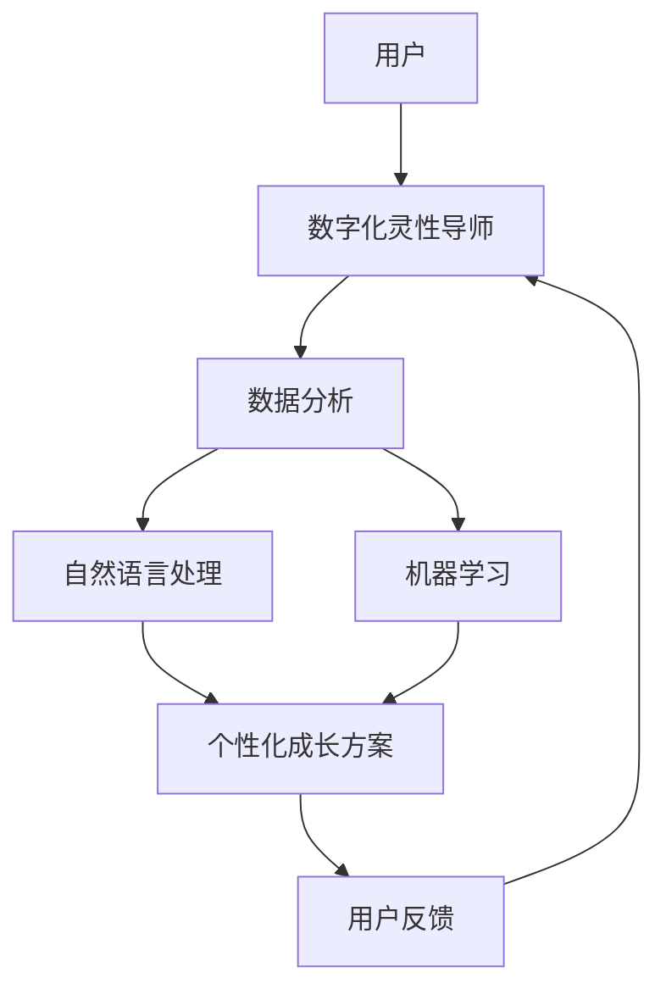

                 

## 1. 背景介绍

在现代社会中，数字化、智能化已经逐渐渗透到各个领域，包括教育、医疗、商业、娱乐等。数字化浪潮为人类提供了前所未有的便利和效率，但同时也带来了新的挑战，尤其是人类心灵成长和精神福祉的维护。随着人工智能技术的快速发展，AI在辅助人们心灵成长、提供心理支持等方面展现了巨大潜力。本文章旨在探讨数字化灵性导师认证专家的概念，并介绍如何利用AI技术来辅助人们的心灵成长，培育优秀的培训师，以期为未来的数字化心灵导师培养提供新的思路和方法。

## 2. 核心概念与联系

### 2.1 核心概念概述

数字化灵性导师认证专家是指那些在数字化领域内，能够运用先进的人工智能技术，通过网络和数字化手段，为人类提供心灵成长的指导和支持，并帮助培育心灵导师培训师的专业人士。该专家不仅需要具备丰富的心理知识和人文素养，还需要掌握数据分析、自然语言处理、机器学习等技术，能够通过智能算法分析和理解用户需求，提供个性化的心灵成长方案和心理支持。

### 2.2 核心概念原理和架构的 Mermaid 流程图



这个流程图展示了从用户到数字化灵性导师再到个性化成长方案的流程：用户通过数字化平台与导师互动，导师通过数据分析、自然语言处理和机器学习技术，生成个性化的心灵成长方案，并根据用户反馈进行持续优化。

## 3. 核心算法原理 & 具体操作步骤

### 3.1 算法原理概述

基于AI的数字化心灵导师辅助系统，主要包含以下几个关键算法和技术：

1. **自然语言处理(NLP)**：用于解析用户的输入，提取其情感状态、心理需求等关键信息，为用户提供个性化的心理支持。
2. **机器学习(ML)**：利用历史数据和用户反馈，持续优化推荐模型，提高个性化成长的准确性和效果。
3. **数据分析**：对用户数据进行分析，识别心理状态的动态变化，及时调整心理干预措施。

### 3.2 算法步骤详解

1. **用户注册与身份认证**：用户通过平台注册并完成身份认证，系统会收集基本信息，如年龄、性别、职业、兴趣等。
2. **心理测评**：用户完成心理测评问卷，系统通过NLP技术解析问卷内容，识别用户的心理状态和需求。
3. **个性化方案生成**：基于用户的心理测评结果和历史数据，系统通过机器学习算法生成个性化的心灵成长方案，包括冥想、阅读推荐、心理咨询等。
4. **方案实施与反馈**：用户按照个性化方案进行自我提升，系统根据用户反馈调整和优化方案，确保其有效性。

### 3.3 算法优缺点

#### 优点

- **个性化推荐**：通过深度学习算法，系统能够根据用户的历史行为和心理测评结果，生成高度个性化的心灵成长方案。
- **实时调整**：数据分析和机器学习算法确保了系统能够根据用户反馈实时调整方案，提高效果。
- **便捷性**：用户可以在线上随时随地获取心理支持和成长方案，无需线下预约，节约时间和成本。

#### 缺点

- **隐私保护**：用户心理数据涉及敏感信息，需要严格的隐私保护措施。
- **技术门槛**：对于普通用户而言，技术门槛较高，可能需要专门培训才能有效利用系统。
- **算法偏见**：机器学习算法可能存在偏见，导致方案的不公平性。

### 3.4 算法应用领域

基于AI的数字化心灵导师辅助系统主要应用于以下领域：

- **心理健康咨询**：提供心理健康评估、心理咨询和危机干预等服务。
- **心灵成长培训**：辅助用户进行冥想、正念、自我反思等心灵成长活动。
- **职业发展指导**：为职场人士提供心理支持和职业发展建议。
- **教育辅导**：为学生提供心理健康教育和辅导。

## 4. 数学模型和公式 & 详细讲解 & 举例说明

### 4.1 数学模型构建

数字化灵性导师辅助系统主要涉及以下几个数学模型：

1. **用户心理状态模型**：用于描述和预测用户的心理状态，如情感、压力水平等。
2. **个性化成长方案模型**：基于用户心理状态生成个性化的成长方案。
3. **反馈调整模型**：根据用户反馈调整个性化成长方案。

### 4.2 公式推导过程

假设用户心理状态由向量 $\boldsymbol{x}$ 表示，其状态变化可以用以下线性模型描述：

$$
\boldsymbol{x}_{t+1} = \boldsymbol{A}\boldsymbol{x}_t + \boldsymbol{B}\boldsymbol{u}_t + \boldsymbol{\epsilon}_t
$$

其中 $\boldsymbol{u}_t$ 为外界的心理影响因素，$\boldsymbol{\epsilon}_t$ 为噪声。

个性化成长方案模型可以根据用户的心理状态 $\boldsymbol{x}$ 和历史数据 $\boldsymbol{H}$ 生成推荐方案 $\boldsymbol{y}$：

$$
\boldsymbol{y} = \boldsymbol{C}\boldsymbol{x} + \boldsymbol{D}\boldsymbol{H} + \boldsymbol{\eta}
$$

其中 $\boldsymbol{\eta}$ 为模型误差。

反馈调整模型可以通过用户对成长方案的反馈 $\boldsymbol{f}$ 更新推荐模型：

$$
\boldsymbol{\theta} = \boldsymbol{\theta} - \alpha(\boldsymbol{y} - \boldsymbol{f})^T(\boldsymbol{y} - \boldsymbol{f})
$$

其中 $\boldsymbol{\theta}$ 为推荐模型参数，$\alpha$ 为学习率。

### 4.3 案例分析与讲解

以心理压力管理为例，系统可以通过用户填写的压力测评问卷，生成个性化的减压方案。首先，系统使用NLP技术解析问卷内容，提取用户的压力源和压力水平。然后，系统根据用户的压力状态和历史数据，生成包括冥想、运动、呼吸练习等减压方案。最后，系统通过用户对减压方案的反馈，不断调整和优化方案，确保其有效性。

## 5. 项目实践：代码实例和详细解释说明

### 5.1 开发环境搭建

开发数字化灵性导师辅助系统需要以下环境：

1. **操作系统**：Linux或Windows。
2. **编程语言**：Python。
3. **深度学习框架**：TensorFlow或PyTorch。
4. **自然语言处理工具**：NLTK或spaCy。
5. **数据库**：MySQL或MongoDB。

### 5.2 源代码详细实现

以下是一个简化的用户心理测评和个性化成长方案生成的代码实现：

```python
import tensorflow as tf
import numpy as np
from nltk.sentiment.vader import SentimentIntensityAnalyzer

# 定义用户心理状态模型
class UserPsychologyModel(tf.keras.Model):
    def __init__(self):
        super(UserPsychologyModel, self).__init__()
        self.dense1 = tf.keras.layers.Dense(16, activation='relu')
        self.dense2 = tf.keras.layers.Dense(1, activation='sigmoid')

    def call(self, inputs):
        x = self.dense1(inputs)
        x = self.dense2(x)
        return x

# 定义个性化成长方案模型
class PersonalizedGrowthModel(tf.keras.Model):
    def __init__(self):
        super(PersonalizedGrowthModel, self).__init__()
        self.dense1 = tf.keras.layers.Dense(16, activation='relu')
        self.dense2 = tf.keras.layers.Dense(8, activation='softmax')

    def call(self, inputs):
        x = self.dense1(inputs)
        x = self.dense2(x)
        return x

# 定义反馈调整模型
class FeedbackAdjustmentModel(tf.keras.Model):
    def __init__(self):
        super(FeedbackAdjustmentModel, self).__init__()
        self.dense1 = tf.keras.layers.Dense(16, activation='relu')
        self.dense2 = tf.keras.layers.Dense(1, activation='sigmoid')

    def call(self, inputs):
        x = self.dense1(inputs)
        x = self.dense2(x)
        return x

# 实例化模型
user_psychology_model = UserPsychologyModel()
personalized_growth_model = PersonalizedGrowthModel()
feedback_adjustment_model = FeedbackAdjustmentModel()

# 用户心理状态数据
user_state = np.array([0.5, 0.2, 0.7])

# 生成个性化成长方案
growth_scheme = personalized_growth_model(user_state)

# 用户反馈数据
user_feedback = np.array([0.8, 0.6])

# 调整推荐模型
feedback_adjustment_model.train_on_batch(user_feedback)

# 输出最终方案
print("个性化成长方案:", growth_scheme)
```

### 5.3 代码解读与分析

在上述代码中，我们定义了三个模型：用户心理状态模型、个性化成长方案模型和反馈调整模型。其中，用户心理状态模型用于预测用户的心理状态，个性化成长方案模型根据用户的心理状态生成成长方案，反馈调整模型根据用户反馈调整方案。通过这些模型的协同工作，系统可以动态生成个性化的心灵成长方案。

## 6. 实际应用场景

### 6.1 心理辅导应用

数字化灵性导师辅助系统可以广泛应用于心理辅导领域，帮助人们进行心理健康管理和心理咨询。用户通过填写心理测评问卷，系统可以自动生成个性化的心理健康方案，并根据用户反馈实时调整方案。

### 6.2 心灵成长训练

系统可以为用户提供定制化的心灵成长训练方案，如冥想、正念、自我反思等。通过系统的引导和反馈，用户可以逐步改善心理状态，提升自我认知和情感管理能力。

### 6.3 职业发展指导

系统可以为职场人士提供个性化的职业发展建议，帮助其应对职业压力和挑战，提升职业素养和发展潜力。

### 6.4 教育辅导

在教育领域，系统可以为学生提供心理健康教育，帮助其缓解学业压力，提高学习效果。

### 6.5 未来应用展望

未来，数字化灵性导师辅助系统将在更多领域得到应用，如医疗、家庭、社区等，为人们的心理健康和心灵成长提供全面的支持。同时，系统也将更加智能化、个性化，能够更好地适应不同人群的需求。

## 7. 工具和资源推荐

### 7.1 学习资源推荐

1. **《Python深度学习》**：通过学习Python深度学习的基础知识和技能，为数字化灵性导师认证专家提供技术支持。
2. **《自然语言处理综论》**：掌握自然语言处理的核心技术和算法，为系统开发和优化提供理论基础。
3. **《机器学习实战》**：通过实际案例学习机器学习算法的应用，为个性化推荐和反馈调整提供方法。
4. **《用户体验设计》**：学习用户体验设计的原则和方法，提升系统的用户体验和用户满意度。
5. **《人工智能伦理》**：了解人工智能伦理和隐私保护，确保系统的合规性和道德性。

### 7.2 开发工具推荐

1. **TensorFlow**：基于张量流的深度学习框架，支持高效的模型训练和推理。
2. **PyTorch**：灵活的动态计算图，适合快速迭代和实验研究。
3. **NLTK**：Python自然语言处理工具库，提供丰富的文本处理功能。
4. **spaCy**：基于Python的自然语言处理库，支持实体识别、词性标注等任务。
5. **Jupyter Notebook**：轻量级的交互式编程环境，支持代码编写、数据可视化等。

### 7.3 相关论文推荐

1. **《基于深度学习的人机交互模型》**：介绍深度学习在自然语言处理和情感分析中的应用。
2. **《个性化推荐系统的研究综述》**：总结了个性化推荐系统的常用算法和技术。
3. **《人工智能伦理框架》**：探讨人工智能伦理和隐私保护的相关问题。

## 8. 总结：未来发展趋势与挑战

### 8.1 研究成果总结

数字化灵性导师认证专家结合了人工智能技术和心理学的知识，能够为人们的心理健康和心灵成长提供个性化支持。该技术已经在心理辅导、心灵成长培训、职业发展指导、教育辅导等领域取得了显著成效。

### 8.2 未来发展趋势

1. **智能化和个性化**：系统将更加智能化和个性化，能够根据用户的心理状态和需求提供更精准的推荐和支持。
2. **跨领域应用**：系统将拓展到更多领域，如医疗、社区、家庭等，为人们的心理和情感提供全面的支持。
3. **伦理和隐私保护**：系统将更加注重伦理和隐私保护，确保用户数据的安全和合规性。
4. **多方协作**：系统将与其他心理健康、教育、社区等资源进行协作，形成综合性的心理支持体系。

### 8.3 面临的挑战

1. **隐私保护**：用户心理数据的隐私保护是系统的关键问题，需要采取严格的措施确保数据安全。
2. **技术普及**：系统的技术门槛较高，需要提升用户的技术素养，使更多人能够使用和受益。
3. **算法公平性**：机器学习算法可能存在偏见，导致方案的不公平性，需要进一步优化和调整。

### 8.4 研究展望

未来，数字化灵性导师认证专家需要进一步研究以下几个方向：

1. **跨领域应用**：拓展系统在更多领域的应用，提升系统的普适性和实用性。
2. **算法优化**：优化机器学习算法，提高方案的公平性和准确性。
3. **隐私保护**：研究隐私保护技术，确保用户数据的匿名性和安全性。
4. **多方协作**：与其他心理健康、教育、社区等资源进行协作，形成综合性的心理支持体系。

## 9. 附录：常见问题与解答

**Q1: 数字化灵性导师辅助系统如何保护用户隐私？**

A: 数字化灵性导师辅助系统通过以下方式保护用户隐私：
1. **数据加密**：对用户心理数据进行加密存储和传输，防止数据泄露。
2. **匿名化处理**：对用户数据进行匿名化处理，确保数据匿名性。
3. **访问控制**：采用访问控制策略，限制非授权用户的访问。
4. **隐私协议**：制定隐私协议，明确数据的使用范围和权限。

**Q2: 如何提高系统的智能化水平？**

A: 提高系统的智能化水平可以从以下几个方面入手：
1. **数据多样性**：收集更多样化的数据，确保模型具有更强的泛化能力。
2. **算法优化**：优化深度学习算法，提升模型的准确性和效率。
3. **用户交互**：增加用户与系统的交互，收集更多反馈信息，优化推荐模型。
4. **跨领域融合**：与其他领域的知识和技术进行融合，提升系统的综合能力。

**Q3: 数字化灵性导师辅助系统的技术挑战有哪些？**

A: 数字化灵性导师辅助系统的技术挑战包括：
1. **隐私保护**：用户心理数据的隐私保护是系统的关键问题，需要采取严格的措施确保数据安全。
2. **技术普及**：系统的技术门槛较高，需要提升用户的技术素养，使更多人能够使用和受益。
3. **算法公平性**：机器学习算法可能存在偏见，导致方案的不公平性，需要进一步优化和调整。
4. **跨领域协作**：与其他心理健康、教育、社区等资源进行协作，形成综合性的心理支持体系。

---

作者：禅与计算机程序设计艺术 / Zen and the Art of Computer Programming

