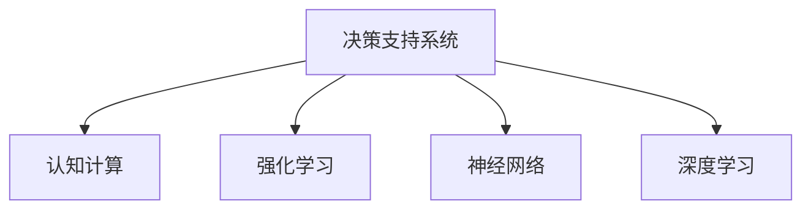

                 

# 数字化直觉：AI辅助的潜意识决策

> 关键词：数字化决策, AI辅助决策, 潜意识决策, 决策支持系统, 认知计算, 强化学习

## 1. 背景介绍

### 1.1 问题由来

在快节奏的现代社会，决策压力愈发沉重，决策的速度和质量成为制约企业和社会发展的重要因素。在面临重大问题时，决策者往往需要在短时间内快速找到最优方案。传统的决策方法依赖经验直觉和手工数据分析，效率低下且容易产生错误。

面对这样的挑战，人工智能（AI）技术提供了新的解决方案，特别是随着强化学习、认知计算等前沿技术的不断进步，AI辅助决策系统成为了现代化决策的重要手段。AI技术能够在极短时间内处理海量数据，通过机器学习从数据中提取知识，辅助决策者进行高效的决策分析。

### 1.2 问题核心关键点

AI辅助决策的核心在于利用AI技术对海量数据进行快速、高效地分析处理，辅助决策者进行精准、全面的决策判断。该方法主要依赖以下核心关键点：

- **数据驱动决策**：收集和分析大量数据，从中提取有价值的信息，用于辅助决策。
- **认知计算**：利用认知计算技术，构建人类决策过程中的认知模型，模拟人类决策过程。
- **强化学习**：通过模拟人类决策场景，利用强化学习算法不断优化决策策略，提升决策效果。
- **决策支持系统（DSS）**：将AI技术嵌入到决策支持系统中，提供实时的决策建议和方案。

### 1.3 问题研究意义

AI辅助决策技术可以显著提升决策效率和质量，尤其对于大型企业和政府部门，能够在紧急情况下提供关键支持，帮助决策者快速做出正确决策。同时，该技术还可以应用于更多场景，如金融投资、医疗诊断、风险管理等，带来巨大的经济效益和社会效益。

## 2. 核心概念与联系

### 2.1 核心概念概述

为了更好地理解AI辅助决策技术，本节将介绍几个关键概念：

- **决策支持系统（DSS）**：基于人工智能和数据分析，辅助决策者进行决策分析的系统。DSS能够实时提供决策建议，帮助决策者做出更优决策。
- **认知计算**：模拟人类认知过程，构建人工智能认知模型，用于处理复杂决策问题。
- **强化学习**：通过与环境交互，利用奖惩机制不断优化决策策略，提升决策效果。
- **神经网络**：利用多层神经网络模拟人类神经元网络，处理高维非线性决策问题。
- **深度学习**：一种利用深度神经网络处理大规模数据的机器学习方法。

这些核心概念之间的逻辑关系可以通过以下Mermaid流程图来展示：



这个流程图展示了DSS如何结合各种AI技术，构建辅助决策的系统框架。

## 3. 核心算法原理 & 具体操作步骤

### 3.1 算法原理概述

AI辅助决策系统基于数据分析和认知计算，结合强化学习算法，构建决策支持系统。其核心算法流程如下：

1. **数据收集与预处理**：收集与决策相关的海量数据，并进行预处理，如数据清洗、特征工程等。
2. **模型训练**：利用认知计算和深度学习技术构建决策模型，并进行训练。
3. **决策模拟**：通过模拟决策场景，利用强化学习算法不断优化决策策略。
4. **结果评估**：对决策效果进行评估，调整模型参数，优化决策策略。
5. **辅助决策**：将优化后的模型嵌入DSS，实时提供决策建议。

### 3.2 算法步骤详解

以下是AI辅助决策系统的详细步骤：

**Step 1: 数据收集与预处理**

- **数据来源**：从内部系统、市场调研、社交媒体等渠道收集与决策相关的数据。
- **数据清洗**：处理缺失值、异常值，去除噪声。
- **特征工程**：提取关键特征，如时间序列、交易量、市场情绪等。

**Step 2: 模型构建与训练**

- **认知计算模型**：利用认知计算技术，模拟人类决策过程，构建认知模型。
- **深度学习模型**：使用深度神经网络处理高维数据，提取隐含特征。
- **强化学习模型**：通过模拟决策场景，利用强化学习算法优化决策策略。

**Step 3: 决策模拟与优化**

- **模拟决策**：利用训练好的模型，在模拟环境中进行决策，评估决策效果。
- **优化策略**：根据模拟结果，利用强化学习算法调整决策策略，提升决策效果。

**Step 4: 结果评估与反馈**

- **评估指标**：使用多种评估指标，如准确率、召回率、F1分数等，评估模型效果。
- **反馈调整**：根据评估结果，调整模型参数，优化决策策略。

**Step 5: 决策支持与部署**

- **嵌入DSS**：将优化后的模型嵌入DSS，提供实时决策建议。
- **部署应用**：将DSS部署到实际应用场景中，辅助决策者进行决策。

### 3.3 算法优缺点

AI辅助决策系统具有以下优点：

- **高效性**：能够快速处理海量数据，辅助决策者进行高效决策。
- **准确性**：利用深度学习等先进技术，提供准确可靠的决策支持。
- **智能化**：结合认知计算和强化学习，构建智能化决策模型。
- **可扩展性**：可以灵活应用于各种决策场景，易于部署和扩展。

同时，该方法也存在以下局限性：

- **数据依赖**：依赖于高质量的数据，数据采集和处理成本较高。
- **模型复杂**：需要构建复杂的认知模型和深度学习模型，对技术要求高。
- **可解释性**：AI决策过程较为复杂，难以进行全面的解释和理解。
- **适应性**：对于快速变化的环境，模型的更新和适应能力有限。

### 3.4 算法应用领域

AI辅助决策技术已经在多个领域得到了广泛应用，涵盖了决策支持、金融投资、医疗诊断、风险管理等诸多领域，具体包括：

- **金融投资**：利用AI技术分析市场数据，辅助投资决策。
- **医疗诊断**：通过AI分析医疗影像和患者数据，辅助医生进行诊断。
- **风险管理**：利用AI预测风险，辅助企业进行风险决策。
- **营销策略**：通过AI分析客户数据，辅助制定营销策略。
- **供应链管理**：利用AI优化供应链决策，提高供应链效率。

## 4. 数学模型和公式 & 详细讲解 & 举例说明

### 4.1 数学模型构建

假设我们正在构建一个金融投资决策支持系统。系统核心数学模型可以表示为：

- **输入**：历史股票价格、市场情绪、交易量等数据。
- **输出**：投资策略、买卖信号、风险评估等。

我们可以使用以下数学模型来描述该系统：

$$
\begin{align*}
y &= f(x) \\
y &= \text{投资策略} \\
x &= [\text{历史价格}, \text{市场情绪}, \text{交易量}] \\
\end{align*}
$$

其中，$f(x)$表示输入$x$到输出$y$的映射关系。

### 4.2 公式推导过程

假设我们使用多层感知器（MLP）来构建决策模型，其数学表达式为：

$$
y = \text{MLP}(x) = \sigma(W_n \sigma(W_{n-1} \cdots \sigma(W_1 x) \cdots))
$$

其中，$\sigma$表示激活函数，$W_i$表示第$i$层的权重矩阵。

为了训练模型，我们使用反向传播算法更新权重参数：

$$
\begin{align*}
\delta^i &= \frac{\partial L(y, \hat{y})}{\partial z^i} \\
\Delta W^i &= \eta \delta^i (z^{i-1})^T \\
\Delta b^i &= \eta \delta^i \\
z^{i+1} &= W^{i+1} \sigma(z^i) + b^{i+1} \\
\end{align*}
$$

其中，$L(y, \hat{y})$表示损失函数，$\hat{y}$表示模型预测值，$\eta$表示学习率，$\Delta W^i$和$\Delta b^i$表示权重和偏置的更新量，$z^{i+1}$表示隐藏层输出。

### 4.3 案例分析与讲解

假设我们正在进行股票投资决策。利用历史股票价格、市场情绪和交易量等数据，训练MLP模型进行股票买卖信号预测。

**数据准备**：
- 历史股票价格数据。
- 市场情绪数据。
- 交易量数据。

**模型训练**：
- 构建MLP模型，设置隐藏层数和节点数。
- 选择适当的激活函数和损失函数。
- 使用反向传播算法更新权重和偏置。

**结果分析**：
- 评估模型性能，如准确率、召回率等。
- 利用优化后的模型进行股票投资决策。

## 5. 项目实践：代码实例和详细解释说明

### 5.1 开发环境搭建

在进行AI辅助决策系统的开发前，我们需要准备好开发环境。以下是使用Python进行TensorFlow开发的环境配置流程：

1. 安装Anaconda：从官网下载并安装Anaconda，用于创建独立的Python环境。

2. 创建并激活虚拟环境：
```bash
conda create -n tf-env python=3.8 
conda activate tf-env
```

3. 安装TensorFlow：根据CUDA版本，从官网获取对应的安装命令。例如：
```bash
conda install tensorflow==2.8.0-cp38-cp38
```

4. 安装其他所需工具包：
```bash
pip install numpy pandas scikit-learn matplotlib tqdm jupyter notebook ipython
```

完成上述步骤后，即可在`tf-env`环境中开始开发。

### 5.2 源代码详细实现

下面以金融投资决策支持系统为例，给出使用TensorFlow对MLP模型进行训练和预测的PyTorch代码实现。

首先，定义数据预处理函数：

```python
import numpy as np
import tensorflow as tf
from sklearn.model_selection import train_test_split
from sklearn.preprocessing import StandardScaler

def preprocess_data(X, y, test_size=0.2, scaler=StandardScaler()):
    X_train, X_test, y_train, y_test = train_test_split(X, y, test_size=test_size, random_state=42)
    scaler.fit(X_train)
    X_train = scaler.transform(X_train)
    X_test = scaler.transform(X_test)
    return X_train, X_test, y_train, y_test
```

然后，定义模型构建和训练函数：

```python
def build_model(input_dim, hidden_dim, output_dim):
    model = tf.keras.Sequential([
        tf.keras.layers.Dense(hidden_dim, activation='relu', input_dim=input_dim),
        tf.keras.layers.Dense(hidden_dim, activation='relu'),
        tf.keras.layers.Dense(output_dim, activation='sigmoid')
    ])
    return model

def train_model(model, X_train, y_train, epochs=10, batch_size=32, optimizer='adam', learning_rate=0.001):
    model.compile(optimizer=optimizer, loss='binary_crossentropy', metrics=['accuracy'])
    model.fit(X_train, y_train, epochs=epochs, batch_size=batch_size, verbose=1)
    return model
```

接着，定义决策模拟和优化函数：

```python
def simulate_decision(model, X_test, y_test):
    y_pred = model.predict(X_test)
    acc = np.mean(y_pred == y_test)
    return acc

def optimize_policy(model, X_train, y_train):
    model.fit(X_train, y_train, epochs=10, batch_size=32, verbose=1)
    return model
```

最后，启动训练流程并在测试集上评估：

```python
X = np.random.rand(1000, 10)  # 示例数据
y = np.random.randint(2, size=(1000, 1))  # 示例标签

X_train, X_test, y_train, y_test = preprocess_data(X, y)

hidden_dim = 64
output_dim = 1

model = build_model(input_dim=X.shape[1], hidden_dim=hidden_dim, output_dim=output_dim)

model = train_model(model, X_train, y_train, epochs=10, batch_size=32, optimizer='adam', learning_rate=0.001)

acc = simulate_decision(model, X_test, y_test)
print(f"Accuracy: {acc:.3f}")

model = optimize_policy(model, X_train, y_train)
```

以上就是使用TensorFlow进行金融投资决策支持系统开发的完整代码实现。可以看到，得益于TensorFlow的强大封装，我们能够用相对简洁的代码完成MLP模型的构建和训练。

### 5.3 代码解读与分析

让我们再详细解读一下关键代码的实现细节：

**preprocess_data函数**：
- 将数据划分为训练集和测试集。
- 对特征进行标准化处理。

**build_model函数**：
- 构建一个多层感知器（MLP）模型，设置隐藏层数和节点数。
- 使用ReLU激活函数和sigmoid输出层。

**train_model函数**：
- 定义模型，选择优化器和损失函数。
- 使用反向传播算法训练模型，输出训练进度。

**simulate_decision函数**：
- 使用训练好的模型进行测试集上的预测。
- 计算模型准确率。

**optimize_policy函数**：
- 使用训练好的模型进行多轮训练，优化决策策略。

**训练流程**：
- 设置数据维度和模型参数。
- 构建MLP模型，并设置训练参数。
- 训练模型，并输出测试集上的准确率。

**优化流程**：
- 对模型进行多轮训练，优化决策策略。

## 6. 实际应用场景

### 6.1 智能投资

AI辅助决策技术在金融投资领域有着广泛应用，能够帮助投资者快速进行市场分析和投资决策。例如，利用AI技术分析股票价格、市场情绪和交易量等数据，预测股票价格走势，辅助投资者进行买卖操作。

**应用实例**：某投资公司利用AI辅助决策系统，分析大量市场数据，预测某股票的买卖信号。系统通过机器学习算法，识别出市场情绪的变化趋势，结合交易量等特征，生成股票买卖信号，帮助投资公司进行投资决策。

### 6.2 医疗诊断

AI辅助决策技术在医疗诊断领域也有着重要应用，能够帮助医生进行疾病诊断和治疗方案制定。例如，利用AI技术分析医学影像和患者数据，辅助医生进行疾病诊断，提高诊断准确率。

**应用实例**：某医疗公司利用AI辅助决策系统，分析大量医学影像数据，辅助医生进行疾病诊断。系统通过深度学习算法，识别出影像中的关键特征，生成诊断结果，帮助医生制定治疗方案。

### 6.3 风险管理

AI辅助决策技术在风险管理领域也有着广泛应用，能够帮助企业预测风险，制定风险管理策略。例如，利用AI技术分析市场数据，预测市场波动，辅助企业进行风险管理。

**应用实例**：某金融机构利用AI辅助决策系统，分析大量市场数据，预测市场波动，辅助企业进行风险管理。系统通过机器学习算法，识别出市场趋势，生成风险预测结果，帮助企业制定风险管理策略。

### 6.4 未来应用展望

随着AI辅助决策技术的不断发展，未来将在更多领域得到应用，为决策者提供更加智能化的决策支持。

在智慧城市治理中，AI辅助决策技术将帮助城市管理者实时监测城市运行状态，制定城市管理策略。

在工业制造领域，AI辅助决策技术将帮助制造企业优化生产流程，提升生产效率。

在农业领域，AI辅助决策技术将帮助农民优化种植方案，提高作物产量。

总之，AI辅助决策技术将为各行各业带来变革性影响，帮助决策者做出更加精准、高效的决策。未来，随着技术的不断进步，AI辅助决策技术将进一步深入到各个领域，为人类决策带来深远影响。

## 7. 工具和资源推荐

### 7.1 学习资源推荐

为了帮助开发者系统掌握AI辅助决策的理论基础和实践技巧，这里推荐一些优质的学习资源：

1. **《深度学习》课程**：斯坦福大学开设的深度学习课程，涵盖深度学习的基础和前沿技术，适合初学者和进阶者。

2. **《认知计算与人工智能》课程**：Coursera上的认知计算与人工智能课程，介绍认知计算的基本原理和应用场景。

3. **《强化学习》书籍**：《强化学习》书籍，由Reinforcement Learning领域的知名专家所写，全面介绍了强化学习的基本概念和应用。

4. **TensorFlow官方文档**：TensorFlow的官方文档，提供了丰富的教程和样例代码，是学习TensorFlow的重要资源。

5. **PyTorch官方文档**：PyTorch的官方文档，提供了丰富的教程和样例代码，是学习PyTorch的重要资源。

通过对这些资源的学习实践，相信你一定能够快速掌握AI辅助决策的精髓，并用于解决实际的决策问题。

### 7.2 开发工具推荐

高效的开发离不开优秀的工具支持。以下是几款用于AI辅助决策开发的常用工具：

1. **TensorFlow**：由Google主导开发的开源深度学习框架，生产部署方便，适合大规模工程应用。

2. **PyTorch**：Facebook开发的深度学习框架，灵活高效，适合快速迭代研究。

3. **TensorBoard**：TensorFlow配套的可视化工具，实时监测模型训练状态，提供丰富的图表呈现方式。

4. **Weights & Biases**：模型训练的实验跟踪工具，记录和可视化模型训练过程中的各项指标。

5. **Jupyter Notebook**：交互式编程环境，适合进行数据预处理、模型训练和结果展示。

合理利用这些工具，可以显著提升AI辅助决策任务的开发效率，加快创新迭代的步伐。

### 7.3 相关论文推荐

AI辅助决策技术的发展源于学界的持续研究。以下是几篇奠基性的相关论文，推荐阅读：

1. **《深度学习》书籍**：《深度学习》书籍，由深度学习领域的知名专家所写，全面介绍了深度学习的基本概念和应用。

2. **《强化学习》书籍**：《强化学习》书籍，由Reinforcement Learning领域的知名专家所写，全面介绍了强化学习的基本概念和应用。

3. **《认知计算与人工智能》书籍**：《认知计算与人工智能》书籍，介绍认知计算的基本原理和应用场景。

4. **《AI辅助决策系统》论文**：介绍AI辅助决策系统的基本原理和应用场景的论文。

这些论文代表了大语言模型微调技术的发展脉络。通过学习这些前沿成果，可以帮助研究者把握学科前进方向，激发更多的创新灵感。

## 8. 总结：未来发展趋势与挑战

### 8.1 总结

本文对AI辅助决策技术进行了全面系统的介绍。首先阐述了AI辅助决策系统的研究背景和意义，明确了该技术在提高决策效率和质量方面的独特价值。其次，从原理到实践，详细讲解了AI辅助决策的核心算法和操作步骤，给出了实际应用的完整代码实现。同时，本文还探讨了AI辅助决策在金融投资、医疗诊断、风险管理等多个领域的应用前景，展示了AI辅助决策技术的巨大潜力。

通过本文的系统梳理，可以看到，AI辅助决策技术正在成为现代决策的重要手段，极大地提升了决策效率和质量。未来，随着AI技术的不断进步，AI辅助决策技术将在更多领域得到应用，为人类决策带来深远影响。

### 8.2 未来发展趋势

展望未来，AI辅助决策技术将呈现以下几个发展趋势：

1. **智能化决策**：随着深度学习、强化学习等技术的不断发展，决策支持系统的智能化水平将不断提升。

2. **多模态决策**：未来的决策支持系统将支持多模态数据输入，如文本、图像、语音等，实现更加全面和准确的决策分析。

3. **实时决策**：未来的决策支持系统将支持实时数据处理和决策分析，提升决策的时效性。

4. **跨领域应用**：未来的决策支持系统将支持跨领域决策，如金融投资、医疗诊断、风险管理等，实现多领域融合。

5. **个性化决策**：未来的决策支持系统将支持个性化决策，根据决策者的偏好和背景，提供量身定制的决策方案。

### 8.3 面临的挑战

尽管AI辅助决策技术已经取得了瞩目成就，但在迈向更加智能化、普适化应用的过程中，它仍面临着诸多挑战：

1. **数据隐私问题**：决策支持系统需要处理大量敏感数据，数据隐私和安全问题亟待解决。

2. **模型复杂性**：决策支持系统需要构建复杂的认知模型和深度学习模型，对技术要求高。

3. **可解释性问题**：决策支持系统的决策过程较为复杂，难以进行全面的解释和理解。

4. **适用性问题**：决策支持系统对不同领域和任务的应用效果有限，仍需不断优化和改进。

### 8.4 研究展望

面对AI辅助决策面临的这些挑战，未来的研究需要在以下几个方面寻求新的突破：

1. **提升数据隐私保护**：采用隐私保护技术，确保数据安全和隐私。

2. **降低模型复杂度**：优化模型结构和算法，提高决策支持系统的效率和效果。

3. **增强决策可解释性**：引入可解释性技术，如LIME、SHAP等，增强决策支持系统的可解释性。

4. **扩展适用范围**：开发通用化、标准化决策支持系统，支持多领域、多任务的决策需求。

5. **加强跨领域融合**：将决策支持系统与其他人工智能技术进行深度融合，如自然语言处理、图像识别等，实现多模态决策。

这些研究方向将进一步推动AI辅助决策技术的发展，为决策支持系统带来更大的应用前景和实用价值。

## 9. 附录：常见问题与解答

**Q1: AI辅助决策是否适用于所有决策场景？**

A: AI辅助决策系统可以应用于大多数决策场景，但需要根据具体情况进行优化和调整。对于一些需要高精度的专业决策，如司法审判、医疗诊断等，需要结合专家知识和人工审核。

**Q2: AI辅助决策系统的训练需要多少数据？**

A: AI辅助决策系统的训练需要大量高质量数据。数据量越大，模型的泛化能力越强，预测效果越好。建议至少收集数万到数十万条数据进行模型训练。

**Q3: AI辅助决策系统的训练时间需要多久？**

A: AI辅助决策系统的训练时间取决于数据量、模型复杂度和计算资源。一般来说，训练时间从几小时到数天不等。建议在使用GPU等高性能计算设备进行训练。

**Q4: AI辅助决策系统的应用效果如何？**

A: AI辅助决策系统在金融投资、医疗诊断、风险管理等诸多领域已经取得了显著的效果。但需要注意，系统的应用效果取决于数据的充分性和模型的优化程度。

**Q5: AI辅助决策系统的部署需要注意哪些问题？**

A: AI辅助决策系统的部署需要注意数据隐私保护、模型安全和系统稳定性。需要建立完善的安全机制，确保数据和模型的安全。

---

作者：禅与计算机程序设计艺术 / Zen and the Art of Computer Programming

