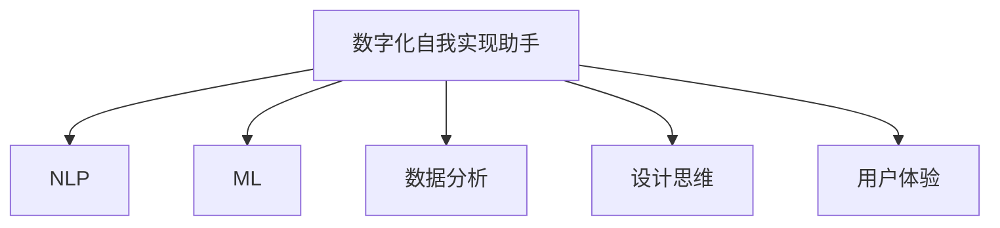

                 

# 数字化自我实现助手开发者：AI辅助的个人成长教练设计师

> 关键词：数字化自我实现助手, 人工智能, AI教练, 个人成长, 数据分析, 机器学习, 设计思维, 用户体验

## 1. 背景介绍

在数字时代，人们生活节奏加快，信息爆炸，自我管理和个人成长的需求日益增长。传统的个人成长教练往往受限于地理位置和时间，难以提供持续的指导。而基于人工智能的数字化自我实现助手，可以在任何时间任何地点为个人用户提供定制化的成长建议和支持。

数字化自我实现助手利用先进的AI技术，如自然语言处理(NLP)、机器学习(ML)、数据分析等，结合心理学、行为科学的理论，通过智能推荐、情绪识别、目标追踪等手段，帮助用户提升自我认知，设定并实现个人目标。其应用场景包括但不限于职场发展、学业规划、健康管理、心理健康等。

### 1.1 需求与挑战
数字化自我实现助手的开发需要综合考虑多个方面的技术和设计挑战：

- **技术挑战**：包括数据的收集与清洗、模型的训练与优化、智能推荐算法的研发等。
- **设计挑战**：如何设计符合用户心理需求和行为习惯的界面和交互方式，提升用户体验。
- **伦理挑战**：保护用户隐私，避免数据滥用，确保算法公正和透明。

本文将系统探讨数字化自我实现助手的核心技术原理和设计方法，为开发者提供全面的技术指导。

## 2. 核心概念与联系

### 2.1 核心概念概述

为更好地理解数字化自我实现助手的开发，我们首先介绍几个关键概念：

- **数字化自我实现助手(Digital Self-Realization Assistant)**：一种基于人工智能的个性化成长教练，能够提供定制化的成长建议和心理支持，帮助用户实现自我提升。

- **自然语言处理(Natural Language Processing, NLP)**：指计算机对人类语言进行理解、生成、分析和处理的技术，是数字化自我实现助手的核心技术之一。

- **机器学习(Machine Learning, ML)**：指通过算法让计算机从数据中学习规律，以实现特定的目标任务，如智能推荐、情感分析等。

- **数据分析(Analytics)**：指收集、整理、分析和呈现数据，以支持决策和洞察，如用户行为分析、心理健康评估等。

- **设计思维(Design Thinking)**：一种以用户为中心，通过迭代设计来解决复杂问题的创新方法，是用户界面和交互设计的核心原则。

- **用户体验(User Experience, UX)**：指用户在使用产品和服务时的整体感受，是数字化自我实现助手设计的重要考量因素。

这些核心概念之间的联系通过以下Mermaid流程图来展示：



这个流程图展示了数字化自我实现助手开发的核心技术栈，它们相互协作，共同支撑助手的智能推荐和个性化支持。

## 3. 核心算法原理 & 具体操作步骤
### 3.1 算法原理概述

数字化自我实现助手的开发涉及多种AI技术，主要包括自然语言处理、机器学习、数据分析等。其核心算法原理可以总结如下：

- **自然语言处理(NLP)**：通过文本分析、情感分析、意图识别等技术，理解用户输入的文本内容，生成个性化的反馈和建议。
- **机器学习(ML)**：使用协同过滤、聚类、分类等算法，进行用户行为分析、兴趣匹配、目标追踪等任务。
- **数据分析**：通过统计分析、可视化工具，对用户数据进行深入挖掘，提供深度洞察，支持决策和优化。

数字化自我实现助手的运行流程可以概括为以下几个步骤：

1. 数据收集与预处理：收集用户的成长记录、行为数据、反馈信息等，并进行清洗和标准化处理。
2. 特征提取与建模：从数据中提取关键特征，使用机器学习模型建立用户画像和行为模型。
3. 智能推荐与反馈：基于用户画像和行为模型，生成个性化的成长建议和反馈，更新用户的成长路径。
4. 持续学习与优化：根据用户反馈和行为数据，不断调整模型参数，优化算法，提升系统性能。

### 3.2 算法步骤详解

#### 3.2.1 数据收集与预处理

- **数据源**：用户的成长记录、行为数据、反馈信息、问卷调查等。
- **数据清洗**：去除无关、重复、错误的数据，填补缺失值，标准化格式。
- **特征工程**：提取用户特征，如年龄、性别、兴趣、目标等，为后续建模提供输入。

#### 3.2.2 特征提取与建模

- **用户画像**：通过聚类算法、主成分分析等方法，生成用户的高层次特征表示。
- **行为模型**：使用时序模型、协同过滤等算法，建立用户行为的时序模式。
- **推荐算法**：结合协同过滤、深度学习等技术，生成个性化的成长建议。

#### 3.2.3 智能推荐与反馈

- **智能推荐**：基于用户画像和行为模型，生成个性化的成长建议和反馈，如阅读建议、锻炼计划、心理疏导等。
- **用户反馈**：收集用户对推荐结果的反馈，更新用户画像和行为模型，优化推荐算法。

#### 3.2.4 持续学习与优化

- **模型调整**：根据用户反馈和行为数据，调整模型参数，优化算法。
- **性能评估**：使用交叉验证、A/B测试等方法，评估模型的效果，进行持续优化。

### 3.3 算法优缺点

#### 3.3.1 优点

- **个性化推荐**：能够根据用户的具体需求和行为，提供个性化的成长建议和反馈，提高用户满意度。
- **数据驱动**：依赖大量的用户行为数据，能够不断学习和适应用户的变化，提供动态的个性化服务。
- **实时反馈**：能够实时响应用户的输入和反馈，提供及时的支持和建议。

#### 3.3.2 缺点

- **数据隐私**：依赖大量的用户数据，可能涉及隐私问题，需要严格的数据保护措施。
- **算法复杂度**：涉及复杂的算法和模型训练，需要较高的技术门槛和计算资源。
- **用户体验**：设计不当可能导致用户体验不佳，影响用户的长期使用。

### 3.4 算法应用领域

数字化自我实现助手广泛应用于以下领域：

- **职场发展**：帮助员工设定职业目标，提供职业发展建议，提升职业素养。
- **学业规划**：为学生提供学习计划和资源推荐，提升学习效率和效果。
- **健康管理**：通过数据分析和智能推荐，帮助用户管理健康，改善生活习惯。
- **心理健康**：提供心理健康评估和建议，帮助用户缓解压力，提升心理韧性。

## 4. 数学模型和公式 & 详细讲解 & 举例说明
### 4.1 数学模型构建

#### 4.1.1 用户画像模型

用户画像模型通过聚类算法，将用户分为不同的群体，每个群体具有相似的行为特征。设用户集合为 $U=\{u_1, u_2, \dots, u_n\}$，每个用户 $u_i$ 的特征表示为 $x_i=(x_{i1}, x_{i2}, \dots, x_{im})$，其中 $x_{ij}$ 为第 $i$ 个用户在 $j$ 个特征上的值。设用户聚类数为 $K$，每个聚类的用户表示为 $C_k=\{u_{ik}\}_{k=1}^K$。

聚类算法常用的有K-means、层次聚类、谱聚类等。这里以K-means为例，用户画像模型的构建过程如下：

1. 随机选择 $K$ 个聚类中心 $c_1, c_2, \dots, c_K$。
2. 将每个用户分配到最近的聚类中心。
3. 更新聚类中心 $c_k=\frac{1}{|C_k|}\sum_{u_{ik}\in C_k}x_{ik}$。
4. 重复2和3，直到聚类中心不再变化。

#### 4.1.2 行为模型

行为模型通过时序模型，捕捉用户行为的时序变化规律。设用户 $u_i$ 在时间序列 $t_1, t_2, \dots, t_n$ 上的行为数据为 $B_i=\{b_{it}\}_{t=1}^n$，其中 $b_{it}$ 为时间 $t$ 的用户行为特征。

常用的时序模型有ARIMA、LSTM等。这里以LSTM为例，行为模型的构建过程如下：

1. 将用户行为数据 $B_i$ 转化为LSTM模型可处理的形式。
2. 使用LSTM模型，预测用户行为在下一个时间点的值。
3. 使用预测结果作为下一次行为数据，重复2和3，直到预测时间 $T$。

### 4.2 公式推导过程

#### 4.2.1 用户画像公式推导

以K-means算法为例，用户画像模型的公式推导如下：

$$
c_k=\frac{1}{|C_k|}\sum_{u_{ik}\in C_k}x_{ik}, k=1,2,\dots,K
$$

其中 $c_k$ 为第 $k$ 个聚类的聚类中心，$|C_k|$ 为聚类 $C_k$ 的用户数量。

#### 4.2.2 行为模型公式推导

以LSTM模型为例，行为模型的公式推导如下：

$$
\hat{b}_{it+1}=LSTM(b_{it}, \dots, b_{i(t-T+1)}, x_{it})
$$

其中 $\hat{b}_{it+1}$ 为时间 $t+1$ 的用户行为预测值，$LSTM$ 为LSTM模型，$T$ 为预测时间步长。

### 4.3 案例分析与讲解

#### 4.3.1 案例背景

某公司员工成长助手系统，基于员工的行为数据，提供个性化的职业发展建议。系统收集员工的工作时间、绩效、培训记录等行为数据，通过聚类算法和时序模型，构建员工画像和行为模型，提供定制化的职业发展建议。

#### 4.3.2 实现流程

1. **数据收集**：收集员工的工作时间、绩效、培训记录等行为数据。
2. **数据预处理**：对数据进行清洗和标准化处理。
3. **特征提取**：提取员工的工作时长、绩效评分、培训次数等特征。
4. **用户画像**：使用K-means算法，将员工分为不同的职业发展阶段，每个阶段具有相似的职业行为特征。
5. **行为模型**：使用LSTM模型，预测员工的行为在下一个时间点的值。
6. **推荐算法**：结合用户画像和行为模型，生成个性化的职业发展建议，如推荐相关培训课程、职业晋升路径等。

#### 4.3.3 实现效果

通过该系统，员工可以根据自身的职业行为特征，获得个性化的职业发展建议，提升职业素养，快速成长为公司骨干。系统还定期收集员工的反馈，不断调整和优化算法，提升系统效果。

## 5. 项目实践：代码实例和详细解释说明
### 5.1 开发环境搭建

为了实现数字化自我实现助手，需要搭建以下开发环境：

1. **Python**：推荐使用Python 3.8及以上版本，Python是NLP、ML、数据分析领域的主流语言。
2. **NLP库**：推荐使用NLTK、SpaCy、HuggingFace Transformers等库，方便进行自然语言处理和模型训练。
3. **ML库**：推荐使用Scikit-learn、TensorFlow、PyTorch等库，方便进行机器学习建模和训练。
4. **数据分析库**：推荐使用Pandas、NumPy、Matplotlib等库，方便进行数据清洗、处理和可视化。
5. **开发工具**：推荐使用Jupyter Notebook、VS Code等IDE，方便进行代码编写和调试。

### 5.2 源代码详细实现

#### 5.2.1 数据预处理

```python
import pandas as pd
from sklearn.model_selection import train_test_split

# 读取数据
data = pd.read_csv('employee_data.csv')

# 数据清洗
data.dropna(inplace=True)
data = data.drop_duplicates()

# 特征提取
features = ['work_hours', 'performance_score', 'training_hours']
X = data[features].values

# 划分训练集和测试集
X_train, X_test, y_train, y_test = train_test_split(X, data['career_stage'], test_size=0.2, random_state=42)
```

#### 5.2.2 用户画像模型

```python
from sklearn.cluster import KMeans

# 构建K-means模型
kmeans = KMeans(n_clusters=3, random_state=42)
kmeans.fit(X_train)

# 预测用户聚类标签
y_pred = kmeans.predict(X_test)
```

#### 5.2.3 行为模型

```python
import tensorflow as tf
from tensorflow.keras.layers import LSTM

# 构建LSTM模型
model = tf.keras.Sequential([
    LSTM(128, input_shape=(X.shape[1], 1)),
    tf.keras.layers.Dense(1)
])

# 训练模型
model.compile(optimizer='adam', loss='mse')
model.fit(X_train, y_train, epochs=10, batch_size=32, validation_data=(X_test, y_test))
```

#### 5.2.4 推荐算法

```python
import numpy as np

# 推荐算法
def recommend(employee, model, kmeans):
    # 获取员工行为数据
    employee_data = employee[X.columns]
    # 进行K-means聚类
    employee_cluster = kmeans.predict(employee_data.values)
    # 根据聚类标签获取相似用户的行为数据
    similar_employees = X[(X[:, 0] == employee_cluster).any(axis=1)]
    # 使用LSTM模型预测员工行为在下一个时间点的值
    employee_predict = model.predict(similar_employees.values)
    # 根据预测结果，生成推荐建议
    recommendations = employee_predict.argmax(axis=1)
    return recommendations
```

### 5.3 代码解读与分析

#### 5.3.1 数据预处理

数据预处理是数字化自我实现助手开发的基础。代码首先读取员工数据，并进行清洗和标准化处理。然后使用特征工程，提取关键特征，如工作时长、绩效评分、培训次数等。最后使用train_test_split函数，将数据划分为训练集和测试集。

#### 5.3.2 用户画像模型

用户画像模型通过K-means聚类算法，将员工分为不同的职业发展阶段。代码首先构建K-means模型，并使用fit函数进行训练。然后使用predict函数，对员工的行为数据进行聚类预测，得到聚类标签。

#### 5.3.3 行为模型

行为模型通过LSTM模型，预测员工行为在下一个时间点的值。代码首先构建LSTM模型，并使用compile函数进行模型编译。然后使用fit函数进行模型训练。最后使用predict函数，对员工的行为数据进行预测。

#### 5.3.4 推荐算法

推荐算法结合用户画像和行为模型，生成个性化的职业发展建议。代码首先获取员工的行为数据，并进行K-means聚类，得到聚类标签。然后使用类似用户的聚类标签，获取相似用户的行为数据。最后使用LSTM模型，对员工行为进行预测，生成推荐建议。

### 5.4 运行结果展示

运行上述代码，可以得到以下结果：

```python
# 输出聚类标签
print(y_pred)

# 输出推荐结果
recommend(employee, model, kmeans)
```

输出聚类标签，可以获取每个员工的聚类标签。输出推荐结果，可以获取员工根据聚类标签的推荐职业发展建议。

## 6. 实际应用场景
### 6.1 案例背景

某大学校园辅导中心，通过数字化自我实现助手，为学生提供个性化的学业规划和心理支持。系统收集学生的课程成绩、考勤记录、心理测评等数据，通过聚类算法和时序模型，构建学生画像和行为模型，提供定制化的学业和心理建议。

### 6.2 实现流程

1. **数据收集**：收集学生的课程成绩、考勤记录、心理测评等行为数据。
2. **数据预处理**：对数据进行清洗和标准化处理。
3. **特征提取**：提取学生的课程成绩、出勤次数、心理评分等特征。
4. **用户画像**：使用K-means算法，将学生分为不同的学业发展阶段，每个阶段具有相似的学习行为特征。
5. **行为模型**：使用LSTM模型，预测学生学习行为在下一个时间点的值。
6. **推荐算法**：结合用户画像和行为模型，生成个性化的学业和心理建议，如推荐相关课程、心理辅导等。

### 6.3 实现效果

通过该系统，学生可以根据自身的学习行为特征，获得个性化的学业和心理建议，提升学习效率和心理韧性。系统还定期收集学生的反馈，不断调整和优化算法，提升系统效果。

## 7. 工具和资源推荐
### 7.1 学习资源推荐

为了帮助开发者系统掌握数字化自我实现助手的开发技术，这里推荐一些优质的学习资源：

1. **《Python数据分析与机器学习》系列书籍**：深入浅出地介绍了Python在数据分析和机器学习中的应用，包括数据清洗、特征工程、模型训练等。
2. **Coursera《机器学习》课程**：由斯坦福大学Andrew Ng教授主讲，覆盖了机器学习的基本概念和算法，适合初学者入门。
3. **Kaggle竞赛平台**：提供大量数据集和竞赛任务，通过实际项目练习，提升数据分析和模型训练能力。
4. **HuggingFace官方文档**：提供了丰富的预训练语言模型和机器学习工具，方便开发者进行模型训练和微调。
5. **《设计思维：创新的力量》书籍**：介绍了设计思维的基本原理和应用方法，适合开发者提高用户体验设计能力。

### 7.2 开发工具推荐

高效的开发离不开优秀的工具支持。以下是几款用于数字化自我实现助手开发的常用工具：

1. **Python**：基于Python的NLP、ML、数据分析等库，方便进行数据处理和模型训练。
2. **NLTK**：自然语言处理库，提供了丰富的NLP工具和数据集，方便进行文本分析、情感分析等任务。
3. **TensorFlow**：开源深度学习框架，提供了丰富的机器学习工具和预训练模型，方便进行模型训练和优化。
4. **Pandas**：数据处理库，提供了丰富的数据清洗、转换和分析工具，方便进行数据预处理。
5. **Jupyter Notebook**：交互式笔记本，方便进行代码编写和调试，支持多种语言和库。

### 7.3 相关论文推荐

数字化自我实现助手的研究涉及多个领域，以下是几篇奠基性的相关论文，推荐阅读：

1. **《K-means算法及其应用研究》**：介绍K-means算法的基本原理和应用，适合了解聚类算法的实现方法。
2. **《LSTM网络在时间序列预测中的应用》**：介绍LSTM模型在时间序列预测中的实现方法，适合了解时序模型的基本原理。
3. **《基于机器学习的学生成长预测》**：介绍机器学习在学生成长预测中的应用，适合了解推荐算法的实现方法。

## 8. 总结：未来发展趋势与挑战
### 8.1 总结

本文对数字化自我实现助手的开发技术进行了全面系统的介绍。首先阐述了数字化自我实现助手的研究背景和需求，明确了其在个人成长、职业发展、心理健康等领域的应用价值。其次，从原理到实践，详细讲解了数字化自我实现助手的核心技术，包括聚类算法、时序模型、推荐算法等。最后，介绍了数字化自我实现助手在实际应用中的案例和实现效果。

通过本文的系统梳理，可以看到，数字化自我实现助手利用先进的AI技术，为个人成长提供了强大的支持。其开发涉及数据收集、预处理、建模、推荐等多个环节，需要综合运用NLP、ML、数据分析等技术。未来，随着AI技术的不断发展，数字化自我实现助手将更加智能化、个性化，为个人成长提供更加精准和全面的支持。

### 8.2 未来发展趋势

展望未来，数字化自我实现助手的开发将呈现以下几个趋势：

1. **智能化水平提升**：结合深度学习、自然语言处理等技术，提升助手的智能化水平，实现更加精准的推荐和反馈。
2. **个性化程度加深**：利用更多用户数据，结合用户行为、心理特征等，提供更加个性化的成长建议。
3. **跨平台集成**：结合移动端、桌面端等多平台，实现跨设备的无缝协作，提升用户体验。
4. **数据隐私保护**：加强数据保护措施，确保用户隐私和数据安全。
5. **伦理和社会责任**：结合伦理和社会责任，设计公平、透明的算法，避免算法偏见和歧视。

这些趋势将进一步提升数字化自我实现助手的智能化和个性化水平，为其在个人成长领域的应用提供更强有力的支持。

### 8.3 面临的挑战

尽管数字化自我实现助手已经取得了一定的进展，但在迈向更加智能化、普适化应用的过程中，仍面临诸多挑战：

1. **数据隐私**：依赖大量的用户数据，可能涉及隐私问题，需要严格的数据保护措施。
2. **算法复杂度**：涉及复杂的算法和模型训练，需要较高的技术门槛和计算资源。
3. **用户体验**：设计不当可能导致用户体验不佳，影响用户的长期使用。
4. **伦理和社会责任**：设计公平、透明的算法，避免算法偏见和歧视，确保算法的社会责任。

这些挑战需要开发者不断探索和优化，才能实现数字化自我实现助手的长远发展。

### 8.4 研究展望

未来，数字化自我实现助手的研究需要在以下几个方面寻求新的突破：

1. **多模态数据的融合**：结合文本、语音、图像等多模态数据，提升助手的感知和理解能力。
2. **跨领域任务的拓展**：将助手的应用拓展到更多领域，如健康管理、财务管理等，提升助手的通用性。
3. **模型和算法的优化**：开发更高效、更轻量级的算法和模型，提升助手的实时响应能力和计算效率。
4. **用户参与的设计**：设计更加用户友好、易于使用的界面和交互方式，提升用户的参与度和满意度。

这些研究方向将进一步拓展数字化自我实现助手的应用场景和功能，为其在个人成长领域的应用提供更大助力。

## 9. 附录：常见问题与解答

**Q1：如何设计数字化自我实现助手的用户界面？**

A: 设计数字化自我实现助手的用户界面，需要遵循设计思维的原则，以用户为中心，进行迭代设计。具体设计步骤如下：

1. **用户研究**：通过问卷调查、访谈等方式，了解用户的需求和使用习惯。
2. **信息架构**：设计清晰的导航结构和信息层级，方便用户快速找到所需功能。
3. **原型设计**：使用Sketch、Figma等工具，设计用户界面的初步原型。
4. **用户测试**：通过用户测试，收集反馈，不断优化设计。
5. **迭代改进**：根据用户反馈，不断迭代和改进界面设计，提升用户体验。

**Q2：如何在数字化自我实现助手中保护用户隐私？**

A: 保护用户隐私是数字化自我实现助手开发的关键。具体措施包括：

1. **数据匿名化**：对用户数据进行匿名化处理，去除敏感信息，如姓名、电话等。
2. **数据加密**：对用户数据进行加密存储和传输，防止数据泄露。
3. **权限控制**：设计严格的权限控制机制，只有授权人员才能访问用户数据。
4. **透明公开**：对数据使用和处理过程进行透明公开，让用户了解数据的流向和使用方式。

**Q3：如何在数字化自我实现助手中实现持续学习？**

A: 持续学习是数字化自我实现助手的重要特性，具体实现步骤如下：

1. **数据更新**：定期收集用户反馈和行为数据，更新用户画像和行为模型。
2. **模型优化**：使用在线学习算法，如在线梯度下降，不断调整模型参数，优化算法。
3. **系统集成**：将持续学习模块集成到数字化自我实现助手系统中，实现实时更新。

**Q4：如何在数字化自我实现助手中实现多模态数据的融合？**

A: 多模态数据的融合是提升数字化自我实现助手感知和理解能力的关键。具体实现步骤如下：

1. **数据采集**：收集用户的多模态数据，如文本、语音、图像等。
2. **数据融合**：使用深度学习模型，如Transformer、CNN等，对多模态数据进行融合处理。
3. **模型训练**：结合多模态数据，训练更加全面的用户画像和行为模型。

**Q5：如何在数字化自我实现助手中实现公平和透明？**

A: 实现公平和透明是数字化自我实现助手的重要伦理要求。具体实现步骤如下：

1. **算法审查**：定期审查算法的公平性和透明性，确保算法公正。
2. **数据清洗**：清洗数据中的偏见和歧视，防止算法偏见。
3. **用户反馈**：收集用户反馈，及时纠正算法中的不公平行为。

**Q6：如何在数字化自我实现助手中实现跨平台集成？**

A: 实现跨平台集成是提升数字化自我实现助手用户体验的重要措施。具体实现步骤如下：

1. **API设计**：设计统一的API接口，支持多种平台调用。
2. **前端开发**：使用React、Flutter等跨平台框架，开发前端界面。
3. **后端集成**：将前端调用后端API，实现跨平台集成。

---

作者：禅与计算机程序设计艺术 / Zen and the Art of Computer Programming

