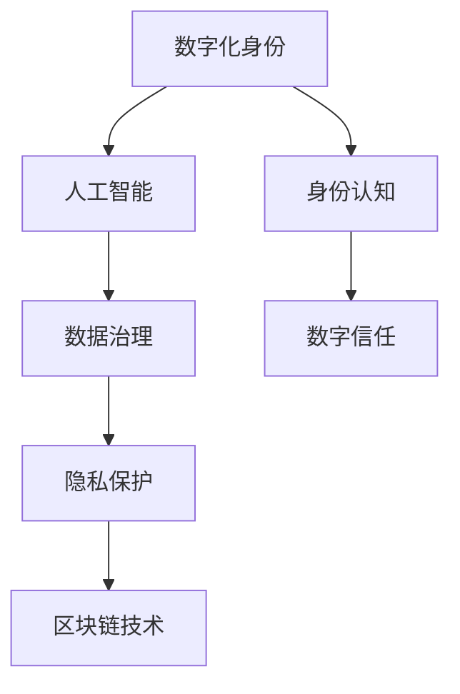

                 

# 数字化身份：AI时代的自我认知

> 关键词：数字化身份, AI认知, 人工智能, 隐私保护, 数据治理, 区块链技术, 数字信任

## 1. 背景介绍

### 1.1 问题由来
随着科技的飞速发展，特别是人工智能技术的日渐成熟，数字化身份成为社会信息化进程中不可或缺的一环。从传统的ID卡、电子支付到近年的电子身份认证、区块链技术，数字化身份不断拓展着人类社会的生活方式。然而，数字化身份的普及也带来了新的问题：隐私保护、数据安全、身份真实性等。

这些问题如何被解决，已成为众多技术专家和政策制定者共同关心的热点。尤其是在AI时代，如何利用AI技术提升身份认知和治理水平，是当前的重要研究方向。本文将围绕数字化身份的AI时代认知，从理论到实践进行全面系统的探讨，帮助读者深入理解数字化身份的核心价值和前沿技术。

## 2. 核心概念与联系

### 2.1 核心概念概述

为更好地理解数字化身份在AI时代的应用，本节将介绍几个密切相关的核心概念：

- 数字化身份：通过数字技术手段，对真实身份进行记录、验证和证明。包括生物特征识别、电子证书、智能合约等。
- 身份认知：通过数字化技术，对身份信息进行验证、认证和识别。
- 人工智能：以数据和算法为基础，让机器具备感知、学习、推理等能力，从而实现智能决策。
- 数据治理：包括数据收集、存储、处理、共享等环节的管理和规范。
- 隐私保护：在处理数据和身份信息时，保护个人隐私不被滥用。
- 区块链技术：一种去中心化、不可篡改的数据存储和交换技术，常用于身份管理和数字信任。
- 数字信任：在数字化身份的基础上，建立基于信任的网络和关系。

这些核心概念之间的逻辑关系可以通过以下Mermaid流程图来展示：



这个流程图展示了大数字化身份的核心概念及其之间的关系：

1. 数字化身份是身份认知的基础，通过数字技术将真实身份映射到网络世界。
2. 人工智能辅助身份认知，帮助在复杂数据中高效验证身份。
3. 数据治理规范数据处理流程，确保身份信息的准确性和完整性。
4. 隐私保护在数据处理过程中保护个人隐私，防止数据滥用。
5. 区块链技术为身份信息的不可篡改性提供了技术保障。
6. 数字信任建立在可靠身份基础上，保障网络互动的信任关系。

这些概念共同构成了数字化身份的AI时代认知框架，使其在身份管理和网络互动中发挥重要作用。通过理解这些核心概念，我们可以更好地把握数字化身份技术的工作原理和应用场景。

## 3. 核心算法原理 & 具体操作步骤
### 3.1 算法原理概述

基于AI的数字化身份认知，本质上是一种智能数据处理和验证过程。其核心思想是：利用AI技术对身份数据进行预处理、特征提取、模式识别和验证，从而实现高效的身份认知。

形式化地，假设数字化身份数据为 $D$，身份认知模型为 $M_{\theta}$，其中 $\theta$ 为模型参数。则身份认知的目标是找到最优模型参数 $\hat{\theta}$，使得：

$$
\hat{\theta}=\mathop{\arg\min}_{\theta} \mathcal{L}(M_{\theta},D)
$$

其中 $\mathcal{L}$ 为针对身份数据的损失函数，用于衡量模型预测输出与真实标签之间的差异。常见的损失函数包括交叉熵损失、均方误差损失等。

通过梯度下降等优化算法，身份认知过程不断更新模型参数 $\theta$，最小化损失函数 $\mathcal{L}$，使得模型输出逼近真实标签。由于 $\theta$ 已经通过深度学习获得了较好的初始化，因此即便在少量标注数据上进行认知，也能较快收敛到理想的模型参数 $\hat{\theta}$。

### 3.2 算法步骤详解

基于AI的数字化身份认知一般包括以下几个关键步骤：

**Step 1: 数据预处理**
- 收集身份数据 $D$，包括各类数字证书、身份证件、生物特征等。
- 清洗和标准化数据，去除噪声和不一致，归一化数据格式。
- 使用特征提取技术，如PCA、LDA等，提取数据的关键特征。

**Step 2: 建立AI模型**
- 选择合适的AI模型架构，如CNN、RNN、GAN等，用于身份验证和识别。
- 使用大规模标注数据进行预训练，学习身份数据的通用特征。
- 添加任务适配层，如全连接层、softmax层等，适配具体身份识别任务。

**Step 3: 设置训练超参数**
- 选择合适的优化算法及其参数，如SGD、Adam等，设置学习率、批大小、迭代轮数等。
- 设置正则化技术及强度，包括权重衰减、Dropout、Early Stopping等。
- 确定冻结预训练参数的策略，如仅微调顶层，或全部参数都参与微调。

**Step 4: 执行认知训练**
- 将训练集数据分批次输入模型，前向传播计算损失函数。
- 反向传播计算参数梯度，根据设定的优化算法和学习率更新模型参数。
- 周期性在验证集上评估模型性能，根据性能指标决定是否触发 Early Stopping。
- 重复上述步骤直到满足预设的迭代轮数或 Early Stopping 条件。

**Step 5: 测试和部署**
- 在测试集上评估认知后模型 $M_{\hat{\theta}}$ 的性能，对比认知前后的精度提升。
- 使用认知后模型对新样本进行推理预测，集成到实际的应用系统中。
- 持续收集新的数据，定期重新认知模型，以适应数据分布的变化。

以上是基于AI的数字化身份认知的一般流程。在实际应用中，还需要针对具体身份类型的特点，对认知过程的各个环节进行优化设计，如改进训练目标函数，引入更多的正则化技术，搜索最优的超参数组合等，以进一步提升模型性能。

### 3.3 算法优缺点

基于AI的数字化身份认知方法具有以下优点：
1. 高效准确。通过深度学习和特征提取，能够在复杂数据中高效地识别和验证身份。
2. 自动学习。模型的泛化能力和适应性更强，能够灵活处理不同类型和分布的身份数据。
3. 数据依赖低。相比传统的基于规则的身份验证方法，AI认知对标注数据的依赖较少。
4. 鲁棒性强。深度学习模型的参数调整和正则化技术，能够有效避免模型过拟合。

同时，该方法也存在一定的局限性：
1. 初始化要求高。预训练模型对数据质量和训练集规模要求较高，初期成本较高。
2. 计算资源需求大。深度学习模型的训练和推理计算资源需求较大，对硬件环境要求较高。
3. 安全性问题。深度学习模型的复杂性可能导致模型被攻击，身份数据泄露风险较高。
4. 解释性不足。深度学习模型通常是"黑盒"系统，难以解释其内部工作机制和决策逻辑。

尽管存在这些局限性，但就目前而言，基于AI的身份认知方法仍是身份管理技术的重要发展方向。未来相关研究的重点在于如何进一步降低认知对初始化和硬件的需求，提高模型的可解释性和安全性，以及优化模型的性能和效率。

### 3.4 算法应用领域

基于AI的身份认知方法，在身份管理领域已经得到了广泛的应用，涵盖了从身份证认证到电子支付、从生物特征识别到数字身份证书等诸多场景。以下是一些典型的应用实例：

- 银行身份认证：利用人脸识别和指纹识别，实时验证客户身份，保障交易安全。
- 政府身份核查：通过身份证件和护照扫描，自动核查公民身份，提高行政效率。
- 数字身份证书：使用数字签名和公钥加密技术，验证个人身份和数字文档的真实性。
- 在线支付：结合数字指纹和行为识别，识别用户身份，防止欺诈。
- 生物特征识别：利用指纹、虹膜、面部等生物特征，验证身份信息，保障信息安全。

除了上述这些经典应用外，AI身份认知技术还在医疗、保险、物流、社交等领域得到了广泛应用，提升了相关行业的智能化水平，提高了工作效率。

## 4. 数学模型和公式 & 详细讲解  
### 4.1 数学模型构建

本节将使用数学语言对基于AI的数字化身份认知过程进行更加严格的刻画。

记身份数据为 $D=\{x_i,y_i\}_{i=1}^N$，其中 $x_i$ 为身份数据，$y_i$ 为对应的标签（如1表示真实身份，0表示伪造身份）。定义模型 $M_{\theta}$ 在输入 $x_i$ 上的输出为 $\hat{y}_i=M_{\theta}(x_i) \in [0,1]$，表示模型预测 $x_i$ 为真实身份的概率。

则二分类交叉熵损失函数定义为：

$$
\ell(M_{\theta}(x_i),y_i) = -[y_i\log \hat{y}_i + (1-y_i)\log(1-\hat{y}_i)]
$$

其中，$y_i \in \{0,1\}$ 为标签，$\hat{y}_i \in [0,1]$ 为模型预测值。

在实际应用中，我们通常使用基于梯度的优化算法（如SGD、Adam等）来近似求解上述最优化问题。设 $\eta$ 为学习率，$\lambda$ 为正则化系数，则参数的更新公式为：

$$
\theta \leftarrow \theta - \eta \nabla_{\theta}\mathcal{L}(\theta) - \eta\lambda\theta
$$

其中 $\nabla_{\theta}\mathcal{L}(\theta)$ 为损失函数对参数 $\theta$ 的梯度，可通过反向传播算法高效计算。

### 4.2 公式推导过程

以下我们以人脸识别为例，推导二分类交叉熵损失函数及其梯度的计算公式。

假设模型 $M_{\theta}$ 在输入 $x$ 上的输出为 $\hat{y}=M_{\theta}(x) \in [0,1]$，表示样本为真实身份的概率。真实标签 $y \in \{0,1\}$。则二分类交叉熵损失函数定义为：

$$
\ell(M_{\theta}(x),y) = -[y\log \hat{y}_i + (1-y)\log(1-\hat{y}_i)]
$$

将其代入经验风险公式，得：

$$
\mathcal{L}(\theta) = -\frac{1}{N}\sum_{i=1}^N [y_i\log M_{\theta}(x_i)+(1-y_i)\log(1-M_{\theta}(x_i))]
$$

根据链式法则，损失函数对参数 $\theta_k$ 的梯度为：

$$
\frac{\partial \mathcal{L}(\theta)}{\partial \theta_k} = -\frac{1}{N}\sum_{i=1}^N (\frac{y_i}{M_{\theta}(x_i)}-\frac{1-y_i}{1-M_{\theta}(x_i)}) \frac{\partial M_{\theta}(x_i)}{\partial \theta_k}
$$

其中 $\frac{\partial M_{\theta}(x_i)}{\partial \theta_k}$ 可进一步递归展开，利用自动微分技术完成计算。

在得到损失函数的梯度后，即可带入参数更新公式，完成模型的迭代优化。重复上述过程直至收敛，最终得到适应身份验证的最优模型参数 $\theta^*$。

## 5. 项目实践：代码实例和详细解释说明
### 5.1 开发环境搭建

在进行身份认知实践前，我们需要准备好开发环境。以下是使用Python进行TensorFlow开发的环境配置流程：

1. 安装Anaconda：从官网下载并安装Anaconda，用于创建独立的Python环境。

2. 创建并激活虚拟环境：
```bash
conda create -n tf-env python=3.8 
conda activate tf-env
```

3. 安装TensorFlow：从官网获取对应的安装命令。例如：
```bash
pip install tensorflow==2.6
```

4. 安装Keras：
```bash
pip install keras
```

5. 安装各类工具包：
```bash
pip install numpy pandas scikit-learn matplotlib tqdm jupyter notebook ipython
```

完成上述步骤后，即可在`tf-env`环境中开始身份认知实践。

### 5.2 源代码详细实现

下面我以人脸识别任务为例，给出使用TensorFlow和Keras对卷积神经网络(CNN)进行身份认知的代码实现。

首先，定义数据处理函数：

```python
from tensorflow.keras.preprocessing.image import ImageDataGenerator
from tensorflow.keras.utils import to_categorical
from tensorflow.keras.preprocessing import image

train_datagen = ImageDataGenerator(rescale=1./255,
                                  shear_range=0.2,
                                  zoom_range=0.2,
                                  horizontal_flip=True)
test_datagen = ImageDataGenerator(rescale=1./255)

train_generator = train_datagen.flow_from_directory(
        'train_dir',
        target_size=(150, 150),
        batch_size=32,
        class_mode='binary')
test_generator = test_datagen.flow_from_directory(
        'test_dir',
        target_size=(150, 150),
        batch_size=32,
        class_mode='binary')
```

然后，定义模型和优化器：

```python
from tensorflow.keras.models import Sequential
from tensorflow.keras.layers import Conv2D, MaxPooling2D, Flatten, Dense

model = Sequential()
model.add(Conv2D(32, (3, 3), input_shape=(150, 150, 3), activation='relu'))
model.add(MaxPooling2D(pool_size=(2, 2)))
model.add(Conv2D(64, (3, 3), activation='relu'))
model.add(MaxPooling2D(pool_size=(2, 2)))
model.add(Flatten())
model.add(Dense(64, activation='relu'))
model.add(Dense(1, activation='sigmoid'))

optimizer = Adam(lr=0.001)
```

接着，定义训练和评估函数：

```python
from tensorflow.keras.optimizers import Adam

def train_model(model, train_generator, validation_generator, epochs=50, batch_size=32):
    model.compile(optimizer=Adam(lr=0.001), loss='binary_crossentropy', metrics=['accuracy'])
    history = model.fit(train_generator, epochs=epochs, validation_data=validation_generator)
    return history

def evaluate_model(model, test_generator, batch_size=32):
    test_loss, test_acc = model.evaluate(test_generator, batch_size=batch_size)
    print(f'Test Loss: {test_loss:.4f}')
    print(f'Test Accuracy: {test_acc:.4f}')
```

最后，启动训练流程并在测试集上评估：

```python
epochs = 50
batch_size = 32

history = train_model(model, train_generator, validation_generator, epochs, batch_size)

evaluate_model(model, test_generator, batch_size)
```

以上就是使用TensorFlow和Keras对卷积神经网络进行人脸识别任务身份认知的完整代码实现。可以看到，利用Keras封装后的模型构建和训练过程相对简洁，可以快速上手实验。

### 5.3 代码解读与分析

让我们再详细解读一下关键代码的实现细节：

**ImageDataGenerator类**：
- 定义了两个ImageDataGenerator实例，分别用于训练集和测试集的数据生成。
- 通过调用`flow_from_directory`方法，从指定目录中加载图片，并进行数据增强，如缩放、剪切、旋转等操作。
- 指定目标图片大小、批大小和标签方式，最终生成可用于模型训练的批次数据。

**Sequential模型构建**：
- 定义了一个Sequential模型，依次添加卷积层、池化层和全连接层，形成多层感知器结构。
- 卷积层和池化层用于提取图像特征，全连接层用于分类。
- 激活函数使用ReLU，输出层使用sigmoid，用于二分类任务。

**训练函数train_model**：
- 使用`compile`方法，指定优化器、损失函数和评价指标。
- 使用`fit`方法进行模型训练，传入训练生成器和验证生成器，设定训练轮数。
- 返回训练过程的history对象，用于后续评估和可视化。

**评估函数evaluate_model**：
- 使用`evaluate`方法对测试集进行模型评估，输出测试集损失和准确率。
- 调用`print`函数输出评估结果。

可以看到，通过这些关键代码，我们能够快速搭建并训练一个基于卷积神经网络的身份认知模型。然而，工业级的系统实现还需考虑更多因素，如模型的保存和部署、超参数的自动搜索、模型压缩与优化等，但核心的身份认知范式基本与此类似。

## 6. 实际应用场景
### 6.1 智能银行服务

智能银行服务是AI身份认知的重要应用之一。利用深度学习技术，银行可以在线核实客户的身份信息，实现实时交易和金融服务。例如，通过人脸识别技术，银行可以实时验证客户的面部特征，防止身份欺诈和信用卡盗刷。

在技术实现上，银行可以收集客户的面部图像，利用深度学习模型进行训练，实时采集客户的面部图像并输入模型进行验证。验证通过后，客户方可进行交易操作。这样不仅可以提高交易的安全性，还可以提升客户的体验。

### 6.2 政府身份核查

政府身份核查也是AI身份认知的重要应用场景。例如，公安部门可以利用人脸识别技术，对出入境人员进行身份验证，防止非法入境。另外，还可以通过指纹识别、虹膜识别等技术，进行身份识别和认证。

在实际应用中，政府部门可以收集大量的身份信息，利用深度学习模型进行训练，构建高效的身份识别系统。在执法人员到达现场时，可以使用该系统实时验证被检查人员的身份信息，快速准确地进行身份验证。

### 6.3 数字身份证书

数字身份证书是AI身份认知在电子商务领域的重要应用。例如，利用数字签名和公钥加密技术，电子商务平台可以验证用户的身份信息，防止账号被盗。用户在进行交易时，平台可以利用数字证书验证用户的身份，保护用户的隐私和交易安全。

在技术实现上，电子商务平台可以收集用户的身份信息，利用深度学习模型进行训练，生成数字身份证书。用户在注册和登录时，平台可以验证数字证书的合法性，防止身份信息被伪造和盗用。

### 6.4 未来应用展望

随着AI技术的不断发展，身份认知的应用将不断拓展。未来，基于AI的身份认知技术将在更多领域得到应用，为社会带来深刻变革：

1. 医疗领域：利用AI技术，医院可以验证患者的身份信息，防止医患身份混淆，提高医疗效率和安全。
2. 教育领域：利用AI技术，教育机构可以验证学生的身份信息，防止作弊和代考，保障教育公平。
3. 物流领域：利用AI技术，物流公司可以验证货物的身份信息，防止假冒伪劣商品，保障物流安全。
4. 智能家居：利用AI技术，智能家居设备可以验证用户的身份信息，防止非授权访问，保障家庭安全。
5. 公共安全：利用AI技术，政府可以验证市民的身份信息，防止身份欺诈和非法入境，保障公共安全。

身份认知技术的不断进步，将为社会带来更加智能化、高效化和安全化的身份管理方式。未来，基于AI的身份认知技术将成为构建数字化社会的重要基石，引领人类进入全新的数字时代。

## 7. 工具和资源推荐
### 7.1 学习资源推荐

为了帮助开发者系统掌握基于AI的数字化身份认知的理论基础和实践技巧，这里推荐一些优质的学习资源：

1. Deep Learning Specialization《深度学习专项课程》：由Coursera平台提供的深度学习系列课程，涵盖深度学习基础、卷积神经网络、循环神经网络等。

2. TensorFlow官方文档：TensorFlow的官方文档，提供了丰富的API文档和案例代码，是进行深度学习项目开发的重要参考资料。

3. Keras官方文档：Keras的官方文档，提供了易于上手的深度学习框架，非常适合初学者快速上手。

4. 《深度学习》书籍：Ian Goodfellow等著，深度学习领域的经典教材，涵盖了深度学习的基础理论和实际应用。

5. 《Python深度学习》书籍：Francois Chollet著，Keras的作者，详细介绍了深度学习理论和Keras的使用，是深度学习入门的最佳读物。

通过对这些资源的学习实践，相信你一定能够快速掌握基于AI的数字化身份认知的精髓，并用于解决实际的AI身份管理问题。

### 7.2 开发工具推荐

高效的开发离不开优秀的工具支持。以下是几款用于基于AI的身份认知开发的常用工具：

1. TensorFlow：由Google主导开发的开源深度学习框架，功能丰富，性能高效，支持大规模分布式训练。

2. Keras：高层次的深度学习框架，易于使用，快速搭建深度学习模型。

3. Scikit-learn：基于NumPy的机器学习库，提供了丰富的机器学习算法和工具函数，适用于各类数据处理和模型训练任务。

4. Pandas：数据处理和分析库，支持数据清洗、转换和统计分析等操作。

5. Matplotlib：数据可视化库，支持各种图表和可视化操作。

6. Jupyter Notebook：交互式编程环境，支持代码编写、执行和输出，适合进行数据分析和模型训练。

合理利用这些工具，可以显著提升基于AI的身份认知任务的开发效率，加快创新迭代的步伐。

### 7.3 相关论文推荐

基于AI的身份认知技术已经取得了一系列重要的研究成果，以下是几篇奠基性的相关论文，推荐阅读：

1. AlexNet: ImageNet Classification with Deep Convolutional Neural Networks：AlexNet模型在ImageNet数据集上取得优异表现，开启了深度学习在计算机视觉领域的应用。

2. Inception: Going Deeper with Convolutions：Google提出Inception模型，利用网络结构的多样化，提升了深度学习模型的性能。

3. R-CNN: Rich Feature Hierarchies for Accurate Object Detection and Segmentation：R-CNN模型提出区域池化层和边界框回归，推动了计算机视觉的边界框检测研究。

4. CNNs for Humans: Intuitive Interpretation of Deep Visual Networks：Goodfellow等提出可视化方法，帮助理解深度学习模型的决策过程。

5. FaceNet: A Unified Embedding for Face Recognition and Clustering：FaceNet模型利用三元组损失函数，实现了高精度的人脸识别。

这些论文代表了基于AI的身份认知技术的发展脉络。通过学习这些前沿成果，可以帮助研究者把握学科前进方向，激发更多的创新灵感。

## 8. 总结：未来发展趋势与挑战

### 8.1 总结

本文对基于AI的数字化身份认知方法进行了全面系统的介绍。首先阐述了数字化身份在AI时代的应用背景和核心价值，明确了AI身份认知在身份管理技术中的独特地位。其次，从原理到实践，详细讲解了AI身份认知的数学模型和关键步骤，给出了AI身份认知任务开发的完整代码实例。同时，本文还广泛探讨了AI身份认知在各个行业领域的应用前景，展示了AI身份认知技术的巨大潜力。此外，本文精选了AI身份认知的各类学习资源，力求为读者提供全方位的技术指引。

通过本文的系统梳理，可以看到，基于AI的身份认知技术正在成为身份管理技术的重要发展方向，极大地拓展了身份验证和认证的边界，提升了社会信息化水平。随着AI技术的不断发展，身份认知技术将在更多领域得到应用，为人类社会带来深刻变革。

### 8.2 未来发展趋势

展望未来，基于AI的身份认知技术将呈现以下几个发展趋势：

1. 智能化程度提升。AI技术的不断发展，身份认知模型的精度和鲁棒性将不断提升，智能识别和验证能力将更加强大。
2. 多模态融合。除了传统的图像和文本数据，AI身份认知技术将融合更多模态的数据，如语音、行为等，实现更全面的身份验证。
3. 实时性增强。通过硬件加速和算法优化，身份认知模型的推理速度将不断提升，实时性将得到更好的保障。
4. 安全性提升。AI身份认知技术将引入更多的安全机制，如对抗训练、隐私保护等，提高身份验证的安全性。
5. 可解释性增强。AI身份认知技术将引入更多的解释性算法，如因果分析、可解释AI等，增强模型的透明性和可解释性。
6. 隐私保护加强。AI身份认知技术将引入更多的隐私保护机制，如差分隐私、联邦学习等，保障用户隐私不被滥用。

以上趋势凸显了基于AI的身份认知技术的广阔前景。这些方向的探索发展，必将进一步提升身份认知系统的性能和应用范围，为人类社会带来更加智能化、高效化和安全化的身份管理方式。

### 8.3 面临的挑战

尽管基于AI的身份认知技术已经取得了不少进展，但在迈向更加智能化、普适化应用的过程中，它仍面临诸多挑战：

1. 数据质量问题。AI身份认知模型对数据质量要求较高，需要保证数据的多样性和一致性。然而，数据获取和处理过程中可能存在噪声和不一致，影响模型的效果。
2. 算法鲁棒性不足。AI身份认知模型可能面临对抗攻击，对模型参数和数据分布的微小扰动，可能导致模型性能下降。
3. 模型安全性问题。AI身份认知模型可能存在模型泄漏和数据泄露的风险，需进一步加强模型的安全性和隐私保护。
4. 计算资源消耗大。AI身份认知模型通常需要较高的计算资源，对硬件环境要求较高。
5. 法律和伦理问题。AI身份认知技术可能涉及隐私、伦理等法律问题，需进行严格规范和监管。

这些挑战将需要业界持续努力，通过技术创新和政策引导，逐步克服，推动AI身份认知技术的成熟和普及。

### 8.4 研究展望

面对AI身份认知技术所面临的种种挑战，未来的研究需要在以下几个方面寻求新的突破：

1. 数据增强和数据扩充。通过数据增强和数据扩充技术，提高数据质量和多样性，减少数据噪声，提升模型鲁棒性。
2. 鲁棒性增强和对抗训练。引入对抗训练和鲁棒性增强技术，提高模型对对抗攻击的抵御能力，保障模型安全。
3. 隐私保护和差分隐私。引入差分隐私和联邦学习技术，保护用户隐私，确保数据安全。
4. 多模态融合和跨模态学习。融合多种模态数据，提升身份验证的准确性和泛化能力，实现跨模态身份验证。
5. 可解释性和透明性。引入可解释性和透明性技术，帮助理解模型的决策过程，增强模型的透明性和可解释性。

这些研究方向将推动AI身份认知技术的不断进步，为构建安全、可靠、可解释的AI身份认知系统铺平道路。面向未来，AI身份认知技术还需要与其他AI技术进行更深入的融合，如知识表示、因果推理、强化学习等，多路径协同发力，共同推动身份认知技术的进步。只有勇于创新、敢于突破，才能不断拓展身份认知技术的边界，让AI技术更好地造福人类社会。

## 9. 附录：常见问题与解答

**Q1：基于AI的身份认知技术是否适用于所有身份类型？**

A: 基于AI的身份认知技术在大多数身份类型上都能取得不错的效果，特别是对于数据量较大的身份类型。但对于一些特定领域的身份类型，如医疗、法律等，AI认知的效果可能受到数据规模和分布的影响。此时需要在特定领域进行额外数据收集和模型微调，才能获得理想的效果。

**Q2：如何选择合适的深度学习模型？**

A: 选择合适的深度学习模型需要考虑以下几个因素：
1. 数据类型：不同类型的数据适合不同的模型，如图像适合卷积神经网络，文本适合循环神经网络等。
2. 数据规模：大规模数据适合使用更复杂的模型，如ResNet、Inception等。
3. 任务需求：不同的任务需求可能需要不同的模型架构，如分类任务、检测任务、生成任务等。
4. 计算资源：计算资源有限时，可以选择参数量较小的模型，如MobileNet、ShuffleNet等。

选择合适的模型需要综合考虑数据规模、任务需求和计算资源等因素，最终找到适合的具体模型。

**Q3：深度学习模型的计算资源需求大，如何优化？**

A: 优化深度学习模型的计算资源需求主要从以下几个方面入手：
1. 模型压缩：使用模型剪枝、参数量化等技术，减小模型参数量和计算复杂度。
2. 硬件加速：使用GPU、TPU等高性能计算设备，加速模型的训练和推理过程。
3. 分布式训练：使用分布式训练框架，如TensorFlow、PyTorch等，实现多机协同训练。
4. 梯度累积：使用梯度累积技术，减小每次前向传播的计算量，提高模型训练效率。
5. 混合精度训练：使用混合精度技术，将部分参数从浮点数转换为定点数，减少内存占用和计算资源消耗。

通过这些优化措施，可以有效降低深度学习模型的计算资源需求，提高模型的训练和推理效率。

**Q4：AI身份认知技术是否适用于分布式环境？**

A: 深度学习模型的训练和推理通常需要大量计算资源，在分布式环境中能够更好地利用集群资源，提高模型训练和推理效率。因此，AI身份认知技术非常适合在分布式环境中应用。

在实际应用中，可以采用分布式深度学习框架，如TensorFlow、PyTorch等，实现模型的分布式训练和推理。通过多机协同计算，可以大大缩短模型的训练时间和推理响应时间，提高系统的性能和效率。

**Q5：AI身份认知技术是否存在偏见和歧视？**

A: 深度学习模型可能会学习到数据中的偏见和歧视，导致模型的输出带有偏见和歧视。因此，在进行AI身份认知技术开发时，需要进行公平性测试和偏见检测，确保模型的公正性和透明性。

在进行公平性测试时，可以使用统计学方法，如模型偏差评估、敏感性分析等，检测模型在不同人群中的表现是否一致。在进行偏见检测时，可以引入对抗样本和生成对抗网络（GAN），检测模型对不同人群的输出是否公平。

总之，AI身份认知技术需要在开发和应用过程中，不断进行公平性和偏见检测，确保模型输出公正、透明，减少偏见和歧视。

**Q6：AI身份认知技术在实际应用中需要注意哪些问题？**

A: AI身份认知技术在实际应用中需要注意以下几个问题：
1. 数据收集和处理：确保数据来源合法、规范，避免数据泄露和滥用。
2. 模型训练和验证：确保模型在训练和验证过程中，使用高质量的数据和算法，避免过拟合和欠拟合。
3. 模型部署和监控：确保模型在部署过程中，使用高效的部署方式，如模型剪枝、混合精度训练等，减少计算资源消耗。
4. 用户隐私保护：确保模型在处理用户数据时，使用差分隐私、联邦学习等技术，保护用户隐私。
5. 法律和伦理问题：确保模型在开发和应用过程中，遵守相关法律法规，尊重用户隐私和伦理。

这些问题是AI身份认知技术在实际应用中需要注意的关键点，只有在这些方面不断优化和改进，才能确保技术的可信赖性和安全性。

---

作者：禅与计算机程序设计艺术 / Zen and the Art of Computer Programming

