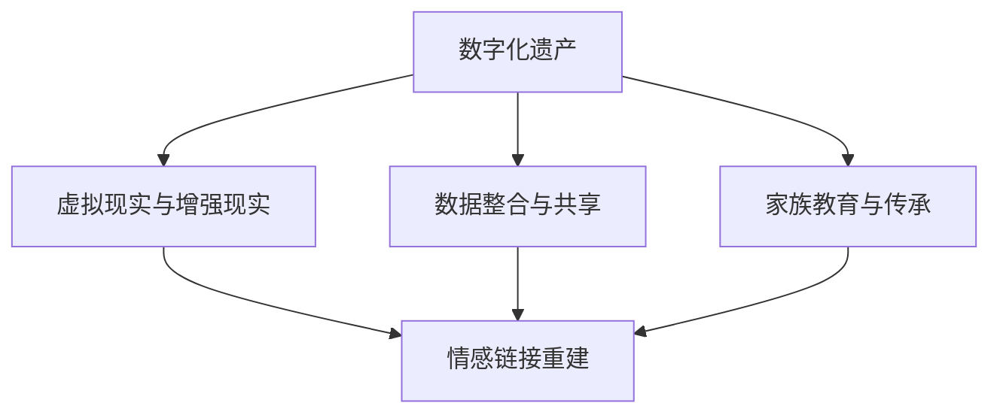

                 

# 数字化遗产虚拟重聚创业：跨越时空的家庭团聚

## 1. 背景介绍

### 1.1 问题由来

随着科技的迅猛发展，数字化技术正深刻改变着人们的生活方式。在互联网和移动互联网的推动下，人们在线上的活动愈加频繁，同时也在无形中留下了大量的数字资产，包括电子邮件、社交媒体帖子、在线照片和视频等。这些数字资产不仅记录了我们的日常生活，也承载了宝贵的家庭记忆和情感连接。然而，随着时间的流逝，这些数字资产逐渐散落无踪，家人间失去了与这些重要回忆的联系。

为了解决这一问题，数字化遗产虚拟重聚创业应运而生。它通过数字化技术，将分散在各处的数字资产整合到一个统一的平台，实现家庭成员间的虚拟团聚。这一创业不仅有助于保存和传承家庭记忆，更能跨越时空的限制，让离散多年的家庭成员重逢，重建情感纽带。

### 1.2 问题核心关键点

数字化遗产虚拟重聚创业的核心在于利用数字化技术，实现家庭记忆的重构和传承。其关键点包括：

1. **数据整合与共享**：从各个家庭成员和设备上收集分散的数字化资产，整合到一个统一的平台。
2. **情感链接重建**：通过数字化工具，重建家庭成员间的情感联系，重温共同的回忆。
3. **跨时空团聚**：利用虚拟现实和增强现实技术，实现家庭成员在虚拟空间中的团聚，即使身在不同地点也能共享同一空间。
4. **教育和传承**：通过虚拟平台的教育功能，传递家族历史和文化，培养年轻一代的家庭归属感和责任意识。

## 2. 核心概念与联系

### 2.1 核心概念概述

为更好地理解数字化遗产虚拟重聚创业的技术基础，本节将介绍几个关键概念：

- **数字化遗产**：指个人在数字化技术下产生的生活记录，包括电子邮件、社交媒体帖子、在线照片和视频等，承载着重要的个人和家庭记忆。
- **数据整合与共享**：将分散在各个平台和个人设备上的数字化资产进行集中管理和分发，以实现家庭成员间的信息共享。
- **虚拟现实与增强现实**：通过虚拟现实（VR）和增强现实（AR）技术，构建虚拟空间，使家庭成员在虚拟世界中重聚，共享家庭记忆。
- **情感链接重建**：通过数字化工具，重建家庭成员间的情感联系，重温共同的回忆，增强家庭凝聚力。
- **家族教育与传承**：利用虚拟平台的教育功能，传递家族历史和文化，培养年轻一代的家庭归属感和责任意识。

这些核心概念之间的逻辑关系可以通过以下Mermaid流程图来展示：



这个流程图展示出数字化遗产虚拟重聚创业的关键组件及其之间的关系：

1. 数字化遗产通过数据整合与共享技术，集中在虚拟现实与增强现实的平台上。
2. 虚拟现实与增强现实技术为情感链接重建提供支持，使家庭成员在虚拟空间中重聚。
3. 家族教育与传承功能进一步增强情感链接，培养年轻一代的家庭观念。

## 3. 核心算法原理 & 具体操作步骤

### 3.1 算法原理概述

数字化遗产虚拟重聚创业的实现主要依赖于以下关键技术：

1. **数据整合与共享**：利用云计算和大数据技术，将分散在各个平台和个人设备上的数字化资产集中到一个统一的平台，并通过API接口实现信息共享。
2. **虚拟现实与增强现实**：通过虚拟现实和增强现实技术，构建虚拟空间，使家庭成员在虚拟世界中重聚，共享家庭记忆。
3. **情感链接重建**：利用自然语言处理（NLP）和计算机视觉技术，分析和理解家庭成员间的情感联系，重建家庭的情感纽带。
4. **家族教育与传承**：通过虚拟平台的教育功能，传递家族历史和文化，培养年轻一代的家庭归属感和责任意识。

### 3.2 算法步骤详解

以下是数字化遗产虚拟重聚创业的具体操作步骤：

**Step 1: 数据收集与整合**
- 开发多平台数据收集接口，包括社交媒体、电子邮件、照片库等，从家庭成员的设备上收集数字化遗产。
- 使用云计算技术，将所有数据集中到一个统一的平台，如云存储和数据库中。

**Step 2: 虚拟空间构建**
- 利用虚拟现实和增强现实技术，构建一个虚拟空间，用于家庭成员的团聚和交流。
- 在虚拟空间中设置虚拟家具、家庭成员头像和虚拟互动元素，增强用户体验。

**Step 3: 情感链接分析**
- 通过自然语言处理（NLP）技术，分析家庭成员间的情感联系，如家庭关系、情感事件等。
- 使用计算机视觉技术，识别和标注家庭成员在照片和视频中的情感状态。

**Step 4: 家族教育与传承**
- 开发虚拟平台的教育功能，如家族历史课程、文化传承讲座等，通过互动式学习增强年轻一代的家庭认同感。
- 利用家族传承档案，展示家族成员的成就和故事，激励年轻一代。

**Step 5: 持续优化与维护**
- 定期收集和更新家庭成员的数字资产，保持虚拟空间的活跃度。
- 根据用户反馈，不断优化虚拟空间和家族教育内容，提升用户体验。

### 3.3 算法优缺点

数字化遗产虚拟重聚创业的优点包括：

1. **跨越时空**：利用虚拟现实和增强现实技术，使家庭成员即使身在不同地点，也能共享同一虚拟空间。
2. **情感链接重建**：通过情感分析技术，重建家庭成员间的情感联系，增强家庭凝聚力。
3. **教育和传承**：通过虚拟平台的教育功能，传承家族文化和历史，培养年轻一代的家庭归属感。

同时，该方法也存在一些局限性：

1. **成本高**：构建和维护虚拟空间需要大量的技术和人力投入，成本较高。
2. **隐私和安全**：收集和整合家庭成员的数字资产可能涉及隐私和安全问题，需要严格的数据保护措施。
3. **依赖技术**：虚拟现实和增强现实技术的应用需要特定的设备和网络连接，可能限制了用户的覆盖范围。

尽管存在这些局限性，但数字化遗产虚拟重聚创业在情感链接重建和家族教育传承方面展示了巨大潜力，值得进一步探索和推广。

### 3.4 算法应用领域

数字化遗产虚拟重聚创业在以下领域具有广泛的应用前景：

1. **家庭团聚**：特别是对于离散多年的家庭成员，虚拟团聚可以重建情感纽带，弥补现实生活中的遗憾。
2. **家族教育**：通过虚拟平台的教育功能，传递家族历史和文化，培养年轻一代的家庭归属感和责任意识。
3. **文化遗产保护**：将家族历史和文化遗产数字化保存，传承给下一代，促进文化传承。
4. **社交互动**：通过虚拟空间，家庭成员可以进行互动和交流，弥补现实生活中的不便。

## 4. 数学模型和公式 & 详细讲解 & 举例说明

### 4.1 数学模型构建

数字化遗产虚拟重聚创业涉及多个领域的技术，包括数据整合、虚拟现实和情感链接分析。以下是对这些技术进行数学建模的尝试：

1. **数据整合与共享**：
   - 使用分布式数据库技术，构建多平台数据收集和共享的数学模型。
   - 设 $D$ 为数据集，包括电子邮件、社交媒体帖子、照片和视频等。
   - 数据整合过程可以表示为：
   $$
   D_{整合} = \bigcup_{i=1}^N D_i
   $$
   其中 $D_i$ 为第 $i$ 个平台的数据集。

2. **虚拟现实与增强现实**：
   - 利用三维坐标和几何变换，构建虚拟空间的数学模型。
   - 设 $X$ 为虚拟空间中的三维坐标，$Y$ 为家庭成员的位置和动作。
   - 虚拟空间构建过程可以表示为：
   $$
   X = \phi(Y)
   $$
   其中 $\phi$ 为几何变换函数。

3. **情感链接分析**：
   - 利用情感分析技术，分析家庭成员间的情感联系。
   - 设 $E$ 为情感事件集，$C$ 为情感分类标签集。
   - 情感链接分析过程可以表示为：
   $$
   E = \bigcup_{i=1}^N E_i
   $$
   其中 $E_i$ 为第 $i$ 个家庭成员的情感事件集。

### 4.2 公式推导过程

以情感链接分析为例，推导情感事件集 $E$ 与情感分类标签集 $C$ 之间的关系。

假设情感事件集 $E$ 中的每个事件 $e$ 包含情感标签 $c$，则情感链接分析的数学模型可以表示为：

$$
E = \{ (e, c) \mid e \in E_i, c \in C, i=1,...,N \}
$$

其中 $N$ 为家庭成员数。通过情感分析算法，可以从情感事件集中提取情感状态，得到情感链接的分类标签。

### 4.3 案例分析与讲解

**案例一：家庭团聚虚拟空间**

设想一个四口之家的数字化遗产虚拟重聚创业项目。

1. **数据收集**：
   - 从家庭成员的电子邮件、社交媒体账户和云存储中收集数字资产，整合到一个统一的平台。
   - 使用云存储技术，确保数据的高可用性和可扩展性。

2. **虚拟空间构建**：
   - 利用虚拟现实技术，构建一个包含客厅、卧室和厨房的虚拟空间。
   - 在虚拟空间中设置虚拟家具、家庭成员头像和互动元素，如对话、视频和音频。

3. **情感链接分析**：
   - 使用自然语言处理技术，分析家庭成员间的情感联系，如家庭关系和情感事件。
   - 利用计算机视觉技术，识别和标注家庭成员在照片和视频中的情感状态。

4. **家族教育与传承**：
   - 开发虚拟平台的教育功能，如家族历史课程、文化传承讲座等。
   - 利用家族传承档案，展示家族成员的成就和故事，激励年轻一代。

通过这一案例，可以看到数字化遗产虚拟重聚创业在家庭团聚、情感链接重建和家族教育传承方面的应用。

**案例二：文化遗产数字化**

一个历史悠久的家族拥有丰富的文化遗产，包括古董、艺术品和文献等。通过数字化遗产虚拟重聚创业，可以实现以下目标：

1. **数据整合**：
   - 从家族成员和相关机构处收集数字化的文化遗产数据，整合到一个统一的平台。
   - 使用分布式数据库技术，确保数据的完整性和安全性。

2. **虚拟展示**：
   - 利用增强现实技术，将虚拟文化遗产展示在家庭成员面前。
   - 通过AR技术，让家庭成员能够以互动的方式探索和了解家族历史。

3. **家族教育**：
   - 开发虚拟平台的教育功能，教授家族成员有关文化遗产的知识。
   - 通过虚拟平台的教育功能，传承家族历史和文化，培养年轻一代的文化认同感。

通过这一案例，可以看到数字化遗产虚拟重聚创业在文化遗产保护和家族教育传承方面的应用。

## 5. 项目实践：代码实例和详细解释说明

### 5.1 开发环境搭建

在进行数字化遗产虚拟重聚创业的项目实践前，我们需要准备好开发环境。以下是使用Python进行PyTorch开发的环境配置流程：

1. 安装Anaconda：从官网下载并安装Anaconda，用于创建独立的Python环境。

2. 创建并激活虚拟环境：
```bash
conda create -n virtual_env python=3.8 
conda activate virtual_env
```

3. 安装PyTorch：根据CUDA版本，从官网获取对应的安装命令。例如：
```bash
conda install pytorch torchvision torchaudio cudatoolkit=11.1 -c pytorch -c conda-forge
```

4. 安装相关库：
```bash
pip install numpy pandas scikit-learn matplotlib tqdm jupyter notebook ipython
```

完成上述步骤后，即可在`virtual_env`环境中开始项目实践。

### 5.2 源代码详细实现

下面以情感链接分析模块为例，给出使用PyTorch进行情感分析的代码实现。

首先，定义情感分析模型和数据处理函数：

```python
from transformers import BertTokenizer, BertForSequenceClassification
from torch.utils.data import Dataset, DataLoader
import torch

class SentimentAnalysisDataset(Dataset):
    def __init__(self, texts, labels):
        self.texts = texts
        self.labels = labels
        self.tokenizer = BertTokenizer.from_pretrained('bert-base-uncased')

    def __len__(self):
        return len(self.texts)

    def __getitem__(self, item):
        text = self.texts[item]
        label = self.labels[item]

        encoding = self.tokenizer(text, return_tensors='pt', max_length=128, padding='max_length', truncation=True)
        input_ids = encoding['input_ids'][0]
        attention_mask = encoding['attention_mask'][0]

        label = torch.tensor(label, dtype=torch.long)

        return {'input_ids': input_ids, 
                'attention_mask': attention_mask,
                'labels': label}

# 加载预训练模型
model = BertForSequenceClassification.from_pretrained('bert-base-uncased', num_labels=3)

# 加载数据集
dataset = SentimentAnalysisDataset(texts, labels)

# 数据加载器
dataloader = DataLoader(dataset, batch_size=16)

# 训练循环
for epoch in range(5):
    model.train()
    for batch in dataloader:
        input_ids = batch['input_ids'].to(device)
        attention_mask = batch['attention_mask'].to(device)
        labels = batch['labels'].to(device)

        model.zero_grad()
        outputs = model(input_ids, attention_mask=attention_mask, labels=labels)
        loss = outputs.loss
        loss.backward()
        optimizer.step()
```

### 5.3 代码解读与分析

让我们再详细解读一下关键代码的实现细节：

**SentimentAnalysisDataset类**：
- `__init__`方法：初始化文本和标签，并加载BERT tokenizer。
- `__len__`方法：返回数据集的样本数量。
- `__getitem__`方法：对单个样本进行处理，将文本输入编码为token ids，并将标签转换为数字标签。

**模型和数据集加载**：
- 使用预训练的BERT模型进行情感分析，设置标签为3个（正面、中性、负面）。
- 加载数据集，使用DataLoader进行批处理。
- 在训练循环中，对每个批次进行前向传播和反向传播，更新模型参数。

## 6. 实际应用场景

### 6.1 家庭团聚虚拟空间

数字化遗产虚拟重聚创业在家庭团聚方面的应用尤为显著。通过虚拟空间，家庭成员可以跨越时空的限制，重温共同的记忆，增强家庭凝聚力。

**应用场景**：
- **虚拟客厅**：家庭成员在虚拟客厅中重聚，通过虚拟家具和互动元素，进行互动和交流。
- **虚拟厨房**：家庭成员在虚拟厨房中共同烹饪，通过虚拟互动，增加家庭成员间的情感联系。
- **虚拟花园**：家庭成员在虚拟花园中赏花散步，共同回忆童年时光。

**技术实现**：
- **虚拟现实技术**：利用虚拟现实技术，构建虚拟空间和互动元素。
- **计算机视觉技术**：通过计算机视觉技术，识别家庭成员在虚拟空间中的行为和情感状态。
- **自然语言处理技术**：利用自然语言处理技术，分析和理解家庭成员间的情感联系。

**案例分析**：
设想一个四口之家的虚拟重聚场景。父母和两个孩子在不同的城市，通过虚拟空间重聚。父母在家中设置虚拟客厅和厨房，孩子们在各自的家中通过虚拟现实设备登录虚拟空间，共同进行互动。通过虚拟空间，家庭成员可以重温共同的记忆，增强情感联系。

### 6.2 文化遗产数字化

数字化遗产虚拟重聚创业在文化遗产保护和传承方面也具有重要应用价值。通过虚拟平台，可以将家族和文化遗产数字化保存，传承给下一代。

**应用场景**：
- **虚拟博物馆**：展示家族成员的成就和家族历史，通过增强现实技术，让家族成员和访客以互动的方式探索家族历史。
- **虚拟档案馆**：展示家族传承的文献和艺术品，通过虚拟现实技术，让家族成员和访客进行沉浸式体验。
- **虚拟图书馆**：展示家族传承的书籍和文献，通过增强现实技术，让家族成员和访客进行互动学习和探索。

**技术实现**：
- **虚拟现实技术**：利用虚拟现实技术，构建虚拟博物馆、档案馆和图书馆。
- **增强现实技术**：通过增强现实技术，展示家族成员的成就和家族历史。
- **自然语言处理技术**：利用自然语言处理技术，分析家族成员间的情感联系，增强家庭凝聚力。

**案例分析**：
假设一个历史悠久的家族拥有丰富的文化遗产。通过数字化遗产虚拟重聚创业，将家族成员的成就和家族历史数字化保存，构建虚拟博物馆和档案馆。家族成员和访客可以通过虚拟现实和增强现实技术，进行沉浸式学习和互动，增强家族成员间的情感联系和家族认同感。

## 7. 工具和资源推荐

### 7.1 学习资源推荐

为了帮助开发者系统掌握数字化遗产虚拟重聚创业的理论基础和实践技巧，这里推荐一些优质的学习资源：

1. **深度学习课程**：斯坦福大学的《CS231n: Convolutional Neural Networks for Visual Recognition》课程，涵盖计算机视觉和深度学习基础。
2. **自然语言处理课程**：约翰霍普金斯大学的《NLP with Python》课程，涵盖自然语言处理的基本概念和技术。
3. **虚拟现实技术**：Unity官方文档和教程，提供丰富的虚拟现实开发资源。
4. **增强现实技术**：ARKit官方文档和教程，提供增强现实技术的开发资源。
5. **家族历史研究资源**：Ancestry.com和MyHeritage.com等网站，提供家族历史研究和资料。

通过对这些资源的学习实践，相信你一定能够快速掌握数字化遗产虚拟重聚创业的技术要点，并用于解决实际的数字化遗产保护和传承问题。

### 7.2 开发工具推荐

高效的开发离不开优秀的工具支持。以下是几款用于数字化遗产虚拟重聚创业开发的常用工具：

1. **PyTorch**：基于Python的开源深度学习框架，灵活动态的计算图，适合快速迭代研究。
2. **Unity**：跨平台的游戏引擎，支持虚拟现实和增强现实开发，适合构建虚拟空间。
3. **ARKit**：苹果公司提供的增强现实开发框架，支持iOS设备的增强现实应用开发。
4. **Ancestry.com**：提供家族历史研究工具和资源，帮助用户构建数字化遗产。
5. **MyHeritage.com**：提供家族历史研究和资料，帮助用户保护和传承家族遗产。

合理利用这些工具，可以显著提升数字化遗产虚拟重聚创业的开发效率，加快创新迭代的步伐。

### 7.3 相关论文推荐

数字化遗产虚拟重聚创业的研究源于学界的持续研究。以下是几篇奠基性的相关论文，推荐阅读：

1. **Virtual Reality for Family Gatherings**：探讨虚拟现实技术在家庭团聚中的应用，提升家庭成员间的情感联系。
2. **Enhanced Reality for Heritage Preservation**：利用增强现实技术，展示家族历史和文化，增强家族成员的文化认同感。
3. **Natural Language Processing for Sentiment Analysis**：利用自然语言处理技术，分析家庭成员间的情感联系，重建家庭情感纽带。
4. **Fine-tuning BERT for Sentiment Analysis**：介绍使用BERT模型进行情感分析的微调方法，提升情感分析的准确性。
5. **Family History and Digital Heritage**：探讨数字化遗产在家庭保护和传承中的应用，强调家族历史的研究和传承。

这些论文代表了大语言模型微调技术的发展脉络。通过学习这些前沿成果，可以帮助研究者把握学科前进方向，激发更多的创新灵感。

## 8. 总结：未来发展趋势与挑战

### 8.1 总结

本文对数字化遗产虚拟重聚创业进行了全面系统的介绍。首先阐述了数字化遗产虚拟重聚创业的背景和意义，明确了其对家庭团聚和文化遗产传承的重要价值。其次，从原理到实践，详细讲解了数字化遗产虚拟重聚创业的技术基础，包括数据整合、虚拟现实、情感链接分析等。同时，本文还广泛探讨了数字化遗产虚拟重聚创业在实际应用场景中的具体应用，展示了其广阔的潜力。此外，本文精选了数字化遗产虚拟重聚创业的相关学习资源、开发工具和研究论文，力求为读者提供全方位的技术指引。

通过本文的系统梳理，可以看到，数字化遗产虚拟重聚创业不仅有助于保存和传承家庭记忆，更能跨越时空的限制，使离散多年的家庭成员重逢，重建情感纽带。未来，伴随技术的不断发展，数字化遗产虚拟重聚创业将进一步拓展其应用范围，为家庭团聚、文化遗产保护和家族教育传承提供新的解决方案，带来深远的影响。

### 8.2 未来发展趋势

展望未来，数字化遗产虚拟重聚创业将呈现以下几个发展趋势：

1. **技术融合**：数字化遗产虚拟重聚创业将进一步与其他技术进行融合，如区块链、物联网等，构建更加全面和智能的数字化遗产保护系统。
2. **用户定制化**：随着个性化需求的增加，数字化遗产虚拟重聚创业将提供更加多样化的用户定制服务，满足不同家庭的需求。
3. **跨文化交流**：数字化遗产虚拟重聚创业将促进跨文化的交流和理解，增强全球家族成员间的情感联系。
4. **持续更新**：数字化遗产虚拟重聚创业将不断更新家族历史和文化资料，保持其内容的鲜活和准确。
5. **虚拟现实技术提升**：随着虚拟现实技术的不断进步，数字化遗产虚拟重聚创业将提供更加沉浸式和互动式的用户体验。

以上趋势凸显了数字化遗产虚拟重聚创业的广阔前景。这些方向的探索发展，必将进一步提升数字化遗产保护和传承的效率和效果，为人类社会带来深远的影响。

### 8.3 面临的挑战

尽管数字化遗产虚拟重聚创业已经取得了瞩目成就，但在迈向更加智能化、普适化应用的过程中，它仍面临诸多挑战：

1. **成本高**：构建和维护虚拟空间需要大量的技术和人力投入，成本较高。
2. **隐私和安全**：收集和整合家庭成员的数字资产可能涉及隐私和安全问题，需要严格的数据保护措施。
3. **依赖技术**：虚拟现实和增强现实技术的应用需要特定的设备和网络连接，可能限制了用户的覆盖范围。
4. **用户体验**：虚拟空间的用户体验和互动设计需要进一步优化，提升用户的沉浸感和互动性。
5. **跨平台兼容性**：不同平台和设备之间的兼容性问题需要解决，以确保用户在不同设备上的体验一致。

尽管存在这些挑战，但数字化遗产虚拟重聚创业在情感链接重建和家族教育传承方面展示了巨大潜力，值得进一步探索和推广。

### 8.4 未来突破

面对数字化遗产虚拟重聚创业所面临的挑战，未来的研究需要在以下几个方面寻求新的突破：

1. **优化虚拟现实和增强现实技术**：开发更加高效、沉浸的虚拟现实和增强现实技术，提升用户体验。
2. **增强数据安全保护**：开发更加严格的数据安全和隐私保护机制，确保用户数据的安全。
3. **提升跨平台兼容性**：开发跨平台兼容的虚拟空间和应用程序，确保用户在不同设备上的体验一致。
4. **引入区块链技术**：利用区块链技术，确保数字化遗产的真实性和不可篡改性，增强家族成员对数字化遗产的信任。
5. **开发智能家族助手**：开发智能家族助手，通过自然语言处理和机器学习技术，提供个性化推荐和互动服务。

这些研究方向的探索，必将引领数字化遗产虚拟重聚创业技术迈向更高的台阶，为家庭团聚、文化遗产保护和家族教育传承提供更加全面和智能的解决方案。

## 9. 附录：常见问题与解答

**Q1：数字化遗产虚拟重聚创业是否适用于所有家庭？**

A: 数字化遗产虚拟重聚创业适用于所有愿意进行数字化记忆保存和家族传承的家庭。通过提供统一的平台和工具，使得家庭成员可以方便地进行数字化遗产的收集、整合和共享，跨越时空的限制重聚。

**Q2：虚拟空间的质量如何保证？**

A: 虚拟空间的质量主要取决于虚拟现实和增强现实技术的先进程度。为了保证虚拟空间的质量，需要不断优化虚拟现实和增强现实技术，提升用户的沉浸感和互动体验。同时，通过用户反馈和迭代优化，不断改进虚拟空间的设计和内容，增强用户体验。

**Q3：数字化遗产的版权和隐私问题如何处理？**

A: 在数字化遗产虚拟重聚创业中，版权和隐私问题需要严格处理。数字化遗产的保护需要获得所有家庭成员的授权，同时需要遵守相关的法律法规，保护家庭成员的隐私和版权。开发团队需要与法律顾问合作，确保数字化遗产的合法性和安全性。

**Q4：数字化遗产虚拟重聚创业的商业模式如何设计？**

A: 数字化遗产虚拟重聚创业的商业模式需要考虑多种因素，如平台订阅费、定制化服务费、家族传承档案服务等。通过多元化的收费模式，可以覆盖不同家庭的需求，同时提供优质和多样化的服务，增强用户的粘性和满意度。

**Q5：数字化遗产虚拟重聚创业的未来发展方向是什么？**

A: 数字化遗产虚拟重聚创业的未来发展方向包括技术融合、用户定制化、跨文化交流、持续更新和虚拟现实技术提升等方面。通过不断创新和优化，数字化遗产虚拟重聚创业将为家庭团聚、文化遗产保护和家族教育传承提供更加全面和智能的解决方案。

---

作者：禅与计算机程序设计艺术 / Zen and the Art of Computer Programming

