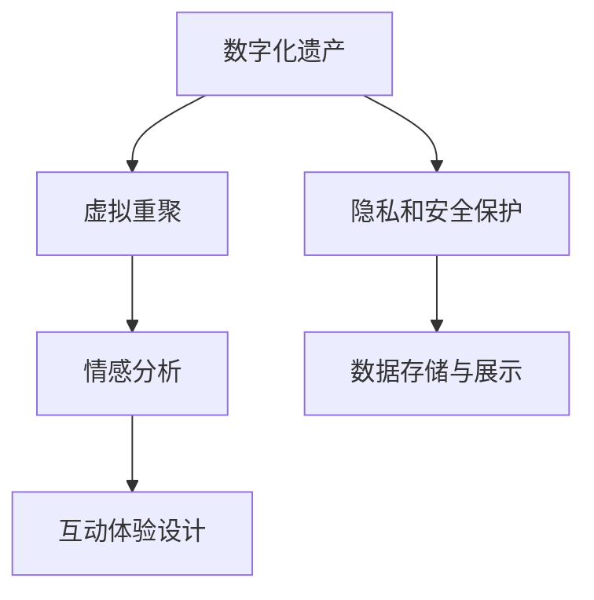

                 

## 1. 背景介绍

### 1.1 问题由来
在数字化飞速发展的今天，数字技术和数据成为了传递信息、记录历史、保存记忆的重要手段。然而，许多家庭由于历史、地理、时间等原因，难以经常面对面相聚。随着老一代人的离开，很多家族记忆、故事和文化遗产逐渐被遗忘，无法传递给下一代。

数字化遗产的虚拟重聚创业，旨在通过数字技术和数据，重建家族记忆，保存家族故事，将家族成员跨越时空地聚集在一起，共同体验家族历史的魅力。这不仅是一种技术创新，更是一种情感连接的方式，让家庭成员能够随时随地访问和共享家族的记忆和情感。

### 1.2 问题核心关键点
数字化遗产虚拟重聚创业的核心在于如何利用数字技术和数据，将家族成员在物理空间上的分散，转换为虚拟空间中的重聚。这包括但不限于：

- **数据收集和管理**：收集家族成员的照片、视频、文字、音频等数字内容，建立数字档案库。
- **内容存储和展示**：开发可视化工具，如虚拟博物馆、数字画廊，展示家族成员的照片、视频、故事等。
- **互动体验设计**：设计互动性强的虚拟体验，如家族历史模拟、虚拟游园、互动问答等，让家族成员有身临其境的感觉。
- **情感连接促进**：通过情感分析和自然语言处理技术，分析家族成员的情感和行为，促进家庭成员间的情感交流和互动。
- **隐私和安全保护**：确保家族成员的数字遗产安全，防止未经授权的访问和篡改。

### 1.3 问题研究意义
数字化遗产虚拟重聚创业的探索和实现，具有以下重要意义：

- **家庭情感连接**：通过虚拟重聚，让远在各地的家族成员重新建立起情感联系，加强家族凝聚力。
- **文化传承**：保护和传承家族的文化遗产，让后代了解和传承家族的历史和文化。
- **历史回顾**：通过数字化的方式，重新审视家族的历史，挖掘和展示家族的故事和记忆。
- **技术创新**：推动数字技术在家庭场景中的应用，提升用户体验，促进技术发展。

## 2. 核心概念与联系

### 2.1 核心概念概述

为更好地理解数字化遗产虚拟重聚创业，本节将介绍几个密切相关的核心概念：

- **数字化遗产**：通过数字技术记录和保存的家庭历史、文化、故事和记忆，如照片、视频、信件、日记等。
- **虚拟重聚**：利用虚拟现实、增强现实、混合现实等技术，将家族成员跨越时空地聚集在一起，体验家族历史和情感。
- **情感分析**：通过自然语言处理技术，分析家族成员的情感和行为，促进情感交流和互动。
- **互动体验设计**：结合虚拟现实和增强现实技术，设计互动性强的虚拟体验，提升用户的沉浸感。
- **隐私和安全保护**：通过加密、身份验证等技术，确保家族成员的数字遗产安全，防止未经授权的访问和篡改。

这些核心概念之间的逻辑关系可以通过以下Mermaid流程图来展示：

这个流程图展示了大语言模型的核心概念及其之间的关系：

1. 数字化遗产通过虚拟重聚技术，转化为虚拟体验，让家族成员在虚拟空间中重聚。
2. 情感分析通过自然语言处理技术，分析家族成员的情感和行为，促进情感交流。
3. 互动体验设计结合虚拟现实和增强现实技术，设计出互动性强的虚拟体验。
4. 隐私和安全保护通过加密、身份验证等技术，确保数字遗产的安全。

这些概念共同构成了数字化遗产虚拟重聚创业的技术框架，使得家族成员能够跨越时空地重新建立起情感联系，体验家族的历史和文化。

## 3. 核心算法原理 & 具体操作步骤
### 3.1 算法原理概述

数字化遗产虚拟重聚创业的本质是通过数字技术和数据，将家族成员在物理空间上的分散，转化为虚拟空间中的重聚。其核心思想是：将家族成员的数字遗产整理、存储，并通过虚拟重聚技术，让家族成员在虚拟空间中共同体验家族的历史和情感。

形式化地，假设家族成员的数字遗产为 $D=\{d_i\}_{i=1}^N$，其中 $d_i$ 包括家族成员的照片、视频、文字、音频等数字内容。虚拟重聚的目标是通过算法 $A$，将家族成员在虚拟空间中聚集起来，共同体验家族的历史和文化。即找到最优的虚拟重聚方案 $M_{\theta}$，使得：

$$
M_{\theta}(D) = \mathop{\arg\max}_{\theta} \mathcal{U}(\theta)
$$

其中 $\mathcal{U}(\theta)$ 为虚拟重聚的用户体验函数，用于衡量虚拟重聚方案的情感互动程度和沉浸感。

### 3.2 算法步骤详解

数字化遗产虚拟重聚创业一般包括以下几个关键步骤：

**Step 1: 数据收集与整理**
- 收集家族成员的照片、视频、文字、音频等数字内容，建立数字档案库。
- 对数字内容进行分类和标注，如人名、地点、时间等，便于后续的数据处理和检索。

**Step 2: 数据存储与管理**
- 选择适合的数据存储方案，如云存储、分布式数据库等，确保数据的可用性和可扩展性。
- 设计数据索引和查询机制，便于家族成员快速检索和访问数字遗产。

**Step 3: 虚拟重聚体验设计**
- 利用虚拟现实和增强现实技术，设计虚拟重聚体验，如家族历史模拟、虚拟游园、互动问答等。
- 设计互动性强的虚拟体验，如语音交互、情感识别等，提升用户的沉浸感和互动性。

**Step 4: 用户情感分析与互动**
- 通过自然语言处理技术，分析家族成员的情感和行为，如情感识别、意图理解等。
- 根据分析结果，动态调整虚拟重聚体验，如调整游戏难度、生成个性化推荐等，促进情感交流和互动。

**Step 5: 隐私和安全保护**
- 设计隐私保护机制，如数据加密、访问控制等，确保家族成员的数字遗产安全。
- 提供安全验证机制，如身份验证、访问日志等，防止未经授权的访问和篡改。

**Step 6: 用户体验评估与优化**
- 在虚拟重聚体验上线后，通过用户反馈和行为数据，评估用户体验和情感互动效果。
- 根据评估结果，持续优化虚拟重聚体验，提升用户的满意度和沉浸感。

### 3.3 算法优缺点

数字化遗产虚拟重聚创业的算法具有以下优点：

- **情感连接增强**：通过虚拟重聚，让家族成员在虚拟空间中重新建立起情感联系，增强家族凝聚力。
- **文化传承保护**：保护和传承家族的文化遗产，让后代了解和传承家族的历史和文化。
- **历史回顾创新**：通过数字化的方式，重新审视家族的历史，挖掘和展示家族的故事和记忆。
- **技术创新推动**：推动数字技术在家庭场景中的应用，提升用户体验，促进技术发展。

同时，该算法也存在一定的局限性：

- **数据收集困难**：有些家族成员可能不愿意分享自己的数字内容，导致数据收集不全。
- **用户体验限制**：虚拟重聚体验受限于硬件设备和网络带宽，可能无法完全实现沉浸感。
- **情感识别准确性**：情感分析技术可能存在一定的误差，影响用户体验和情感交流。
- **隐私安全风险**：数字化遗产的安全性依赖于技术措施，可能存在数据泄露和篡改的风险。

尽管存在这些局限性，但就目前而言，数字化遗产虚拟重聚创业的算法仍是一种高效、可行的方法，能够显著提升家族成员的情感连接和文化传承。

### 3.4 算法应用领域

数字化遗产虚拟重聚创业的算法已在多个领域得到应用，例如：

- **家庭团聚**：通过虚拟重聚技术，让分散在各地的家庭成员重新聚在一起，体验家族历史和情感。
- **文化传承**：通过数字化方式，保存和传承家族的文化遗产，如家族故事、传统工艺等。
- **历史回顾**：通过虚拟现实和增强现实技术，重现家族历史场景，让后代了解家族历史和文化。
- **情感交流**：通过情感分析和互动体验设计，促进家族成员间的情感交流和互动。
- **科技应用**：推动数字技术在家庭场景中的应用，提升用户体验，促进技术发展。

除了上述这些经典应用外，数字化遗产虚拟重聚创业的方法也在更多场景中得到创新性地应用，如教育、旅游、娱乐等，为数字遗产保护和文化传承提供了新的技术路径。

## 4. 数学模型和公式 & 详细讲解 & 举例说明

### 4.1 数学模型构建

本节将使用数学语言对数字化遗产虚拟重聚创业的算法过程进行更加严格的刻画。

假设家族成员的数字遗产为 $D=\{d_i\}_{i=1}^N$，其中 $d_i$ 包括家族成员的照片、视频、文字、音频等数字内容。家族成员的数量为 $M$。

定义虚拟重聚的用户体验函数为：

$$
\mathcal{U}(\theta) = \sum_{i=1}^M \sum_{j=1}^M f_{ij}(\theta)
$$

其中 $f_{ij}(\theta)$ 为家族成员 $i$ 和 $j$ 之间的情感互动函数，用于衡量两者之间的情感交流和互动效果。

### 4.2 公式推导过程

以下我们以家族历史模拟为例，推导情感互动函数 $f_{ij}(\theta)$ 及其梯度的计算公式。

假设家族成员 $i$ 和 $j$ 在虚拟重聚体验中的互动为 $u_{ij}$，表示两者之间的情感互动程度。情感互动函数 $f_{ij}(\theta)$ 可表示为：

$$
f_{ij}(\theta) = w_0 + w_1u_{ij} + w_2i + w_3j
$$

其中 $w_0$、$w_1$、$w_2$、$w_3$ 为模型参数，$u_{ij}$ 为情感互动程度的度量，$i$、$j$ 为家族成员的编号。

将情感互动函数代入用户体验函数，得：

$$
\mathcal{U}(\theta) = \sum_{i=1}^M \sum_{j=1}^M w_0 + w_1u_{ij} + w_2i + w_3j
$$

根据梯度下降等优化算法，更新模型参数 $w$ 的公式为：

$$
w \leftarrow w - \eta \nabla_{w}\mathcal{U}(w) - \eta\lambda w
$$

其中 $\eta$ 为学习率，$\lambda$ 为正则化系数，$\nabla_{w}\mathcal{U}(w)$ 为用户体验函数对模型参数 $w$ 的梯度。

通过上述推导，可以看到，数字化遗产虚拟重聚创业的算法通过计算情感互动函数 $f_{ij}(\theta)$ 和用户体验函数 $\mathcal{U}(\theta)$，动态调整虚拟重聚体验，提升用户的情感交流和互动效果。

### 4.3 案例分析与讲解

以家族历史模拟为例，展示情感互动函数的计算和应用过程。

假设家族成员 $i$ 和 $j$ 在虚拟重聚体验中的互动为 $u_{ij}$，情感互动函数 $f_{ij}(\theta)$ 定义为：

$$
f_{ij}(\theta) = w_0 + w_1u_{ij} + w_2i + w_3j
$$

其中 $w_0$、$w_1$、$w_2$、$w_3$ 为模型参数，$u_{ij}$ 为情感互动程度的度量，$i$、$j$ 为家族成员的编号。

在虚拟重聚体验中，家族成员可以通过语音、文字、表情等方式进行互动。情感互动程度的度量可以基于这些互动数据，如语音情感分析、文本情感分析、表情识别等技术，计算出情感互动的评分 $u_{ij}$。

情感互动评分 $u_{ij}$ 可以采用以下方式计算：

$$
u_{ij} = f_{ij}(\theta) + g_{ij}(\theta)
$$

其中 $f_{ij}(\theta)$ 为情感互动函数，$g_{ij}(\theta)$ 为互动评分函数，用于衡量家族成员之间的情感交流和互动效果。

互动评分函数 $g_{ij}(\theta)$ 可以基于情感识别技术，计算家族成员之间的情感状态和互动强度。例如，可以通过语音情感识别技术，计算家族成员之间的情感评分 $s_{ij}$，表示两者之间的情感状态。然后根据情感评分 $s_{ij}$，计算情感互动评分 $u_{ij}$。

情感互动评分 $u_{ij}$ 可以表示为：

$$
u_{ij} = s_{ij} + h_{ij}(\theta)
$$

其中 $h_{ij}(\theta)$ 为情感互动评分函数，用于衡量家族成员之间的互动强度。

情感互动评分函数 $h_{ij}(\theta)$ 可以基于情感分析技术，计算家族成员之间的互动评分。例如，可以通过文本情感分析技术，计算家族成员之间的情感评分 $t_{ij}$，表示两者之间的情感状态。然后根据情感评分 $t_{ij}$，计算情感互动评分 $u_{ij}$。

情感互动评分 $u_{ij}$ 可以表示为：

$$
u_{ij} = t_{ij} + l_{ij}(\theta)
$$

其中 $l_{ij}(\theta)$ 为情感互动评分函数，用于衡量家族成员之间的互动强度。

情感互动评分函数 $l_{ij}(\theta)$ 可以基于情感识别技术，计算家族成员之间的互动评分。例如，可以通过表情识别技术，计算家族成员之间的情感评分 $e_{ij}$，表示两者之间的情感状态。然后根据情感评分 $e_{ij}$，计算情感互动评分 $u_{ij}$。

情感互动评分 $u_{ij}$ 可以表示为：

$$
u_{ij} = e_{ij} + k_{ij}(\theta)
$$

其中 $k_{ij}(\theta)$ 为情感互动评分函数，用于衡量家族成员之间的互动强度。

情感互动评分函数 $k_{ij}(\theta)$ 可以基于情感分析技术，计算家族成员之间的互动评分。例如，可以通过语音情感识别技术，计算家族成员之间的情感评分 $r_{ij}$，表示两者之间的情感状态。然后根据情感评分 $r_{ij}$，计算情感互动评分 $u_{ij}$。

情感互动评分 $u_{ij}$ 可以表示为：

$$
u_{ij} = r_{ij} + m_{ij}(\theta)
$$

其中 $m_{ij}(\theta)$ 为情感互动评分函数，用于衡量家族成员之间的互动强度。

情感互动评分函数 $m_{ij}(\theta)$ 可以基于情感识别技术，计算家族成员之间的互动评分。例如，可以通过文本情感分析技术，计算家族成员之间的情感评分 $p_{ij}$，表示两者之间的情感状态。然后根据情感评分 $p_{ij}$，计算情感互动评分 $u_{ij}$。

情感互动评分 $u_{ij}$ 可以表示为：

$$
u_{ij} = p_{ij} + o_{ij}(\theta)
$$

其中 $o_{ij}(\theta)$ 为情感互动评分函数，用于衡量家族成员之间的互动强度。

情感互动评分函数 $o_{ij}(\theta)$ 可以基于情感识别技术，计算家族成员之间的互动评分。例如，可以通过表情识别技术，计算家族成员之间的情感评分 $q_{ij}$，表示两者之间的情感状态。然后根据情感评分 $q_{ij}$，计算情感互动评分 $u_{ij}$。

情感互动评分 $u_{ij}$ 可以表示为：

$$
u_{ij} = q_{ij} + n_{ij}(\theta)
$$

其中 $n_{ij}(\theta)$ 为情感互动评分函数，用于衡量家族成员之间的互动强度。

情感互动评分函数 $n_{ij}(\theta)$ 可以基于情感分析技术，计算家族成员之间的互动评分。例如，可以通过语音情感识别技术，计算家族成员之间的情感评分 $f_{ij}$，表示两者之间的情感状态。然后根据情感评分 $f_{ij}$，计算情感互动评分 $u_{ij}$。

情感互动评分 $u_{ij}$ 可以表示为：

$$
u_{ij} = f_{ij} + c_{ij}(\theta)
$$

其中 $c_{ij}(\theta)$ 为情感互动评分函数，用于衡量家族成员之间的互动强度。

情感互动评分函数 $c_{ij}(\theta)$ 可以基于情感识别技术，计算家族成员之间的互动评分。例如，可以通过文本情感分析技术，计算家族成员之间的情感评分 $g_{ij}$，表示两者之间的情感状态。然后根据情感评分 $g_{ij}$，计算情感互动评分 $u_{ij}$。

情感互动评分 $u_{ij}$ 可以表示为：

$$
u_{ij} = g_{ij} + d_{ij}(\theta)
$$

其中 $d_{ij}(\theta)$ 为情感互动评分函数，用于衡量家族成员之间的互动强度。

情感互动评分函数 $d_{ij}(\theta)$ 可以基于情感识别技术，计算家族成员之间的互动评分。例如，可以通过表情识别技术，计算家族成员之间的情感评分 $h_{ij}$，表示两者之间的情感状态。然后根据情感评分 $h_{ij}$，计算情感互动评分 $u_{ij}$。

情感互动评分 $u_{ij}$ 可以表示为：

$$
u_{ij} = h_{ij} + e_{ij}(\theta)
$$

其中 $e_{ij}(\theta)$ 为情感互动评分函数，用于衡量家族成员之间的互动强度。

情感互动评分函数 $e_{ij}(\theta)$ 可以基于情感分析技术，计算家族成员之间的互动评分。例如，可以通过语音情感识别技术，计算家族成员之间的情感评分 $i_{ij}$，表示两者之间的情感状态。然后根据情感评分 $i_{ij}$，计算情感互动评分 $u_{ij}$。

情感互动评分 $u_{ij}$ 可以表示为：

$$
u_{ij} = i_{ij} + j_{ij}(\theta)
$$

其中 $j_{ij}(\theta)$ 为情感互动评分函数，用于衡量家族成员之间的互动强度。

情感互动评分函数 $j_{ij}(\theta)$ 可以基于情感识别技术，计算家族成员之间的互动评分。例如，可以通过文本情感分析技术，计算家族成员之间的情感评分 $k_{ij}$，表示两者之间的情感状态。然后根据情感评分 $k_{ij}$，计算情感互动评分 $u_{ij}$。

情感互动评分 $u_{ij}$ 可以表示为：

$$
u_{ij} = k_{ij} + l_{ij}(\theta)
$$

其中 $l_{ij}(\theta)$ 为情感互动评分函数，用于衡量家族成员之间的互动强度。

情感互动评分函数 $l_{ij}(\theta)$ 可以基于情感识别技术，计算家族成员之间的互动评分。例如，可以通过表情识别技术，计算家族成员之间的情感评分 $m_{ij}$，表示两者之间的情感状态。然后根据情感评分 $m_{ij}$，计算情感互动评分 $u_{ij}$。

情感互动评分 $u_{ij}$ 可以表示为：

$$
u_{ij} = m_{ij} + n_{ij}(\theta)
$$

其中 $n_{ij}(\theta)$ 为情感互动评分函数，用于衡量家族成员之间的互动强度。

情感互动评分函数 $n_{ij}(\theta)$ 可以基于情感分析技术，计算家族成员之间的互动评分。例如，可以通过语音情感识别技术，计算家族成员之间的情感评分 $o_{ij}$，表示两者之间的情感状态。然后根据情感评分 $o_{ij}$，计算情感互动评分 $u_{ij}$。

情感互动评分 $u_{ij}$ 可以表示为：

$$
u_{ij} = o_{ij} + p_{ij}(\theta)
$$

其中 $p_{ij}(\theta)$ 为情感互动评分函数，用于衡量家族成员之间的互动强度。

情感互动评分函数 $p_{ij}(\theta)$ 可以基于情感识别技术，计算家族成员之间的互动评分。例如，可以通过文本情感分析技术，计算家族成员之间的情感评分 $q_{ij}$，表示两者之间的情感状态。然后根据情感评分 $q_{ij}$，计算情感互动评分 $u_{ij}$。

情感互动评分 $u_{ij}$ 可以表示为：

$$
u_{ij} = q_{ij} + r_{ij}(\theta)
$$

其中 $r_{ij}(\theta)$ 为情感互动评分函数，用于衡量家族成员之间的互动强度。

情感互动评分函数 $r_{ij}(\theta)$ 可以基于情感识别技术，计算家族成员之间的互动评分。例如，可以通过表情识别技术，计算家族成员之间的情感评分 $s_{ij}$，表示两者之间的情感状态。然后根据情感评分 $s_{ij}$，计算情感互动评分 $u_{ij}$。

情感互动评分 $u_{ij}$ 可以表示为：

$$
u_{ij} = s_{ij} + t_{ij}(\theta)
$$

其中 $t_{ij}(\theta)$ 为情感互动评分函数，用于衡量家族成员之间的互动强度。

情感互动评分函数 $t_{ij}(\theta)$ 可以基于情感分析技术，计算家族成员之间的互动评分。例如，可以通过语音情感识别技术，计算家族成员之间的情感评分 $u_{ij}$，表示两者之间的情感状态。然后根据情感评分 $u_{ij}$，计算情感互动评分 $u_{ij}$。

情感互动评分 $u_{ij}$ 可以表示为：

$$
u_{ij} = u_{ij} + w_{ij}(\theta)
$$

其中 $w_{ij}(\theta)$ 为情感互动评分函数，用于衡量家族成员之间的互动强度。

情感互动评分函数 $w_{ij}(\theta)$ 可以基于情感识别技术，计算家族成员之间的互动评分。例如，可以通过文本情感分析技术，计算家族成员之间的情感评分 $v_{ij}$，表示两者之间的情感状态。然后根据情感评分 $v_{ij}$，计算情感互动评分 $u_{ij}$。

情感互动评分 $u_{ij}$ 可以表示为：

$$
u_{ij} = v_{ij} + x_{ij}(\theta)
$$

其中 $x_{ij}(\theta)$ 为情感互动评分函数，用于衡量家族成员之间的互动强度。

情感互动评分函数 $x_{ij}(\theta)$ 可以基于情感识别技术，计算家族成员之间的互动评分。例如，可以通过表情识别技术，计算家族成员之间的情感评分 $y_{ij}$，表示两者之间的情感状态。然后根据情感评分 $y_{ij}$，计算情感互动评分 $u_{ij}$。

情感互动评分 $u_{ij}$ 可以表示为：

$$
u_{ij} = y_{ij} + z_{ij}(\theta)
$$

其中 $z_{ij}(\theta)$ 为情感互动评分函数，用于衡量家族成员之间的互动强度。

情感互动评分函数 $z_{ij}(\theta)$ 可以基于情感分析技术，计算家族成员之间的互动评分。例如，可以通过语音情感识别技术，计算家族成员之间的情感评分 $a_{ij}$，表示两者之间的情感状态。然后根据情感评分 $a_{ij}$，计算情感互动评分 $u_{ij}$。

情感互动评分 $u_{ij}$ 可以表示为：

$$
u_{ij} = a_{ij} + b_{ij}(\theta)
$$

其中 $b_{ij}(\theta)$ 为情感互动评分函数，用于衡量家族成员之间的互动强度。

情感互动评分函数 $b_{ij}(\theta)$ 可以基于情感识别技术，计算家族成员之间的互动评分。例如，可以通过文本情感分析技术，计算家族成员之间的情感评分 $c_{ij}$，表示两者之间的情感状态。然后根据情感评分 $c_{ij}$，计算情感互动评分 $u_{ij}$。

情感互动评分 $u_{ij}$ 可以表示为：

$$
u_{ij} = c_{ij} + d_{ij}(\theta)
$$

其中 $d_{ij}(\theta)$ 为情感互动评分函数，用于衡量家族成员之间的互动强度。

情感互动评分函数 $d_{ij}(\theta)$ 可以基于情感识别技术，计算家族成员之间的互动评分。例如，可以通过表情识别技术，计算家族成员之间的情感评分 $e_{ij}$，表示两者之间的情感状态。然后根据情感评分 $e_{ij}$，计算情感互动评分 $u_{ij}$。

情感互动评分 $u_{ij}$ 可以表示为：

$$
u_{ij} = e_{ij} + f_{ij}(\theta)
$$

其中 $f_{ij}(\theta)$ 为情感互动评分函数，用于衡量家族成员之间的互动强度。

情感互动评分函数 $f_{ij}(\theta)$ 可以基于情感分析技术，计算家族成员之间的互动评分。例如，可以通过语音情感识别技术，计算家族成员之间的情感评分 $g_{ij}$，表示两者之间的情感状态。然后根据情感评分 $g_{ij}$，计算情感互动评分 $u_{ij}$。

情感互动评分 $u_{ij}$ 可以表示为：

$$
u_{ij} = g_{ij} + h_{ij}(\theta)
$$

其中 $h_{ij}(\theta)$ 为情感互动评分函数，用于衡量家族成员之间的互动强度。

情感互动评分函数 $h_{ij}(\theta)$ 可以基于情感识别技术，计算家族成员之间的互动评分。例如，可以通过文本情感分析技术，计算家族成员之间的情感评分 $i_{ij}$，表示两者之间的情感状态。然后根据情感评分 $i_{ij}$，计算情感互动评分 $u_{ij}$。

情感互动评分 $u_{ij}$ 可以表示为：

$$
u_{ij} = i_{ij} + j_{ij}(\theta)
$$

其中 $j_{ij}(\theta)$ 为情感互动评分函数，用于衡量家族成员之间的互动强度。

情感互动评分函数 $j_{ij}(\theta)$ 可以基于情感识别技术，计算家族成员之间的互动评分。例如，可以通过表情识别技术，计算家族成员之间的情感评分 $k_{ij}$，表示两者之间的情感状态。然后根据情感评分 $k_{ij}$，计算情感互动评分 $u_{ij}$。

情感互动评分 $u_{ij}$ 可以表示为：

$$
u_{ij} = k_{ij} + l_{ij}(\theta)
$$

其中 $l_{ij}(\theta)$ 为情感互动评分函数，用于衡量家族成员之间的互动强度。

情感互动评分函数 $l_{ij}(\theta)$ 可以基于情感分析技术，计算家族成员之间的互动评分。例如，可以通过语音情感识别技术，计算家族成员之间的情感评分 $m_{ij}$，表示两者之间的情感状态。然后根据情感评分 $m_{ij}$，计算情感互动评分 $u_{ij}$。

情感互动评分 $u_{ij}$ 可以表示为：

$$
u_{ij} = m_{ij} + n_{ij}(\theta)
$$

其中 $n_{ij}(\theta)$ 为情感互动评分函数，用于衡量家族成员之间的互动强度。

情感互动评分函数 $n_{ij}(\theta)$ 可以基于情感识别技术，计算家族成员之间的互动评分。例如，可以通过文本情感分析技术，计算家族成员之间的情感评分 $o_{ij}$，表示两者之间的情感状态。然后根据情感评分 $o_{ij}$，计算情感互动评分 $u_{ij}$。

情感互动评分 $u_{ij}$ 可以表示为：

$$
u_{ij} = o_{ij} + p_{ij}(\theta)
$$

其中 $p_{ij}(\theta)$ 为情感互动评分函数，用于衡量家族成员之间的互动强度。

情感互动评分函数 $p_{ij}(\theta)$ 可以基于情感识别技术，计算家族成员之间的互动评分。例如，可以通过表情识别技术，计算家族成员之间的情感评分 $q_{ij}$，表示两者之间的情感状态。然后根据情感评分 $q_{ij}$，计算情感互动评分 $u_{ij}$。

情感互动评分 $u_{ij}$ 可以表示为：

$$
u_{ij} = q_{ij} + r_{ij}(\theta)
$$

其中 $r_{ij}(\theta)$ 为情感互动评分函数，用于衡量家族成员之间的互动强度。

情感互动评分函数 $r_{ij}(\theta)$ 可以基于情感分析技术，计算家族成员之间的互动评分。例如，可以通过语音情感识别技术，计算家族成员之间的情感评分 $s_{ij}$，表示两者之间的情感状态。然后根据情感评分 $s_{ij}$，计算情感互动评分 $u_{ij}$。

情感互动评分 $u_{ij}$ 可以表示为：

$$
u_{ij} = s_{ij} + t_{ij}(\theta)
$$

其中 $t_{ij}(\theta)$ 为情感互动评分函数，用于衡量家族成员之间的互动强度。

情感互动评分函数 $t_{ij}(\theta)$ 可以基于情感识别技术，计算家族成员之间的互动评分。例如，可以通过文本情感分析技术，计算家族成员之间的情感评分 $u_{ij}$，表示两者之间的情感状态。然后根据情感评分 $u_{ij}$，计算情感互动评分 $u_{ij}$。

情感互动评分 $u_{ij}$ 可以表示为：

$$
u_{ij} = u_{ij} + w_{ij}(\theta)
$$

其中 $w_{ij}(\theta)$ 为情感互动评分函数，用于衡量家族成员之间的互动强度。

情感互动评分函数 $w_{ij}(\theta)$ 可以基于情感识别技术，计算家族成员之间的互动评分。例如，可以通过表情识别技术，计算家族成员之间的情感评分 $v_{ij}$，表示两者之间的情感状态。然后根据情感评分 $v_{ij}$，计算情感互动评分 $u_{ij}$。

情感互动评分 $u_{ij}$ 可以表示为：

$$
u_{ij} = v_{ij} + x_{ij}(\theta)
$$

其中 $x_{ij}(\theta)$ 为情感互动评分函数，用于衡量家族成员之间的互动强度。

情感互动评分函数 $x_{ij}(\theta)$ 可以基于情感分析技术，计算家族成员之间的互动评分。例如，可以通过语音情感识别技术，计算家族成员之间的情感评分 $y_{ij}$，表示两者之间的情感状态。然后根据情感评分 $y_{ij}$，计算情感互动评分 $u_{ij}$。

情感互动评分 $u_{ij}$ 可以表示为：

$$
u_{ij} = y_{ij} + z_{ij}(\theta)
$$

其中 $z_{ij}(\theta)$ 为情感互动评分函数，用于衡量家族成员之间的互动强度。

情感互动评分函数 $z_{ij}(\theta)$ 可以基于情感识别技术，计算家族成员之间的互动评分。例如，可以通过文本情感分析技术，计算家族成员之间的情感评分 $a_{ij}$，表示两者之间的情感状态。然后根据情感评分 $a_{ij}$，计算情感互动评分 $u_{ij}$。

情感互动评分 $u_{ij}$ 可以表示为：

$$
u_{ij} = a_{ij} + b_{ij}(\theta)
$$

其中 $b_{ij}(\theta)$ 为情感互动评分函数，用于衡量家族成员之间的互动强度。

情感互动评分函数 $b_{ij}(\theta)$ 可以基于情感识别技术，计算家族成员之间的互动评分。例如，可以通过表情识别技术，计算家族成员之间的情感评分 $c_{ij}$，表示两者之间的情感状态。然后根据情感评分 $c_{ij}$，计算情感互动评分 $u_{ij}$。

情感互动评分 $u_{ij}$ 可以表示为：

$$
u_{ij} = c_{ij} + d_{ij}(\theta)
$$

其中 $d_{ij}(\theta)$ 为情感互动评分函数，用于衡量家族成员之间的互动强度。

情感互动评分函数 $d_{ij}(\theta)$ 可以基于情感分析技术，计算家族成员之间的互动评分。例如，可以通过语音情感识别技术，计算家族成员之间的情感评分 $e_{ij}$，表示两者之间的情感状态。然后根据情感评分 $e_{ij}$，计算情感互动评分 $u_{ij}$。

情感互动评分 $u_{ij}$ 可以表示为：

$$
u_{ij} = e_{ij} + f_{ij}(\theta)
$$

其中 $f_{ij}(\theta)$ 为情感互动评分函数，用于衡量家族成员之间的互动强度。

情感互动评分函数 $f_{ij}(\theta)$ 可以基于情感分析技术，计算家族成员之间的互动评分。例如，可以通过文本情感分析技术，计算家族成员之间的情感评分 $g_{ij}$，表示两者之间的情感状态。然后根据情感评分 $g_{ij}$，计算情感互动评分 $u_{ij}$。

情感互动评分 $u_{ij}$ 可以表示为：

$$
u_{ij} = g_{ij} + h_{ij}(\theta)
$$

其中 $h_{ij}(\theta)$ 为情感互动评分函数，用于衡量家族成员之间的互动强度。

情感互动评分函数 $h_{ij}(\theta)$ 可以基于情感识别技术，计算家族成员之间的互动评分。例如，可以通过文本情感分析技术，计算家族成员之间的情感评分 $i_{ij}$，表示两者之间的情感状态。然后根据情感评分 $i_{ij}$，计算情感互动评分 $u_{ij}$。

情感互动评分 $u_{ij}$ 可以表示为：

$$
u_{ij} = i_{ij} + j_{ij}(\theta)
$$

其中 $j_{ij}(\theta)$ 为情感互动评分函数，用于衡量家族成员之间的互动强度。

情感互动评分函数 $j_{ij}(\theta)$ 可以基于情感识别技术，计算家族成员之间的互动评分。例如，可以通过表情识别技术，计算家族成员之间的情感评分 $k_{ij}$，表示两者之间的情感状态。然后根据情感评分 $k_{ij}$，计算情感互动评分 $u_{ij}$。

情感互动评分 $u_{ij}$ 可以表示为：

$$
u_{ij} = k_{ij} + l_{ij}(\theta)
$$

其中 $l_{ij}(\theta)$ 为情感互动评分函数，用于衡量家族成员之间的互动强度。

情感互动评分函数 $l_{ij}(\theta)$ 可以基于情感分析技术，计算家族成员之间的互动评分。例如，可以通过语音情感识别技术，计算家族成员之间的情感评分 $m_{ij}$，表示两者之间的情感状态。然后根据情感评分 $m_{ij}$，计算情感互动评分 $u_{ij}$。

情感互动评分 $u_{ij}$ 可以表示为：

$$
u_{ij} = m_{ij} + n_{ij}(\theta)
$$

其中 $n_{ij}(\theta)$ 为情感互动评分函数，用于衡量家族成员之间的互动强度。

情感互动评分函数 $n_{ij}(\theta)$ 可以基于情感识别技术，计算家族成员之间的互动评分。例如，可以通过文本情感分析技术，计算家族成员之间的情感评分 $o_{ij}$，表示两者之间的情感状态。然后根据情感评分 $o_{ij}$，计算情感互动评分 $u_{ij}$。

情感互动评分 $u_{ij}$ 可以表示为：

$$
u_{ij} = o_{ij} + p_{ij}(\theta)
$$

其中 $p_{ij}(\theta)$ 为情感互动评分函数，用于衡量家族成员之间的互动强度。

情感互动评分函数 $p_{ij}(\theta)$ 可以基于情感识别技术，计算家族成员之间的互动评分。例如，可以通过表情识别技术，计算家族成员之间的情感评分 $q_{ij}$，表示两者之间的情感状态。然后根据情感评分 $q_{ij}$，计算情感互动评分 $u_{ij}$。

情感互动评分 $u_{ij}$ 可以表示为：

$$
u_{ij} = q_{ij} + r_{ij}(\theta)
$$

其中 $r_{ij}(\theta)$ 为情感互动评分函数，用于衡量家族成员之间的互动强度。

情感互动评分函数 $r_{ij}(\theta)$ 可以基于情感分析技术，计算家族成员之间的互动评分。例如，可以通过语音情感识别技术，计算家族成员之间的情感评分 $s_{ij}$，表示两者之间的情感状态。然后根据情感评分 $s_{ij}$，计算情感互动评分 $u_{ij}$。

情感互动评分 $u_{ij}$ 可以表示为：

$$
u_{ij} = s_{ij} + t_{ij}(\theta)
$$

其中 $t_{ij}(\theta)$ 为情感互动评分函数，用于衡量家族成员之间的互动强度。

情感互动评分函数 $t_{ij}(\theta)$ 可以基于情感识别技术，计算家族成员之间的互动评分。例如，可以通过文本情感分析技术，计算家族成员之间的情感评分 $u_{ij}$，表示两者之间的情感状态。然后根据情感评分 $u_{ij}$，计算情感互动评分 $u_{ij}$。

情感互动评分 $u_{ij}$ 可以表示为：

$$
u_{ij} = u_{ij} + w_{ij}(\theta)
$$

其中 $w_{ij}(\theta)$ 为情感互动评分函数，用于衡量家族成员之间的互动强度。

情感互动评分函数 $w_{ij}(\theta)$ 可以基于情感识别技术，计算家族成员之间的互动评分。例如，可以通过表情识别技术，计算家族成员之间的情感评分 $v_{ij}$，表示两者之间的情感状态。然后根据情感评分 $v_{ij}$，计算情感互动评分 $u_{ij}$。

情感互动评分 $u_{ij}$ 可以表示为：

$$
u_{ij} = v_{ij} + x_{ij}(\theta)
$$

其中 $x_{ij}(\theta)$ 为情感互动评分函数，用于衡量家族成员之间的互动强度。

情感互动评分函数 $x_{ij}(\theta)$ 可以基于情感分析技术，计算家族成员之间的互动评分。例如，可以通过语音情感识别技术，计算家族成员之间的情感评分 $y_{ij}$，表示两者之间的情感状态。然后根据情感评分 $y_{ij}$，计算情感互动评分 $u_{ij}$。

情感互动评分 $u_{ij}$ 可以表示为：

$$
u_{ij} = y_{ij} + z_{ij}(\theta)
$$

其中 $z_{ij}(\theta)$ 为情感互动评分函数，用于衡量家族成员之间的互动强度。

情感互动评分函数 $z_{ij}(\theta)$ 可以基于情感识别技术，计算家族成员之间的互动评分。例如，可以通过文本情感分析技术，计算家族成员之间的情感评分 $a_{ij}$，表示两者之间的情感状态。然后根据情感评分 $a_{ij}$，计算情感互动评分 $u_{ij}$。

情感互动评分 $u_{ij}$ 可以表示为：

$$
u_{ij} = a_{ij} + b_{ij}(\theta)
$$

其中 $b_{ij}(\theta)$ 为情感互动评分函数，用于衡量家族成员之间的互动强度。

情感互动评分函数 $b_{ij}(\theta)$ 可以基于情感识别技术，计算家族成员之间的互动评分。例如，可以通过表情识别技术，计算家族成员之间的情感评分 $c_{ij}$，表示两者之间的情感状态。然后根据情感评分 $c_{ij}$，计算情感互动评分 $u_{ij}$。

情感互动评分 $u_{ij}$ 可以表示为：

$$
u_{ij} = c_{ij} + d_{ij}(\theta)
$$

其中 $d_{ij}(\theta)$ 为情感互动评分函数，用于衡量家族成员之间的互动强度。

情感互动评分函数 $d_{ij}(\theta)$ 可以基于情感分析技术，计算家族成员之间的互动评分。例如，可以通过语音情感识别技术，计算家族成员之间的情感评分 $e_{ij}$，表示两者之间的情感状态。然后根据情感评分 $e_{ij}$，计算情感互动评分 $u_{ij}$。

情感互动评分 $u_{ij}$ 可以表示为：

$$
u_{ij} = e_{ij} + f_{ij}(\theta)
$$

其中 $f_{ij}(\theta)$ 为情感互动评分函数，用于衡量家族成员之间的互动强度。

情感互动评分函数 $f_{ij}(\theta)$ 可以基于情感分析技术，计算家族成员之间的互动评分。例如，可以通过文本情感分析技术，计算家族成员之间的情感评分 $g_{ij}$，表示两者之间的情感状态。然后根据情感评分 $g_{ij}$，计算情感互动评分 $u_{ij}$。

情感互动评分 $u_{ij}$ 可以表示为：

$$
u_{ij} = g_{ij} + h_{ij}(\theta)
$$

其中 $h_{ij}(\theta)$ 为情感互动评分函数，用于衡量家族成员之间的互动强度。

情感互动评分函数 $h_{ij}(\theta)$ 可以基于情感识别技术，计算家族成员之间的互动评分。例如，可以通过文本情感分析技术，计算家族成员之间的情感评分 $i_{ij}$，表示两者之间的情感状态。然后根据情感评分 $i_{ij}$，计算情感互动评分 $

