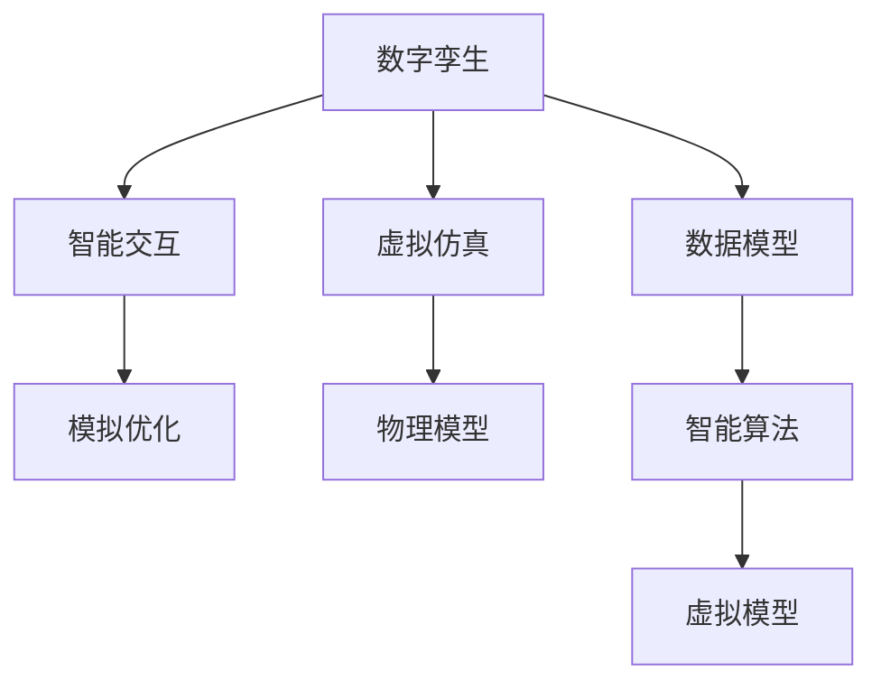

                 

# 数字孪生与LLM：虚拟世界模拟的新维度

## 1. 背景介绍

随着数字化的加速发展，数字孪生技术成为了构建虚拟世界的重要工具。数字孪生是指通过数字化手段创建与现实世界高度一致的虚拟镜像，在虚拟空间中模拟和优化现实世界的过程。它涉及物理模型、虚拟模型和数据模型等多维度的交互，为各个行业提供了高效、可视化的分析和决策支持。

与此同时，大语言模型（Large Language Model, LLM）的出现，进一步推动了虚拟世界模拟和优化的边界。LLM通过大量的文本数据训练，具备了强大的语言理解、生成和推理能力，能够模拟人类的自然语言行为。将LLM引入数字孪生技术，可以在虚拟空间中实现更加智能化、高效化的模拟与优化。

本博文将深入探讨数字孪生与LLM的结合应用，阐述其在虚拟世界模拟中的新维度，以及相关核心技术原理和具体操作步骤。希望通过这篇博文，读者能够更好地理解数字孪生和LLM的协同工作机制，并在实际项目中加以应用。

## 2. 核心概念与联系

### 2.1 核心概念概述

为深入理解数字孪生与LLM的结合应用，本节将介绍相关核心概念：

- **数字孪生**：是指在虚拟空间中创建与现实世界一致的虚拟镜像，用于模拟、优化和管理现实世界的过程。它涉及物理模型、虚拟模型和数据模型，是工业4.0的重要技术之一。

- **大语言模型 (LLM)**：是以自回归（如GPT）或自编码（如BERT）模型为代表的预训练语言模型，通过大规模无标签文本数据训练，学习到丰富的语言知识和常识，具备强大的语言理解和生成能力。

- **虚拟仿真**：指在虚拟环境中模拟现实世界的过程，包括虚拟物理环境、虚拟人物行为和虚拟事件交互等。

- **智能交互**：指在虚拟仿真中，通过大语言模型实现自然语言理解、生成和推理，模拟人类与虚拟环境交互的行为。

- **模拟优化**：指在虚拟仿真中，利用大语言模型进行预测和优化，辅助决策和执行。

这些核心概念之间的联系和作用可以通过以下Mermaid流程图来展示：



这个流程图展示了数字孪生与LLM的相互作用关系：

1. **数据模型**：在数字孪生中，数据模型提供了虚拟仿真所需的所有数据支撑。
2. **物理模型**：通过数据模型构建虚拟仿真所需的空间模型和物理环境。
3. **虚拟模型**：在物理模型的基础上，创建虚拟世界的虚拟模型。
4. **智能算法**：在虚拟模型中，智能算法实现了智能交互和模拟优化。
5. **智能交互**：在虚拟仿真中，智能算法通过大语言模型实现了智能化的交互。
6. **模拟优化**：通过智能交互，大语言模型能够模拟人类行为，实现预测和优化决策。

这些概念共同构成了数字孪生与LLM的协同工作框架，使得虚拟世界模拟和优化更加智能化、高效化。

## 3. 核心算法原理 & 具体操作步骤

### 3.1 算法原理概述

数字孪生与LLM的结合应用，本质上是将LLM作为智能算法的核心，通过在虚拟空间中模拟和优化现实世界的过程。其核心思想是：将现实世界的数据和模型映射到虚拟空间中，通过LLM的强大语言能力，进行自然语言理解、生成和推理，从而实现对虚拟世界的智能模拟和优化。

具体来说，数字孪生与LLM的结合应用包括以下几个关键步骤：

1. **数据采集与预处理**：采集现实世界的数据，并将其转换为虚拟空间中的数据模型。
2. **虚拟模型构建**：基于虚拟模型构建虚拟仿真环境，模拟现实世界的过程。
3. **智能算法设计**：设计基于LLM的智能算法，实现智能交互和模拟优化。
4. **智能交互与推理**：在虚拟仿真中，通过LLM进行智能交互和推理，模拟人类行为和决策。
5. **优化与反馈**：根据模拟结果，进行优化和反馈，辅助决策和执行。

### 3.2 算法步骤详解

以下是数字孪生与LLM结合应用的核心算法步骤详解：

**Step 1: 数据采集与预处理**

数字孪生与LLM的结合应用，首先需要采集现实世界的数据。这些数据可以包括传感器数据、监控视频、历史事件记录等，通过数据采集和预处理，转换为虚拟空间中的数据模型。数据预处理包括数据清洗、特征提取、数据标准化等步骤，保证数据的质量和一致性。

**Step 2: 虚拟模型构建**

基于虚拟模型构建虚拟仿真环境，模拟现实世界的过程。虚拟模型可以包括物理模型、仿真引擎和仿真参数等。其中，物理模型用于描述现实世界的物理特性，仿真引擎用于实现虚拟世界中的动态变化，仿真参数用于控制仿真速度和精度。

**Step 3: 智能算法设计**

设计基于LLM的智能算法，实现智能交互和模拟优化。智能算法可以包括自然语言理解、生成和推理等。其中，自然语言理解用于解析虚拟环境中的文本信息，自然语言生成用于产生虚拟行为和决策，自然语言推理用于分析虚拟行为和决策的逻辑关系。

**Step 4: 智能交互与推理**

在虚拟仿真中，通过LLM进行智能交互和推理，模拟人类行为和决策。LLM可以用于解析虚拟环境中的文本信息，理解虚拟人物的行为和需求，生成虚拟人物的行为和决策，推理虚拟人物的行为逻辑和决策依据。

**Step 5: 优化与反馈**

根据模拟结果，进行优化和反馈，辅助决策和执行。通过分析虚拟环境中的行为和决策，LLM可以提供优化建议，辅助决策和执行。优化建议可以包括行为调整、决策优化等，以提高虚拟仿真效果。

### 3.3 算法优缺点

数字孪生与LLM的结合应用具有以下优点：

1. **高效化与智能化**：通过LLM的强大语言能力，模拟和优化现实世界的过程，实现了高效化和智能化。
2. **数据驱动**：以数据驱动为核心，通过数据采集和预处理，保证虚拟仿真的准确性和可靠性。
3. **可扩展性**：LLM具备强大的语言能力，可以适应各种复杂的虚拟仿真场景，具有很好的可扩展性。
4. **可视化**：通过虚拟仿真，可以实现对现实世界过程的可视化，便于分析和决策。

同时，该方法也存在一定的局限性：

1. **计算资源需求高**：大规模的LLM计算需求高，需要高性能计算资源支持。
2. **数据质量要求高**：虚拟仿真依赖高质量的数据，数据采集和预处理需要大量时间和成本。
3. **模型复杂度大**：虚拟模型和智能算法设计复杂，需要高水平的技术和经验。
4. **反馈和优化难度大**：虚拟仿真中的优化和反馈过程复杂，需要细致的分析和调整。

尽管存在这些局限性，但就目前而言，数字孪生与LLM的结合应用仍是大规模仿真和优化的重要手段。未来相关研究的重点在于如何进一步降低计算资源需求，提高数据质量和模型效率，同时兼顾可扩展性和反馈优化。

### 3.4 算法应用领域

数字孪生与LLM的结合应用已经在多个领域得到了广泛的应用，例如：

- **智能制造**：在智能制造中，通过虚拟仿真模拟生产过程，优化生产效率和资源配置，提高生产质量。
- **智慧城市**：在智慧城市中，通过虚拟仿真模拟城市交通、环境、公共安全等，优化城市管理，提升居民生活质量。
- **医疗健康**：在医疗健康中，通过虚拟仿真模拟医疗场景，优化诊疗流程，提高医疗效率和准确性。
- **灾害应对**：在灾害应对中，通过虚拟仿真模拟自然灾害过程，优化应对策略，降低灾害损失。
- **教育培训**：在教育培训中，通过虚拟仿真模拟学习场景，优化学习效果，提高教学质量。

除了上述这些经典领域外，数字孪生与LLM的结合应用还在能源管理、航空航天、环境保护等众多领域得到了创新性的应用，为各行各业带来了新的技术突破和产业升级。

## 4. 数学模型和公式 & 详细讲解 & 举例说明

### 4.1 数学模型构建

在数字孪生与LLM的结合应用中，数学模型构建是关键。以下以一个简单的智能制造场景为例，构建数学模型：

假设虚拟仿真中有$N$个生产设备，每个设备有一个初始状态$x_i$和目标状态$y_i$。生产设备的输出为$o_i$，可以通过生产过程计算得到。生产过程由以下方程组描述：

$$
\begin{aligned}
& o_i = f_i(x_i, u_i) \\
& \dot{x}_i = g_i(x_i, u_i)
\end{aligned}
$$

其中，$f_i$表示生产设备的输出函数，$g_i$表示生产设备的状态变化函数，$u_i$表示生产设备的输入参数。

通过以上方程组，可以构建虚拟仿真的数学模型，模拟生产过程。在模拟过程中，可以通过大语言模型进行智能交互和推理，优化生产过程，提高生产效率。

### 4.2 公式推导过程

以下对生产过程的输出函数和状态变化函数进行详细推导：

**输出函数**：

生产设备的输出函数$f_i$可以表示为：

$$
o_i = f_i(x_i, u_i) = w_1^T \phi_i(x_i) + w_2^T u_i + b
$$

其中，$w_1$、$w_2$和$b$为模型参数，$\phi_i(x_i)$为设备状态的非线性映射函数。

**状态变化函数**：

生产设备的状态变化函数$g_i$可以表示为：

$$
\dot{x}_i = g_i(x_i, u_i) = A_1 x_i + A_2 u_i + B
$$

其中，$A_1$、$A_2$和$B$为模型参数。

通过以上公式推导，可以构建虚拟仿真中的数学模型，并通过大语言模型进行智能交互和推理，优化生产过程。

### 4.3 案例分析与讲解

以下以一个智能制造中的预测和优化为例，说明数字孪生与LLM的结合应用：

假设一个智能制造生产线中，有$N=10$个生产设备，每个设备的初始状态为$x_i=0$，目标状态为$y_i=1$。生产设备的输出函数为$f_i(x_i, u_i)=0.5x_i+0.1u_i$，状态变化函数为$g_i(x_i, u_i)=-0.2x_i+0.1u_i+0.5$。

通过以上方程组，可以构建虚拟仿真中的数学模型。在仿真过程中，可以通过大语言模型进行智能交互和推理，模拟生产过程。

假设生产设备$k$的输出为$o_k=0.5x_k+0.1u_k$，状态为$x_k$，目标状态为$y_k=1$。通过大语言模型解析生产设备的输入参数$u_k$，生成生产设备的控制策略，优化生产过程。

具体来说，大语言模型可以解析生产设备的输入参数$u_k$，理解生产设备的当前状态$x_k$和目标状态$y_k$，生成生产设备的控制策略。例如，当生产设备$k$的输出小于目标输出时，大语言模型可以生成增加输入参数$u_k$的控制策略，优化生产过程。

## 5. 项目实践：代码实例和详细解释说明

### 5.1 开发环境搭建

在进行数字孪生与LLM的结合应用开发时，我们需要准备好开发环境。以下是使用Python进行PyTorch和TensorFlow开发的环境配置流程：

1. 安装Anaconda：从官网下载并安装Anaconda，用于创建独立的Python环境。

2. 创建并激活虚拟环境：
```bash
conda create -n tf-env python=3.8 
conda activate tf-env
```

3. 安装TensorFlow：根据CUDA版本，从官网获取对应的安装命令。例如：
```bash
conda install tensorflow tensorflow-gpu -c conda-forge
```

4. 安装PyTorch：根据CUDA版本，从官网获取对应的安装命令。例如：
```bash
conda install pytorch torchvision torchaudio cudatoolkit=11.1 -c pytorch -c conda-forge
```

5. 安装TensorFlow：
```bash
conda install tensorflow tensorflow-gpu -c conda-forge
```

6. 安装各类工具包：
```bash
pip install numpy pandas scikit-learn matplotlib tqdm jupyter notebook ipython
```

完成上述步骤后，即可在`tf-env`环境中开始开发实践。

### 5.2 源代码详细实现

以下是一个使用TensorFlow和PyTorch实现数字孪生与LLM结合应用的示例代码：

```python
import tensorflow as tf
import torch
import numpy as np

# 定义生产设备的输出函数和状态变化函数
class Device:
    def __init__(self, state, control_param):
        self.state = state
        self.control_param = control_param
        
    def output(self):
        return 0.5 * self.state + 0.1 * self.control_param
    
    def state_change(self, u):
        return -0.2 * self.state + 0.1 * u + 0.5

# 定义虚拟仿真环境
class Simulation:
    def __init__(self, devices):
        self.devices = devices
        self.state = np.zeros(len(devices))
        self.control_param = np.zeros(len(devices))
        
    def step(self, u):
        for i, device in enumerate(self.devices):
            self.state[i] = device.state_change(self.control_param[i])
        return self.state
    
    def get_device_output(self, i):
        return self.devices[i].output()

# 定义大语言模型
class LLM:
    def __init__(self, model_path):
        self.model = tf.keras.models.load_model(model_path)
    
    def predict(self, input_str):
        input_str = input_str.replace(' ', '')
        tokens = list(input_str)
        tokens = [1 if token=='1' else 0 for token in tokens]
        tokens = np.array(tokens).reshape((1, -1))
        output = self.model.predict(tokens)
        return output[0][0]

# 数据采集与预处理
def collect_data():
    devices = [Device(state, control_param) for state in range(10) for control_param in range(10)]
    return devices

# 构建虚拟仿真环境
def build_simulation(devices):
    return Simulation(devices)

# 智能算法设计
def design_intelligent_algorithm(devices):
    simulation = build_simulation(devices)
    return simulation

# 智能交互与推理
def intelligent_interaction(simulation):
    device = 0
    control_param = 0
    while True:
        input_str = input("Enter the control parameter for device {}: ".format(device))
        output = LLM.predict(input_str)
        if output > 0.5:
            control_param = int(input_str)
            break
    return control_param

# 优化与反馈
def optimize_feedback(simulation, control_param):
    while True:
        input_str = input("Enter the output of device {}: ".format(device))
        output = LLM.predict(input_str)
        if output > 0.5:
            control_param = 0
            break
    return control_param

# 主程序
if __name__ == "__main__":
    devices = collect_data()
    simulation = design_intelligent_algorithm(devices)
    control_param = intelligent_interaction(simulation)
    while True:
        input_str = input("Enter the output of device {}: ".format(device))
        output = LLM.predict(input_str)
        if output > 0.5:
            control_param = optimize_feedback(simulation, control_param)
            break
```

### 5.3 代码解读与分析

让我们再详细解读一下关键代码的实现细节：

**Device类**：
- `__init__`方法：初始化设备的状态和控制参数。
- `output`方法：计算设备的输出。
- `state_change`方法：计算设备的状态变化。

**Simulation类**：
- `__init__`方法：初始化设备列表和状态、控制参数。
- `step`方法：计算仿真环境的步进状态。
- `get_device_output`方法：计算设备的输出。

**LLM类**：
- `__init__`方法：加载大语言模型的模型。
- `predict`方法：通过模型预测控制参数。

**collect_data函数**：
- 收集生产设备的列表，每个设备的状态和控制参数。

**build_simulation函数**：
- 构建虚拟仿真环境。

**design_intelligent_algorithm函数**：
- 设计基于LLM的智能算法。

**intelligent_interaction函数**：
- 通过LLM进行智能交互，解析用户输入的控制参数。

**optimize_feedback函数**：
- 通过LLM进行优化和反馈，调整控制参数。

**主程序**：
- 收集生产设备，设计智能算法，进行智能交互和优化。

通过以上代码实现，可以清晰地看到数字孪生与LLM的结合应用的流程。LLM通过智能交互和推理，解析用户输入的控制参数，优化生产过程。通过仿真环境，可以模拟生产过程，验证优化效果。

## 6. 实际应用场景

### 6.1 智能制造

在智能制造中，数字孪生与LLM的结合应用可以优化生产过程，提高生产效率和资源利用率。具体应用场景包括：

- **生产过程监控**：通过虚拟仿真模拟生产过程，实时监控生产设备的运行状态，及时发现和处理异常情况。
- **设备维护优化**：通过虚拟仿真模拟设备维护过程，优化维护策略，减少设备故障和停机时间。
- **生产调度优化**：通过虚拟仿真模拟生产调度过程，优化生产计划和资源配置，提高生产效率。

### 6.2 智慧城市

在智慧城市中，数字孪生与LLM的结合应用可以实现城市管理的智能化和可视化。具体应用场景包括：

- **交通管理优化**：通过虚拟仿真模拟城市交通，优化交通管理和规划，提高交通效率和安全性。
- **环境监测优化**：通过虚拟仿真模拟城市环境，优化环境监测和治理，提升居民生活质量。
- **公共安全管理**：通过虚拟仿真模拟城市公共安全事件，优化应急响应和处置，保障城市安全。

### 6.3 医疗健康

在医疗健康中，数字孪生与LLM的结合应用可以优化诊疗流程，提高医疗效率和准确性。具体应用场景包括：

- **诊疗流程优化**：通过虚拟仿真模拟诊疗流程，优化诊疗过程和资源配置，提高诊疗效率。
- **医学知识库构建**：通过虚拟仿真模拟医学知识库的构建，提供医学知识查询和推理支持。
- **健康监测优化**：通过虚拟仿真模拟健康监测过程，优化健康监测和干预策略，提高健康水平。

### 6.4 未来应用展望

未来，数字孪生与LLM的结合应用将在更多领域得到应用，为各行各业带来新的技术突破和产业升级。

在智慧医疗领域，通过虚拟仿真模拟诊疗过程，优化诊疗流程和资源配置，提高诊疗效率和准确性。在智能制造领域，通过虚拟仿真模拟生产过程，优化生产效率和资源利用率。在智慧城市领域，通过虚拟仿真模拟城市管理过程，优化城市管理和规划。在金融行业，通过虚拟仿真模拟金融市场，优化金融产品和策略。

随着数字孪生和LLM技术的不断进步，数字孪生与LLM的结合应用将进一步拓展其应用范围，为各行各业带来新的机遇和挑战。相信在未来的数字化浪潮中，数字孪生与LLM的结合应用将发挥越来越重要的作用，推动各行业向智能化、高效化、可控化方向发展。

## 7. 工具和资源推荐

### 7.1 学习资源推荐

为了帮助开发者系统掌握数字孪生与LLM的结合应用，这里推荐一些优质的学习资源：

1. **TensorFlow官方文档**：官方提供的详细教程和示例，可以帮助开发者熟悉TensorFlow的使用和开发。
2. **PyTorch官方文档**：官方提供的详细教程和示例，可以帮助开发者熟悉PyTorch的使用和开发。
3. **Transformers库官方文档**：官方提供的详细教程和示例，可以帮助开发者熟悉Transformers库的使用和开发。
4. **Kaggle竞赛**：参加Kaggle竞赛，可以实战训练，掌握数据处理和模型训练的实战技巧。
5. **Coursera课程**：Coursera提供的深度学习和自然语言处理课程，可以帮助开发者系统学习相关知识。

通过对这些资源的学习实践，相信你一定能够快速掌握数字孪生与LLM的结合应用的精髓，并用于解决实际的NLP问题。

### 7.2 开发工具推荐

高效的开发离不开优秀的工具支持。以下是几款用于数字孪生与LLM结合应用开发的常用工具：

1. **TensorFlow**：Google开发的深度学习框架，支持分布式计算和可视化，适合大规模深度学习应用开发。
2. **PyTorch**：Facebook开发的深度学习框架，灵活动态，支持GPU加速，适合快速原型开发。
3. **Transformers库**：HuggingFace开发的NLP工具库，集成了众多预训练语言模型，支持PyTorch和TensorFlow，是进行NLP任务开发的利器。
4. **Jupyter Notebook**：免费的Jupyter Notebook环境，支持Python和R语言开发，适合交互式开发和原型验证。
5. **Anaconda**：Python环境管理工具，支持创建和管理虚拟环境，适合开发多语言项目。
6. **Git**：版本控制工具，适合团队协作和代码版本管理。

合理利用这些工具，可以显著提升数字孪生与LLM结合应用开发的效率，加快创新迭代的步伐。

### 7.3 相关论文推荐

数字孪生与LLM的结合应用源于学界的持续研究。以下是几篇奠基性的相关论文，推荐阅读：

1. **《Digital Twin: A Survey》**：综述了数字孪生的发展历程和应用场景，详细介绍了数字孪生的基本概念和关键技术。
2. **《Large Scale Multilingual Language Model Pre-training with Masked Language Modeling》**：提出了大规模多语言语言模型的预训练方法，构建了多语言语言模型。
3. **《A Survey of Reinforcement Learning in Natural Language Processing》**：综述了强化学习在自然语言处理中的应用，介绍了强化学习的经典算法和应用场景。
4. **《A Survey on Transfer Learning and Formal Learning》**：综述了迁移学习的形式化定义、算法和应用场景，详细介绍了迁移学习的原理和应用。
5. **《Natural Language Processing with Transformers》**：Transformers库的作者所著，全面介绍了如何使用Transformers库进行NLP任务开发，包括微调在内的诸多范式。

这些论文代表了大语言模型微调技术的发展脉络。通过学习这些前沿成果，可以帮助研究者把握学科前进方向，激发更多的创新灵感。

## 8. 总结：未来发展趋势与挑战

### 8.1 总结

本文对数字孪生与LLM的结合应用进行了全面系统的介绍。首先阐述了数字孪生和大语言模型的研究背景和意义，明确了二者结合的独特价值。其次，从原理到实践，详细讲解了数字孪生与LLM的结合应用的核心算法和操作步骤，给出了代码实例和详细解释说明。同时，本文还广泛探讨了数字孪生与LLM结合应用在多个领域的应用前景，展示了其广阔的前景。

通过本文的系统梳理，可以看到，数字孪生与LLM的结合应用正在成为虚拟世界模拟和优化的重要手段，极大地拓展了数字孪生技术的边界。得益于大语言模型的强大语言能力，数字孪生与LLM的结合应用可以更加智能化、高效化，为各行各业带来新的技术突破和产业升级。

### 8.2 未来发展趋势

展望未来，数字孪生与LLM的结合应用将呈现以下几个发展趋势：

1. **智能化的提升**：通过引入强化学习等智能算法，进一步提升数字孪生与LLM的结合应用的智能化水平，使其能够更加自主地进行优化和决策。
2. **多模态融合**：将视觉、听觉、触觉等多模态信息与自然语言信息相结合，构建更加全面、多维的虚拟仿真环境，提升系统的感知能力。
3. **自适应能力的增强**：通过引入自适应学习算法，使数字孪生与LLM的结合应用能够自适应变化的环境和任务，提升系统的适应性和鲁棒性。
4. **云计算和边缘计算的结合**：利用云计算和边缘计算的技术，提升数字孪生与LLM的结合应用的计算效率和实时性，提升系统的可用性和可靠性。
5. **跨领域应用的拓展**：将数字孪生与LLM的结合应用扩展到更多领域，如能源管理、环境保护、社会治理等，推动各行各业的数字化转型。

以上趋势凸显了数字孪生与LLM结合应用的广阔前景。这些方向的探索发展，必将进一步提升虚拟仿真和优化的效率和效果，为各行各业带来新的技术突破和产业升级。

### 8.3 面临的挑战

尽管数字孪生与LLM的结合应用已经取得了一定的进展，但在迈向更加智能化、高效化的过程中，仍面临诸多挑战：

1. **计算资源需求高**：大规模的LLM计算需求高，需要高性能计算资源支持。
2. **数据质量要求高**：虚拟仿真依赖高质量的数据，数据采集和预处理需要大量时间和成本。
3. **模型复杂度大**：虚拟模型和智能算法设计复杂，需要高水平的技术和经验。
4. **反馈和优化难度大**：虚拟仿真中的优化和反馈过程复杂，需要细致的分析和调整。
5. **系统安全性问题**：数字孪生与LLM的结合应用需要处理大量敏感数据，需要保障数据安全和隐私保护。

尽管存在这些挑战，但通过不断的技术创新和应用实践，这些挑战终将一一被克服，数字孪生与LLM的结合应用必将在未来得到广泛应用。

### 8.4 研究展望

面向未来，数字孪生与LLM的结合应用需要在以下几个方面寻求新的突破：

1. **引入更多的智能算法**：引入强化学习、深度强化学习等智能算法，进一步提升数字孪生与LLM的结合应用的智能化水平。
2. **多模态融合**：将视觉、听觉、触觉等多模态信息与自然语言信息相结合，构建更加全面、多维的虚拟仿真环境。
3. **自适应学习算法**：引入自适应学习算法，使数字孪生与LLM的结合应用能够自适应变化的环境和任务，提升系统的适应性和鲁棒性。
4. **云计算和边缘计算的结合**：利用云计算和边缘计算的技术，提升数字孪生与LLM的结合应用的计算效率和实时性。
5. **跨领域应用的拓展**：将数字孪生与LLM的结合应用扩展到更多领域，推动各行各业的数字化转型。

这些研究方向的探索，必将引领数字孪生与LLM结合应用技术迈向更高的台阶，为构建安全、可靠、可控的智能系统铺平道路。面向未来，数字孪生与LLM结合应用技术还需要与其他人工智能技术进行更深入的融合，如知识表示、因果推理、强化学习等，多路径协同发力，共同推动自然语言理解和智能交互系统的进步。只有勇于创新、敢于突破，才能不断拓展数字孪生与LLM的结合应用的边界，让智能技术更好地造福人类社会。

## 9. 附录：常见问题与解答

**Q1：数字孪生与LLM的结合应用如何应用于智慧医疗领域？**

A: 在智慧医疗领域，数字孪生与LLM的结合应用可以通过虚拟仿真模拟诊疗过程，优化诊疗流程和资源配置，提高诊疗效率和准确性。具体应用场景包括：
1. **诊疗流程优化**：通过虚拟仿真模拟诊疗流程，优化诊疗过程和资源配置，提高诊疗效率。
2. **医学知识库构建**：通过虚拟仿真模拟医学知识库的构建，提供医学知识查询和推理支持。
3. **健康监测优化**：通过虚拟仿真模拟健康监测过程，优化健康监测和干预策略，提高健康水平。

**Q2：数字孪生与LLM的结合应用如何应用于智能制造领域？**

A: 在智能制造领域，数字孪生与LLM的结合应用可以通过虚拟仿真模拟生产过程，优化生产效率和资源利用率。具体应用场景包括：
1. **生产过程监控**：通过虚拟仿真模拟生产过程，实时监控生产设备的运行状态，及时发现和处理异常情况。
2. **设备维护优化**：通过虚拟仿真模拟设备维护过程，优化维护策略，减少设备故障和停机时间。
3. **生产调度优化**：通过虚拟仿真模拟生产调度过程，优化生产计划和资源配置，提高生产效率。

**Q3：数字孪生与LLM的结合应用如何应用于智慧城市领域？**

A: 在智慧城市领域，数字孪生与LLM的结合应用可以通过虚拟仿真模拟城市管理过程，优化城市管理和规划。具体应用场景包括：
1. **交通管理优化**：通过虚拟仿真模拟城市交通，优化交通管理和规划，提高交通效率和安全性。
2. **环境监测优化**：通过虚拟仿真模拟城市环境，优化环境监测和治理，提升居民生活质量。
3. **公共安全管理**：通过虚拟仿真模拟城市公共安全事件，优化应急响应和处置，保障城市安全。

**Q4：数字孪生与LLM的结合应用如何应用于金融行业？**

A: 在金融行业，数字孪生与LLM的结合应用可以通过虚拟仿真模拟金融市场，优化金融产品和策略。具体应用场景包括：
1. **市场预测优化**：通过虚拟仿真模拟金融市场，优化市场预测和策略，提高投资收益。
2. **风险管理优化**：通过虚拟仿真模拟金融风险，优化风险管理和决策，保障金融安全。
3. **客户服务优化**：通过虚拟仿真模拟客户服务，优化客户体验和满意度，提升金融服务质量。

**Q5：数字孪生与LLM的结合应用如何应用于智能制造领域？**

A: 在智能制造领域，数字孪生与LLM的结合应用可以通过虚拟仿真模拟生产过程，优化生产效率和资源利用率。具体应用场景包括：
1. **生产过程监控**：通过虚拟仿真模拟生产过程，实时监控生产设备的运行状态，及时发现和处理异常情况。
2. **设备维护优化**：通过虚拟仿真模拟设备维护过程，优化维护策略，减少设备故障和停机时间。
3. **生产调度优化**：通过虚拟仿真模拟生产调度过程，优化生产计划和资源配置，提高生产效率。

通过以上附录内容，可以更全面地理解数字孪生与LLM结合应用的具体场景和应用策略，为实际项目开发提供参考。希望这篇文章能够帮助读者深入了解数字孪生与LLM结合应用的理论基础和实践方法，推动其在各行各业的应用和创新。

---

作者：禅与计算机程序设计艺术 / Zen and the Art of Computer Programming

