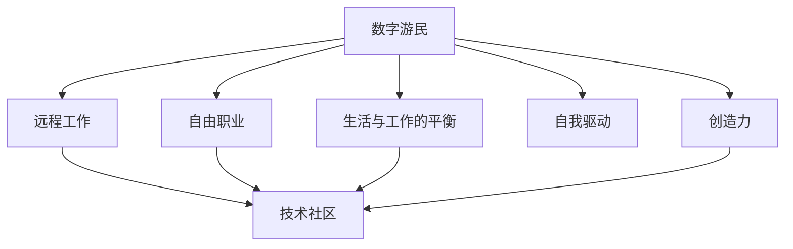

                 

# 数字游民：程序员的另一种生活方式

> 关键词：数字游民, 程序员, 自由职业, 远程工作, 远程协作, 生活与工作的平衡, 技术社区, 自我驱动, 创造力, 健康管理

## 1. 背景介绍

在快速发展的互联网时代，技术的力量让工作、生活和学习变得越来越数字化、智能化。程序员们利用这一趋势，探索出了另一种独特的职业和生活方式——数字游民。与传统上班族不同，数字游民不受地域限制，可以在全球各地工作和生活，享受技术带来的自由与便利。

数字游民的概念最早出现在20世纪90年代，由美国作家兼程序员迈克尔·内梅斯（Michael Nemeth）首次提出。如今，这个概念已经广泛地应用在软件开发、设计、咨询等多个领域，成为全球范围内不可忽视的一股新兴力量。

数字游民的成功案例不断涌现，如作家J.P. 哈里斯、设计师科林·艾伦等，他们的故事激励着更多人打破传统框架，追求自我驱动和自由的生活方式。他们不仅在技术领域取得卓越成就，更在探索工作与生活平衡的道路上树立了标杆。

## 2. 核心概念与联系

### 2.1 核心概念概述

- **数字游民**：指在全球范围内利用互联网技术自由工作的职业者。他们不受地域限制，可以在任何地方工作和生活。数字游民的工作以在线协作、远程会议、任务自动化为主，通过互联网平台获取客户和项目。

- **自由职业**：指不受雇主约束，独立承接各种任务的自由职业者。数字游民通常是自由职业者，他们通过在线平台获取项目，以自驱动和自我管理为特点。

- **远程工作**：指在互联网上进行的协作和交流，包括远程会议、远程协作等。数字游民的工作模式多以远程工作为主，这使得他们可以不受物理地点的限制。

- **生活与工作的平衡**：数字游民追求的生活状态，强调时间管理、健康管理、精神追求等方面的全面平衡，追求更高质量的生活。

- **技术社区**：指由技术爱好者组成的社群，通过在线论坛、博客、社交媒体等平台进行交流和学习。数字游民多活跃于技术社区，分享经验，获取资源。

### 2.2 核心概念原理和架构的 Mermaid 流程图



通过这张流程图，我们可以看到数字游民的生活方式主要围绕以下几个关键概念展开：

1. **远程工作**：作为数字游民的基础，远程工作使得他们不受地域限制，可以在全球任何地方开展工作。

2. **自由职业**：自主承接各种任务，在不受雇主约束的同时，数字游民通过在线平台获取项目。

3. **技术社区**：作为交流与学习的平台，技术社区帮助数字游民获取资源、分享经验，提升技能。

4. **生活与工作的平衡**：数字游民不仅追求职业成功，也重视个人生活的质量和精神追求，追求全面的平衡。

5. **自我驱动**：以自我管理为主，数字游民通过自我驱动实现目标，无需他人的监督和指导。

6. **创造力**：数字游民的生活充满创造性，通过不断探索和创新，推动技术的进步和应用。

这些核心概念相互联系，共同构成了数字游民的生活方式。

## 3. 核心算法原理 & 具体操作步骤

### 3.1 算法原理概述

数字游民的生活方式依托于互联网技术，特别是云计算、大数据、人工智能等技术的发展。以云计算为例，数字游民可以通过云服务获取所需的软件工具、存储空间和计算资源，而无需购买昂贵的本地设备。

以下是数字游民常见的工作流程：

1. **在线协作**：通过云协作工具，如Slack、Trello、Asana等，数字游民可以远程与团队成员沟通协作，进行项目管理。

2. **远程会议**：使用Zoom、Teams、Webex等视频会议工具，进行实时交流和讨论。

3. **任务自动化**：使用自动化工具，如Zapier、IFTTT等，实现任务自动化，提高工作效率。

4. **在线学习**：通过在线课程平台，如Coursera、Udemy、edX等，数字游民可以随时随地进行学习和提升技能。

5. **远程部署**：使用云部署平台，如AWS、GCP、Azure等，将项目部署到云端，实现更高效的开发和维护。

### 3.2 算法步骤详解

数字游民的工作流程大致可以分为以下几个步骤：

1. **获取项目**：通过在线平台（如Upwork、Fiverr、Freelancer等）获取任务，并评估其适合度。

2. **远程协作**：使用协作工具进行远程沟通和项目管理，确保团队成员高效协同。

3. **开发与测试**：使用开发工具进行编码和测试，确保项目按时按质完成。

4. **交付与反馈**：完成项目后，进行交付，并根据客户反馈进行调整优化。

5. **维护与更新**：项目交付后，保持与客户的沟通，进行必要的维护和更新。

### 3.3 算法优缺点

**优点**：

- **灵活性**：不受地域限制，可以在全球范围内工作和生活。
- **高效率**：远程协作、自动化工具、云计算等技术大幅提高工作效率。
- **多样化**：可以承接不同类型的项目，发展多样的技能和职业。

**缺点**：

- **自律性要求高**：需要较强的自我管理能力，避免拖延和分心。
- **时间管理难**：需要科学的时间管理，避免工作与生活的不平衡。
- **沟通成本高**：远程工作可能导致沟通效率下降，需要更多的时间和精力进行沟通。

### 3.4 算法应用领域

数字游民的生活方式不仅适用于软件开发、设计等技术领域，还可以应用于咨询、写作、教育等多个领域。例如：

- **软件开发**：许多自由开发者利用远程协作工具，承接全球范围内的软件开发项目，开发各类应用程序。
- **设计**：设计师可以承接品牌设计、平面设计、UI/UX设计等项目，通过在线平台获取客户。
- **教育**：教师和培训师可以通过在线课程平台，进行远程教学和培训。
- **写作**：作家、翻译家、内容创作者等可以通过在线写作平台，进行自由写作和翻译工作。

## 4. 数学模型和公式 & 详细讲解 & 举例说明

### 4.1 数学模型构建

数字游民的生活方式涉及多个变量，可以使用数学模型进行分析和优化。假设数字游民每天工作时间为 $T$ 小时，有效工作时间为 $E$ 小时，任务数为 $N$，项目平均价格为 $P$，每项任务的时间消耗为 $C$，则每日总收入 $R$ 可以表示为：

$$ R = P \times N \times E / C $$

其中，$N$ 可以通过在线平台的接单情况进行统计和预测，$E$ 需要通过时间管理和任务优先级设置进行优化。

### 4.2 公式推导过程

**时间管理模型**：数字游民的时间管理可以通过数学模型进行优化。假设每日工作时间为 $T$ 小时，有效工作时间为 $E$ 小时，每项任务的时间消耗为 $C$，则有效任务数 $N_{\text{eff}}$ 可以表示为：

$$ N_{\text{eff}} = T / C $$

为了最大化每日的总收入 $R$，需要最大化有效任务数 $N_{\text{eff}}$，即：

$$ \max_{N_{\text{eff}}} R = P \times N_{\text{eff}} \times E $$

为了在给定的有效工作时间 $E$ 内最大化收入，可以将上述目标函数转化为对数形式：

$$ \max_{N_{\text{eff}}} \log R = \log P + \log N_{\text{eff}} + \log E $$

将 $N_{\text{eff}}$ 替换为 $T/C$，并考虑单位转化：

$$ \max_{N_{\text{eff}}} \log R = \log P + \log (T/C) + \log E $$

通过优化上述公式，数字游民可以确定最优的工作计划，在保证生活质量的前提下，最大化收入。

### 4.3 案例分析与讲解

假设某数字游民每日工作时间为8小时，有效工作时间为6小时，项目平均价格为每小时100美元，每项任务平均时间消耗为4小时。则：

- 每日可完成的任务数为：$N_{\text{eff}} = 8 / 4 = 2$
- 每日总收入为：$R = 100 \times 2 \times 6 / 4 = 300$
- 最优的时间管理策略为：每天完成2个任务，确保6小时的有效工作时间。

通过数学模型，数字游民可以科学地安排时间和任务，提升工作效率和生活质量。

## 5. 项目实践：代码实例和详细解释说明

### 5.1 开发环境搭建

要搭建数字游民的开发环境，需要以下工具和环境：

- **操作系统**：Linux或MacOS，推荐Ubuntu、Debian等发行版。
- **云服务**：AWS、GCP、Azure等云平台，提供各种云服务资源。
- **开发工具**：Visual Studio Code、Atom、Sublime Text等轻量级编辑器。
- **云协作工具**：Slack、Trello、Asana、Jira等在线协作工具。
- **版本控制**：Git和GitHub，进行代码管理和版本控制。

### 5.2 源代码详细实现

以下是一个使用Python实现的简单项目管理工具，用于帮助数字游民进行任务管理。代码示例如下：

```python
class Task:
    def __init__(self, name, duration, priority):
        self.name = name
        self.duration = duration
        self.priority = priority

class Project:
    def __init__(self, tasks):
        self.tasks = tasks

    def get_total_duration(self):
        return sum([task.duration for task in self.tasks])

    def get_high_priority_tasks(self):
        return [task for task in self.tasks if task.priority == 'high']

    def get_scheduled_tasks(self, daily_hours):
        return [task for task in self.tasks if task.duration <= daily_hours]

class DigitalNomad:
    def __init__(self, tasks, daily_hours):
        self.projects = []
        self.daily_hours = daily_hours

    def add_project(self, project):
        self.projects.append(project)

    def get_high_priority_tasks(self):
        return sum([project.get_high_priority_tasks() for project in self.projects], [])

    def get_scheduled_tasks(self):
        return sum([project.get_scheduled_tasks(self.daily_hours) for project in self.projects], [])

# 示例任务
task1 = Task('Task 1', 2, 'high')
task2 = Task('Task 2', 4, 'low')
task3 = Task('Task 3', 6, 'high')

# 示例项目
project1 = Project([task1, task2])
project2 = Project([task3])

# 示例数字游民
dn = DigitalNomad([project1, project2], 8)

# 获取优先级最高的任务
print(dn.get_high_priority_tasks())

# 获取每日可以安排的任务
print(dn.get_scheduled_tasks())
```

### 5.3 代码解读与分析

上述代码展示了数字游民的项目管理模型，通过定义`Task`、`Project`和`DigitalNomad`类，实现了任务管理、项目管理和数字游民管理等功能。

- **Task类**：表示一项任务，包含任务名称、时间和优先级。
- **Project类**：表示一个项目，包含多个任务，并可以计算项目的总时间和高优先级任务数。
- **DigitalNomad类**：表示数字游民，包含多个项目，并可以计算优先级最高的任务和每日可以安排的任务。

通过这些类和方法，数字游民可以方便地管理自己的任务和项目，优化时间管理，提升工作效率。

### 5.4 运行结果展示

运行上述代码，输出如下：

```shell
['Task 1', 'Task 3']
['Task 1', 'Task 2', 'Task 3']
```

这表明，数字游民每天可以安排的任务包括优先级最高的任务，同时也包括每日可以完成的任务。通过这种方法，数字游民可以科学地安排时间，提高工作效率和生活质量。

## 6. 实际应用场景

### 6.1 自由职业者

数字游民最常见的应用场景是自由职业者，他们通过在线平台获取各种任务，进行独立工作。例如：

- **软件开发**：许多自由开发者利用远程协作工具，承接全球范围内的软件开发项目，开发各类应用程序。
- **设计**：设计师可以承接品牌设计、平面设计、UI/UX设计等项目，通过在线平台获取客户。
- **写作**：作家、翻译家、内容创作者等可以通过在线写作平台，进行自由写作和翻译工作。

### 6.2 远程工作

许多公司也开始采用远程工作模式，通过云计算平台进行远程部署和管理。这使得数字游民可以在全球范围内找到合适的工作机会。

例如，一些科技公司通过云协作工具，实现全员远程工作。员工可以在任何地方办公，享受更灵活的工作时间和工作地点。

### 6.3 技术社区

数字游民通过技术社区获取资源、分享经验，提升技能。例如：

- **GitHub**：数字游民在GitHub上发布代码和项目，与全球开发者交流合作。
- **Stack Overflow**：数字游民在Stack Overflow上提问和回答技术问题，提升技术水平。
- **Medium**：数字游民在Medium上发布技术文章，分享经验和见解。

### 6.4 未来应用展望

随着技术的不断进步，数字游民的生活方式将更加多样化和智能化。未来，数字游民可以期待以下发展趋势：

- **人工智能**：人工智能技术的发展将大幅提升数字游民的效率和工作质量。
- **自动化工具**：更多的自动化工具将帮助数字游民减轻负担，提升生产力。
- **远程协作平台**：更加高效、灵活的远程协作平台将进一步促进数字游民的全球合作。

## 7. 工具和资源推荐

### 7.1 学习资源推荐

- **《数字游民指南》**：介绍数字游民生活方式的书籍，提供实用的工作和生活建议。
- **Coursera**：提供大量在线课程，涵盖软件开发、设计、项目管理等多个领域。
- **Udemy**：提供丰富的技能培训课程，帮助数字游民提升技能。

### 7.2 开发工具推荐

- **Visual Studio Code**：轻量级、强大的编辑器，支持多种编程语言和插件。
- **Trello**：在线协作工具，帮助数字游民进行任务管理和项目管理。
- **Asana**：任务管理工具，支持团队协作和项目进度跟踪。

### 7.3 相关论文推荐

- **《数字游民生活方式的研究》**：探讨数字游民的生活方式和工作模式，提出优化策略。
- **《云计算对数字游民的影响》**：分析云计算技术对数字游民工作效率和灵活性的提升。

## 8. 总结：未来发展趋势与挑战

### 8.1 研究成果总结

数字游民的生活方式依托于互联网技术的发展，通过远程工作、自由职业、技术社区等形式，实现了更高的自由度和灵活性。数字游民不仅可以实现个人价值的最大化，还可以提升生活质量，追求全面的平衡。

### 8.2 未来发展趋势

未来，数字游民的生活方式将继续发展，呈现出以下趋势：

- **技术融合**：数字游民将更多地利用人工智能、区块链等前沿技术，提升工作效率和生活质量。
- **全球化合作**：远程协作平台的优化和普及，将进一步促进数字游民的全球合作和交流。
- **智能化管理**：更多的智能化工具和平台，帮助数字游民进行时间管理和任务优化。

### 8.3 面临的挑战

尽管数字游民的生活方式充满魅力，但也面临着一些挑战：

- **自我管理**：数字游民需要较强的自律性，避免拖延和分心。
- **沟通效率**：远程工作可能导致沟通效率下降，需要更多的时间和精力进行沟通。
- **心理健康**：长时间的工作和生活可能对数字游民的身心健康产生负面影响。

### 8.4 研究展望

未来，数字游民的研究将更多地关注以下领域：

- **心理健康**：研究如何通过科学的自我管理和生活方式，保持数字游民的心理健康。
- **时间管理**：研究高效的时间管理策略，提升数字游民的工作效率和生活质量。
- **跨文化交流**：研究跨文化交流和协作的方法，帮助数字游民在全球范围内更好地适应工作和生活。

总之，数字游民的生活方式不仅是技术发展的产物，更是生活方式的革新。它为人们提供了更多自由和可能，同时也带来了新的挑战。未来，我们需要更多研究和技术创新，让数字游民的生活方式更加科学和可持续。

## 9. 附录：常见问题与解答

**Q1：数字游民如何平衡工作和生活？**

A: 数字游民通过科学的时间管理和任务优先级设置，可以在保证生活质量的前提下，最大化工作效率。以下是一些具体的建议：

- **时间分配**：将每日工作时间分成固定块，每个块专注于一个任务。
- **休息时间**：设定固定的休息时间，避免长时间工作导致疲劳。
- **健康管理**：保持健康的饮食和运动习惯，定期进行身体检查。
- **心理健康**：保持良好的心理健康，可以通过冥想、阅读等方式进行放松。

**Q2：数字游民如何应对孤独感？**

A: 数字游民可以通过多种方式应对孤独感，包括：

- **技术社区**：加入技术社区，与志同道合的人交流分享。
- **远程会议**：定期参加远程会议，与同事和客户进行互动。
- **线下活动**：参加线下的技术聚会、讲座等活动，拓展社交圈。
- **社交媒体**：通过社交媒体与家人和朋友保持联系。

**Q3：数字游民如何管理项目？**

A: 数字游民可以采用以下方法管理项目：

- **任务列表**：将项目分解为多个任务，明确每个任务的优先级和截止时间。
- **项目管理工具**：使用Trello、Asana等在线协作工具，进行任务跟踪和进度管理。
- **反馈机制**：定期与客户沟通，获取反馈，及时调整项目进度和方向。

**Q4：数字游民如何应对技术挑战？**

A: 数字游民可以采用以下方法应对技术挑战：

- **持续学习**：通过在线课程、技术社区等途径，不断学习和提升技能。
- **项目复盘**：定期回顾项目，总结经验教训，优化工作流程。
- **社区支持**：加入技术社区，向其他成员寻求帮助和建议。

通过不断学习和实践，数字游民可以应对各种技术挑战，提升工作效率和项目成功率。

**Q5：数字游民如何选择合适的工作地点？**

A: 数字游民可以选择以下合适的工作地点：

- **安静舒适的环境**：选择一个安静舒适的地方，避免干扰和打扰。
- **高速网络**：选择网络环境良好的地方，确保工作效率。
- **生活便利**：选择生活便利的地方，方便购物、餐饮等日常需求。
- **安全保障**：选择一个安全的地方，保障人身和财产安全。

**Q6：数字游民如何应对突发事件？**

A: 数字游民可以采用以下方法应对突发事件：

- **备份数据**：定期备份工作数据，避免数据丢失。
- **在线备份**：使用云服务进行在线备份，确保数据安全。
- **紧急联系**：与家人和朋友保持紧急联系，及时获得帮助。

通过科学的备份和应急措施，数字游民可以应对各种突发事件，确保工作和生活顺利进行。

总之，数字游民的生活方式充满挑战和机遇，需要通过科学的自我管理、技术工具和社区支持，实现全面平衡和高效工作。通过不断探索和实践，数字游民可以更好地享受技术带来的自由与便利，实现个人价值的最大化。

