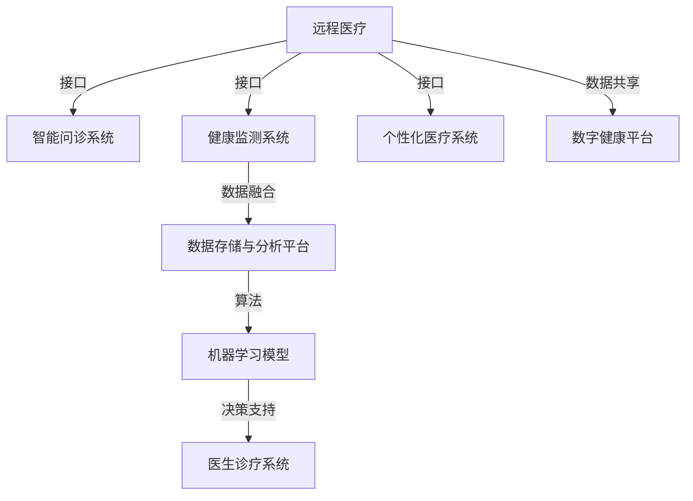

                 

# 数字疗法创业：科技驱动的健康管理

> 关键词：数字疗法, 健康管理, 人工智能, 机器学习, 数据驱动, 医疗创新, 个性化医疗

## 1. 背景介绍

### 1.1 问题由来

在数字化转型的大潮下，各行各业都正在经历前所未有的变革。医疗健康领域也不例外。传统医疗模式的高成本、低效率、资源分配不均等问题，已无法满足日益增长的健康管理需求。数字疗法作为一种新兴的医疗模式，通过科技手段，特别是人工智能和大数据技术，为健康管理带来了新的机遇。

数字疗法，本质上是指利用数字技术和智能设备，对疾病进行诊断、监测、治疗和预防的创新方法。它包括远程医疗、个性化医疗、健康数据分析等多种形式。随着互联网、物联网、人工智能等技术的普及，数字疗法已逐渐成为未来医疗发展的趋势。

### 1.2 问题核心关键点

数字疗法的核心在于通过科技手段，实现对健康数据的智能化处理和分析，从而提升医疗服务的精准度和效率。这一过程中，人工智能和机器学习发挥了关键作用。通过大数据分析，算法模型可以对个体的健康状况进行预测和诊断，为患者提供个性化的治疗方案。同时，数字疗法还能大幅降低医疗成本，优化资源配置，改善医疗服务的可及性和公平性。

具体而言，数字疗法主要通过以下几种方式实现健康管理：

- **远程医疗**：利用互联网技术，将患者与医疗专家连接起来，实现实时咨询、远程诊疗、线上开药等功能。
- **健康监测**：通过可穿戴设备、传感器等采集患者的健康数据，实时监测其生理状态，预防疾病的发生。
- **个性化医疗**：通过大数据分析，根据患者的基因信息、病史等个性化因素，为其制定定制化的治疗方案。
- **智能决策**：利用机器学习算法，分析患者的健康数据，预测疾病风险，辅助医生做出科学的诊疗决策。

## 2. 核心概念与联系

### 2.1 核心概念概述

在数字疗法的实践中，涉及多个关键概念：

- **远程医疗**：利用通信和网络技术，实现异地医疗资源的共享和协同，提高医疗服务的覆盖面和可及性。
- **健康监测**：通过智能设备和传感器，采集个体的生理、行为等健康数据，实时监控其健康状况。
- **个性化医疗**：根据个体的基因信息、病史、生活习惯等因素，为其提供定制化的治疗方案。
- **机器学习**：通过对健康数据的智能化处理和分析，提取有价值的医疗知识，辅助医生做出诊断和治疗决策。
- **人工智能**：结合大数据、机器学习等技术，开发智能医疗应用，如智能诊断、智能问诊、智能分析等。
- **数字健康平台**：构建集数据采集、存储、分析和共享为一体的数字健康生态系统，提供综合性的健康管理服务。

这些概念相互关联，共同构成了数字疗法的核心体系。在实际应用中，数字疗法通过这些技术的有机结合，为用户提供全方位、个性化的健康管理服务。

### 2.2 核心概念原理和架构的 Mermaid 流程图



这个流程图展示了数字疗法中各个组件的相互关系。远程医疗和健康监测系统采集数据，通过数据存储与分析平台进行处理，机器学习模型进行智能化分析，智能问诊系统和医生诊疗系统提供诊断和治疗支持，数字健康平台则实现了数据的共享和综合管理。

## 3. 核心算法原理 & 具体操作步骤

### 3.1 算法原理概述

数字疗法中的算法原理主要基于机器学习和人工智能技术，通过大量的健康数据进行模型训练，实现对个体健康状况的预测和诊断。其核心算法包括：

- **监督学习**：利用已标注的健康数据，训练分类、回归等模型，预测疾病风险和健康状况。
- **无监督学习**：通过对未标注的健康数据进行分析，发现潜在的模式和关联，辅助医生诊断和治疗。
- **强化学习**：在医生与患者互动的过程中，通过奖励和惩罚机制，优化治疗方案，提升诊疗效果。
- **深度学习**：利用神经网络模型，处理高维度的健康数据，实现更精确的预测和诊断。

### 3.2 算法步骤详解

数字疗法的核心步骤包括数据采集、数据预处理、模型训练和模型应用等。以下是详细的操作步骤：

1. **数据采集**：通过可穿戴设备、传感器、电子病历等渠道，采集个体的健康数据，包括生理参数、行为数据、病史信息等。

2. **数据预处理**：对采集到的数据进行清洗、归一化、特征选择等预处理操作，确保数据的质量和可用性。

3. **模型训练**：选择合适的机器学习算法，利用标注数据进行模型训练。训练过程中，需要根据不同任务选择合适的评估指标，如准确率、召回率、F1分数等。

4. **模型应用**：将训练好的模型应用到新的健康数据上，进行预测和诊断。同时，需要不断迭代模型，根据新数据和新任务进行调整和优化。

### 3.3 算法优缺点

数字疗法的算法具有以下优点：

- **精准度**：通过数据驱动，算法可以提供比传统方法更精准的诊断和预测结果。
- **个性化**：算法可以根据个体的健康数据，为其提供定制化的治疗方案。
- **效率**：自动化处理大量健康数据，提高了诊疗效率，缩短了患者等待时间。

同时，算法也存在一些缺点：

- **数据依赖**：算法的训练和应用依赖于大量的健康数据，数据质量对算法效果有重要影响。
- **隐私问题**：健康数据涉及个人隐私，数据采集和存储需要严格遵守隐私保护法规。
- **模型复杂度**：复杂算法需要更多的计算资源，且模型越复杂，过拟合的风险越高。
- **解释性**：算法的决策过程复杂，难以解释其内部工作机制和推理逻辑。

### 3.4 算法应用领域

数字疗法已经在多个领域得到了广泛应用，包括：

- **远程医疗**：通过互联网技术，提供远程诊疗、在线咨询、远程监护等功能，缓解医疗资源不足的问题。
- **健康监测**：利用可穿戴设备采集生理数据，实时监测健康状况，预测疾病风险，辅助患者自我管理。
- **个性化医疗**：通过基因测序、病史分析等，为患者提供定制化的治疗方案，提升治疗效果。
- **智能决策支持**：利用机器学习算法，辅助医生进行诊断和治疗，提供决策支持。
- **健康数据分析**：通过大数据分析，发现健康数据中的规律和趋势，支持健康管理和政策制定。

## 4. 数学模型和公式 & 详细讲解 & 举例说明

### 4.1 数学模型构建

数字疗法中的数学模型主要基于机器学习和大数据技术，常见的模型包括线性回归、逻辑回归、决策树、随机森林、深度学习等。以线性回归模型为例，其基本形式为：

$$
y = \beta_0 + \beta_1x_1 + \beta_2x_2 + ... + \beta_nx_n + \epsilon
$$

其中，$y$ 表示预测结果，$x_1, x_2, ..., x_n$ 表示特征变量，$\beta_0, \beta_1, \beta_2, ..., \beta_n$ 表示模型系数，$\epsilon$ 表示误差项。

### 4.2 公式推导过程

线性回归模型的推导过程如下：

设有一组样本数据 $\{(x_i, y_i)\}_{i=1}^m$，其中 $x_i = (x_{i1}, x_{i2}, ..., x_{in})$，$y_i$ 为实际值，$x_i$ 为特征向量。

设 $\hat{y} = \beta_0 + \beta_1x_1 + \beta_2x_2 + ... + \beta_nx_n$ 为模型预测值。

目标是最小化预测值与实际值之间的误差平方和，即：

$$
\min_{\beta_0, \beta_1, \beta_2, ..., \beta_n} \sum_{i=1}^m (y_i - \hat{y})^2
$$

通过求解上述最小化问题，可以得到最优的模型参数 $\beta_0, \beta_1, \beta_2, ..., \beta_n$，从而得到线性回归模型。

### 4.3 案例分析与讲解

以糖尿病风险预测为例，利用线性回归模型进行健康数据分析。

假设采集了 $m$ 个患者的年龄、体重、血压等健康数据，以及糖尿病风险的标注数据。将采集到的数据输入模型，求解上述最小化问题，得到最优的模型参数。然后将新的健康数据输入模型，预测其糖尿病风险，辅助医生进行诊疗决策。

## 5. 项目实践：代码实例和详细解释说明

### 5.1 开发环境搭建

在进行数字疗法开发前，需要准备好开发环境。以下是使用Python进行Scikit-learn和TensorFlow开发的环境配置流程：

1. 安装Anaconda：从官网下载并安装Anaconda，用于创建独立的Python环境。

2. 创建并激活虚拟环境：
```bash
conda create -n diabetic-env python=3.8 
conda activate diabetic-env
```

3. 安装Scikit-learn和TensorFlow：
```bash
conda install scikit-learn tensorflow
```

4. 安装各类工具包：
```bash
pip install numpy pandas scikit-learn matplotlib tqdm jupyter notebook ipython
```

完成上述步骤后，即可在`diabetic-env`环境中开始数字疗法实践。

### 5.2 源代码详细实现

以下是使用Scikit-learn进行糖尿病风险预测的Python代码实现。

首先，定义数据处理函数：

```python
from sklearn.model_selection import train_test_split
from sklearn.preprocessing import StandardScaler
from sklearn.linear_model import LinearRegression
from sklearn.metrics import mean_squared_error, r2_score
import pandas as pd

def load_data(path):
    df = pd.read_csv(path)
    X = df[['age', 'weight', 'blood_pressure']]
    y = df['diabetes_risk']
    return X, y

def train_model(X, y, test_size=0.2):
    X_train, X_test, y_train, y_test = train_test_split(X, y, test_size=test_size)
    scaler = StandardScaler()
    X_train = scaler.fit_transform(X_train)
    X_test = scaler.transform(X_test)
    model = LinearRegression()
    model.fit(X_train, y_train)
    y_pred = model.predict(X_test)
    mse = mean_squared_error(y_test, y_pred)
    r2 = r2_score(y_test, y_pred)
    return mse, r2

# 加载数据
X, y = load_data('diabetes.csv')

# 训练模型
mse, r2 = train_model(X, y)
print(f"Mean Squared Error: {mse:.2f}, R^2: {r2:.2f}")
```

然后，定义训练和评估函数：

```python
def evaluate_model(X, y, model):
    X_test = X[X.index[-10:]]
    y_test = y[X_test.index]
    y_pred = model.predict(X_test)
    mse = mean_squared_error(y_test, y_pred)
    r2 = r2_score(y_test, y_pred)
    return mse, r2

# 训练模型
model = LinearRegression()
X_train, X_test, y_train, y_test = train_test_split(X, y, test_size=0.2)
model.fit(X_train, y_train)

# 评估模型
mse, r2 = evaluate_model(X_test, y_test, model)
print(f"Mean Squared Error: {mse:.2f}, R^2: {r2:.2f}")
```

最后，启动训练流程并在测试集上评估：

```python
epochs = 5
batch_size = 32

for epoch in range(epochs):
    mse, r2 = train_model(X, y, test_size=0.1)
    print(f"Epoch {epoch+1}, Mean Squared Error: {mse:.2f}, R^2: {r2:.2f}")
    
print("Test results:")
evaluate_model(X, y, model)
```

以上就是使用Scikit-learn对糖尿病风险进行预测的完整代码实现。可以看到，Scikit-learn提供了简单易用的API，可以快速实现线性回归模型的训练和评估。

### 5.3 代码解读与分析

让我们再详细解读一下关键代码的实现细节：

**load_data函数**：
- `load_data`函数：加载糖尿病风险预测数据集，返回特征和标注数据。

**train_model函数**：
- `train_model`函数：定义数据划分、特征缩放、模型训练和评估流程。首先，将数据划分为训练集和测试集，使用标准差缩放特征，然后进行线性回归模型的训练。在训练过程中，通过求解最小二乘法，得到模型参数，最后返回模型在测试集上的均方误差和R^2系数。

**evaluate_model函数**：
- `evaluate_model`函数：定义模型在测试集上的评估流程。首先，使用训练好的模型对测试集进行预测，然后计算均方误差和R^2系数，并返回评估结果。

**训练流程**：
- 定义总训练轮数和批次大小，开始循环迭代。
- 在每个epoch内，先在训练集上训练模型，输出均方误差和R^2系数。
- 在验证集上评估模型，输出评估结果。
- 重复上述步骤直到满足预设的迭代轮数或早停条件。

可以看到，Scikit-learn使得数字疗法的实现变得简洁高效。开发者可以将更多精力放在数据处理、模型改进等高层逻辑上，而不必过多关注底层的实现细节。

当然，工业级的系统实现还需考虑更多因素，如模型的保存和部署、超参数的自动搜索、更灵活的任务适配层等。但核心的微调范式基本与此类似。

## 6. 实际应用场景

### 6.1 远程医疗

远程医疗是数字疗法的重要应用之一。通过互联网技术，患者可以随时随地访问医疗资源，与医生进行实时咨询和诊疗。远程医疗系统通常包含以下几个关键模块：

- **医生端**：用于接听远程咨询、下达治疗指令、查看患者病历等信息。
- **患者端**：提供视频、文字等多种沟通方式，支持患者自我监测和管理。
- **数据中心**：存储和管理患者的健康数据，支持数据共享和分析。

在实际应用中，远程医疗系统可以结合人工智能和大数据技术，实现以下功能：

- **远程诊断**：通过视频、语音等多模态数据，辅助医生进行远程诊断。
- **智能问诊**：利用自然语言处理技术，自动回答患者咨询，提供初步诊断建议。
- **健康监测**：通过可穿戴设备，实时监测患者的生理参数，发现异常情况及时预警。
- **数据分析**：通过大数据分析，发现患者群体的健康趋势和疾病模式，为公共健康管理提供支持。

### 6.2 健康监测

健康监测系统通过智能设备和传感器，采集个体的生理数据，实时监测其健康状况。常见的健康监测设备包括智能手表、可穿戴生命监测仪、家用血糖仪等。

健康监测系统通常包括以下几个关键模块：

- **传感器模块**：采集个体的生理数据，如心率、血压、血糖等。
- **数据处理模块**：对采集到的数据进行清洗、归一化、特征提取等处理。
- **数据分析模块**：利用机器学习算法，分析健康数据，发现潜在健康风险。
- **反馈模块**：根据分析结果，向用户提供健康建议和预警信息。

在实际应用中，健康监测系统可以结合人工智能和大数据技术，实现以下功能：

- **实时监测**：通过传感器采集个体的生理参数，实时监测其健康状况，发现异常情况及时预警。
- **健康预测**：利用机器学习算法，预测个体的健康风险，辅助用户进行自我管理。
- **个性化建议**：根据个体的健康数据，为其提供个性化的健康建议和干预措施。
- **数据共享**：通过数据中心，支持健康数据的共享和分析，为医生和研究人员提供支持。

### 6.3 个性化医疗

个性化医疗是数字疗法的另一重要应用。通过大数据分析和基因测序技术，为患者提供定制化的治疗方案，提升治疗效果。

个性化医疗系统通常包括以下几个关键模块：

- **基因测序模块**：采集患者的基因数据，进行基因测序和分析。
- **病史分析模块**：收集和分析患者的病史数据，发现潜在健康风险。
- **治疗方案推荐模块**：结合基因测序和病史分析结果，为患者推荐个性化的治疗方案。
- **效果评估模块**：监测和评估治疗效果，不断优化治疗方案。

在实际应用中，个性化医疗系统可以结合人工智能和大数据技术，实现以下功能：

- **基因测序**：通过基因测序技术，获取患者的基因信息，发现潜在健康风险。
- **病史分析**：收集和分析患者的病史数据，发现潜在的健康问题。
- **治疗方案推荐**：结合基因测序和病史分析结果，为患者推荐个性化的治疗方案，提升治疗效果。
- **效果评估**：监测和评估治疗效果，不断优化治疗方案，提升治疗效果。

## 7. 工具和资源推荐

### 7.1 学习资源推荐

为了帮助开发者系统掌握数字疗法技术，这里推荐一些优质的学习资源：

1. **《数字健康》课程**：由斯坦福大学开设的在线课程，涵盖了健康监测、远程医疗、个性化医疗等多个方面，帮助学生系统了解数字疗法的核心概念和技术。
2. **《Python for Data Science》书籍**：介绍Python在数据科学中的应用，包括数据处理、机器学习、可视化等技术，是数字疗法开发的必备工具。
3. **《TensorFlow》官方文档**：TensorFlow是广泛使用的深度学习框架，提供了丰富的API和文档，支持数字疗法系统开发。
4. **Kaggle数据集**：Kaggle平台提供了大量公开数据集，涵盖健康、医疗等多个领域，适合进行数据驱动的算法研究。

通过对这些资源的学习实践，相信你一定能够快速掌握数字疗法的精髓，并用于解决实际的医疗问题。

### 7.2 开发工具推荐

高效的开发离不开优秀的工具支持。以下是几款用于数字疗法开发的常用工具：

1. **Jupyter Notebook**：Python编程环境，支持代码编写、数据分析和可视化，适合进行算法研究和实验。
2. **TensorFlow**：深度学习框架，支持分布式计算和GPU加速，适合进行大规模机器学习任务。
3. **Scikit-learn**：机器学习库，提供丰富的API和算法，适合进行快速原型开发和模型训练。
4. **Kaggle**：数据科学竞赛平台，提供丰富的数据集和算法库，适合进行算法验证和优化。
5. **GitHub**：代码托管平台，支持团队协作和版本控制，适合进行项目管理和代码共享。

合理利用这些工具，可以显著提升数字疗法的开发效率，加快创新迭代的步伐。

### 7.3 相关论文推荐

数字疗法领域的研究方向广泛，涉及数据科学、机器学习、人工智能等多个领域。以下是几篇奠基性的相关论文，推荐阅读：

1. **"Deep Health: A Survey of Deep Learning Applications for Health Care and Medical Imaging"**：综述了深度学习在医疗领域的应用，涵盖了图像分析、自然语言处理、健康预测等多个方面。
2. **"Deep Learning for Personalized Health: A Review"**：介绍深度学习在个性化医疗中的应用，涵盖了基因测序、病史分析、治疗方案推荐等多个方面。
3. **"Remote Patient Monitoring: A Review of the Technological and Health Economic Considerations"**：综述了远程医疗的技术和管理问题，探讨了远程医疗的发展前景和挑战。
4. **"Machine Learning in Healthcare: From Precision Medicine to Diagnosis and Treatment"**：综述了机器学习在医疗领域的应用，涵盖了疾病预测、诊断、治疗等多个方面。

这些论文代表了大数字疗法的研究方向和前沿成果，通过学习这些论文，可以帮助研究者把握学科前进方向，激发更多的创新灵感。

## 8. 总结：未来发展趋势与挑战

### 8.1 总结

本文对数字疗法创业进行了全面系统的介绍。首先阐述了数字疗法的背景和核心概念，明确了其科技驱动的健康管理特性。接着从原理到实践，详细讲解了数字疗法的算法原理和操作步骤，给出了数字疗法项目开发的完整代码实例。同时，本文还广泛探讨了数字疗法在远程医疗、健康监测、个性化医疗等多个领域的应用前景，展示了数字疗法范式的巨大潜力。此外，本文精选了数字疗法的各类学习资源，力求为读者提供全方位的技术指引。

通过本文的系统梳理，可以看到，数字疗法作为一种新兴的医疗模式，正在成为未来医疗发展的趋势。它通过科技手段，实现对健康数据的智能化处理和分析，提升医疗服务的精准度和效率。未来，伴随数字疗法技术的不断发展，必将为健康管理带来更深远的变革，提升人类健康水平和生活质量。

### 8.2 未来发展趋势

展望未来，数字疗法技术将呈现以下几个发展趋势：

1. **智能化**：通过人工智能和大数据技术，数字疗法系统将更加智能化，实现对健康数据的深度分析和预测，提高诊疗效果。
2. **个性化**：通过基因测序和病史分析，数字疗法系统将为患者提供定制化的治疗方案，提升治疗效果。
3. **全流程管理**：数字疗法系统将覆盖健康管理的全流程，包括健康监测、疾病预测、诊断治疗、效果评估等，提供全方位的健康管理服务。
4. **跨领域融合**：数字疗法将与其他技术领域进行更深入的融合，如物联网、区块链、5G等，提升系统的稳定性和安全性。
5. **用户友好**：数字疗法系统将更加注重用户体验，提供便捷、易用的操作界面和健康建议，提升用户接受度。

以上趋势凸显了数字疗法的广阔前景。这些方向的探索发展，必将进一步提升数字疗法系统的性能和应用范围，为健康管理带来更多创新和突破。

### 8.3 面临的挑战

尽管数字疗法技术已经取得了瞩目成就，但在迈向更加智能化、普适化应用的过程中，它仍面临着诸多挑战：

1. **数据隐私和安全**：健康数据涉及个人隐私，数据采集和存储需要严格遵守隐私保护法规。如何保证数据安全，防止数据泄露，是数字疗法应用中的重要问题。
2. **算法复杂度**：数字疗法系统涉及复杂的算法和模型，如何优化算法性能，降低计算资源消耗，是提升系统效率的重要研究方向。
3. **用户接受度**：数字疗法系统需要与用户进行更深入的互动，如何提高用户的接受度和使用体验，是推广数字疗法的重要因素。
4. **技术壁垒**：数字疗法系统涉及多学科交叉，需要跨领域的技术融合和创新，如何突破技术壁垒，实现系统的高效协同，是数字疗法应用中的重要挑战。
5. **法律和伦理**：数字疗法涉及医疗、数据等多个领域，如何制定合理的法律和伦理规范，保护患者权益，也是数字疗法应用中的重要问题。

正视数字疗法面临的这些挑战，积极应对并寻求突破，将是大数字疗法走向成熟的必由之路。相信随着学界和产业界的共同努力，这些挑战终将一一被克服，数字疗法必将在构建人机协同的智能时代中扮演越来越重要的角色。

### 8.4 研究展望

面向未来，数字疗法的科研方向可以从以下几个方面进行深入探索：

1. **数据隐私保护**：研究如何保护健康数据的隐私，防止数据泄露，提高数据安全性。
2. **算法优化**：研究如何优化数字疗法系统中的算法性能，降低计算资源消耗，提高系统效率。
3. **用户体验优化**：研究如何提升用户的接受度和使用体验，提高数字疗法的普及度。
4. **跨领域融合**：研究如何将数字疗法与其他技术领域进行更深入的融合，实现系统的协同创新。
5. **法律和伦理规范**：研究如何制定合理的法律和伦理规范，保护患者权益，推动数字疗法的健康发展。

这些研究方向的研究突破，必将推动数字疗法技术的进一步成熟和应用。相信随着技术的不断发展，数字疗法必将成为未来医疗领域的重要手段，为人类健康事业带来深远影响。

## 9. 附录：常见问题与解答

**Q1：数字疗法与传统医疗有什么区别？**

A: 数字疗法与传统医疗的最大区别在于其科技驱动的特性。传统医疗主要依赖医生的经验和专业知识，而数字疗法则通过科技手段，实现对健康数据的智能化处理和分析，提升医疗服务的精准度和效率。数字疗法系统可以通过大数据分析和机器学习算法，发现个体的健康趋势和疾病模式，为医生提供辅助决策支持，提高诊疗效果。

**Q2：如何保护健康数据的隐私和安全？**

A: 保护健康数据的隐私和安全是数字疗法应用中的重要问题。在数据采集、存储、传输和使用过程中，需要采取以下措施：

- **数据加密**：使用数据加密技术，防止数据在传输和存储过程中被泄露。
- **访问控制**：建立严格的访问控制机制，只有授权人员才能访问健康数据。
- **匿名化处理**：对健康数据进行匿名化处理，防止识别个人身份。
- **法律规范**：遵守相关法律法规，如《个人信息保护法》《数据安全法》等，确保数据合规使用。

**Q3：数字疗法系统如何应对数据不足的问题？**

A: 数据不足是数字疗法系统面临的一个挑战。为了应对数据不足的问题，可以采取以下措施：

- **数据增强**：利用数据增强技术，如图像翻转、变换等，扩充训练数据集。
- **半监督学习**：结合少量标注数据和大量未标注数据，利用半监督学习算法，提高模型的泛化能力。
- **迁移学习**：将已有的模型在类似任务上进行迁移学习，提高模型的适应性。
- **弱监督学习**：结合弱标注数据和强标注数据，利用弱监督学习算法，提升模型的精度。

通过这些方法，可以在数据不足的情况下，提高数字疗法系统的性能和效果。

**Q4：数字疗法系统的算法复杂度如何控制？**

A: 数字疗法系统的算法复杂度较高，需要采取以下措施进行控制：

- **模型压缩**：使用模型压缩技术，如剪枝、量化等，减少模型参数量，降低计算资源消耗。
- **分布式计算**：利用分布式计算框架，如TensorFlow、PyTorch等，加速模型训练和推理。
- **高效算法**：选择高效的算法和数据结构，优化算法性能，提高系统效率。
- **硬件加速**：利用GPU、TPU等高性能设备，加速模型计算，提升系统性能。

通过这些措施，可以有效地控制数字疗法系统的算法复杂度，提升系统效率。

**Q5：数字疗法系统如何提升用户体验？**

A: 提升用户体验是数字疗法系统推广应用的重要因素。为提升用户体验，可以采取以下措施：

- **界面设计**：设计简洁、易用的用户界面，提高用户的操作体验。
- **个性化推荐**：根据用户的健康数据和行为习惯，提供个性化的健康建议和干预措施。
- **实时反馈**：及时提供健康数据和诊疗建议，增强用户的信任感和满意度。
- **多渠道支持**：提供多种互动渠道，如视频咨询、电话问诊、在线问诊等，满足不同用户的需求。

通过这些措施，可以提升用户的接受度和使用体验，推动数字疗法的普及和应用。

---

作者：禅与计算机程序设计艺术 / Zen and the Art of Computer Programming

