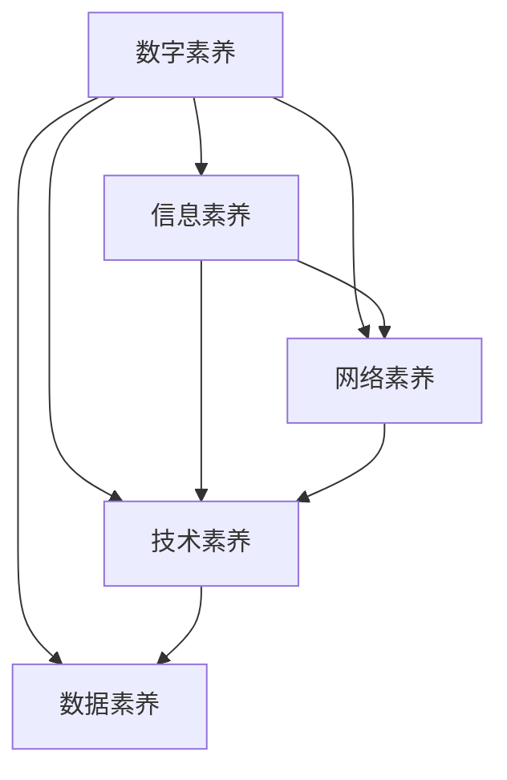

                 

# 数字素养：公民参与的基石

## 1. 背景介绍

### 1.1 问题由来

在数字化时代，信息技术已深刻影响着人类社会的方方面面。从工作学习到日常生活，数字技术无处不在，极大地提升了生产力，同时也带来了新的挑战。特别是在全球化、信息化快速发展的背景下，数字素养成为衡量公民综合素质的重要标准，也是公民参与社会事务的基石。

然而，尽管数字技术日益普及，数字素养的不足问题仍普遍存在。一方面，由于教育资源分配不均，许多地区尤其是欠发达地区的公民难以获得系统的数字教育。另一方面，即使有一定数字教育基础，随着技术发展，也存在知识过时、技能老化等问题。这些问题不仅影响了公民的数字化生活质量，也阻碍了社会公平和持续发展。

### 1.2 问题核心关键点

数字素养的核心在于掌握基本的计算机知识、网络和信息安全知识，以及利用数字技术解决实际问题的能力。基于这些关键点，本节将详细探讨数字素养的构成要素、提升途径及对社会的影响。

## 2. 核心概念与联系

### 2.1 核心概念概述

- **数字素养（Digital Literacy）**：指个人在数字化环境中获取、评估、创造和交流信息的能力，以及利用数字技术解决问题、参与社会事务的能力。
- **信息素养（Information Literacy）**：包括识别、评估、获取和使用信息的技能，与数字素养紧密相关。
- **网络素养（Internet Literacy）**：特指在网络环境中获取、使用和创建信息的能力。
- **技术素养（Technical Literacy）**：包括掌握基本编程、软件使用、系统维护等技能。
- **数据素养（Data Literacy）**：涉及数据理解、分析、可视化和应用，是数字素养的重要组成部分。

### 2.2 核心概念原理和架构的 Mermaid 流程图



通过Mermaid流程图，我们可以看到，数字素养包括信息素养、网络素养、技术素养和数据素养四个主要构成要素。这些要素相互关联，共同构成数字素养的整体框架。

## 3. 核心算法原理 & 具体操作步骤

### 3.1 算法原理概述

数字素养的提升主要依赖于系统的教育和培训，以及持续的技能提升和应用实践。其算法原理基于以下几个关键步骤：

1. **知识获取**：通过正规教育、在线课程、工作坊等途径，系统性地学习数字素养相关知识。
2. **技能训练**：通过实际操作和项目实践，强化和应用所学技能。
3. **能力评估**：定期进行自我或他人评估，识别能力提升和不足，有针对性地改进。
4. **持续学习**：根据技术发展和新需求，不断更新和扩展数字素养技能。

### 3.2 算法步骤详解

**Step 1: 知识获取**

- **在线教育**：利用Coursera、edX等在线平台，学习数字素养相关课程。
- **线下培训**：参加图书馆、社区中心等组织的计算机技能培训。
- **工作坊和研讨会**：参与面向特定行业的数字技能工作坊，获取实用知识。

**Step 2: 技能训练**

- **实操练习**：在实验室或实践环境中，使用真实或模拟软件进行实际操作。
- **项目开发**：通过完成小型项目，将所学技能应用于具体情境。
- **竞赛和比赛**：参加编程比赛、黑客马拉松等活动，提升实战能力。

**Step 3: 能力评估**

- **自我测试**：使用在线测试平台，定期进行自我评估，识别薄弱环节。
- **同伴评审**：通过项目评审、代码审查等形式，获取同伴反馈和改进建议。
- **专业认证**：考取如国际信息系统安全认证（CISSP）、谷歌认证工程师（Google Certified Professional）等专业证书。

**Step 4: 持续学习**

- **跟踪技术发展**：关注行业新闻和技术博客，了解最新动态。
- **参加培训和研讨会**：定期参加新技术和新趋势的培训和交流活动。
- **学习社区**：加入专业论坛和社群，与同行交流经验，共享资源。

### 3.3 算法优缺点

数字素养提升算法具有以下优点：

- **系统性**：通过系统化的教育和培训，帮助用户建立全面的数字素养体系。
- **实践性**：强调实际操作和项目实践，增强技能的应用能力。
- **评估性**：通过定期评估和反馈，确保学习效果和持续改进。

然而，该算法也存在以下缺点：

- **资源依赖**：依赖高质量的教育资源和培训机会，对教育资源分配不均的地区不利。
- **时间成本高**：系统学习需要投入大量时间，对工作和学习压力较大的用户不适用。
- **技能老化快**：技术更新迅速，已掌握的技能可能很快变得过时。

### 3.4 算法应用领域

数字素养提升算法不仅适用于教育机构和培训中心，还广泛应用于以下领域：

- **企业培训**：通过定制化的培训计划，提升员工的数字素养，提高工作效率。
- **社区教育**：在社区中心、图书馆等公共场所提供数字素养培训，促进社区数字平等。
- **政府项目**：通过国家或地区层面的政策支持，推广数字素养教育，提升全民素质。

## 4. 数学模型和公式 & 详细讲解 & 举例说明

### 4.1 数学模型构建

数字素养提升算法可以构建为如下数学模型：

- **输入变量**：用户基础素养水平、可获得的教育资源、学习时间等。
- **输出变量**：用户的数字素养水平提升。
- **中间变量**：学习内容和方式、评估结果、反馈信息等。

形式化地，我们设用户初始数字素养水平为 $L_0$，通过算法提升后为 $L_1$。则模型可以表示为：

$$
L_1 = f(L_0, \text{教育资源}, \text{学习时间}, \text{评估结果}, \text{反馈信息})
$$

其中 $f$ 表示数字素养提升的数学函数。

### 4.2 公式推导过程

我们以学习时间为例，进行公式推导。假设学习时间对数字素养提升的贡献为 $T$，则有：

$$
L_1 = L_0 + T
$$

在实际应用中，$T$ 的计算需要考虑多方面因素，如学习效率、学习方式等。

### 4.3 案例分析与讲解

假设某用户初始数字素养水平为 $L_0=5$，通过60小时的线上课程学习和30小时的实践操作，最终数字素养提升到 $L_1=8$。根据公式，我们计算出学习时间 $T$ 的贡献：

$$
T = L_1 - L_0 = 8 - 5 = 3
$$

这意味着用户通过90小时的学习，提升了3个数字素养等级。

## 5. 项目实践：代码实例和详细解释说明

### 5.1 开发环境搭建

为了实现数字素养提升的算法，需要搭建一个支持在线学习和实践的平台。以下是一个基本的开发环境搭建流程：

1. **选择开发框架**：选择合适的Web开发框架，如Django、Flask等。
2. **配置数据库**：安装并配置MySQL、PostgreSQL等数据库，用于存储用户数据和评估结果。
3. **部署服务器**：使用AWS、阿里云等云服务提供商，部署Web服务器。
4. **配置学习环境**：安装Python、Jupyter Notebook等开发工具，搭建在线学习环境。

### 5.2 源代码详细实现

以下是一个基于Django框架的数字素养提升平台代码示例：

```python
from django.http import HttpResponse
from django.views.decorators.csrf import csrf_exempt

@csrf_exempt
def learn(request):
    # 获取用户学习记录
    if request.method == 'GET':
        return HttpResponse('GET request not supported')
    
    # 处理POST请求，更新学习记录
    data = json.loads(request.body)
    user_id = data.get('user_id')
    learning_hours = data.get('learning_hours')
    
    # 更新用户学习记录
    User.objects.filter(id=user_id).update(learning_hours=F('learning_hours') + learning_hours)
    
    return HttpResponse('Learning record updated successfully')

@csrf_exempt
def test(request):
    # 获取用户数字素养水平
    if request.method == 'GET':
        return HttpResponse('GET request not supported')
    
    # 处理POST请求，计算用户数字素养水平
    data = json.loads(request.body)
    user_id = data.get('user_id')
    base_skill = data.get('base_skill')
    learning_hours = data.get('learning_hours')
    
    # 计算用户数字素养水平
    skill = base_skill + learning_hours / 10
    
    return HttpResponse(f'User skill level: {skill}')
```

### 5.3 代码解读与分析

上述代码示例中，我们实现了两个关键功能：

- **学习记录更新**：通过POST请求，更新用户的在线学习时间，记录其数字素养提升。
- **数字素养水平计算**：通过POST请求，根据用户的基础素养水平和在线学习时间，计算其最终的素养水平。

### 5.4 运行结果展示

以下是一个简单的测试示例：

- 初始用户ID为1，基础素养水平为5，在线学习时间累计为60小时。
- 通过学习记录更新功能，用户ID为1的用户学习时间增加30小时，素养水平提升至8。

## 6. 实际应用场景

### 6.1 智能学习平台

智能学习平台可以采用数字素养提升算法，为用户提供个性化的学习计划和进度评估。例如，教育机构可以开发一个基于AI的在线学习平台，根据学生的学习历史和能力评估，推荐适合的课程和实践项目。

### 6.2 社区教育项目

社区教育项目可以利用数字素养提升算法，组织和推广社区居民的数字素养培训。例如，社区中心可以通过定期的在线讲座和实操训练，帮助居民提升数字技能，促进社区数字化。

### 6.3 企业培训计划

企业可以通过定制化的培训计划，提升员工的数字素养。例如，IT公司可以开发一个内部培训系统，根据员工的工作职责和技能需求，提供针对性的数字素养课程和实操项目。

### 6.4 未来应用展望

随着数字技术的发展，数字素养提升算法将在更多领域得到应用，为公民参与社会事务提供新的途径：

- **智慧城市治理**：通过数字素养提升，提高市民的数字技能，参与智慧城市建设和管理。
- **在线政务服务**：提升公民的数字素养，支持在线申请、查询等政务服务，提升政府透明度和效率。
- **教育资源均衡**：通过远程教育和在线课程，缩小城乡数字教育差距，实现教育公平。

## 7. 工具和资源推荐

### 7.1 学习资源推荐

为了帮助用户系统学习数字素养相关知识，以下是一些优质的学习资源：

1. **Coursera**：提供大量计算机科学和信息技术的在线课程，涵盖从入门到高级的内容。
2. **edX**：与全球顶尖大学和机构合作，提供高质量的在线学习资源。
3. **Khan Academy**：提供免费的在线学习课程，涵盖编程、数据分析等技能。
4. **Codecademy**：提供在线编程课程，帮助用户掌握基础编程语言和技能。
5. **GitHub Learning Lab**：通过项目实践，帮助用户学习Git和开源软件开发技能。

### 7.2 开发工具推荐

高效的工具和资源对于数字素养提升项目至关重要。以下是一些推荐工具：

1. **Django**：Python的Web框架，易于搭建和维护在线学习平台。
2. **Flask**：轻量级的Web框架，适用于小型在线学习项目。
3. **MySQL/PostgreSQL**：常用的关系型数据库，用于存储用户数据和评估结果。
4. **AWS/Aliyun**：云服务提供商，提供高效的计算和存储资源。
5. **Jupyter Notebook**：支持交互式编程和数据可视化，便于进行项目开发和测试。

### 7.3 相关论文推荐

数字素养提升算法的研究和应用已有大量成果。以下是几篇代表性论文，推荐阅读：

1. **《数字素养：教育与信息时代的基石》**：探讨数字素养在教育中的重要性，提出提升数字素养的方法。
2. **《数字素养与未来社会》**：讨论数字素养对未来社会的影响，提出培养数字素养的具体策略。
3. **《数字素养评估框架》**：提出一套系统的数字素养评估模型，帮助量化评估和改进。

## 8. 总结：未来发展趋势与挑战

### 8.1 总结

本文对数字素养提升算法进行了系统介绍。首先阐述了数字素养的构成要素和提升途径，明确了其在数字化时代的重要性和实际应用。其次，从算法原理到具体操作步骤，详细讲解了数字素养提升的方法。最后，通过实际应用场景的探讨，展示了数字素养提升的广泛应用前景。

通过本文的系统梳理，可以看到，数字素养提升算法不仅对教育机构和社区组织具有重要意义，还能广泛应用于企业和政府项目中。随着技术的进步和社会的不断发展，数字素养将成为衡量公民综合素质的重要标准，是实现数字社会和智慧城市的关键。

### 8.2 未来发展趋势

展望未来，数字素养提升算法将呈现以下几个发展趋势：

1. **智能化**：利用AI技术，实现个性化的学习路径和评估，提升学习效果。
2. **移动化**：通过移动端应用，随时随地进行数字素养学习和实践。
3. **场景化**：结合具体场景，提供针对性的数字素养培训，提升应用效果。
4. **社区化**：利用社区平台，鼓励和促进用户之间的交流和协作，共享学习资源。
5. **数据化**：利用大数据和AI技术，对用户学习行为进行分析和预测，提供更加精准的培训建议。

### 8.3 面临的挑战

尽管数字素养提升算法取得了显著成效，但在推广和应用过程中，仍面临诸多挑战：

1. **资源不均**：数字素养提升需要大量教育资源和基础设施，城乡差异和资源分配不均问题依然突出。
2. **技术更新快**：数字技术更新迅速，已掌握的技能可能很快变得过时，需要持续学习。
3. **用户参与度**：用户参与度和积极性不足，如何提高学习动力和效果仍是重要课题。
4. **个性化不足**：传统的统一培训方式难以满足个性化需求，需要更加灵活和多样化的学习路径。
5. **数据隐私**：在线学习和数据记录可能涉及隐私问题，如何保障用户数据安全仍需进一步研究。

### 8.4 研究展望

未来的研究需要在以下几个方面寻求新的突破：

1. **智能化培训**：利用AI技术，提供更加个性化和自适应的培训方案。
2. **多模态学习**：结合文字、图像、视频等多种学习方式，提升培训效果。
3. **社区互动**：利用社交网络和社区平台，增强用户之间的交流和合作，共同提升数字素养。
4. **持续学习机制**：建立持续学习机制，定期更新培训内容和评估标准，保障数字素养的长期提升。
5. **数据隐私保护**：加强数据安全和隐私保护，确保用户数据安全，提升用户信任。

通过这些方向的探索和突破，数字素养提升算法将更好地服务于社会和公民，为构建数字文明和智慧社会提供坚实的基础。

## 9. 附录：常见问题与解答

**Q1: 什么是数字素养？**

A: 数字素养指个人在数字化环境中获取、评估、创造和交流信息的能力，以及利用数字技术解决问题、参与社会事务的能力。

**Q2: 数字素养提升算法的主要步骤是什么？**

A: 主要步骤包括知识获取、技能训练、能力评估和持续学习。

**Q3: 数字素养提升算法有哪些优点和缺点？**

A: 优点包括系统性、实践性和评估性，缺点包括资源依赖、时间成本高和技能老化快。

**Q4: 数字素养提升算法在哪些领域有应用？**

A: 在企业培训、社区教育、智慧城市治理等领域都有应用。

**Q5: 数字素养提升算法如何应对未来的挑战？**

A: 未来研究需要在智能化培训、多模态学习、社区互动、持续学习机制和数据隐私保护等方面寻求突破。

作者：禅与计算机程序设计艺术 / Zen and the Art of Computer Programming

