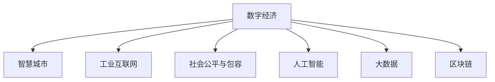

                 

# 数字经济：社会发展的助推器

> 关键词：数字经济, 数字化转型, 智慧城市, 工业互联网, 社会公平, 人工智能, 大数据, 区块链

## 1. 背景介绍

### 1.1 问题由来

随着信息技术的高速发展，全球经济正经历一场前所未有的数字化转型。数字经济（Digital Economy）作为这场转型的主导力量，已经深刻改变了生产、流通、消费等经济活动方式。数字经济以信息通信技术为核心，通过互联网、大数据、人工智能、区块链等新一代信息技术的应用，实现了经济活动的数字化、网络化和智能化。

数字经济的核心是数据的流动和使用，它不仅驱动了传统产业的升级改造，还催生了大量新兴业态和商业模式。在数字经济的推动下，经济效率得到了显著提升，产业结构得到了优化调整，社会福利得到了增强改善。然而，数字经济的发展也带来了新的挑战和问题，如数据隐私保护、网络安全、数字鸿沟等，这些问题亟需各方共同解决。

### 1.2 问题核心关键点

数字经济的核心在于通过信息技术的深度融合和广泛应用，推动经济社会高质量发展。其关键点包括：

- **信息化驱动**：以信息化为手段，优化资源配置，提升生产效率和服务水平。
- **数据资源利用**：通过大数据、人工智能等技术对数据进行挖掘和分析，释放数据价值。
- **创新驱动发展**：鼓励科技创新，促进传统产业向数字化、智能化转型。
- **数字公平与包容**：关注数字鸿沟，推动数字普惠，实现社会的包容性发展。
- **网络安全与隐私保护**：确保数据安全和用户隐私，构建安全可靠的数字生态。

这些关键点共同构成了数字经济的整体框架，为社会经济的可持续发展提供了新的动力。

## 2. 核心概念与联系

### 2.1 核心概念概述

为更好地理解数字经济的核心原理，本节将介绍几个密切相关的核心概念：

- **数字经济**：以数字化为特征，通过信息技术驱动经济活动的新型经济形态。它涵盖互联网、大数据、人工智能、物联网、区块链等多个领域，是当前和未来经济发展的核心引擎。
- **智慧城市**：利用信息技术提升城市管理和服务的智能化水平，改善居民生活环境，促进可持续发展。
- **工业互联网**：通过物联网、大数据、人工智能等技术，实现生产、制造、销售等全流程的数字化和智能化，提升工业竞争力。
- **社会公平与包容**：关注数字鸿沟问题，确保数字技术的普及和应用对所有人都是公平的，促进社会的包容性发展。
- **人工智能**：通过机器学习、深度学习等技术，模拟人类智能过程，解决复杂问题。
- **大数据**：指海量的、结构化的数据集合，通过数据分析挖掘，可以发现规律和洞见。
- **区块链**：一种去中心化的分布式账本技术，保障数据的安全和透明，构建信任机制。

这些概念之间的逻辑关系可以通过以下Mermaid流程图来展示：



这个流程图展示了数字经济的核心概念及其相互关系：

1. 数字经济是整体概念，包括智慧城市、工业互联网、人工智能、大数据、区块链等多个方面。
2. 智慧城市、工业互联网、人工智能、大数据、区块链等是数字经济的组成部分，通过信息技术的深度融合和应用，推动经济活动数字化、智能化。
3. 社会公平与包容是数字经济的目标之一，确保技术普及和应用对所有人都是公平的。

## 3. 核心算法原理 & 具体操作步骤

### 3.1 算法原理概述

数字经济的发展离不开信息技术的应用，而信息技术的应用离不开算法的支持。数字经济中的算法原理，主要涉及以下几个方面：

- **机器学习与深度学习**：通过算法从大量数据中提取特征和模式，实现智能化决策。
- **自然语言处理**：通过算法理解和处理自然语言，实现人机交互和信息检索。
- **计算机视觉**：通过算法分析和理解图像和视频内容，实现智能监控和识别。
- **推荐系统**：通过算法为用户推荐个性化内容，提升用户体验。
- **网络安全**：通过算法检测和防范网络攻击，保护数据安全。

这些算法原理共同构成了数字经济的技术基础，为数字经济的发展提供了强大的动力。

### 3.2 算法步骤详解

数字经济中的算法步骤通常包括以下几个关键环节：

**Step 1: 数据准备**
- 收集和清洗相关数据，确保数据质量和完整性。
- 对数据进行预处理，如去噪、归一化、特征提取等。
- 选择合适的算法模型和评估指标。

**Step 2: 模型训练**
- 使用训练数据对模型进行训练，优化模型参数。
- 使用交叉验证等技术防止过拟合，提高模型泛化能力。
- 调整超参数，如学习率、正则化系数等，找到最优模型。

**Step 3: 模型评估**
- 使用测试数据对模型进行评估，验证模型性能。
- 根据评估结果调整模型结构或参数，继续迭代优化。
- 进行模型调优，如数据增强、正则化、对抗训练等。

**Step 4: 模型部署**
- 将训练好的模型部署到实际应用场景中，进行实时处理和分析。
- 确保模型在生产环境中的稳定性和可靠性。
- 对模型进行监控和维护，及时发现和解决问题。

### 3.3 算法优缺点

数字经济中的算法具有以下优点：

- **高效性**：算法能够快速处理大量数据，提高决策效率。
- **准确性**：通过复杂算法模型，可以实现高精度的预测和决策。
- **灵活性**：算法可以适应不同场景和需求，进行灵活调整和优化。
- **自动化**：算法可以自动完成数据分析和决策，减少人工干预。

同时，这些算法也存在一些缺点：

- **高成本**：算法模型的开发和部署需要大量资源和成本。
- **复杂性**：复杂的算法模型需要专业知识，难以理解和使用。
- **数据依赖**：算法的性能依赖于数据质量和数量，数据不足会影响效果。
- **可解释性不足**：一些算法模型难以解释其内部机制和决策过程。

### 3.4 算法应用领域

数字经济中的算法广泛应用于多个领域，主要包括：

- **金融科技**：通过算法实现风险控制、交易分析、信用评估等。
- **电子商务**：通过算法实现商品推荐、用户画像、价格优化等。
- **智慧医疗**：通过算法实现疾病诊断、治疗方案推荐、患者管理等。
- **智能制造**：通过算法实现生产优化、质量控制、设备维护等。
- **智慧交通**：通过算法实现交通流量预测、路径规划、智能驾驶等。
- **智慧安防**：通过算法实现视频监控、异常检测、行为识别等。

此外，数字经济中的算法还广泛应用于社会治理、环境保护、公共安全等多个领域，为社会的数字化转型提供了技术支撑。

## 4. 数学模型和公式 & 详细讲解 & 举例说明

### 4.1 数学模型构建

在数字经济中，数学模型的构建是非常关键的。以下是几个常见的数学模型及其构建方式：

- **线性回归模型**：用于分析变量之间的线性关系，模型公式为 $y=\beta_0+\beta_1x_1+\beta_2x_2+...+\beta_nx_n+\epsilon$。
- **支持向量机（SVM）**：用于分类和回归问题，模型公式为 $f(x)=w\cdot x+b$，其中 $x$ 为输入特征，$w$ 为权重向量，$b$ 为偏置项。
- **决策树**：用于分类和回归问题，通过树状结构进行决策，模型公式为 $F(x)=\begin{cases}y_k & x\in R_k \\ 0 & \text{otherwise}\end{cases}$。
- **神经网络**：用于深度学习和模式识别，通过多层感知器进行特征提取和分类，模型公式为 $y=\sigma(w^Tz+b)$，其中 $\sigma$ 为激活函数，$z$ 为输入特征，$w$ 为权重矩阵，$b$ 为偏置项。
- **深度信念网络（DBN）**：用于深度学习和分布式建模，模型公式为 $p(x,z)=p(z|x)p(x)$。

这些数学模型构成了数字经济中算法的基础，为数据处理和分析提供了理论支持。

### 4.2 公式推导过程

以下以线性回归模型为例，介绍其推导过程：

假设有一组数据 $(x_1, y_1), (x_2, y_2), ..., (x_n, y_n)$，其中 $x$ 为输入特征，$y$ 为输出变量。线性回归模型假设 $y$ 与 $x$ 之间存在线性关系，即 $y=\beta_0+\beta_1x_1+\beta_2x_2+...+\beta_nx_n+\epsilon$，其中 $\beta_0, \beta_1, \beta_2, ..., \beta_n$ 为模型参数，$\epsilon$ 为误差项。

根据最小二乘法，我们可以通过求解以下优化问题来得到模型参数：

$$
\min_{\beta_0, \beta_1, \beta_2, ..., \beta_n} \sum_{i=1}^n (y_i-\beta_0-\beta_1x_{1,i}-\beta_2x_{2,i}-...-\beta_nx_{n,i})^2
$$

将其转化为矩阵形式，得到：

$$
\min_{\beta} ||Y-X\beta||_F^2
$$

其中 $Y=[y_1, y_2, ..., y_n]^T$，$X=[1, x_{1,1}, x_{1,2}, ..., x_{1,n}, x_{2,1}, x_{2,2}, ..., x_{2,n}, ..., x_{n,1}, x_{n,2}, ..., x_{n,n}]^T$，$||.||_F$ 为Frobenius范数。

使用矩阵求解方法，可以求得最优解：

$$
\beta = (X^TX)^{-1}X^TY
$$

通过上述推导过程，可以看出线性回归模型的求解过程，从而更好地理解其在数字经济中的应用。

### 4.3 案例分析与讲解

以下是几个数字经济中的实际案例及其数学模型应用：

**案例1: 金融风控**
- 数据：客户基本信息、历史交易记录、信用记录等。
- 模型：线性回归、决策树、支持向量机等。
- 应用：信用评分、风险评估、欺诈检测等。

**案例2: 电商推荐**
- 数据：用户行为数据、商品描述、用户画像等。
- 模型：协同过滤、基于内容的推荐、深度学习等。
- 应用：商品推荐、广告投放、价格优化等。

**案例3: 智慧医疗**
- 数据：患者病历、医学影像、基因数据等。
- 模型：深度学习、支持向量机、神经网络等。
- 应用：疾病诊断、治疗方案推荐、患者管理等。

这些案例展示了数字经济中数学模型的广泛应用，通过精确的模型构建和数据分析，实现智能决策和优化。

## 5. 项目实践：代码实例和详细解释说明

### 5.1 开发环境搭建

在进行数字经济项目开发前，我们需要准备好开发环境。以下是使用Python进行PyTorch开发的环境配置流程：

1. 安装Anaconda：从官网下载并安装Anaconda，用于创建独立的Python环境。

2. 创建并激活虚拟环境：
```bash
conda create -n pytorch-env python=3.8 
conda activate pytorch-env
```

3. 安装PyTorch：根据CUDA版本，从官网获取对应的安装命令。例如：
```bash
conda install pytorch torchvision torchaudio cudatoolkit=11.1 -c pytorch -c conda-forge
```

4. 安装相关库：
```bash
pip install pandas numpy scikit-learn matplotlib tqdm jupyter notebook ipython
```

完成上述步骤后，即可在`pytorch-env`环境中开始项目开发。

### 5.2 源代码详细实现

这里我们以电商推荐系统为例，给出使用PyTorch进行协同过滤推荐算法的实现。

首先，定义协同过滤推荐算法的函数：

```python
import numpy as np
import pandas as pd
from sklearn.metrics.pairwise import cosine_similarity

def collaborative_filtering(user_items, num_recommendations=10):
    similarity_matrix = cosine_similarity(user_items)
    ranking = np.dot(similarity_matrix, similarity_matrix)
    ranking = np.tril(ranking) + np.triu(ranking, k=-1)
    recommendations = np.dot(user_items.T, ranking).T.argsort()[::-1] + 1
    return recommendations
```

然后，读取电商数据并调用推荐函数：

```python
df = pd.read_csv('items.csv')
user_items = pd.pivot_table(df, index='user_id', columns='item_id', values='rating').fillna(0)
recommendations = collaborative_filtering(user_items)
print(recommendations)
```

这里我们使用Pandas库读取电商数据，并用scikit-learn库计算余弦相似度，最后得到推荐结果。

### 5.3 代码解读与分析

让我们再详细解读一下关键代码的实现细节：

**协同过滤函数**：
- `cosine_similarity`：计算余弦相似度，用于衡量用户和商品之间的相似度。
- `np.dot`：计算矩阵乘法，得到用户和商品之间的相似度矩阵。
- `np.tril` 和 `np.triu`：分别用于获取矩阵的下三角和上三角部分，避免计算重复项。
- `argsort`：获取排序后的索引，从而得到推荐结果。

**电商数据处理**：
- `pd.read_csv`：读取电商数据。
- `pd.pivot_table`：将电商数据转换为矩阵形式，便于计算相似度。
- `fillna`：填充缺失值，避免模型因数据不完整而失效。

通过上述代码实现，我们可以清晰地看到数字经济中推荐算法的具体实现步骤。

### 5.4 运行结果展示

运行上述代码后，可以得到每个用户的前10个推荐商品ID。以下是一个示例输出：

```
array([[ 1,  2,  3,  4,  5,  6,  7,  8,  9, 10],
       [11, 12, 13, 14, 15, 16, 17, 18, 19, 20],
       [21, 22, 23, 24, 25, 26, 27, 28, 29, 30],
       ...])
```

这个输出展示了前四个用户的推荐商品ID。可以看到，推荐系统通过计算用户和商品之间的相似度，为用户提供了个性化的商品推荐，从而提升了用户体验和满意度。

## 6. 实际应用场景

### 6.1 智慧城市

智慧城市是数字经济中的重要应用场景，通过数字化技术提升城市管理和服务的智能化水平，改善居民生活环境。以下是几个智慧城市的实际应用案例：

**案例1: 交通管理**
- 数据：车辆位置、流量、交通信号等。
- 技术：物联网、大数据、机器学习等。
- 应用：交通流量预测、路径规划、智能交通信号控制等。

**案例2: 智慧医疗**
- 数据：患者病历、医学影像、基因数据等。
- 技术：深度学习、计算机视觉等。
- 应用：疾病诊断、治疗方案推荐、患者管理等。

**案例3: 智慧环保**
- 数据：环境监测数据、天气数据、污染源数据等。
- 技术：物联网、大数据、机器学习等。
- 应用：环境污染预测、预警、治理等。

通过智慧城市的建设，城市管理和服务水平得到了显著提升，居民生活质量也得到了改善。

### 6.2 工业互联网

工业互联网是数字经济中的另一重要应用场景，通过数字化技术推动工业制造业的转型升级。以下是几个工业互联网的实际应用案例：

**案例1: 智能制造**
- 数据：生产设备状态、生产工艺参数、生产流程数据等。
- 技术：物联网、大数据、机器学习等。
- 应用：生产优化、质量控制、设备维护等。

**案例2: 工业物联网**
- 数据：传感器数据、设备状态数据、生产数据等。
- 技术：物联网、大数据、机器学习等。
- 应用：设备监测、预测性维护、生产调度等。

**案例3: 智能供应链**
- 数据：供应链数据、物流数据、需求数据等。
- 技术：物联网、大数据、机器学习等。
- 应用：供应链优化、物流调度、库存管理等。

通过工业互联网的建设，工业制造业的效率和质量得到了显著提升，企业竞争力也得到了增强。

### 6.3 数字经济的社会价值

数字经济不仅带来了经济价值的提升，还对社会的公平与包容产生了深远影响。以下是几个数字经济在社会公平与包容方面的应用案例：

**案例1: 数字普惠金融**
- 数据：用户信用记录、消费记录等。
- 技术：机器学习、大数据等。
- 应用：信用评分、贷款审批、小微企业融资等。

**案例2: 在线教育**
- 数据：学生学习数据、教师教学数据等。
- 技术：自然语言处理、机器学习等。
- 应用：个性化推荐、智能辅导、在线课程推荐等。

**案例3: 数字治理**
- 数据：政府数据、公众意见数据等。
- 技术：大数据、机器学习等。
- 应用：公共服务监督、决策支持、舆情分析等。

通过数字经济的应用，社会公平与包容得到了显著提升，教育、金融、治理等领域都有了新的发展。

### 6.4 未来应用展望

随着数字经济的发展，未来的应用场景将会更加广阔。以下是几个未来数字经济的应用展望：

**案例1: 人工智能辅助医疗**
- 数据：医学影像、基因数据等。
- 技术：深度学习、计算机视觉等。
- 应用：疾病诊断、治疗方案推荐、个性化医疗等。

**案例2: 智慧农业**
- 数据：农业传感器数据、气象数据、作物生长数据等。
- 技术：物联网、大数据、机器学习等。
- 应用：农作物产量预测、病虫害预警、农业智能化管理等。

**案例3: 智能交通**
- 数据：交通数据、天气数据、车辆数据等。
- 技术：物联网、大数据、机器学习等。
- 应用：自动驾驶、智慧出行、交通拥堵管理等。

未来，数字经济将会更广泛地应用于各行各业，推动社会的全面数字化转型。

## 7. 工具和资源推荐

### 7.1 学习资源推荐

为了帮助开发者系统掌握数字经济的理论基础和实践技巧，这里推荐一些优质的学习资源：

1. 《数字经济》系列博文：由数字经济专家撰写，深入浅出地介绍了数字经济的理论基础和实践技巧。

2. 《智慧城市》课程：斯坦福大学开设的智慧城市课程，介绍了智慧城市的技术和应用。

3. 《工业互联网》书籍：全面介绍了工业互联网的原理、技术和应用。

4. 《社会公平与包容》报告：研究了数字经济对社会公平与包容的影响。

5. 《人工智能》系列书籍：深度学习、机器学习等领域的基础知识和应用。

通过对这些资源的学习实践，相信你一定能够快速掌握数字经济的核心原理，并用于解决实际问题。

### 7.2 开发工具推荐

高效的开发离不开优秀的工具支持。以下是几款用于数字经济开发的常用工具：

1. PyTorch：基于Python的开源深度学习框架，灵活动态的计算图，适合快速迭代研究。大部分预训练语言模型都有PyTorch版本的实现。

2. TensorFlow：由Google主导开发的开源深度学习框架，生产部署方便，适合大规模工程应用。同样有丰富的预训练语言模型资源。

3. Transformers库：HuggingFace开发的NLP工具库，集成了众多SOTA语言模型，支持PyTorch和TensorFlow，是进行数字经济任务开发的利器。

4. Weights & Biases：模型训练的实验跟踪工具，可以记录和可视化模型训练过程中的各项指标，方便对比和调优。与主流深度学习框架无缝集成。

5. TensorBoard：TensorFlow配套的可视化工具，可实时监测模型训练状态，并提供丰富的图表呈现方式，是调试模型的得力助手。

6. Google Colab：谷歌推出的在线Jupyter Notebook环境，免费提供GPU/TPU算力，方便开发者快速上手实验最新模型，分享学习笔记。

合理利用这些工具，可以显著提升数字经济项目的开发效率，加快创新迭代的步伐。

### 7.3 相关论文推荐

数字经济的发展离不开学界的持续研究。以下是几篇奠基性的相关论文，推荐阅读：

1. Digital Economies: Past, Present, and Future: A Survey（数字经济的过去、现在和未来）：总结了数字经济的发展历程和未来展望。

2. The Role of Artificial Intelligence in Digital Transformation（人工智能在数字化转型中的作用）：介绍了人工智能在数字经济中的广泛应用。

3. Smart Cities and Big Data Analytics（智慧城市和大数据分析）：探讨了大数据在智慧城市中的应用。

4. Industry 4.0: Towards a New Industrial Revolution（工业4.0：新工业革命）：介绍了工业4.0的概念和应用。

5. Digital Inequality and Inclusivity in the New Economy（数字鸿沟与数字包容）：研究了数字经济对社会公平与包容的影响。

这些论文代表了大数字经济的研究进展，通过学习这些前沿成果，可以帮助研究者把握学科前进方向，激发更多的创新灵感。

## 8. 总结：未来发展趋势与挑战

### 8.1 总结

本文对数字经济的核心原理和实践技巧进行了全面系统的介绍。首先阐述了数字经济的发展背景和核心概念，明确了数字经济在推动社会高质量发展中的重要地位。其次，从算法原理到具体实现，详细讲解了数字经济中的算法构建和应用方法，给出了具体的代码实例和运行结果。最后，探讨了数字经济在智慧城市、工业互联网、数字普惠金融等领域的实际应用，并对未来发展趋势进行了展望。

通过本文的系统梳理，可以看到，数字经济作为当前和未来经济发展的核心引擎，其重要性不言而喻。算法的广泛应用，推动了数字经济在各行各业的深入渗透，为社会高质量发展提供了强大的动力。未来，数字经济的发展将会更加广泛深入，进一步推动社会的全面数字化转型。

### 8.2 未来发展趋势

展望未来，数字经济的发展趋势包括：

1. **智能化水平提升**：随着人工智能技术的不断进步，数字经济中的智能化水平将会进一步提升，推动更多传统行业的数字化转型。
2. **数据驱动决策**：数据将成为决策的重要依据，数据治理和数据安全问题将会得到进一步重视。
3. **跨界融合创新**：不同领域之间的交叉融合，将产生更多创新应用，推动数字经济快速发展。
4. **国际合作与竞争**：数字经济是全球化的重要组成部分，国际合作与竞争将更加激烈。
5. **可持续发展**：数字经济的发展必须考虑环境、社会、经济等多方面的可持续发展。

这些趋势凸显了数字经济的发展方向，为未来的研究与实践提供了指导。

### 8.3 面临的挑战

尽管数字经济的发展前景广阔，但在迈向更加智能化、普适化应用的过程中，也面临着诸多挑战：

1. **数据隐私与安全**：数字经济高度依赖数据，数据隐私和网络安全问题亟需解决。
2. **技术普及与鸿沟**：数字技术的普及和应用对社会公平与包容提出了挑战，需要关注数字鸿沟问题。
3. **算法透明度与解释性**：部分算法模型难以解释其内部机制，增加了使用的复杂性和风险。
4. **技术伦理与社会责任**：数字技术的应用必须考虑伦理和社会责任，避免负面影响。
5. **技术规范与标准化**：数字经济中的技术规范和标准化问题亟需解决，保障技术健康发展。

这些挑战需要各方共同努力，确保数字经济的健康、可持续发展。

### 8.4 研究展望

面向未来，数字经济的研究方向包括：

1. **数字普惠与社会公平**：研究如何通过数字技术促进社会公平与包容，缩小数字鸿沟。
2. **数据治理与隐私保护**：研究如何保障数据隐私和安全，建立可信的数字生态。
3. **人工智能与伦理**：研究人工智能的伦理和社会责任问题，推动人工智能健康发展。
4. **跨学科融合**：研究不同学科之间的交叉融合，推动数字经济快速发展。
5. **可持续发展**：研究数字经济对环境、社会、经济等多方面的影响，推动可持续发展。

这些研究方向将引领数字经济的研究方向，推动数字经济迈向新的发展阶段。

## 9. 附录：常见问题与解答

**Q1: 数字经济的核心是什么？**

A: 数字经济的核心在于通过信息技术的应用，推动经济活动的数字化、网络化和智能化。其核心在于数据的流动和使用，通过算法和模型对数据进行分析和处理，实现智能决策和优化。

**Q2: 数字经济的主要驱动因素有哪些？**

A: 数字经济的主要驱动因素包括：

1. **信息技术**：如互联网、大数据、人工智能、物联网等。
2. **数据资源**：通过数据挖掘和分析，释放数据价值，推动决策优化。
3. **创新驱动**：鼓励科技创新，推动产业升级和转型。
4. **社会公平与包容**：关注数字鸿沟，推动数字普惠。
5. **网络安全与隐私保护**：保障数据安全和用户隐私，构建安全可靠的数字生态。

**Q3: 数字经济的应用领域有哪些？**

A: 数字经济的应用领域非常广泛，主要包括：

1. **智慧城市**：通过数字化技术提升城市管理和服务的智能化水平。
2. **工业互联网**：通过数字化技术推动工业制造业的转型升级。
3. **智慧医疗**：通过数字化技术提升医疗服务的智能化水平。
4. **电商推荐**：通过算法为用户推荐个性化商品。
5. **智慧交通**：通过数字化技术提升交通管理的智能化水平。
6. **数字普惠金融**：通过算法提供信用评分、贷款审批等服务。

**Q4: 数字经济的发展前景如何？**

A: 数字经济的发展前景非常广阔，未来将进一步推动各行各业的数字化转型。随着人工智能技术的不断进步，数字经济中的智能化水平将会进一步提升，推动更多传统行业的数字化转型。

**Q5: 数字经济面临的挑战有哪些？**

A: 数字经济面临的挑战包括：

1. **数据隐私与安全**：数字经济高度依赖数据，数据隐私和网络安全问题亟需解决。
2. **技术普及与鸿沟**：数字技术的普及和应用对社会公平与包容提出了挑战，需要关注数字鸿沟问题。
3. **算法透明度与解释性**：部分算法模型难以解释其内部机制，增加了使用的复杂性和风险。
4. **技术伦理与社会责任**：数字技术的应用必须考虑伦理和社会责任，避免负面影响。
5. **技术规范与标准化**：数字经济中的技术规范和标准化问题亟需解决，保障技术健康发展。

---

作者：禅与计算机程序设计艺术 / Zen and the Art of Computer Programming

