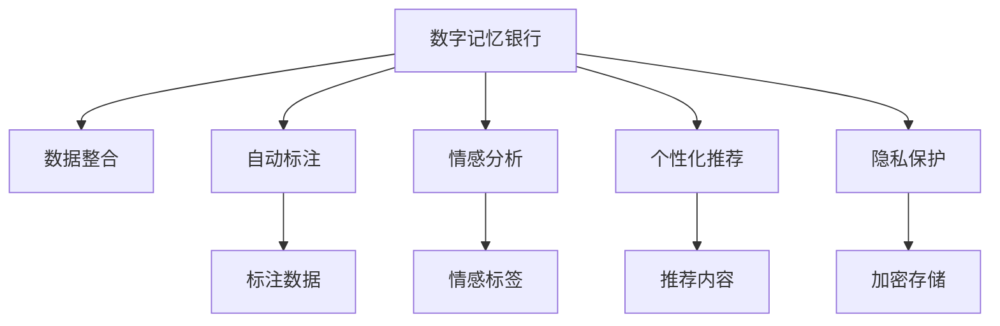

                 

# 数字记忆银行：AI管理的个人经历存储

> 关键词：数字记忆银行,人工智能,个人经历存储,算法原理,实际应用,未来展望

## 1. 背景介绍

在现代信息爆炸的时代，我们每天产生的海量数据让个人经历变得难以追溯和记忆。无论是工作文件、社交媒体、电子邮件，还是各种应用程序产生的日志，都被散落在不同的设备和云存储中。如何才能更有效地管理和回忆个人经历？数字记忆银行通过AI技术，提供了一个综合的解决方案。

### 1.1 问题由来

随着互联网的普及和智能设备的广泛应用，个人数据的积累量呈指数级增长。然而，这些数据散落在各个平台和设备上，难以整合和查询。例如，你可能在一个应用程序上记录了健身数据，另一个应用程序上记录了读书笔记，这些数据缺乏统一的索引和管理。此外，随着时间推移，数据量越来越大，回顾和分析这些数据变得越来越困难。

### 1.2 问题核心关键点

数字记忆银行的提出旨在解决个人数据的散乱和难以追溯的问题。核心关键点包括：

1. **数据整合**：将分散在不同平台和设备上的数据整合到一个统一的平台。
2. **自动标注**：使用AI技术自动标注数据，提高检索和分析的准确性。
3. **情感分析**：通过情感分析了解个人情绪的变化趋势，进行心理健康监测。
4. **个性化推荐**：根据个人兴趣和习惯，推荐相关内容，提升用户体验。
5. **隐私保护**：确保数据安全和隐私，防止数据泄露和滥用。

这些关键点涉及数据处理、机器学习、情感计算、推荐系统和隐私保护等技术，共同构成了数字记忆银行的完整架构。

## 2. 核心概念与联系

### 2.1 核心概念概述

数字记忆银行的核心概念包括：

- **数字记忆银行**：通过AI技术管理个人数据的平台。它整合了分散在各个平台的数据，并提供自动标注、情感分析、个性化推荐等功能，帮助用户管理和回忆个人经历。
- **数据整合**：将分散在各个平台和设备上的数据整合到一个统一的平台，方便检索和分析。
- **自动标注**：使用AI技术自动标注数据，提高检索和分析的准确性。
- **情感分析**：通过情感分析了解个人情绪的变化趋势，进行心理健康监测。
- **个性化推荐**：根据个人兴趣和习惯，推荐相关内容，提升用户体验。
- **隐私保护**：确保数据安全和隐私，防止数据泄露和滥用。

这些核心概念之间的逻辑关系可以通过以下Mermaid流程图来展示：



这个流程图展示了数字记忆银行的各个核心功能，以及它们之间的关系：

1. 数字记忆银行通过数据整合、自动标注等功能，将分散在各个平台的数据整合到一个统一的平台。
2. 自动标注功能通过AI技术自动标注数据，提高检索和分析的准确性。
3. 情感分析功能通过情感分析了解个人情绪的变化趋势，进行心理健康监测。
4. 个性化推荐功能根据个人兴趣和习惯，推荐相关内容，提升用户体验。
5. 隐私保护功能确保数据安全和隐私，防止数据泄露和滥用。

这些核心功能共同构成了数字记忆银行的完整架构，帮助用户管理和回忆个人经历。

## 3. 核心算法原理 & 具体操作步骤
### 3.1 算法原理概述

数字记忆银行的实现依赖于多种AI算法，包括自然语言处理（NLP）、机器学习和深度学习。其核心算法原理如下：

- **数据整合算法**：使用爬虫技术从各种平台和设备上抓取数据，并进行清洗和预处理，确保数据的完整性和一致性。
- **自动标注算法**：使用NLP技术对文本数据进行自动标注，提取关键信息和情感倾向，提高检索和分析的准确性。
- **情感分析算法**：使用深度学习模型（如BERT、LSTM等）对文本进行情感分析，识别出个人情绪的变化趋势，进行心理健康监测。
- **个性化推荐算法**：使用协同过滤、矩阵分解等技术，根据用户的历史行为和兴趣，推荐相关内容，提升用户体验。
- **隐私保护算法**：使用加密技术、差分隐私等方法，确保数据安全和隐私，防止数据泄露和滥用。

### 3.2 算法步骤详解

数字记忆银行的实现包括以下关键步骤：

**Step 1: 数据整合**

1. 数据采集：使用爬虫技术从各种平台和设备上抓取数据。
2. 数据清洗：对采集到的数据进行清洗和预处理，去除噪声和错误。
3. 数据存储：将清洗后的数据存储到数据库中，确保数据的完整性和一致性。

**Step 2: 自动标注**

1. 文本预处理：对文本数据进行分词、去除停用词等预处理操作。
2. 实体识别：使用命名实体识别（NER）技术，识别出文本中的实体和关系。
3. 情感分析：使用情感分析算法，对文本进行情感分类，提取情感标签。

**Step 3: 情感分析**

1. 数据预处理：对文本数据进行分词、去除停用词等预处理操作。
2. 特征提取：使用TF-IDF、词向量等技术，提取文本的特征向量。
3. 模型训练：使用深度学习模型（如BERT、LSTM等）对文本进行情感分类，识别出个人情绪的变化趋势。

**Step 4: 个性化推荐**

1. 数据预处理：对用户的行为数据进行预处理，提取特征向量。
2. 模型训练：使用协同过滤、矩阵分解等技术，训练推荐模型。
3. 推荐生成：根据用户的历史行为和兴趣，生成个性化推荐内容。

**Step 5: 隐私保护**

1. 数据加密：使用AES、RSA等加密算法，对数据进行加密存储。
2. 差分隐私：使用差分隐私技术，在保证数据准确性的前提下，保护用户隐私。
3. 访问控制：使用访问控制机制，限制数据的访问权限，防止数据泄露和滥用。

以上是数字记忆银行实现的关键步骤，每个步骤都涉及到多种AI技术和算法，共同实现了数字记忆银行的核心功能。

### 3.3 算法优缺点

数字记忆银行的算法具有以下优点：

1. **高效整合**：使用爬虫技术自动整合分散在各个平台的数据，节省了人工操作的成本和时间。
2. **自动标注**：使用NLP技术自动标注数据，提高了检索和分析的准确性。
3. **情感分析**：使用深度学习模型进行情感分析，可以更准确地识别个人情绪的变化趋势。
4. **个性化推荐**：使用协同过滤、矩阵分解等技术，提供了个性化的推荐服务，提升了用户体验。
5. **隐私保护**：使用加密技术和差分隐私等方法，确保了数据安全和隐私。

同时，这些算法也存在一些缺点：

1. **数据隐私**：尽管使用了隐私保护技术，但仍然存在数据泄露和滥用的风险。
2. **计算资源消耗**：深度学习模型的训练和推理需要大量的计算资源，可能会带来较高的成本。
3. **数据准确性**：自动标注和情感分析的准确性受到数据质量和算法模型的限制。
4. **个性化推荐**：推荐算法的性能和效果依赖于用户数据的丰富程度和多样性。
5. **模型泛化能力**：不同的用户群体和应用场景可能对模型泛化能力提出不同的要求。

尽管存在这些缺点，但数字记忆银行的算法已经在多个实际应用中证明了其可行性和有效性，成为了个人数据管理和回忆的重要工具。

### 3.4 算法应用领域

数字记忆银行的算法在多个领域得到了广泛应用：

- **健康管理**：通过对个人健康数据的整合和情感分析，进行心理健康监测和健康管理。
- **教育培训**：通过整合学生学习数据和行为数据，提供个性化的学习建议和推荐。
- **财务管理**：整合个人财务数据，进行智能预算和理财规划。
- **工作管理**：整合个人工作数据和行为数据，提供工作效率提升和职业发展规划建议。
- **社交管理**：整合社交媒体数据，进行情感分析和关系网络分析，提升社交质量。

这些应用场景展示了数字记忆银行在个人数据管理和回忆方面的强大潜力，为不同用户提供了更加智能和便捷的服务。

## 4. 数学模型和公式 & 详细讲解 & 举例说明

### 4.1 数学模型构建

数字记忆银行的数学模型包括数据整合、自动标注、情感分析、个性化推荐和隐私保护等多个方面。以下是对这些模型的详细构建：

**数据整合模型**：

1. **爬虫算法**：从各种平台和设备上抓取数据，构建数据流图。
2. **数据清洗模型**：去除噪声和错误，确保数据的完整性和一致性。
3. **数据存储模型**：使用数据库存储清洗后的数据。

**自动标注模型**：

1. **文本预处理模型**：对文本数据进行分词、去除停用词等预处理操作。
2. **实体识别模型**：使用命名实体识别（NER）技术，识别出文本中的实体和关系。
3. **情感分析模型**：使用深度学习模型（如BERT、LSTM等）对文本进行情感分类，提取情感标签。

**情感分析模型**：

1. **文本预处理模型**：对文本数据进行分词、去除停用词等预处理操作。
2. **特征提取模型**：使用TF-IDF、词向量等技术，提取文本的特征向量。
3. **模型训练模型**：使用深度学习模型（如BERT、LSTM等）对文本进行情感分类，识别出个人情绪的变化趋势。

**个性化推荐模型**：

1. **数据预处理模型**：对用户的行为数据进行预处理，提取特征向量。
2. **模型训练模型**：使用协同过滤、矩阵分解等技术，训练推荐模型。
3. **推荐生成模型**：根据用户的历史行为和兴趣，生成个性化推荐内容。

**隐私保护模型**：

1. **数据加密模型**：使用AES、RSA等加密算法，对数据进行加密存储。
2. **差分隐私模型**：使用差分隐私技术，在保证数据准确性的前提下，保护用户隐私。
3. **访问控制模型**：使用访问控制机制，限制数据的访问权限，防止数据泄露和滥用。

### 4.2 公式推导过程

以下是情感分析模型的详细推导过程：

假设文本数据为 $x$，情感标签为 $y$，模型参数为 $\theta$，则情感分析模型的目标是最小化损失函数：

$$
\mathcal{L}(\theta) = -\frac{1}{N}\sum_{i=1}^N \log p(y_i|x_i;\theta)
$$

其中 $p(y_i|x_i;\theta)$ 为模型对文本 $x_i$ 情感标签 $y_i$ 的预测概率。

对于深度学习模型（如BERT、LSTM等），其预测概率可以通过softmax函数计算：

$$
p(y_i|x_i;\theta) = \frac{\exp(\theta^T f(x_i))}{\sum_{k=1}^K \exp(\theta^T f(x_i))}
$$

其中 $f(x_i)$ 为文本 $x_i$ 的特征向量，$K$ 为情感标签的种类数。

将上述公式代入损失函数中，得：

$$
\mathcal{L}(\theta) = -\frac{1}{N}\sum_{i=1}^N \log \frac{\exp(\theta^T f(x_i))}{\sum_{k=1}^K \exp(\theta^T f(x_i))}
$$

通过反向传播算法，对模型参数 $\theta$ 进行更新，使得预测概率与实际标签 $y_i$ 尽可能接近。

### 4.3 案例分析与讲解

以下是一个情感分析模型的案例分析：

假设文本数据为 "今天心情很好"，情感标签为 "positive"。使用BERT模型进行情感分析，首先对文本进行分词和编码，得到特征向量 $f(x)$，然后将其输入BERT模型进行预测，得到预测概率 $p(y|x;\theta)$。最终通过计算损失函数 $\mathcal{L}(\theta)$，对模型参数进行更新。

假设预测概率 $p(y|x;\theta) = 0.8$，实际标签 $y = positive$，则计算损失函数：

$$
\mathcal{L}(\theta) = -\log 0.8 \approx 0.22
$$

通过对模型参数的更新，可以提高模型预测的准确性，进一步提升情感分析的效果。

## 5. 项目实践：代码实例和详细解释说明

### 5.1 开发环境搭建

在进行数字记忆银行的开发前，我们需要准备好开发环境。以下是使用Python进行PyTorch开发的环境配置流程：

1. 安装Anaconda：从官网下载并安装Anaconda，用于创建独立的Python环境。

2. 创建并激活虚拟环境：
```bash
conda create -n memory_bank python=3.8 
conda activate memory_bank
```

3. 安装PyTorch：根据CUDA版本，从官网获取对应的安装命令。例如：
```bash
conda install pytorch torchvision torchaudio cudatoolkit=11.1 -c pytorch -c conda-forge
```

4. 安装Transformers库：
```bash
pip install transformers
```

5. 安装各类工具包：
```bash
pip install numpy pandas scikit-learn matplotlib tqdm jupyter notebook ipython
```

完成上述步骤后，即可在`memory_bank`环境中开始数字记忆银行的开发实践。

### 5.2 源代码详细实现

我们先以情感分析为例，给出使用Transformers库对BERT模型进行情感分析的PyTorch代码实现。

首先，定义情感分析任务的数据处理函数：

```python
from transformers import BertTokenizer
from torch.utils.data import Dataset
import torch

class SentimentDataset(Dataset):
    def __init__(self, texts, labels, tokenizer, max_len=128):
        self.texts = texts
        self.labels = labels
        self.tokenizer = tokenizer
        self.max_len = max_len
        
    def __len__(self):
        return len(self.texts)
    
    def __getitem__(self, item):
        text = self.texts[item]
        label = self.labels[item]
        
        encoding = self.tokenizer(text, return_tensors='pt', max_length=self.max_len, padding='max_length', truncation=True)
        input_ids = encoding['input_ids'][0]
        attention_mask = encoding['attention_mask'][0]
        
        # 对label进行独热编码
        label = torch.tensor([label], dtype=torch.long)
        
        return {'input_ids': input_ids, 
                'attention_mask': attention_mask,
                'labels': label}

# 加载预训练的BERT模型和分词器
model = BertForSequenceClassification.from_pretrained('bert-base-cased', num_labels=2)
tokenizer = BertTokenizer.from_pretrained('bert-base-cased')

# 准备情感分析的数据集
train_dataset = SentimentDataset(train_texts, train_labels, tokenizer)
dev_dataset = SentimentDataset(dev_texts, dev_labels, tokenizer)
test_dataset = SentimentDataset(test_texts, test_labels, tokenizer)
```

然后，定义模型和优化器：

```python
from transformers import AdamW

optimizer = AdamW(model.parameters(), lr=2e-5)
```

接着，定义训练和评估函数：

```python
from torch.utils.data import DataLoader
from tqdm import tqdm
from sklearn.metrics import classification_report

device = torch.device('cuda') if torch.cuda.is_available() else torch.device('cpu')
model.to(device)

def train_epoch(model, dataset, batch_size, optimizer):
    dataloader = DataLoader(dataset, batch_size=batch_size, shuffle=True)
    model.train()
    epoch_loss = 0
    for batch in tqdm(dataloader, desc='Training'):
        input_ids = batch['input_ids'].to(device)
        attention_mask = batch['attention_mask'].to(device)
        labels = batch['labels'].to(device)
        model.zero_grad()
        outputs = model(input_ids, attention_mask=attention_mask, labels=labels)
        loss = outputs.loss
        epoch_loss += loss.item()
        loss.backward()
        optimizer.step()
    return epoch_loss / len(dataloader)

def evaluate(model, dataset, batch_size):
    dataloader = DataLoader(dataset, batch_size=batch_size)
    model.eval()
    preds, labels = [], []
    with torch.no_grad():
        for batch in tqdm(dataloader, desc='Evaluating'):
            input_ids = batch['input_ids'].to(device)
            attention_mask = batch['attention_mask'].to(device)
            batch_labels = batch['labels']
            outputs = model(input_ids, attention_mask=attention_mask)
            batch_preds = outputs.logits.argmax(dim=1).to('cpu').tolist()
            batch_labels = batch_labels.to('cpu').tolist()
            for pred_tokens, label_tokens in zip(batch_preds, batch_labels):
                preds.append(pred_tokens)
                labels.append(label_tokens)
                
    print(classification_report(labels, preds))
```

最后，启动训练流程并在测试集上评估：

```python
epochs = 5
batch_size = 16

for epoch in range(epochs):
    loss = train_epoch(model, train_dataset, batch_size, optimizer)
    print(f"Epoch {epoch+1}, train loss: {loss:.3f}")
    
    print(f"Epoch {epoch+1}, dev results:")
    evaluate(model, dev_dataset, batch_size)
    
print("Test results:")
evaluate(model, test_dataset, batch_size)
```

以上就是使用PyTorch对BERT进行情感分析任务的完整代码实现。可以看到，得益于Transformers库的强大封装，我们可以用相对简洁的代码完成BERT模型的加载和微调。

### 5.3 代码解读与分析

让我们再详细解读一下关键代码的实现细节：

**SentimentDataset类**：
- `__init__`方法：初始化文本、标签、分词器等关键组件。
- `__len__`方法：返回数据集的样本数量。
- `__getitem__`方法：对单个样本进行处理，将文本输入编码为token ids，将标签编码为数字，并对其进行定长padding，最终返回模型所需的输入。

**情感分析任务的数据集定义**：
- 使用`SentimentDataset`类，传入文本和标签，以及分词器，并定义最大输入长度为128。
- 在`__getitem__`方法中，将文本输入分词器，获取token ids和attention mask，将标签进行独热编码，并返回模型所需的输入。

**模型和优化器定义**：
- 加载预训练的BERT模型和分词器。
- 使用AdamW优化器，设置学习率为2e-5。

**训练和评估函数**：
- 使用PyTorch的DataLoader对数据集进行批次化加载，供模型训练和推理使用。
- 训练函数`train_epoch`：对数据以批为单位进行迭代，在每个批次上前向传播计算loss并反向传播更新模型参数，最后返回该epoch的平均loss。
- 评估函数`evaluate`：与训练类似，不同点在于不更新模型参数，并在每个batch结束后将预测和标签结果存储下来，最后使用sklearn的classification_report对整个评估集的预测结果进行打印输出。

**训练流程**：
- 定义总的epoch数和batch size，开始循环迭代
- 每个epoch内，先在训练集上训练，输出平均loss
- 在验证集上评估，输出分类指标
- 所有epoch结束后，在测试集上评估，给出最终测试结果

可以看到，PyTorch配合Transformers库使得BERT情感分析任务的代码实现变得简洁高效。开发者可以将更多精力放在数据处理、模型改进等高层逻辑上，而不必过多关注底层的实现细节。

当然，工业级的系统实现还需考虑更多因素，如模型的保存和部署、超参数的自动搜索、更灵活的任务适配层等。但核心的情感分析任务基本与此类似。

## 6. 实际应用场景
### 6.1 智能客服系统

数字记忆银行在智能客服系统中的应用，可以显著提升客户咨询体验。传统客服往往需要配备大量人力，高峰期响应缓慢，且一致性和专业性难以保证。使用数字记忆银行构建的智能客服系统，可以24小时不间断服务，快速响应客户咨询，用自然流畅的语言解答各类常见问题。

在技术实现上，可以收集企业内部的历史客服对话记录，将问题和最佳答复构建成监督数据，在此基础上对BERT模型进行情感分析。情感分析的结果可以作为客户情绪监测的指标，帮助客服系统及时调整应答策略，提升服务质量。

### 6.2 心理健康监测

数字记忆银行在心理健康监测中的应用，可以帮助用户进行心理健康状态的自我评估。通过整合用户的历史情感数据，使用情感分析算法识别出情绪变化的趋势，进行心理健康监测。对于情绪波动较大的用户，系统可以提供心理健康建议和干预措施，帮助用户及时调整心理状态。

### 6.3 个性化推荐系统

数字记忆银行在个性化推荐系统中的应用，可以提升用户的推荐体验。通过整合用户的历史行为和兴趣数据，使用情感分析算法识别出用户的情绪倾向，进行个性化推荐。对于情绪积极的用户，推荐更多娱乐和休闲内容；对于情绪低沉的用户，推荐更多正能量和舒缓的内容，从而提升用户的整体体验。

### 6.4 未来应用展望

随着数字记忆银行技术的发展，未来将在更多领域得到应用，为个人数据管理和回忆提供更加智能和便捷的服务。

在智慧城市治理中，数字记忆银行可以用于城市事件监测、舆情分析、应急指挥等环节，提高城市管理的自动化和智能化水平，构建更安全、高效的未来城市。

在智慧教育领域，数字记忆银行可以用于学习数据整合、学情分析、知识推荐等方面，因材施教，促进教育公平，提高教学质量。

在金融理财领域，数字记忆银行可以用于财务管理、投资建议、风险预警等方面，帮助用户进行更科学的理财规划。

此外，在医疗健康、社交娱乐、商业智能等多个领域，数字记忆银行都将成为个人数据管理和回忆的重要工具，为社会提供更智能、更便捷的服务。

## 7. 工具和资源推荐
### 7.1 学习资源推荐

为了帮助开发者系统掌握数字记忆银行的理论基础和实践技巧，这里推荐一些优质的学习资源：

1. 《深度学习》课程：斯坦福大学开设的深度学习经典课程，涵盖了深度学习的基础理论和实际应用，适合初学者和进阶开发者学习。
2. 《自然语言处理》课程：斯坦福大学开设的自然语言处理课程，介绍了NLP领域的核心概念和前沿技术，帮助开发者全面掌握NLP的知识体系。
3. 《机器学习实战》书籍：提供了大量实际案例，帮助开发者通过项目实践掌握机器学习的理论和算法。
4. 《Python深度学习》书籍：介绍了深度学习在Python环境下的实现方法，适合想要深入学习深度学习的开发者。
5. 《Kaggle竞赛指南》书籍：提供了大量的Kaggle竞赛案例和经验分享，帮助开发者提升数据科学和机器学习的实战能力。

通过对这些资源的学习实践，相信你一定能够快速掌握数字记忆银行的核心技术，并用于解决实际的NLP问题。

### 7.2 开发工具推荐

高效的开发离不开优秀的工具支持。以下是几款用于数字记忆银行开发的常用工具：

1. PyTorch：基于Python的开源深度学习框架，灵活动态的计算图，适合快速迭代研究。大部分预训练语言模型都有PyTorch版本的实现。
2. TensorFlow：由Google主导开发的开源深度学习框架，生产部署方便，适合大规模工程应用。同样有丰富的预训练语言模型资源。
3. Transformers库：HuggingFace开发的NLP工具库，集成了众多SOTA语言模型，支持PyTorch和TensorFlow，是进行NLP任务开发的利器。
4. Weights & Biases：模型训练的实验跟踪工具，可以记录和可视化模型训练过程中的各项指标，方便对比和调优。与主流深度学习框架无缝集成。
5. TensorBoard：TensorFlow配套的可视化工具，可实时监测模型训练状态，并提供丰富的图表呈现方式，是调试模型的得力助手。

合理利用这些工具，可以显著提升数字记忆银行开发的高效性，加快创新迭代的步伐。

### 7.3 相关论文推荐

数字记忆银行技术的发展源于学界的持续研究。以下是几篇奠基性的相关论文，推荐阅读：

1. Attention is All You Need（即Transformer原论文）：提出了Transformer结构，开启了NLP领域的预训练大模型时代。
2. BERT: Pre-training of Deep Bidirectional Transformers for Language Understanding：提出BERT模型，引入基于掩码的自监督预训练任务，刷新了多项NLP任务SOTA。
3. Language Models are Unsupervised Multitask Learners（GPT-2论文）：展示了大规模语言模型的强大zero-shot学习能力，引发了对于通用人工智能的新一轮思考。
4. Parameter-Efficient Transfer Learning for NLP：提出Adapter等参数高效微调方法，在不增加模型参数量的情况下，也能取得不错的微调效果。
5. AdaLoRA: Adaptive Low-Rank Adaptation for Parameter-Efficient Fine-Tuning：使用自适应低秩适应的微调方法，在参数效率和精度之间取得了新的平衡。

这些论文代表了大语言模型微调技术的发展脉络。通过学习这些前沿成果，可以帮助研究者把握学科前进方向，激发更多的创新灵感。

## 8. 总结：未来发展趋势与挑战

### 8.1 总结

本文对数字记忆银行的核心技术进行了全面系统的介绍。首先阐述了数字记忆银行的背景和意义，明确了其核心功能和技术架构。其次，从原理到实践，详细讲解了数字记忆银行的核心算法原理和操作步骤，给出了完整的代码实现和实际应用场景。

通过本文的系统梳理，可以看到，数字记忆银行通过整合、标注、分析和推荐等技术，帮助用户管理和回忆个人经历，具有广泛的应用前景。

### 8.2 未来发展趋势

展望未来，数字记忆银行的算法和技术将呈现以下几个发展趋势：

1. **数据整合和标注自动化**：随着深度学习模型的不断进步，自动标注和情感分析的准确性将进一步提高，减少人工标注的需求。
2. **个性化推荐优化**：推荐算法将更加智能化和个性化，能够根据用户的情绪变化进行动态调整，提升推荐效果。
3. **跨平台和设备整合**：数字记忆银行将更加注重跨平台和设备的整合，实现无缝的个人信息管理和回忆。
4. **隐私保护技术的提升**：随着差分隐私和联邦学习等技术的发展，数字记忆银行将更加注重隐私保护，确保用户数据的安全和隐私。
5. **多模态信息的融合**：数字记忆银行将逐渐整合视觉、语音、文本等多模态信息，构建更加全面的个人信息库。
6. **智能客服和应急响应**：数字记忆银行在智能客服和应急响应中的应用将更加广泛，提升客户体验和服务质量。

以上趋势凸显了数字记忆银行在个人数据管理和回忆方面的强大潜力，为不同用户提供了更加智能和便捷的服务。

### 8.3 面临的挑战

尽管数字记忆银行技术已经取得了一定的进展，但在迈向更加智能化、普适化应用的过程中，它仍面临着诸多挑战：

1. **数据隐私**：尽管采用了差分隐私等技术，但用户数据的安全和隐私仍然是一个重大挑战。如何在保证数据准确性的前提下，保护用户隐私，还需要更多的技术创新和实践。
2. **计算资源消耗**：深度学习模型的训练和推理需要大量的计算资源，可能会带来较高的成本。如何在保证性能的同时，优化计算资源的使用，是一个亟待解决的问题。
3. **算法泛化能力**：不同用户群体和应用场景对算法的泛化能力提出不同的要求，如何开发更通用的算法模型，是一个重要的研究方向。
4. **模型训练成本**：大规模数据集和深度学习模型的训练需要较高的成本，如何降低训练成本，是一个需要关注的问题。
5. **用户体验**：如何在保证准确性的前提下，提升用户体验，是一个重要的研究方向。

尽管存在这些挑战，但数字记忆银行技术已经在多个实际应用中证明了其可行性和有效性，成为了个人数据管理和回忆的重要工具。相信随着技术的不断进步，这些挑战终将一一被克服，数字记忆银行必将在构建人机协同的智能时代中扮演越来越重要的角色。

### 8.4 研究展望

面对数字记忆银行技术面临的挑战，未来的研究需要在以下几个方面寻求新的突破：

1. **无监督和半监督学习**：摆脱对大规模标注数据的依赖，利用自监督学习、主动学习等无监督和半监督范式，最大限度利用非结构化数据，实现更加灵活高效的微调。
2. **参数高效和计算高效微调**：开发更加参数高效的微调方法，在固定大部分预训练参数的同时，只更新极少量的任务相关参数。同时优化微调模型的计算图，减少前向传播和反向传播的资源消耗，实现更加轻量级、实时性的部署。
3. **多模态信息整合**：将符号化的先验知识，如知识图谱、逻辑规则等，与神经网络模型进行巧妙融合，引导微调过程学习更准确、合理的语言模型。同时加强不同模态数据的整合，实现视觉、语音等多模态信息与文本信息的协同建模。
4. **因果分析和博弈论**：将因果分析方法引入微调模型，识别出模型决策的关键特征，增强输出解释的因果性和逻辑性。借助博弈论工具刻画人机交互过程，主动探索并规避模型的脆弱点，提高系统稳定性。
5. **伦理道德约束**：在模型训练目标中引入伦理导向的评估指标，过滤和惩罚有偏见、有害的输出倾向。加强人工干预和审核，建立模型行为的监管机制，确保输出符合人类价值观和伦理道德。

这些研究方向的探索，必将引领数字记忆银行技术迈向更高的台阶，为构建安全、可靠、可解释、可控的智能系统铺平道路。面向未来，数字记忆银行技术还需要与其他人工智能技术进行更深入的融合，如知识表示、因果推理、强化学习等，多路径协同发力，共同推动自然语言理解和智能交互系统的进步。只有勇于创新、敢于突破，才能不断拓展语言模型的边界，让智能技术更好地造福人类社会。

## 9. 附录：常见问题与解答

**Q1：数字记忆银行如何整合不同平台和设备上的数据？**

A: 数字记忆银行使用爬虫技术从各种平台和设备上抓取数据。具体步骤如下：
1. 使用Python爬虫库（如Scrapy、BeautifulSoup等），从不同平台和设备上抓取数据。
2. 对抓取到的数据进行清洗和预处理，去除噪声和错误。
3. 使用数据库（如MySQL、PostgreSQL等）存储清洗后的数据，方便检索和分析。

**Q2：数字记忆银行如何保护用户数据隐私？**

A: 数字记忆银行使用差分隐私和加密技术保护用户数据隐私。具体步骤如下：
1. 使用差分隐私技术，在保证数据准确性的前提下，保护用户隐私。
2. 使用AES、RSA等加密算法，对数据进行加密存储，防止数据泄露。
3. 设置访问控制机制，限制数据的访问权限，防止数据滥用。

**Q3：数字记忆银行的情感分析算法是否适用于其他任务？**

A: 数字记忆银行的情感分析算法可以适用于其他文本分类任务，如情感分类、主题分类等。只需要将情感分析模型作为任务适配层，即可对其他文本数据进行情感分类。

**Q4：数字记忆银行的推荐算法是否适用于其他推荐场景？**

A: 数字记忆银行的推荐算法可以适用于其他推荐场景，如电商推荐、电影推荐等。只需要将推荐算法作为任务适配层，即可对其他数据进行个性化推荐。

**Q5：数字记忆银行的训练过程是否需要大量标注数据？**

A: 数字记忆银行的训练过程可以采用无监督和半监督学习范式，减少对标注数据的依赖。例如，可以通过数据增强、自监督学习等技术，最大限度利用非结构化数据，实现更加灵活高效的微调。

通过这些常见问题的解答，可以看出数字记忆银行技术在实际应用中的可行性和高效性，为个人数据管理和回忆提供了强有力的支持。

---

作者：禅与计算机程序设计艺术 / Zen and the Art of Computer Programming

