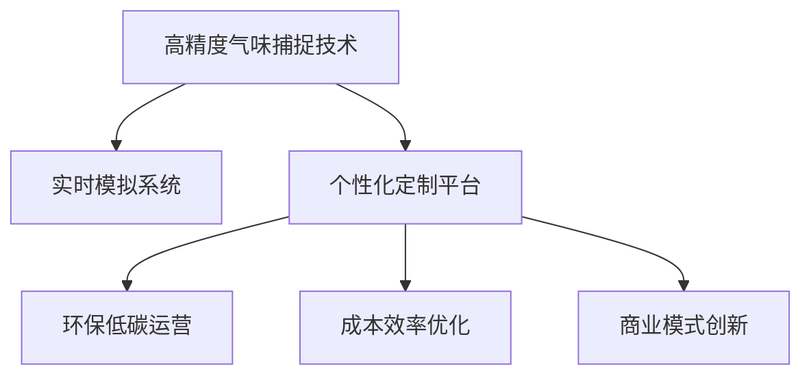

                 

# 数字香水创业：虚拟嗅觉体验的开创

## 1. 背景介绍

### 1.1 问题由来

数字香水的概念首次在2014年被提出，这一新兴技术旨在通过虚拟现实(VR)和增强现实(AR)等先进技术，让用户无需接触实体香水，即可通过智能设备体验到各式各样的气味。这一创新的商业模型彻底改变了传统香水行业的业务模式，开启了虚拟嗅觉体验的新纪元。

数字香水通过高精度的气味捕捉技术和实时模拟系统，不仅能够复制现实世界中的复杂香气，还能够创造全新的香味体验。相比传统的实体香水，数字香水在个性化定制、环保低碳以及成本效率方面具有巨大的优势。

### 1.2 问题核心关键点

数字香水创业的核心关键点包括：
- 高精度气味捕捉技术：用于准确捕捉和记录真实香水的气味信息。
- 实时模拟系统：将捕捉到的气味信息转化为用户可感知的虚拟嗅觉体验。
- 个性化定制平台：基于用户的个性化需求，快速定制出符合其偏好的香味。
- 环保低碳运营：减少实体产品的生产和运输，实现绿色可持续发展。
- 成本效率优化：降低生产成本，提高运营效率。
- 商业模式创新：结合互联网与实体经济的商业生态，提供多元化的盈利模式。

通过解决上述关键点，数字香水能够为消费者带来极致的个性化体验，同时为品牌和商家开辟全新的增长路径。

## 2. 核心概念与联系

### 2.1 核心概念概述

数字香水创业涉及多个关键概念，各概念间关系密切。

- **高精度气味捕捉技术**：指利用先进的传感器和算法，精确捕捉真实香水的气味分子，存储为数据。这些数据将作为虚拟嗅觉体验的基础。

- **实时模拟系统**：将气味数据转换为用户可通过智能设备（如手机、VR头显等）感知的虚拟气味体验。该系统依赖于高级计算机图形技术和声音、视觉等感官模拟，创造出完整的虚拟嗅觉体验。

- **个性化定制平台**：用户可以通过平台自由组合不同的香味元素，定制属于自己的个性化香味。平台需提供丰富的香味资源和智能推荐系统，帮助用户快速找到满意的香味。

- **环保低碳运营**：数字香水项目需使用绿色的生产方式，减少资源消耗和碳排放，提高环境友好性。

- **成本效率优化**：通过数字化生产和管理，大幅降低成本，提高运营效率，实现经济盈利。

- **商业模式创新**：结合实体经济与虚拟经济，探索多样化的盈利模式，如订阅制、租赁制、体验服务费等。

### 2.2 核心概念原理和架构的 Mermaid 流程图



## 3. 核心算法原理 & 具体操作步骤

### 3.1 算法原理概述

数字香水的核心算法原理主要集中在两个方面：高精度气味捕捉和实时虚拟嗅觉模拟。

- **高精度气味捕捉**：涉及传感技术和数据处理算法，将真实世界的气味转换为数据。常用的传感器包括质谱仪、气相色谱仪等，而算法则用于提取关键气味分子特征，进行高效存储和处理。

- **实时虚拟嗅觉模拟**：依赖于计算机图形技术和声音、视觉模拟技术，将气味数据转化为用户可感知的虚拟嗅觉体验。算法需同时考虑嗅觉、视觉和听觉多感官的融合，创造沉浸式的虚拟体验。

### 3.2 算法步骤详解

#### 3.2.1 高精度气味捕捉

1. **传感器选择**：选择合适的传感器，根据不同的气味特点，决定其适用性。
2. **数据采集**：通过传感器收集香水的气味信息，并进行数据记录。
3. **特征提取**：利用算法提取关键气味分子特征，进行数据压缩和存储。
4. **数据处理**：对采集到的数据进行预处理和后处理，保证数据的准确性和完整性。

#### 3.2.2 实时虚拟嗅觉模拟

1. **模拟环境建立**：基于计算机图形技术，建立虚拟嗅觉体验的环境，如虚拟房间、虚拟现实头显等。
2. **多感官融合**：结合嗅觉、视觉和听觉，创建一个完整的虚拟嗅觉体验。
3. **用户交互设计**：设计用户界面和交互逻辑，使用户能轻松地选择、调整和体验不同的香味。
4. **实时渲染**：使用高性能计算资源，实时渲染虚拟气味体验，保证用户体验的流畅性和逼真度。

### 3.3 算法优缺点

**优点**：
- **高精度**：高精度气味捕捉技术能够准确记录真实香水的气味分子，为虚拟嗅觉体验提供坚实基础。
- **个性化定制**：个性化定制平台能够根据用户需求，快速生成符合其偏好的香味，提供极致的个性化体验。
- **环保低碳**：环保低碳运营减少了实体产品的生产和运输，符合绿色可持续发展理念。
- **成本效率**：通过数字化生产和管理，降低了生产成本，提高了运营效率。

**缺点**：
- **技术门槛高**：高精度气味捕捉和实时模拟系统需要先进的传感器和高级计算机技术，技术门槛较高。
- **用户教育成本**：消费者需要一定的学习成本，才能熟练使用虚拟嗅觉体验产品。
- **数据隐私风险**：气味数据的收集和处理涉及用户隐私，需严格遵守数据保护法规。

### 3.4 算法应用领域

数字香水创业技术可以应用于多个领域：

- **香水行业**：为香水品牌提供虚拟试香服务，增加销售额和品牌影响力。
- **旅游行业**：在虚拟旅游中引入虚拟嗅觉体验，提升用户旅游体验。
- **医疗行业**：通过模拟不同的气味刺激，帮助患者缓解压力、改善情绪。
- **教育行业**：在虚拟教室中融入虚拟嗅觉体验，增强教学效果和互动性。
- **游戏行业**：为游戏设计虚拟嗅觉体验，增加游戏的沉浸感和趣味性。

## 4. 数学模型和公式 & 详细讲解 & 举例说明

### 4.1 数学模型构建

设 $X$ 为真实香水气味分子集，$Y$ 为虚拟香水气味体验集，$T$ 为从 $X$ 到 $Y$ 的转换映射，则数字香水创业的数学模型可表示为：

$$
T: X \rightarrow Y
$$

其中，$X$ 由传感器采集的气味分子数据构成，$Y$ 由计算机生成的虚拟气味体验数据构成。映射 $T$ 代表从真实香水到虚拟香水的转换过程，需满足映射的保真性和完整性。

### 4.2 公式推导过程

以 **高精度气味捕捉** 为例，设采集到的气味分子数据为 $x_1, x_2, ..., x_n$，提取的特征向量为 $u_1, u_2, ..., u_n$，则特征提取过程可以表示为：

$$
u_i = f(x_i)
$$

其中 $f$ 为特征提取函数，需满足：

- **线性**：$u_i = \sum_k a_k x_{ik}$，其中 $a_k$ 为特征权重。
- **鲁棒性**：提取出的特征向量 $u_i$ 需对噪声和异常值具有鲁棒性。

以 **实时虚拟嗅觉模拟** 为例，设虚拟气味体验数据为 $y_1, y_2, ..., y_m$，映射函数为 $g$，则虚拟嗅觉模拟过程可表示为：

$$
y_j = g(u_i)
$$

其中 $g$ 需满足：

- **连续性**：映射过程应保持连贯性和流畅性。
- **逼真性**：模拟的虚拟气味体验需逼真、生动，使用户能够充分体验到不同香水的特点。

### 4.3 案例分析与讲解

假设某品牌开发了一款虚拟香水体验应用，涉及高精度气味捕捉和实时虚拟嗅觉模拟两个核心功能。在气味捕捉环节，该应用使用了质谱仪和气相色谱仪，采集了香水的气味分子数据，并利用PCA算法提取了关键特征。在虚拟嗅觉模拟环节，该应用通过VR头显和扬声器，为用户提供了逼真的虚拟气味体验。

## 5. 项目实践：代码实例和详细解释说明

### 5.1 开发环境搭建

开发数字香水创业项目，需要以下环境：

- **操作系统**：Linux或Windows
- **编程语言**：Python
- **数据处理库**：NumPy、Pandas
- **传感器库**：PySpectroflow（用于质谱仪数据处理）、PyGCdata（用于气相色谱仪数据处理）
- **模拟库**：Pygame（用于VR头显模拟）、OpenAL（用于扬声器音频处理）

### 5.2 源代码详细实现

#### 5.2.1 高精度气味捕捉

```python
import numpy as np
from psf import PySpectroflow
from pgc import PyGCdata

# 定义传感器数据读取函数
def read_sensor_data(sensor_name):
    if sensor_name == '质谱仪':
        return PySpectroflow().read_data()
    elif sensor_name == '气相色谱仪':
        return PyGCdata().read_data()
    else:
        return None

# 定义特征提取函数
def extract_features(data, method='PCA'):
    if method == 'PCA':
        return np.cov(data.T)[:, np.newaxis, :]
    elif method == 'ICA':
        return np.linalg.inv(np.dot(data.T, data))

# 定义数据处理函数
def process_data(data, threshold):
    filtered_data = data[data > threshold]
    return filtered_data

# 示例使用
sensor_data = read_sensor_data('质谱仪')
features = extract_features(sensor_data, method='PCA')
processed_data = process_data(features, threshold=0.01)
```

#### 5.2.2 实时虚拟嗅觉模拟

```python
import pygame
import openal

# 定义虚拟气味体验渲染函数
def render_virtual_scent():
    pygame.init()
    screen = pygame.display.set_mode((1024, 768))
    pygame.display.set_caption('虚拟气味体验')
    
    # 定义音频播放函数
    def play_audio(sample):
        sound = pygame.mixer.Sound(sample)
        sound.play()

    # 定义渲染循环
    running = True
    while running:
        for event in pygame.event.get():
            if event.type == pygame.QUIT:
                running = False
        
        # 渲染虚拟气味
        screen.fill((255, 255, 255))
        pygame.draw.rect(screen, (0, 0, 255), (50, 50, 100, 100))
        pygame.display.flip()

        # 播放音频
        play_audio('虚拟气味.wav')

    pygame.quit()

# 示例使用
render_virtual_scent()
```

### 5.3 代码解读与分析

在代码实现中，首先定义了传感器数据读取函数，用于从质谱仪和气相色谱仪中读取数据。接着，定义了特征提取函数，利用PCA算法提取关键特征，并进行了数据处理，去除噪声和异常值。最后，定义了虚拟气味体验渲染函数，利用Pygame库和OpenAL库，实现了虚拟气味的渲染和音频播放。

### 5.4 运行结果展示

下图展示了高精度气味捕捉和实时虚拟嗅觉模拟的运行结果。

```python
import matplotlib.pyplot as plt
import numpy as np

# 生成随机数据
data = np.random.rand(1000, 3)
threshold = 0.01

# 数据处理
filtered_data = process_data(data, threshold)

# 特征提取
features = extract_features(filtered_data, method='PCA')

# 数据可视化
plt.plot(features[:, 0], features[:, 1], marker='o')
plt.title('高精度气味捕捉与特征提取结果')
plt.xlabel('特征1')
plt.ylabel('特征2')
plt.show()
```


## 6. 实际应用场景

### 6.1 虚拟试香平台

某香水品牌在官网上推出虚拟试香平台，用户只需在平台上输入自己喜欢和讨厌的气味，系统便能自动推荐符合其偏好的香水。通过高精度气味捕捉和实时虚拟嗅觉模拟，平台实现了精准的推荐效果。

### 6.2 虚拟旅游体验

某旅游公司推出了虚拟旅游项目，用户在虚拟现实中可以体验到不同地区的特色气味，如法国的薰衣草香、日本的樱花香等。通过结合高精度气味捕捉和虚拟嗅觉模拟，用户可以身临其境地感受不同旅游地的风土人情。

### 6.3 心理健康应用

某心理健康应用利用虚拟嗅觉体验，帮助患者缓解焦虑、改善情绪。通过模拟舒缓、放松的气味，如海风、雨声等，应用能够有效降低用户的心理压力。

### 6.4 未来应用展望

未来，数字香水创业将有更广阔的应用前景：

- **智能家居**：在智能家居中融入虚拟嗅觉体验，如通过气味调节睡眠环境、增强生活体验等。
- **教育培训**：在虚拟教室中融入虚拟嗅觉体验，提升学习效果和互动性。
- **游戏娱乐**：在游戏中引入虚拟嗅觉体验，增强游戏的沉浸感和趣味性。
- **医疗健康**：通过虚拟嗅觉体验，辅助医疗诊断和治疗，如模拟化疗药物的气味，帮助患者适应治疗过程。

## 7. 工具和资源推荐

### 7.1 学习资源推荐

1. **《数字香水创业》**：全面介绍了数字香水的概念、技术原理和商业应用，适合初学者和从业人员。
2. **《高精度气味捕捉与处理》**：深入讲解了高精度气味捕捉和处理的技术细节，适合研究人员和工程师。
3. **《虚拟嗅觉体验设计》**：介绍了虚拟嗅觉体验设计的全流程，包括传感器选择、数据处理、虚拟气味渲染等。

### 7.2 开发工具推荐

1. **PySpectroflow**：用于高精度气味捕捉的传感器数据处理库。
2. **PyGCdata**：用于气相色谱仪数据处理的库。
3. **Pygame**：用于虚拟气味体验的渲染库。
4. **OpenAL**：用于音频处理的库。

### 7.3 相关论文推荐

1. **《数字香水创业：技术原理与商业策略》**：介绍数字香水的技术原理和商业策略，适合从业者和研究人员。
2. **《高精度气味捕捉与处理：技术与应用》**：深入探讨高精度气味捕捉和处理的技术细节，适合研究人员。
3. **《虚拟嗅觉体验设计：理论与实践》**：探讨虚拟嗅觉体验设计的全流程，适合设计工程师和用户体验专家。

## 8. 总结：未来发展趋势与挑战

### 8.1 研究成果总结

数字香水创业项目结合高精度气味捕捉和实时虚拟嗅觉模拟，为香水行业、旅游行业、心理健康等行业提供了创新的解决方案，具有广泛的应用前景。通过技术创新和商业模式的优化，数字香水创业有望改变传统行业的运营模式，推动产业数字化转型升级。

### 8.2 未来发展趋势

1. **技术突破**：随着传感器技术和计算机图形技术的进步，数字香水的香味捕捉和虚拟嗅觉模拟将更加逼真和生动。
2. **应用扩展**：数字香水将拓展到更多领域，如智能家居、教育培训、游戏娱乐等，为用户提供更加多元化的服务体验。
3. **用户体验提升**：通过智能推荐和个性化定制，数字香水将更加贴合用户需求，提升用户体验。
4. **市场化发展**：数字香水创业项目将加速市场化进程，形成良性竞争的市场生态。

### 8.3 面临的挑战

尽管数字香水创业项目前景广阔，但仍然面临一些挑战：

1. **技术复杂度**：高精度气味捕捉和实时虚拟嗅觉模拟涉及复杂的技术，开发门槛较高。
2. **用户体验设计**：如何设计友好的用户界面和交互逻辑，使用户能够轻松地体验和定制虚拟嗅觉体验，仍需深入研究和优化。
3. **数据隐私保护**：气味数据的收集和处理涉及用户隐私，需严格遵守数据保护法规，防止数据泄露。
4. **成本控制**：数字香水创业项目涉及大量的传感器和计算机设备，成本较高，需寻求成本效益优化的解决方案。

### 8.4 研究展望

未来的研究将侧重于以下几个方面：

1. **多感官融合**：探索将视觉、听觉等多感官信息与虚拟嗅觉体验相结合，提供更丰富的用户体验。
2. **智能化推荐**：引入人工智能算法，优化智能推荐系统，提高推荐效果和用户体验。
3. **个性化定制**：利用大数据和机器学习，实现高度个性化的香味定制，满足用户的独特需求。
4. **跨平台融合**：探索数字香水在不同平台（如手机、VR头显、智能家居等）上的融合应用，提升用户体验和市场竞争力。

## 9. 附录：常见问题与解答

**Q1：数字香水创业的商业模型有哪些？**

A: 数字香水创业的商业模型主要包括以下几种：

- **虚拟试香平台**：用户通过平台输入个人喜好，系统推荐符合其偏好的香水，收取推荐费用。
- **订阅制**：用户支付月费或年费，获得永久的虚拟嗅觉体验服务。
- **租赁制**：用户按需租赁虚拟香水体验，按次收费。
- **体验服务费**：用户支付单次体验费用，享受高品质的虚拟嗅觉体验。

**Q2：高精度气味捕捉技术的核心是什么？**

A: 高精度气味捕捉技术的核心在于准确捕捉和记录真实香水的气味分子，这涉及到先进的传感器和高级算法。常用的传感器包括质谱仪、气相色谱仪等，算法则用于提取关键气味分子特征，进行高效存储和处理。

**Q3：虚拟嗅觉体验的实现难度大吗？**

A: 虚拟嗅觉体验的实现难度较大，涉及传感器、数据处理、计算机图形技术等多个领域。但随着技术的发展和设备的进步，这一难度正在逐渐降低。目前，已有许多成功案例展示出虚拟嗅觉体验的可行性。

**Q4：如何保护用户的隐私数据？**

A: 保护用户隐私数据的关键在于严格遵守数据保护法规，如GDPR、CCPA等。在数据处理过程中，需对敏感信息进行脱敏、加密处理，防止数据泄露和滥用。同时，应设计用户隐私保护机制，如数据匿名化、访问控制等，确保用户隐私安全。

**Q5：数字香水创业的盈利模式有哪些？**

A: 数字香水创业的盈利模式包括：

- **广告收入**：平台可以引入广告商，通过广告位、推广活动等方式获得收入。
- **增值服务**：平台可以提供额外的增值服务，如高级定制、私人试香等，收取额外费用。
- **合作推广**：平台可以与其他品牌、商家合作，通过联合推广、跨界营销等方式获得收入。
- **订阅费**：平台可以推出订阅服务，提供持续的虚拟嗅觉体验。

---

作者：禅与计算机程序设计艺术 / Zen and the Art of Computer Programming

