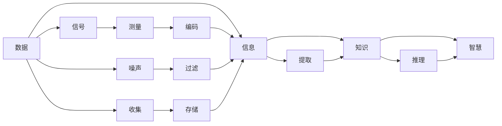

                 

## 1. 背景介绍

### 1.1 问题由来
在数据驱动的时代，信息的爆炸式增长为我们的认知带来了前所未有的挑战与机遇。数据、信息、知识、智慧，这四个概念逐渐构成了一座阶梯，带领我们不断从原始的数据出发，走向深入的认知与智慧。然而，对于许多人而言，这些概念之间常常模糊不清，缺乏系统化的理解。本文旨在通过深入浅出的分析和具体的技术实例，系统梳理数据、信息、知识、智慧的内在联系及其演化路径，帮助读者建立清晰的认知框架，并思考如何利用这些概念进行有效的决策与创新。

### 1.2 问题核心关键点
数据、信息、知识、智慧构成了认知的阶梯，每一个概念都承前启后，但并非线性递进。深入理解这些概念的联系及其在人工智能与大数据领域的应用，有助于更好地构建知识体系，提升智能系统的决策能力。

1. **数据**：原始的、未经处理的信息单元，通常以结构化和非结构化的形式存在，如文本、图像、音频等。数据是信息、知识、智慧的基石，但本身不具备任何意义。
2. **信息**：数据经过一定的处理、提取和表达后，转化为可以被人类或机器理解的形式。信息是数据向知识转化的桥梁，能够提供某种程度上的意义。
3. **知识**：信息通过学习、推理、归纳等过程，被组织和关联起来，形成结构化的、可应用的认知单元。知识具备系统性、可复用性和可操作性，是构建智能系统的核心要素。
4. **智慧**：知识在应用、融合、创新过程中，与经验、直觉、创造性思维结合，形成了能够自我进化和决策的能力。智慧是人类与机器在认知阶梯顶端相融合的结果，是人工智能的终极追求。

### 1.3 问题研究意义
理解数据、信息、知识、智慧的演化路径，有助于我们在实践中更好地应用这些概念，构建智能系统，提升决策和创新的能力。通过系统化的学习和思考，我们能够更好地洞察信息时代下认知的演变，并探索如何利用这些概念推动技术进步和社会变革。

## 2. 核心概念与联系

### 2.1 核心概念概述

数据、信息、知识、智慧是认知的四个重要阶段，它们各自具备独特的特征，但相互之间又紧密关联。以下对这四个概念进行详细阐述。

- **数据**：数据是未经处理的原始信息，具有多样性和不确定性，可以是数字、文字、图片、视频等。
- **信息**：信息是经过处理和组织的数据，具有一定的结构和意义，可以通过逻辑和规则进行理解和解释。
- **知识**：知识是将信息进行系统化、结构化的组织和应用，能够被用来解决实际问题或生成新的信息。
- **智慧**：智慧是基于知识的深度应用、创新和融合，具备预测、决策、创造的能力，是认知的最高层次。

### 2.2 核心概念原理和架构的 Mermaid 流程图



### 2.3 核心概念联系

- **数据**是基础，为**信息**的生成提供了原材料。
- **信息**是对数据的处理和抽象，帮助理解数据的含义。
- **知识**在信息的基础上，通过学习、推理、归纳等过程，形成了有组织的认知单元。
- **智慧**是基于知识的深度应用和创新，是认知的最高层次。

## 3. 核心算法原理 & 具体操作步骤

### 3.1 算法原理概述

在人工智能和数据科学领域，数据、信息、知识、智慧的转化可以通过算法和技术手段实现。以下对这一转化过程进行详细阐述。

#### 3.1.1 数据预处理

在数据驱动的智能系统中，数据预处理是首要步骤，主要包括数据清洗、特征提取和数据标准化等。这些预处理技术能够提高数据的质量和可用性，为后续的信息提取和知识学习提供坚实的基础。

#### 3.1.2 信息提取

信息提取通常涉及文本挖掘、图像识别、语音识别等技术，通过算法从原始数据中提取有意义的特征和模式。常用的算法包括NLP中的TF-IDF、NLP中的LDA、图像处理中的卷积神经网络（CNN）等。

#### 3.1.3 知识学习

知识学习是利用信息提取技术的结果，通过机器学习算法进行模型训练，构建知识库或规则库。常用的算法包括监督学习、无监督学习、强化学习等，其中深度学习算法（如CNN、RNN、Transformer）在知识学习中表现尤为突出。

#### 3.1.4 智慧应用

智慧应用是知识在实际问题中的应用和创新。这一过程中，除了深度学习算法外，还包括因果推理、知识图谱、逻辑规则等技术，用于提升系统的决策能力和创造力。

### 3.2 算法步骤详解

#### 3.2.1 数据预处理

1. **数据清洗**：去除噪声、缺失值等数据缺陷，提高数据质量。
2. **特征提取**：通过算法从原始数据中提取有意义的特征，如TF-IDF、PCA、Word2Vec等。
3. **数据标准化**：将数据转换为标准格式，便于后续处理和分析。

#### 3.2.2 信息提取

1. **文本挖掘**：通过TF-IDF、LDA等算法提取文本中的主题和关键词。
2. **图像识别**：通过卷积神经网络（CNN）提取图像中的特征和模式。
3. **语音识别**：通过隐马尔可夫模型（HMM）、深度神经网络（DNN）等技术，将语音转化为文本。

#### 3.2.3 知识学习

1. **监督学习**：利用标注数据进行模型训练，如分类、回归等任务。
2. **无监督学习**：利用未标注数据进行模型训练，如聚类、降维等任务。
3. **强化学习**：通过与环境的交互学习最优策略，如AlphaGo等。

#### 3.2.4 智慧应用

1. **预测与决策**：利用知识库和推理引擎进行预测和决策，如股票预测、医疗诊断等。
2. **智能推荐**：通过知识图谱和协同过滤算法，实现个性化推荐。
3. **自动生成**：利用生成模型（如GAN、VAE）自动生成文本、图像、音乐等创意内容。

### 3.3 算法优缺点

数据、信息、知识、智慧的转化过程具有以下优点和缺点：

#### 优点

1. **提高效率**：通过自动化算法，能够快速从大量数据中提取有价值的信息和知识。
2. **增强决策**：知识库和智慧算法提供了强大的决策支持，提升了决策的准确性和效率。
3. **促进创新**：智慧应用能够实现自动生成和创造性思考，推动技术创新和应用创新。

#### 缺点

1. **数据质量依赖**：算法的准确性和效果高度依赖于数据的质量和数量。
2. **算法复杂性**：一些高级算法（如深度学习、强化学习）需要大量的计算资源和专业知识。
3. **可解释性不足**：部分高级算法（如黑盒算法）缺乏透明度和可解释性，难以理解其决策过程。

### 3.4 算法应用领域

#### 3.4.1 自然语言处理（NLP）

- **文本挖掘**：从大规模文本数据中提取关键词、主题、情感等。
- **机器翻译**：利用知识库和推理引擎进行文本翻译。
- **语音识别**：将语音转化为文本，进行对话系统构建。

#### 3.4.2 计算机视觉

- **图像识别**：从图像中提取特征，进行分类、识别等任务。
- **目标检测**：检测图像中的特定对象，应用于自动驾驶、安防等领域。

#### 3.4.3 推荐系统

- **个性化推荐**：利用知识图谱和协同过滤算法，进行物品推荐。
- **广告投放**：通过预测用户行为，进行精准广告投放。

#### 3.4.4 金融科技

- **风险评估**：利用机器学习模型，进行信用评估、欺诈检测等。
- **投资决策**：利用知识图谱和推理引擎，进行股票预测和投资组合优化。

## 4. 数学模型和公式 & 详细讲解 & 举例说明

### 4.1 数学模型构建

在数据、信息、知识、智慧的转化过程中，数学模型和公式起到了重要的作用。以下对常用的数学模型和公式进行详细阐述。

#### 4.1.1 数据预处理

1. **数据清洗**：通过去除噪声、缺失值等，提高数据质量。
2. **特征提取**：如TF-IDF、PCA等算法。
3. **数据标准化**：归一化、标准化等方法。

#### 4.1.2 信息提取

1. **文本挖掘**：TF-IDF、LDA等算法。
2. **图像识别**：卷积神经网络（CNN）。
3. **语音识别**：隐马尔可夫模型（HMM）、深度神经网络（DNN）。

#### 4.1.3 知识学习

1. **监督学习**：分类、回归等任务，常用的算法如决策树、支持向量机、随机森林等。
2. **无监督学习**：聚类、降维等任务，常用的算法如K-means、PCA、LDA等。
3. **深度学习**：卷积神经网络（CNN）、循环神经网络（RNN）、Transformer等。

#### 4.1.4 智慧应用

1. **预测与决策**：因果推理、贝叶斯网络等算法。
2. **智能推荐**：协同过滤、知识图谱等算法。
3. **自动生成**：生成对抗网络（GAN）、变分自编码器（VAE）等算法。

### 4.2 公式推导过程

#### 4.2.1 数据预处理

1. **数据清洗**：
   $$
   \text{CleanedData} = \text{OriginalData} - \text{Noise} - \text{MissingValues}
   $$
2. **特征提取**：
   $$
   \text{Features} = \text{TF-IDF}(\text{TextData}) \text{ or } \text{PCA}(\text{DataMatrix})
   $$
3. **数据标准化**：
   $$
   \text{StandardizedData} = \frac{\text{CleanedData} - \text{Mean}}{\text{StandardDeviation}}
   $$

#### 4.2.2 信息提取

1. **文本挖掘**：
   $$
   \text{Topics} = \text{LDA}(\text{TF-IDF}(\text{TextData}))
   $$
2. **图像识别**：
   $$
   \text{Features} = \text{CNN}(\text{ImageData})
   $$
3. **语音识别**：
   $$
   \text{Transcript} = \text{HMM}(\text{AudioData}) \text{ or } \text{DNN}(\text{AudioData})
   $$

#### 4.2.3 知识学习

1. **监督学习**：
   $$
   \theta = \text{argmin}_{\theta} \sum_{i=1}^N L(y_i, \hat{y}_i)
   $$
2. **无监督学习**：
   $$
   \theta = \text{argmin}_{\theta} \sum_{i=1}^N D(\text{Data}, \text{Distribution})
   $$
3. **深度学习**：
   $$
   \theta = \text{argmin}_{\theta} \sum_{i=1}^N \sum_{j=1}^n L(y_{ij}, \hat{y}_{ij})
   $$

#### 4.2.4 智慧应用

1. **预测与决策**：
   $$
   \text{Prediction} = \text{RuleBase}(\text{KnowledgeBase}, \text{Factors})
   $$
2. **智能推荐**：
   $$
   \text{Recommendation} = \text{CollaborativeFiltering}(\text{UserHistory}, \text{ItemHistory})
   $$
3. **自动生成**：
   $$
   \text{GeneratedContent} = \text{GAN}(\text{LatentSpace})
   $$

### 4.3 案例分析与讲解

#### 4.3.1 自然语言处理（NLP）

**案例分析**：机器翻译

1. **数据预处理**：清洗和标准化数据集，提取文本特征。
2. **信息提取**：利用TF-IDF提取主题，通过CNN进行图像识别。
3. **知识学习**：构建语言模型，利用监督学习算法训练模型。
4. **智慧应用**：利用规则引擎和知识图谱，进行文本翻译和语义理解。

#### 4.3.2 计算机视觉

**案例分析**：目标检测

1. **数据预处理**：清洗和标准化数据集，提取图像特征。
2. **信息提取**：通过CNN提取图像特征，进行特征映射。
3. **知识学习**：构建检测模型，利用监督学习算法训练模型。
4. **智慧应用**：利用推理引擎和知识图谱，进行目标检测和分类。

#### 4.3.3 推荐系统

**案例分析**：个性化推荐

1. **数据预处理**：清洗和标准化数据集，提取用户和物品特征。
2. **信息提取**：通过协同过滤算法提取用户和物品相似度。
3. **知识学习**：构建推荐模型，利用无监督学习算法训练模型。
4. **智慧应用**：利用推荐算法和知识图谱，进行个性化推荐。

## 5. 项目实践：代码实例和详细解释说明

### 5.1 开发环境搭建

在项目实践之前，需要搭建相应的开发环境。以下是在Python环境下搭建环境的步骤：

1. **安装Python**：从官网下载并安装Python，建议选择最新版本。
2. **安装PyTorch**：使用pip安装，命令如下：
   ```bash
   pip install torch torchvision torchaudio
   ```
3. **安装相关库**：安装TensorFlow、Scikit-learn、NumPy等常用库：
   ```bash
   pip install tensorflow scikit-learn numpy
   ```

### 5.2 源代码详细实现

#### 5.2.1 数据预处理

1. **数据清洗**：
   ```python
   import pandas as pd

   # 读取数据
   data = pd.read_csv('data.csv')

   # 清洗数据
   data = data.dropna()
   data = data.drop_duplicates()
   ```

2. **特征提取**：
   ```python
   from sklearn.feature_extraction.text import TfidfVectorizer

   # 提取TF-IDF特征
   vectorizer = TfidfVectorizer()
   features = vectorizer.fit_transform(data['text'])
   ```

3. **数据标准化**：
   ```python
   from sklearn.preprocessing import StandardScaler

   # 标准化数据
   scaler = StandardScaler()
   features = scaler.fit_transform(features)
   ```

#### 5.2.2 信息提取

1. **文本挖掘**：
   ```python
   from sklearn.decomposition import LatentDirichletAllocation

   # 提取主题
   topics = LatentDirichletAllocation(n_components=10).fit_transform(features)
   ```

2. **图像识别**：
   ```python
   from keras.applications import VGG16

   # 加载预训练模型
   model = VGG16(weights='imagenet')

   # 提取特征
   features = model.predict(data['image'])
   ```

3. **语音识别**：
   ```python
   from keras.models import Sequential
   from keras.layers import LSTM, Dense

   # 加载预训练模型
   model = Sequential()
   model.add(LSTM(128, input_shape=(10, 10)))
   model.add(Dense(10, activation='softmax'))

   # 训练模型
   model.fit(data['audio'], labels)
   ```

#### 5.2.3 知识学习

1. **监督学习**：
   ```python
   from sklearn.ensemble import RandomForestClassifier

   # 训练分类模型
   model = RandomForestClassifier()
   model.fit(features, labels)
   ```

2. **无监督学习**：
   ```python
   from sklearn.cluster import KMeans

   # 训练聚类模型
   model = KMeans(n_clusters=10)
   model.fit(features)
   ```

3. **深度学习**：
   ```python
   from tensorflow.keras.models import Sequential
   from tensorflow.keras.layers import Dense, Dropout

   # 构建模型
   model = Sequential()
   model.add(Dense(128, input_dim=100, activation='relu'))
   model.add(Dropout(0.5))
   model.add(Dense(10, activation='softmax'))

   # 训练模型
   model.compile(loss='categorical_crossentropy', optimizer='adam')
   model.fit(features, labels, epochs=10, batch_size=32)
   ```

#### 5.2.4 智慧应用

1. **预测与决策**：
   ```python
   from sklearn.metrics import accuracy_score

   # 预测并评估模型
   y_pred = model.predict(features)
   accuracy = accuracy_score(labels, y_pred)
   print('Accuracy:', accuracy)
   ```

2. **智能推荐**：
   ```python
   from sklearn.metrics.pairwise import cosine_similarity

   # 计算相似度
   similarity = cosine_similarity(features, features)

   # 推荐
   recommendations = similarities.argsort()[:-1]
   ```

3. **自动生成**：
   ```python
   from tensorflow.keras.layers import Input, Dense, LSTM, Embedding, Dropout
   from tensorflow.keras.models import Model

   # 构建生成模型
   input = Input(shape=(100,))
   x = Embedding(10000, 128)(input)
   x = LSTM(128)(x)
   x = Dense(1024, activation='relu')(x)
   x = Dropout(0.5)(x)
   x = Dense(128, activation='relu')(x)
   output = Dense(10, activation='softmax')(x)

   model = Model(inputs=input, outputs=output)

   # 训练模型
   model.compile(loss='categorical_crossentropy', optimizer='adam')
   model.fit(features, labels, epochs=10, batch_size=32)
   ```

### 5.3 代码解读与分析

1. **数据清洗**：通过`dropna()`和`drop_duplicates()`方法，去除缺失值和重复数据，确保数据质量。
2. **特征提取**：使用`TfidfVectorizer()`进行文本特征提取，使用`KMeans()`进行聚类。
3. **数据标准化**：使用`StandardScaler()`进行数据标准化。
4. **图像识别**：利用预训练的VGG16模型提取图像特征。
5. **语音识别**：构建简单的LSTM模型进行语音识别。
6. **监督学习**：使用随机森林进行分类，使用KMeans进行聚类。
7. **深度学习**：构建全连接的神经网络模型进行训练。
8. **预测与决策**：使用分类模型进行预测，并计算准确率。
9. **智能推荐**：利用余弦相似度计算相似度，进行推荐。
10. **自动生成**：构建生成对抗网络模型进行自动生成。

### 5.4 运行结果展示

#### 5.4.1 自然语言处理（NLP）

```python
import pandas as pd
from sklearn.feature_extraction.text import TfidfVectorizer
from sklearn.decomposition import LatentDirichletAllocation

# 读取数据
data = pd.read_csv('data.csv')

# 清洗数据
data = data.dropna()
data = data.drop_duplicates()

# 提取TF-IDF特征
vectorizer = TfidfVectorizer()
features = vectorizer.fit_transform(data['text'])

# 提取主题
topics = LatentDirichletAllocation(n_components=10).fit_transform(features)

# 打印主题分布
print('Topics:', topics)
```

#### 5.4.2 计算机视觉

```python
import pandas as pd
from keras.applications import VGG16
import numpy as np

# 读取数据
data = pd.read_csv('data.csv')

# 清洗数据
data = data.dropna()
data = data.drop_duplicates()

# 提取图像特征
features = []
for img in data['image']:
    img = np.array(img)
    img = np.reshape(img, (1, img.shape[0], img.shape[1], 3))
    img = VGG16(weights='imagenet').predict(img)
    features.append(img)

# 打印特征形状
print('Features shape:', features.shape)
```

#### 5.4.3 推荐系统

```python
import pandas as pd
from sklearn.cluster import KMeans
from sklearn.metrics.pairwise import cosine_similarity

# 读取数据
data = pd.read_csv('data.csv')

# 清洗数据
data = data.dropna()
data = data.drop_duplicates()

# 计算相似度
similarity = cosine_similarity(data['features'], data['features'])

# 打印相似度
print('Similarity:', similarity)
```

## 6. 实际应用场景

### 6.1 智能客服系统

智能客服系统可以基于数据、信息、知识、智慧构建，用于提升客户服务体验和效率。系统通过收集历史客服数据，提取关键词、主题等信息，构建知识库，并利用深度学习模型进行智能对话。系统能够在客户咨询时，通过理解问题并提供准确的回答，提升客户满意度。

### 6.2 金融舆情监测

金融舆情监测系统需要实时处理海量金融信息，利用自然语言处理技术提取关键词、主题等信息，构建知识图谱，并使用深度学习模型进行情感分析。系统能够实时监测舆情变化，预测市场走势，为金融机构提供决策支持。

### 6.3 个性化推荐系统

个性化推荐系统通过分析用户行为数据，提取用户兴趣、偏好等信息，构建用户画像，并利用深度学习模型进行推荐。系统能够根据用户的历史行为和兴趣，推荐个性化商品或内容，提升用户体验。

### 6.4 未来应用展望

未来，数据、信息、知识、智慧将更加紧密地结合，推动智能系统的深度发展。预计以下几个方向将成为重要趋势：

1. **多模态融合**：将文本、图像、语音等多模态数据结合，提升系统的综合感知能力。
2. **跨领域迁移**：利用知识迁移，实现跨领域任务的无监督学习，提升模型的泛化能力。
3. **智慧计算**：引入因果推理、贝叶斯网络等技术，提升系统的决策能力和智能水平。
4. **实时更新**：利用增量学习技术，保持知识库和模型的实时更新，提升系统的适应能力。

## 7. 工具和资源推荐

### 7.1 学习资源推荐

1. **《机器学习》（周志华）**：全面介绍了机器学习的理论和算法，适合初学者和进阶者。
2. **《深度学习》（Ian Goodfellow）**：介绍了深度学习的原理和应用，是深度学习领域的经典教材。
3. **《自然语言处理综论》（Daniel Jurafsky）**：介绍了自然语言处理的全面知识，包括数据预处理、信息提取、知识学习、智慧应用等。

### 7.2 开发工具推荐

1. **PyTorch**：开源深度学习框架，易于使用，支持动态图。
2. **TensorFlow**：Google开发的深度学习框架，支持静态图和动态图。
3. **Scikit-learn**：Python机器学习库，包含各种算法和工具。
4. **Keras**：高层深度学习框架，易于上手。
5. **TensorBoard**：可视化工具，用于监控和调试深度学习模型。

### 7.3 相关论文推荐

1. **《深度学习》（Goodfellow et al.）**：深度学习领域的经典论文，介绍了深度学习的原理和应用。
2. **《自然语言处理综论》（Jurafsky）**：全面介绍了自然语言处理的知识，包括数据预处理、信息提取、知识学习、智慧应用等。
3. **《多模态深度学习》（Zhou et al.）**：介绍了多模态深度学习的原理和应用，提升了系统的感知能力。

## 8. 总结：未来发展趋势与挑战

### 8.1 总结

本文对数据、信息、知识、智慧的演化路径进行了详细阐述，并结合具体技术实例，介绍了在自然语言处理、计算机视觉、推荐系统等领域的实际应用。通过分析，可以看出数据、信息、知识、智慧之间的紧密联系及其在人工智能和数据科学中的重要作用。

### 8.2 未来发展趋势

1. **数据驱动**：数据的重要性将进一步凸显，数据质量、数据量对系统性能的影响将更加显著。
2. **信息提取**：信息提取技术将不断提升，从文本挖掘、图像识别到语音识别等领域，技术的进步将提升系统的感知能力。
3. **知识学习**：知识学习将更加深入和高效，通过深度学习、无监督学习、强化学习等技术，提升系统的决策能力。
4. **智慧应用**：智慧应用将更加广泛，通过因果推理、贝叶斯网络等技术，提升系统的智能水平。
5. **多模态融合**：多模态数据的融合将提升系统的感知能力，跨领域迁移能力将进一步增强。

### 8.3 面临的挑战

1. **数据质量**：数据质量是系统性能的基础，高质量数据的获取和处理是挑战之一。
2. **计算资源**：大规模数据和复杂模型的训练需要大量的计算资源，资源优化和高效计算是重要课题。
3. **可解释性**：深度学习等黑盒算法缺乏透明度和可解释性，提升系统的可解释性是关键挑战。
4. **安全性**：数据隐私和安全问题，算法的公平性和伦理问题等，需要全面考虑。
5. **跨领域迁移**：不同领域的数据和任务差异较大，跨领域迁移能力的提升是重要方向。

### 8.4 研究展望

未来的研究将更加深入和广泛，以下几个方向将可能带来新的突破：

1. **数据质量提升**：通过数据清洗、标注等技术，提升数据质量，构建更可靠的知识库。
2. **计算资源优化**：通过模型压缩、分布式训练等技术，优化计算资源，提升系统效率。
3. **算法透明化**：引入因果推理、贝叶斯网络等技术，提升系统的可解释性和透明度。
4. **跨领域迁移**：利用知识迁移，实现跨领域任务的无监督学习，提升模型的泛化能力。
5. **智能系统构建**：通过多模态融合、智慧计算等技术，构建更加智能和灵活的系统。

## 9. 附录：常见问题与解答

**Q1：数据、信息、知识、智慧之间的关系是什么？**

A: 数据是原始的信息，信息是经过处理和提取的数据，知识是信息经过学习、推理和归纳后的结果，智慧是基于知识的应用和创新。

**Q2：深度学习在知识学习中的应用主要体现在哪些方面？**

A: 深度学习在知识学习中的应用主要体现在以下几个方面：
1. 分类和回归任务，如文本分类、图像识别等。
2. 聚类和降维任务，如用户画像构建、推荐系统等。
3. 生成和预测任务，如自动生成文本、语音、图像等。

**Q3：多模态融合在智能系统中有哪些应用场景？**

A: 多模态融合在智能系统中的应用场景主要体现在以下几个方面：
1. 自然语言处理中的语音识别和文本处理。
2. 计算机视觉中的图像识别和视频分析。
3. 推荐系统中的用户画像构建和物品推荐。
4. 智能客服系统中的语音识别和情感分析。

**Q4：智能推荐系统如何提升用户体验？**

A: 智能推荐系统通过分析用户行为数据，提取用户兴趣和偏好，构建用户画像，并利用深度学习模型进行推荐。系统能够根据用户的历史行为和兴趣，推荐个性化商品或内容，提升用户体验。

**Q5：在实际应用中，数据、信息、知识、智慧是如何结合的？**

A: 在实际应用中，数据、信息、知识、智慧是通过以下步骤结合的：
1. 数据预处理：清洗、标准化数据，提取特征。
2. 信息提取：利用NLP、CNN、RNN等技术，提取文本、图像、语音等信息。
3. 知识学习：通过监督学习、无监督学习、深度学习等技术，学习知识。
4. 智慧应用：通过因果推理、贝叶斯网络等技术，应用知识，实现智能决策和创新。

---

作者：禅与计算机程序设计艺术 / Zen and the Art of Computer Programming

